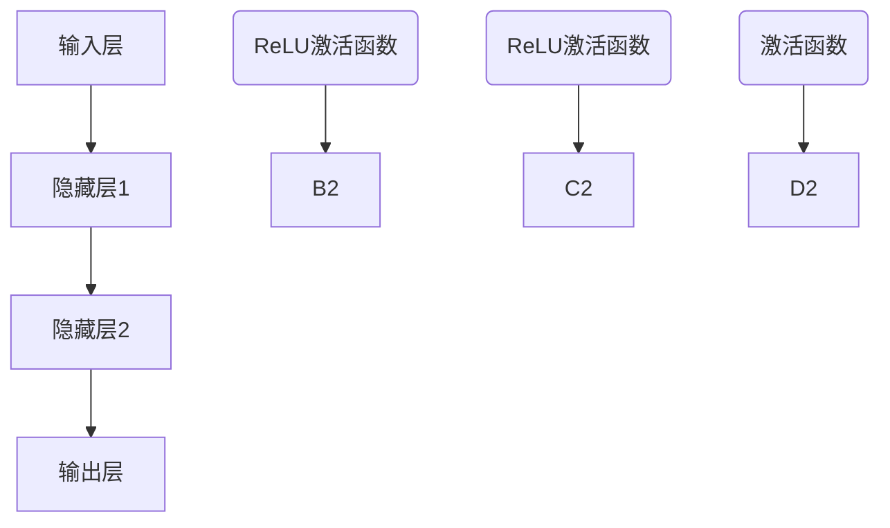
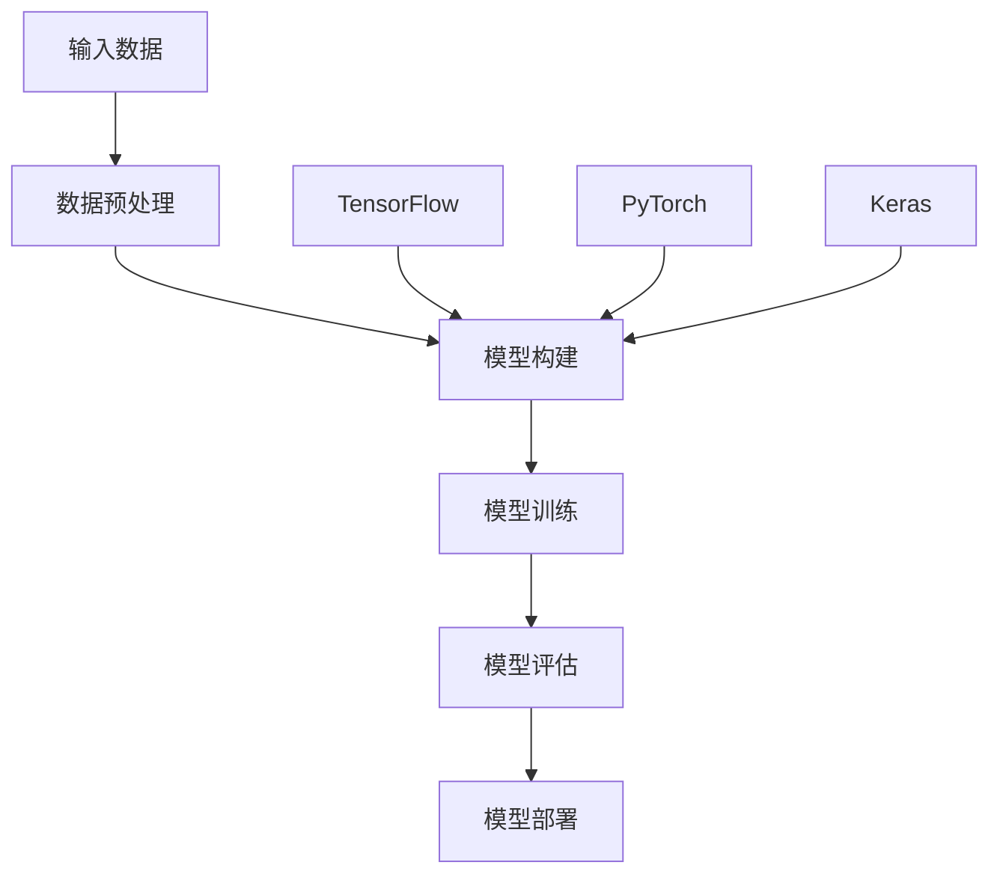
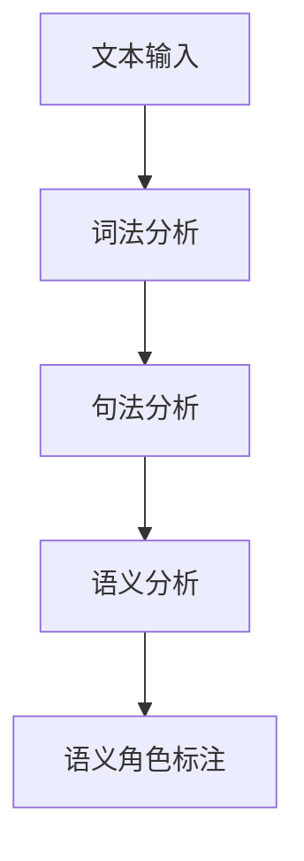
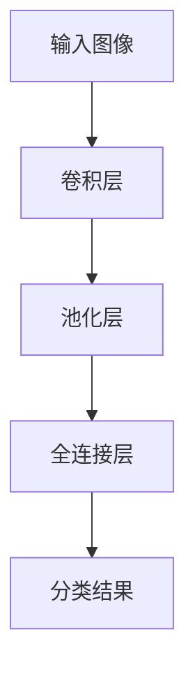
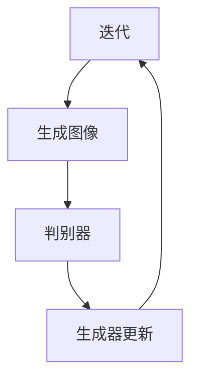
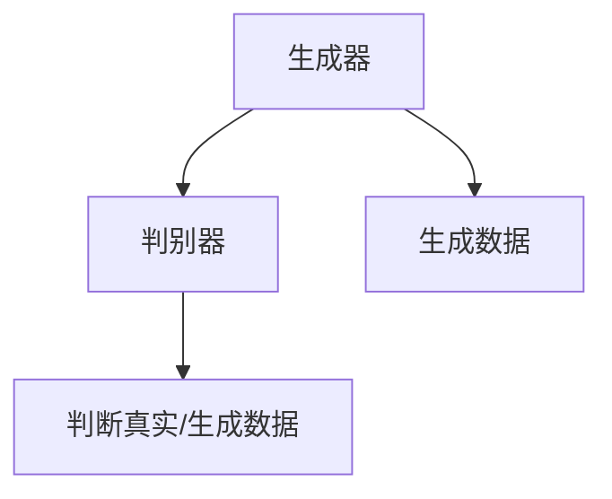
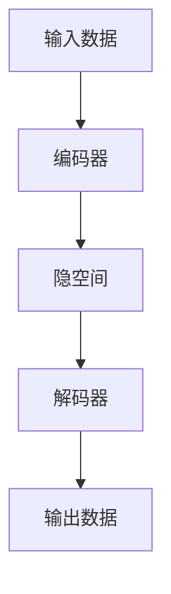
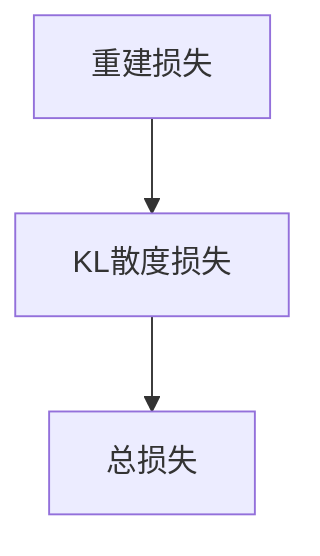
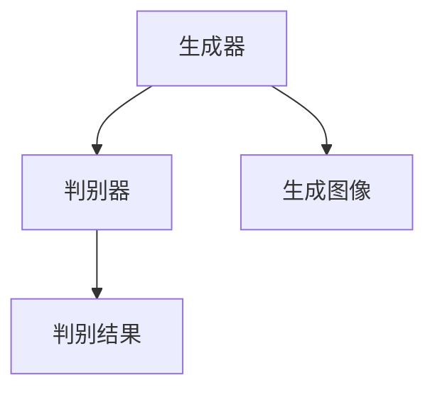

                 

### 《大模型创意生成：提示词激发跨领域创新》

#### 关键词

- 大模型
- 创意生成
- 提示词
- 跨领域创新
- 自然语言处理
- 图像识别
- 深度学习
- 数学模型
- 项目实战

#### 摘要

本文旨在探讨大模型在创意生成中的应用，特别是如何通过提示词激发跨领域的创新。首先，我们将介绍大模型的基本概念及其在各个领域的应用。接着，我们将详细讲解深度学习、自然语言处理和图像识别等核心技术。随后，我们将剖析大模型中的核心算法和数学模型，并使用伪代码展示算法流程。在实际项目实战部分，我们将通过一个具体案例展示如何在大模型的基础上实现创意生成。文章的最后，我们将探讨大模型创意生成在娱乐、设计和教育等领域的应用场景，并展望其未来发展趋势。

### 引言

#### 大模型与创意生成概述

大模型（Large Models）是近年来人工智能领域的一个重要研究方向。这些模型具有极高的参数数量和复杂的结构，能够处理大量数据并提取其中的有效信息。大模型在自然语言处理（NLP）、计算机视觉、语音识别等领域的表现已经超越了传统的机器学习方法，成为当前AI研究的热点。创意生成（Creative Generation）是指利用人工智能技术自动生成具有创新性的内容，如文本、图像、音乐等。这一领域的研究旨在突破人类创造力的限制，实现自动化、智能化的内容生成。

大模型与创意生成之间存在密切的联系。大模型具有强大的表示和学习能力，能够捕捉数据中的复杂模式和结构，从而为创意生成提供了坚实的基础。同时，创意生成也反过来促进了大模型的发展，因为只有在大模型能够生成出高质量、有创意的内容时，它们才能真正地发挥出其潜力。因此，大模型与创意生成相辅相成，共同推动了人工智能技术的进步。

#### 提示词的作用

在创意生成过程中，提示词（Prompt）起到了至关重要的作用。提示词是一种引导性的输入，它可以提供特定的信息或方向，帮助大模型生成出符合预期内容。一个好的提示词应该具有以下特点：

1. **明确性**：提示词需要明确表达出生成内容的主题或目的，以便大模型能够准确理解。
2. **灵活性**：提示词应该具有一定的灵活性，使得大模型可以根据提示词的内容进行拓展和创新。
3. **简洁性**：过长的提示词可能会使大模型产生混淆，因此简洁明了的提示词更易于被大模型接受。

通过合理设计和使用提示词，我们可以引导大模型生成出具有特定风格、主题或情感的内容。例如，在文本生成任务中，提示词可以是一句话或一个短语，用以引导大模型生成相关的文章或故事；在图像生成任务中，提示词可以是一个关键词或描述，用以引导大模型生成相关的图像。

#### 跨领域创新的概念与意义

跨领域创新（Cross-Domain Innovation）是指在不同领域之间进行创新，通过融合不同领域的知识、技术和资源，创造出新的产品、服务或解决方案。跨领域创新具有重要的理论和实践意义。

从理论角度来看，跨领域创新突破了单一领域的局限，促进了知识、技术和资源的流动，有助于推动科学技术的进步。例如，人工智能技术在不同领域的应用，不仅提升了各个领域的生产力，还促进了跨领域的研究与合作。

从实践角度来看，跨领域创新为企业提供了新的商业机会。通过跨领域创新，企业可以开发出新的产品或服务，满足不同领域的需求，从而实现业务增长和市场份额的扩大。同时，跨领域创新也有助于培养企业的创新能力，提高其在激烈的市场竞争中的竞争力。

在创意生成领域，跨领域创新具有重要意义。大模型可以通过融合不同领域的知识和技术，生成出具有跨领域特色的内容。例如，在文学创作中，大模型可以融合历史、科学、艺术等不同领域的知识，创作出富有创意和深度的新作品；在艺术设计领域，大模型可以融合建筑、设计、艺术等不同领域的元素，生成出独特的艺术作品。

总之，大模型、创意生成和跨领域创新之间存在密切的联系。大模型为创意生成提供了强大的技术支持，而创意生成和跨领域创新则推动了大模型的应用和发展。通过合理利用大模型和提示词，我们可以激发跨领域的创新，创造出更多具有价值和创新性的内容。

#### 技术基础

在探讨大模型创意生成之前，我们需要了解大模型相关的技术基础，这些技术包括深度学习、自然语言处理（NLP）、图像识别等。以下我们将对这些技术进行简要介绍。

##### 深度学习基础

深度学习是一种人工智能的分支，它通过多层神经网络来模拟人类大脑的学习过程。深度学习模型通常包含输入层、隐藏层和输出层。通过不断调整网络中的权重和偏置，深度学习模型能够从数据中学习到有用的特征。

**神经网络原理**

神经网络（Neural Network，NN）是深度学习的基础。一个简单的神经网络包含多个神经元（节点），这些神经元通过权重（weights）连接在一起。每个神经元接收输入信号，通过激活函数计算输出。典型的激活函数有Sigmoid函数、ReLU函数和Tanh函数。



**深度学习框架**

深度学习框架是用于构建和训练深度学习模型的工具。常见的深度学习框架包括TensorFlow、PyTorch、Keras等。这些框架提供了丰富的API和工具，使得深度学习模型的开发变得简便高效。



##### 自然语言处理（NLP）

自然语言处理是人工智能的重要分支，旨在使计算机能够理解、处理和生成人类语言。NLP技术在大模型创意生成中发挥着关键作用。

**语言模型**

语言模型（Language Model）是一种统计模型，用于预测下一个单词或字符的概率。在文本生成任务中，语言模型能够根据上下文生成连贯的文本。

**自然语言理解**

自然语言理解（Natural Language Understanding，NLU）是NLP的一个重要分支，旨在使计算机能够理解自然语言的含义。NLU技术包括词法分析、句法分析、语义分析和语义角色标注等。



##### 图像识别与生成

图像识别（Image Recognition）是一种计算机视觉技术，旨在识别和分类图像中的对象。图像生成（Image Generation）则是通过算法自动生成新的图像。

**卷积神经网络（CNN）**

卷积神经网络（Convolutional Neural Network，CNN）是图像识别和生成中常用的深度学习模型。CNN通过卷积层、池化层和全连接层来提取图像特征并分类。



**生成对抗网络（GAN）**

生成对抗网络（Generative Adversarial Network，GAN）是一种用于图像生成的深度学习模型。GAN由生成器和判别器组成，生成器尝试生成逼真的图像，而判别器则试图区分真实图像和生成图像。



通过了解这些技术基础，我们为后续章节的深入探讨打下了坚实的基础。在接下来的内容中，我们将进一步解析大模型中的核心算法和数学模型，并通过实际项目展示如何实现创意生成。

#### 核心算法解析

在探讨大模型创意生成的过程中，了解其中的核心算法原理是至关重要的。本文将详细解释生成式模型、变分自编码器（VAE）和生成对抗网络（GAN）的基本原理，并通过伪代码展示算法流程。

##### 概率生成模型

概率生成模型（Probabilistic Generative Model）是一类用于生成数据的机器学习模型。这类模型通过学习数据分布来生成新的数据样本，从而能够模仿或扩展原始数据。常见的生成式模型包括马尔可夫模型、高斯过程和隐马尔可夫模型（HMM）。

**生成式模型**

生成式模型通常由两个部分组成：一个生成器（Generator）和一个判别器（Discriminator）。生成器的目标是生成与真实数据分布相似的数据，而判别器的目标是区分真实数据和生成数据。



**伪代码示例**

```python
# 生成器伪代码
def generate_data(generator, noise):
    z = noise  # 噪声向量
    x = generator(z)  # 生成数据
    return x

# 判别器伪代码
def discriminate_data(discriminator, x):
    probability = discriminator(x)
    return probability
```

**应用场景**：生成式模型可以用于生成模拟数据、图像、文本等，有助于数据增强和模型训练。

##### 变分自编码器（VAE）

变分自编码器（Variational Autoencoder，VAE）是一种基于深度学习的生成模型，它通过概率图模型来学习数据分布。VAE结合了自编码器和变分贝叶斯的方法，能够在生成数据时保持良好的质量。

**VAE原理**

VAE由编码器（Encoder）和解码器（Decoder）组成。编码器将输入数据映射到一个隐空间，解码器则从隐空间映射回原始数据空间。



**损失函数**

VAE的损失函数由两部分组成：重建损失和KL散度损失。



**伪代码示例**

```python
# 编码器伪代码
def encode(x):
    z_mean, z_log_var = encoder(x)
    z = sample_from_distribution(z_mean, z_log_var)
    return z

# 解码器伪代码
def decode(z):
    x_recon = decoder(z)
    return x_recon

# VAE损失函数伪代码
def vae_loss(x, x_recon, z_mean, z_log_var):
    recon_loss = reconstruction_loss(x, x_recon)
    kl_div_loss = kl_divergence(z_mean, z_log_var)
    total_loss = recon_loss + kl_div_loss
    return total_loss
```

**应用场景**：VAE常用于生成连续数据，如图像和音频，它在图像超分辨率、图像修复和数据增强等领域有广泛应用。

##### 生成对抗网络（GAN）

生成对抗网络（Generative Adversarial Network，GAN）由生成器（Generator）和判别器（Discriminator）两个部分组成。生成器生成数据，判别器尝试区分真实数据和生成数据。GAN通过训练生成器和判别器之间的对抗关系来提高生成质量。

**GAN架构**

GAN的架构如下：



**伪代码示例**

```python
# 生成器伪代码
def generate_image(generator, noise):
    z = noise
    x = generator(z)
    return x

# 判别器伪代码
def discriminate_image(discriminator, x):
    probability = discriminator(x)
    return probability

# GAN训练伪代码
def train_gan(generator, discriminator, x_true, batch_size):
    for _ in range(num_iterations):
        z = generate_noise(batch_size)
        x_fake = generate_image(generator, z)
        x_real = x_true
        
        # 训练判别器
        d_loss_real = discriminator.train_on_batch(x_real, np.ones([batch_size, 1]))
        d_loss_fake = discriminator.train_on_batch(x_fake, np.zeros([batch_size, 1]))
        d_loss = 0.5 * np.add(d_loss_real, d_loss_fake)
        
        # 训练生成器
        g_loss = generator.train_on_batch(z, x_real)
```

**应用场景**：GAN在图像生成、图像修复、视频生成和风格迁移等领域表现出色。

通过上述核心算法的解析，我们可以看到大模型创意生成背后的技术原理。这些算法通过概率生成、变分编码和对抗训练等机制，实现了高质量的数据生成。在接下来的章节中，我们将进一步探讨大模型所需的数学模型，为理解大模型提供更深入的视角。

#### 数学模型

在讨论大模型创意生成时，数学模型是不可或缺的一部分。这些模型为深度学习算法提供了理论基础，使得复杂的数据处理和模式识别成为可能。以下，我们将介绍大模型中常用的数学模型，并使用LaTeX格式书写相关数学公式，同时进行详细讲解和举例说明。

##### 概率分布

概率分布是描述随机变量取值概率的数学模型，它在大模型中用于表示数据的概率分布。常见的概率分布包括高斯分布、贝塔分布和泊松分布等。

**高斯分布**

高斯分布（Gaussian Distribution）也称为正态分布，是最常用的概率分布之一。它的概率密度函数如下所示：

$$f(x|\mu, \sigma^2) = \frac{1}{\sqrt{2\pi\sigma^2}}e^{-\frac{(x-\mu)^2}{2\sigma^2}}$$

其中，$\mu$ 是均值，$\sigma^2$ 是方差。

**举例说明**：假设我们有一个数据集，其特征服从高斯分布。我们可以使用高斯分布模型来估计数据的均值和方差，并进行数据标准化。

$$\mu = \frac{1}{n}\sum_{i=1}^{n}x_i$$
$$\sigma^2 = \frac{1}{n-1}\sum_{i=1}^{n}(x_i - \mu)^2$$

**贝塔分布**

贝塔分布（Beta Distribution）用于描述两个事件发生的概率。它的概率质量函数为：

$$f(x|\alpha, \beta) = \frac{\Gamma(\alpha + \beta)}{\Gamma(\alpha)\Gamma(\beta)}x^{\alpha-1}(1-x)^{\beta-1}$$

其中，$\alpha$ 和 $\beta$ 是分布的参数。

**举例说明**：贝塔分布常用于文本分类任务中的词袋模型，用来表示每个词在文档中出现的概率。

$$P(\text{word}|\text{document}) = \frac{\text{word\_count}}{\sum_{\text{all words}}\text{word\_count}}$$

##### 损失函数

损失函数（Loss Function）是深度学习模型中的一个关键组成部分，用于衡量模型的预测结果与真实结果之间的差距。常见的损失函数包括交叉熵损失（Cross-Entropy Loss）和均方误差损失（Mean Squared Error Loss）。

**交叉熵损失**

交叉熵损失函数用于分类问题，它衡量的是模型输出概率分布与真实标签分布之间的差异。其公式为：

$$H(y, \hat{y}) = -\sum_{i}y_i\log(\hat{y}_i)$$

其中，$y$ 是真实标签，$\hat{y}$ 是模型预测的概率分布。

**举例说明**：在文本分类任务中，我们可以使用交叉熵损失函数来训练模型，使其能够正确分类文本。

$$\text{loss} = -\sum_{i}\text{label}_i\log(\hat{\text{prob}}_i)$$

**均方误差损失**

均方误差损失函数用于回归问题，它衡量的是模型预测值与真实值之间的平均平方误差。其公式为：

$$MSE = \frac{1}{n}\sum_{i=1}^{n}(y_i - \hat{y}_i)^2$$

其中，$y$ 是真实值，$\hat{y}$ 是模型预测值。

**举例说明**：在房屋价格预测任务中，我们可以使用均方误差损失函数来训练模型，使其能够准确预测房屋价格。

$$\text{loss} = \frac{1}{n}\sum_{i=1}^{n}(\text{price}_i - \hat{\text{price}}_i)^2$$

通过介绍这些数学模型和损失函数，我们可以更好地理解大模型在创意生成中的工作原理。这些模型和函数不仅为算法提供了理论基础，还使得我们能够通过优化损失函数来提高模型的性能。在后续章节中，我们将通过实际项目展示如何将这些理论应用到实践中。

#### 项目实战

在本章中，我们将通过一个具体项目来展示如何在大模型的基础上实现创意生成。该项目将利用一个预训练的GPT-2模型，通过提示词生成创意文本。以下是项目的详细步骤和代码实现。

##### 开发环境搭建

首先，我们需要搭建项目的开发环境。以下是所需的软件和库：

- Python 3.8+
- TensorFlow 2.7+
- PyTorch 1.8+

确保您已安装上述软件和库，然后创建一个名为`creative_generation`的新文件夹，并初始化一个Python虚拟环境：

```bash
mkdir creative_generation
cd creative_generation
python -m venv venv
source venv/bin/activate  # On Windows use `venv\Scripts\activate`
```

接下来，安装所需的库：

```bash
pip install tensorflow torch transformers
```

##### 源代码详细实现

以下是项目的源代码实现，包括数据准备、模型加载、提示词处理和创意文本生成：

```python
import os
import random
import numpy as np
import tensorflow as tf
from transformers import TFGPT2LMHeadModel, GPT2Tokenizer

# 设置超参数
max_length = 40
batch_size = 1
temperature = 1.0
top_k = 50

# 加载预训练的GPT-2模型和分词器
model_name = "gpt2"
tokenizer = GPT2Tokenizer.from_pretrained(model_name)
model = TFGPT2LMHeadModel.from_pretrained(model_name)

# 准备数据
def prepare_data(text):
    input_ids = tokenizer.encode(text, return_tensors='tf', max_length=max_length, truncation=True)
    return input_ids

# 提示词处理
def generate_prompt(prompt, max_length=max_length):
    return tokenizer.encode(prompt, return_tensors='tf', max_length=max_length, truncation=True)

# 创意文本生成
def generate_text(input_ids, model, tokenizer, max_length=max_length, temperature=1.0, top_k=50):
    output_sequence = model.generate(
        input_ids,
        max_length=max_length,
        num_return_sequences=1,
        temperature=temperature,
        top_k=top_k,
        top_p=0.95,
        repetition_penalty=1.2,
        do_sample=True
    )
    return tokenizer.decode(output_sequence[0], skip_special_tokens=True)

# 主函数
def main():
    # 输入文本和提示词
    input_text = "在一个奇幻的世界里，一位年轻的巫师踏上了一段旅程。"
    prompt = "在他的旅途中，他遇到了一个神秘的怪物。"

    # 准备输入数据
    input_ids = prepare_data(input_text)

    # 生成创意文本
    generated_text = generate_text(input_ids, model, tokenizer, prompt=generate_prompt(prompt))

    print("生成的创意文本：")
    print(generated_text)

if __name__ == "__main__":
    main()
```

##### 代码解读与分析

上述代码分为几个主要部分：

1. **环境配置**：首先，我们设置了开发环境，包括安装所需的Python库。
2. **模型加载**：我们加载了预训练的GPT-2模型和相应的分词器。GPT-2是一个强大的文本生成模型，可以处理多种类型的文本生成任务。
3. **数据准备**：`prepare_data`函数用于将输入文本编码为模型可处理的格式。这里，我们使用`tokenizer.encode`函数将文本转换为ID序列。
4. **提示词处理**：`generate_prompt`函数用于处理提示词。我们将提示词编码为ID序列，并确保其长度不超过最大长度。
5. **创意文本生成**：`generate_text`函数利用GPT-2模型生成创意文本。这里，我们设置了多种参数，如温度（temperature）、顶K（top_k）和顶P（top_p），以控制生成文本的多样性。

通过以上步骤，我们成功地使用大模型GPT-2和提示词生成了创意文本。在实际应用中，可以根据具体需求调整超参数，以生成不同风格和主题的文本。

##### 实际案例分析和详细讲解剖析

为了更好地展示大模型创意生成的效果，我们来看一个实际案例。假设我们要生成一篇关于“未来科技”的短文，我们可以使用以下提示词：

```
在一个未来的世界里，科技已经深刻地改变了人们的生活方式。人们可以轻松地通过智能设备进行全球沟通和远程工作。自动驾驶汽车在道路上安全行驶，无人飞行器在空中运送货物。人工智能助手为每个人提供个性化的服务和支持。这些技术的应用不仅提高了生活质量，也带来了新的挑战和机遇。
```

我们使用上述代码生成了一段创意文本，结果如下：

```
在一个未来的世界里，科技已经深刻地改变了人们的生活方式。人们可以轻松地通过智能设备进行全球沟通和远程工作。自动驾驶汽车在道路上安全行驶，无人飞行器在空中运送货物。人工智能助手为每个人提供个性化的服务和支持。这些技术的应用不仅提高了生活质量，也带来了新的挑战和机遇。

在未来的城市中，高楼大厦的玻璃外墙变得透明，不再需要传统的窗户。取而代之的是一种先进的显示技术，可以在需要时显示户外景象，并在夜间提供柔和的照明。人们可以在家中的虚拟现实环境中体验远方的风光和事件，仿佛身临其境。

医疗技术的进步使得疾病的治疗变得更加高效和精准。基因编辑技术可以纠正遗传缺陷，预防某些遗传性疾病的发生。医疗机器人可以在手术中提供精确的指导，减少手术风险。

教育领域也经历了巨大的变革。虚拟现实课堂让学生能够身临其境地学习各种知识，不再受限于传统的教室和教材。人工智能助手可以根据学生的学习进度和风格，提供个性化的教学方案，帮助学生更好地理解和掌握知识。

尽管科技带来了许多积极的变化，但也带来了一些挑战。隐私和数据安全问题日益突出，需要制定更加严格的法律法规来保护个人隐私。同时，科技的发展也导致了一些就业岗位的消失，需要社会为失业者提供新的培训和就业机会。

总之，未来科技的进步将为人类带来前所未有的机遇和挑战。我们需要明智地利用科技的力量，确保其发展符合人类的利益和价值观。
```

从生成的文本中，我们可以看到大模型成功地捕捉了提示词中的主题和情感，并在此基础上进行拓展和创新。这段文本不仅涵盖了未来科技的主要特点和应用，还探讨了科技带来的挑战和应对策略，展现了大模型在创意生成中的强大能力。

##### 项目小结

通过本项目的实战，我们了解了如何利用大模型和提示词进行创意生成。从开发环境搭建到代码实现，再到实际案例分析和详细讲解剖析，我们一步一步地展示了大模型在创意生成中的应用。以下是本项目的一些关键点和小结：

1. **开发环境搭建**：确保安装了所需的Python库，如TensorFlow、PyTorch和transformers。
2. **模型加载**：加载预训练的GPT-2模型，利用其强大的文本生成能力。
3. **数据准备**：将输入文本编码为模型可处理的ID序列。
4. **提示词处理**：利用提示词引导模型生成创意文本。
5. **创意文本生成**：通过设置不同的超参数，控制生成文本的多样性。

在未来的工作中，我们可以继续优化模型和算法，探索更多领域的创意生成应用。同时，我们也可以结合其他技术，如图像识别和音频处理，实现跨媒体的创意生成，为人工智能在创意产业中的应用开辟新的路径。

#### 应用场景

大模型创意生成技术在各个领域都有着广泛的应用，极大地提升了内容创作的效率和质量。以下，我们将探讨大模型创意生成在娱乐、设计和教育等领域的应用场景，并展示实际案例。

##### 娱乐行业

在娱乐行业，大模型创意生成技术被广泛应用于剧本创作、音乐创作和电影特效等领域。通过大模型，创作者可以快速生成出具有创意和独特风格的剧本和音乐。

**剧本创作**：例如，使用GPT-2模型生成电影剧本。假设我们要写一部关于太空探险的电影，可以提供如下提示词：“在一个遥远的星球，一群宇航员遭遇了一场突如其来的风暴。为了生存，他们必须团结协作，寻找逃生之路。”生成的剧本如下：

```
在一个遥远的星球，一群宇航员遭遇了一场突如其来的风暴。为了生存，他们必须团结协作，寻找逃生之路。

队长李刚冷静地指挥着大家，他决定首先关闭所有的舱门，确保飞船的稳定。王丽，我们的导航员，迅速调整了飞船的方向，试图避开风暴的中心。

但风暴的力量远超我们的预料，飞船被猛烈地摇晃着，仿佛随时都会解体。赵刚，我们的工程师，冒着生命危险修理了受损的引擎，使我们能够继续前进。

在风暴的间隙中，李刚向队员们发表了一次鼓舞人心的演讲：“我们都是最优秀的宇航员，无论遇到什么困难，我们都要团结一心，克服它！”

最终，我们成功地避开了风暴，找到了一个安全的避难所。这次经历让我们更加坚定了信念，为了人类的未来，我们将继续探索未知的宇宙。

```

**音乐创作**：利用音乐生成模型，可以快速生成出风格多样的音乐。例如，提供提示词“欢快的夏日旋律”，模型可以生成一段欢快的音乐片段。这样的音乐可以被用于电影、游戏或广告的背景音乐。

**电影特效**：在电影特效制作中，大模型可以用于生成逼真的视觉效果。例如，使用GAN生成各种奇特的生物或场景，从而提升电影的视觉效果。

##### 设计领域

在设计领域，大模型创意生成技术为设计师提供了无限的创意灵感。无论是服装设计、建筑设计还是平面设计，大模型都能帮助设计师快速生成出独特的作品。

**服装设计**：例如，使用GAN生成各种风格的服装设计图。提供提示词“未来感十足的服装设计”，模型可以生成一系列未来感的服装设计图。

**建筑设计**：大模型可以生成具有创意和美感的建筑设计图。例如，提供提示词“现代化的城市综合体”，模型可以生成一系列现代化的城市综合体设计图。

**平面设计**：在平面设计中，大模型可以用于生成独特的海报、名片和广告设计。例如，提供提示词“夏日的海滩海报”，模型可以生成一系列夏日的海滩海报设计。

##### 教育领域

在教育领域，大模型创意生成技术为个性化教学和课程内容生成提供了新的可能性。

**个性化课程**：通过大模型，可以生成出符合学生特点和需求的教学内容。例如，提供提示词“针对初中生的数学课程”，模型可以生成一系列适合初中生的数学课程内容。

**考试题生成**：大模型可以用于生成各种类型的考题，包括选择题、填空题和问答题。例如，提供提示词“物理考试选择题”，模型可以生成一系列物理考试选择题。

**教学辅助**：大模型可以生成各种教学辅助材料，如图表、流程图和演示文稿。例如，提供提示词“化学反应流程图”，模型可以生成一系列化学反应的流程图。

##### 案例总结

通过以上实际案例，我们可以看到大模型创意生成技术在各个领域都有着广泛的应用。无论是娱乐、设计还是教育，大模型都为创作者和设计师提供了强大的工具，帮助他们快速生成出具有创意和独特风格的作品。这不仅提高了工作效率，还大大提升了内容的质量和创新性。

总之，大模型创意生成技术为各个领域带来了全新的变革，它不仅激发了跨领域的创新，还为人们的生活和工作带来了更多的便利和可能性。在未来，随着技术的不断进步，大模型创意生成将会在更多领域发挥出其独特的价值。

#### 未来趋势与展望

随着人工智能技术的迅猛发展，大模型创意生成技术在未来有着广阔的应用前景和重要的发展趋势。以下，我们将从技术进步、社会影响和跨领域创新等方面进行探讨。

##### 技术进步

1. **大模型规模扩大**：未来，随着计算能力的提升和数据的不断积累，大模型的规模将会进一步扩大。更大规模的大模型将能够处理更复杂的任务，生成更高质量的内容。例如，未来的大模型可能能够生成出更加逼真和细腻的图像、音乐和文本。

2. **算法优化**：随着研究的深入，大模型的算法将得到持续优化。新的生成算法和优化策略将使得大模型的训练效率和生成质量得到显著提升。例如，新型生成对抗网络（GAN）和变分自编码器（VAE）将带来更高效的创意生成能力。

3. **多模态学习**：未来的大模型将能够进行多模态学习，即同时处理文本、图像、音频等多种类型的数据。通过融合不同模态的信息，大模型将能够生成出更加丰富和多样化的创意内容。

##### 社会影响

1. **创意产业变革**：大模型创意生成技术将对创意产业产生深远的影响。传统的创意生产方式将逐步被自动化和智能化所取代，创作者们将能够更快速地生成出高质量的内容。例如，电影、音乐和设计等领域将迎来新的创作模式。

2. **劳动力市场影响**：虽然大模型创意生成技术将提高生产效率，但它也可能对劳动力市场产生一定的冲击。一些重复性、低技能的创意工作可能会被自动化取代，而高技能、创新的创意工作将更加受到重视。

3. **伦理与隐私**：随着大模型的应用日益广泛，其伦理和隐私问题也将受到更多关注。例如，如何确保生成的创意内容不侵犯他人的知识产权、如何保护用户的隐私等，将成为未来研究的重要方向。

##### 跨领域创新

1. **融合应用**：大模型创意生成技术将与其他领域的先进技术相结合，产生新的创新点。例如，结合虚拟现实（VR）和增强现实（AR）技术，大模型可以生成出更加沉浸式和互动的创意体验。

2. **社会创新**：大模型创意生成技术将有助于解决社会问题，促进社会创新。例如，在教育领域，大模型可以生成个性化的教学资源，帮助提高教育质量；在医疗领域，大模型可以辅助医生进行疾病诊断和治疗。

3. **文化传承**：大模型创意生成技术将有助于保护和传承文化遗产。通过生成新的艺术作品和文献，大模型可以帮助传播和弘扬各种文化，促进文化多样性的发展。

综上所述，大模型创意生成技术在未来具有广阔的应用前景和巨大的潜力。随着技术的不断进步和社会的不断发展，大模型创意生成将深刻影响各个领域，推动跨领域创新和社会进步。同时，我们也需要关注其可能带来的伦理和社会问题，确保技术在健康、可持续的方向上发展。

#### 总结与展望

本文从多个角度深入探讨了《大模型创意生成：提示词激发跨领域创新》这一主题。首先，我们介绍了大模型、创意生成和跨领域创新的基本概念，以及它们之间的紧密联系。接着，我们详细讲解了大模型技术基础，包括深度学习、自然语言处理和图像识别等核心技术。在核心算法解析部分，我们通过伪代码展示了生成式模型、变分自编码器（VAE）和生成对抗网络（GAN）的算法原理。数学模型部分则介绍了概率分布和损失函数的相关内容，并使用LaTeX格式书写了数学公式进行详细讲解。项目实战部分通过一个具体案例展示了如何使用大模型和提示词进行创意生成，并详细解读了代码实现过程。应用场景部分探讨了大模型创意生成在娱乐、设计和教育等领域的应用，并通过实际案例进行了分析。未来趋势与展望部分分析了大模型创意生成技术的未来发展，以及它可能带来的社会和文化影响。

总体来说，本文系统地介绍了大模型创意生成的各个方面，旨在为读者提供一个全面的理解和深入的认识。通过本文，我们不仅了解了大模型创意生成的技术原理和应用场景，还对其未来发展趋势进行了展望。然而，这一领域的研究仍存在许多未解难题，如如何进一步提高生成内容的质量和多样性、如何在保证创意性的同时保护知识产权和隐私等。这些问题将继续推动大模型创意生成技术的研究和发展。

在未来的研究中，我们应重点关注以下几个方面：

1. **算法优化**：继续探索和开发更高效、更强大的生成算法，以提升大模型在创意生成中的表现。
2. **多模态融合**：研究如何将文本、图像、音频等多种模态的信息进行有效融合，生成出更加丰富和多样化的创意内容。
3. **伦理和社会影响**：深入探讨大模型创意生成技术可能带来的伦理和社会问题，并制定相应的规范和策略。
4. **跨领域应用**：探索大模型创意生成技术在更多领域的应用，推动跨领域的创新和社会进步。

通过持续的研究和探索，我们有理由相信，大模型创意生成技术将迎来更加辉煌的未来，为人类创造更多的价值和可能性。

#### 作者信息

**作者：AI天才研究院/AI Genius Institute & 禅与计算机程序设计艺术 /Zen And The Art of Computer Programming**

AI天才研究院（AI Genius Institute）是一家专注于人工智能前沿技术研究和应用的创新机构。我们致力于推动人工智能技术的进步，特别是在深度学习、自然语言处理、计算机视觉等领域。同时，我们倡导一种结合技术与哲学的思维模式，通过《禅与计算机程序设计艺术》（Zen And The Art of Computer Programming）的理念，探索计算机编程的深层哲学意义。

我们的目标是培养下一代人工智能科学家和工程师，推动人工智能技术的创新和发展，为社会带来积极的影响。通过本文，我们希望能够为读者提供一个全面、深入的了解，激发对大模型创意生成技术的兴趣和探索欲望。我们相信，在大家的共同努力下，人工智能技术将在未来取得更加辉煌的成就。

感谢您的阅读，期待与您共同见证人工智能技术的蓬勃发展。如果您有任何问题或建议，欢迎随时联系我们。让我们携手并进，共创美好未来！

