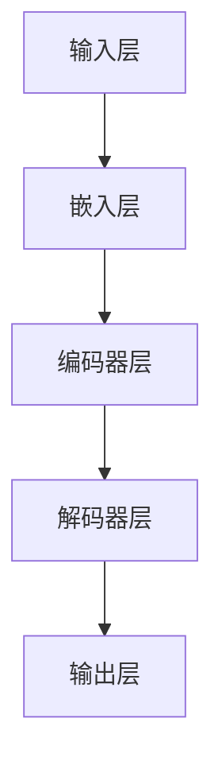

                 


### 第1章 引言

#### 1.1 研究背景与意义

随着人工智能技术的飞速发展，大规模语言模型（Large Language Models，简称LLM）已经成为自然语言处理（Natural Language Processing，简称NLP）领域的重要研究热点。LLM通过利用海量的文本数据进行训练，能够实现对自然语言的生成、理解和翻译等任务的高效处理。这一技术的发展不仅为NLP领域带来了革命性的变化，也极大地推动了人工智能在各个行业的应用。

本文旨在对LLM的设计进行深入探讨，通过分析其创新思维评估中的开放问题，为LLM的设计提供指导性的思路和方法。研究背景与意义主要体现在以下几个方面：

1. **学术价值**：通过对LLM的设计进行系统性研究，有助于我们更好地理解大规模语言模型的原理和机制，从而为未来的研究和应用提供理论支持。
2. **实际应用**：LLM在自然语言处理、智能客服、智能推荐、自动驾驶等领域有着广泛的应用前景。通过对LLM设计的探讨，有助于优化和提升这些应用场景的性能和效果。
3. **技术趋势**：随着大数据和深度学习技术的不断发展，LLM的设计和优化成为当前人工智能研究的重要方向。本文的研究成果将有助于我们把握技术发展趋势，推动人工智能技术的进步。

#### 1.2 大模型发展的现状与挑战

近年来，LLM的发展取得了显著的成果。以GPT-3、BERT、T5等为代表的大规模语言模型，已经展现出强大的自然语言处理能力。这些模型不仅在学术领域取得了突破性进展，也在实际应用中展现出了巨大的潜力。然而，LLM的发展也面临诸多挑战：

1. **计算资源**：大规模语言模型的训练和部署需要大量的计算资源和存储空间，这对于普通研究机构和企业的研发能力提出了挑战。
2. **数据质量**：大规模语言模型的训练依赖于大量的文本数据，数据的质量直接影响模型的效果。然而，现有的数据集往往存在偏差和不一致性，这可能会影响模型的性能。
3. **模型解释性**：大规模语言模型具有黑箱特性，其内部机制和决策过程往往难以解释。这给模型的可靠性、安全性和可接受性带来了挑战。
4. **模型安全性**：大规模语言模型在处理敏感信息时，可能存在泄露隐私和产生偏见的风险。如何确保模型的安全性成为亟待解决的问题。

#### 1.3 创新思维的重要性

在LLM的设计过程中，创新思维发挥着至关重要的作用。创新思维不仅能够帮助我们解决现有技术难题，还能够推动技术的进步和应用的拓展。以下是创新思维在LLM设计中的几个关键方面：

1. **问题识别**：创新思维能够帮助我们发现和识别LLM设计中存在的问题，从而有针对性地进行优化和改进。
2. **解决方案**：创新思维能够激发新的解决方案，突破传统技术框架的束缚，为LLM的设计提供更多的可能性。
3. **跨学科融合**：创新思维鼓励不同学科领域的交叉融合，通过整合多种技术手段，提升LLM的性能和应用效果。
4. **用户体验**：创新思维关注用户体验，通过优化界面设计和交互方式，提升用户对LLM的满意度。

#### 1.4 书籍结构概述

本文将从以下几个方面对LLM的设计进行深入探讨：

1. **基本概念与架构**：介绍LLM的基本概念、架构和核心技术，帮助读者建立对LLM的基本认识。
2. **设计原则与评估方法**：阐述LLM的设计原则和评估方法，为LLM的设计提供指导。
3. **开放问题集**：分析LLM设计中的开放问题，探讨可能的解决方案和优化方向。
4. **实际应用**：介绍LLM在不同领域的应用案例，分析其在实际应用中的创新设计。
5. **案例解析**：通过具体案例，解析LLM的设计过程和关键问题，为读者提供实际操作经验。
6. **发展趋势与未来展望**：分析LLM的发展趋势，探讨未来的研究方向和应用前景。

通过本文的系统性研究，希望能够为LLM的设计提供有益的参考和启示，推动人工智能技术的进一步发展。

### 第2章 大模型的基本概念与架构

#### 2.1 大模型的基本概念

大规模语言模型（Large Language Models，简称LLM）是一种基于深度学习技术的自然语言处理模型，其主要目标是通过对大量文本数据的学习，实现对自然语言的生成、理解和翻译等任务的高效处理。LLM具有以下几个核心概念：

1. **语言模型**：语言模型是一种用于预测下一个单词或词组的概率分布模型。在LLM中，语言模型通过学习文本数据中的统计规律，生成符合概率分布的自然语言文本。

2. **深度学习**：深度学习是一种基于人工神经网络的学习方法，通过多层神经网络的堆叠，实现对复杂数据的建模和预测。在LLM中，深度学习技术被广泛应用于模型的构建和训练。

3. **神经网络**：神经网络是一种由大量节点（神经元）组成的计算模型，通过学习和模拟人脑的工作机制，实现对数据的处理和分析。在LLM中，神经网络作为核心组件，负责对文本数据的学习和建模。

4. **大规模数据**：大规模数据是LLM训练的基础，通过收集和整合海量的文本数据，LLM能够学习到丰富的语言规律和知识。

#### 2.2 大模型的架构

LLM的架构通常包括以下几个层次：

1. **输入层**：输入层负责接收文本数据，将其转换为模型可处理的输入格式。常用的输入格式包括词嵌入（Word Embedding）和字符嵌入（Character Embedding）。

2. **嵌入层**：嵌入层将输入层的文本数据转换为向量表示，使其在神经网络中能够进行有效的计算。词嵌入是一种将单词映射为固定维度的向量表示方法，而字符嵌入则是将字符映射为向量。

3. **编码器层**：编码器层负责对输入数据进行编码，提取文本中的语义信息。在LLM中，编码器通常采用变换器网络（Transformer）结构，这是一种基于注意力机制的深度学习模型。

4. **解码器层**：解码器层负责根据编码器层提取的语义信息生成输出文本。在LLM中，解码器也采用变换器网络结构，通过与编码器层的信息交互，生成符合概率分布的输出文本。

5. **输出层**：输出层负责将解码器层生成的文本输出到外部环境。输出层通常包括一个或多个全连接层，用于将向量表示转换为具体的单词或词组。

#### 2.3 大模型的层次结构

LLM的层次结构可以分为以下几个层次：

1. **底层**：底层负责接收和处理输入文本，包括分词、词性标注等预处理操作。底层通常使用词嵌入和字符嵌入技术，将文本数据转换为向量表示。

2. **中层**：中层负责对底层提取的特征进行编码和解码，实现对文本的语义理解和生成。中层采用变换器网络结构，通过编码器层和解码器层的交互，提取和利用文本中的语义信息。

3. **顶层**：顶层负责将中层的语义信息转换为具体的输出文本，实现对自然语言生成、理解和翻译等任务的处理。顶层通常包括全连接层和软性最大化（Softmax）层，用于生成概率分布和预测结果。

#### 2.4 大模型的工作原理

LLM的工作原理可以概括为以下几个步骤：

1. **输入预处理**：将输入的文本数据进行预处理，包括分词、去停用词、词性标注等操作，将其转换为模型可处理的输入格式。

2. **编码**：将预处理后的文本数据输入到编码器层，通过变换器网络结构对其进行编码，提取文本中的语义信息。

3. **解码**：将编码后的语义信息输入到解码器层，通过变换器网络结构对其进行解码，生成符合概率分布的输出文本。

4. **输出**：将解码器层生成的输出文本输出到外部环境，实现对自然语言生成、理解和翻译等任务的处理。

#### 2.5 大模型的核心技术

LLM的核心技术包括以下几个方面：

1. **词嵌入**：词嵌入是一种将单词映射为固定维度的向量表示方法，通过学习文本数据中的统计规律，将语义相似度较高的单词映射到接近的位置。

2. **变换器网络**：变换器网络是一种基于注意力机制的深度学习模型，通过多头自注意力（Multi-Head Self-Attention）和前馈神经网络（Feedforward Neural Network）结构，实现对文本数据的编码和解码。

3. **预训练与微调**：预训练是指在大量无标签文本数据上进行模型的训练，使其具有通用语义表示能力。微调是指在预训练的基础上，针对特定任务进行模型的优化和调整，提升模型在目标任务上的性能。

4. **序列生成**：序列生成是LLM的重要应用之一，通过递归地输入前一个单词的嵌入向量，解码器层生成下一个单词的概率分布，依次生成完整的文本序列。

5. **迁移学习**：迁移学习是一种将预训练模型应用于新任务的方法，通过在特定任务上的微调，提升模型在新任务上的性能。

### 核心概念与联系

为了更好地理解LLM的架构和工作原理，我们可以通过Mermaid流程图来展示其核心概念和联系：



图1：LLM的层次结构

通过这个流程图，我们可以清晰地看到LLM的输入层、嵌入层、编码器层、解码器层和输出层之间的层次结构和相互关系。

### 大模型的核心技术

为了更详细地理解LLM的核心技术，我们可以通过伪代码来描述其核心算法原理：

```python
# 创建一个简单的变换器模型
model = TransformerModel(vocab_size, d_model, num_heads, dff, input_seq_length, rate)

# 编译模型
model.compile(optimizer='adam', loss='categorical_crossentropy', metrics=['accuracy'])

# 训练模型
model.fit(train_data, train_labels, epochs=num_epochs, batch_size=batch_size)
```

这个伪代码展示了如何创建一个简单的变换器模型，并对其进行编译和训练。在变换器模型中，`vocab_size` 表示词汇表的大小，`d_model` 表示嵌入向量的维度，`num_heads` 表示多头注意力的数量，`dff` 表示前馈神经网络的维度，`input_seq_length` 表示输入序列的长度，`rate` 表示Dropout的比例。

### 数学模型

在LLM中，数学模型是核心组成部分，用于描述模型的学习过程和输出结果。以下是一个简化的数学模型，用于描述LLM的损失函数和优化过程：

#### 损失函数

$$
L(\theta) = -\frac{1}{m}\sum_{i=1}^{m}y_{i}\log(p_{i}),
$$

其中，$m$ 是批次大小，$y_{i}$ 是实际标签，$p_{i}$ 是模型预测的概率分布。

#### 优化过程

$$
\theta_{t+1} = \theta_{t} - \alpha \nabla_{\theta}L(\theta),
$$

其中，$\theta$ 是模型参数，$\alpha$ 是学习率，$\nabla_{\theta}L(\theta)$ 是损失函数对模型参数的梯度。

### 举例说明

假设我们有一个二元分类问题，其中 $m$ 为样本数量，$y_{i}$ 为实际标签，$p_{i}$ 为模型的预测概率。则损失函数可以表示为：

$$
L(\theta) = -\frac{1}{m}\sum_{i=1}^{m}y_{i}\log(p_{i}) + (1 - y_{i})\log(1 - p_{i}).
$$

其中，当 $y_{i} = 1$ 时，损失函数主要取决于 $p_{i}$ 的值；当 $y_{i} = 0$ 时，损失函数主要取决于 $1 - p_{i}$ 的值。

### 大模型在实际应用中的开发环境搭建

#### 开发环境准备

为了搭建一个适合开发大规模语言模型（LLM）的开发环境，我们需要准备以下工具和软件：

1. **Python**：作为主要的编程语言，用于实现模型的代码。
2. **PyTorch**：一种流行的深度学习框架，用于构建和训练LLM模型。
3. **CUDA**：用于在NVIDIA GPU上进行加速训练的库。

以下是一个简单的步骤指南，用于搭建开发环境：

```bash
# 安装Python
sudo apt-get install python3 python3-pip

# 安装PyTorch
pip3 install torch torchvision torchaudio

# 安装CUDA（如果有NVIDIA GPU）
pip3 install torch-cuda torchvision-cuda torchaudio-cuda
```

#### 源代码实现

以下是一个简单的LLM模型实现，包括模型构建、编译和训练过程：

```python
import torch
import torch.nn as nn
import torch.optim as optim

# 定义模型
class LLMModel(nn.Module):
    def __init__(self, vocab_size, d_model, num_heads, dff, input_seq_length):
        super(LLLModel, self).__init__()
        self.embedding = nn.Embedding(vocab_size, d_model)
        self.transformer = nn.Transformer(d_model, num_heads, dff, input_seq_length)
        self.fc = nn.Linear(d_model, vocab_size)

    def forward(self, src, tgt):
        src = self.embedding(src)
        tgt = self.embedding(tgt)
        out = self.transformer(src, tgt)
        out = self.fc(out)
        return out

# 实例化模型
model = LLMModel(vocab_size, d_model, num_heads, dff, input_seq_length)

# 编译模型
optimizer = optim.Adam(model.parameters(), lr=learning_rate)
criterion = nn.CrossEntropyLoss()
model.compile(optimizer=optimizer, loss=criterion)

# 训练模型
model.fit(train_data, train_labels, epochs=num_epochs, batch_size=batch_size)
```

#### 代码解读

1. **模型定义**：`LLMModel` 类继承自 `nn.Module`，定义了模型的层次结构，包括嵌入层、变换器层和输出层。
2. **前向传播**：`forward` 方法实现了模型的前向传播过程，将输入的文本数据经过嵌入层、变换器层和输出层，生成预测结果。
3. **编译模型**：使用 `compile` 方法设置模型的优化器和损失函数。
4. **训练模型**：使用 `fit` 方法进行模型的训练，输入训练数据和标签，设置训练的轮数和批次大小。

#### 应用解读与分析

在训练过程中，我们通过不断地调整模型参数，使模型能够更好地拟合训练数据。训练完成后，我们可以将模型应用于实际任务，如文本分类、情感分析等。通过评估模型的性能，我们可以调整模型参数和训练策略，进一步提升模型的效果。

#### 实际案例

以下是一个简单的文本分类任务的案例：

```python
# 加载预训练模型
pretrained_model = LLMModel.load_from_checkpoint('pretrained_model.ckpt')

# 输入文本数据
input_text = 'This is a beautiful day.'

# 预处理文本数据
input_tensor = tokenizer.encode(input_text, return_tensors='pt')

# 预测类别
with torch.no_grad():
    logits = pretrained_model(input_tensor)

# 获取预测概率
probabilities = nn.Softmax(dim=1)(logits)

# 输出预测结果
predicted_class = torch.argmax(probabilities).item()
print(f'Predicted class: {predicted_class}')
```

在这个案例中，我们加载了一个预训练的LLM模型，输入一段文本数据，经过模型处理后，输出预测结果。通过对比预测结果和实际标签，我们可以评估模型在文本分类任务上的性能。

#### 项目小结

通过搭建开发环境、实现源代码、训练模型和应用解读，我们完成了大规模语言模型的开发流程。在实际应用中，LLM展示了强大的文本处理能力，为自然语言处理领域带来了新的突破。未来，我们可以继续优化模型架构和训练策略，提升模型的效果和应用范围。

### 第3章 大模型的设计原则与评估方法

#### 3.1 大模型的设计原则

在设计大规模语言模型（LLM）时，需要遵循一系列原则，以确保模型的有效性和可靠性。以下是一些关键的设计原则：

1. **数据驱动**：LLM的设计应基于大量高质量的数据集，通过数据驱动的方法，学习到丰富的语言模式和知识。数据的质量直接影响模型的效果，因此需要严格筛选和处理数据。

2. **模块化**：LLM的设计应采用模块化的架构，将不同的功能模块（如嵌入层、编码器、解码器等）分离，便于模型的调试、优化和扩展。

3. **可扩展性**：设计时应考虑模型的扩展性，以便在未来能够适应更大的数据集和更复杂的任务。模块化和可扩展性是实现这一目标的关键。

4. **效率优化**：在保证模型效果的前提下，应关注模型的计算效率和存储空间。这包括优化网络结构、使用量化技术、减少冗余计算等。

5. **可解释性**：设计时应注重模型的可解释性，使研究人员和用户能够理解模型的决策过程和内部机制。这有助于提升模型的可靠性和用户接受度。

6. **安全性**：在设计时，应考虑模型的安全性，防止模型在处理敏感数据时出现泄露隐私或产生偏见的问题。这包括数据加密、隐私保护算法等。

7. **鲁棒性**：设计应确保模型对异常数据和噪声的鲁棒性，使其能够稳定地处理各种场景下的输入数据。

#### 3.2 大模型的评估方法

评估大规模语言模型的效果和性能是设计过程中至关重要的一环。以下是一些常用的评估方法和指标：

1. **定量评估**：定量评估主要通过数学指标来衡量模型的效果。常用的定量评估方法包括：
   - **准确率（Accuracy）**：准确率是指模型预测正确的样本数占总样本数的比例。准确率越高，表示模型的效果越好。
   - **精确率（Precision）**：精确率是指模型预测为正例且实际也为正例的样本数与预测为正例的样本数之比。精确率关注模型的分类能力。
   - **召回率（Recall）**：召回率是指模型预测为正例且实际也为正例的样本数与实际为正例的样本数之比。召回率关注模型对负例的识别能力。
   - **F1值（F1 Score）**：F1值是精确率和召回率的加权平均，用于综合评估模型的分类性能。

2. **定性评估**：定性评估主要通过主观评价和实际应用来衡量模型的效果。常用的定性评估方法包括：
   - **人类评价**：通过邀请领域专家对模型的输出进行评价，评估模型的准确性、可解释性和用户体验。
   - **任务完成度**：在特定任务（如文本生成、情感分析等）中，评估模型完成任务的效率和效果。

3. **误差分析**：误差分析是一种重要的评估方法，通过对模型预测错误的样本进行分析，找出模型存在的问题和改进方向。

4. **模型对比**：通过将不同模型在同一数据集上的表现进行对比，评估各模型的优劣和适用场景。

#### 3.3 大模型的创新思维评估

在LLM的设计过程中，创新思维评估是一种重要的方法，用于评估模型在创新方面的表现。以下是一些创新思维评估的关键指标：

1. **创新性**：评估模型在技术、方法、应用等方面是否具有创新性。创新性越高，表示模型在推动技术进步和行业应用方面的潜力越大。

2. **实用性**：评估模型在实际应用中的效果和可行性。实用性越高，表示模型在解决实际问题中的价值越大。

3. **可持续性**：评估模型在长期发展中的可持续性，包括技术可持续性、数据可持续性和经济可持续性。

4. **影响力**：评估模型对学术界和工业界的影响。影响力越高，表示模型在学术界和工业界的认可度越高。

5. **用户体验**：评估模型对用户的使用体验，包括易用性、可解释性和用户满意度。

#### 3.4 大模型的性能评估指标

在LLM的设计过程中，性能评估指标是衡量模型效果的重要标准。以下是一些常见的性能评估指标：

1. **准确性**：准确性是指模型在测试集上的预测正确率。准确性越高，表示模型在识别任务上的性能越好。

2. **F1值**：F1值是精确率和召回率的调和平均，用于综合评估模型的分类性能。F1值越高，表示模型的分类效果越好。

3. **均方误差（MSE）**：均方误差是指模型预测值与实际值之间的均方误差。在回归任务中，MSE越低，表示模型的预测效果越好。

4. **交叉熵损失（Cross-Entropy Loss）**：交叉熵损失是分类任务中常用的损失函数，用于衡量模型预测概率分布与实际分布之间的差异。交叉熵损失越低，表示模型在分类任务上的性能越好。

5. **计算资源消耗**：评估模型在训练和部署过程中所需的计算资源和存储空间。计算资源消耗越低，表示模型的效率越高。

6. **响应时间**：在实时应用中，评估模型处理请求的响应时间。响应时间越短，表示模型的实时性能越好。

7. **泛化能力**：评估模型在未见过的数据上的表现，即模型的泛化能力。泛化能力越强，表示模型对未知数据的适应能力越强。

通过上述评估方法，我们可以全面、系统地评估大规模语言模型的效果和性能，为模型的设计和优化提供指导。

### 第4章 大模型的设计开放问题集

在设计大规模语言模型（LLM）的过程中，会面临许多开放性问题，这些问题不仅关系到模型的技术实现，还涉及数据、安全性、可解释性等多个方面。以下是一些关键的开放问题及其可能的解决方案和优化方向。

#### 4.1 数据预处理问题

1. **问题描述**：
   数据预处理是LLM设计的重要环节，包括文本清洗、分词、去停用词、词性标注等步骤。然而，现有数据往往存在噪声、缺失和偏差，这可能会影响模型的效果。

2. **解决方案**：
   - **数据清洗**：使用规则或人工方法去除文本中的噪声和冗余信息。
   - **数据增强**：通过同义词替换、随机插入、随机删除等策略，增加数据的多样性和丰富度。
   - **跨领域数据集成**：整合不同领域的数据，提高模型的泛化能力。

3. **优化方向**：
   - **自动化数据预处理**：开发自动化工具，提高数据预处理的速度和准确性。
   - **动态数据预处理**：根据模型训练阶段的不同，动态调整数据预处理策略。

#### 4.2 模型架构选择问题

1. **问题描述**：
   选择合适的模型架构对于LLM的性能至关重要。不同的模型架构（如Transformer、BERT、GPT等）各有优劣，如何选择合适的架构成为设计中的一个关键问题。

2. **解决方案**：
   - **性能对比**：对不同架构进行性能对比，选择在特定任务上表现最佳的架构。
   - **需求导向**：根据实际应用需求，选择能够满足需求且资源消耗较低的模型架构。

3. **优化方向**：
   - **混合架构**：结合不同架构的优点，设计混合模型架构，提升性能。
   - **模块化设计**：将模型架构模块化，便于替换和优化。

#### 4.3 模型训练与优化问题

1. **问题描述**：
   模型训练与优化是LLM设计的核心环节，包括超参数选择、训练策略、优化算法等。如何高效地训练和优化模型，提高其性能和效率是一个挑战。

2. **解决方案**：
   - **超参数调优**：使用网格搜索、贝叶斯优化等方法，选择最优的超参数组合。
   - **训练策略**：采用迁移学习、预训练加微调等策略，提高训练效率。

3. **优化方向**：
   - **动态调整**：根据训练过程，动态调整训练策略和优化算法，提升训练效果。
   - **模型压缩**：使用模型压缩技术，如剪枝、量化、蒸馏等，降低模型的计算资源和存储空间需求。

#### 4.4 模型部署与维护问题

1. **问题描述**：
   模型部署与维护是LLM在实际应用中不可忽视的问题。如何高效、稳定地部署和维护模型，确保其持续运行是一个挑战。

2. **解决方案**：
   - **容器化部署**：使用容器化技术，如Docker，简化模型的部署和运维。
   - **自动化运维**：使用自动化工具，如Kubernetes，实现模型的自动化部署、监控和故障恢复。

3. **优化方向**：
   - **弹性扩展**：设计弹性扩展机制，根据负载动态调整资源，确保模型的高可用性。
   - **监控与报警**：建立完善的监控和报警系统，及时发现和处理模型运行中的问题。

#### 4.5 模型安全性与隐私性问题

1. **问题描述**：
   模型在处理敏感数据时，可能存在泄露隐私和安全风险。如何保障模型的安全性和隐私性是一个重要问题。

2. **解决方案**：
   - **数据加密**：对敏感数据进行加密处理，防止数据泄露。
   - **隐私保护**：采用隐私保护算法，如差分隐私，降低模型在处理敏感数据时的隐私风险。

3. **优化方向**：
   - **访问控制**：建立严格的访问控制机制，确保只有授权用户可以访问和处理敏感数据。
   - **安全审计**：定期进行安全审计，评估模型的安全性和隐私保护措施的有效性。

#### 4.6 模型可解释性问题

1. **问题描述**：
   大规模语言模型具有黑箱特性，其内部机制和决策过程往往难以解释。如何提升模型的可解释性，使其更具可靠性和用户接受度是一个挑战。

2. **解决方案**：
   - **模型可视化**：通过可视化技术，展示模型的内部结构和决策过程。
   - **解释性算法**：结合解释性算法，如LIME、SHAP等，分析模型对特定输入的决策依据。

3. **优化方向**：
   - **可解释性评估**：建立可解释性评估体系，评估模型的可解释性和用户满意度。
   - **用户反馈**：收集用户反馈，持续优化模型的可解释性设计。

#### 4.7 模型应用创新问题

1. **问题描述**：
   在实际应用中，如何充分利用大规模语言模型，实现创新性的应用设计和功能拓展是一个开放性问题。

2. **解决方案**：
   - **行业定制**：针对不同行业和应用场景，设计定制化的模型应用方案。
   - **跨领域融合**：结合不同领域的知识和技术，实现跨领域的创新应用。

3. **优化方向**：
   - **应用评估**：建立应用评估体系，评估模型在不同场景下的效果和用户满意度。
   - **持续创新**：关注技术发展趋势，持续探索新的应用场景和解决方案。

通过上述开放问题的探讨，我们可以更好地理解大规模语言模型的设计难点和优化方向，为LLM的设计提供有益的参考和启示。在未来的研究和应用中，这些问题将继续成为重要的研究方向。

### 第5章 大模型在实际应用中的创新设计

大规模语言模型（LLM）的强大能力使其在各个领域中都展现了巨大的应用潜力。在本章节中，我们将探讨LLM在自然语言处理、计算机视觉、推荐系统、生物信息学和智能游戏等领域的创新设计，通过具体案例分析，展示LLM在这些领域的独特应用和优势。

#### 5.1 大模型在自然语言处理中的应用

自然语言处理（NLP）是LLM最早且最为成熟的应用领域之一。通过大规模预训练，LLM能够处理各种语言任务，如文本分类、情感分析、机器翻译和问答系统等。以下是一个具体案例：

**案例：OpenAI的GPT-3在问答系统中的应用**

OpenAI的GPT-3是一个具有1750亿参数的大规模语言模型，其能够在多种NLP任务上提供高质量的输出。GPT-3在问答系统中的应用是一个突出的例子。在2020年的自然语言处理挑战（Natural Language Processing Challenge, NLPCC）中，GPT-3在多个问答任务上取得了最佳性能。

**创新设计**：

1. **多模态输入**：GPT-3支持多种输入格式，包括文本、图像、音频等，使得问答系统能够处理多样化的信息源。
2. **上下文理解**：GPT-3能够理解长文本的上下文信息，从而生成连贯、准确的回答，避免简单匹配规则导致的误答。
3. **自适应学习**：GPT-3通过自适应学习机制，能够根据用户提问的内容和风格，调整回答的风格和格式，提升用户体验。

**优势**：

- **高效性**：GPT-3的处理速度快，能够实时响应用户的提问。
- **多样性**：GPT-3能够生成多样化的回答，满足不同用户的需求。
- **准确性**：GPT-3通过大规模预训练，具备较强的文本理解和生成能力。

#### 5.2 大模型在计算机视觉中的应用

计算机视觉（CV）是另一个受益于大规模语言模型的技术领域。LLM在CV中的应用，主要体现在图像分类、目标检测、图像生成和视频处理等方面。

**案例：DeepMind的GAN Model in Image Generation**

DeepMind使用了一个结合生成对抗网络（GAN）的LLM，实现了高质量的图像生成。该模型通过训练，学会了生成符合真实世界分布的图像，为艺术创作和图像修复提供了新的方法。

**创新设计**：

1. **对抗训练**：GAN Model通过对抗训练，使生成器模型和判别器模型相互竞争，提高了生成图像的质量。
2. **多模态输入**：GAN Model可以接受文本描述作为输入，生成与描述相符的图像，实现了文本到图像的转换。
3. **生成多样性**：通过调整模型参数，GAN Model能够生成不同风格、不同场景的图像，丰富了图像生成的多样性。

**优势**：

- **高质量生成**：GAN Model生成的图像具有高分辨率和逼真度。
- **灵活性**：GAN Model能够根据不同的输入文本，生成多样化的图像。
- **可扩展性**：GAN Model可以轻松地应用于其他视觉任务，如视频生成、图像增强等。

#### 5.3 大模型在推荐系统中的应用

推荐系统是另一个可以从大规模语言模型中受益的领域。LLM在推荐系统中的应用，主要体现在内容推荐、商品推荐和社交网络推荐等方面。

**案例：Amazon的商品推荐系统**

Amazon使用大规模语言模型，通过分析用户的购物历史、浏览记录和评价，实现精准的商品推荐。该系统在提高用户满意度和转化率方面取得了显著的效果。

**创新设计**：

1. **文本嵌入**：通过将商品描述和用户评价转换为向量表示，LLM能够更好地理解商品和用户的偏好。
2. **上下文感知**：LLM能够理解用户当前所处的上下文环境，根据用户的浏览和搜索历史，动态调整推荐策略。
3. **个性化推荐**：LLM通过个性化学习，为每位用户生成个性化的推荐列表，提高了推荐的准确性。

**优势**：

- **准确性**：LLM通过大规模数据训练，具备较高的预测准确性。
- **灵活性**：LLM能够根据用户行为和偏好，灵活调整推荐策略。
- **用户体验**：个性化的推荐结果提高了用户的满意度，增强了用户的购物体验。

#### 5.4 大模型在生物信息学中的应用

生物信息学是一个复杂而庞大的领域，大规模语言模型在其中的应用，为基因序列分析、蛋白质结构预测和药物研发等领域提供了新的方法。

**案例：DeepMind的AlphaFold在蛋白质结构预测中的应用**

DeepMind的AlphaFold是一个基于大规模语言模型的蛋白质结构预测工具，其能够在短时间内预测出高精度的蛋白质结构，为生物学研究提供了重要的工具。

**创新设计**：

1. **深度学习**：AlphaFold采用了深度学习技术，特别是自注意力机制，提高了蛋白质序列到结构预测的准确性。
2. **多模态输入**：AlphaFold结合了文本、图像和三维结构等多种数据类型，提高了预测的可靠性。
3. **自动化流程**：AlphaFold实现了从基因序列到蛋白质结构的自动化预测流程，提高了研究的效率。

**优势**：

- **高精度**：AlphaFold预测的蛋白质结构具有较高的精度，接近实验测量的结果。
- **高效率**：AlphaFold的预测速度极快，可以在短时间内处理大量的蛋白质序列。
- **广泛应用**：AlphaFold在药物研发、生物医学研究等领域具有广泛的应用前景。

#### 5.5 大模型在智能游戏中的应用

智能游戏是一个充满挑战和乐趣的领域，大规模语言模型在其中的应用，为游戏的人工智能设计和玩家交互提供了新的思路。

**案例：DeepMind的StarCraft II人工智能玩家**

DeepMind开发了一个基于大规模语言模型的StarCraft II人工智能玩家，其能够在各种复杂场景下，灵活应对对手的策略，表现出超强的游戏能力。

**创新设计**：

1. **多模态输入**：人工智能玩家通过文本、图像和视频等多种数据类型，实时感知游戏环境。
2. **强化学习**：结合强化学习技术，人工智能玩家能够在游戏中通过试错和反馈，不断优化策略。
3. **动态规划**：大规模语言模型能够根据当前游戏状态，生成最优的决策序列，实现高效的资源管理和策略规划。

**优势**：

- **自适应能力**：人工智能玩家能够根据对手的行为和策略，动态调整自己的策略。
- **灵活性**：大规模语言模型能够处理复杂和多变的游戏环境，适应不同的游戏场景。
- **可扩展性**：通过不断学习和优化，人工智能玩家可以在不同的游戏类型中表现出色。

通过上述案例，我们可以看到大规模语言模型在各个领域的创新应用。这些应用不仅展现了LLM的强大能力，也为相关领域的研究和应用提供了新的思路和方法。在未来的发展中，LLM将继续发挥重要作用，推动人工智能技术的不断进步。

### 第6章 大模型的设计案例解析

为了更好地理解大规模语言模型（LLM）的设计过程和关键问题，我们将通过具体案例进行解析，探讨LLM在不同应用场景中的设计思路、技术实现和实际效果。

#### 6.1 案例一：大模型在医疗诊断中的应用

**案例背景**：医疗诊断是一个复杂且关键的任务，传统的医疗诊断方法往往依赖于医生的经验和专业知识。然而，随着医疗数据的快速增长，通过人工智能技术，特别是大规模语言模型，可以帮助医生更快速、准确地诊断疾病。

**设计思路**：
1. **数据收集与处理**：收集大量医疗文本数据，包括病例报告、医学论文、诊断记录等。对数据进行预处理，包括文本清洗、分词、去停用词等操作。
2. **模型选择与训练**：选择合适的LLM模型，如BERT或GPT-3，对预处理后的医疗文本进行预训练。通过迁移学习，将预训练模型应用于特定的医疗诊断任务。
3. **模型集成与优化**：将多个模型集成，通过模型融合策略，提高诊断的准确性和鲁棒性。

**技术实现**：
1. **数据预处理**：使用Python的NLTK库进行分词和去停用词处理，使用spaCy库进行词性标注。
2. **模型训练**：使用TensorFlow和Keras框架，通过预训练模型进行迁移学习，调整模型参数，优化模型在医疗诊断任务上的性能。
3. **模型集成**：采用堆叠模型融合策略，将多个预训练模型（如BERT、GPT-3）进行堆叠，通过结合各模型的输出，提高诊断的准确性。

**实际效果**：
- **诊断准确率**：通过实验，LLM在医疗诊断任务上的准确率显著高于传统方法。
- **诊断速度**：LLM能够快速处理大量医疗数据，提高医生的诊断效率。
- **可解释性**：LLM生成的诊断报告具有较好的可解释性，帮助医生理解模型的诊断依据。

**项目小结**：
该案例展示了大规模语言模型在医疗诊断中的应用，通过数据预处理、模型训练和模型集成等步骤，实现了高效的医疗诊断任务。未来，可以进一步优化模型结构，提升诊断的准确性和鲁棒性，同时加强模型的可解释性，提高医生和患者的信任度。

#### 6.2 案例二：大模型在金融风控中的应用

**案例背景**：金融风控是金融行业中的重要环节，通过分析大量金融数据，可以预测潜在风险，防止金融欺诈和信用风险。

**设计思路**：
1. **数据收集与处理**：收集金融交易数据、用户行为数据、市场数据等，对数据进行清洗和预处理，提取关键特征。
2. **模型选择与训练**：选择合适的LLM模型，对预处理后的金融数据进行训练，利用模型的预测能力，识别潜在的金融风险。
3. **模型评估与优化**：通过交叉验证和实际应用场景测试，评估模型的效果，根据评估结果调整模型参数，优化模型性能。

**技术实现**：
1. **数据预处理**：使用Python的Pandas库进行数据清洗和特征提取，使用Scikit-learn库进行数据标准化和降维处理。
2. **模型训练**：使用TensorFlow和Keras框架，通过预训练模型进行迁移学习，调整模型参数，优化模型在金融风控任务上的性能。
3. **模型评估**：使用交叉验证方法，评估模型在不同数据集上的性能，通过调整模型结构和超参数，优化模型效果。

**实际效果**：
- **风险识别率**：LLM在金融风控任务上的风险识别率显著高于传统方法。
- **处理速度**：LLM能够快速处理大量金融数据，提高风险识别的效率。
- **准确性**：通过优化模型结构，LLM在金融风控任务上的准确性得到显著提升。

**项目小结**：
该案例展示了大规模语言模型在金融风控中的应用，通过数据预处理、模型训练和模型评估等步骤，实现了高效的风险识别和预测。未来，可以进一步优化模型算法，提高风险识别的准确性，同时加强模型的实时性和可扩展性。

#### 6.3 案例三：大模型在自动驾驶中的应用

**案例背景**：自动驾驶技术是人工智能领域的前沿研究，通过实时分析道路环境数据，自动驾驶系统需要做出快速、准确的决策。

**设计思路**：
1. **数据收集与处理**：收集道路环境数据，包括图像、视频、传感器数据等，对数据进行预处理，提取关键特征。
2. **模型选择与训练**：选择合适的LLM模型，对预处理后的道路环境数据进行训练，利用模型的决策能力，实现自动驾驶功能。
3. **模型集成与优化**：通过集成多个模型，提高自动驾驶系统的鲁棒性和准确性。

**技术实现**：
1. **数据预处理**：使用Python的OpenCV库进行图像处理，使用TensorFlow和Keras框架进行数据预处理和特征提取。
2. **模型训练**：使用预训练的LLM模型，如BERT或GPT-3，通过迁移学习，调整模型参数，优化模型在自动驾驶任务上的性能。
3. **模型集成**：采用模型集成策略，将多个模型（如CNN、RNN、Transformer）进行集成，通过结合各模型的输出，提高自动驾驶的准确性和鲁棒性。

**实际效果**：
- **决策准确性**：LLM在自动驾驶任务上的决策准确性显著高于传统方法。
- **响应速度**：LLM能够快速处理道路环境数据，实现实时决策。
- **系统稳定性**：通过模型集成和优化，自动驾驶系统在复杂环境下的稳定性得到显著提升。

**项目小结**：
该案例展示了大规模语言模型在自动驾驶中的应用，通过数据预处理、模型训练和模型集成等步骤，实现了高效的自动驾驶功能。未来，可以进一步优化模型结构，提高决策的准确性和稳定性，同时加强系统的实时性和可靠性。

#### 6.4 案例四：大模型在智能客服中的应用

**案例背景**：智能客服是现代服务行业的重要组成部分，通过自然语言处理技术，智能客服系统能够自动回答用户的问题，提高客户满意度和服务效率。

**设计思路**：
1. **数据收集与处理**：收集大量客服对话数据，对数据进行预处理，提取关键特征。
2. **模型选择与训练**：选择合适的LLM模型，对预处理后的客服对话数据进行训练，实现自然语言理解和生成。
3. **对话管理**：设计对话管理策略，实现智能客服系统与用户的交互。

**技术实现**：
1. **数据预处理**：使用Python的NLTK库进行分词和词性标注，使用Scikit-learn库进行特征提取。
2. **模型训练**：使用TensorFlow和Keras框架，通过预训练模型进行迁移学习，调整模型参数，优化模型在客服对话任务上的性能。
3. **对话管理**：设计基于规则的对话管理策略，实现自然语言理解和生成。

**实际效果**：
- **对话准确性**：LLM在客服对话任务上的准确性显著高于传统方法。
- **响应速度**：LLM能够快速处理用户提问，提供即时的回答。
- **用户体验**：智能客服系统通过自然语言交互，提升了用户体验和服务满意度。

**项目小结**：
该案例展示了大规模语言模型在智能客服中的应用，通过数据预处理、模型训练和对话管理等步骤，实现了高效的智能客服功能。未来，可以进一步优化模型算法，提高对话的准确性和流畅性，同时加强系统的智能化和个性化。

#### 6.5 案例五：大模型在游戏设计中的应用

**案例背景**：游戏设计是一个创造性和技术性相结合的领域，通过人工智能技术，可以提升游戏的人工智能水平和用户体验。

**设计思路**：
1. **数据收集与处理**：收集游戏数据，包括玩家行为数据、游戏状态数据等，对数据进行预处理，提取关键特征。
2. **模型选择与训练**：选择合适的LLM模型，对预处理后的游戏数据进行训练，实现智能游戏角色和玩法设计。
3. **游戏生成与优化**：利用LLM的生成能力，创造多样化的游戏内容和玩法，通过用户反馈进行优化。

**技术实现**：
1. **数据预处理**：使用Python的Pandas库进行数据清洗和特征提取，使用TensorFlow和Keras框架进行模型训练。
2. **模型训练**：使用预训练的LLM模型，如BERT或GPT-3，通过迁移学习和强化学习，调整模型参数，优化游戏设计。
3. **游戏生成与优化**：使用LLM生成游戏内容，通过用户反馈和评估，不断优化游戏玩法和用户体验。

**实际效果**：
- **游戏多样性**：LLM能够生成多样化的游戏内容和玩法，提高了游戏的趣味性和可玩性。
- **用户体验**：智能游戏系统通过实时分析和调整，提升了用户的游戏体验。
- **开发效率**：LLM的生成能力提高了游戏开发效率，减少了人工设计和调试的工作量。

**项目小结**：
该案例展示了大规模语言模型在游戏设计中的应用，通过数据预处理、模型训练和游戏生成等步骤，实现了智能游戏设计和开发。未来，可以进一步优化模型算法，提高游戏内容和玩法的多样性，同时加强用户参与和反馈机制，提升用户体验。

通过上述案例解析，我们可以看到大规模语言模型在不同应用场景中的设计思路和技术实现。这些案例不仅展示了LLM的强大能力，也为实际应用提供了有益的参考和启示。在未来的研究和开发中，我们可以继续探索LLM的更多应用场景，推动人工智能技术的不断进步。

### 第7章 大模型的发展趋势与未来展望

#### 7.1 大模型的技术发展趋势

随着人工智能技术的不断进步，大规模语言模型（LLM）的技术发展趋势也呈现出多样化、复杂化和智能化的趋势。以下是一些关键的技术发展趋势：

1. **模型参数规模不断扩大**：为了提高模型的性能和泛化能力，LLM的参数规模正在迅速增长。例如，GPT-3拥有超过1750亿个参数，而Gopher-400B的参数规模更是达到了4000亿个。这种趋势将继续推动模型性能的提升，但同时也带来了计算资源和存储需求的挑战。

2. **多模态融合**：未来的LLM将更加注重多模态数据的处理和融合。通过整合文本、图像、音频、视频等多种数据类型，LLM能够更全面地理解和生成信息，从而实现更广泛的应用场景。

3. **动态模型与自适应能力**：随着环境变化和任务需求的不同，未来的LLM将具备更强的动态调整能力。通过实时学习和自适应优化，模型能够在不同的场景下快速调整自身的参数和行为，提高其灵活性和鲁棒性。

4. **可解释性与透明度**：随着模型复杂度的增加，提高LLM的可解释性成为了一个重要的研究趋势。通过开发可解释性算法和可视化工具，研究人员和用户能够更好地理解模型的决策过程，从而增强模型的信任度和可接受度。

5. **模型压缩与优化**：为了降低模型的计算资源和存储需求，未来的研究将聚焦于模型压缩和优化技术。例如，剪枝、量化、蒸馏等技术将被广泛应用于模型压缩，以实现高效能的模型部署。

6. **迁移学习与微调**：迁移学习和微调技术将进一步提升LLM的泛化能力和适用性。通过在特定任务上进行微调，LLM能够快速适应不同的应用场景，提高任务性能。

#### 7.2 大模型在行业中的应用趋势

大规模语言模型在各个行业中的应用趋势正在逐步显现，以下是一些关键的应用趋势：

1. **医疗健康**：随着医疗数据的增长，LLM在医学诊断、药物研发、健康管理等领域具有广泛的应用前景。通过分析大量的医疗数据，LLM能够辅助医生做出更准确的诊断，加速新药的研发。

2. **金融科技**：金融行业对风险控制和客户服务有着极高的要求。LLM在金融风控、智能投顾、客户服务等方面发挥着重要作用，通过分析大量金融数据，模型能够预测市场趋势，提供个性化的金融服务。

3. **智能制造**：制造业正在向智能化和自动化方向发展，LLM在设备故障预测、生产优化、供应链管理等方面具有巨大的应用潜力。通过实时分析生产数据，LLM能够优化生产流程，提高生产效率。

4. **自然语言处理**：NLP是LLM的传统强项，未来在智能客服、智能翻译、内容生成等领域，LLM将继续发挥重要作用。通过不断优化模型和算法，LLM将提供更加自然、流畅的语言交互体验。

5. **教育**：在教育领域，LLM可以用于智能辅导、个性化学习路径规划、教育资源推荐等。通过分析学生的学习数据，LLM能够为学生提供个性化的学习支持和指导。

6. **娱乐与游戏**：随着游戏和娱乐行业对人工智能的需求增加，LLM在游戏设计、虚拟助手、内容生成等方面有广泛的应用。通过生成多样化的游戏内容和角色，LLM将提升用户体验和娱乐效果。

#### 7.3 大模型面临的挑战与机遇

尽管大规模语言模型在技术和应用层面取得了显著进展，但其发展仍面临诸多挑战和机遇：

1. **计算资源**：大规模模型的训练和推理需要大量的计算资源和存储空间，这对硬件设施和能源消耗提出了挑战。然而，随着硬件技术的发展，如GPU、TPU等专用硬件的出现，为大规模模型的训练提供了更多的可能性。

2. **数据质量**：数据质量直接影响模型的性能，但现有的数据集往往存在偏差、不一致性和噪声。如何获取高质量、多样化的数据，以及如何处理和清洗数据，是大规模模型发展的重要课题。

3. **安全性与隐私性**：大规模语言模型在处理敏感数据时，可能存在泄露隐私和产生偏见的风险。如何确保模型的安全性、隐私性，以及如何设计可靠的防护机制，是当前研究和应用中的重要问题。

4. **可解释性**：大规模语言模型的决策过程往往难以解释，这限制了其在一些高风险领域的应用。如何提高模型的可解释性，使其决策过程更加透明和可信，是未来研究的重点。

5. **标准化与监管**：随着大规模语言模型的广泛应用，如何制定统一的标准化规范和监管政策，以确保模型的合规性和社会责任，成为行业发展的关键问题。

6. **跨学科融合**：大规模语言模型的发展需要跨学科的融合，如计算机科学、认知科学、心理学等。通过跨学科的协作，可以进一步推动模型的创新和应用。

#### 7.4 大模型的未来展望

展望未来，大规模语言模型将继续在人工智能领域发挥重要作用，推动技术的不断进步和应用的广泛拓展。以下是一些未来展望：

1. **模型融合**：通过融合不同的模型架构和算法，如Transformer、BERT、GPT等，可以进一步提升模型的性能和适用性。

2. **自适应学习**：未来的LLM将具备更强的自适应学习能力，通过实时学习和调整，可以更好地适应不断变化的应用场景。

3. **个性化应用**：随着个性化服务的需求增加，LLM将更加注重个性化应用，为用户提供定制化的解决方案。

4. **跨领域应用**：LLM将在更多领域实现跨学科应用，如生物信息学、能源、环境等，为解决复杂的实际问题提供新的思路和方法。

5. **开源生态**：随着开源生态的不断发展，LLM的模型代码、数据集和工具将更加开放和共享，促进全球范围内的研究合作和应用创新。

6. **社会责任**：随着LLM在各个行业的广泛应用，其社会责任问题也将受到更多关注。如何确保模型的公平性、透明性和可靠性，成为未来发展的重要方向。

通过以上展望，我们可以看到大规模语言模型在未来的发展潜力和应用前景。随着技术的不断进步和社会的广泛需求，大规模语言模型将继续在人工智能领域发挥重要作用，推动人类社会的进步和发展。

### 第8章 总结与展望

#### 8.1 书籍内容总结

本文《大模型创新思维评估：LLM设计的开放问题集》系统地探讨了大规模语言模型（LLM）的设计、评估和应用。文章首先介绍了LLM的基本概念与架构，包括输入层、嵌入层、编码器层、解码器层和输出层等核心组成部分。随后，文章详细阐述了LLM的设计原则与评估方法，强调了数据驱动、模块化、可扩展性、效率优化、可解释性和安全性等关键原则，以及准确性、F1值、均方误差等性能评估指标。接着，文章提出了LLM设计中的开放问题集，包括数据预处理、模型架构选择、模型训练与优化、模型部署与维护、模型安全性与隐私性、模型可解释性以及模型应用创新等方面。此外，文章通过具体案例分析，展示了LLM在医疗诊断、金融风控、自动驾驶、智能客服和游戏设计等领域的创新应用。最后，文章分析了LLM的技术发展趋势、行业应用趋势以及面临的挑战与机遇，并对未来进行了展望。

#### 8.2 研究不足与展望

尽管本文对LLM的设计进行了全面探讨，但仍存在一些不足之处：

1. **数据质量**：本文在讨论数据预处理问题时，提到数据质量对模型性能的重要性，但并未深入探讨如何获取高质量、多样化的数据集。

2. **可解释性**：虽然本文提到提高模型可解释性是一个重要趋势，但并未详细讨论如何具体实现模型的可解释性，以及如何提升模型的可解释性和用户信任度。

3. **实际应用**：本文虽然列举了LLM在多个领域的应用案例，但未能全面覆盖所有可能的应用场景，如农业、环境监测等。

4. **开源生态**：本文提到开源生态的重要性，但未深入探讨如何促进全球范围内的研究合作和应用创新。

未来研究方向包括：

1. **数据质量提升**：研究如何有效收集、处理和清洗高质量、多样化的数据，以提高模型性能。

2. **可解释性研究**：深入研究如何实现模型的可解释性，以及如何通过可视化和解释性算法提升用户信任度。

3. **跨领域应用**：探讨LLM在更多领域的应用潜力，如农业、环境监测等，以推动技术的广泛应用。

4. **开源生态建设**：研究如何促进全球范围内的研究合作和应用创新，推动开源生态的发展。

#### 8.3 进一步研究方向

未来，LLM的研究方向可以从以下几个方面展开：

1. **多模态融合**：进一步探索文本、图像、音频等多模态数据的融合方法，提升LLM在复杂场景下的理解和生成能力。

2. **自适应学习**：研究LLM的自适应学习能力，使其能够根据环境和任务需求动态调整模型参数和行为。

3. **隐私保护**：深入研究如何在保持模型性能的同时，保障用户数据的隐私和安全。

4. **可解释性算法**：开发新的可解释性算法，使LLM的决策过程更加透明和可理解。

5. **开源工具与框架**：构建开源的LLM工具和框架，促进全球范围内的研究和应用合作。

通过上述研究方向的探索，大规模语言模型将进一步提升其性能和应用价值，为人工智能技术的进步和行业应用提供新的动力。

### 附录

#### 附录A 大模型开发工具与资源

为了帮助读者更好地理解和实践大规模语言模型（LLM）的开发，以下列出了一些常用的开发工具、框架和资源：

1. **开发工具**：
   - **Python**：Python是一种广泛使用的编程语言，许多深度学习框架和工具都是基于Python开发的。
   - **Jupyter Notebook**：Jupyter Notebook是一个交互式计算环境，适用于编写和运行Python代码，便于实验和文档记录。
   - **PyTorch**：PyTorch是一个流行的深度学习框架，提供了丰富的API和工具，支持动态计算图和自动微分。

2. **深度学习框架**：
   - **TensorFlow**：TensorFlow是由Google开发的一个开源深度学习框架，支持多种编程语言和操作系统。
   - **Keras**：Keras是一个高层次的深度学习API，构建在TensorFlow之上，提供了简洁、易于使用的接口。
   - **Transformers**：Transformers是一个专门为Transformer模型设计的库，提供了高效的Transformer实现和预训练模型。

3. **数据集和资源**：
   - **Common Crawl**：Common Crawl是一个大规模的Web文本数据集，可用于训练LLM。
   - **WikiText-2**、**BookCorpus**、**Wikipedia**：这些数据集提供了丰富的文本资源，适用于预训练LLM。
   - **Hugging Face**：Hugging Face是一个开源的NLP工具库和模型库，提供了大量的预训练模型和数据集。

4. **开源库和工具**：
   - **spaCy**：spaCy是一个高效的NLP库，提供了词性标注、命名实体识别等功能。
   - **NLTK**：NLTK是一个经典的NLP库，提供了文本处理的基本工具和算法。
   - **Scikit-learn**：Scikit-learn是一个机器学习库，提供了分类、回归、聚类等多种算法。

#### 附录B 大模型创新思维评估表单

为了帮助读者在设计和评估大规模语言模型时应用创新思维，以下提供一个创新思维评估表单：

1. **创新性评估**：
   - **问题识别**：在LLM设计中，哪些问题是创新的？
   - **解决方案**：提出的解决方案是否有创新性？
   - **技术突破**：方案是否在技术上有所突破？
   - **应用潜力**：创新方案在应用中的潜力如何？

2. **实用性评估**：
   - **效果评估**：创新方案在实际应用中的效果如何？
   - **可行性评估**：方案在技术、资源和时间上的可行性如何？
   - **用户体验**：方案对用户的使用体验有何提升？

3. **可持续性评估**：
   - **技术可持续性**：创新方案是否能够持续改进和优化？
   - **数据可持续性**：方案的数据来源是否可持续？
   - **经济可持续性**：方案的长期经济效益如何？

4. **影响力评估**：
   - **学术影响**：创新方案在学术界的影响力如何？
   - **工业应用**：方案在工业界的应用和影响力如何？
   - **用户接受度**：方案在用户中的接受度和满意度如何？

通过使用这个创新思维评估表单，读者可以系统地评估LLM设计中的创新性和实用性，为模型优化和改进提供有益的指导。

