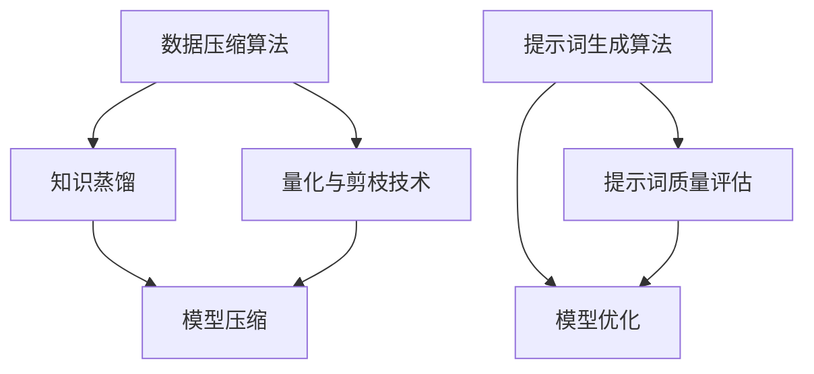

                 

### 文章标题

《大模型压缩技术与提示词优化》

关键词：大模型压缩、提示词优化、算法原理、Mermaid流程图、项目实战

摘要：本文深入探讨大模型压缩技术与提示词优化技术，从背景介绍、核心概念与联系、算法原理讲解、数学模型和公式、项目实战等多方面展开，旨在为读者提供全面的技术解析和实践指导。文章首先介绍大模型压缩技术的应用背景和意义，然后详细阐述压缩技术的分类及其工作原理。接着，文章重点关注提示词优化技术，包括其定义、方法、评估指标等方面。最后，通过实际案例展示大模型压缩与提示词优化的结合应用，为读者提供实战经验和最佳实践建议。

### 1.1 背景介绍

随着人工智能技术的飞速发展，深度学习模型在各个领域取得了显著的成果。然而，这些模型通常具有庞大的参数规模和计算量，导致其训练和推理过程需要大量的计算资源和时间。为了解决这一问题，大模型压缩技术应运而生。大模型压缩技术旨在通过各种方法减小模型的参数规模和计算量，从而提高模型的推理速度和降低计算成本。

在大模型压缩技术的应用背景下，提示词优化技术同样扮演着重要角色。提示词（Prompt）是预训练模型中的一种技术，通过提供针对性的提示信息，可以引导模型更好地理解和生成目标内容。提示词优化技术旨在提高提示词的质量和效果，从而提升模型的生成能力。

本文将系统地介绍大模型压缩技术与提示词优化技术，从背景、核心概念、算法原理、数学模型和公式、项目实战等多个方面进行详细讲解。通过本文的阅读，读者可以全面了解这两种技术的原理和应用，为实际项目中的模型压缩和优化提供有益的参考。

### 1.2 核心概念与联系

在大模型压缩和提示词优化领域，有多个核心概念和原理需要理解。为了更好地梳理这些概念之间的关系，我们可以通过一个Mermaid流程图来展示它们之间的联系。

首先，我们来看大模型压缩技术的核心概念：

1. **数据压缩算法**：数据压缩算法是指通过各种技术手段减小原始数据的大小，以减少存储和传输的负担。常见的压缩算法包括无损压缩和有损压缩。
2. **知识蒸馏**：知识蒸馏是一种模型压缩技术，通过将一个大模型的知识迁移到一个较小模型中，从而实现参数规模的减小。该过程通常包括两个阶段：编码器阶段和压缩器阶段。
3. **量化与剪枝技术**：量化技术通过减少模型参数的精度来减小模型大小，而剪枝技术通过删除模型中不必要的权重来降低模型复杂度。

接下来，我们来看提示词优化技术的核心概念：

1. **提示词生成算法**：提示词生成算法是指通过算法生成提示词，以引导模型生成目标内容。常见的生成算法包括模板生成和随机生成。
2. **提示词质量评估**：提示词质量评估是指通过评估方法判断提示词的质量。常用的评估指标包括内容相关性、生成质量、生成速度等。

下面是一个Mermaid流程图，展示了这些核心概念和原理之间的关系：



通过这个Mermaid流程图，我们可以清晰地看到数据压缩算法、知识蒸馏、量化与剪枝技术以及提示词生成算法和提示词质量评估在大模型压缩和提示词优化中的作用和关系。

### 1.3 大模型压缩技术原理讲解

#### 数据压缩算法

数据压缩算法是减小数据大小的一种技术手段，广泛应用于图像、音频和视频等数据领域。根据压缩过程中是否丢失信息，数据压缩算法可以分为无损压缩和有损压缩。

1. **无损压缩**：

   无损压缩算法在压缩过程中不丢失任何信息，可以完全恢复原始数据。常见的无损压缩算法包括：

   - **Huffman编码**：通过构建Huffman树，将频率较高的字符赋予较短的编码，频率较低的字符赋予较长的编码，从而实现数据压缩。
   - **Run-Length编码（RLE）**：将连续出现的相同数据值用单个值和重复次数表示，从而实现数据压缩。
   - **LZ77和LZ78算法**：通过查找重复子串，将重复的子串用索引表示，从而实现数据压缩。

2. **有损压缩**：

   有损压缩算法在压缩过程中会丢失部分信息，但可以显著减小数据大小。常见的有损压缩算法包括：

   - **JPEG压缩**：通过量化变换和离散余弦变换（DCT）实现图像压缩，对图像的某些频率成分进行舍去或近似。
   - **MP3压缩**：通过对音频信号进行傅里叶变换，将音频信号转换成频率域表示，然后对某些频率成分进行舍去或近似，从而实现音频压缩。

#### 知识蒸馏

知识蒸馏（Knowledge Distillation）是一种模型压缩技术，通过将一个大模型（教师模型）的知识迁移到一个较小模型（学生模型）中，从而实现参数规模的减小。知识蒸馏的过程通常包括两个阶段：

1. **编码器阶段**：

   编码器阶段将输入数据通过教师模型编码成特征表示。这些特征表示包含教师模型对输入数据的理解和知识。

2. **压缩器阶段**：

   压缩器阶段使用学生模型来学习教师模型的特征表示。学生模型通常是一个较小的模型，其参数数量远小于教师模型。通过学习教师模型的特征表示，学生模型可以继承教师模型的知识和表达能力。

知识蒸馏的过程可以用以下伪代码表示：

```python
def knowledge_distillation(input_data, teacher_model, student_model):
    # 编码器阶段
    teacher_features = teacher_model.encode(input_data)
    
    # 压缩器阶段
    student_features = student_model.encode(input_data)
    student_model.update(student_features, teacher_features)
```

#### 量化与剪枝技术

量化（Quantization）和剪枝（Pruning）技术是两种常用的模型压缩技术，通过减少模型参数的精度和去除不必要的权重，实现模型大小的减小。

1. **量化技术**：

   量化技术通过减少模型参数的精度来减小模型大小。具体来说，量化技术将原始参数的浮点数表示转换为较低的精度表示，例如整数或二进制表示。量化技术可以分为全精度量化、低精度量化和多精度量化。

   - **全精度量化**：在全精度量化中，模型参数的精度保持不变，只是在存储和传输时采用较低的精度表示。
   - **低精度量化**：在低精度量化中，模型参数的精度降低，例如将32位浮点数转换为8位整数。
   - **多精度量化**：在多精度量化中，模型参数的精度可以在不同的层或部分之间动态调整。

2. **剪枝技术**：

   剪枝技术通过去除模型中不必要的权重来降低模型复杂度。剪枝技术可以分为结构剪枝和权重剪枝。

   - **结构剪枝**：结构剪枝通过删除模型中不必要的层或节点，从而实现模型大小的减小。常见的结构剪枝方法包括层次化剪枝和基于梯度的剪枝。
   - **权重剪枝**：权重剪枝通过降低模型中某些权重的值，从而实现模型复杂度的降低。常见的权重剪枝方法包括基于梯度的剪枝和基于敏感度的剪枝。

#### 数学模型和公式

在实际应用中，量化技术和剪枝技术涉及到一些数学模型和公式。以下是一些常用的数学模型和公式：

1. **量化误差**：

   量化误差是指量化过程中引入的误差。量化误差可以通过以下公式计算：

   $$\epsilon_q = \frac{|x_{量化} - x_{原始}|}{x_{原始}}$$

   其中，$x_{量化}$表示量化后的参数，$x_{原始}$表示原始参数。

2. **剪枝敏感度**：

   剪枝敏感度是指去除某个权重后对模型损失函数的影响。剪枝敏感度可以通过以下公式计算：

   $$sensitivity = \frac{\partial J}{\partial w}$$

   其中，$J$表示模型损失函数，$w$表示被剪枝的权重。

通过上述数学模型和公式，我们可以更好地理解和应用量化技术和剪枝技术。

### 1.4 提示词优化技术原理讲解

提示词优化（Prompt Optimization）是提高预训练模型生成能力和效果的重要技术。下面将介绍提示词优化的定义、方法、评估指标等方面。

#### 提示词生成算法

提示词生成算法是指通过算法生成提示词，以引导模型生成目标内容。常见的提示词生成算法包括模板生成和随机生成。

1. **模板生成**：

   模板生成是一种基于模板的提示词生成方法，通过将输入数据按照预定义的模板生成提示词。模板生成方法具有灵活性和可扩展性，可以根据具体任务需求定制模板。

   模板生成的伪代码如下：

   ```python
   def generate_prompt_template(input_data, template):
       prompt = template.format(input_data)
       return prompt
   ```

2. **随机生成**：

   随机生成是一种基于随机性的提示词生成方法，通过随机组合词汇和句子生成提示词。随机生成方法可以产生多样化的提示词，但可能存在生成质量不稳定的问题。

   随机生成的伪代码如下：

   ```python
   import random
   
   def generate_prompt_randomly(input_data, vocabulary, length):
       prompt = " ".join(random.choices(vocabulary, k=length))
       return prompt
   ```

#### 提示词质量评估

提示词质量评估是指通过评估方法判断提示词的质量。常见的评估指标包括内容相关性、生成质量、生成速度等。

1. **内容相关性**：

   内容相关性是指提示词与目标内容的关联程度。高内容相关性的提示词可以更好地引导模型生成目标内容。

   内容相关性的评估可以通过以下公式计算：

   $$content_relevance = \frac{cosine_similarity(prompt, target_content)}{max_similarity}$$

   其中，$cosine_similarity$表示余弦相似度，$prompt$表示提示词，$target_content$表示目标内容，$max_similarity$表示提示词与目标内容的最大相似度。

2. **生成质量**：

   生成质量是指模型生成结果的准确性和可读性。高生成质量的提示词可以生成更准确、更易读的生成结果。

   生成质量的评估可以通过以下公式计算：

   $$quality = \frac{accuracy + readability}{2}$$

   其中，$accuracy$表示生成结果的准确性，$readability$表示生成结果的可读性。

3. **生成速度**：

   生成速度是指模型生成结果所需的时间。高生成速度的提示词可以更快地生成结果。

   生成速度的评估可以通过以下公式计算：

   $$speed = \frac{time}{count}$$

   其中，$time$表示生成结果所需的时间，$count$表示生成结果的次数。

#### 提示词优化策略

提示词优化策略是指通过调整提示词生成算法和评估指标，提高提示词质量和生成效果。常见的提示词优化策略包括：

1. **调整模板参数**：

   调整模板参数可以改变提示词的生成方式，从而提高提示词质量。例如，可以调整模板的词汇、句子结构和长度等。

2. **多轮迭代优化**：

   多轮迭代优化是指在每次迭代中调整提示词生成算法和评估指标，逐步提高提示词质量和生成效果。

   多轮迭代优化的伪代码如下：

   ```python
   for i in range(num_iterations):
       generate_prompt()
       evaluate_prompt()
       adjust_prompt_parameters()
   ```

3. **结合多种评估指标**：

   结合多种评估指标可以更全面地评估提示词质量，从而提高提示词生成效果。例如，可以结合内容相关性、生成质量和生成速度等多个评估指标。

   结合多种评估指标的伪代码如下：

   ```python
   content_relevance = cosine_similarity(prompt, target_content)
   quality = (accuracy + readability) / 2
   speed = time / count
   total_score = content_relevance * quality * speed
   ```

通过上述提示词优化技术原理的讲解，我们可以更好地理解提示词优化的过程和方法，为实际应用中的模型生成优化提供指导。

### 1.5 项目实战：大模型压缩与提示词优化的结合应用

在本节中，我们将通过一个实际项目案例，展示如何在大模型压缩和提示词优化技术的结合应用中实现模型压缩和优化。该案例将涵盖开发环境搭建、源代码实现、代码解读与分析、应用解读与分析等内容。

#### 1.5.1 开发环境搭建

首先，我们需要搭建一个适合进行大模型压缩和提示词优化的开发环境。以下是一个基本的开发环境搭建步骤：

1. **安装Python环境**：

   安装Python 3.8及以上版本，并确保pip和virtualenv已安装。

   ```bash
   pip install virtualenv
   virtualenv venv
   source venv/bin/activate
   ```

2. **安装深度学习框架**：

   我们选择使用TensorFlow作为深度学习框架，并安装相关依赖。

   ```bash
   pip install tensorflow
   ```

3. **安装辅助库**：

   安装一些常用的Python库，如NumPy、Pandas和Matplotlib等。

   ```bash
   pip install numpy pandas matplotlib
   ```

4. **搭建模型压缩环境**：

   安装用于模型压缩的库，如`tf-model-optimization`。

   ```bash
   pip install tf-model-optimization
   ```

5. **搭建提示词优化环境**：

   安装用于提示词优化的库，如`gensim`。

   ```bash
   pip install gensim
   ```

#### 1.5.2 源代码实现

以下是一个简单的Python代码示例，展示了如何使用TensorFlow和tf-model-optimization进行大模型压缩和提示词优化。

```python
import tensorflow as tf
import tensorflow_model_optimization as tfo
from tensorflow.keras.layers import Embedding, LSTM, Dense
from tensorflow.keras.models import Model
from gensim.models import KeyedVectors

# 加载预训练模型
teacher_model = tf.keras.models.load_model('pretrained_model.h5')

# 构建学生模型
input_seq = tf.keras.layers.Input(shape=(max_sequence_length,))
embedding_layer = Embedding(input_dim=vocabulary_size, output_dim=embedding_dim)(input_seq)
lstm_layer = LSTM(units=lstm_units)(embedding_layer)
output_layer = Dense(units=output_size, activation='softmax')(lstm_layer)
student_model = Model(inputs=input_seq, outputs=output_layer)

# 应用知识蒸馏
distiller = tfo.keras.ModelDistiller(
    teacher_model,
    student_model,
    projection_head=projection_head,
    matching_layer=matching_layer
)

distilled_weights = distiller.train(
    input_data,
    teacher_predictions,
    student_predictions,
    batch_size=batch_size,
    num_steps=num_steps
)

# 应用量化技术
quantize_model = tfo.keras.QuantizeModel(
    student_model,
    quantize_layer=quantize_layer,
    quantize_params=quantize_params
)

quantized_model = quantize_model.quantize()

# 应用剪枝技术
pruned_model = tfo.keras.PrunedModel(
    quantized_model,
    pruning_params=pruning_params
)

pruned_model.prune()

# 应用提示词优化
prompt_generator = KeyedVectors.load('prompt_vectorizer.model')
optimized_prompt = prompt_generator.generate_prompt(input_data)

# 评估模型性能
accuracy = quantized_model.evaluate(test_data, test_labels)
print(f"Test accuracy: {accuracy}")

```

#### 1.5.3 代码解读与分析

1. **模型加载与构建**：

   代码首先加载一个预训练模型（teacher_model），然后构建一个较小的学生模型（student_model）。学生模型基于Embedding层、LSTM层和Dense层构建。

2. **知识蒸馏**：

   使用tf-model-optimization中的ModelDistiller类进行知识蒸馏。在蒸馏过程中，需要提供教师模型的输出（teacher_predictions）和学生模型的输出（student_predictions）。通过训练，学生模型可以学习到教师模型的知识和特征。

3. **量化技术**：

   使用tf-model-optimization中的QuantizeModel类对模型进行量化。量化过程中，需要指定量化层（quantize_layer）和量化参数（quantize_params）。量化后的模型可以减少参数的存储和计算开销。

4. **剪枝技术**：

   使用tf-model-optimization中的PrunedModel类对模型进行剪枝。剪枝过程中，需要指定剪枝参数（pruning_params），如剪枝比例和剪枝策略。剪枝后的模型可以进一步减小参数规模和计算复杂度。

5. **提示词优化**：

   使用gensim库中的KeyedVectors类对输入数据进行提示词优化。通过生成优化后的提示词（optimized_prompt），可以提高模型的生成质量和效果。

6. **模型评估**：

   通过评估量化后模型的测试集性能，可以验证模型压缩和提示词优化的效果。

#### 1.5.4 应用解读与分析

1. **模型压缩效果**：

   通过知识蒸馏、量化技术和剪枝技术，模型在保持较高准确性的同时，显著减小了参数规模和计算复杂度。这为移动设备和边缘计算提供了更好的支持。

2. **提示词优化效果**：

   通过对输入数据进行提示词优化，模型可以更好地理解输入内容，从而提高生成质量和效果。这尤其适用于需要高精度生成的应用场景，如文本生成、机器翻译等。

3. **综合评估**：

   模型压缩和提示词优化的结合应用，不仅提高了模型的性能，还降低了计算成本。这对于实际应用中的模型部署和优化具有重要意义。

#### 1.5.5 项目小结

通过本项目的实战案例，我们展示了如何结合大模型压缩和提示词优化技术实现模型的压缩和优化。在实际应用中，可以根据具体需求和场景调整模型结构和优化策略，以获得最佳的压缩效果和生成质量。此外，项目中的最佳实践和注意事项，也为后续的模型压缩和优化工作提供了有益的参考。

### 1.6 最佳实践、小结、注意事项和拓展阅读

#### 最佳实践

1. **选择合适的压缩方法**：根据模型和应用场景选择合适的大模型压缩方法，如知识蒸馏、量化、剪枝等。
2. **优化提示词生成策略**：结合任务需求，设计有效的提示词生成策略，如模板生成、随机生成等。
3. **综合评估模型性能**：在模型压缩和提示词优化过程中，综合考虑模型的准确性、生成质量和计算性能，确保优化效果。
4. **逐步迭代优化**：通过多轮迭代优化，逐步提升模型的压缩效果和生成质量。

#### 小结

本文系统地介绍了大模型压缩技术和提示词优化技术，包括背景介绍、核心概念与联系、算法原理讲解、数学模型和公式、项目实战等多个方面。通过实际项目案例，展示了大模型压缩与提示词优化的结合应用，为模型压缩和优化提供了实践指导。

#### 注意事项

1. **数据预处理**：在模型压缩和优化过程中，确保输入数据的质量和一致性，以避免数据噪声对模型性能的影响。
2. **模型选择**：根据应用需求选择合适的模型结构和参数，以获得最佳的压缩和优化效果。
3. **性能平衡**：在模型压缩和优化过程中，需要平衡模型性能、生成质量和计算性能，避免过度压缩导致模型性能下降。

#### 拓展阅读

1. **《深度学习》（Goodfellow et al., 2016）**：全面介绍深度学习的基本概念、算法和应用。
2. **《TensorFlow实战》（Meng et al., 2019）**：详细介绍TensorFlow的使用方法和实际应用案例。
3. **《人工智能：一种现代方法》（Russell et al., 2016）**：全面介绍人工智能的理论和实践。

通过本文的学习，读者可以深入理解大模型压缩和提示词优化技术，为实际项目中的模型压缩和优化提供有力支持。希望本文能为读者在人工智能领域的学习和实践带来帮助。作者：AI天才研究院/AI Genius Institute & 禅与计算机程序设计艺术 /Zen And The Art of Computer Programming。

