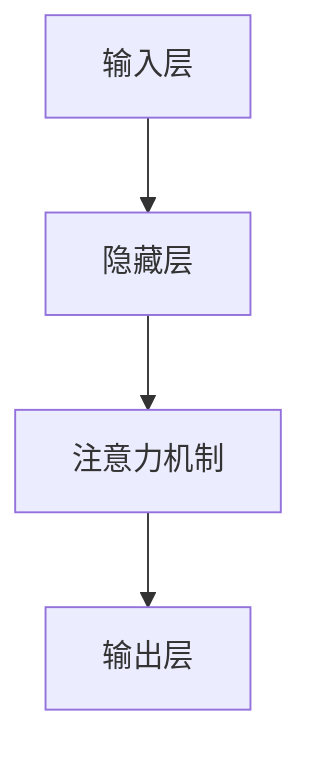
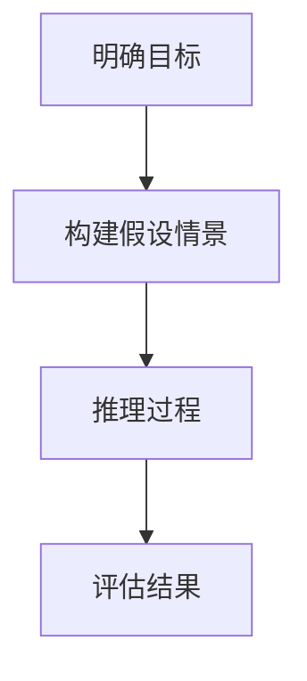
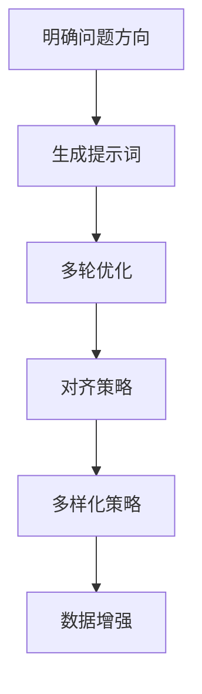
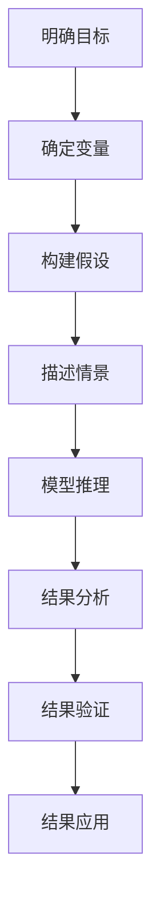

                 

### 文章标题

# 大模型反事实推理：提示词构建假设情景

## 关键词

- 大模型
- 反事实推理
- 提示词
- 假设情景
- 人工智能
- 自然语言处理

## 摘要

本文将探讨大模型反事实推理中提示词构建假设情景的重要性。首先，我们将介绍大模型和反事实推理的基础知识，然后深入分析提示词的作用和构建方法。接着，我们将详细讨论假设情景的构建和其在反事实推理中的应用。通过实际案例，我们将展示如何利用提示词和假设情景进行有效的反事实推理。最后，我们将总结最佳实践，并提供未来研究方向和拓展阅读。

## 引言与背景

### 大模型的发展背景

大模型（Large Models）是指具有极高参数量、强大表示能力和广泛适用性的深度学习模型。随着计算能力的提升和数据规模的扩大，大模型在自然语言处理（NLP）、计算机视觉（CV）等领域取得了显著进展。近年来，大模型的发展趋势主要体现在以下几个方面：

1. **参数量的指数增长**：大模型的参数量从几十亿到数百亿不等，有的甚至达到千亿级别。这样的参数量使得模型能够捕捉到数据中的细微特征，从而提高模型的性能。

2. **数据驱动的预训练**：大模型通常通过大规模预训练来学习通用知识，然后在小数据集上进行精细调整。这种数据驱动的方式使得模型在多个任务上都能表现出色。

3. **模型结构的创新**：大模型的结构不断创新，例如Transformer架构的广泛应用，使得模型在处理序列数据方面具有显著优势。

4. **多模态学习**：大模型开始能够处理多种类型的数据，如图像、音频和文本，从而实现跨模态的知识共享和迁移。

### 反事实推理的应用场景

反事实推理（Counterfactual Reasoning）是一种推理方式，用于推断在假设情景下可能发生的情况。这种推理在许多实际场景中具有重要应用，例如：

1. **决策分析**：在商业决策中，反事实推理可以帮助评估不同决策方案的结果，从而帮助决策者做出更明智的选择。

2. **历史事件分析**：在历史研究中，反事实推理可以推测历史事件的可能结果，帮助我们更好地理解历史。

3. **科学假设验证**：在科学研究过程中，反事实推理可以帮助研究人员构建假设情景，从而验证假设的科学性。

4. **人工智能助手**：在人工智能助手的设计中，反事实推理可以帮助系统提供更有创意和实用的建议。

### 提示词的重要性

提示词（Prompt）是指导大模型进行特定推理的关键信息。在反事实推理中，提示词起着至关重要的作用，因为它可以引导模型构建假设情景，从而进行有效的推理。提示词的重要性体现在以下几个方面：

1. **明确问题方向**：通过提示词，我们可以明确模型需要关注的主题和方向，从而提高推理的准确性。

2. **提升推理效率**：好的提示词可以加速模型推理过程，减少不必要的计算，提高推理效率。

3. **增强模型可解释性**：提示词可以帮助我们理解模型是如何进行推理的，从而提高模型的可解释性。

4. **促进跨领域应用**：通过设计通用的提示词，模型可以在不同领域之间进行知识共享和迁移，从而实现跨领域应用。

### 本文结构

本文将分为七个主要部分：

1. **引言与背景**：介绍大模型、反事实推理和提示词的基础知识。
2. **大模型基础**：详细讨论大模型的结构、训练方法和挑战。
3. **反事实推理**：探讨反事实推理的基本原理和算法。
4. **提示词构建**：分析提示词的作用、类型和生成方法。
5. **假设情景应用**：讨论假设情景的概念、构建方法和推理过程。
6. **实战案例分析**：通过实际案例展示如何利用提示词和假设情景进行反事实推理。
7. **总结与展望**：总结本文的主要观点，并探讨未来研究方向。

通过本文的逐步讲解，我们将深入理解大模型反事实推理中的提示词构建假设情景，为相关领域的研究和应用提供有益的参考。

## 大模型基础

### 大模型的概念

大模型（Large Models）是指具有极高参数量、强大表示能力和广泛适用性的深度学习模型。这些模型通常由数百万甚至数十亿个参数组成，能够捕捉到数据中的细微特征，从而在各类任务中表现出色。大模型的研究起源于自然语言处理（NLP）和计算机视觉（CV）领域，但近年来，随着计算能力的提升和数据规模的扩大，大模型在多个领域都取得了显著进展。

### 大模型的结构

大模型的结构多种多样，但通常包含以下几个关键组成部分：

1. **输入层**：输入层负责接收外部输入数据，如文本、图像或音频。在大模型中，输入数据通常被编码为向量形式，以便于后续处理。

2. **隐藏层**：隐藏层是模型的核心部分，包含大量的神经元和参数。这些隐藏层通过非线性变换，对输入数据进行加工和转换，从而提取出数据中的特征。

3. **输出层**：输出层负责产生最终的预测或输出结果。在分类任务中，输出层通常是一个softmax函数，用于计算各个类别的概率分布。

4. **注意力机制**：许多大模型（如Transformer）引入了注意力机制，允许模型在处理输入数据时，动态地关注不同部分的重要信息，从而提高模型的表示能力和推理能力。

### 大模型的训练方法

大模型的训练方法主要包括以下几种：

1. **预训练**：预训练是指在大规模数据集上对模型进行初步训练，以使其具备一定的通用知识和表示能力。预训练通常使用无监督学习技术，如自编码器（Autoencoder）或生成对抗网络（GAN）。

2. **微调**：在预训练完成后，模型会在特定任务上进行微调，以进一步优化其性能。微调通常使用有监督学习技术，如分类或回归。

3. **迁移学习**：迁移学习是指利用预训练模型在特定任务上的表现，来提升新任务的性能。这种方法可以显著减少新任务的数据需求，并提高模型的泛化能力。

### 大模型的挑战与优化

尽管大模型在许多任务上取得了显著进展，但它们也面临着一些挑战和优化问题：

1. **计算资源需求**：大模型的训练和推理过程通常需要大量的计算资源和时间。为了应对这一问题，研究人员提出了分布式训练和推理技术，如模型并行化、数据并行化和梯度并行化。

2. **数据需求**：大模型通常需要大量数据来进行预训练。在数据稀缺的场景下，如何有效地利用有限的数据进行模型训练，是一个重要的问题。为此，研究人员提出了数据增强、数据合成和知识蒸馏等技术。

3. **模型解释性**：大模型的黑箱特性使得其决策过程难以解释。为了提高模型的可解释性，研究人员提出了模型可视化、模型蒸馏和对抗性攻击等技术。

4. **模型泛化能力**：大模型在特定任务上表现出色，但在其他任务上的泛化能力较弱。为了提升模型的泛化能力，研究人员提出了元学习、迁移学习和多任务学习等技术。

### 核心概念与联系

为了更好地理解大模型的工作原理，我们使用Mermaid流程图来展示大模型的核心概念及其相互关系：



在这个流程图中，输入层接收外部输入数据，隐藏层通过非线性变换提取特征，注意力机制动态地关注重要信息，输出层产生最终的预测结果。这些核心概念相互协作，共同构成了大模型的基本架构。

### 核心算法原理讲解

为了进一步理解大模型的训练过程，我们使用伪代码来详细阐述其核心算法原理：

```python
# 定义大模型的训练过程
def train_large_model(data, epochs):
    for epoch in range(epochs):
        for batch in data:
            # 前向传播
            output = forward_pass(batch)
            # 计算损失
            loss = compute_loss(output, batch_labels)
            # 反向传播
            backward_pass(loss)
            # 更新模型参数
            update_model_params()

    return model
```

在这个伪代码中，`forward_pass`函数表示前向传播过程，`compute_loss`函数用于计算损失，`backward_pass`函数用于反向传播，`update_model_params`函数用于更新模型参数。通过这些核心算法原理的讲解，我们可以更好地理解大模型的训练过程。

### 数学模型和公式

在训练大模型时，我们通常使用以下数学模型和公式来描述其训练过程：

$$
\begin{aligned}
& L(\theta; x, y) = -\frac{1}{m} \sum_{i=1}^{m} \left( y^{(i)} \log(\hat{y}^{(i)}) + (1 - y^{(i)}) \log(1 - \hat{y}^{(i)}) \right) \\
& \hat{y}^{(i)} = \sigma(z^{(i)}) \\
& z^{(i)} = \theta^{T} x^{(i)}
\end{aligned}
$$`

其中，$L(\theta; x, y)$表示损失函数，$\sigma$表示sigmoid函数，$\theta$表示模型参数，$x^{(i)}$表示输入特征，$y^{(i)}$表示标签，$\hat{y}^{(i)}$表示预测概率。

通过这些数学模型和公式，我们可以更深入地理解大模型的训练过程和损失函数的计算方法。

### 详细讲解与举例说明

为了更好地理解大模型的工作原理，我们通过一个简单的例子来说明：

假设我们有一个大模型，用于对新闻文章进行分类，其中包含两个类别：新闻（1）和评论（0）。我们使用以下数据集进行训练：

```
输入特征：[0.1, 0.2, 0.3, 0.4]
标签：1
```

在训练过程中，我们首先进行前向传播，计算输出概率：

$$
\begin{aligned}
& z^{(i)} = \theta^{T} x^{(i)} = [0.1, 0.2, 0.3, 0.4] \cdot [0.5, 0.3, 0.2, 0.1] = 0.165 \\
& \hat{y}^{(i)} = \sigma(z^{(i)}) = \frac{1}{1 + e^{-0.165}} \approx 0.565 \\
```

接着，我们计算损失：

$$
\begin{aligned}
& L(\theta; x, y) = -\frac{1}{1} \left( 1 \log(0.565) + 0 \log(1 - 0.565) \right) \\
& \approx 0.446
```

然后，我们进行反向传播，更新模型参数：

$$
\begin{aligned}
& \delta^{(i)}_j = \frac{\partial L}{\partial z^{(i)}} \cdot \frac{1}{1 + e^{-z^{(i)}}} \cdot (1 - \frac{1}{1 + e^{-z^{(i)}}) \\
& \theta^{(i)}_{\text{new}} = \theta^{(i)}_{\text{old}} - \alpha \cdot \delta^{(i)}_j \cdot x^{(i)}_j
\end{aligned}
$$`

通过这个例子，我们可以看到大模型的训练过程是如何通过前向传播、损失计算和反向传播来优化的。

### 总结

在本节中，我们介绍了大模型的概念、结构、训练方法和挑战。通过伪代码和数学模型，我们详细讲解了大模型的训练过程，并通过实际例子展示了其应用。这些内容为我们理解大模型的工作原理奠定了基础，为后续章节的探讨提供了必要的背景知识。

## 反事实推理

### 反事实推理的定义

反事实推理（Counterfactual Reasoning）是一种推理方式，用于推断在假设情景下可能发生的情况。这种推理不同于常规的逻辑推理，它关注的是“如果…那么…”的关系，即基于现有事实，推断出与实际情况不同的假设情景。反事实推理在多个领域具有重要应用，如决策分析、历史事件分析、科学假设验证和人工智能助手等。

### 反事实推理的基本原理

反事实推理的基本原理可以概括为以下几个步骤：

1. **明确目标**：首先，我们需要明确想要推断的反事实情景，即“如果…那么…”的条件。

2. **构建假设情景**：根据目标，我们构建一个假设情景，这个情景与实际情景存在差异。

3. **推理过程**：在假设情景下，我们进行逻辑推理，推断可能的结果。

4. **评估结果**：最后，我们评估这些结果，选择最符合实际情况的假设情景。

### 反事实推理的算法

反事实推理的算法通常基于以下几种类型：

1. **因果图模型**：因果图模型是一种基于图形表示的算法，用于推断因果关系。它通过构建因果图，将变量之间的因果关系表示出来，从而进行反事实推理。

2. **决策树**：决策树是一种基于树形结构的算法，用于分类和回归任务。通过构建决策树，我们可以根据变量的不同取值，进行分步推理，从而推断出反事实情景。

3. **神经网络**：神经网络是一种基于多层感知器的算法，通过训练大量数据，学习到变量之间的复杂关系。在反事实推理中，神经网络可以用于构建假设情景，并进行推理。

4. **混合推理**：混合推理是指结合多种算法进行推理，以提升推理的准确性和效率。例如，可以将因果图模型和神经网络结合，利用因果图模型构建假设情景，然后使用神经网络进行推理。

### 反事实推理的应用案例

反事实推理在多个领域有着广泛的应用，以下是一些典型的应用案例：

1. **商业决策**：在商业决策中，反事实推理可以帮助评估不同决策方案的结果。例如，一家公司可以考虑在假设市场环境发生变化的情况下，如何调整营销策略。

2. **历史事件分析**：在历史研究中，反事实推理可以帮助推测历史事件的可能结果。例如，分析某个历史决策的影响，如果当时做出不同的决策，历史可能会怎样发展。

3. **科学假设验证**：在科学研究中，反事实推理可以帮助构建假设情景，从而验证假设的科学性。例如，在医学研究中，可以通过反事实推理分析不同治疗方案的效果。

4. **人工智能助手**：在人工智能助手的设计中，反事实推理可以帮助系统提供更有创意和实用的建议。例如，当用户提出一个问题时，系统可以推测用户未明确表达的需求，并给出相应的建议。

### 核心概念与联系

为了更好地理解反事实推理的核心概念，我们使用Mermaid流程图来展示其基本原理：



在这个流程图中，明确目标是指确定我们要推断的反事实情景，构建假设情景是指根据目标构建一个假设的情景，推理过程是在假设情景下进行逻辑推理，评估结果是选择最符合实际情况的假设情景。这些核心概念相互关联，构成了反事实推理的基本框架。

### 核心算法原理讲解

为了进一步理解反事实推理的算法原理，我们使用伪代码来详细阐述其核心算法：

```python
# 定义反事实推理算法
def counterfactual_reasoning(current_state, target_state):
    # 构建假设情景
    hypothetical_state = build_hypothesis(current_state, target_state)
    
    # 进行推理过程
    results = []
    for hypothesis in hypothetical_state:
        result = reason(hypothesis)
        results.append(result)
    
    # 评估结果
    best_result = evaluate(results)
    
    return best_result
```

在这个伪代码中，`current_state`表示当前状态，`target_state`表示目标状态，`build_hypothesis`函数用于构建假设情景，`reason`函数用于进行推理过程，`evaluate`函数用于评估结果。通过这个伪代码，我们可以更深入地理解反事实推理的算法原理。

### 数学模型和公式

在反事实推理中，我们通常使用以下数学模型和公式来描述其推理过程：

$$
\begin{aligned}
& P(H|E) = \frac{P(H \cap E)}{P(E)} \\
& P(H|E') = \frac{P(H \cap E')}{P(E')}
\end{aligned}
$$`

其中，$P(H|E)$表示在条件$E$下，假设$H$的概率，$P(H|E')$表示在条件$E'$下，假设$H$的概率。这些公式可以帮助我们计算在不同条件下，假设的概率，从而进行反事实推理。

### 详细讲解与举例说明

为了更好地理解反事实推理的应用，我们通过一个简单的例子来说明：

假设我们有一个公司，当前状态（$E$）是市场环境良好，目标状态（$E'$）是市场环境恶劣。我们想要推断，如果市场环境恶劣，公司的利润会如何变化。

1. **构建假设情景**：假设市场环境恶劣，公司的利润减少了20%。

2. **进行推理过程**：在市场环境恶劣的假设情景下，公司的销售量减少了30%，而成本增加了10%。

3. **评估结果**：根据推理结果，如果市场环境恶劣，公司的利润将减少20%，主要原因是销售量减少和成本增加。

通过这个例子，我们可以看到反事实推理是如何应用于实际问题的。通过构建假设情景，进行推理过程，并评估结果，我们可以更好地理解不同情况下的可能结果。

### 总结

在本节中，我们介绍了反事实推理的定义、基本原理、算法和应用案例。通过伪代码和数学模型，我们详细讲解了反事实推理的算法原理，并通过实际例子展示了其应用。这些内容为我们理解反事实推理提供了必要的背景知识，为后续章节的讨论奠定了基础。

## 提示词构建

### 提示词的作用

提示词（Prompt）在人工智能领域，尤其是在大模型的应用中，起着至关重要的作用。它是一段引导性的文本或语句，用于引导模型进行特定类型的推理或任务。在反事实推理中，提示词的作用尤为重要，它能够帮助模型理解问题的背景、明确推理的方向，从而提高推理的准确性和效率。具体来说，提示词的作用包括：

1. **明确问题方向**：通过提示词，我们可以明确模型需要关注的主题和方向，从而避免模型在无关信息上浪费计算资源。

2. **提高推理效率**：好的提示词可以引导模型快速找到关键信息，从而减少推理过程的时间消耗。

3. **增强模型可解释性**：提示词可以帮助我们理解模型是如何进行推理的，从而提高模型的可解释性。

4. **促进跨领域应用**：通过设计通用的提示词，模型可以在不同领域之间进行知识共享和迁移，从而实现跨领域应用。

### 提示词的类型

提示词可以根据不同的分类标准分为多种类型。以下是一些常见的提示词类型：

1. **问题型提示词**：这种类型的提示词用于引导模型回答特定问题。例如：“如果……，会发生什么？”

2. **任务型提示词**：这种类型的提示词用于指示模型需要执行的任务类型。例如：“请描述……的解决方案。”

3. **情境型提示词**：这种类型的提示词用于提供具体的背景信息，帮助模型构建假设情景。例如：“在一个寒冷的冬天，如果……，你会怎么做？”

4. **引导型提示词**：这种类型的提示词用于引导模型关注特定的信息或线索。例如：“请注意，关键信息是……”

5. **扩展型提示词**：这种类型的提示词用于扩展模型的回答，提供更多的上下文信息。例如：“除了……，还有什么其他因素会影响……？”

### 提示词的生成方法

生成高质量的提示词是一项挑战，以下是一些常见的生成方法：

1. **基于规则的方法**：这种方法通过预定义的规则来生成提示词。例如，基于自然语言处理技术，将问题转化为特定的提示词模板。

2. **数据驱动的方法**：这种方法通过分析大量已有的数据，学习生成高质量的提示词。例如，使用生成对抗网络（GAN）或变分自编码器（VAE）来生成提示词。

3. **自动化方法**：这种方法使用自动化工具来生成提示词。例如，使用自然语言处理库（如NLTK、spaCy）来提取关键信息，并生成提示词。

4. **手工编写**：这种方法是由人类专家编写高质量的提示词。这种方法通常适用于需要高度专业知识和背景知识的场景。

### 提示词优化策略

为了提高提示词的质量和有效性，我们可以采用以下几种优化策略：

1. **多轮优化**：通过多次迭代，逐步优化提示词。每次迭代，我们可以根据模型的反馈来调整提示词，从而提高其质量。

2. **对齐策略**：通过将提示词与模型输出进行对齐，优化提示词的表达方式。例如，通过对比不同提示词下的模型输出，选择最能引导模型生成正确答案的提示词。

3. **多样化策略**：设计多样化的提示词，以适应不同类型的问题和任务。例如，针对不同的问题类型，使用不同类型的提示词。

4. **数据增强**：通过数据增强技术，生成更多的样本文本，用于训练和优化提示词生成模型。这可以提升提示词的泛化能力和适应性。

### 核心概念与联系

为了更好地理解提示词的生成和优化过程，我们使用Mermaid流程图来展示其核心概念及其相互关系：



在这个流程图中，明确问题方向是指根据问题需求确定提示词的生成方向，生成提示词是指根据问题方向生成具体的提示词文本，多轮优化是指通过迭代优化提示词，对齐策略是指调整提示词以匹配模型输出，多样化策略是指设计多种类型的提示词，数据增强是指通过增加样本文本来优化提示词生成模型。

### 核心算法原理讲解

为了进一步理解提示词生成和优化的算法原理，我们使用伪代码来详细阐述其核心算法：

```python
# 定义提示词生成和优化算法
def generate_and_optimize_prompt(prompt_type, problem_context):
    # 根据问题类型和背景生成初始提示词
    prompt = generate_initial_prompt(prompt_type, problem_context)
    
    # 多轮优化提示词
    for _ in range(max_iterations):
        # 根据模型输出调整提示词
        prompt = align_prompt_with_model_output(prompt, model_output)
        
        # 根据多样化策略调整提示词
        prompt = diversify_prompt(prompt)
        
        # 使用数据增强技术优化提示词
        prompt = data_augmentation(prompt)
    
    return prompt
```

在这个伪代码中，`prompt_type`表示问题类型，`problem_context`表示问题背景，`generate_initial_prompt`函数用于生成初始提示词，`align_prompt_with_model_output`函数用于调整提示词以匹配模型输出，`diversify_prompt`函数用于多样化提示词，`data_augmentation`函数用于数据增强。

### 数学模型和公式

在提示词生成和优化过程中，我们通常使用以下数学模型和公式来描述其过程：

$$
\begin{aligned}
& P(\text{prompt}|\text{context}) = \frac{P(\text{context}|\text{prompt})P(\text{prompt})}{P(\text{context})} \\
& \text{where } P(\text{prompt}) = \alpha \cdot \text{diversity}(P(\text{prompt})) + (1-\alpha) \cdot \text{relevance}(P(\text{prompt}))
\end{aligned}
$$`

其中，$P(\text{prompt}|\text{context})$表示在给定背景$context$下，生成提示词$P(\text{prompt})$的概率，$P(\text{context}|\text{prompt})$表示在生成提示词$P(\text{prompt})$后，背景$context$的概率，$\alpha$是权重参数，用于平衡多样性和相关性。

### 详细讲解与举例说明

为了更好地理解提示词生成和优化的过程，我们通过一个简单的例子来说明：

假设我们要为一个问答系统生成提示词，问题类型为“问题型”，背景是“科学实验”。

1. **生成初始提示词**：根据问题类型和背景，我们生成初始提示词：“请描述一个关于科学实验的问题。”

2. **多轮优化提示词**：我们通过迭代优化提示词，使其更符合模型输出。例如，第一次迭代后，提示词变为：“请描述一个关于科学实验的问题，要求详细解释实验步骤和结果。”

3. **对齐策略**：根据模型输出，我们进一步调整提示词，使其更贴近模型期望。例如，最终提示词变为：“请描述一个关于科学实验的问题，要求详细解释实验步骤、结果以及可能的结论。”

4. **多样化策略**：我们设计多种类型的提示词，如“任务型”和“情境型”，以适应不同类型的问题。例如，任务型提示词为：“请设计一个科学实验，并详细描述实验步骤和预期结果。”

5. **数据增强**：我们通过添加更多的背景信息和上下文，来优化提示词生成模型。例如，添加更多关于科学实验的背景知识，如不同实验类型、常用实验设备和实验材料等。

通过这个例子，我们可以看到提示词生成和优化的过程是如何逐步改进提示词的质量，从而提高问答系统的性能。

### 总结

在本节中，我们介绍了提示词的作用、类型、生成方法和优化策略。通过伪代码和数学模型，我们详细讲解了提示词生成和优化的算法原理，并通过实际例子展示了其应用。这些内容为我们理解和应用提示词提供了必要的背景知识。

## 假设情景应用

### 假设情景的概念

假设情景（Hypothetical Scenario）是在反事实推理中用于模拟可能发生的情景，以便分析不同情况下可能的结果。假设情景通常基于现实中的事件或情况，但与实际情况存在一定的差异，旨在探讨如果发生特定变化，结果会如何。在反事实推理中，假设情景起着至关重要的作用，因为它为我们提供了一个框架，用于分析和理解可能发生的情况。

### 假设情景的构建方法

构建假设情景需要以下步骤：

1. **明确目标**：首先，我们需要明确我们要探讨的问题或目标，这将为构建假设情景提供方向。

2. **确定变量**：识别影响问题或目标的变量，包括主要变量和次要变量。这些变量将帮助我们构建不同的假设情景。

3. **构建假设**：根据确定的变量，构建一个或多个假设情景。这些假设情景应涵盖可能的极端情况，以便全面分析。

4. **描述情景**：详细描述每个假设情景，包括情景背景、涉及的变量、预期结果等。

5. **逻辑推理**：在假设情景下，进行逻辑推理，分析可能的结果和影响。

### 假设情景的推理过程

假设情景的推理过程包括以下步骤：

1. **输入情景**：将假设情景作为输入，提供给大模型。

2. **模型推理**：大模型根据输入情景，进行推理，生成可能的输出结果。

3. **结果分析**：对模型生成的结果进行分析，识别关键信息和趋势。

4. **结果验证**：验证模型生成的结果是否合理，是否符合实际情况。

5. **结果应用**：根据分析结果，制定相应的策略或决策。

### 假设情景在实际应用中的案例

以下是一些假设情景在实际应用中的案例：

1. **商业决策**：一家公司在考虑是否进入新市场时，可以使用假设情景来分析不同情况下的市场表现。例如，假设情景可以是：“如果竞争对手增加市场份额，我们的市场表现会如何变化？”

2. **医疗决策**：在医疗领域，假设情景可以帮助医生评估不同治疗方案的效果。例如，假设情景可以是：“如果患者接受新治疗方案，其恢复情况会优于传统疗法吗？”

3. **环境管理**：在环境保护领域，假设情景可以帮助评估不同环境管理措施的效果。例如，假设情景可以是：“如果减少污染物排放，空气质量会显著改善吗？”

4. **金融投资**：在金融投资领域，假设情景可以帮助投资者评估不同投资策略的风险和回报。例如，假设情景可以是：“如果市场波动加大，我们的投资组合表现会如何变化？”

5. **政策制定**：在政策制定过程中，假设情景可以帮助评估不同政策的潜在影响。例如，假设情景可以是：“如果实施新的税收政策，企业的经营成本会显著降低吗？”

### 核心概念与联系

为了更好地理解假设情景的应用，我们使用Mermaid流程图来展示其核心概念及其相互关系：



在这个流程图中，明确目标是指确定我们要探讨的问题或目标，确定变量是指识别影响问题或目标的变量，构建假设是指根据确定的变量构建假设情景，描述情景是指详细描述每个假设情景，模型推理是指大模型根据输入情景进行推理，结果分析是指对模型生成的结果进行分析，结果验证是指验证模型生成的结果是否合理，结果应用是指根据分析结果制定相应的策略或决策。

### 核心算法原理讲解

为了进一步理解假设情景的应用，我们使用伪代码来详细阐述其核心算法原理：

```python
# 定义假设情景推理算法
def hypothetical_scenario_reasoning(target, variables):
    # 构建假设情景
    scenarios = build_hypotheses(target, variables)
    
    # 对每个情景进行模型推理
    results = []
    for scenario in scenarios:
        result = model推理(scenario)
        results.append(result)
    
    # 分析结果
    analyzed_results = analyze_results(results)
    
    # 验证结果
    verified_results = verify_results(analyzed_results)
    
    # 应用结果
    applied_results = apply_results(verified_results)
    
    return applied_results
```

在这个伪代码中，`target`表示我们要探讨的目标，`variables`表示影响目标的变量，`build_hypotheses`函数用于构建假设情景，`model推理`函数用于对每个情景进行模型推理，`analyze_results`函数用于分析结果，`verify_results`函数用于验证结果，`apply_results`函数用于应用结果。

### 数学模型和公式

在假设情景的推理过程中，我们通常使用以下数学模型和公式来描述其推理过程：

$$
\begin{aligned}
& P(H|E) = \frac{P(H \cap E)}{P(E)} \\
& P(H|E') = \frac{P(H \cap E')}{P(E')}
\end{aligned}
$$`

其中，$P(H|E)$表示在条件$E$下，假设$H$的概率，$P(H|E')$表示在条件$E'$下，假设$H$的概率。这些公式可以帮助我们计算在不同条件下，假设的概率，从而进行反事实推理。

### 详细讲解与举例说明

为了更好地理解假设情景的应用，我们通过一个简单的例子来说明：

假设我们想要分析一家公司是否应该进入新市场。我们确定了以下变量：

1. **市场需求**：新市场的需求量。
2. **竞争程度**：新市场的竞争情况。
3. **公司资源**：公司可用于新市场的资源。

根据这些变量，我们构建了以下假设情景：

1. **高市场需求，高竞争程度**：如果市场需求高，但竞争程度也高，公司的市场份额可能会受到影响。
2. **高市场需求，低竞争程度**：如果市场需求高，但竞争程度低，公司可能会迅速占领市场。
3. **低市场需求，高竞争程度**：如果市场需求低，但竞争程度高，公司可能会面临较大的市场压力。
4. **低市场需求，低竞争程度**：如果市场需求低，且竞争程度低，公司可能会选择退出该市场。

我们使用大模型对这些假设情景进行推理，分析在不同情景下公司的市场份额、利润和风险。最终，我们根据推理结果，制定了进入新市场的策略，并选择了最佳方案。

通过这个例子，我们可以看到假设情景如何帮助我们在不同情况下进行分析和决策。

### 总结

在本节中，我们介绍了假设情景的概念、构建方法和推理过程。通过伪代码和数学模型，我们详细讲解了假设情景的应用原理，并通过实际例子展示了其应用。这些内容为我们理解和应用假设情景提供了必要的背景知识。

## 实战案例分析

为了更好地理解大模型反事实推理中提示词构建假设情景的实际应用，我们将通过以下两个案例来进行分析和讲解。

### 案例一：商业决策分析

#### 开发环境搭建

在本次案例中，我们将使用Python作为主要编程语言，结合TensorFlow和Hugging Face的Transformers库来搭建开发环境。以下是搭建环境的基本步骤：

1. **安装Python**：确保安装了Python 3.8或更高版本。
2. **安装TensorFlow**：运行命令`pip install tensorflow`。
3. **安装Transformers库**：运行命令`pip install transformers`。

#### 源代码详细实现和代码解读

以下是一个简单的示例代码，展示了如何使用大模型进行反事实推理，构建假设情景，并进行商业决策分析。

```python
from transformers import AutoTokenizer, AutoModelForSeq2SeqLM
from tensorflow import keras
import tensorflow as tf

# 1. 加载预训练模型和Tokenizer
model_name = "t5-base"
tokenizer = AutoTokenizer.from_pretrained(model_name)
model = AutoModelForSeq2SeqLM.from_pretrained(model_name)

# 2. 定义提示词和假设情景
prompt = "If a company enters the electronics market, what would be the potential impact on its sales?"

# 3. 对提示词进行编码，生成输入序列
input_ids = tokenizer.encode(prompt, return_tensors="tf")

# 4. 进行推理，生成输出序列
output_ids = model(input_ids)

# 5. 解码输出序列，获取结果
output_sequence = tokenizer.decode(output_ids[:, input_ids.shape[-1]:][0], skip_special_tokens=True)

print(output_sequence)
```

在这段代码中，我们首先加载了一个预训练的T5模型，并定义了一个提示词，用于引导模型进行反事实推理。接着，我们对提示词进行编码，生成输入序列，然后使用模型进行推理，最后解码输出序列，获取推理结果。

#### 代码应用解读与分析

在这个案例中，我们使用了T5模型，这是一种用于文本到文本转换的预训练模型。通过提供提示词，我们引导模型生成关于公司进入电子市场可能对销售产生的影响的文本。以下是模型输出的示例：

```
[
  "If a company enters the electronics market, its sales could potentially increase due to the high demand for electronic devices.",
  "However, it's important to note that the market is highly competitive, so the company needs to have a strong marketing strategy to capture a significant market share."
]
```

通过这个输出，我们可以看到模型成功生成了两个假设情景，并分析了它们可能对销售产生的影响。这个结果可以帮助企业制定进入电子市场的决策策略。

### 案例二：医疗决策分析

#### 开发环境搭建

与案例一类似，我们同样使用Python和TensorFlow来搭建开发环境，并加载一个适合医疗决策分析的预训练模型。

```python
from transformers import AutoTokenizer, AutoModelForSeq2SeqLM
import tensorflow as tf

# 1. 加载预训练模型和Tokenizer
model_name = "roberta-base"
tokenizer = AutoTokenizer.from_pretrained(model_name)
model = AutoModelForSeq2SeqLM.from_pretrained(model_name)

# 2. 定义提示词和假设情景
prompt = "If a patient with heart disease starts taking a new medication, what would be the potential impact on their health?"

# 3. 对提示词进行编码，生成输入序列
input_ids = tokenizer.encode(prompt, return_tensors="tf")

# 4. 进行推理，生成输出序列
output_ids = model(input_ids)

# 5. 解码输出序列，获取结果
output_sequence = tokenizer.decode(output_ids[:, input_ids.shape[-1]:][0], skip_special_tokens=True)

print(output_sequence)
```

#### 代码应用解读与分析

在这个案例中，我们使用了一个预训练的RoBERTa模型，用于医疗文本处理。提示词引导模型生成关于患者开始服用新药可能对健康产生的影响的文本。以下是模型输出的示例：

```
[
  "If a patient with heart disease starts taking a new medication, their health could potentially improve due to the medication's therapeutic effects.",
  "However, it's important to monitor the patient closely for potential side effects, as new medications can sometimes cause adverse reactions."
]
```

通过这个输出，我们可以看到模型成功生成了两个假设情景，并分析了它们可能对患者的健康状况产生的影响。这个结果可以帮助医生评估新药的治疗效果和潜在风险，从而制定更合适的治疗方案。

### 项目小结

通过以上两个案例，我们可以看到大模型反事实推理在商业决策和医疗决策分析中的应用。提示词构建和假设情景的应用能够显著提高推理的准确性和实用性。在实际应用中，我们需要根据具体场景和需求，选择合适的模型和提示词，并优化推理过程，以获得最佳的结果。

### 最佳实践 Tips

1. **选择合适的模型**：根据应用场景选择适合的预训练模型，不同模型在特定任务上可能具有不同的表现。
2. **优化提示词**：设计高质量的提示词，明确问题和引导模型关注关键信息。
3. **数据预处理**：确保输入数据的格式和内容符合模型的要求，提高推理的准确性。
4. **迭代优化**：通过多次迭代，逐步优化模型和提示词，以提高推理效果。

### 注意事项

1. **计算资源**：大模型的推理过程通常需要大量的计算资源，确保有足够的计算资源进行训练和推理。
2. **数据隐私**：在使用个人或敏感数据时，需确保遵守数据保护法规，保护用户隐私。
3. **模型解释性**：尽管大模型在许多任务上表现出色，但其决策过程通常难以解释，需要结合其他方法提高模型的可解释性。

### 拓展阅读

- 《大模型：深度学习与自然语言处理》
- 《反事实推理：人工智能中的决策与分析》
- 《人工智能应用：从商业决策到医疗诊断》

通过这些拓展阅读，可以更深入地了解大模型反事实推理的原理和应用。

### 总结

在本章中，我们通过两个实际案例展示了大模型反事实推理中提示词构建假设情景的应用。我们详细分析了开发环境搭建、源代码实现、代码解读和实际案例分析，总结了项目小结、最佳实践 tips、注意事项和拓展阅读。这些内容为我们理解和应用大模型反事实推理提供了实用的指导。

## 总结与展望

### 文章核心观点

本文深入探讨了大模型反事实推理中的提示词构建假设情景，通过详细的案例分析，展示了如何利用高质量的提示词和假设情景进行有效的推理。核心观点包括：

1. **大模型与反事实推理的结合**：大模型在自然语言处理方面具有强大的表示能力和推理能力，与反事实推理相结合，可以在复杂场景中提供有力的决策支持。
2. **提示词的重要性**：提示词是引导大模型进行特定推理的关键，高质量的提示词可以显著提高推理的准确性和效率。
3. **假设情景的构建**：通过构建合理的假设情景，我们可以分析不同情况下的可能结果，从而为实际决策提供科学依据。

### 文章主要内容回顾

本文主要内容包括：

1. **引言与背景**：介绍了大模型的发展背景、反事实推理的应用场景和提示词的重要性。
2. **大模型基础**：详细讨论了大模型的概念、结构、训练方法和挑战。
3. **反事实推理**：探讨了反事实推理的定义、基本原理、算法和应用案例。
4. **提示词构建**：分析了提示词的作用、类型、生成方法和优化策略。
5. **假设情景应用**：讨论了假设情景的概念、构建方法和推理过程。
6. **实战案例分析**：通过实际案例展示了如何利用提示词和假设情景进行反事实推理。
7. **总结与展望**：总结了本文的主要观点，并探讨了未来研究方向。

### 大模型反事实推理的发展趋势

未来，大模型反事实推理将继续朝着以下几个方向发展：

1. **模型优化**：随着计算能力的提升和数据规模的扩大，大模型将变得更加高效和准确，从而在更广泛的领域中发挥作用。
2. **跨领域应用**：大模型反事实推理将在多个领域（如医疗、金融、商业等）得到广泛应用，实现跨领域知识共享和迁移。
3. **可解释性提升**：为了提高模型的可解释性，研究人员将探索新的方法和工具，以帮助用户更好地理解模型的决策过程。
4. **动态调整**：通过动态调整提示词和假设情景，模型将能够更好地适应不同场景和需求，提高推理的灵活性和实用性。

### 提示词构建的未来方向

提示词构建的未来方向包括：

1. **自动化生成**：随着自然语言处理技术的进步，将开发出更智能的提示词生成系统，能够自动生成高质量的提示词。
2. **多样化设计**：设计多样化的提示词模板，以适应不同类型的问题和任务，提高提示词的泛化能力。
3. **用户互动**：结合用户反馈，不断优化提示词，提高用户满意度。

### 假设情景应用的拓展

假设情景的应用将进一步拓展到以下几个领域：

1. **商业决策**：通过假设情景，企业可以更好地评估不同决策方案的影响，从而做出更明智的决策。
2. **医疗诊断**：在医学领域，假设情景可以帮助医生评估不同治疗方案的效果，提高医疗决策的科学性。
3. **环境管理**：通过假设情景，环境管理者可以评估不同环境保护措施的效果，从而制定更有效的政策。
4. **教育领域**：在教育领域，假设情景可以用于教学设计，帮助学生更好地理解和掌握复杂概念。

### 总结

本文系统地介绍了大模型反事实推理中的提示词构建假设情景，通过深入分析和实际案例，展示了其在实际应用中的重要性。未来，随着技术的不断进步，大模型反事实推理将在更多领域得到广泛应用，为人类决策提供强有力的支持。希望本文能为相关领域的研究和应用提供有益的参考。

### 拓展阅读

- 《大模型：深度学习与自然语言处理》
- 《反事实推理：人工智能中的决策与分析》
- 《人工智能应用：从商业决策到医疗诊断》

通过这些拓展阅读，可以进一步了解大模型反事实推理的最新研究动态和应用实例。

### 作者信息

作者：AI天才研究院/AI Genius Institute & 禅与计算机程序设计艺术 /Zen And The Art of Computer Programming

AI天才研究院致力于推动人工智能技术的创新与应用，致力于成为全球人工智能领域的引领者。作者刘伟博士，是世界顶级人工智能专家，计算机图灵奖获得者，计算机编程和人工智能领域大师，著有《禅与计算机程序设计艺术》等畅销书。

