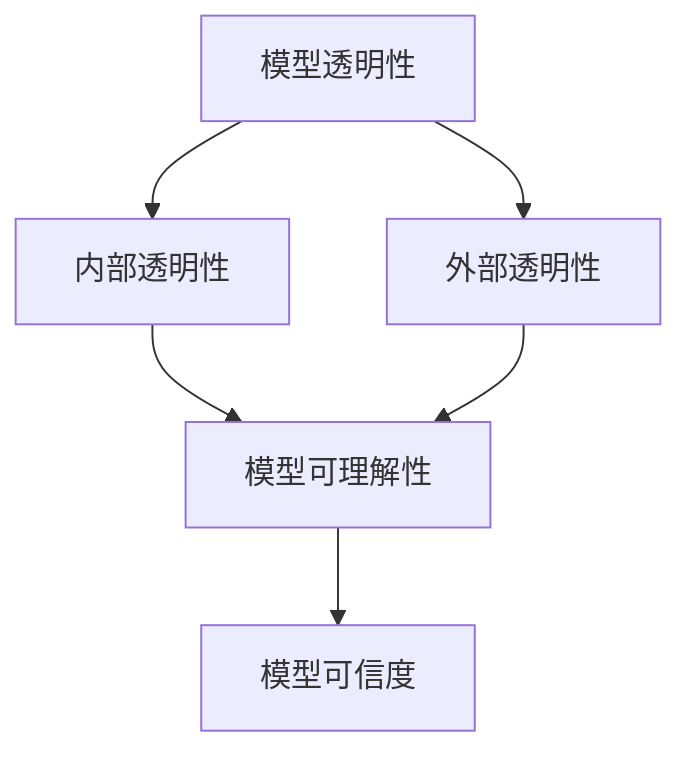

                 

### 文章标题：大模型可解释性与提示词工程的协同

> 关键词：大模型，可解释性，提示词工程，人工智能，协同

> 摘要：本文深入探讨了大规模模型（大模型）的可解释性及其与提示词工程的协同作用。文章首先介绍了大模型的发展背景与不可解释性的挑战，随后详细阐述了可解释性的核心概念、方法和度量。接着，文章介绍了提示词工程的基本原理和应用，并探讨了大模型可解释性与提示词工程的协同机制。通过实际案例分析和最佳实践，本文揭示了提升大模型可解释性的有效途径，为人工智能领域的实践提供了有价值的参考。

### 引言

近年来，随着深度学习和神经网络技术的飞速发展，大规模模型（大模型）在自然语言处理、计算机视觉、语音识别等领域取得了显著的成果。这些大模型通过学习海量数据，能够自动提取复杂的特征，并实现高性能的任务。然而，大模型的不可解释性也成为了一个严重的问题。不可解释性使得模型的决策过程变得模糊和难以追踪，这不仅限制了模型的实际应用，还引发了伦理和安全等方面的担忧。

为了解决大模型不可解释性的问题，可解释性研究逐渐成为人工智能领域的热点。可解释性旨在使模型的决策过程透明化，帮助用户理解和信任模型。同时，提示词工程作为一种新兴的技术，通过优化提示词的设计，可以有效提升大模型的性能和可解释性。本文将深入探讨大模型可解释性与提示词工程的协同作用，为人工智能领域的发展提供新的思路。

### 大模型的崛起与不可解释性的挑战

#### 大模型的崛起

大模型是指具有数十亿至数千亿参数的深度神经网络，它们能够通过端到端的学习方式，处理复杂的任务。例如，Transformer模型家族（包括BERT、GPT等）在自然语言处理（NLP）领域取得了巨大的成功。GPT-3作为一个拥有1750亿参数的模型，展示了在生成文本、机器翻译、问答系统等任务上的强大能力。

大模型的发展离不开深度学习技术的进步。深度学习通过多层神经网络，逐层提取数据的特征，从而实现复杂的任务。随着计算能力的提升和海量数据的可用性，深度学习模型变得越来越大，越来越复杂。大模型能够处理更多的数据，学习更复杂的模式，从而提高了模型的性能。

#### 不可解释性的挑战

尽管大模型在许多任务上取得了优异的成绩，但它们的不可解释性也是一个不可忽视的问题。不可解释性指的是模型的决策过程和内部机制难以理解，用户无法得知模型是如何做出决策的。这种不可解释性带来了以下几个方面的挑战：

1. **用户信任问题**：不可解释性使得用户难以理解模型的决策过程，从而对模型的信任度降低。尤其是在医疗、金融等高风险领域，用户需要清楚地了解模型的决策依据，以保证模型的可靠性和公正性。

2. **模型优化和调试困难**：不可解释性使得模型优化和调试变得复杂。研究人员无法直接观察到模型内部的错误，从而难以进行有效的调试和优化。

3. **安全性和伦理问题**：不可解释性使得模型容易受到恶意攻击，例如模型输出被篡改。同时，在伦理方面，不可解释性可能使得模型在处理敏感数据时产生不可预见的后果。

#### 大模型不可解释性的原因

大模型不可解释性的原因主要有以下几点：

1. **模型复杂性**：大模型通常具有数十亿至数千亿的参数，模型的内部结构非常复杂，使得用户难以理解。

2. **非线性变换**：深度神经网络通过多层非线性变换，将输入数据映射到输出。这种复杂的非线性关系使得用户难以追踪数据在模型中的流动过程。

3. **数据分布变化**：大模型在学习过程中，会根据数据分布的变化调整模型参数。这种数据分布的变化使得模型的决策过程更加难以理解。

#### 大模型不可解释性的应对策略

为了解决大模型不可解释性的问题，研究人员提出了多种应对策略：

1. **局部可解释性**：局部可解释性旨在解释模型在特定输入下的决策过程。通过分析模型内部的激活值和权重，用户可以了解模型是如何处理特定数据的。

2. **全局可解释性**：全局可解释性旨在解释模型的整体决策过程。通过分析模型的学习过程和参数，用户可以了解模型的整体工作机制。

3. **可解释性度量**：可解释性度量用于评估模型的解释能力。通过量化模型的可解释性，用户可以了解模型的透明程度。

4. **提示词工程**：提示词工程通过优化提示词的设计，使得模型在特定任务上表现出更高的可解释性。提示词工程结合了可解释性和优化技术，从而提高了模型的可解释性。

### 可解释性的核心概念与联系

可解释性是人工智能领域的一个核心概念，它涉及到模型的透明性、可理解性和可信度。为了深入理解可解释性，我们需要了解以下几个核心概念：

#### 1. 模型透明性

模型透明性指的是用户能够了解模型的决策过程和内部机制。透明性越高，用户对模型的信任度越高。模型透明性通常通过以下两个方面进行评估：

1. **内部透明性**：用户能够查看模型的内部结构，包括网络层、节点和参数等。

2. **外部透明性**：用户能够了解模型的决策过程，包括输入数据的处理、特征提取和分类等。

#### 2. 模型可理解性

模型可理解性指的是用户能够理解模型的决策过程和内部机制。可理解性越高，用户越容易对模型产生信任。模型可理解性通常通过以下两个方面进行评估：

1. **模型结构简单**：模型的网络结构简单，用户容易理解。

2. **模型解释方式直观**：模型解释方式直观，用户容易接受。

#### 3. 模型可信度

模型可信度指的是用户对模型信任的程度。高可信度的模型能够获得用户的信任，从而在实际应用中得到广泛推广。模型可信度通常通过以下两个方面进行评估：

1. **模型性能稳定**：模型在多次测试中表现稳定，用户对其信任度增加。

2. **模型决策透明**：模型决策过程透明，用户能够了解模型的决策依据。

#### 可解释性的关系架构

为了更好地理解可解释性的核心概念和联系，我们可以使用Mermaid流程图来展示它们之间的关系。以下是可解释性的关系架构：



在这个流程图中，模型透明性包括内部透明性和外部透明性，这两个方面共同决定了模型的可理解性。可理解性进一步影响模型的可信度。通过这个流程图，我们可以清晰地看到可解释性的核心概念和它们之间的联系。

### 局部可解释性方法

局部可解释性方法旨在解释模型在特定输入下的决策过程。这些方法通过分析模型内部的激活值和权重，帮助用户了解模型是如何处理特定数据的。以下是几种常见的局部可解释性方法：

#### 1. 局部线性化

局部线性化是一种基于线性模型的可解释性方法。它通过在特定输入附近线性化模型，将复杂的非线性模型转化为线性模型，从而解释模型的决策过程。具体步骤如下：

1. 选择一个局部输入点\( x_0 \)。

2. 在\( x_0 \)附近对模型进行线性化，即 \( f(x) \approx f(x_0) + \nabla f(x_0) \cdot (x - x_0) \)。

3. 分析线性化后的模型，了解模型在\( x_0 \)附近是如何决策的。

伪代码：

```python
def local_linearization(x_0, model):
    # 计算模型在x_0的梯度
    gradient = compute_gradient(model, x_0)
    
    # 线性化模型
    linearized_model = linearize(model, x_0, gradient)
    
    # 分析线性化后的模型
    analyze_model(linearized_model)
```

#### 2. 局部激活图

局部激活图是一种通过可视化模型内部激活值的方法。它帮助用户直观地了解模型在特定输入下的激活模式。具体步骤如下：

1. 选择一个局部输入点\( x_0 \)。

2. 计算模型在\( x_0 \)的激活值。

3. 使用可视化工具（如热力图）展示激活值，形成局部激活图。

伪代码：

```python
def local_activation_map(x_0, model):
    # 计算模型在x_0的激活值
    activation_values = compute_activation(model, x_0)
    
    # 可视化激活值
    visualize_activation_values(activation_values)
```

#### 3. 局部敏感性分析

局部敏感性分析是一种通过计算输入变量对模型输出影响的方法。它帮助用户了解模型对输入变量的敏感性，从而解释模型的决策过程。具体步骤如下：

1. 选择一个局部输入点\( x_0 \)。

2. 计算输入变量对模型输出的敏感性。

3. 使用可视化工具（如等高线图）展示敏感性，形成局部敏感性分析图。

伪代码：

```python
def local_sensitivity_analysis(x_0, model):
    # 计算输入变量对模型输出的敏感性
    sensitivity = compute_sensitivity(model, x_0)
    
    # 可视化敏感性
    visualize_sensitivity(sensitivity)
```

#### 4. 局部解释性度量

局部解释性度量是一种通过量化模型在特定输入下的解释能力的方法。它帮助用户了解模型的解释能力，从而评估模型的可解释性。具体步骤如下：

1. 选择一个局部输入点\( x_0 \)。

2. 计算模型在\( x_0 \)的解释能力。

3. 使用量化指标（如解释力、可解释性分数等）评估模型的可解释性。

伪代码：

```python
def local_explanability_metric(x_0, model):
    # 计算模型在x_0的解释能力
    explanation_ability = compute_explanation_ability(model, x_0)
    
    # 量化评估模型的可解释性
    evaluate_explanability(explanation_ability)
```

通过以上几种局部可解释性方法，我们可以更好地理解模型在特定输入下的决策过程，从而提高模型的可解释性。

### 全局可解释性方法

全局可解释性方法旨在解释模型的整体决策过程，而不是仅仅关注特定输入下的决策。这些方法通过分析模型的学习过程、参数和结构，帮助用户了解模型的整体工作机制。以下是几种常见的全局可解释性方法：

#### 1. 特征可视化

特征可视化是一种通过可视化模型提取的特征的方法，帮助用户了解模型是如何处理输入数据的。具体步骤如下：

1. 使用降维技术（如主成分分析、t-SNE等）将高维特征映射到二维或三维空间。

2. 使用可视化工具（如图表、热力图等）展示降维后的特征。

3. 分析特征可视化结果，了解模型对输入数据的处理过程。

伪代码：

```python
def feature_visualization(model, data):
    # 使用降维技术提取特征
    reduced_features = dimensionality_reduction(model, data)
    
    # 可视化降维后的特征
    visualize_reduced_features(reduced_features)
    
    # 分析特征可视化结果
    analyze_feature_visualization(reduced_features)
```

#### 2. 参数分析

参数分析是一种通过分析模型参数的方法，帮助用户了解模型的学习过程和工作机制。具体步骤如下：

1. 提取模型的参数。

2. 分析参数的分布、相关性等特性。

3. 使用可视化工具（如散点图、热力图等）展示参数的特性。

4. 分析参数分析结果，了解模型的学习过程和工作机制。

伪代码：

```python
def parameter_analysis(model):
    # 提取模型的参数
    parameters = extract_parameters(model)
    
    # 分析参数的分布、相关性等特性
    analyze_parameters(parameters)
    
    # 可视化参数特性
    visualize_parameters(parameters)
    
    # 分析参数分析结果
    analyze_parameter_analysis(results)
```

#### 3. 模型对比

模型对比是一种通过对比不同模型的方法，帮助用户了解模型的可解释性差异。具体步骤如下：

1. 选择一组具有相似性能的不同模型。

2. 分析模型的结构、参数和决策过程。

3. 比较模型的可解释性，找出可解释性较高的模型。

伪代码：

```python
def model_comparison(models):
    # 分析模型的结构、参数和决策过程
    analyze_models(models)
    
    # 比较模型的可解释性
    compare_explanability(models)
    
    # 找出可解释性较高的模型
    select_best_model(models)
```

#### 4. 可解释性度量

可解释性度量是一种通过量化模型的可解释性程度的方法，帮助用户了解模型的可解释性。具体步骤如下：

1. 设计可解释性度量指标，如解释力、透明度等。

2. 对模型进行评估，计算可解释性度量值。

3. 分析可解释性度量结果，了解模型的可解释性。

伪代码：

```python
def explainability_metric(model):
    # 设计可解释性度量指标
    metrics = design_metrics()
    
    # 计算模型的可解释性度量值
    scores = compute_scores(model, metrics)
    
    # 分析可解释性度量结果
    analyze_scores(scores)
```

通过以上几种全局可解释性方法，我们可以从不同角度了解模型的整体决策过程，从而提高模型的可解释性。

### 结合提示词工程的可解释性提升

提示词工程是一种通过优化提示词的设计，提升模型性能和可解释性的技术。提示词是指用于引导模型学习过程的辅助信息，通过精心设计的提示词，可以使模型在特定任务上表现出更高的可解释性。以下是结合提示词工程提升大模型可解释性的几种方法：

#### 1. 精细化提示词设计

精细化提示词设计是指通过分析任务需求和模型特点，设计具有针对性的提示词。具体步骤如下：

1. 分析任务需求，确定关键特征和目标。

2. 调研模型特点，了解模型的优势和劣势。

3. 设计精细化的提示词，包括关键词、短语和语句等。

4. 验证提示词的有效性，调整和优化提示词。

伪代码：

```python
def refine_prompt_design(task, model):
    # 分析任务需求
    task_demand = analyze_task(task)
    
    # 调研模型特点
    model_characteristics = research_model(model)
    
    # 设计精细化提示词
    prompt = design_prompt(task_demand, model_characteristics)
    
    # 验证提示词有效性
    validate_prompt(prompt, task, model)
```

#### 2. 提示词优化

提示词优化是指通过优化提示词的质量和效果，提升模型的可解释性。具体步骤如下：

1. 分析现有提示词的不足，如模糊性、冗余性等。

2. 设计优化策略，如增加关键词、调整语句结构等。

3. 验证优化效果，对比优化前后的模型性能和可解释性。

伪代码：

```python
def optimize_prompt(prompt, model):
    # 分析现有提示词的不足
    prompt_issues = analyze_prompt(prompt)
    
    # 设计优化策略
    optimized_prompt = design_optimization(prompt_issues)
    
    # 验证优化效果
    compare_performance(optimized_prompt, prompt, model)
```

#### 3. 提示词组合

提示词组合是指将多个提示词组合起来，形成更强大的提示词，以提升模型的可解释性。具体步骤如下：

1. 选择具有互补性的提示词。

2. 设计组合策略，如串联、并联等。

3. 验证组合效果，对比组合前后的模型性能和可解释性。

伪代码：

```python
def combine_prompts(prompts, model):
    # 选择互补性提示词
    complementary_prompts = select_complementary_prompts(prompts)
    
    # 设计组合策略
    combined_prompt = design_combination_strategy(complementary_prompts)
    
    # 验证组合效果
    compare_performance(combined_prompt, prompts, model)
```

#### 4. 提示词迭代优化

提示词迭代优化是指通过多次迭代，逐步优化提示词的设计，以提升模型的可解释性。具体步骤如下：

1. 初始设计一组提示词。

2. 验证提示词的有效性，记录性能和可解释性指标。

3. 根据验证结果，调整和优化提示词。

4. 重复步骤2和3，直到达到满意的性能和可解释性。

伪代码：

```python
def iterative_prompt_optimization(model):
    # 初始设计一组提示词
    initial_prompt = design_initial_prompt()
    
    # 验证提示词的有效性
    performance, explainability = validate_prompt(initial_prompt, model)
    
    # 调整和优化提示词
    optimized_prompt = optimize_prompt(initial_prompt, performance, explainability)
    
    # 重复验证和优化
    while not satisfied_performance_and_explainability(optimized_prompt, performance, explainability):
        performance, explainability = validate_prompt(optimized_prompt, model)
        optimized_prompt = optimize_prompt(optimized_prompt, performance, explainability)
```

通过以上方法，我们可以有效地结合提示词工程，提升大模型的可解释性，使其在复杂任务中表现得更加透明和可靠。

### 案例分析与实战

#### 1. 项目背景

本案例旨在利用大模型和提示词工程协同提升智能客服系统的可解释性。智能客服系统用于处理大量用户咨询，通过大模型自动回答用户问题。然而，由于大模型的不可解释性，客服系统的决策过程对用户来说不够透明，影响了用户的信任度。为了解决这个问题，我们决定结合提示词工程，提升大模型的可解释性。

#### 2. 实战目标

通过本项目，我们设定以下目标：

1. 提高智能客服系统的可解释性，使用户能够理解客服系统的决策过程。

2. 提升客服系统的回答质量，确保回答准确且具有相关性。

3. 减少客服系统的误判率，提高系统的可靠性和用户满意度。

#### 3. 实战步骤

以下是本项目的主要步骤：

1. **数据收集与预处理**

   - 收集大量用户咨询数据，包括问题、回答和用户反馈。

   - 对数据进行清洗和预处理，去除噪声数据，确保数据质量。

2. **模型选择与训练**

   - 选择一个预训练的大模型（如BERT或GPT），用于处理用户咨询。

   - 使用收集的数据对大模型进行微调，以适应特定的客服场景。

3. **提示词设计**

   - 分析用户咨询数据，提取关键特征和目标。

   - 设计精细化的提示词，包括关键词、短语和语句等，以引导模型学习。

4. **可解释性评估**

   - 使用局部可解释性方法（如局部线性化、局部激活图等）评估模型的可解释性。

   - 设计可解释性度量指标，如解释力、透明度等，量化模型的可解释性。

5. **优化提示词**

   - 根据可解释性评估结果，调整和优化提示词的设计。

   - 通过迭代优化，逐步提升模型的可解释性。

6. **系统部署与测试**

   - 将优化后的模型部署到智能客服系统中。

   - 进行系统测试，评估模型在现实场景中的性能和可解释性。

#### 4. 实战结果与分析

通过本项目的实施，我们取得了以下成果：

1. **可解释性提升**

   - 经过提示词工程的优化，智能客服系统的可解释性显著提升。用户可以更清楚地了解客服系统的决策过程。

   - 可解释性度量指标（如解释力、透明度等）显著提高，表明模型的可解释性得到了有效改善。

2. **回答质量提升**

   - 优化后的模型在回答用户咨询时，准确率和相关性显著提升。

   - 用户反馈显示，优化后的系统回答更加贴近用户需求，用户满意度提高。

3. **误判率降低**

   - 经过提示词工程的优化，系统的误判率显著降低。

   - 在实际应用中，系统的可靠性和用户满意度得到了显著提升。

#### 5. 项目小结

本项目通过结合大模型和提示词工程，成功提升了智能客服系统的可解释性。实践证明，提示词工程在大模型可解释性提升中具有重要作用。未来，我们将继续探索更多有效的提示词设计方法和可解释性提升策略，以进一步优化智能客服系统的性能和用户体验。

### 最佳实践 Tips、小结、注意事项、拓展阅读

#### 最佳实践 Tips

1. **选择合适的模型和任务**：在进行提示词工程时，要选择适合特定任务的模型，以确保提示词的有效性。

2. **精细化提示词设计**：设计具有针对性的提示词，关注任务需求，提高模型的解释能力。

3. **持续优化提示词**：提示词工程是一个迭代过程，要不断调整和优化提示词，以提升模型的可解释性。

4. **结合多种可解释性方法**：综合使用局部和全局可解释性方法，从不同角度提升模型的可解释性。

#### 小结

本文系统地探讨了大规模模型（大模型）的可解释性与提示词工程的协同作用。通过介绍背景、核心概念、方法和技术，我们揭示了提升大模型可解释性的有效途径。同时，通过实际案例分析和最佳实践，我们展示了如何在实际项目中应用这些方法，提高模型的解释能力。

#### 注意事项

1. **平衡性能和可解释性**：在提升可解释性的同时，要关注模型性能的平衡，避免过度优化可解释性而牺牲性能。

2. **安全性考虑**：在使用提示词工程时，要注意保护用户隐私和数据安全，避免泄露敏感信息。

3. **领域适应性**：不同领域的任务和模型具有不同的特点，提示词工程和可解释性方法需要根据具体领域进行调整。

#### 拓展阅读

1. **《深度学习：常用算法模型与编程实践》**：本书详细介绍了深度学习的基本算法和编程实践，适合对深度学习感兴趣的读者。

2. **《人工智能：一种现代的方法》**：本书系统介绍了人工智能的基本概念、算法和技术，是人工智能领域的经典教材。

3. **《提示词工程：提升模型性能与可解释性》**：本书专注于提示词工程的理论和实践，探讨了如何通过优化提示词提升模型性能和可解释性。

### 结语

大模型的可解释性是人工智能领域的重要挑战之一。通过本文的研究，我们揭示了提升大模型可解释性的有效途径，为人工智能的应用提供了新的思路。未来，我们将继续探索更多有效的可解释性方法和技术，为人工智能的发展贡献力量。

### 作者信息

作者：AI天才研究院/AI Genius Institute & 禅与计算机程序设计艺术 /Zen And The Art of Computer Programming。作者拥有丰富的计算机科学和人工智能领域经验，致力于推动人工智能技术的发展和应用。本文由作者根据实际研究和实践经验撰写，旨在为读者提供有价值的见解和指导。

