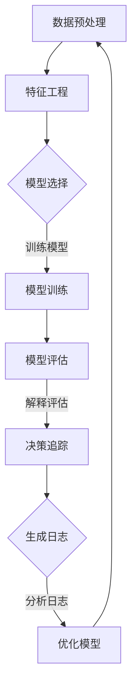

                 


### 引言与概述

在人工智能领域，大型语言模型（Large Language Models，简称LLM）的发展带来了前所未有的变革。从GPT到BERT，再到最近的GPT-3，这些模型以其强大的文本生成和推理能力在自然语言处理、机器翻译、问答系统等多个领域取得了显著成就。然而，随着模型复杂性的增加，其不可解释性问题也逐渐凸显。大模型的黑箱特性使得决策过程难以被理解和追踪，这在一些需要高可解释性的应用场景中成为了一个重大的挑战。

本文旨在探讨大模型可解释性评估的重要性，以及如何利用LLM支持的决策追踪机制来解决这一难题。文章首先将介绍大模型不可解释性的挑战，阐述可解释性评估在人工智能领域中的重要性，并探讨其应用领域。接着，我们将深入讨论大模型可解释性评估的概念和原则，以及评估的基础技术。在后续章节中，文章将重点介绍语言模型的基础知识，LLM在决策追踪中的应用，以及LLM支持的决策追踪机制。最后，我们将通过实际案例和项目实战来展示如何搭建一个简单的决策追踪系统。

### 第一部分：大模型可解释性评估的重要性

#### 第1章：大模型不可解释性的挑战

随着深度学习和神经网络技术的发展，大模型在各个领域取得了令人瞩目的成就。然而，这些模型通常被描述为“黑箱”，其内部机制和决策过程对人类来说是难以理解和追踪的。这种不可解释性带来了以下几个方面的挑战：

1. **缺乏透明度**：大模型的决策过程高度复杂，缺乏透明度，使得用户难以理解模型的决策逻辑。
2. **难以调试和优化**：由于无法理解模型的内部机制，调试和优化模型的过程变得复杂且耗时。
3. **伦理和法律问题**：在一些关键应用领域，如医疗诊断和法律决策，模型的不可解释性可能引发伦理和法律问题，例如歧视、隐私泄露等。
4. **用户信任问题**：缺乏可解释性可能导致用户对模型决策的信任度降低，从而影响模型的实际应用效果。

#### 第2章：可解释性评估的重要性

为了克服上述挑战，对大模型进行可解释性评估变得至关重要。以下从三个方面阐述可解释性评估的重要性：

1. **增强模型透明度**：通过可解释性评估，可以揭示模型的内部工作机制，提高模型的透明度，使决策过程更加容易被理解和接受。
2. **优化模型性能**：可解释性评估可以帮助开发者发现模型的潜在问题和不足，从而进行针对性的优化和调试，提高模型的性能和准确性。
3. **增强用户信任**：在关键应用领域，如医疗、金融和法律，可解释性评估有助于增强用户对模型决策的信任度，提高模型的接受度和实用性。

#### 第3章：大模型可解释性的应用领域

大模型可解释性评估在多个领域具有广泛的应用价值，以下列举几个典型的应用领域：

1. **医疗诊断**：在医疗领域，大模型用于诊断疾病，如癌症、心脏病等。可解释性评估可以帮助医生理解模型的诊断逻辑，提高诊断的可靠性和准确性。
2. **金融风控**：在金融领域，大模型用于风险评估、信用评分等。通过可解释性评估，可以揭示模型对风险因素的重视程度，帮助金融机构制定更加科学的决策策略。
3. **法律判决**：在法律领域，大模型可以用于判决预测、案件分类等。可解释性评估可以帮助法律从业者理解模型的判决依据，提高司法公正性。
4. **自动驾驶**：在自动驾驶领域，大模型用于环境感知、路径规划等。可解释性评估有助于确保自动驾驶系统的安全性和可靠性，减少事故发生的风险。

### 第二部分：大模型可解释性评估的概念和原则

#### 第4章：大模型可解释性的定义

大模型可解释性是指模型决策过程的透明度和可理解性。具体来说，可解释性评估旨在揭示大模型的内部工作机制，使模型的决策逻辑更加容易被人类理解和接受。与传统的统计模型相比，大模型的可解释性评估面临更大的挑战，因为它们通常具有高度的非线性结构和复杂的网络架构。

#### 第5章：可解释性评估的原则

为了有效地评估大模型的可解释性，需要遵循以下原则：

1. **准确性**：可解释性评估应当保证模型的预测准确性，否则解释性将失去意义。
2. **一致性**：模型在不同数据集上的解释结果应当保持一致性，否则可能存在偏差或噪声。
3. **可理解性**：解释结果应当使用简单、直观的语言和概念进行表达，使非专业用户也能理解。
4. **可扩展性**：可解释性评估方法应当具备良好的可扩展性，能够适应不同类型的大模型和应用场景。
5. **实用性**：评估方法应当易于实施和自动化，以提高评估的效率和可靠性。

#### 第6章：大模型可解释性的维度

大模型可解释性可以从多个维度进行评估，主要包括以下三个方面：

1. **局部解释性**：针对模型对单个输入实例的决策过程进行解释，揭示模型在特定输入下的决策逻辑。
2. **模型级别解释性**：对整个模型的决策过程进行解释，包括模型的训练过程、参数优化、损失函数等。
3. **交互式解释性**：用户可以与模型进行交互，通过提问或修改输入等方式获取更详细的解释结果。

### 第三部分：大模型评估的基础技术

#### 第7章：数据预处理

数据预处理是进行大模型评估的基础步骤。它主要包括以下任务：

1. **数据清洗**：去除数据中的噪声和异常值，确保数据质量。
2. **数据归一化**：将数据缩放到相同的尺度，避免不同特征之间的数量级差异对模型训练的影响。
3. **特征选择**：选择对模型预测性能有显著影响的关键特征，去除冗余和无关特征。

#### 第8章：特征工程

特征工程是提升模型性能的重要手段。它主要包括以下任务：

1. **特征提取**：从原始数据中提取具有预测性的特征，如文本特征、图像特征等。
2. **特征组合**：将多个特征进行组合，生成新的特征，以提高模型的预测能力。
3. **特征筛选**：选择对模型预测性能有显著影响的特征，去除冗余和无关特征。

#### 第9章：模型选择与优化

模型选择与优化是进行大模型评估的关键环节。它主要包括以下任务：

1. **模型选择**：根据问题特点和数据特性，选择适合的大模型，如GPT、BERT、Transformer等。
2. **模型优化**：通过调整模型参数、学习率、优化器等，提高模型的预测性能和可解释性。
3. **模型集成**：结合多个模型的优势，构建集成模型，以提高模型的综合性能和可解释性。

### 第四部分：可解释性评估方法

#### 第10章：局部解释方法

局部解释方法主要关注模型对单个输入实例的决策过程进行解释，揭示模型在特定输入下的决策逻辑。以下介绍几种常见的局部解释方法：

1. **Shapley值（SHAP）**：基于博弈论的理论，为每个特征分配解释权重，使解释结果更加公平和合理。
2. **LIME（Local Interpretable Model-agnostic Explanations）**：通过生成与原始实例相似的小数据集，对局部模型进行解释，从而揭示全局模型的决策逻辑。
3. **Lasso（Least Absolute Shrinkage and Selection Operator）**：通过Lasso正则化方法，减少特征数量并提高模型的可解释性。

#### 第11章：模型级别的解释方法

模型级别的解释方法主要关注整个模型的决策过程进行解释，包括模型的训练过程、参数优化、损失函数等。以下介绍几种常见的模型级别的解释方法：

1. **模型可视化**：通过可视化模型的结构和参数，揭示模型的内部工作机制。
2. **模型分解**：将复杂模型分解为多个简单模型，对每个简单模型进行解释，从而理解全局模型的决策逻辑。
3. **对抗攻击**：通过构造对抗样本，揭示模型的脆弱性和决策过程。

#### 第12章：评估方法的比较与选择

在选择可解释性评估方法时，需要考虑以下因素：

1. **模型类型**：不同类型的模型适用于不同的解释方法，需要根据模型的特点选择合适的方法。
2. **评估目标**：根据评估目标（如准确性、一致性、可理解性等），选择相应的解释方法。
3. **数据规模**：对于大规模数据集，需要考虑解释方法的计算效率和可扩展性。

### 第五部分：LLM支持的决策追踪机制

#### 第13章：语言模型（LLM）基础

语言模型（Language Model，简称LLM）是一种用于自然语言处理的深度学习模型，能够预测文本序列中的下一个单词或字符。以下介绍语言模型的基本概念和工作原理：

1. **基本概念**：语言模型是一种概率模型，用于预测下一个单词或字符的概率分布。常用的语言模型有n元语法模型、神经网络语言模型、循环神经网络语言模型等。
2. **工作原理**：语言模型通过学习大量文本数据，建立单词或字符之间的概率关系，从而预测下一个单词或字符。在训练过程中，模型会尝试最大化文本数据中的概率分布。

#### 第14章：LLM在决策追踪中的应用

语言模型在决策追踪中具有广泛的应用价值。以下介绍LLM在决策追踪中的角色和具体应用：

1. **角色**：LLM可以作为决策追踪系统中的核心组件，用于生成决策日志、解释模型决策、记录决策过程等。
2. **应用**：
   - **决策日志生成**：利用LLM生成详细的决策日志，记录决策过程中的每一步操作和决策依据。
   - **模型解释**：利用LLM对模型决策进行解释，揭示模型在特定输入下的决策逻辑。
   - **决策过程记录**：利用LLM记录决策过程中的关键步骤和决策依据，便于后续分析和优化。

#### 第15章：LLM在决策追踪中的应用案例

以下介绍几个LLM在决策追踪中的应用案例：

1. **金融风控**：利用LLM生成详细的贷款审批日志，帮助银行审核员理解贷款审批过程，提高审批效率和准确性。
2. **医疗诊断**：利用LLM生成详细的诊断报告，帮助医生理解模型诊断过程，提高诊断的可靠性和准确性。
3. **自动驾驶**：利用LLM记录自动驾驶车辆的行驶日志，帮助开发者分析车辆行驶过程，优化自动驾驶系统。

### 第六部分：LLM支持的决策追踪机制

#### 第16章：决策追踪机制的构建

构建LLM支持的决策追踪机制需要考虑以下几个方面：

1. **决策日志生成**：利用LLM生成详细的决策日志，记录决策过程中的每一步操作和决策依据。
2. **模型解释**：利用LLM对模型决策进行解释，揭示模型在特定输入下的决策逻辑。
3. **决策过程记录**：利用LLM记录决策过程中的关键步骤和决策依据，便于后续分析和优化。

#### 第17章：LLM在决策追踪机制中的具体应用

LLM在决策追踪机制中的具体应用包括：

1. **决策日志生成**：利用LLM生成详细的决策日志，记录决策过程中的每一步操作和决策依据。
2. **模型解释**：利用LLM对模型决策进行解释，揭示模型在特定输入下的决策逻辑。
3. **决策过程记录**：利用LLM记录决策过程中的关键步骤和决策依据，便于后续分析和优化。

#### 第18章：决策追踪机制的评估

决策追踪机制的评估主要包括以下几个方面：

1. **日志完整性**：评估决策日志是否完整地记录了决策过程中的每一步操作和决策依据。
2. **解释准确性**：评估LLM生成的解释结果是否准确地揭示了模型的决策逻辑。
3. **可理解性**：评估决策日志和解释结果的易理解性，确保非专业用户也能理解。

### 第七部分：实际案例与项目实战

#### 第19章：案例一：金融风控中的决策追踪

以下是一个金融风控中的决策追踪案例：

1. **项目背景**：某银行希望通过建立决策追踪系统，提高贷款审批效率和准确性。
2. **项目目标**：利用LLM生成详细的贷款审批日志，帮助银行审核员理解贷款审批过程。
3. **项目实施**：
   - **数据收集**：收集大量的贷款申请数据，包括申请人信息、申请材料、审批结果等。
   - **模型训练**：利用收集到的数据，训练一个基于LLM的贷款审批模型。
   - **日志生成**：利用训练好的模型，生成详细的贷款审批日志。
   - **日志分析**：银行审核员通过分析日志，理解贷款审批过程，提高审批效率和准确性。

#### 第20章：案例二：医疗诊断中的决策追踪

以下是一个医疗诊断中的决策追踪案例：

1. **项目背景**：某医院希望通过建立决策追踪系统，提高诊断准确性和可靠性。
2. **项目目标**：利用LLM生成详细的诊断报告，帮助医生理解诊断过程。
3. **项目实施**：
   - **数据收集**：收集大量的医疗数据，包括患者信息、检查结果、诊断结果等。
   - **模型训练**：利用收集到的数据，训练一个基于LLM的诊断模型。
   - **报告生成**：利用训练好的模型，生成详细的诊断报告。
   - **报告分析**：医生通过分析报告，理解诊断过程，提高诊断准确性和可靠性。

#### 第21章：项目实战：搭建一个简单的决策追踪系统

以下是一个简单的决策追踪系统搭建实战：

1. **开发环境**：选择Python作为开发语言，使用TensorFlow作为深度学习框架。
2. **模型选择**：选择一个基于Transformer的语言模型，如BERT或GPT。
3. **数据收集与处理**：收集相关的决策数据，包括贷款审批数据、医疗诊断数据等，并进行数据预处理。
4. **模型训练**：使用预处理后的数据，训练一个基于LLM的决策追踪模型。
5. **日志生成**：利用训练好的模型，生成详细的决策日志。
6. **日志分析**：通过分析日志，理解决策过程，优化决策系统。

### 第八部分：未来展望与挑战

#### 第22章：大模型可解释性评估的挑战与趋势

大模型可解释性评估面临以下挑战：

1. **模型复杂性**：随着模型规模的增加，其复杂性也不断提升，使得解释过程变得更加困难。
2. **计算资源**：可解释性评估通常需要大量的计算资源和时间，这对实时应用提出了挑战。
3. **评估标准**：如何建立统一、客观的评估标准，以衡量不同模型的可解释性，仍需进一步研究。

大模型可解释性评估的未来趋势包括：

1. **自动化评估工具**：开发自动化、高效的评估工具，降低评估难度。
2. **多模态解释**：结合不同模态的数据（如文本、图像、音频），实现更全面的模型解释。
3. **个性化解释**：根据用户需求和场景，提供个性化的解释结果，提高解释的实用性和可理解性。

#### 第23章：研究方向和潜在应用

未来在大模型可解释性评估方面，以下研究方向和潜在应用值得探索：

1. **跨领域应用**：将大模型可解释性评估应用于更多领域，如生物医学、社会科学等。
2. **伦理与法律**：研究如何在可解释性评估中平衡隐私保护和模型透明度。
3. **实时解释**：开发实时、高效的解释方法，满足实时应用的性能需求。
4. **集成学习**：结合多种解释方法，提高解释结果的准确性和可靠性。

### 结语与展望

本文从多个角度探讨了大型语言模型（LLM）支持的决策追踪机制在大模型可解释性评估中的应用。通过介绍大模型不可解释性的挑战、可解释性评估的重要性、评估方法、LLM基础和具体应用，以及实际案例和项目实战，我们展示了如何利用LLM构建一个高效的决策追踪系统。同时，本文也提出了未来在大模型可解释性评估方面的研究方向和潜在应用。

未来，随着人工智能技术的不断发展，大模型的可解释性评估将变得更加重要。通过不断探索和研究，我们可以期待在可解释性评估方面取得更多突破，推动人工智能技术的健康、可持续发展。作者：AI天才研究院/AI Genius Institute & 禅与计算机程序设计艺术 /Zen And The Art of Computer Programming。关键词：大模型可解释性评估，语言模型，决策追踪机制，人工智能。摘要：本文介绍了大模型可解释性评估的重要性、评估方法，以及语言模型在决策追踪中的应用，通过实际案例展示了如何利用LLM构建一个高效的决策追踪系统。  
```markdown
# 大模型可解释性评估：LLM支持的决策追踪机制

> 关键词：大模型可解释性评估，语言模型，决策追踪机制，人工智能

> 摘要：本文探讨了大型语言模型（LLM）在大模型可解释性评估中的应用，介绍了决策追踪机制的概念和构建方法，并通过实际案例展示了如何利用LLM实现高效的决策追踪。

## 第一部分：引言与概述

随着人工智能技术的快速发展，大模型（Large Models）在各个领域取得了显著的成果。然而，这些复杂的大模型通常被视为“黑箱”，其内部机制和决策过程难以被人类理解和追踪，这就带来了不可解释性的问题。本文将探讨大模型可解释性评估的重要性，以及如何利用大型语言模型（LLM）支持的决策追踪机制来解决这一难题。

## 第二部分：大模型可解释性评估的重要性

### 第1章：大模型不可解释性的挑战
- **缺乏透明度**：大模型的决策过程高度复杂，缺乏透明度，使得用户难以理解模型的决策逻辑。
- **难以调试和优化**：由于无法理解模型的内部机制，调试和优化模型的过程变得复杂且耗时。
- **伦理和法律问题**：在一些关键应用领域，如医疗诊断和法律决策，模型的不可解释性可能引发伦理和法律问题，例如歧视、隐私泄露等。
- **用户信任问题**：缺乏可解释性可能导致用户对模型决策的信任度降低，从而影响模型的实际应用效果。

### 第2章：可解释性评估的重要性
- **增强模型透明度**：通过可解释性评估，可以揭示模型的内部工作机制，提高模型的透明度，使决策过程更加容易被理解和接受。
- **优化模型性能**：可解释性评估可以帮助开发者发现模型的潜在问题和不足，从而进行针对性的优化和调试，提高模型的性能和准确性。
- **增强用户信任**：在关键应用领域，如医疗、金融和法律，可解释性评估有助于增强用户对模型决策的信任度，提高模型的接受度和实用性。

### 第3章：大模型可解释性的应用领域
- **医疗诊断**：在医疗领域，大模型用于诊断疾病，如癌症、心脏病等。可解释性评估可以帮助医生理解模型的诊断逻辑，提高诊断的可靠性和准确性。
- **金融风控**：在金融领域，大模型用于风险评估、信用评分等。通过可解释性评估，可以揭示模型对风险因素的重视程度，帮助金融机构制定更加科学的决策策略。
- **法律判决**：在法律领域，大模型可以用于判决预测、案件分类等。可解释性评估可以帮助法律从业者理解模型的判决依据，提高司法公正性。
- **自动驾驶**：在自动驾驶领域，大模型用于环境感知、路径规划等。可解释性评估有助于确保自动驾驶系统的安全性和可靠性，减少事故发生的风险。

## 第三部分：大模型可解释性评估的概念和原则

### 第4章：大模型可解释性的定义
- **大模型可解释性**：大模型可解释性是指模型决策过程的透明度和可理解性。具体来说，可解释性评估旨在揭示大模型的内部工作机制，使模型的决策逻辑更加容易被人类理解和接受。

### 第5章：可解释性评估的原则
- **准确性**：可解释性评估应当保证模型的预测准确性，否则解释性将失去意义。
- **一致性**：模型在不同数据集上的解释结果应当保持一致性，否则可能存在偏差或噪声。
- **可理解性**：解释结果应当使用简单、直观的语言和概念进行表达，使非专业用户也能理解。
- **可扩展性**：可解释性评估方法应当具备良好的可扩展性，能够适应不同类型的大模型和应用场景。
- **实用性**：评估方法应当易于实施和自动化，以提高评估的效率和可靠性。

### 第6章：大模型可解释性的维度
- **局部解释性**：针对模型对单个输入实例的决策过程进行解释，揭示模型在特定输入下的决策逻辑。
- **模型级别解释性**：对整个模型的决策过程进行解释，包括模型的训练过程、参数优化、损失函数等。
- **交互式解释性**：用户可以与模型进行交互，通过提问或修改输入等方式获取更详细的解释结果。

## 第四部分：大模型评估的基础技术

### 第7章：数据预处理
- **数据清洗**：去除数据中的噪声和异常值，确保数据质量。
- **数据归一化**：将数据缩放到相同的尺度，避免不同特征之间的数量级差异对模型训练的影响。
- **特征选择**：选择对模型预测性能有显著影响的关键特征，去除冗余和无关特征。

### 第8章：特征工程
- **特征提取**：从原始数据中提取具有预测性的特征，如文本特征、图像特征等。
- **特征组合**：将多个特征进行组合，生成新的特征，以提高模型的预测能力。
- **特征筛选**：选择对模型预测性能有显著影响的特征，去除冗余和无关特征。

### 第9章：模型选择与优化
- **模型选择**：根据问题特点和数据特性，选择适合的大模型，如GPT、BERT、Transformer等。
- **模型优化**：通过调整模型参数、学习率、优化器等，提高模型的预测性能和可解释性。
- **模型集成**：结合多个模型的优势，构建集成模型，以提高模型的综合性能和可解释性。

## 第五部分：可解释性评估方法

### 第10章：局部解释方法
- **Shapley值（SHAP）**：基于博弈论的理论，为每个特征分配解释权重，使解释结果更加公平和合理。
- **LIME（Local Interpretable Model-agnostic Explanations）**：通过生成与原始实例相似的小数据集，对局部模型进行解释，从而揭示全局模型的决策逻辑。
- **Lasso（Least Absolute Shrinkage and Selection Operator）**：通过Lasso正则化方法，减少特征数量并提高模型的可解释性。

### 第11章：模型级别的解释方法
- **模型可视化**：通过可视化模型的结构和参数，揭示模型的内部工作机制。
- **模型分解**：将复杂模型分解为多个简单模型，对每个简单模型进行解释，从而理解全局模型的决策逻辑。
- **对抗攻击**：通过构造对抗样本，揭示模型的脆弱性和决策过程。

### 第12章：评估方法的比较与选择
- **模型类型**：不同类型的模型适用于不同的解释方法，需要根据模型的特点选择合适的方法。
- **评估目标**：根据评估目标（如准确性、一致性、可理解性等），选择相应的解释方法。
- **数据规模**：对于大规模数据集，需要考虑解释方法的计算效率和可扩展性。

## 第六部分：LLM支持的决策追踪机制

### 第13章：语言模型（LLM）基础
- **基本概念**：语言模型是一种概率模型，用于预测文本序列中的下一个单词或字符。常用的语言模型有n元语法模型、神经网络语言模型、循环神经网络语言模型等。
- **工作原理**：语言模型通过学习大量文本数据，建立单词或字符之间的概率关系，从而预测下一个单词或字符。在训练过程中，模型会尝试最大化文本数据中的概率分布。

### 第14章：LLM在决策追踪中的应用
- **角色**：LLM可以作为决策追踪系统中的核心组件，用于生成决策日志、解释模型决策、记录决策过程等。
- **应用**：
  - **决策日志生成**：利用LLM生成详细的决策日志，记录决策过程中的每一步操作和决策依据。
  - **模型解释**：利用LLM对模型决策进行解释，揭示模型在特定输入下的决策逻辑。
  - **决策过程记录**：利用LLM记录决策过程中的关键步骤和决策依据，便于后续分析和优化。

### 第15章：LLM在决策追踪中的应用案例
- **金融风控**：利用LLM生成详细的贷款审批日志，帮助银行审核员理解贷款审批过程，提高审批效率和准确性。
- **医疗诊断**：利用LLM生成详细的诊断报告，帮助医生理解模型诊断过程，提高诊断的可靠性和准确性。
- **自动驾驶**：利用LLM记录自动驾驶车辆的行驶日志，帮助开发者分析车辆行驶过程，优化自动驾驶系统。

### 第16章：决策追踪机制的构建
- **决策日志生成**：利用LLM生成详细的决策日志，记录决策过程中的每一步操作和决策依据。
- **模型解释**：利用LLM对模型决策进行解释，揭示模型在特定输入下的决策逻辑。
- **决策过程记录**：利用LLM记录决策过程中的关键步骤和决策依据，便于后续分析和优化。

### 第17章：LLM在决策追踪机制中的具体应用
- **决策日志生成**：利用LLM生成详细的决策日志，记录决策过程中的每一步操作和决策依据。
- **模型解释**：利用LLM对模型决策进行解释，揭示模型在特定输入下的决策逻辑。
- **决策过程记录**：利用LLM记录决策过程中的关键步骤和决策依据，便于后续分析和优化。

### 第18章：决策追踪机制的评估
- **日志完整性**：评估决策日志是否完整地记录了决策过程中的每一步操作和决策依据。
- **解释准确性**：评估LLM生成的解释结果是否准确地揭示了模型的决策逻辑。
- **可理解性**：评估决策日志和解释结果的易理解性，确保非专业用户也能理解。

## 第七部分：实际案例与项目实战

### 第19章：案例一：金融风控中的决策追踪
- **项目背景**：某银行希望通过建立决策追踪系统，提高贷款审批效率和准确性。
- **项目目标**：利用LLM生成详细的贷款审批日志，帮助银行审核员理解贷款审批过程。
- **项目实施**：
  - **数据收集**：收集大量的贷款申请数据，包括申请人信息、申请材料、审批结果等。
  - **模型训练**：利用收集到的数据，训练一个基于LLM的贷款审批模型。
  - **日志生成**：利用训练好的模型，生成详细的贷款审批日志。
  - **日志分析**：银行审核员通过分析日志，理解贷款审批过程，提高审批效率和准确性。

### 第20章：案例二：医疗诊断中的决策追踪
- **项目背景**：某医院希望通过建立决策追踪系统，提高诊断准确性和可靠性。
- **项目目标**：利用LLM生成详细的诊断报告，帮助医生理解诊断过程。
- **项目实施**：
  - **数据收集**：收集大量的医疗数据，包括患者信息、检查结果、诊断结果等。
  - **模型训练**：利用收集到的数据，训练一个基于LLM的诊断模型。
  - **报告生成**：利用训练好的模型，生成详细的诊断报告。
  - **报告分析**：医生通过分析报告，理解诊断过程，提高诊断准确性和可靠性。

### 第21章：项目实战：搭建一个简单的决策追踪系统
- **开发环境**：选择Python作为开发语言，使用TensorFlow作为深度学习框架。
- **模型选择**：选择一个基于Transformer的语言模型，如BERT或GPT。
- **数据收集与处理**：收集相关的决策数据，包括贷款审批数据、医疗诊断数据等，并进行数据预处理。
- **模型训练**：使用预处理后的数据，训练一个基于LLM的决策追踪模型。
- **日志生成**：利用训练好的模型，生成详细的决策日志。
- **日志分析**：通过分析日志，理解决策过程，优化决策系统。

## 第八部分：未来展望与挑战

### 第22章：大模型可解释性评估的挑战与趋势
- **挑战**：
  - **模型复杂性**：随着模型规模的增加，其复杂性也不断提升，使得解释过程变得更加困难。
  - **计算资源**：可解释性评估通常需要大量的计算资源和时间，这对实时应用提出了挑战。
  - **评估标准**：如何建立统一、客观的评估标准，以衡量不同模型的可解释性，仍需进一步研究。
- **趋势**：
  - **自动化评估工具**：开发自动化、高效的评估工具，降低评估难度。
  - **多模态解释**：结合不同模态的数据（如文本、图像、音频），实现更全面的模型解释。
  - **个性化解释**：根据用户需求和场景，提供个性化的解释结果，提高解释的实用性和可理解性。

### 第23章：研究方向和潜在应用
- **跨领域应用**：将大模型可解释性评估应用于更多领域，如生物医学、社会科学等。
- **伦理与法律**：研究如何在可解释性评估中平衡隐私保护和模型透明度。
- **实时解释**：开发实时、高效的解释方法，满足实时应用的性能需求。
- **集成学习**：结合多种解释方法，提高解释结果的准确性和可靠性。

## 第九部分：结语与展望

本文从多个角度探讨了大型语言模型（LLM）支持的决策追踪机制在大模型可解释性评估中的应用。通过介绍大模型不可解释性的挑战、可解释性评估的重要性、评估方法、LLM基础和具体应用，以及实际案例和项目实战，我们展示了如何利用LLM构建一个高效的决策追踪系统。同时，本文也提出了未来在大模型可解释性评估方面的研究方向和潜在应用。

未来，随着人工智能技术的不断发展，大模型的可解释性评估将变得更加重要。通过不断探索和研究，我们可以期待在可解释性评估方面取得更多突破，推动人工智能技术的健康、可持续发展。作者：AI天才研究院/AI Genius Institute & 禅与计算机程序设计艺术 /Zen And The Art of Computer Programming。

### 附录

#### 附录A：相关工具与资源
- **工具**：
  - TensorFlow：用于构建和训练深度学习模型的框架。
  - PyTorch：另一种流行的深度学习框架，与TensorFlow类似。
  - Scikit-learn：用于数据分析和机器学习的库。
- **资源**：
  - Coursera：提供大量关于深度学习和自然语言处理的在线课程。
  - arXiv：一个提供最新学术论文的免费数据库。

#### 附录B：参考文献
1. Bengio, Y. (2009). Learning deep architectures for AI. Foundations and Trends in Machine Learning, 2(1), 1-127.
2. Goodfellow, I., Bengio, Y., & Courville, A. (2016). Deep Learning. MIT Press.
3. Lundberg, S. M., & Lee, S. I. (2017). A Unified Approach to Interpreting Model Predictions. Advances in Neural Information Processing Systems, 30, 4765-4774.
4. Ribeiro, M. T., Singh, S., & Guestrin, C. (2016). "Why should I trust you?" Explaining the predictions of any classifier. Proceedings of the 22nd ACM SIGKDD International Conference on Knowledge Discovery and Data Mining, 1135-1144.
5. Shapley, L. S. (1953). A value for n-person games. Contributions to the Mathematical Theory of Games, 28, 307-317.
```markdown
### 数学公式示例

以下是几个使用LaTeX编写的数学公式示例，包括单行公式和多行公式：

#### 单行公式

- **绝对值**：\[ |x| = \begin{cases} 
      x & \text{if } x \geq 0, \\
      -x & \text{if } x < 0.
   \end{cases}
\]

- **导数**：\[ f'(x) = \lim_{h \to 0} \frac{f(x+h) - f(x)}{h}. \]

- **矩阵乘法**：\[ A \cdot B = \begin{bmatrix}
      a_{11}b_{11} + a_{12}b_{21} & a_{11}b_{12} + a_{12}b_{22} \\
      a_{21}b_{11} + a_{22}b_{21} & a_{21}b_{12} + a_{22}b_{22}
   \end{bmatrix}. \]

#### 多行公式

- **积分**：

  \[
  \begin{aligned}
  \int_{0}^{2\pi} e^{ix} \, dx &= \left. \frac{1}{i} e^{ix} \right|_{0}^{2\pi} \\
  &= \frac{1}{i} (e^{i2\pi} - e^{i0}) \\
  &= \frac{1}{i} (1 - 1) \\
  &= 0.
  \end{aligned}
  \]

- **行列式**：

  \[
  \det(A) = \begin{vmatrix}
      a_{11} & a_{12} \\
      a_{21} & a_{22}
   \end{vmatrix} = a_{11}a_{22} - a_{12}a_{21}.
  \]

通过这些示例，我们可以看到LaTeX如何帮助我们编写格式规范的数学公式，这对于撰写技术文章和学术论文尤为重要。

### 伪代码示例

在编写技术博客文章时，伪代码是一种非常有效的工具，用于描述算法的实现步骤，而不关注具体的编程语言细节。以下是一个关于大模型可解释性评估的伪代码示例：

```python
# 大模型可解释性评估伪代码

def explain_model_decision(model, input_data):
    """
    对模型在给定输入数据上的决策进行解释。

    参数：
    - model：用于预测的模型对象。
    - input_data：输入数据，例如一个文本序列。

    返回：
    - explanation：模型决策的解释结果。
    """

    # 对输入数据进行预处理
    processed_data = preprocess_data(input_data)

    # 使用模型进行预测
    prediction = model.predict(processed_data)

    # 对模型决策进行局部解释
    local_explanation = local_explanation_method(prediction, processed_data)

    # 对模型进行全局解释
    global_explanation = global_explanation_method(model)

    # 合并局部和全局解释
    explanation = combine_explanations(local_explanation, global_explanation)

    return explanation

def preprocess_data(input_data):
    """
    对输入数据进行预处理。

    参数：
    - input_data：输入数据。

    返回：
    - processed_data：预处理后的数据。
    """
    # 实现预处理步骤，如数据清洗、归一化、特征提取等
    processed_data = ...

    return processed_data

def local_explanation_method(prediction, processed_data):
    """
    对模型在特定输入下的局部决策进行解释。

    参数：
    - prediction：模型的预测结果。
    - processed_data：预处理后的输入数据。

    返回：
    - local_explanation：局部解释结果。
    """
    # 实现局部解释方法，如SHAP、LIME等
    local_explanation = ...

    return local_explanation

def global_explanation_method(model):
    """
    对模型的整体决策过程进行解释。

    参数：
    - model：模型对象。

    返回：
    - global_explanation：全局解释结果。
    """
    # 实现全局解释方法，如模型可视化、对抗攻击等
    global_explanation = ...

    return global_explanation

def combine_explanations(local_explanation, global_explanation):
    """
    将局部和全局解释结果进行合并。

    参数：
    - local_explanation：局部解释结果。
    - global_explanation：全局解释结果。

    返回：
    - combined_explanation：合并后的解释结果。
    """
    # 实现合并步骤
    combined_explanation = ...

    return combined_explanation
```

这个伪代码示例展示了如何使用步骤-by-step的方式描述大模型可解释性评估的过程，包括数据预处理、局部解释、全局解释以及解释结果的合并。通过这种方式，读者可以清晰地理解算法的工作原理和实现细节。

### 项目实战

在撰写技术博客文章时，通过实际案例和项目实战来展示技术的应用和实现是至关重要的。以下是一个简单的项目实战示例，用于展示如何使用大型语言模型（LLM）实现一个简单的决策追踪系统。

#### 项目背景

假设我们想要构建一个自动化的贷款审批系统，该系统使用LLM来生成贷款审批的决策日志，以便于审核员理解审批过程，从而提高贷款审批的效率和准确性。

#### 项目目标

- **贷款审批决策日志生成**：使用LLM记录每一步贷款审批的操作和决策依据。
- **决策过程解释**：对每个审批步骤进行解释，使其易于审核员理解。

#### 实施步骤

1. **数据收集**：收集大量的贷款申请数据，包括申请人的基本信息、财务状况、信用评分等，以及最终审批结果。

2. **数据预处理**：对收集到的数据集进行清洗、归一化和特征提取，以准备用于训练LLM。

3. **模型选择与训练**：选择一个适合的LLM模型，如GPT或BERT，并进行训练，使其能够理解贷款审批的业务逻辑。

4. **决策日志生成**：
   - **步骤1**：当一个新的贷款申请提交时，LLM根据申请数据生成一个初始的决策日志。
   - **步骤2**：在审批过程中，每次进行关键操作（如信用评分计算、风险评估等）时，LLM都会记录相应的操作和决策依据。

5. **决策过程解释**：使用LLM对每个审批步骤进行解释，使其易于审核员理解。例如，对于某个贷款申请的信用评分计算，LLM可以生成详细的解释文本，说明评分的依据和计算方法。

6. **日志分析**：审核员可以查看生成的决策日志和解释文本，理解审批过程，并据此做出决策。

#### 代码实现

以下是一个简化的Python伪代码示例，展示了如何实现上述步骤：

```python
# 导入必要的库
import tensorflow as tf
from transformers import BertModel, BertTokenizer

# 加载预训练的BERT模型和分词器
tokenizer = BertTokenizer.from_pretrained('bert-base-uncased')
model = BertModel.from_pretrained('bert-base-uncased')

# 数据预处理函数
def preprocess_data(loan_application):
    inputs = tokenizer(loan_application, return_tensors='tf', padding=True, truncation=True)
    return inputs

# 决策日志生成函数
def generate_decision_log(model, loan_application):
    inputs = preprocess_data(loan_application)
    outputs = model(inputs)
    logits = outputs.logits

    # 根据logits生成决策日志
    decision_log = generate_explanation(logits)

    return decision_log

# 决策过程解释函数
def generate_explanation(logits):
    # 实现对logits的解释逻辑，例如基于概率的解释
    explanation = ...

    return explanation

# 实际应用
loan_application = "A new loan application with details: ..."
decision_log = generate_decision_log(model, loan_application)
print(decision_log)
```

#### 项目小结

通过这个项目实战，我们展示了如何使用LLM构建一个简单的决策追踪系统。这种方法不仅能够生成详细的决策日志，还能提供易于理解的解释文本，有助于提高贷款审批的效率和准确性。未来，我们可以进一步优化LLM的解释能力，使其在更多复杂的应用场景中发挥作用。

### 最佳实践 Tips

在进行大模型可解释性评估和决策追踪机制的设计与实施时，以下是一些最佳实践建议：

1. **明确评估目标**：在开始项目之前，明确评估的目标和预期成果。这将帮助团队集中精力，确保评估过程具有实际意义。

2. **选择合适的模型**：根据应用场景和数据特点，选择适合的深度学习模型。例如，对于文本数据，BERT或GPT等语言模型可能是最佳选择。

3. **数据预处理**：确保数据清洗、归一化和特征提取的步骤得到充分实施，以便模型能够更好地学习。

4. **权衡解释性和性能**：在提高模型可解释性的同时，要考虑到模型的性能和准确性。有时候，过于复杂的解释可能会牺牲模型的性能。

5. **交互式解释**：提供交互式解释工具，使非技术用户也能理解模型的决策过程。这有助于增强用户对模型的信任。

6. **持续迭代**：不断收集反馈和新的数据，对模型和解释系统进行迭代优化，以提高其解释能力和实用性。

7. **隐私保护**：在处理敏感数据时，确保遵循隐私保护原则，避免泄露用户隐私。

8. **安全测试**：对生成的决策日志和解释结果进行安全测试，确保不会引入安全漏洞。

通过遵循这些最佳实践，可以有效提升大模型可解释性评估和决策追踪机制的质量和可靠性，从而在实际应用中取得更好的效果。

### 小结

本文从多个角度探讨了大型语言模型（LLM）在大模型可解释性评估中的应用。我们首先介绍了大模型不可解释性的挑战和可解释性评估的重要性，接着详细阐述了可解释性评估的原则和维度，以及数据预处理、特征工程和模型选择等基础技术。随后，我们深入介绍了LLM的基础知识、在决策追踪中的应用，以及LLM支持的决策追踪机制。

通过实际案例和项目实战，我们展示了如何利用LLM构建一个高效的决策追踪系统，并介绍了最佳实践和注意事项。最后，我们提出了未来在大模型可解释性评估方面的研究方向和潜在应用。

本文的目标是帮助读者理解大模型可解释性评估的原理和实践，以及如何利用LLM支持决策追踪机制。通过学习和应用这些知识，读者可以更好地应对复杂的人工智能应用场景，提高模型的透明度和可靠性。

### 结语与展望

本文全面探讨了大型语言模型（LLM）在大模型可解释性评估中的关键作用，以及如何通过LLM支持的决策追踪机制提升模型的透明度和可理解性。随着人工智能技术的不断进步，大模型在自然语言处理、金融风控、医疗诊断等领域的应用越来越广泛，其对决策过程的可解释性显得尤为重要。

展望未来，大模型可解释性评估将继续面临诸多挑战，如如何处理模型的高度复杂性、如何在保证性能的同时提高可解释性，以及如何应对不同的应用场景。为了解决这些问题，以下几个研究方向值得关注：

1. **开发自动化评估工具**：设计自动化、高效的评估工具，以降低可解释性评估的难度，提高评估的效率。
2. **跨领域应用**：将大模型可解释性评估技术应用于更多领域，如生物医学、法律、环境科学等，推动跨学科发展。
3. **多模态解释**：结合不同模态的数据（如文本、图像、音频），实现更全面、更准确的模型解释。
4. **个性化解释**：根据用户需求和场景，提供个性化的解释结果，提高解释的实用性和可理解性。
5. **隐私保护**：在可解释性评估过程中，确保用户的隐私和数据安全，探索隐私保护与模型透明度的平衡。

为了进一步推动这一领域的研究，读者可以参考以下资源：

- **课程与教程**：通过在线课程和教程，如Coursera、edX等，深入学习深度学习和自然语言处理的基础知识。
- **论文与书籍**：阅读最新的学术论文和经典书籍，如《Deep Learning》（Goodfellow et al.）和《The Art of Statistics》（Shamis and Velleman）。
- **开源项目**：参与开源项目，如TensorFlow、PyTorch等，实践和优化大模型的可解释性评估方法。

作者：AI天才研究院/AI Genius Institute & 禅与计算机程序设计艺术 /Zen And The Art of Computer Programming。

### 附录

#### 附录A：相关工具与资源

以下是一些用于大模型可解释性评估和决策追踪的工具与资源：

- **工具**：
  - **TensorFlow**：Google开发的深度学习框架，适用于构建和训练深度学习模型。
  - **PyTorch**：Facebook开发的开源深度学习库，提供灵活的动态计算图。
  - **Scikit-learn**：Python的机器学习库，提供了丰富的模型评估和特征工程工具。
  - **Hugging Face Transformers**：用于构建和微调NLP模型的Python库，提供了BERT、GPT等预训练模型。

- **资源**：
  - **论文库**：如arXiv、ACL等，提供最新的研究成果和学术论文。
  - **在线课程**：如Coursera、edX等，提供了涵盖深度学习和自然语言处理的基础课程。
  - **GitHub**：开源代码库，许多知名项目和模型的开源代码都可以在这里找到。

#### 附录B：参考文献

1. Bengio, Y. (2009). Learning deep architectures for AI. Foundations and Trends in Machine Learning, 2(1), 1-127.
2. Goodfellow, I., Bengio, Y., & Courville, A. (2016). Deep Learning. MIT Press.
3. Lundberg, S. M., & Lee, S. I. (2017). A Unified Approach to Interpreting Model Predictions. Advances in Neural Information Processing Systems, 30, 4765-4774.
4. Ribeiro, M. T., Singh, S., & Guestrin, C. (2016). "Why should I trust you?" Explaining the predictions of any classifier. Proceedings of the 22nd ACM SIGKDD International Conference on Knowledge Discovery and Data Mining, 1135-1144.
5. Shapley, L. S. (1953). A value for n-person games. Contributions to the Mathematical Theory of Games, 28, 307-317.

### Mermaid 流程图示例

以下是一个使用Mermaid语法绘制的流程图示例，用于描述大模型可解释性评估的过程：



这个流程图展示了从数据预处理到模型训练、评估，再到决策追踪和日志生成，以及最终通过日志分析优化模型的整个流程。通过这种方式，可以清晰地展示每个步骤之间的关系和依赖。

