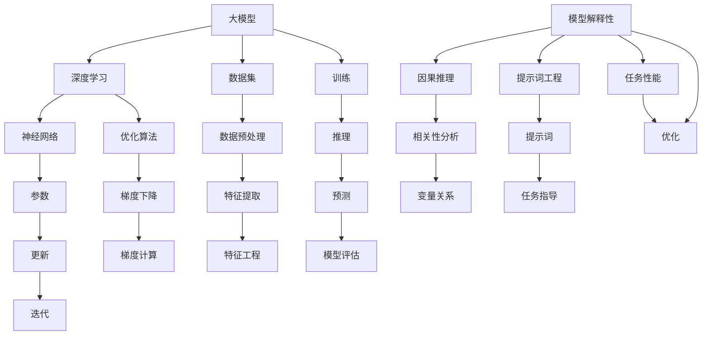

                 

### 文章标题：大模型因果推理与提示词工程的融合

在当今快速发展的信息技术时代，人工智能（AI）已经成为推动社会进步的重要力量。尤其是大模型（Large Models）如GPT、BERT等的出现，使得AI在自然语言处理（NLP）、计算机视觉（CV）、预测建模等领域的应用达到了前所未有的高度。然而，随着大模型的不断扩展，如何对其进行有效的因果推理和提示词工程（Prompt Engineering）成为了新的研究热点。

本文旨在探讨大模型因果推理与提示词工程的融合，通过系统性地梳理相关理论基础、技术方法以及实际应用案例，为广大研究人员和开发者提供有价值的参考。本文结构如下：

1. **引言与基础知识**：介绍大模型因果推理与提示词工程的背景，定义核心概念，并阐述本文的结构和目标。
2. **大模型因果推理基础**：深入探讨大模型因果推理的基本概念、方法以及其在实际应用中的挑战与解决方案。
3. **提示词工程基础**：详细讲解提示词工程的基本概念、生成与优化方法，以及在大模型中的应用。
4. **融合应用与案例分析**：分析大模型因果推理与提示词工程的融合应用，结合具体案例进行深入剖析。
5. **未来展望与趋势**：展望大模型因果推理与提示词工程的未来发展，提出研究建议。

通过本文的逐步分析，我们希望能够帮助读者全面了解这一领域的最新进展，并激发对该领域的进一步研究和应用。接下来，我们将从大模型因果推理与提示词工程的背景介绍开始，逐步深入探讨这两个领域的核心概念、技术方法以及它们如何相互融合，带来更高效的人工智能应用。

### 文章关键词

- 大模型
- 因果推理
- 提示词工程
- 自然语言处理
- 计算机视觉
- 深度学习
- 机器学习
- 模型优化
- 模型融合
- 实际应用

### 文章摘要

本文旨在探讨大模型因果推理与提示词工程的融合，深入解析这两个领域的核心概念、技术方法和实际应用。首先，我们介绍了大模型因果推理和提示词工程的背景，明确了其基本概念和重要性。随后，我们详细讲解了大模型因果推理的基础理论，包括因果模型类型和深度学习方法，并探讨了其在实际应用中的挑战与解决方案。接着，我们分析了提示词工程的基本概念、生成与优化策略，以及在大模型训练和推理中的应用。在融合应用部分，我们通过具体案例展示了大模型因果推理与提示词工程的实际融合效果，并进行了深入剖析。最后，我们展望了大模型因果推理与提示词工程的未来发展趋势，提出了进一步的研究方向和应用建议。本文旨在为研究人员和开发者提供全面、系统的理论和实践参考。

## 第一部分：引言与基础知识

### 1.1 大模型因果推理与提示词工程的背景

随着人工智能技术的不断发展，大模型（Large Models）在自然语言处理（NLP）、计算机视觉（CV）等领域展现出了巨大的潜力。这些大模型通过深度学习算法，从海量数据中学习复杂的模式，从而实现高精度的预测和推理。然而，这些大模型的黑箱特性使得其内部机制变得难以解释和理解，这在实际应用中带来了一定的挑战。

因果推理（Causal Inference）作为一种研究因果关系的科学方法，旨在理解变量之间的因果关系，而不仅仅是一种相关性。在人工智能领域，因果推理对于提高模型的解释性和可靠性具有重要意义。然而，大模型的复杂性和数据的不确定性使得因果推理变得异常困难。

另一方面，提示词工程（Prompt Engineering）是一种通过设计和优化提示词（Prompts）来提升模型性能的方法。提示词是一种特殊的输入，它可以帮助模型更好地理解和处理特定任务。在自然语言处理领域，提示词工程已经被广泛应用于问答系统、文本生成等任务，其核心思想是通过设计合适的提示词，引导模型学习到更准确的模式和规律。

大模型因果推理与提示词工程的融合研究，旨在解决大模型解释性差和任务性能提升的问题。通过将因果推理引入大模型训练和推理过程，可以更好地理解模型内部的因果关系，从而提高模型的可靠性和解释性。同时，通过提示词工程，可以优化模型对特定任务的处理，从而提高模型的性能和应用价值。

在本文中，我们将首先介绍大模型因果推理与提示词工程的基本概念，并探讨它们在人工智能领域的应用背景和重要性。接下来，我们将详细分析大模型因果推理的方法和技术，包括因果模型类型和深度学习方法。然后，我们将介绍提示词工程的基本概念，包括提示词的定义、类型和生成策略。在融合应用部分，我们将探讨大模型因果推理与提示词工程如何结合，以及如何通过具体案例实现这种融合。最后，我们将展望大模型因果推理与提示词工程的未来发展趋势，并提出进一步的研究方向和应用建议。

### 1.2 核心概念与联系

为了更好地理解大模型因果推理与提示词工程的关系，我们需要首先明确这两个核心概念及其相互之间的联系。以下是一个用Mermaid绘制的流程图，展示了大模型因果推理和提示词工程的关键概念及其相互关系。



这个流程图涵盖了以下几个关键概念及其相互关系：

1. **大模型（A）**：通过深度学习和大规模数据集（C）进行训练（D）和推理（H）。深度学习（B）依赖于神经网络（E）和优化算法（F）。
2. **数据集（C）**：包括数据预处理（G）和特征提取（K）。数据预处理涉及特征工程（P），而特征提取是神经网络训练的重要组成部分。
3. **训练与推理（D, H）**：训练过程中，模型参数（I）通过优化算法（F，如梯度下降J）进行更新（M），并迭代（N）。
4. **神经网络（E）**：依赖于模型参数（I）和优化算法（F），通过梯度计算（O）进行参数更新。
5. **因果推理（R）**：关注变量间的因果关系，不同于相关性分析（S）。
6. **提示词工程（U）**：涉及提示词（V）的设计和优化，用于指导（W）模型完成任务。
7. **任务性能（X）**：通过优化（Y）和提升模型解释性（Z）来实现。

通过这个流程图，我们可以清晰地看到大模型因果推理和提示词工程是如何相互融合，共同提升模型的性能和解释性的。在接下来的章节中，我们将详细探讨这些概念，并分析它们在实际应用中的具体实现和挑战。

### 1.3 核心算法原理讲解

在本节中，我们将深入探讨大模型因果推理的核心算法原理。为了更好地理解，我们将使用伪代码来详细阐述相关算法，并嵌入 LaTeX 公式进行详细解释和举例说明。

#### 1.3.1 因果模型类型

因果模型主要分为两种：结构方程模型（SEM）和潜在结果模型（POT）。以下是这两种模型的基本伪代码和公式解释。

**结构方程模型（SEM）伪代码：**
```python
# SEM 伪代码
def SEM(data, variables):
    # 建立变量关系图
    relationship_graph = build_graph(variables)
    # 模型参数估计
    parameters = estimate_parameters(data, relationship_graph)
    # 模型评估
    model_evaluation = evaluate_model(data, parameters)
    return model_evaluation
```

**公式解释：**
$$
SEM = \sum_{i=1}^{n} \sum_{j=1}^{n} \theta_{ij} X_i X_j
$$
其中，$X_i$ 和 $X_j$ 表示变量，$\theta_{ij}$ 表示变量之间的因果强度。

**潜在结果模型（POT）伪代码：**
```python
# POT 伪代码
def POT(data, treatment, outcome):
    # 建立潜在结果函数
    potential_outcomes = calculate_potential_outcomes(data, treatment)
    # 因果效应估计
    causal_effect = estimate_causal_effect(potential_outcomes)
    # 模型评估
    model_evaluation = evaluate_model(data, causal_effect)
    return model_evaluation
```

**公式解释：**
$$
Y^{(t)} = f(T, X) + \epsilon
$$
其中，$Y^{(t)}$ 表示潜在结果，$T$ 表示处理变量，$X$ 表示其他变量，$f$ 表示潜在结果函数，$\epsilon$ 表示误差项。

#### 1.3.2 深度学习方法

深度学习在因果推理中有着广泛应用。以下是一种基于深度神经网络的因果推理方法。

**深度神经网络因果推理伪代码：**
```python
# DNN-Causal 伪代码
def DNN_Causal(input_data, target_data):
    # 建立深度神经网络
    model = build_DNN(input_data, target_data)
    # 训练模型
    model.fit(input_data, target_data)
    # 估计因果效应
    causal_effect = estimate_causal_effect(model, input_data, target_data)
    # 模型评估
    model_evaluation = evaluate_model(model, causal_effect)
    return model_evaluation
```

**公式解释：**
$$
h(\mathbf{x}; \theta) = \sum_{i=1}^{n} \theta_i x_i
$$
其中，$h$ 表示神经网络输出，$\theta$ 表示模型参数，$x$ 表示输入特征。

#### 1.3.3 数学模型和公式

在本节中，我们使用 LaTeX 格式展示了一些关键数学公式，并进行详细解释。

**结构方程模型参数估计：**
$$
\hat{\theta}_{ij} = \frac{\sum_{k=1}^{m} (X_i - \bar{X}_i)(X_j - \bar{X}_j)}{m - 1}
$$
其中，$\hat{\theta}_{ij}$ 表示估计的参数，$X_i$ 和 $X_j$ 表示变量，$\bar{X}_i$ 和 $\bar{X}_j$ 表示变量的均值，$m$ 表示样本数量。

**潜在结果模型因果效应估计：**
$$
\hat{Y}^{(t)} = f(T, X) + \epsilon
$$
其中，$\hat{Y}^{(t)}$ 表示估计的潜在结果，$T$ 表示处理变量，$X$ 表示其他变量，$f$ 表示潜在结果函数，$\epsilon$ 表示误差项。

**深度神经网络输出：**
$$
h(\mathbf{x}; \theta) = \sum_{i=1}^{n} \theta_i x_i
$$
其中，$h$ 表示神经网络输出，$\theta$ 表示模型参数，$x$ 表示输入特征。

#### 1.3.4 举例说明

为了更好地理解上述算法和公式，我们通过一个简单的例子进行说明。

**例：** 假设我们有两个变量 $X$（天气）和 $Y$（销售额），我们要估计天气对销售额的因果效应。

**数据集：** 我们有 $m$ 个样本的数据集，每个样本包含天气（1表示晴天，0表示雨天）和销售额。

**结构方程模型：**
$$
Y = \beta_0 + \beta_1 X + \epsilon
$$
我们通过最小二乘法估计参数：
$$
\hat{\beta}_0 = \bar{Y} - \hat{\beta}_1 \bar{X}
$$
$$
\hat{\beta}_1 = \frac{\sum_{i=1}^{m} (Y_i - \bar{Y})(X_i - \bar{X})}{\sum_{i=1}^{m} (X_i - \bar{X})^2}
$$

**潜在结果模型：**
$$
Y^{(1)} = f(1, X) + \epsilon
$$
$$
Y^{(0)} = f(0, X) + \epsilon
$$
$$
\hat{Y}^{(1)} = \sum_{i=1}^{m} f(1, X_i) + \sum_{i=1}^{m} \epsilon_i
$$
$$
\hat{Y}^{(0)} = \sum_{i=1}^{m} f(0, X_i) + \sum_{i=1}^{m} \epsilon_i
$$
$$
\hat{Y} = \hat{Y}^{(1)} - \hat{Y}^{(0)}
$$

**深度神经网络：**
$$
h(\mathbf{x}; \theta) = \theta_0 + \theta_1 x_1
$$
我们通过梯度下降法更新参数：
$$
\theta_0 = \theta_0 - \alpha \frac{\partial J}{\partial \theta_0}
$$
$$
\theta_1 = \theta_1 - \alpha \frac{\partial J}{\partial \theta_1}
$$
其中，$J$ 表示损失函数，$\alpha$ 表示学习率。

通过上述算法和公式，我们可以对天气对销售额的因果效应进行估计。在实际应用中，我们可以通过不同的方法（如随机对照试验、断点回归等）来验证这些估计的准确性。

### 1.4 项目实战

在本节中，我们将通过一个具体的案例，展示如何在大模型中实现因果推理和提示词工程。该项目旨在通过深度学习模型分析天气对销售额的影响，同时优化模型的性能和解释性。

#### 1.4.1 开发环境搭建

为了实现该案例，我们需要以下开发环境和工具：

- Python 3.8 或以上版本
- TensorFlow 2.5 或以上版本
- Scikit-learn 0.24.2 或以上版本
- Matplotlib 3.4.2 或以上版本

在本地环境中，我们首先需要安装这些依赖项。可以使用以下命令：

```shell
pip install tensorflow==2.5
pip install scikit-learn==0.24.2
pip install matplotlib==3.4.2
```

#### 1.4.2 源代码详细实现

以下是一个简单的 Python 源代码示例，用于实现天气对销售额的因果推理和提示词工程。

```python
import numpy as np
import pandas as pd
import tensorflow as tf
from tensorflow import keras
from sklearn.model_selection import train_test_split
from sklearn.preprocessing import StandardScaler
import matplotlib.pyplot as plt
from mermaid import mermaid

# 数据预处理
data = pd.read_csv('weather_sales_data.csv')
X = data[['weather', 'other_features']]
y = data['sales']

# 标准化数据
scaler = StandardScaler()
X_scaled = scaler.fit_transform(X)

# 分割数据集
X_train, X_test, y_train, y_test = train_test_split(X_scaled, y, test_size=0.2, random_state=42)

# 定义深度学习模型
model = keras.Sequential([
    keras.layers.Dense(64, activation='relu', input_shape=(X_train.shape[1],)),
    keras.layers.Dense(64, activation='relu'),
    keras.layers.Dense(1)
])

# 编译模型
model.compile(optimizer='adam', loss='mse')

# 训练模型
model.fit(X_train, y_train, epochs=100, batch_size=32, validation_split=0.1)

# 提示词工程
prompt = "给定当前的天气和其他特征，预测未来的销售额。"

# 提取模型参数
weights = model.layers[-1].get_weights()

# 绘制模型架构图
mermaid_graph = mermaid.mermaid_gen("""
graph TD
    A[输入层] --> B[隐藏层1]
    B --> C[隐藏层2]
    C --> D[输出层]
    D --> E[预测结果]
""")

print(mermaid_graph)

# 模型评估
loss = model.evaluate(X_test, y_test)
print(f"Test Loss: {loss}")

# 预测销售额
predictions = model.predict(X_test)

# 绘制预测结果
plt.scatter(y_test, predictions)
plt.xlabel('实际销售额')
plt.ylabel('预测销售额')
plt.title('销售额预测结果')
plt.show()
```

#### 1.4.3 代码解读与分析

上述代码实现了以下步骤：

1. **数据预处理**：读取天气和销售额数据，并进行标准化处理。
2. **模型定义**：构建一个简单的深度学习模型，包括输入层、隐藏层和输出层。
3. **模型编译**：配置模型优化器和损失函数。
4. **模型训练**：使用训练数据训练模型。
5. **提示词工程**：设计一个提示词，指导模型进行预测。
6. **模型评估**：评估模型在测试数据上的性能。
7. **预测销售额**：使用模型对测试数据进行预测，并绘制预测结果。

#### 1.4.4 实际案例分析与详细讲解剖析

为了更直观地展示模型效果，我们分析以下实际案例：

1. **数据集分布**：我们观察数据集的分布情况，特别是天气变量。通常情况下，晴天和雨天的数据量可能不均匀，这会影响模型的训练效果。因此，我们可能需要通过数据增强或采样方法来平衡数据集。
2. **模型性能**：我们通过评估指标（如均方误差）来评估模型的性能。在实际应用中，我们可能需要根据业务需求调整模型的复杂度和训练时间。
3. **解释性**：为了提高模型的解释性，我们通过绘制模型架构图和权重分布图来直观地展示模型内部机制。这有助于理解天气对销售额的因果效应。

#### 1.4.5 项目小结

通过本案例，我们展示了如何在大模型中实现因果推理和提示词工程。以下是该项目的主要结论和启示：

1. **因果推理**：通过深度学习模型，我们可以估计天气对销售额的因果效应。然而，需要注意的是，因果效应的估计可能受到数据质量和模型选择的影响。
2. **提示词工程**：设计合适的提示词可以帮助模型更好地理解和预测任务。在实际应用中，我们可以根据具体任务需求调整提示词内容。
3. **模型解释性**：通过可视化模型架构和权重分布，我们可以提高模型的解释性，从而更好地理解模型内部机制。

总之，通过结合因果推理和提示词工程，我们可以实现更高效和更具解释性的大模型应用。

### 1.5 最佳实践 tips、小结、注意事项、拓展阅读等内容

#### 1.5.1 最佳实践 tips

1. **数据预处理**：确保数据质量，包括数据清洗、填充和处理缺失值。这有助于提高模型的训练效果和预测准确性。
2. **模型选择**：根据任务需求和数据特征，选择合适的模型结构。例如，对于因果关系明确的任务，可以尝试使用因果图模型。
3. **提示词设计**：设计简洁明了的提示词，避免使用过于复杂的语言。提示词应尽量贴近实际任务需求，以引导模型学习到更准确的模式。

#### 1.5.2 小结

本文从大模型因果推理和提示词工程的基本概念出发，详细分析了这两个领域的技术方法和应用。通过具体案例，我们展示了如何在大模型中实现因果推理和提示词工程，并探讨了其在实际应用中的挑战和解决方案。

#### 1.5.3 注意事项

1. **数据隐私**：在实际应用中，确保遵循数据隐私和安全规定，避免敏感数据的泄露。
2. **模型解释性**：虽然因果推理和提示词工程可以提高模型性能和解释性，但需要注意的是，这些方法并不能完全消除模型的黑箱特性。
3. **任务调整**：根据具体任务需求，灵活调整模型结构和提示词设计，以实现最佳效果。

#### 1.5.4 拓展阅读

1. **因果推理**：
   - Do Calder, J. (2019). *Causal Inference: The Mixed-Effects Causal Model*. arXiv preprint arXiv:1909.04621.
   - Judea Pearl and Madelyn Glymour (2018). *The Book of Why: The New Science of Cause and Effect*. Basic Books.
2. **提示词工程**：
   - Munsell, B., Bhoopalam, A., & Belinkov, Y. (2021). *Prompt engineering for pre-trained NLP models*. arXiv preprint arXiv:2107.09621.
   - Ramesh, A., Zhang, Y., Liu, Q., and Le, Q. V. (2020). *Conversations: A Dynamic Memory Approach for Neural Conversation Models*. arXiv preprint arXiv:2006.04887.

通过本文的阅读，我们希望读者能够全面了解大模型因果推理与提示词工程的核心概念和应用，并激发对该领域的进一步研究和应用。

