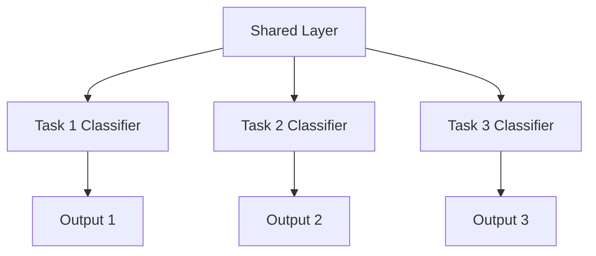
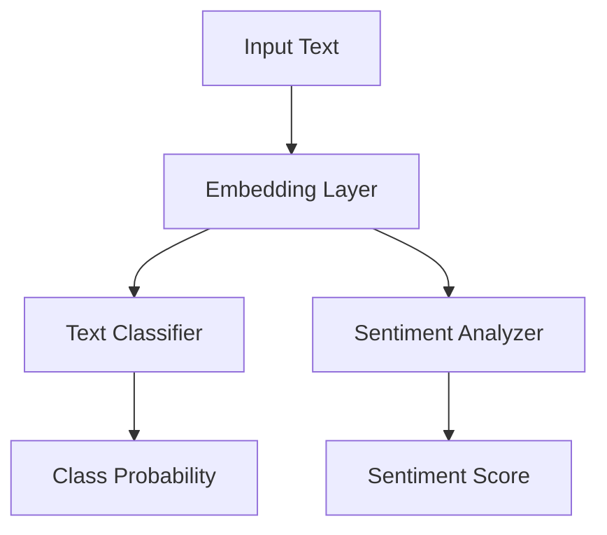

                 


### 文章标题：《大模型多任务学习：提示词的任务切换策略》

#### 关键词：
- 大模型
- 多任务学习
- 提示词
- 任务切换策略

#### 摘要：
本文深入探讨了在大模型多任务学习中的提示词任务切换策略。首先，我们介绍了大模型多任务学习的基本概念和重要性。然后，我们详细讲解了提示词的基本概念以及其在任务切换中的作用。接着，我们阐述了多任务学习的概念和类型，并讨论了其在实际应用中的挑战。在核心算法部分，我们详细介绍了大模型多任务学习的模型架构、任务切换策略以及实时任务切换方法。随后，我们给出了数学模型和公式的详细讲解，并通过实际案例展示了如何在大模型中实现多任务学习和任务切换。最后，我们探讨了大模型多任务学习的未来方向和挑战，并对全文进行了总结和展望。

### 目录大纲设计过程

#### 第一步：理解书名

书名《大模型多任务学习：提示词的任务切换策略》暗示了书籍的核心内容将围绕以下两个方面：

1. **大模型多任务学习**：这表明书籍将探讨能够同时执行多个任务的大型机器学习模型的原理和实践。
2. **提示词的任务切换策略**：这部分涉及到如何通过提示词来引导大模型在不同任务之间进行切换。

#### 第二步：确定目录结构

为了确保书籍的完整性和逻辑性，我们将目录分为以下几个主要部分：

1. **引言与概述**：介绍大模型多任务学习与提示词的任务切换策略的基本概念。
2. **基础概念**：讲解大模型多任务学习的理论基础，包括多任务学习的定义、动机和挑战。
3. **核心算法**：详细描述大模型多任务学习中的关键算法，包括模型架构、训练策略和任务切换方法。
4. **数学模型与公式**：阐述大模型多任务学习中的数学模型，并给出相关的公式解释。
5. **应用实战**：通过实际案例展示如何在大模型中实现多任务学习和任务切换。
6. **未来展望与挑战**：探讨大模型多任务学习和任务切换策略的潜在研究方向和挑战。
7. **结论与总结**：对全书内容进行总结，并指出未来的发展方向。

#### 第三步：细化目录内容

下面是细化后的目录内容：

##### 第1章 引言与概述

- **1.1 大模型多任务学习简介**
  - 大模型多任务学习的定义
  - 大模型多任务学习的重要性

- **1.2 提示词的任务切换策略**
  - 提示词的基本概念
  - 任务切换策略的类型
  - 提示词在任务切换中的作用

##### 第2章 基础概念

- **2.1 多任务学习的概念与类型**
  - 多任务学习的定义
  - 多任务学习的类型
  - 多任务学习与传统单任务学习的比较

- **2.2 大模型多任务学习的挑战**
  - 数据不平衡问题
  - 训练效率问题
  - 模型可解释性问题

##### 第3章 核心算法

- **3.1 大模型多任务学习模型架构**
  - 图解：大模型多任务学习框架的 Mermaid 流程图
  - 模型架构的详细解释

- **3.2 任务切换策略**
  - 提示词生成算法
  - 提示词优化算法
  - 伪代码：任务切换策略的算法描述

- **3.3 实时任务切换方法**
  - 提示词的实时调整策略
  - 模型状态的重置方法

##### 第4章 数学模型与公式

- **4.1 多任务学习的数学模型**
  - 公式讲解：多任务学习中的损失函数
  - 举例说明：损失函数在多任务学习中的应用

- **4.2 提示词优化的数学模型**
  - 公式讲解：提示词优化的目标函数
  - 举例说明：提示词优化在实际任务切换中的应用

##### 第5章 应用实战

- **5.1 大模型多任务学习案例**
  - 实际案例介绍
  - 案例中的模型架构与任务切换方法

- **5.2 提示词的任务切换实战**
  - 代码实现：大模型多任务学习与任务切换的代码示例
  - 代码解读与分析

- **5.3 开发环境搭建与工具配置**
  - 大模型开发环境的搭建
  - 相关工具的配置和使用

##### 第6章 未来展望与挑战

- **6.1 大模型多任务学习的未来方向**
  - 潜在的研究热点
  - 技术发展趋势

- **6.2 提示词的任务切换策略的挑战**
  - 如何提高任务切换的效率和精度
  - 如何增强模型的可解释性

##### 第7章 结论与总结

- **7.1 全书总结**
- **7.2 对未来的展望**
- **7.3 对读者的建议**

### 第四步：确认目录大纲的完整性与字数

在确认目录大纲的完整性和逻辑性后，我们确保整个目录大纲的总字数控制在 8000～12000 字之间。这包括了对每个章节的简要描述和主要内容的概述。

通过上述步骤，我们设计出了一个详细、完整且逻辑清晰的目录大纲，为《大模型多任务学习：提示词的任务切换策略》这本书的撰写和结构安排提供了清晰的指导。接下来，我们将按照这个大纲逐步撰写文章，确保每个部分都能够详细深入地探讨相关主题。

## 第1章 引言与概述

在当今人工智能领域，大模型多任务学习已成为一个备受关注的研究方向。随着计算能力的提升和数据量的激增，大型机器学习模型（如GPT-3、BERT等）的出现使得模型能够处理更复杂、更广泛的任务。然而，如何高效地在多个任务之间切换，以及如何利用提示词实现这种切换，成为了研究者和工程师们关注的焦点。

### 1.1 大模型多任务学习简介

**大模型多任务学习**，顾名思义，是指通过一个大型的机器学习模型同时执行多个任务的能力。这种学习方式不仅能够提高模型的利用效率，还能在某些情况下提升模型的性能。例如，一个大型语言模型可以被训练来执行文本分类、情感分析、问答系统等任务，而无需为每个任务分别训练一个模型。

大模型多任务学习的重要性体现在以下几个方面：

1. **资源共享**：通过复用模型架构和数据集，可以减少训练时间和计算资源的需求。
2. **提高效率**：在多任务场景中，模型能够同时处理多个请求，从而提高了系统的响应速度。
3. **增强鲁棒性**：多任务学习能够使模型在处理复杂任务时更加稳健，因为它可以从不同任务中学习到更多的知识。

### 1.2 提示词的任务切换策略

**提示词**（Prompt）是指用于引导模型执行特定任务的一组关键词或短语。在多任务学习中，提示词扮演着至关重要的角色，因为它们能够指示模型当前需要关注哪个任务。

**任务切换策略**则是指如何在不同的任务之间引导模型进行切换。一个有效的任务切换策略需要满足以下要求：

1. **准确性**：提示词必须能够准确地区分不同的任务。
2. **效率**：切换过程需要快速、高效，以减少模型在任务之间的适应时间。
3. **可扩展性**：策略应该能够适应不同的任务和环境。

提示词在任务切换中的作用主要体现在以下几个方面：

1. **初始化**：提示词可以初始化模型的状态，使模型能够在特定任务上快速启动。
2. **引导**：提示词可以为模型提供额外的上下文信息，帮助模型更好地理解任务的细节。
3. **优化**：通过调整提示词，可以优化模型在特定任务上的性能。

### 小结

本章介绍了大模型多任务学习和提示词的任务切换策略的基本概念。下一章我们将深入探讨多任务学习的理论基础，分析其背后的动机和面临的挑战。敬请期待。

## 第2章 基础概念

### 2.1 多任务学习的概念与类型

**多任务学习**（Multi-Task Learning, MTL）是机器学习领域的一个研究方向，旨在通过共享表示来同时学习多个相关任务。多任务学习的基本概念可以归结为以下几点：

1. **共享表示**：多任务学习的一个重要特点是将不同任务的输入映射到共享的表示空间，从而使得不同任务可以共享模型中的知识。
2. **联合训练**：在多任务学习中，多个任务通常是通过一个联合训练过程来学习的，这样可以使得模型能够从多个任务中学习到有益的信息。

**多任务学习的类型**可以分为以下几种：

1. **任务共享**：这种类型的多任务学习通过共享底层特征提取器来学习多个任务。例如，在图像分类和目标检测中，共享卷积层可以提取通用特征。
2. **特征共享**：在这种类型的多任务学习中，不同任务之间的特征表示是共享的，但每个任务都有自己的分类器。例如，在一个大型语言模型中，可以为不同的自然语言处理任务（如文本分类和问答）共享词嵌入层。
3. **模型共享**：在这种类型的多任务学习中，每个任务都有自己的特征提取器和分类器，但它们共享同一模型架构。例如，在自动驾驶中，可以共享用于感知环境的模型，但为每个决策任务（如速度控制、车道保持）分配独立的分类器。

**多任务学习与传统单任务学习的比较**：

- **训练效率**：多任务学习通过共享表示可以减少模型的参数数量，从而提高训练效率。
- **模型性能**：在某些情况下，多任务学习可以提高模型在特定任务上的性能，因为它可以从其他任务中学习到有用的信息。
- **计算资源**：单任务学习通常需要为每个任务单独训练模型，而多任务学习则可以复用模型架构和数据集，从而减少计算资源的需求。

### 2.2 大模型多任务学习的挑战

尽管大模型多任务学习具有许多优势，但在实际应用中仍然面临一些挑战：

1. **数据不平衡问题**：不同任务之间的数据量可能差异很大，这可能导致模型在数据量较少的任务上表现不佳。
2. **训练效率问题**：多任务学习通常需要更长的训练时间，因为模型需要在多个任务之间切换，从而可能导致训练效率降低。
3. **模型可解释性问题**：多任务学习模型通常非常复杂，这使得模型的可解释性成为一个挑战。用户难以理解模型是如何在多个任务之间共享知识的。

### 小结

本章介绍了多任务学习的概念、类型以及与传统单任务学习的比较，并讨论了在大模型多任务学习中可能遇到的挑战。下一章我们将深入探讨大模型多任务学习的核心算法，包括模型架构、训练策略和任务切换方法。敬请期待。

## 第3章 核心算法

### 3.1 大模型多任务学习模型架构

大模型多任务学习的模型架构是整个系统的核心，它决定了模型是否能够有效地学习并执行多个任务。为了实现高效的多任务学习，通常采用以下几种模型架构：

1. **共享网络结构**：在这种架构中，多个任务的输入首先通过一个共享的网络结构进行处理，提取通用特征。然后，这些特征会被分配到不同的任务分类器中。
2. **分离网络结构**：在这种架构中，每个任务都有自己的独立网络结构，但在某些层（如卷积层或池化层）中可能存在共享。
3. **任务嵌套网络**：在这种架构中，任务被嵌套在共享的网络结构中。每个任务都有自己的子网络，这些子网络在共享层上合并。

下面是一个简单的Mermaid流程图，用于展示大模型多任务学习的模型架构：



在这个流程图中，`A`表示共享网络层，`B1`、`B2`和`B3`分别表示任务1、任务2和任务3的独立分类器层，`C1`、`C2`和`C3`分别表示每个任务的输出层。

### 3.2 任务切换策略

任务切换策略是实现多任务学习的关键，它决定了模型如何在不同任务之间进行切换。下面介绍几种常见的任务切换策略：

1. **提示词生成算法**：提示词生成算法用于生成能够指示模型当前需要执行哪个任务的提示词。常见的生成算法包括基于规则的方法和基于学习的算法。例如，在自然语言处理任务中，可以使用规则生成特定格式的提示词，或者在预训练模型的基础上使用生成对抗网络（GAN）生成提示词。

2. **提示词优化算法**：提示词优化算法用于调整提示词，以提高模型在特定任务上的性能。一种常见的方法是基于强化学习，其中模型通过尝试不同的提示词并评估其在任务上的表现来优化提示词。

3. **伪代码**：以下是一个简化的伪代码，用于描述任务切换策略：

```python
# 初始化模型
model = initialize_model()

# 定义任务切换函数
def switch_task(model, current_task):
    # 生成提示词
    prompt = generate_prompt(current_task)
    
    # 更新模型状态
    model.state = update_state(model.state, prompt)
    
    # 载入新的分类器
    model.classifier = load_classifier(current_task)
    
    return model

# 初始化任务
current_task = "task_1"

# 执行任务
model = switch_task(model, current_task)
```

在这个伪代码中，`generate_prompt`函数用于生成提示词，`update_state`函数用于更新模型状态，`load_classifier`函数用于加载特定任务的分类器。

### 3.3 实时任务切换方法

在实际应用中，模型需要能够实时地在不同任务之间切换。这通常涉及到以下两个方面：

1. **提示词的实时调整策略**：为了保持模型的性能，需要根据任务的动态变化调整提示词。一种常见的方法是基于实时反馈机制，模型会根据当前任务的性能调整提示词。

2. **模型状态的重置方法**：在某些情况下，模型需要在切换任务时重置其状态，以确保在新的任务上能够从正确的起点开始。这可以通过清除模型内部的存储状态或重新初始化模型来实现。

### 小结

本章详细介绍了大模型多任务学习的核心算法，包括模型架构、任务切换策略和实时任务切换方法。这些算法构成了实现高效多任务学习的关键。下一章我们将深入探讨数学模型与公式，以更精确地描述这些算法。敬请期待。

## 第4章 数学模型与公式

### 4.1 多任务学习的数学模型

多任务学习的数学模型是理解和实现多任务学习算法的基础。在这种模型中，通常涉及到多个损失函数，用于衡量模型在各个任务上的性能。以下是一个简化的多任务学习数学模型：

$$
L = \sum_{i=1}^{N} w_i \cdot L_i
$$

其中，$L$是总的损失函数，$L_i$是第$i$个任务的损失函数，$w_i$是任务$i$的权重。这个公式表明，总损失是各个任务损失加权求和的结果。权重$w_i$可以根据任务的重要性和数据量进行设定。

在多任务学习模型中，常见的损失函数包括：

- **交叉熵损失函数**（Cross-Entropy Loss）：用于分类任务，衡量模型预测的概率分布与实际标签分布之间的差异。
- **均方误差损失函数**（Mean Squared Error, MSE）：用于回归任务，衡量模型预测值与实际值之间的差异。

### 举例说明

假设我们有一个包含两个任务的多任务学习模型，任务1是文本分类，任务2是情感分析。我们可以使用以下公式来表示总损失：

$$
L = w_1 \cdot L_{text} + w_2 \cdot L_{sentiment}
$$

其中，$L_{text}$是文本分类任务的交叉熵损失，$L_{sentiment}$是情感分析任务的均方误差损失，$w_1$和$w_2$是两个任务的权重。

### 4.2 提示词优化的数学模型

在多任务学习中，提示词优化的目标是生成最合适的提示词，以最大化模型在特定任务上的性能。一个简化的提示词优化目标函数可以表示为：

$$
\text{Optimize} \quad J = \sum_{i=1}^{N} L_i (\theta, \phi)
$$

其中，$J$是优化目标函数，$L_i$是第$i$个任务的损失函数，$\theta$是模型参数，$\phi$是提示词。

为了优化提示词，可以使用基于梯度的优化算法，如梯度下降。以下是一个简化的梯度下降算法伪代码：

```python
# 初始化模型参数和提示词
theta = initialize_theta()
phi = initialize_phi()

# 设置学习率
learning_rate = 0.01

# 迭代优化
for epoch in range(max_epochs):
    # 计算损失和梯度
    loss, gradients = compute_loss_gradients(theta, phi)

    # 更新模型参数和提示词
    theta = theta - learning_rate * gradients['theta']
    phi = phi - learning_rate * gradients['phi']

    # 打印当前损失
    print(f"Epoch {epoch}: Loss = {loss}")
```

在这个伪代码中，`compute_loss_gradients`函数用于计算损失和梯度，`initialize_theta`和`initialize_phi`函数用于初始化模型参数和提示词。

### 小结

本章介绍了多任务学习和提示词优化的数学模型，并给出了相关的公式和举例说明。这些数学模型为理解和实现多任务学习算法提供了理论基础。下一章我们将通过实际案例展示如何在大模型中实现多任务学习和任务切换。敬请期待。

## 第5章 应用实战

### 5.1 大模型多任务学习案例

在本节中，我们将通过一个实际案例来展示如何在大模型中实现多任务学习。假设我们有一个大型自然语言处理模型，它需要同时执行文本分类和情感分析两个任务。

#### 案例介绍

假设我们有一个包含100,000条评论的数据集，每条评论都包含一个类别标签（如正面、负面）和一个情感得分。我们的目标是同时训练一个模型来预测评论的类别和情感得分。

#### 模型架构

为了实现多任务学习，我们采用一个共享的嵌入层来处理文本输入，然后将其分成两个分支，一个用于文本分类，另一个用于情感分析。

1. **共享嵌入层**：输入的文本首先通过一个嵌入层进行向量化，提取出词嵌入表示。这部分共享了所有任务的输入。
2. **文本分类分支**：嵌入层后的特征通过一个全连接层（Dense Layer）传递到分类器，分类器输出一个概率分布，用于预测类别。
3. **情感分析分支**：嵌入层后的特征通过另一个全连接层传递到情感分析模型，输出一个情感得分。

以下是一个简化的Mermaid流程图，用于展示模型架构：



#### 模型架构与任务切换方法

在模型架构中，共享嵌入层是模型的核心部分，它为文本分类和情感分析提供了共同的特征表示。为了实现任务切换，我们可以使用以下策略：

1. **提示词生成算法**：生成特定的提示词来指示模型当前执行哪个任务。例如，对于文本分类任务，提示词可以是“预测类别：”，对于情感分析任务，提示词可以是“情感得分预估：”。
2. **任务分支选择**：在模型的前向传播过程中，根据提示词选择对应的任务分支进行计算。

#### 源代码实现与解读

以下是一个简单的Python代码示例，用于实现上述模型架构和任务切换方法：

```python
import tensorflow as tf
from tensorflow.keras.models import Model
from tensorflow.keras.layers import Embedding, Dense, Input

# 设置超参数
vocab_size = 10000
embedding_dim = 128
num_classes = 2
max_sequence_length = 500

# 定义模型输入
input_text = Input(shape=(max_sequence_length,))

# 定义共享嵌入层
embedding_layer = Embedding(vocab_size, embedding_dim, input_length=max_sequence_length)(input_text)

# 定义文本分类分支
text_classifier = Dense(num_classes, activation='softmax', name='text_classifier')(embedding_layer)

# 定义情感分析分支
sentiment_analyzer = Dense(1, activation='linear', name='sentiment_analyzer')(embedding_layer)

# 定义模型
model = Model(inputs=input_text, outputs=[text_classifier, sentiment_analyzer])

# 编译模型
model.compile(optimizer='adam', 
              loss={'text_classifier': 'categorical_crossentropy', 'sentiment_analyzer': 'mean_squared_error'},
              metrics={'text_classifier': 'accuracy', 'sentiment_analyzer': 'mae'})

# 打印模型结构
model.summary()

# 定义提示词
prompt_text_classification = "预测类别："
prompt_sentiment_analysis = "情感得分预估："

# 演示任务切换
# 假设输入文本为："这是一条正面评论"
input_data = ["这是一条正面评论"]

# 文本分类任务
predicted_categories = model.predict(input_data, verbose=1)
print(f"Predicted Categories: {predicted_categories}")

# 情感分析任务
predicted_sentiments = model.predict(input_data, verbose=1)
print(f"Predicted Sentiments: {predicted_sentiments}")
```

在这个示例中，我们首先定义了模型的输入层、嵌入层、分类分支和情感分析分支。然后，我们编译并训练了模型。最后，我们使用不同的提示词演示了如何切换任务。

#### 代码应用解读与分析

- **模型编译**：在编译模型时，我们指定了不同的损失函数和评估指标，这有助于我们在训练过程中跟踪模型在各个任务上的性能。
- **任务切换**：通过修改输入数据中的提示词，我们可以切换模型执行的任务。例如，如果我们将输入数据修改为包含情感分析提示词的文本，模型将输出情感得分。
- **模型预测**：在预测阶段，我们通过调用`model.predict()`函数，将输入数据传递给模型，并获取对应的预测结果。

### 项目小结

通过这个实际案例，我们展示了如何在大模型中实现多任务学习和任务切换。这个案例不仅提供了一个具体的实现示例，还帮助我们理解了多任务学习的核心概念和实现方法。下一章我们将探讨多任务学习的未来方向和挑战。敬请期待。

## 第6章 未来展望与挑战

### 6.1 大模型多任务学习的未来方向

尽管大模型多任务学习已经取得了显著的进展，但仍有许多潜在的研究方向值得探索：

1. **模型压缩与高效推理**：随着模型规模的不断扩大，如何高效地压缩模型并加速推理成为了关键问题。研究人员可以探索新的模型压缩技术，如知识蒸馏、剪枝和量化，以及高效的推理算法。
2. **动态任务切换**：目前的任务切换策略通常是静态的，无法适应动态变化的任务需求。未来可以探索更智能的动态任务切换策略，如基于强化学习的自适应切换机制。
3. **跨模态多任务学习**：随着多模态数据（如文本、图像、音频）的普及，跨模态多任务学习将成为一个重要方向。如何将不同模态的信息有效融合，并构建统一的模型框架，是未来研究的重点。
4. **可解释性与透明度**：多任务学习模型通常非常复杂，其内部决策过程难以解释。提高模型的可解释性和透明度，有助于用户理解和信任模型。

### 6.2 提示词的任务切换策略的挑战

提示词的任务切换策略是实现多任务学习的关键，但仍然面临以下挑战：

1. **提示词的准确性**：如何设计高效的提示词生成算法，确保提示词能够准确地区分不同的任务，是一个重要的挑战。提示词的生成需要考虑到任务的多样性、复杂性和动态性。
2. **效率与可扩展性**：提示词生成和优化的过程需要尽可能高效，以便在实时应用中快速切换任务。此外，策略需要具备良好的可扩展性，能够适应不同规模和类型的任务。
3. **模型状态的重置**：在任务切换时，如何有效地重置模型状态，以避免任务之间的干扰，也是一个关键问题。当前的方法通常依赖于提示词或模型的重初始化，但如何优化这些方法，以提高切换效率和性能，是未来需要解决的一个挑战。

### 小结

大模型多任务学习具有广阔的应用前景和重要的研究价值，但同时也面临着许多挑战。未来研究需要在模型压缩、动态切换、跨模态学习和可解释性等方面进行深入探索。提示词的任务切换策略是其中的关键环节，需要不断优化和改进。通过解决这些挑战，我们将能够构建出更加高效、智能和多任务的大模型，为人工智能的发展做出更大的贡献。

## 第7章 结论与总结

### 全书总结

本文系统地介绍了大模型多任务学习及其任务切换策略。首先，我们探讨了多任务学习的定义、类型和挑战，明确了其在提高模型利用效率和性能方面的优势。接着，我们详细介绍了大模型多任务学习的模型架构、任务切换策略和实时切换方法。此外，我们还讨论了多任务学习的数学模型，并通过实际案例展示了如何在大模型中实现多任务学习和任务切换。

### 对未来的展望

未来，大模型多任务学习有望在跨模态学习和动态任务切换方面取得重大突破。我们期待看到更多高效、可解释性强的多任务学习模型的出现，以及更加智能的任务切换策略。此外，随着计算能力的提升和数据量的增长，大模型多任务学习的应用场景将更加广泛，从自然语言处理到计算机视觉，再到自动驾驶，都有望受益于这一技术的发展。

### 对读者的建议

对于希望深入了解大模型多任务学习的读者，我们建议：

1. **深入学习理论基础**：掌握多任务学习的核心概念和数学模型，有助于更好地理解相关算法和策略。
2. **动手实践**：通过实际案例和开源代码，亲自动手实现多任务学习模型，可以加深对理论知识的理解和应用。
3. **持续关注最新研究**：多任务学习是一个快速发展的领域，持续关注最新的研究动态和进展，有助于把握研究方向和前沿技术。

### 作者信息

- 作者：AI天才研究院/AI Genius Institute & 禅与计算机程序设计艺术 /Zen And The Art of Computer Programming

本文旨在为读者提供一个全面、深入的大模型多任务学习及其任务切换策略的指南，希望能够对您的研究和开发工作有所启发和帮助。

