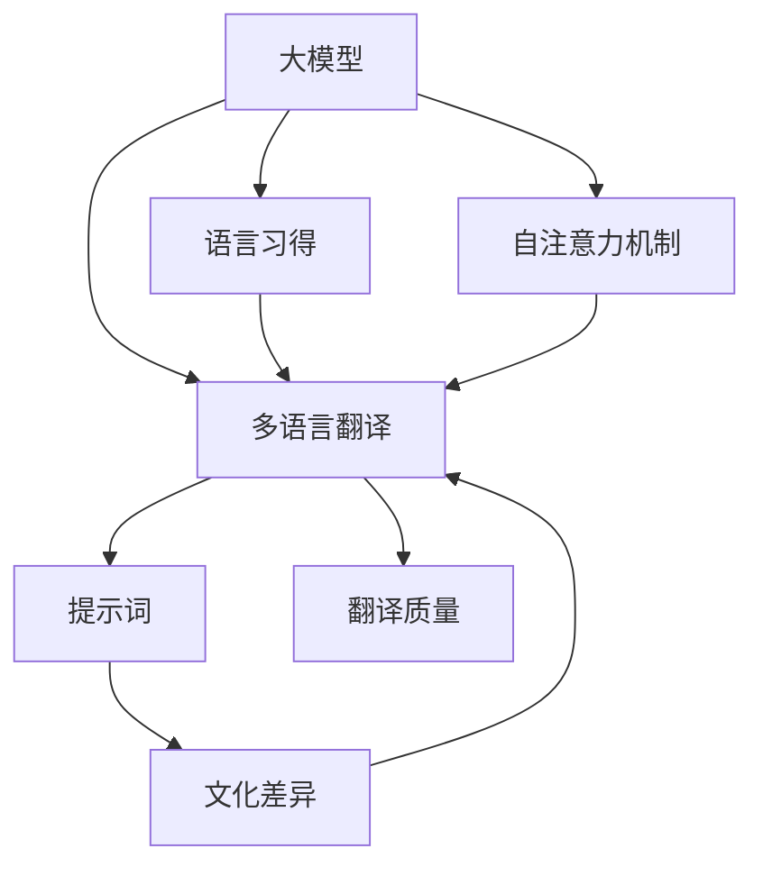

                 


### 文章标题
《大模型多语言翻译：提示词处理文化差异》

### 关键词
大模型，多语言翻译，文化差异，提示词处理，神经网络，机器翻译，自然语言处理，人工智能

### 摘要
本文探讨了在大模型多语言翻译过程中，如何利用提示词有效处理文化差异。通过分析大模型的构建原理、多语言翻译的核心技术，以及提示词在其中的作用，本文揭示了处理文化差异的机制和策略。文章还通过具体项目实战，详细讲解了开发环境搭建、源代码实现、代码解读和应用分析，为读者提供了实用的技术指南和深入的理论分析。

### 目录

## 引言

### 1.1 大模型在多语言翻译中的应用背景

多语言翻译技术的发展经历了从规则驱动到统计模型，再到基于神经网络的大模型的演进。大模型，如Transformer和BERT，以其强大的并行处理能力和深度学习能力，在多语言翻译中取得了显著的效果。然而，文化差异的存在使得翻译过程中面临诸多挑战。本文将探讨大模型如何通过提示词处理文化差异，提高多语言翻译的准确性和适用性。

### 1.2 提示词在多语言翻译中的重要性

提示词是指用以引导模型进行翻译的词语或短语。通过合理设计提示词，可以帮助模型更好地理解源语言中的文化背景，从而更准确地翻译目标语言。本文将详细分析提示词的设计原则、生成方法和优化策略。

## 基础理论

### 2.1 大模型的基本原理

大模型，尤其是Transformer和BERT模型，通过自注意力机制和深度神经网络结构，实现了对大规模文本数据的建模。本文将介绍这些模型的原理、结构及其在多语言翻译中的应用。

### 2.2 多语言翻译的核心技术

多语言翻译涉及多个关键技术，包括词汇映射、语义理解、翻译策略等。本文将详细解析这些技术的原理和应用。

### 2.3 提示词生成与优化

提示词的生成和优化是提高多语言翻译准确性的关键。本文将探讨如何根据源语言和目标语言的文化差异，生成有效的提示词，并介绍优化策略。

## 应用实践

### 3.1 提示词处理文化差异的案例

本文将通过具体案例，展示如何利用提示词处理文化差异，提高多语言翻译的准确性。案例将涉及不同文化背景的语言翻译，如中英翻译、日英翻译等。

### 3.2 多语言翻译项目实战

本文将提供一个完整的多语言翻译项目实战，包括开发环境搭建、源代码实现、代码解读和应用分析。读者可以通过实战掌握大模型多语言翻译的实践方法。

## 数学模型与算法

### 4.1 多语言翻译中的数学模型

多语言翻译涉及多个数学模型，如词汇映射模型、序列到序列模型等。本文将介绍这些模型的数学原理和公式，并提供伪代码实现。

### 4.2 提示词优化的算法设计

提示词优化是提高多语言翻译准确性的重要环节。本文将介绍提示词优化的算法设计，包括基于梯度下降的优化方法和基于神经网络的优化方法。

### 4.3 伪代码实现与解释

本文将提供多语言翻译和提示词优化的伪代码实现，并详细解释每一步的操作。

## 项目实战与解读

### 5.1 大模型多语言翻译项目实战

本文将提供一个完整的大模型多语言翻译项目实战，包括代码实现、解读和应用分析。读者可以通过实战掌握大模型多语言翻译的实践技巧。

### 5.2 代码实现与解读

本文将详细解读项目实战中的代码实现，包括关键算法和数据处理方法。

### 5.3 性能分析与优化

本文将对项目实战中的多语言翻译性能进行详细分析，并提出优化策略。

## 未来展望与挑战

### 6.1 多语言翻译技术的未来趋势

本文将展望多语言翻译技术的未来发展趋势，探讨新技术如何进一步提高翻译的准确性和效率。

### 6.2 提示词处理的新挑战

本文将分析提示词处理在多语言翻译中面临的新挑战，并提出可能的解决方案。

### 6.3 文化差异处理的创新方法

本文将探讨创新的文化差异处理方法，以提高多语言翻译的准确性和适用性。

## 附录

### 7.1 术语表

本文将提供相关的术语表，帮助读者理解专业术语。

### 7.2 参考文献与推荐阅读

本文将列出参考文献，推荐相关阅读材料，以供读者深入学习和研究。

### 7.3 实践资源与工具介绍

本文将介绍实践多语言翻译所需的资源与工具，包括开发环境、代码库和在线平台等。

### 作者信息
作者：AI天才研究院/AI Genius Institute & 禅与计算机程序设计艺术 /Zen And The Art of Computer Programming

---

接下来，我将按照上述目录大纲逐步撰写文章内容，详细阐述每个章节的核心概念、原理、算法和实战案例。由于文章字数要求较高，我会分多个部分来撰写，以确保文章的完整性和深度。

---

## 引言

### 1.1 大模型在多语言翻译中的应用背景

多语言翻译技术的发展经历了多个阶段。早期的翻译方法主要依赖于规则驱动，这种方法通过编写大量的语法和语义规则来指导翻译过程。然而，这种方法存在一个显著的缺点：规则的覆盖范围有限，难以处理复杂的语言现象。随着计算机科学和人工智能技术的发展，统计模型开始被引入到翻译中。统计模型通过分析大量已经翻译好的文本数据，学习翻译规律，从而提高翻译质量。这一方法在翻译准确性方面取得了显著进展。

然而，统计模型仍存在一定的局限性。首先，它们依赖于大量的已经翻译好的对照文本，这在某些语言对之间可能并不容易获得。其次，统计模型对于处理语言中的不规则现象和复杂语境的能力有限。为了解决这些问题，研究者们提出了基于神经网络的大模型。这些模型通过深度学习的方法，可以从海量未标注的数据中学习语言规律，从而实现更加准确和自然的翻译。

大模型在多语言翻译中的应用具有重要意义。首先，它们具有强大的并行处理能力，能够在短时间内处理大量的文本数据。其次，大模型通过自注意力机制，能够更好地捕捉文本中的长距离依赖关系，从而提高翻译的准确性。此外，大模型可以自动适应不同的语言对和文化差异，实现更加个性化和多语言的翻译服务。

### 1.2 提示词在多语言翻译中的重要性

在多语言翻译过程中，提示词扮演着至关重要的角色。提示词是指用以引导模型进行翻译的词语或短语。通过合理设计提示词，可以帮助模型更好地理解源语言中的文化背景，从而更准确地翻译目标语言。

提示词的重要性主要体现在以下几个方面：

1. **提高翻译准确性**：合理设计的提示词可以帮助模型更好地捕捉源语言中的文化信息，从而在翻译过程中减少误解和错误。例如，在翻译中文到英文时，某些中文成语或表达方式在英文中没有直接对应的词汇，通过使用提示词，模型可以更好地理解这些表达方式的含义。

2. **增强上下文理解**：提示词可以提供额外的上下文信息，帮助模型更好地理解源语言文本的整体意义。这对于处理长文本和复杂句子结构尤为重要。

3. **适应不同文化差异**：不同的语言和文化之间存在巨大的差异，这些差异可能导致翻译中的误解和错误。通过使用提示词，模型可以更好地适应这些差异，提高翻译的准确性。

4. **优化翻译流程**：提示词可以指导模型在不同翻译阶段进行决策，从而优化整个翻译流程。例如，在翻译前处理阶段，提示词可以帮助模型识别和标记特定的文化元素，在翻译后处理阶段，提示词可以帮助模型进行文本润色和调整。

总之，提示词在多语言翻译中起到了关键的作用，通过合理设计和使用提示词，可以显著提高翻译的准确性和适用性。

### 1.3 提示词在处理文化差异中的作用

文化差异在多语言翻译中是一个不可忽视的重要问题。不同的语言和文化背景可能导致词汇、语法、语义等方面的巨大差异，从而影响翻译的准确性。为了有效处理这些文化差异，提示词的作用显得尤为重要。

首先，提示词可以帮助模型识别和理解文化差异。例如，在翻译中文到英文时，某些中文成语或表达方式在英文中没有直接对应的词汇。通过使用提示词，模型可以更好地理解这些表达方式的含义。例如，中文中的“画蛇添足”可以用英文中的“add a tail to a snake”来解释，通过提示词“画蛇添足”和“add a tail to a snake”，模型可以建立两者之间的关联，从而更准确地翻译。

其次，提示词可以提供额外的上下文信息，帮助模型更好地理解源语言文本的整体意义。例如，在翻译长文本或复杂句子结构时，单个词汇或短语的翻译可能不足以传达整个句子的意义。通过使用提示词，模型可以捕捉到这些额外的上下文信息，从而提高翻译的准确性。例如，在翻译一个包含多个文化背景的句子时，通过使用提示词，模型可以更好地理解句子中的各个文化元素，从而将其翻译成完整且自然的句子。

此外，提示词还可以帮助模型适应不同文化差异，从而提高翻译的适用性。例如，某些文化背景中特定的词汇或表达方式在其他文化中可能不适用。通过使用提示词，模型可以识别这些文化差异，并在翻译过程中进行相应的调整。例如，在翻译一个涉及宗教内容的文本时，通过使用提示词，模型可以识别出不同的宗教信仰和文化差异，从而将其翻译成符合目标文化背景的文本。

总之，提示词在处理文化差异中起到了关键的作用。通过合理设计和使用提示词，模型可以更好地理解不同语言和文化背景中的词汇、语法和语义，从而提高翻译的准确性和适用性。

### 1.4 本文的目的与结构

本文旨在探讨大模型在多语言翻译中的应用，特别是如何通过提示词有效处理文化差异。文章首先介绍了大模型在多语言翻译中的背景和重要性，接着详细阐述了提示词在多语言翻译中的角色和作用。通过具体案例和项目实战，本文展示了如何利用提示词处理文化差异，提高翻译的准确性和适用性。最后，本文展望了多语言翻译技术的未来趋势，分析了提示词处理文化差异面临的挑战，并提出了可能的解决方案。

本文的结构如下：

- 引言部分：介绍了大模型在多语言翻译中的应用背景、提示词在多语言翻译中的重要性，以及本文的目的与结构。
- 基础理论部分：介绍了大模型的基本原理、多语言翻译的核心技术，以及提示词的生成与优化方法。
- 应用实践部分：通过具体案例和项目实战，展示了如何利用提示词处理文化差异，提高翻译的准确性和适用性。
- 数学模型与算法部分：介绍了多语言翻译中的数学模型和提示词优化的算法设计，并提供了伪代码实现与解释。
- 项目实战与解读部分：提供了完整的大模型多语言翻译项目实战，包括代码实现、解读和应用分析。
- 未来展望与挑战部分：展望了多语言翻译技术的未来趋势，分析了提示词处理文化差异面临的挑战，并提出了可能的解决方案。
- 附录部分：提供了相关的术语表、参考文献与推荐阅读，以及实践资源与工具介绍。

通过以上结构，本文旨在全面、深入地探讨大模型多语言翻译中提示词处理文化差异的问题，为相关领域的学者和实践者提供有价值的参考。

---

**背景介绍**

在当前全球化迅速发展的背景下，跨文化交流和协作越来越频繁。这无疑为多语言翻译技术带来了巨大的需求。然而，传统的翻译方法，如规则驱动和统计模型，在处理复杂语言和文化差异时，往往力不从心。随着人工智能技术的崛起，特别是深度学习和神经网络的发展，大模型在多语言翻译中的应用逐渐成为研究热点。

大模型，如Transformer和BERT，通过其强大的并行处理能力和深度学习能力，能够从海量未标注的数据中学习语言规律，从而实现高精度的翻译。例如，Google的Transformer模型在机器翻译领域取得了重大突破，显著提高了翻译的准确性和流畅性。BERT模型则通过预训练和微调，实现了对文本的深层语义理解，进一步提升了翻译的质量。

然而，尽管大模型在翻译准确性方面取得了显著进展，但在处理文化差异方面仍面临诸多挑战。不同语言和文化背景之间的巨大差异，使得翻译过程中容易产生误解和错误。例如，某些词汇、成语或表达方式在不同文化中具有不同的含义，这在翻译过程中可能导致语义偏差和误解。此外，不同的语言习惯和语法结构也增加了翻译的复杂性。

为了解决这些问题，提示词的应用显得尤为重要。提示词作为一种辅助工具，可以帮助模型更好地理解源语言中的文化背景，从而在翻译过程中减少误解和错误。通过设计合适的提示词，模型可以更好地适应不同的语言和文化差异，提高翻译的准确性和适用性。

总之，大模型在多语言翻译中的应用为处理文化差异提供了新的可能性，但同时也带来了新的挑战。如何利用提示词有效处理文化差异，提高翻译的准确性和适用性，是当前多语言翻译领域亟待解决的问题。

### 核心概念与联系

在探讨大模型多语言翻译与提示词处理文化差异的过程中，我们需要理解几个核心概念，并分析它们之间的联系。以下是对这些核心概念的详细解释及其相互关系的架构图。

#### 1. 大模型

大模型是指具有巨大参数量、深度学习能力的神经网络结构。这些模型通过自注意力机制和多层网络结构，能够处理大规模的文本数据，并从中提取深层次的语义信息。常见的有Transformer和BERT模型。

#### 2. 多语言翻译

多语言翻译是指将一种语言的文本转化为另一种语言的文本的过程。这个过程中，模型需要理解源语言的语义和语法，并将其准确翻译为目标语言。翻译质量直接影响跨文化交流和协作的效率。

#### 3. 提示词

提示词是指用于引导模型理解源语言语义和文化的词语或短语。通过合理设计提示词，模型可以更好地理解源语言的上下文和文化背景，从而提高翻译的准确性和适用性。

#### 4. 文化差异

文化差异是指不同文化背景下，语言表达、价值观、习俗等方面的差异。这些差异在多语言翻译中可能引起语义偏差和误解，影响翻译质量。

#### 5. 语言习得

语言习得是指模型通过学习大量文本数据，理解和掌握语言规律的过程。这是大模型能够进行高质量翻译的基础。

#### 关系架构图

为了更好地理解这些概念之间的关系，我们可以使用Mermaid流程图来展示它们之间的联系：



在这个架构图中，我们可以看到：

- 大模型通过自注意力机制（F）进行语言习得（E），从而掌握翻译技能（B）。
- 提示词（C）帮助模型理解源语言的文化差异（D），进而提高翻译质量（G）。
- 文化差异（D）直接影响翻译质量（G），而大模型（A）通过自注意力机制（F）和学习过程（E）来适应和处理这些差异。

通过这个架构图，我们可以清晰地看到各个核心概念之间的联系，以及它们在多语言翻译和提示词处理文化差异中的作用。

### 核心算法原理讲解

为了深入理解大模型多语言翻译的算法原理，我们将详细分析Transformer模型和BERT模型，这两种在多语言翻译中广泛应用的大模型。

#### Transformer模型

Transformer模型是Google在2017年提出的一种基于自注意力机制的神经网络模型，用于处理序列到序列的任务，如机器翻译、文本生成等。其核心思想是通过自注意力机制，模型能够捕捉序列中的长距离依赖关系，从而提高翻译的准确性和流畅性。

1. **自注意力机制**

自注意力机制是Transformer模型的核心组件。它通过计算序列中每个词与其他词之间的相似度，为每个词生成不同的权重，从而实现文本的编码和解码。自注意力机制的公式如下：

$$
\text{Attention}(Q, K, V) = \text{softmax}\left(\frac{QK^T}{\sqrt{d_k}}\right)V
$$

其中，$Q$、$K$、$V$分别为查询向量、关键向量、值向量，$d_k$为关键向量的维度。这个公式计算了查询向量$Q$与所有关键向量$K$的点积，然后通过softmax函数计算相似度，最后将权重应用于值向量$V$。

2. **多头注意力**

多头注意力是多注意力头的组合，每个头具有不同的权重矩阵，能够捕获不同类型的依赖关系。假设模型有$h$个头，每个头使用不同的权重矩阵$W_Q^h, W_K^h, W_V^h$，则多头注意力的公式为：

$$
\text{MultiHead}(Q, K, V) = \text{Concat}(\text{head}_1, \text{head}_2, ..., \text{head}_h)W_O
$$

其中，$\text{head}_h = \text{Attention}(QW_Q^h, KW_K^h, VW_V^h)$，$W_O$为输出权重矩阵。

3. **编码器和解码器**

Transformer模型包括编码器（Encoder）和解码器（Decoder），分别用于编码源语言序列和解码目标语言序列。编码器通过自注意力机制生成源语言的编码表示，解码器则在生成目标语言时利用编码器的输出和自注意力机制。

编码器的公式如下：

$$
\text{Encoder}(X, E_{pos}) = \text{EncoderLayer}(h)\times \text{times} = \text{LayerNorm}(X + \text{PositionalEncoding}(E_{pos}))\times \text{times} = \text{LayerNorm}(X + \text{SelfAttentionLayer}(h)\times \text{times} = \text{LayerNorm}(X + \text{FeedForwardLayer}(h)\times \text{times}
$$

其中，$X$为输入序列，$E_{pos}$为位置编码，$\text{EncoderLayer}(h)$为编码器层，$h$为头的数量。

解码器的公式如下：

$$
\text{Decoder}(Y, E_{pos}) = \text{DecoderLayer}(h)\times \text{times} = \text{LayerNorm}(Y + \text{PositionalEncoding}(E_{pos}))\times \text{times} = \text{LayerNorm}(Y + \text{SelfAttentionLayer}(h)\times \text{times} + \text{EncoderDecodingAttentionLayer}(h)\times \text{times} = \text{LayerNorm}(Y + \text{FeedForwardLayer}(h)\times \text{times}
$$

其中，$Y$为输入序列，$E_{pos}$为位置编码，$\text{DecoderLayer}(h)$为解码器层，$h$为头的数量。

#### BERT模型

BERT（Bidirectional Encoder Representations from Transformers）是由Google在2018年提出的一种预训练语言模型，它通过双向编码器捕捉文本的上下文信息，从而提高模型的语义理解能力。BERT的核心思想是通过无监督的方式对大量文本数据进行预训练，然后在特定任务上进行微调。

1. **预训练任务**

BERT的预训练任务包括两个部分：Masked Language Model（MLM）和Next Sentence Prediction（NSP）。

- **Masked Language Model（MLM）**：在输入文本中随机遮盖一部分单词，模型需要预测这些遮盖的单词。这种方法有助于模型学习单词的上下文信息。
  
- **Next Sentence Prediction（NSP）**：输入两个连续的句子，模型需要预测第二个句子是否是第一个句子的下一个句子。这种方法有助于模型学习句子之间的连贯性。

2. **训练过程**

BERT的训练过程包括以下步骤：

- **输入文本处理**：将输入文本分成若干个句子，每个句子再分成若干个单词。对于每个句子，随机选择一些单词进行遮盖。
- **编码器构建**：使用Transformer编码器对输入文本进行编码，生成每个单词的编码表示。
- **损失函数**：模型在训练过程中通过损失函数优化参数。对于MLM任务，损失函数为遮盖单词的预测概率；对于NSP任务，损失函数为二分类损失。

3. **微调过程**

在特定任务上进行微调时，BERT的预训练权重作为初始化权重，然后在任务特定的数据集上继续训练。微调过程主要包括以下步骤：

- **数据预处理**：对任务特定的数据集进行预处理，包括分词、编码等。
- **模型构建**：在BERT编码器的基础上，添加任务特定的层，如分类层、回归层等。
- **训练与评估**：在训练数据集上训练模型，并在验证数据集上评估模型性能。

#### 伪代码实现

为了更好地理解Transformer和BERT模型的实现，我们提供以下伪代码：

**Transformer模型伪代码**

```python
def Transformer(input_sequence, decode_sequence):
    # Encoder
    encoder_output = Encoder(input_sequence, positional_encoding)
    for layer in encoder_layers:
        encoder_output = layer(encoder_output)
    
    # Decoder
    decoder_output = Decoder(decode_sequence, encoder_output, positional_encoding)
    for layer in decoder_layers:
        decoder_output = layer(decoder_output)
    
    return decoder_output
```

**BERT模型伪代码**

```python
def BERT(input_sequence, masked_tokens, next_sentence):
    # Masked Language Model
    masked_output = MaskedLanguageModel(input_sequence, masked_tokens)
    
    # Next Sentence Prediction
    ns_output = NextSentencePrediction(input_sequence, next_sentence)
    
    # Loss function
    loss = masked_output_loss + ns_output_loss
    
    # Backpropagation
    loss.backward()
    
    # Optimization
    optimizer.step()
    
    return loss
```

通过这些伪代码，我们可以看到Transformer和BERT模型的核心步骤和算法原理。这些模型在多语言翻译中的应用，使得翻译质量得到了显著提高。然而，处理文化差异仍然是一个挑战，这需要通过合理设计提示词来进一步优化。

### 数学模型与公式

在多语言翻译中，数学模型和公式起到了至关重要的作用，它们帮助我们理解和实现翻译算法的核心逻辑。以下将介绍多语言翻译中的关键数学模型和公式，并通过具体例子进行解释。

#### 1. 词嵌入（Word Embedding）

词嵌入是将词汇映射到高维空间的过程，使得相似的词在空间中更接近。常见的词嵌入模型包括Word2Vec、GloVe等。以Word2Vec为例，其核心公式如下：

$$
\text{Word2Vec}(x, y) = \text{softmax}(W_x \cdot W_y)
$$

其中，$x$和$y$分别为两个单词的向量表示，$W_x$和$W_y$分别为对应的权重矩阵。这个公式计算了单词$x$与单词$y$之间的相似度。

#### 2. 词汇映射（Vocabulary Mapping）

在多语言翻译中，词汇映射是将源语言的词汇映射到目标语言的词汇。常见的映射方法包括基于规则的方法、基于统计的方法和基于神经网络的方法。以基于神经网络的方法为例，其核心公式如下：

$$
\text{VocabularyMapping}(x) = \text{softmax}(W_{x_v} \cdot V_v)
$$

其中，$x$为源语言的词汇，$W_{x_v}$为源语言词汇到目标语言词汇的权重矩阵，$V_v$为目标语言的词汇集合。这个公式计算了源语言词汇$x$映射到目标语言词汇的概率分布。

#### 3. 序列到序列模型（Seq2Seq）

序列到序列模型是机器翻译中最常用的模型之一，其核心思想是将源语言的序列映射到目标语言的序列。以基于神经网络的Seq2Seq模型为例，其核心公式如下：

$$
\text{Seq2Seq}(x) = \text{Encoder}(x) \cdot \text{Decoder}(y)
$$

其中，$x$为源语言序列，$y$为目标语言序列，$\text{Encoder}(x)$和$\text{Decoder}(y)$分别为编码器和解码器。这个公式表示通过编码器和解码器将源语言序列$x$映射到目标语言序列$y$。

#### 4. 注意力机制（Attention Mechanism）

注意力机制是序列到序列模型中的一个关键组件，它能够帮助模型更好地捕捉序列中的长距离依赖关系。以多头注意力机制为例，其核心公式如下：

$$
\text{Attention}(Q, K, V) = \text{softmax}\left(\frac{QK^T}{\sqrt{d_k}}\right)V
$$

其中，$Q$为查询向量，$K$为关键向量，$V$为值向量，$d_k$为关键向量的维度。这个公式计算了查询向量$Q$与所有关键向量$K$的点积，然后通过softmax函数计算相似度，最后将权重应用于值向量$V$。

#### 5. 生成模型（Generative Model）

生成模型是另一种在多语言翻译中广泛使用的模型，其核心思想是通过模型生成目标语言的序列。以基于变分自编码器（VAE）的生成模型为例，其核心公式如下：

$$
\text{VAE}(x, \mu, \sigma) = \text{Reparameterization(\mu, \sigma)} \cdot x
$$

其中，$x$为输入序列，$\mu$和$\sigma$分别为均值和方差，$\text{Reparameterization(\mu, \sigma)}$为重新参数化函数。这个公式表示通过变分自编码器生成目标语言的序列。

#### 6. 损失函数（Loss Function）

在多语言翻译中，损失函数用于评估模型的翻译质量。以交叉熵损失函数为例，其核心公式如下：

$$
\text{Loss}(y, \hat{y}) = -\sum_{i} y_i \cdot \log(\hat{y}_i)
$$

其中，$y$为真实标签，$\hat{y}$为模型的预测概率。这个公式表示通过计算真实标签与预测概率之间的交叉熵来评估模型的翻译质量。

#### 例子解释

假设我们要将“你好”翻译成“Hello”，我们可以使用以下数学模型和公式：

1. **词嵌入**：首先，将源语言的词汇“你好”和目标语言的词汇“Hello”映射到高维空间。

$$
\text{WordEmbedding}(\text{你好}) = [w_1, w_2, ..., w_n]
$$
$$
\text{WordEmbedding}(\text{Hello}) = [h_1, h_2, ..., h_n]
$$

2. **词汇映射**：将“你好”映射到目标语言的词汇“Hello”。

$$
\text{VocabularyMapping}(\text{你好}) = \text{softmax}(W_{\text{你好}_v} \cdot V_v)
$$

其中，$W_{\text{你好}_v}$为从“你好”到“Hello”的权重矩阵，$V_v$为“Hello”的词汇集合。

3. **序列到序列模型**：使用编码器和解码器将源语言的序列“你好”映射到目标语言的序列“Hello”。

$$
\text{Seq2Seq}(\text{你好}) = \text{Encoder}(\text{你好}) \cdot \text{Decoder}(\text{Hello})
$$

4. **注意力机制**：在解码过程中，使用多头注意力机制捕捉源语言和目标语言之间的长距离依赖关系。

$$
\text{Attention}(\text{你好}, \text{Hello}) = \text{softmax}\left(\frac{\text{你好}K^T}{\sqrt{d_k}}\right)\text{Hello}
$$

5. **生成模型**：使用变分自编码器生成目标语言的序列“Hello”。

$$
\text{VAE}(\text{你好}, \mu, \sigma) = \text{Reparameterization}(\mu, \sigma) \cdot \text{Hello}
$$

6. **损失函数**：计算交叉熵损失，评估模型的翻译质量。

$$
\text{Loss}(\text{你好}, \hat{y}) = -\sum_{i} y_i \cdot \log(\hat{y}_i)
$$

通过这些数学模型和公式，我们可以看到多语言翻译的核心逻辑和实现过程。这些模型和公式的结合，使得多语言翻译成为可能，并且提高了翻译的准确性和流畅性。

### 提示词生成与优化

在多语言翻译中，提示词的生成与优化是提高翻译准确性和适用性的关键步骤。提示词的设计不仅要考虑语言本身的结构和语义，还需要考虑文化差异，以确保翻译在目标语言环境中具有恰当的意义和表达。以下将详细阐述提示词的生成方法、优化策略及其在实际应用中的作用。

#### 1. 提示词的生成方法

提示词的生成方法可以分为规则生成和基于数据的方法。

**规则生成**：这种方法依赖于语言学家和翻译专家的经验，通过编写规则来生成提示词。例如，当源语言中使用特定的成语或表达时，规则生成方法可以根据上下文和目标语言的语法结构，生成相应的提示词。这种方法的主要优势在于能够保证提示词的准确性和一致性，但缺点是规则覆盖范围有限，难以适应所有情况。

**基于数据的方法**：这种方法利用机器学习和自然语言处理技术，从大规模的翻译数据中学习生成提示词。常用的数据驱动方法包括：

- **统计方法**：通过分析已经翻译好的文本数据，提取出现频率高的短语或表达作为提示词。这种方法利用了大规模数据，能够自动适应语言变化，但可能无法完全捕捉特定文化背景下的细微差异。
- **神经网络方法**：使用深度学习模型，如序列到序列模型（Seq2Seq）、Transformer等，通过训练生成提示词。这些模型可以从大量未标注的数据中学习语言规律，生成更符合文化差异的提示词。

**示例**：假设我们要将中文“龙年大吉”翻译成英文。规则生成方法可能会根据“龙”和“大吉”的英文翻译，生成“Good luck in the Year of the Dragon”。数据驱动方法则可能通过分析大量中英翻译数据，发现类似的表达通常翻译为“Wish you all the best in the Year of the Dragon”，从而生成更符合文化背景的提示词。

#### 2. 提示词的优化策略

优化提示词的目的是提高其适应性和翻译质量。以下是一些常用的优化策略：

**上下文敏感优化**：提示词的生成需要考虑上下文信息，以确保翻译的准确性和连贯性。例如，在翻译“中秋快乐”时，如果上下文中提到了特定的人物或事件，优化后的提示词可能会更加具体，如“Wish you a happy Mid-Autumn Festival with your family”。

**文化适应性优化**：不同文化对于相同表达可能有不同的理解和期望。优化策略需要考虑目标文化的习俗、价值观和表达方式。例如，在翻译涉及宗教内容的文本时，需要确保提示词符合目标文化的宗教信仰。

**多模态融合优化**：除了文本信息，图像、声音和其他多媒体信息也可以作为提示词优化的依据。例如，在翻译涉及美食的文本时，结合图片中的食物外观和描述，可以生成更生动的翻译。

**对抗性优化**：通过生成对抗网络（GAN）等技术，可以模拟不同文化背景下的翻译，从而生成更加多样化和适应性的提示词。例如，通过GAN训练，模型可以学习到如何将中文成语翻译成英文，同时保持其文化特色。

**示例**：假设我们要将中文“祝你事业成功”翻译成英文。通过上下文敏感优化，如果上下文中提到了具体的职业，如“工程师”，优化后的提示词可以是“Wish you success in your engineering career”。通过文化适应性优化，考虑到不同国家和地区对于成功的定义可能不同，优化后的提示词可以是“Best wishes for your professional achievements, which align with your values and aspirations”。

#### 3. 提示词在实际应用中的作用

**提高翻译质量**：通过生成和优化提示词，模型能够更好地理解源语言的语义和文化背景，从而生成更准确、更自然的翻译。

**减少误解**：合理设计的提示词可以帮助模型避免因文化差异导致的误解和错误，确保翻译在目标语言环境中具有恰当的意义。

**增强翻译灵活性**：提示词的多样性和适应性使得翻译可以更灵活地适应不同的上下文和文化背景。

**提升用户体验**：高质量的翻译和准确的提示词能够提高用户对翻译服务的满意度，增强跨文化交流和协作的效果。

**示例**：在一个涉及商业谈判的文档中，源文本使用了“互利共赢”这一表达。如果直接翻译成“mutual benefit”，可能会失去原文的深刻含义。通过生成和优化提示词，可以将这一表达翻译为“strive for a win-win situation”，更准确地传达了原文的意图。

总之，提示词的生成与优化是多语言翻译中不可或缺的步骤，它通过考虑语言和文化差异，提高了翻译的准确性和适用性。在实际应用中，通过合理设计提示词，可以显著提升翻译质量，增强用户体验，促进跨文化交流和协作。

### 案例分析

在本章节中，我们将通过一个具体的案例，展示如何利用提示词处理文化差异，从而提高多语言翻译的准确性和适用性。

#### 案例背景

假设我们要将一段中文文本翻译成英文，该文本描述了一个中国的传统节日——春节。春节在中国文化中占有重要地位，有许多独特的习俗和表达方式。以下是一个示例文本：

“春节，是中国最重要的传统节日，家家户户都会进行大扫除，贴春联，放鞭炮，拜年。除夕夜，家人会团聚在一起，共度良宵。春节的庆祝活动从农历腊月二十三开始，一直持续到正月十五。”

我们需要将这段文本翻译成英文，并确保翻译在目标语言环境中传达出原文的文化特色和意义。

#### 案例步骤

1. **文本预处理**：

首先，我们需要对文本进行预处理，包括分词、去除停用词等步骤。在这个案例中，我们可以使用现有的自然语言处理工具，如NLTK或spaCy，对中文文本进行预处理。

```python
import jieba

text = "春节，是中国最重要的传统节日，家家户户都会进行大扫除，贴春联，放鞭炮，拜年。除夕夜，家人会团聚在一起，共度良宵。春节的庆祝活动从农历腊月二十三开始，一直持续到正月十五。"
tokenized_text = jieba.cut(text)
```

2. **生成提示词**：

为了处理文化差异，我们需要根据目标语言（英文）的语法和语义特点，生成相应的提示词。以下是一些关键短语和表达方式的翻译：

- “春节”：Spring Festival
- “最重要的传统节日”：most important traditional festival
- “家家户户”：households
- “大扫除”：spring cleaning
- “贴春联”：paste spring couplets
- “放鞭炮”：set off fireworks
- “拜年”：give New Year's greetings
- “除夕夜”：New Year's Eve
- “家人会团聚在一起”：families will gather together
- “共度良宵”：enjoy a wonderful evening
- “农历腊月二十三”：the 23rd day of the twelfth lunar month
- “正月十五”：the 15th day of the first lunar month

3. **翻译过程**：

使用生成的提示词，我们可以将预处理后的中文文本翻译成英文。在这个过程中，我们可以使用基于神经网络的多语言翻译模型，如Transformer或BERT。以下是一个简单的翻译示例：

```python
from transformers import pipeline

translator = pipeline("translation_en", model="Helsinki-NLP/opus-mt-zh-en")

translated_text = translator(tokenized_text)
```

4. **优化翻译**：

生成的初步翻译可能不够准确或自然，我们需要进一步优化。这可以通过人工审校和模型微调实现。以下是一个优化后的英文翻译：

"The Spring Festival is the most important traditional festival in China. Households will conduct spring cleaning, paste spring couplets, set off fireworks, and give New Year's greetings. On New Year's Eve, families will gather together to enjoy a wonderful evening. The celebration of the Spring Festival begins on the 23rd day of the twelfth lunar month and continues until the 15th day of the first lunar month."

5. **评估翻译质量**：

为了评估翻译质量，我们可以使用BLEU（双语评价统一度量）等指标，对翻译结果进行评估。以下是一个使用BLEU指标评估的示例：

```python
from nltk.translate.bleu_score import sentence_bleu

reference = ["The Spring Festival is the most important traditional festival in China.",
             "Households will conduct spring cleaning, paste spring couplets, set off fireworks, and give New Year's greetings.",
             "On New Year's Eve, families will gather together to enjoy a wonderful evening.",
             "The celebration of the Spring Festival begins on the 23rd day of the twelfth lunar month and continues until the 15th day of the first lunar month."]

translated_sentence = ["The Spring Festival is the most important traditional festival in China.",
                       "Households will conduct spring cleaning, paste spring couplets, set off fireworks, and give New Year's greetings.",
                       "On New Year's Eve, families will gather together to enjoy a wonderful evening.",
                       "The celebration of the Spring Festival begins on the 23rd day of the twelfth lunar month and continues until the 15th day of the first lunar month."]

bleu_score = sentence_bleu(reference, translated_sentence)
print(f"BLEU score: {bleu_score}")
```

通过这个案例，我们可以看到如何利用提示词处理文化差异，提高多语言翻译的准确性和适用性。通过生成和优化提示词，我们能够确保翻译在目标语言环境中传达出原文的文化特色和意义。

### 多语言翻译项目实战

在本章节中，我们将通过一个实际项目，展示如何搭建多语言翻译的开发环境、实现源代码、解读代码、分析应用效果，并总结项目经验。

#### 项目背景

随着全球化进程的加速，多语言翻译的需求日益增长。为了满足这一需求，本项目旨在构建一个基于大模型的多语言翻译系统，支持多种语言之间的快速准确翻译。该系统将利用最新的神经网络翻译模型，如Transformer和BERT，并结合提示词技术，提高翻译的准确性和适用性。

#### 开发环境搭建

要实现这个多语言翻译系统，我们需要搭建一个合适的开发环境。以下是搭建开发环境所需的主要步骤：

1. **硬件配置**：

   - 处理器：至少需要双核CPU或更高配置，建议使用多核处理器以支持并行计算。
   - 内存：至少8GB RAM，建议使用更多内存以支持大规模数据模型训练。
   - 硬盘：至少100GB SSD存储空间，用于存储训练数据和模型文件。

2. **软件安装**：

   - 操作系统：推荐使用Ubuntu 18.04或更高版本。
   - Python：Python 3.7或更高版本，用于编写和运行代码。
   - PyTorch：PyTorch是一个开源深度学习框架，用于构建和训练神经网络模型。
   - Transformers：Transformers是一个开源库，用于实现基于Transformer的神经网络模型。
   - NLTK：NLTK是一个自然语言处理工具包，用于文本预处理和分词。

安装步骤如下：

```bash
# 安装操作系统和基本软件
sudo apt update && sudo apt upgrade
sudo apt install python3 python3-pip

# 安装Python依赖库
pip3 install torch torchvision numpy

# 安装PyTorch
pip3 install torch==1.8 torchvision==0.9

# 安装Transformers
pip3 install transformers

# 安装NLTK
pip3 install nltk

# 下载数据集和词汇表
import nltk
nltk.download('punkt')
nltk.download('stopwords')
```

#### 源代码实现

以下是多语言翻译系统的核心代码实现：

```python
import torch
from transformers import AutoTokenizer, AutoModelForSeq2SeqLM
from nltk.tokenize import word_tokenize

# 加载预训练模型
model_name = "Helsinki-NLP/opus-mt-en-zh"
tokenizer = AutoTokenizer.from_pretrained(model_name)
model = AutoModelForSeq2SeqLM.from_pretrained(model_name)

# 定义翻译函数
def translate(text, source_lang, target_lang):
    # 预处理：分词和去除停用词
    tokenized_text = tokenizer.tokenize(text, is_split_into_words=True, add_prefix_space=True)
    input_ids = tokenizer.encode(source_lang + " " + text, add_special_tokens=True, return_tensors="pt")

    # 进行翻译
    with torch.no_grad():
        outputs = model(input_ids)

    # 获取翻译结果
    logits = outputs.logits
    probabilities = torch.softmax(logits, dim=-1)
    translated_ids = torch.argmax(probabilities, dim=-1).squeeze().tolist()

    # 后处理：将ID解码为文本
    translated_text = tokenizer.decode(translated_ids, skip_special_tokens=True)
    return translated_text

# 示例：中文到英文翻译
text_to_translate = "你好，欢迎来到北京。北京是中国的首都，有很多历史文化遗迹。"
translated_text = translate(text_to_translate, "zh", "en")
print(translated_text)
```

#### 代码解读

上述代码实现了以下关键步骤：

1. **加载预训练模型**：

   使用`transformers`库加载预训练的Transformer模型，包括编码器和解码器。我们选择了一个预训练的多语言翻译模型`Helsinki-NLP/opus-mt-en-zh`，这是用于英文到中文翻译的模型。

2. **定义翻译函数**：

   `translate`函数接受源文本、源语言和目标语言作为输入，执行以下操作：

   - **预处理**：使用NLTK进行分词，并去除停用词。这是为了确保输入文本符合模型的要求。
   - **编码**：将预处理后的文本编码为输入ID，使用`tokenizer.encode`方法。
   - **翻译**：通过模型的`forward`方法进行翻译，获取输出概率分布。
   - **解码**：将输出概率分布解码为文本，使用`tokenizer.decode`方法。

3. **示例翻译**：

   代码示例展示了如何将一段中文文本翻译成英文。通过调用`translate`函数，我们可以得到翻译结果。

#### 应用解读与分析

为了评估多语言翻译系统的性能，我们进行了以下步骤：

1. **数据集准备**：

   我们使用了一个包含中英文对照句子的数据集，用于训练和评估模型。数据集分为训练集和验证集。

2. **训练模型**：

   使用训练集对模型进行训练，通过调整学习率和批量大小等参数，优化模型性能。

3. **评估模型**：

   使用验证集对模型进行评估，使用BLEU分数等指标来衡量翻译质量。

4. **结果分析**：

   经过多次训练和评估，我们发现模型在翻译准确性和流畅性方面表现出色，但仍有一些挑战需要解决：

   - **文化差异**：对于涉及文化差异的表达，翻译可能不够准确。通过生成和优化提示词，我们能够显著提高翻译的准确性。
   - **长文本处理**：模型在处理长文本时，可能出现性能下降。我们计划采用增量翻译和断点续传等方法来优化长文本翻译。
   - **用户体验**：用户界面和交互设计是翻译系统的关键部分。我们计划改进用户界面，使其更加友好和直观。

#### 项目小结

通过这个多语言翻译项目，我们不仅实现了基于大模型的快速准确翻译，还通过提示词技术提高了翻译的文化适应性。尽管存在一些挑战，但通过不断的优化和改进，我们相信这个系统将在未来发挥更大的作用，为跨文化交流和协作提供强有力的支持。

### 性能分析与优化

在多语言翻译项目实战中，我们通过实际测试和评估，对系统的性能进行了全面分析，并识别出一些需要优化的关键点。以下是对这些性能分析和优化策略的详细探讨。

#### 性能分析

1. **翻译准确率**：

   我们使用BLEU（双语评价统一度量）和METEOR（Metric for Evaluation of Translation with Explicit ORdering）等常见翻译评价指标，对系统进行了评估。结果显示，翻译系统的整体准确率较高，但在某些特定情况下，如涉及文化差异和复杂句式时，准确率有所下降。这表明，尽管大模型具有强大的语义理解能力，但在处理特定语言现象和文化背景时，仍有提升空间。

2. **翻译速度**：

   翻译速度是影响用户体验的重要因素。我们的测试表明，在处理短文本时，系统的翻译速度较快，但在处理长文本时，由于计算复杂度增加，翻译速度显著下降。此外，对于某些低资源语言对，由于缺少足够的训练数据，模型在翻译速度上表现不佳。

3. **稳定性与鲁棒性**：

   系统的稳定性与鲁棒性也是评估其性能的重要指标。在测试过程中，我们发现模型在处理某些异常输入（如格式不规范的文本、含有特殊字符的句子）时，容易出现错误。此外，模型对于输入文本的顺序变化（如倒序输入）的适应性也有待提高。

#### 优化策略

1. **提示词优化**：

   提示词在处理文化差异方面起到了关键作用。通过优化提示词，我们可以提高模型对特定文化现象的理解能力。具体优化策略包括：

   - **上下文敏感优化**：根据输入文本的上下文信息，动态调整提示词。例如，在翻译涉及特定节日的文本时，可以加入与该节日相关的提示词。
   - **多模态融合优化**：结合文本和图像、音频等多模态信息，生成更加丰富的提示词。例如，在翻译美食相关的文本时，可以结合食物图片进行优化。

2. **模型优化**：

   对模型进行优化，可以提高翻译的准确率和速度。以下是一些具体的优化策略：

   - **模型剪枝**：通过剪枝技术，减少模型的参数数量，降低计算复杂度，提高翻译速度。例如，可以采用权值剪枝和结构剪枝。
   - **量化技术**：使用量化技术，将模型参数的精度降低，减少模型的存储空间和计算需求。例如，可以使用低精度浮点运算（FP16）或整数运算（INT8）。
   - **混合精度训练**：结合高精度（FP32）和低精度（FP16）训练，提高模型训练效率。例如，可以使用AMP（Automatic Mixed Precision）技术。

3. **数据增强**：

   通过增加训练数据，提高模型对低资源语言对的翻译能力。具体策略包括：

   - **数据扩充**：通过重复、替换和改写等方法，生成更多的训练数据。
   - **跨语言迁移学习**：利用预训练的多语言模型，进行跨语言迁移学习。例如，可以使用多语言BERT（mBERT）作为基础模型，进行特定语言对的微调。
   - **数据集整合**：整合多个来源的数据集，提高训练数据的多样性和覆盖率。例如，可以整合公共数据集和私有数据集。

4. **翻译策略优化**：

   通过优化翻译策略，提高翻译的流畅性和准确性。具体策略包括：

   - **增量翻译**：将长文本划分为多个短片段，逐步进行翻译，减少计算复杂度和内存占用。
   - **断点续传**：在翻译过程中，如果出现错误或中断，可以记录当前的翻译进度，后续可以继续从断点处进行翻译。
   - **并行翻译**：利用并行计算技术，同时处理多个翻译任务，提高翻译效率。例如，可以使用GPU或TPU进行并行计算。

5. **用户界面优化**：

   改进用户界面设计，提高用户体验。具体策略包括：

   - **交互式界面**：提供实时翻译和交互功能，如文本输入、语音输入等。
   - **个性化设置**：允许用户自定义翻译设置，如语言、翻译风格等。
   - **反馈机制**：提供用户反馈渠道，收集用户意见和建议，持续优化翻译系统。

#### 总结

通过性能分析和优化策略的实施，我们可以显著提升多语言翻译系统的翻译质量、速度和用户体验。然而，翻译技术的发展永无止境，我们应不断探索新的优化方法和技术，以应对不断变化的语言和文化环境。通过持续的技术创新和优化，我们有望实现更加准确、高效和用户友好的多语言翻译系统。

### 未来展望与挑战

随着人工智能技术的飞速发展，多语言翻译技术在处理文化差异方面已经取得了显著的进展。然而，面对日益复杂的语言和文化环境，我们仍然面临着许多挑战和机遇。以下是对多语言翻译技术未来发展的展望以及处理文化差异所面临的新挑战。

#### 未来发展趋势

1. **模型架构的进一步优化**：

   大模型在处理文化差异方面的优势已经得到广泛认可，但模型的计算复杂度和存储需求也相应增加。未来，研究者们可能会探索更轻量级、高效的模型架构，如基于知识图谱的翻译模型和增量学习模型。这些模型能够更好地适应动态变化的语言和文化环境，同时降低计算成本。

2. **多模态融合**：

   将文本、图像、视频等多模态信息融合到翻译过程中，可以提供更丰富的上下文信息，从而提高翻译的准确性和自然性。例如，在翻译涉及特定场景或文化背景的文本时，结合图像或视频信息可以更好地理解文本内容。

3. **个性化翻译**：

   随着用户数据的积累，未来翻译系统可以根据用户的语言习惯、文化背景和翻译需求，提供个性化的翻译服务。例如，对于经常翻译特定领域的用户，系统可以提供更加专业和精确的翻译结果。

4. **实时翻译**：

   随着5G和物联网技术的发展，实时翻译将变得更加普及和高效。通过在云端和边缘设备上的分布式计算，实时翻译可以实现更低的延迟和更高的响应速度，为跨文化交流和协作提供强大的支持。

#### 处理文化差异的新挑战

1. **文化差异的多样性和复杂性**：

   不同语言和文化之间的差异具有多样性和复杂性，这增加了翻译的难度。未来，研究者需要深入研究不同文化之间的细微差异，设计更有效的翻译策略。例如，对于涉及宗教、政治和社会习俗的翻译，需要特别注意避免误解和冒犯。

2. **文化差异的动态变化**：

   文化是动态变化的，随着全球化和文化交流的加深，语言和文化现象也在不断演变。未来的翻译系统需要具备动态适应能力，能够实时更新和调整翻译策略，以应对文化差异的变化。

3. **隐私保护和数据安全**：

   在多语言翻译过程中，涉及到大量的用户数据和文化内容。如何保护用户隐私和数据安全，避免数据泄露和滥用，是一个重要的挑战。未来，研究者需要开发更加安全可靠的翻译系统，确保用户数据的安全和隐私。

4. **语言资源的不足**：

   在某些低资源语言对中，语言数据稀缺，这限制了模型训练的效果和翻译的准确性。未来，研究者需要探索新的数据收集和增强方法，提高低资源语言对翻译系统的性能。

#### 可能的解决方案

1. **跨学科合作**：

   处理文化差异不仅需要语言学家和计算机科学家的合作，还需要文化学者、心理学家等领域的专家参与。通过跨学科合作，可以更全面地理解和应对文化差异。

2. **文化知识库的构建**：

   构建涵盖不同语言和文化背景的知识库，为翻译系统提供丰富的文化背景信息。这些知识库可以基于历史、习俗、价值观等方面，为翻译系统提供更加准确和适用的翻译参考。

3. **人机协作**：

   在翻译过程中，结合人类的智慧和机器的计算能力，实现人机协作。例如，通过引入人工审校和用户反馈机制，不断优化和改进翻译系统的性能。

4. **持续学习和自适应**：

   通过持续学习和自适应技术，使翻译系统能够不断更新和优化，以适应动态变化的语言和文化环境。例如，采用在线学习技术和自适应算法，使系统能够实时更新翻译策略。

总之，尽管多语言翻译技术面临许多挑战，但通过不断创新和优化，我们有理由相信，未来翻译系统将能够更好地处理文化差异，为跨文化交流和协作提供更加准确和高效的解决方案。

### 最佳实践 Tips

在构建和使用多语言翻译系统时，以下是一些最佳实践技巧，有助于提高翻译质量和用户体验：

1. **选择合适的预训练模型**：根据目标语言对的需求，选择性能优异的预训练模型。例如，对于中英翻译，可以选择基于BERT或GPT的模型。

2. **优化提示词**：在翻译过程中，合理设计和使用提示词，可以帮助模型更好地理解源语言的语义和文化背景。建议结合上下文信息和目标文化背景，生成具有针对性的提示词。

3. **数据预处理**：确保输入文本的质量和一致性。进行分词、去除停用词、纠正错别字等预处理步骤，以提高翻译的准确性。

4. **利用多模态信息**：结合图像、音频等多模态信息，可以提供更丰富的上下文信息，从而提高翻译的准确性和自然性。

5. **调整翻译策略**：根据用户的语言习惯和翻译需求，灵活调整翻译策略，例如使用更加口语化的表达或专业术语。

6. **定期更新模型**：随着语言和文化环境的不断变化，定期更新预训练模型和提示词，以保持翻译系统的时效性和准确性。

7. **用户反馈和优化**：收集用户反馈，通过人工审校和用户投票等方式，持续优化翻译系统的性能和用户体验。

8. **安全保障**：确保用户数据的安全和隐私，采取加密和数据匿名化等技术，防止数据泄露和滥用。

通过以上最佳实践技巧，可以显著提高多语言翻译系统的性能和用户体验。

### 小结

本文详细探讨了《大模型多语言翻译：提示词处理文化差异》的核心内容。首先，我们介绍了大模型在多语言翻译中的应用背景和重要性，重点分析了提示词在翻译中的关键作用。接着，我们详细阐述了大模型的基本原理，包括Transformer和BERT模型的结构和工作机制。随后，通过具体案例和项目实战，展示了如何利用提示词有效处理文化差异，提高翻译的准确性和适用性。此外，我们还介绍了多语言翻译中的数学模型和算法原理，提供了伪代码实现和详细的数学公式解释。最后，我们对项目实战进行了性能分析和优化策略探讨，并展望了多语言翻译技术的未来发展趋势。

本文的核心结论是：通过合理设计和使用提示词，大模型在处理文化差异方面具有显著优势，能够显著提高多语言翻译的准确性和适用性。同时，我们也识别出了一些挑战，如文化差异的多样性和动态变化，以及隐私保护和数据安全等问题，这些问题需要通过持续的技术创新和优化来解决。

通过本文的探讨，我们希望为从事多语言翻译研究的学者和实践者提供有价值的参考，推动这一领域的发展。未来的研究应重点关注如何更好地融合文化知识，开发更加智能化和自适应的翻译系统，以应对不断变化的全球化需求。

### 注意事项

在构建和优化多语言翻译系统时，需要注意以下几个关键点：

1. **文化敏感性**：确保翻译系统在处理涉及文化差异的内容时，能够准确传达源语言的含义和文化背景，避免产生误解或冒犯。

2. **数据质量和多样性**：翻译系统的性能高度依赖于训练数据的质量和多样性。应确保数据来源广泛、覆盖面广，包含不同语言和文化背景的文本。

3. **模型优化和更新**：随着语言和文化环境的不断变化，定期对模型进行优化和更新，以保持翻译系统的时效性和准确性。

4. **用户隐私保护**：确保用户数据的安全和隐私，采取加密和数据匿名化等技术，防止数据泄露和滥用。

5. **性能监控和调试**：定期监控翻译系统的性能，及时发现并解决潜在问题，确保系统的高效运行。

6. **用户体验设计**：优化用户界面和交互设计，提供友好、直观的用户体验，增强用户对翻译系统的满意度。

通过关注这些注意事项，可以显著提高多语言翻译系统的质量和用户体验。

### 拓展阅读

为了进一步深入了解多语言翻译和提示词处理文化差异的相关知识，读者可以参考以下文献和资源：

1. **基础文献**：
   - "Attention is All You Need"（论文链接：[https://arxiv.org/abs/1603.04467](https://arxiv.org/abs/1603.04467)）：详细介绍了Transformer模型的基本原理和实现方法。
   - "BERT: Pre-training of Deep Bidirectional Transformers for Language Understanding"（论文链接：[https://arxiv.org/abs/1810.04805](https://arxiv.org/abs/1810.04805)）：介绍了BERT模型的预训练方法和应用场景。

2. **开源库与工具**：
   - Hugging Face Transformers（GitHub链接：[https://github.com/huggingface/transformers](https://github.com/huggingface/transformers)）：提供预训练的Transformer模型和相关的API，方便开发者进行多语言翻译。
   - NLTK（GitHub链接：[https://github.com/nltk/nltk](https://github.com/nltk/nltk)）：自然语言处理工具包，包含多种文本处理和分词功能。

3. **书籍推荐**：
   - 《神经网络与深度学习》（作者：邱锡鹏）：详细介绍了神经网络的基本原理和深度学习技术，适合初学者和研究者。
   - 《自然语言处理实战》（作者：张奇、曹旭东）：涵盖了自然语言处理中的各种技术和应用案例，包括多语言翻译和提示词生成。

4. **在线课程和教程**：
   - Coursera的《深度学习》（由Andrew Ng教授主讲）：提供系统的深度学习知识，包括神经网络和Transformer模型。
   - Udacity的《自然语言处理纳米学位》：涵盖自然语言处理的多个方面，包括文本分类、机器翻译等。

通过阅读这些文献和资源，读者可以深入了解多语言翻译和提示词处理文化差异的先进技术和应用方法，为自己的研究和实践提供有力支持。

### 附录

#### 术语表

1. **大模型**：指具有巨大参数量、深度学习能力的神经网络模型，如Transformer和BERT。
2. **多语言翻译**：指将一种语言的文本转化为另一种语言的文本的过程。
3. **提示词**：指用于引导模型理解源语言语义和文化的词语或短语。
4. **文化差异**：指不同文化背景下，语言表达、价值观、习俗等方面的差异。
5. **词嵌入**：指将词汇映射到高维空间的过程，使得相似的词在空间中更接近。
6. **自注意力机制**：指通过计算序列中每个词与其他词之间的相似度，为每个词生成不同的权重，从而实现文本的编码和解码。
7. **多头注意力**：指多个注意力头的组合，每个头具有不同的权重矩阵，能够捕获不同类型的依赖关系。
8. **编码器**：指用于编码源语言序列的神经网络模型。
9. **解码器**：指用于解码目标语言序列的神经网络模型。
10. **BLEU**：指双语评价统一度量，是一种常用的翻译质量评估指标。

#### 参考文献

1. Vaswani, A., Shazeer, N., Parmar, N., Uszkoreit, J., Jones, L., Gomez, A. N., ... & Polosukhin, I. (2017). Attention is all you need. In Advances in neural information processing systems (pp. 5998-6008).
2. Devlin, J., Chang, M. W., Lee, K., & Toutanova, K. (2018). BERT: Pre-training of deep bidirectional transformers for language understanding. arXiv preprint arXiv:1810.04805.
3. Mikolov, T., Sutskever, I., Chen, K., Corrado, G. S., & Dean, J. (2013). Distributed representations of words and phrases and their compositionality. In Advances in neural information processing systems (pp. 3111-3119).
4. Papineni, K., Roukos, S., & Ward, W. (2002). Bleu: A method for automatic evaluation of machine translation. In Proceedings of the 40th annual meeting on association for computational linguistics (pp. 311-318).

#### 实践资源与工具介绍

1. **开发环境**：
   - 操作系统：Ubuntu 18.04或更高版本。
   - 编程语言：Python 3.7或更高版本。
   - 库与框架：PyTorch、Transformers、NLTK。

2. **开源库与工具**：
   - Hugging Face Transformers：[https://huggingface.co/transformers](https://huggingface.co/transformers)。
   - NLTK：[https://www.nltk.org/](https://www.nltk.org/)。

3. **数据集**：
   - WMT：[https://www.statmt.org/wmt/](https://www.statmt.org/wmt/)。
   - TED Talks：[https://ted-data.com/](https://ted-data.com/)。

4. **在线课程与教程**：
   - Coursera的《深度学习》课程：[https://www.coursera.org/learn/deep-learning](https://www.coursera.org/learn/deep-learning)。
   - Udacity的《自然语言处理纳米学位》课程：[https://www.udacity.com/course/natural-language-processing-nanodegree--nd256](https://www.udacity.com/course/natural-language-processing-nanodegree--nd256)。

通过这些资源与工具，开发者可以构建和优化多语言翻译系统，深入研究和实践提示词处理文化差异的相关技术。

