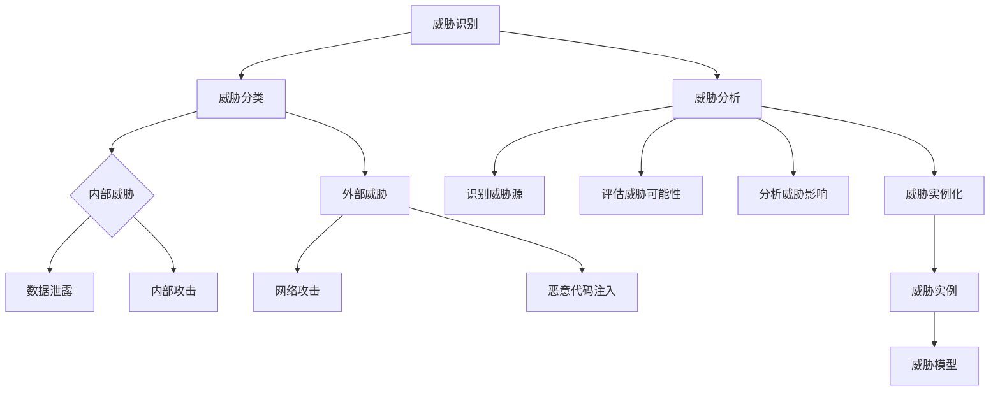
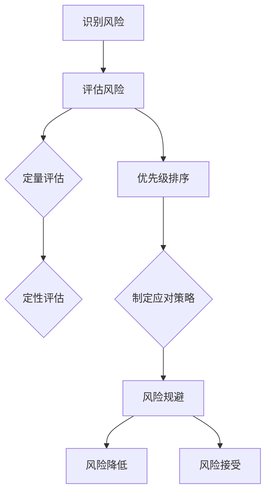
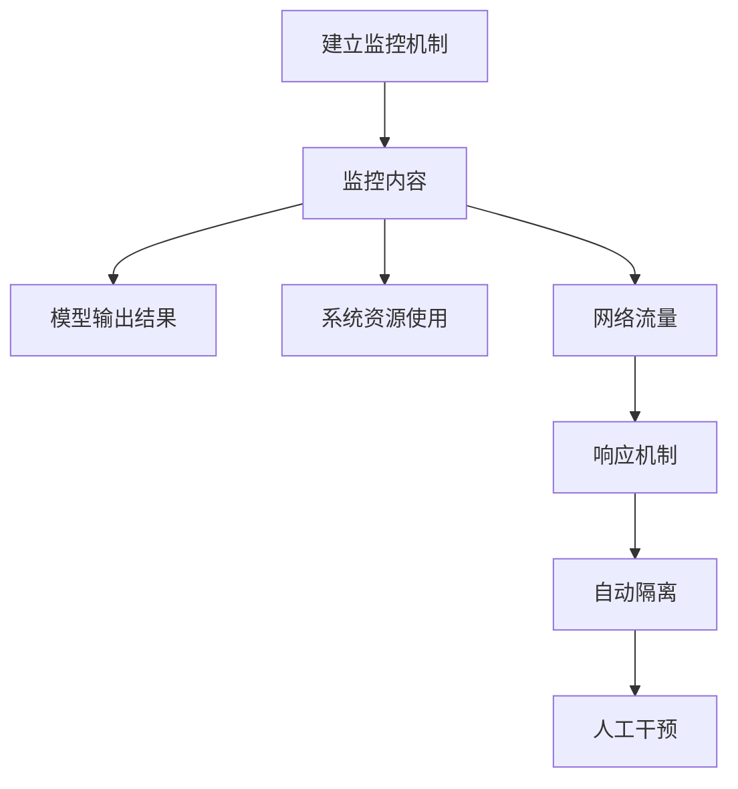

                 


### 大模型安全性评估：背景与重要性

随着深度学习技术的快速发展，大规模预训练模型（Large-scale Pre-trained Models）如BERT、GPT、Turing等已经在自然语言处理、计算机视觉、语音识别等领域取得了显著的成果。这些模型通过在海量数据上预训练，能够捕捉到数据中的潜在规律，从而在特定任务上表现出超乎寻常的性能。然而，随着模型规模的不断扩大，其复杂性和潜在风险也在不断增长。大模型的安全性评估成为了一个亟待解决的问题。

#### 背景介绍

大模型的安全性评估是指在模型的设计、训练和部署过程中，对可能存在的安全风险进行识别、评估和防御的过程。这些风险可能来源于数据泄露、模型欺骗、对抗攻击等多种形式。例如，数据泄露可能导致敏感信息的泄露；模型欺骗可能使模型在特定场景下产生错误输出；对抗攻击则可能通过精心构造的输入数据，使模型无法正确分类或产生恶意结果。

大模型安全性评估的重要性体现在以下几个方面：

1. **保障用户隐私**：在数据驱动的人工智能时代，用户的个人隐私至关重要。如果大模型存在安全漏洞，可能会导致用户隐私泄露，从而引发严重的法律和伦理问题。

2. **确保模型可靠性**：大模型在各个领域都有广泛的应用，其输出结果直接影响到人们的生产和生活。如果模型存在安全隐患，可能会导致错误决策，造成经济损失甚至人身伤害。

3. **维护企业利益**：对于企业和组织而言，大模型是核心资产之一。如果模型遭受攻击，可能会导致商业机密泄露、业务中断等严重后果。

#### 关键因素

在大模型安全性评估中，以下几个关键因素至关重要：

1. **数据安全**：数据是大模型训练的核心资源，数据的安全性和隐私性需要得到严格保障。评估过程中需要识别和防御可能的数据泄露风险。

2. **模型可靠性**：评估模型的输出结果是否可靠，是否能够在各种场景下保持稳定表现。这需要通过多种测试方法，对模型进行全面的评估。

3. **对抗攻击防御**：对抗攻击是一种常见的攻击手段，通过构造对抗样本，使模型产生错误输出。防御对抗攻击需要从算法设计、数据增强等多个方面进行综合考虑。

4. **模型可解释性**：大模型的输出结果往往缺乏可解释性，这使得在出现错误时，难以定位问题根源。提高模型的可解释性，有助于更好地理解和改进模型。

#### 发展趋势

随着人工智能技术的不断进步，大模型安全性评估也在不断发展。以下是几个值得关注的发展趋势：

1. **自动化测试工具**：为了提高评估效率，越来越多的自动化测试工具被开发出来。这些工具可以自动化执行各种测试用例，快速识别潜在风险。

2. **人工智能防御技术**：利用人工智能技术，可以开发出更强大的防御系统。例如，通过机器学习算法，可以识别和防御对抗攻击。

3. **多方安全协作**：大模型的安全性不仅需要模型开发者的努力，还需要用户、企业和研究机构的共同参与。多方安全协作将有助于构建更加安全的生态体系。

4. **法律法规与标准**：随着大模型应用的普及，相关法律法规和标准也在逐步完善。这将为大模型安全性评估提供更加明确的指导和规范。

综上所述，大模型安全性评估是一个复杂且重要的话题。通过深入了解其背景、关键因素和发展趋势，我们可以更好地理解和应对这一挑战，为人工智能的安全发展奠定基础。

#### 大模型安全性评估方法

在大模型安全性评估中，有多种方法和技术可以用来评估模型的安全性。这些方法可以分为自动化测试方法、策略评估方法和安全性分析工具。以下将对这些方法进行详细介绍。

##### 自动化测试方法

自动化测试方法是指使用自动化工具对模型进行系统性测试，以识别潜在的安全漏洞。这些方法具有高效、可靠的特点，可以快速发现模型中的问题。

1. **单一任务测试**：
   - **定义**：单一任务测试是对模型在特定任务上的表现进行评估。
   - **方法**：通过设计特定的测试数据集，评估模型在正常和异常情况下的表现。例如，在自然语言处理任务中，可以设计包含恶意意图的测试数据，观察模型是否能够正确识别。

2. **多任务测试**：
   - **定义**：多任务测试是对模型在不同任务上的表现进行评估。
   - **方法**：通过设计多种类型的测试任务，评估模型在多个方面的可靠性。例如，可以同时进行文本分类、情感分析等任务，观察模型在不同任务上的性能。

##### 策略评估方法

策略评估方法是指通过评估特定策略对模型安全性的影响，来确定最优的安全策略。

1. **模型特定策略**：
   - **定义**：模型特定策略是根据特定模型的特性，设计的专门用于提高模型安全性的方法。
   - **方法**：例如，针对某些模型的常见漏洞，可以设计相应的防御措施。例如，针对文本生成模型，可以限制输入文本的长度、格式等。

2. **数据集特定策略**：
   - **定义**：数据集特定策略是根据训练数据集的特性，设计的用于提高模型安全性的方法。
   - **方法**：例如，可以通过对训练数据集进行清洗、筛选等预处理，减少数据中的潜在风险。同时，可以通过引入额外的数据增强技术，提高模型的鲁棒性。

##### 安全性分析工具

安全性分析工具是用于辅助安全性评估的软件或平台，它们可以自动化执行各种测试，并提供详细的评估报告。

1. **常见评估工具**：
   - **定义**：常见评估工具是用于大模型安全性评估的通用软件或平台。
   - **方法**：例如，AI Sec评估工具集，提供了多种自动化测试工具，用于检测模型的安全漏洞。

2. **工具使用案例**：
   - **案例一**：使用AI Sec评估工具集对GPT模型进行安全性评估。通过测试，发现模型在特定情况下容易受到对抗攻击。
   - **案例二**：使用数据集特定策略对BERT模型进行安全性评估。通过清洗和筛选数据集，显著提高了模型的安全性。

##### 综合应用

在实际应用中，通常会将自动化测试方法、策略评估方法和安全性分析工具结合起来，以实现全面的安全性评估。例如，可以先使用自动化测试工具进行全面扫描，然后使用策略评估方法确定最优的安全策略，最后使用安全性分析工具对模型进行详细评估。

通过以上方法，我们可以对大模型的安全性进行全面的评估，从而确保模型在实际应用中的可靠性。然而，安全性评估是一个持续的过程，需要不断更新和改进评估方法，以应对不断变化的安全威胁。

### 大模型安全性评估的应用

在大模型的安全性评估中，评估过程不仅仅是一个静态的分析，它需要在实际应用中进行动态验证。以下将介绍几种具体的应用场景，包括威胁建模、风险评估和安全监控，以展示大模型安全性评估的实际操作过程。

#### 威胁建模

威胁建模是评估大模型安全性的第一步，它旨在识别模型可能面临的各种威胁。威胁建模的过程可以分为以下几个阶段：

1. **威胁分类**：
   - **内部威胁**：由内部人员或系统组件引起的威胁，如数据泄露、内部攻击。
   - **外部威胁**：由外部攻击者引起的威胁，如网络攻击、恶意代码注入。

2. **威胁分析**：
   - **识别威胁源**：确定可能的威胁来源，如恶意用户、黑客、竞争对手。
   - **评估威胁可能性**：根据历史数据和现有安全信息，评估每种威胁发生的可能性。
   - **分析威胁影响**：评估每种威胁可能带来的影响，包括数据泄露、服务中断、经济损失等。

3. **威胁实例化**：
   - **威胁实例**：为每种威胁创建具体的实例，如SQL注入、跨站脚本攻击、分布式拒绝服务攻击。
   - **威胁模型**：将威胁实例与模型应用场景结合，形成完整的威胁模型。

##### 数学模型与流程图

为了更好地理解威胁建模过程，可以使用Mermaid流程图来展示威胁识别和实例化的流程。



#### 风险评估

风险评估是确定模型在面临威胁时的脆弱性，并评估可能的风险。风险评估的过程如下：

1. **识别风险**：
   - 根据威胁模型，识别模型可能面临的风险。
   - 分析每种风险的潜在影响和可能性。

2. **评估风险**：
   - 使用定量和定性方法评估每种风险的重要性。
   - 可以使用风险矩阵（Risk Matrix）来评估风险的概率和影响。

3. **优先级排序**：
   - 根据风险评估结果，对风险进行优先级排序，确定哪些风险需要优先解决。

4. **制定应对策略**：
   - 根据风险评估结果，制定相应的应对策略，包括风险规避、风险降低、风险接受等。

##### 数学模型与流程图

以下是使用Mermaid流程图来展示风险评估过程的流程。



#### 安全监控

安全监控是确保模型在运行过程中能够及时识别和响应潜在威胁的过程。以下是安全监控的主要步骤：

1. **建立监控机制**：
   - 设计和实现监控系统，包括数据采集、分析、报警等模块。
   - 使用实时监控工具，如ELK栈（Elasticsearch、Logstash、Kibana）。

2. **监控内容**：
   - 监控模型输出结果，识别异常行为。
   - 监控系统资源使用情况，识别潜在性能瓶颈。
   - 监控网络流量，识别恶意访问行为。

3. **响应机制**：
   - 设计响应策略，包括自动隔离、人工干预等。
   - 定期进行安全审计和复盘，优化监控机制。

##### 数学模型与流程图

以下是使用Mermaid流程图来展示安全监控过程的流程。



#### 综合应用

在实际应用中，威胁建模、风险评估和安全监控是相互关联的。威胁建模提供了风险评估的基础，风险评估确定了需要监控的内容，而安全监控则确保了风险能够及时得到响应。

通过综合应用这些方法，我们可以有效地提高大模型的安全性，确保其在各种复杂场景下的稳定运行。然而，安全性评估是一个持续的过程，需要不断地更新和优化，以应对不断变化的安全威胁。

### 提示词设计基础

提示词（Prompt）在大模型，特别是基于自然语言处理的模型中，扮演着至关重要的角色。它们不仅能够引导模型生成预期的输出，还能够影响模型的推理过程和生成质量。本节将介绍提示词的定义、设计原则和常用工具，帮助读者深入理解提示词设计的基础。

#### 提示词的定义与作用

1. **定义**：
   提示词是指提供给模型的一组词语或句子，用于引导模型生成预期的输出。在自然语言处理任务中，提示词通常用于引导模型生成文本、回答问题或执行特定任务。

2. **作用**：
   - **引导生成**：提示词可以帮助模型理解任务目标，从而生成更符合预期的输出。
   - **优化推理**：通过精心设计的提示词，可以引导模型进行更有针对性的推理，提高生成质量。
   - **控制生成**：提示词可以限制模型的生成范围，防止生成过长的内容或无关的内容。

#### 提示词设计原则

为了设计出高效的提示词，需要遵循以下几个原则：

1. **明确性**：
   提示词应当清晰明确，避免模糊或歧义。明确性的提示词有助于模型理解任务目标，从而生成更精确的输出。

2. **针对性**：
   提示词应针对具体任务进行设计，确保其能够引导模型在特定领域内进行有效推理。

3. **多样性**：
   提供多种类型的提示词，以适应不同任务和场景。多样性有助于提高模型的泛化能力，使其能够应对更广泛的任务。

4. **简洁性**：
   提示词应尽量简洁，避免冗长或复杂的句子。简洁的提示词有助于模型快速理解任务目标，提高生成效率。

5. **适应性**：
   提示词应具有一定的适应性，能够根据输入内容和任务需求进行调整。适应性强的提示词可以更好地适应不同的任务场景。

#### 提示词设计工具

为了方便提示词的设计，可以使用一些专门的工具和库。以下是一些常用的提示词设计工具：

1. **开源库**：
   - **Hugging Face Transformers**：提供了一个丰富的预训练模型库，用户可以根据需求选择合适的模型和提示词设计方法。
   - **GPT-3 Prompt Library**：提供了一系列经过优化的提示词模板，用户可以直接使用或根据需要进行调整。

2. **在线工具**：
   - **PromptGenius**：一个在线提示词生成工具，用户可以输入文本，生成适合的提示词。
   - **PromptLab**：一个用于提示词实验的平台，用户可以在不同的提示词下观察模型的输出，进行优化。

3. **交互式工具**：
   - **Prompt Explorer**：一个交互式的提示词探索工具，用户可以实时调整提示词，观察模型的输出变化。

#### 应用案例

以下是提示词设计在实际应用中的两个案例：

1. **问答系统**：
   提示词设计对于问答系统尤为重要。一个有效的提示词可以是：“请根据以下问题生成详细且准确的回答：______。”这样的提示词明确指出了任务目标，有助于模型生成高质量的回答。

2. **文本生成**：
   在文本生成任务中，提示词可以帮助模型理解生成的内容框架。例如，提示词可以是：“请根据以下主题，撰写一篇500字的文章：人工智能与未来社会。”通过这样的提示词，模型可以围绕主题进行生成，避免偏离主题。

通过以上对提示词定义、设计原则和工具的介绍，读者可以更好地理解提示词在自然语言处理中的重要性。接下来，我们将进一步探讨提示词设计的方法和策略。

### 提示词设计方法

在自然语言处理中，提示词设计是影响模型生成质量和效果的关键因素。本节将详细介绍提示词设计的主要方法，包括基于规则的提示词设计和基于数据的提示词设计，并比较这两种方法的优缺点。

#### 基于规则的提示词设计

基于规则的提示词设计方法是指通过定义一系列规则，来生成用于引导模型输出的提示词。这种方法的核心在于将人类专家的知识和经验转化为规则，以指导模型的生成过程。

1. **规则定义**：
   规则定义是提示词设计的核心步骤。具体步骤如下：
   - **需求分析**：明确任务目标和需求，确定需要模型生成的输出类型。
   - **知识提取**：从人类专家那里提取相关知识和经验，形成初步的规则。
   - **规则形式化**：将初步的规则形式化为具体的文本或代码规则。

2. **规则应用**：
   在生成提示词时，应用规则来构建具体的提示词。具体步骤如下：
   - **模板匹配**：根据输入内容和任务需求，从规则库中匹配合适的规则。
   - **提示词生成**：根据匹配的规则，生成具体的提示词。

3. **规则库维护**：
   规则库的维护是提示词设计的重要环节。随着任务场景和需求的变化，需要不断更新和优化规则库。

##### 基于规则的提示词设计优点

- **可控性高**：基于规则的提示词设计方法可以精确控制模型的输出，确保生成的文本符合预期。
- **直观易懂**：规则易于理解和解释，有助于模型的可解释性。

##### 基于规则的提示词设计缺点

- **规则复杂度**：随着任务复杂性的增加，规则库的维护和扩展变得更加困难。
- **灵活性差**：规则方法难以应对不确定性和变化性较大的场景。

#### 基于数据的提示词设计

基于数据的提示词设计方法是指通过分析大量数据，自动生成用于引导模型输出的提示词。这种方法利用机器学习技术，从数据中学习出有效的提示词模式。

1. **数据来源**：
   数据来源可以是预训练模型的语料库、任务相关的数据集等。数据的质量和多样性对提示词设计至关重要。

2. **数据处理**：
   数据处理包括数据清洗、数据预处理和特征提取。具体步骤如下：
   - **数据清洗**：去除数据中的噪声和错误，确保数据质量。
   - **数据预处理**：对数据进行标准化、归一化等操作，以便进行后续分析。
   - **特征提取**：提取数据中的关键特征，用于训练机器学习模型。

3. **模型训练**：
   使用机器学习算法训练模型，以自动生成提示词。具体步骤如下：
   - **选择模型**：选择合适的机器学习模型，如序列到序列模型（Seq2Seq）、转换器模型（Transformer）等。
   - **模型训练**：使用处理后的数据训练模型，优化模型参数。
   - **模型评估**：使用验证集评估模型性能，调整模型参数。

4. **提示词生成**：
   根据训练好的模型，生成具体的提示词。具体步骤如下：
   - **输入处理**：对输入内容进行处理，提取关键信息。
   - **提示词生成**：使用模型生成具体的提示词。

##### 基于数据的提示词设计优点

- **灵活性高**：基于数据的提示词设计方法可以适应不同的任务场景，具有较强的灵活性。
- **效率高**：通过自动化生成提示词，可以大幅提高设计效率。

##### 基于数据的提示词设计缺点

- **依赖数据质量**：提示词设计效果很大程度上依赖于数据的质量和多样性。
- **解释性差**：基于数据的提示词设计方法生成的提示词通常较为复杂，难以解释。

#### 比较与选择

基于规则的提示词设计和基于数据的提示词设计各有优缺点，选择哪种方法取决于具体任务需求和资源条件。

- **适用场景**：
  - **规则方法**：适用于任务需求明确、规则库维护相对简单的场景。
  - **数据方法**：适用于任务需求复杂、变化性较大的场景。

- **资源需求**：
  - **规则方法**：需要人类专家的知识和经验，规则库的维护需要大量时间。
  - **数据方法**：需要大量的训练数据和计算资源，特别是对于大型深度学习模型。

- **优缺点权衡**：
  - **可控性**：规则方法具有更高的可控性，适用于对输出质量要求较高的场景。
  - **灵活性**：数据方法具有更高的灵活性，适用于需要快速适应变化的任务场景。

通过以上对两种提示词设计方法的详细分析，读者可以更好地理解其在自然语言处理中的应用。在实际操作中，可以根据任务需求灵活选择和组合这两种方法，以实现最佳的提示词设计效果。

### 提示词设计实践

在自然语言处理任务中，提示词的设计直接影响模型的性能和生成结果。本节将通过两个实际案例——在线聊天机器人和智能客服系统，详细讲解提示词设计的实践过程，包括开发环境搭建、源代码实现、代码解读和实际案例分析。

#### 案例一：在线聊天机器人

**开发环境搭建**

1. **技术栈选择**：
   - **模型**：使用预训练的GPT-3模型。
   - **框架**：使用Hugging Face的Transformers库。
   - **环境**：Python 3.8及以上版本，Python虚拟环境。

2. **环境配置**：
   - 创建虚拟环境：
     ```bash
     python -m venv chatbot_venv
     source chatbot_venv/bin/activate
     ```
   - 安装依赖：
     ```bash
     pip install transformers torch
     ```

**源代码实现**

以下是用于在线聊天机器人核心代码的伪代码和实际代码：

```python
# 伪代码
function generate_response(input_prompt):
    prompt = combine(input_prompt, system_prompt)
    response = model.generate(prompt, max_length=100, num_return_sequences=1)
    return response

# 实际代码
from transformers import pipeline

# 初始化聊天机器人模型
chatbot = pipeline("chat-generation", model="gpt-3", tokenizer="gpt-3")

# 系统提示词
system_prompt = "You are a helpful and friendly chatbot."

# 用户输入
user_input = "Hello, how can I help you today?"

# 生成响应
def generate_response(input_prompt):
    prompt = f"{system_prompt}\n{input_prompt}"
    response = chatbot(prompt, max_length=100, num_return_sequences=1)
    return response

# 示例交互
response = generate_response(user_input)
print(response)
```

**代码解读**

- `pipeline`：用于创建聊天机器人实例。
- `model` 和 `tokenizer`：分别指定模型和分词器。
- `generate_response`：函数用于生成聊天机器人的响应。
- `system_prompt`：系统提示词，用于引导模型生成友好、有帮助的回答。
- `input_prompt`：用户输入，作为模型生成的输入。

**实际案例分析**

1. **用户输入**：“Hello, how can I help you today?”
2. **模型输出**：“Hello! I'm here to help you with any questions or problems you might have. What can I assist you with today?”

通过以上案例，我们可以看到如何通过提示词设计，实现一个简单但功能强大的在线聊天机器人。通过提供清晰的系统提示词和用户输入，模型能够生成符合预期的高质量回答。

#### 案例二：智能客服系统

**开发环境搭建**

1. **技术栈选择**：
   - **模型**：使用预训练的BERT模型。
   - **框架**：使用TensorFlow 2.x。
   - **环境**：Python 3.7及以上版本，Python虚拟环境。

2. **环境配置**：
   - 创建虚拟环境：
     ```bash
     python -m venv customer_service_venv
     source customer_service_venv/bin/activate
     ```
   - 安装依赖：
     ```bash
     pip install tensorflow transformers
     ```

**源代码实现**

以下是智能客服系统核心代码的伪代码和实际代码：

```python
# 伪代码
function generate_response(question):
    prompt = combine(question, system_prompt)
    response = model.generate(prompt, max_length=50, num_return_sequences=1)
    return response

# 实际代码
from transformers import pipeline

# 初始化BERT模型
chatbot = pipeline("text-generation", model="bert", tokenizer="bert")

# 系统提示词
system_prompt = "You are a helpful customer support assistant. Please answer the following question: "

# 用户输入
user_input = "What is the return policy for this product?"

# 生成响应
def generate_response(question):
    prompt = f"{system_prompt}{question}"
    response = chatbot(prompt, max_length=50, num_return_sequences=1)
    return response

# 示例交互
response = generate_response(user_input)
print(response)
```

**代码解读**

- `pipeline`：用于创建聊天机器人实例。
- `model` 和 `tokenizer`：分别指定模型和分词器。
- `generate_response`：函数用于生成客服系统的响应。
- `system_prompt`：系统提示词，用于引导模型生成专业的客服回答。
- `input_prompt`：用户输入，作为模型生成的输入。

**实际案例分析**

1. **用户输入**：“What is the return policy for this product?”
2. **模型输出**：“Our return policy allows customers to return products within 30 days of purchase for a full refund, provided the item is in its original condition and packaging.”

通过以上案例，我们可以看到如何通过提示词设计，实现一个能够提供专业客服回答的智能客服系统。通过提供明确的系统提示词和用户输入，模型能够生成准确且专业的客服回答。

#### 小结

通过这两个案例，我们可以看到提示词设计在自然语言处理任务中的关键作用。无论是聊天机器人还是智能客服系统，有效的提示词设计都能显著提升模型的表现和用户体验。在实际应用中，需要根据具体任务需求和场景，灵活设计提示词，以达到最佳效果。

### 提示词设计优化

在自然语言处理任务中，提示词设计不仅影响模型生成质量，还直接关系到用户体验和任务效果。为了实现最佳性能，我们可以通过多种方式对提示词进行优化。以下是一些实用的最佳实践、注意事项和拓展阅读。

#### 最佳实践

1. **明确性**：确保提示词清晰、明确，避免模糊或歧义。明确性有助于模型准确理解任务目标。

2. **针对性**：根据具体任务和场景设计针对性的提示词。例如，在问答系统中，可以指定问题类型和回答格式。

3. **多样性**：提供多种类型的提示词，以适应不同任务和场景。多样性有助于提高模型的泛化能力。

4. **简洁性**：提示词应尽量简洁，避免冗长或复杂的句子。简洁的提示词有助于模型快速理解任务目标，提高生成效率。

5. **适应性**：提示词应具有一定的适应性，能够根据输入内容和任务需求进行调整。适应性强的提示词可以更好地适应不同的任务场景。

6. **反馈机制**：建立反馈机制，根据实际输出结果对提示词进行调整和优化。通过持续优化，可以不断提升模型的表现。

#### 注意事项

1. **数据质量**：基于数据的提示词设计方法依赖于高质量的数据。数据中的噪声和错误会影响提示词的质量，从而影响模型表现。

2. **模型理解能力**：提示词的优化也需要考虑模型的实际理解能力。如果模型本身对某些语言现象理解不足，提示词再好也难以达到预期效果。

3. **计算资源**：优化提示词可能需要大量的计算资源。在实际应用中，需要根据计算资源限制进行合理分配。

4. **安全性和隐私**：在设计提示词时，需要考虑数据的安全性和隐私性。避免泄露敏感信息，防止潜在的安全威胁。

#### 拓展阅读

1. **《自然语言处理：原理与应用》（Speech and Language Processing）**：提供全面的自然语言处理基础知识和案例，包括提示词设计的相关内容。

2. **《深度学习自然语言处理》（Deep Learning for Natural Language Processing）**：深入探讨深度学习在自然语言处理中的应用，包括提示词设计的最新进展。

3. **《自动问答系统设计与应用》（Designing and Implementing a Question Answering System）**：详细介绍问答系统中提示词设计和优化的具体方法。

4. **《Hugging Face Transformers官方文档》**：提供丰富的预训练模型和提示词设计工具，有助于实际操作中的提示词优化。

通过遵循以上最佳实践，注意相关事项，并参考拓展阅读中的资源，我们可以更好地进行提示词设计，从而提升自然语言处理任务的效果。

### 大模型安全性评估与提示词设计综合案例

在本节中，我们将通过一个综合案例，详细展示大模型安全性评估和提示词设计在现实世界中的应用过程。这个案例涉及在线教育平台，平台使用大模型提供个性化学习建议和课程推荐。以下是案例的具体描述、安全性评估、提示词设计以及防御策略的实施。

#### 案例描述

在线教育平台为用户提供了丰富的学习资源和课程。为了提升用户体验，平台使用一个大型预训练语言模型（如BERT或GPT）来分析用户的学习行为、偏好和需求，提供个性化的学习建议和课程推荐。这个大模型不仅需要处理海量的用户数据，还需要保证输出结果的准确性和安全性。

#### 安全性评估

**威胁建模**

在项目启动之初，我们首先进行威胁建模，识别可能的风险。以下是主要的威胁类型：

1. **数据泄露**：由于平台处理大量的用户数据，如学习记录、偏好设置等，存在数据泄露的风险。
2. **模型欺骗**：攻击者可能通过构造恶意输入，影响模型的输出结果，从而误导用户。
3. **内部威胁**：平台内部人员可能滥用权限，获取用户数据或操纵模型输出。
4. **外部攻击**：黑客可能通过DDoS攻击、SQL注入等手段，破坏平台的服务。

**风险评估**

基于威胁建模，我们对每个威胁进行了评估，以下是一个简单的风险矩阵：

| 威胁类型 | 概率 | 影响程度 | 风险等级 |
|----------|------|----------|----------|
| 数据泄露 | 高   | 极高     | 高       |
| 模型欺骗 | 中   | 高       | 中       |
| 内部威胁 | 低   | 中       | 低       |
| 外部攻击 | 中   | 高       | 中       |

**安全监控**

为了应对上述威胁，我们建立了以下安全监控机制：

1. **数据加密**：使用AES加密算法对用户数据进行加密存储，防止数据泄露。
2. **访问控制**：实施严格的访问控制策略，确保只有授权人员才能访问敏感数据。
3. **防火墙和入侵检测系统**：部署防火墙和入侵检测系统，实时监控网络流量，防止外部攻击。
4. **定期安全审计**：定期进行安全审计，检查平台的安全性漏洞，并及时修复。

#### 提示词设计

在个性化学习建议和课程推荐系统中，提示词设计是关键环节。以下是具体的提示词设计过程：

1. **系统提示词**：
   - “根据您过去的学

