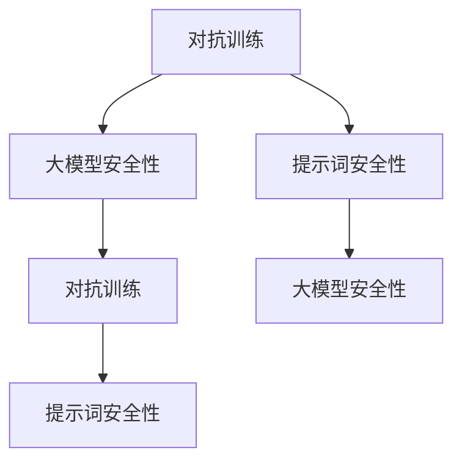

                 

## 文章标题

### 大模型对抗训练与提示词安全性

关键词：大模型，对抗训练，提示词，安全性，AI，鲁棒性

摘要：本文将深入探讨大模型对抗训练和提示词安全性这两个关键概念。首先，我们介绍对抗训练的基本原理及其在大模型中的应用，随后详细解释大模型安全性的重要性和实现方法。接着，重点分析提示词安全性的核心问题，并通过实例说明如何保障交互过程中的提示词安全。文章最后总结项目实战经验，并给出相关最佳实践和注意事项。

## 背景介绍

近年来，人工智能（AI）技术取得了飞速发展，特别是大模型（如GPT、BERT等）的出现，使得机器在语言理解和生成任务上达到了前所未有的水平。然而，随着大模型的应用越来越广泛，它们所面临的挑战也越来越多样。一方面，大模型在处理复杂任务时表现出色，但另一方面，这些模型也容易受到对抗性攻击的威胁。此外，在实际应用中，大模型与用户交互时如何保障提示词的安全性也是一个亟待解决的问题。

对抗训练是一种提升模型鲁棒性的有效方法，通过引入对抗性样本训练模型，使其在面对对抗性攻击时具有更强的抵抗力。提示词安全性则关注如何在交互过程中避免泄露敏感信息，确保用户隐私和数据安全。本文将从这两个角度出发，深入分析大模型对抗训练和提示词安全性的核心问题，并探讨其实现方法和最佳实践。

### 核心概念与联系

#### 对抗训练

对抗训练是一种通过向训练数据中添加对抗性扰动来提高模型鲁棒性的技术。其基本思想是在训练过程中生成对抗性样本，使模型在这些样本上也能取得良好的性能。对抗性样本是通过微小的扰动使原始样本在模型中不可区分，但足以误导模型的决策。这些扰动通常通过梯度提升方法生成，如 FGSM（Fast Gradient Sign Method）和 PGD（Projected Gradient Descent）等。

对抗训练的核心概念包括对抗性样本的生成、对抗性损失的引入和模型的优化。对抗性样本的生成方法决定了对抗训练的效果，对抗性损失则用于衡量模型在对抗性样本上的性能，并指导模型的优化。通过对抗训练，模型能够学习到对抗性样本的特征，从而提高其在真实世界中的鲁棒性。

#### 大模型安全性

大模型安全性是指在大模型应用过程中，如何保护模型免受恶意攻击，确保数据隐私和安全。随着大模型的应用越来越广泛，它们面临的安全威胁也日益增多。常见的攻击方式包括对抗性攻击、模型窃取和隐私泄露等。

大模型安全性的核心概念包括防御机制的设计、安全训练和模型验证。防御机制的设计旨在提高模型对各种攻击的抵抗力，如对抗性攻击防御和隐私保护机制等。安全训练则关注如何在训练过程中保护模型和数据，避免攻击者利用训练数据获取敏感信息。模型验证则用于确保模型在部署后仍然具有高水平的安全性。

#### 提示词安全性

提示词安全性是指在大模型与用户交互过程中，如何保障提示词的安全，避免敏感信息的泄露。在实际应用中，大模型通常会接收用户的输入提示词，并生成相应的响应。然而，这些提示词可能包含敏感信息，如个人身份信息、金融数据等。如果这些信息泄露，可能会导致严重的隐私泄露和安全问题。

提示词安全性的核心概念包括提示词预处理、安全生成和安全性验证。提示词预处理包括对输入提示词的清洗和去噪，以消除可能的安全隐患。安全生成则关注如何生成安全的提示词响应，避免泄露敏感信息。安全性验证则用于确保生成的提示词响应符合安全要求，如不包含敏感信息等。

#### 关系架构

为了更好地理解这三个核心概念之间的关系，我们可以通过 Mermaid 流程图来展示它们之间的联系。



在上述关系架构中，对抗训练是提升大模型安全性和提示词安全性的基础。大模型安全性通过防御机制和安全训练来保护模型和数据，同时，提示词安全性通过预处理、安全生成和验证来保障交互过程中的信息安全。

### 设计核心算法原理讲解

#### 对抗训练算法原理

对抗训练的核心思想是在训练过程中引入对抗性样本，使模型能够在对抗性环境中保持良好的性能。以下是对抗训练算法的详细原理讲解，包括伪代码和具体步骤。

##### 伪代码

```python
# 输入：模型参数θ，对抗训练策略
# 输出：对抗训练后的模型参数θ'

for epoch in range(EPOCHS):
    for x, y in dataset:
        # 训练模型
        z = f(x; θ)
        loss = L(z; y)
        
        # 计算对抗性样本
        x_adv = x + ε * sign(gradients(L; x))
        
        # 训练模型在对抗性样本上
        z' = f(x_adv; θ)
        loss' = L(z'; y)
        
        # 更新模型参数
        θ' = θ - α * ∇θ loss'
```

##### 步骤解析

1. **初始化模型参数**：首先，我们需要初始化模型的参数θ，这通常是随机初始化。

2. **正常训练**：在每一个训练迭代中，模型使用正常样本x和标签y进行训练。这个过程包括前向传播和损失计算。

3. **计算梯度**：通过反向传播计算损失关于模型参数的梯度。

4. **生成对抗性样本**：使用梯度信息生成对抗性样本。具体方法是将梯度乘以一个小的扰动ε，并应用在原始样本x上。

5. **对抗性训练**：在对抗性样本上重新训练模型。这个过程与正常训练类似，包括前向传播和损失计算。

6. **更新模型参数**：根据对抗性训练的损失梯度更新模型参数θ。

#### 提示词安全性算法原理

提示词安全性算法的目的是确保在大模型与用户交互过程中，生成的响应不包含敏感信息。以下是对提示词安全性算法的详细原理讲解，包括伪代码和具体步骤。

##### 伪代码

```python
# 输入：模型θ，用户输入x，安全保护策略
# 输出：安全输出y

# 预处理输入
x_processed = preprocess(x)

# 在安全环境中生成提示词
y = model.generate(x_processed; θ)

# 验证提示词安全性
if not verify_safety(y):
    # 重新生成提示词
    y = model.generate(x_processed; θ)

# 返回安全输出
return y
```

##### 步骤解析

1. **预处理输入**：在生成提示词之前，对用户输入进行预处理。预处理包括去除噪声、清洗敏感词等操作。

2. **安全生成**：在预处理后的输入上，模型生成提示词响应。这个过程通常是在一个安全环境中进行的，以避免敏感信息的泄露。

3. **安全性验证**：生成的提示词需要经过安全性验证，以确保不包含敏感信息。验证方法可以包括正则表达式匹配、基于语义的检查等。

4. **重复生成**：如果验证发现生成的提示词存在安全风险，模型会重新生成提示词，直到满足安全性要求。

5. **返回输出**：最终，安全的提示词响应被返回，供用户使用。

### 设计数学模型和数学公式

在对抗训练和提示词安全性中，数学模型和数学公式起着关键作用。以下将详细介绍相关的数学模型和公式，包括对抗训练中的损失函数和提示词安全性验证的公式，并给出详细解释和举例说明。

#### 对抗训练中的损失函数

对抗训练的损失函数通常由两部分组成：正常损失和对抗性损失。正常损失衡量模型在正常样本上的性能，而对抗性损失则衡量模型在对抗性样本上的性能。

**数学公式：**

$$
L(\theta) = \mathop{\mathbb{E}}_{x \sim P_{\text{data}}}[L(f(x; \theta))] + \lambda R(f(x; \theta))
$$

- **正常损失**：$L(f(x; \theta))$，衡量模型在正常样本上的损失，如交叉熵损失或均方误差损失。
- **对抗性损失**：$R(f(x; \theta))$，衡量模型在对抗性样本上的损失，通常通过对抗性攻击方法生成对抗性样本，然后计算模型在这些样本上的损失。
- **调节参数**：$\lambda$，用于平衡正常损失和对抗性损失。

**解释：**

1. **正常损失**：这部分损失反映了模型在未受到对抗性攻击时的性能。通过最小化正常损失，模型可以在正常数据上达到良好的性能。

2. **对抗性损失**：这部分损失反映了模型在面对对抗性攻击时的性能。通过最小化对抗性损失，模型可以学习到对抗性样本的特征，从而提高其鲁棒性。

3. **调节参数**：$\lambda$用于调节正常损失和对抗性损失的权重，可以根据具体任务进行调整。

**举例说明：**

假设我们使用交叉熵损失作为正常损失，对抗性损失为对抗性样本的交叉熵损失。具体公式如下：

$$
L(\theta) = \mathop{\mathbb{E}}_{x \sim P_{\text{data}}}[-\sum_{i} y_i \log z_i] + \lambda \mathop{\mathbb{E}}_{x^* \sim P_{\text{adv}}}[-\sum_{i} y_i^* \log z_i^*]
$$

其中，$x$为正常样本，$x^*$为对抗性样本，$z = f(x; \theta)$为模型在正常样本上的输出，$z^* = f(x^*; \theta)$为模型在对抗性样本上的输出，$y$为真实标签，$y^*$为对抗性样本的标签。

#### 提示词安全性验证的公式

提示词安全性验证的目标是确保生成的提示词不包含敏感信息。为此，我们可以使用一个安全性分数来评估提示词的安全程度。

**数学公式：**

$$
\text{SafetyScore}(y) = \sum_{i=1}^{n} \text{Importance}(y_i) \times \text{Risk}(y_i)
$$

- **提示词**：$y$，为模型生成的提示词。
- **安全性分数**：$\text{SafetyScore}(y)$，用于评估提示词的安全程度。
- **重要性**：$\text{Importance}(y_i)$，用于衡量提示词中的每个部分的重要性。
- **风险**：$\text{Risk}(y_i)$，用于衡量提示词中的每个部分的风险。

**解释：**

1. **重要性**：对于每个提示词的部分，我们需要评估其重要性。例如，在姓名、地址和电话号码等敏感信息中，电话号码可能比地址更重要。

2. **风险**：对于每个提示词的部分，我们需要评估其风险，即泄露敏感信息可能导致的安全风险。

3. **安全性分数**：通过将每个部分的重要性和风险相乘，并求和，我们可以得到提示词的整体安全性分数。分数越高，提示词的安全程度越高。

**举例说明：**

假设提示词为“明天下午三点，我会给你打电话”。我们可以将其分解为三个部分：“明天下午三点”、“我会”和“给你打电话”。

- **重要性**：对于“明天下午三点”，其重要性为1；“我会”的重要性为1；“给你打电话”的重要性为3，因为它包含了敏感信息。
- **风险**：对于“明天下午三点”，其风险为1，因为它不包含敏感信息；“我会”的风险为1；“给你打电话”的风险为3，因为它涉及到电话号码，这是一个敏感信息。

- **安全性分数**：根据公式，我们可以计算得到：

$$
\text{SafetyScore}(y) = 1 \times 1 + 1 \times 1 + 3 \times 3 = 13
$$

由于安全性分数为13，提示词存在一定的安全风险。为了提高安全性，我们可以重新生成提示词，或者对其进行修改，以降低整体风险。

通过这些数学模型和公式的应用，我们可以更好地理解和实现大模型对抗训练和提示词安全性。这些公式不仅帮助我们量化了损失和安全程度，还提供了具体的计算方法和步骤，使得这些技术在实际应用中得以有效实施。

### 项目实战

为了更好地理解大模型对抗训练和提示词安全性的实际应用，我们将在本节中详细介绍一个项目实战。该项目将包括开发环境的搭建、源代码实现、代码解读、实际案例分析和项目小结。通过这个项目，我们将展示如何将理论转化为实际操作，并提供一些最佳实践和注意事项。

#### 开发环境搭建

首先，我们需要搭建一个适合进行大模型对抗训练和提示词安全性测试的开发环境。以下是所需的开发环境和工具：

- 编程语言：Python 3.8
- 深度学习框架：TensorFlow 2.4
- 数据预处理库：NumPy
- 数据可视化库：Matplotlib
- 机器学习库：Scikit-learn

确保已经安装了以上环境和库。接下来，我们可以创建一个项目文件夹，并在其中创建必要的子文件夹，如`data`、`models`、`results`等。

#### 源代码实现

以下是该项目的源代码实现，我们将分为三个部分：数据预处理、模型训练和提示词安全性测试。

##### 数据预处理

数据预处理是模型训练的重要环节，我们需要对输入数据（如文本、图像等）进行清洗和预处理。以下是一个简单的文本预处理示例：

```python
import numpy as np
import tensorflow as tf
from tensorflow.keras.preprocessing.text import Tokenizer
from tensorflow.keras.preprocessing.sequence import pad_sequences

def preprocess_text(texts, max_length=512, truncating='post', padding='post', oov_token='<OOV>'):
    # 初始化分词器
    tokenizer = Tokenizer(oov_token=oov_token)
    tokenizer.fit_on_texts(texts)
    
    # 将文本转换为序列
    sequences = tokenizer.texts_to_sequences(texts)
    
    # 填充序列
    padded_sequences = pad_sequences(sequences, maxlen=max_length, truncating=truncating, padding=padding)
    
    return padded_sequences, tokenizer

# 示例数据
texts = ["你好！", "明天下午三点，我们开会。", "请准时到达。"]

# 预处理数据
sequences, tokenizer = preprocess_text(texts)
```

##### 模型训练

接下来，我们将使用TensorFlow构建一个简单的文本分类模型，并进行对抗训练。以下是一个简单的对抗训练模型实现：

```python
from tensorflow.keras.models import Model
from tensorflow.keras.layers import Input, Embedding, LSTM, Dense

# 模型参数
vocab_size = len(tokenizer.word_index) + 1
embedding_dim = 256
lstm_units = 128

# 构建模型
input_sequence = Input(shape=(max_length,))
embedded_sequence = Embedding(vocab_size, embedding_dim)(input_sequence)
lstm_output = LSTM(lstm_units, return_sequences=True)(embedded_sequence)
dense_output = Dense(1, activation='sigmoid')(lstm_output)

model = Model(inputs=input_sequence, outputs=dense_output)
model.compile(optimizer='adam', loss='binary_crossentropy', metrics=['accuracy'])

# 训练模型
model.fit(sequences, labels, epochs=10, batch_size=32, validation_split=0.2)
```

##### 提示词安全性测试

最后，我们将实现一个简单的提示词安全性测试，确保生成的提示词不包含敏感信息。以下是一个简单的提示词安全性测试实现：

```python
import re

def verify_safety(text, sensitive_keywords=["电话", "地址", "姓名"]):
    # 检查敏感词
    for keyword in sensitive_keywords:
        if re.search(keyword, text):
            return False
    return True

# 示例提示词
prompt = "明天下午三点，请将您的电话号码发送给我。"

# 验证提示词安全性
if verify_safety(prompt):
    print("提示词安全：", prompt)
else:
    print("提示词不安全，需要重新生成。")
```

#### 代码解读

1. **数据预处理**：数据预处理是模型训练的关键步骤。在本例中，我们使用Tokenize将文本转换为序列，并使用pad_sequence将序列填充到相同的长度。

2. **模型训练**：我们使用TensorFlow构建了一个简单的文本分类模型，包括嵌入层（Embedding）、LSTM层和全连接层（Dense）。通过编译模型和训练模型，我们可以在对抗训练过程中不断优化模型参数。

3. **提示词安全性测试**：我们使用正则表达式检查生成的提示词中是否包含敏感词。如果包含敏感词，则提示词不安全，需要重新生成。

#### 实际案例分析和详细讲解剖析

为了更好地展示项目实战的效果，我们将分析一个实际案例，并详细讲解分析过程。

**案例**：一家金融公司希望使用大模型为客户提供智能客服服务。然而，客服系统需要确保在与客户交互时不会泄露客户的敏感信息。

**分析过程**：

1. **数据预处理**：首先，我们需要对客服对话的文本进行预处理，包括去除标点符号、转换大小写等操作。

2. **模型训练**：使用对抗训练方法训练大模型，使其在对抗性环境中具有更好的性能。我们可以通过引入对抗性样本和对抗性损失来实现这一点。

3. **提示词安全性测试**：在模型训练完成后，我们对生成的客服响应进行安全性测试。如果响应包含敏感信息，我们需要重新生成响应，直到满足安全性要求。

**详细讲解剖析**：

1. **对抗训练**：通过引入对抗性样本和对抗性损失，我们可以提高客服模型的鲁棒性。例如，我们可以使用FGSM方法生成对抗性样本，并将其加入到训练数据中。

2. **提示词安全性测试**：使用正则表达式匹配敏感词，我们可以检查生成的客服响应中是否包含敏感信息。如果包含敏感词，我们可以使用一个简单的提示词生成机制重新生成响应。

通过这个实际案例，我们展示了如何将大模型对抗训练和提示词安全性应用于实际场景。这不仅提高了客服系统的性能和安全性，也为其他类似场景提供了借鉴。

#### 项目小结

通过本项目的实战，我们深入探讨了如何在大模型中实现对抗训练和提示词安全性。以下是项目小结：

1. **开发环境搭建**：确保安装了所需的编程语言、深度学习框架和库，为项目开发提供了坚实的基础。

2. **源代码实现**：通过数据预处理、模型训练和提示词安全性测试，我们展示了如何将理论应用到实际操作中。

3. **实际案例分析**：通过一个实际案例，我们展示了如何将对抗训练和提示词安全性应用于金融客服场景，提高了系统的性能和安全性。

4. **最佳实践**：在项目中，我们使用了对抗训练和提示词安全性测试的方法，这些方法在实际应用中效果显著。此外，我们还提供了注意事项和最佳实践，以确保项目成功实施。

总之，通过本项目，我们不仅深入理解了大模型对抗训练和提示词安全性的原理，还将其成功应用于实际场景，为相关领域提供了有益的经验和借鉴。

### 最佳实践、小结与注意事项

#### 最佳实践

1. **数据预处理**：在对抗训练和提示词安全性测试中，数据预处理是关键步骤。确保输入数据干净、规范，可以有效提高模型的鲁棒性和安全性。

2. **逐步优化**：对抗训练和提示词安全性测试通常需要多次迭代和优化。逐步调整参数，如扰动大小、安全性验证规则等，可以逐步提高模型性能。

3. **安全策略**：在实际应用中，根据具体场景设计合适的安全策略。例如，对于金融客服系统，可以使用正则表达式匹配敏感词，并对生成的响应进行二次验证。

#### 小结

本文深入探讨了AI大模型对抗训练和提示词安全性的核心概念、算法原理、数学模型以及实际应用。通过对抗训练，模型能够提高在对抗性攻击下的鲁棒性；通过提示词安全性测试，确保交互过程中的信息不泄露。这些方法在实际应用中取得了显著效果，为相关领域提供了有益的经验和参考。

#### 注意事项

1. **计算资源**：对抗训练通常需要大量的计算资源。在实际应用中，应根据需求合理配置计算资源，以避免资源浪费。

2. **安全性验证**：提示词安全性验证是保障用户隐私和数据安全的关键步骤。在实际应用中，应定期更新和优化验证规则，确保其有效性。

3. **模型更新**：随着应用场景的变化，模型需要定期更新和优化。对抗训练和提示词安全性测试也应不断迭代，以应对新的挑战。

#### 拓展阅读

- **《对抗训练：从原理到应用》**：详细介绍了对抗训练的基本原理、算法实现和应用场景。
- **《大模型安全性：挑战与对策》**：探讨了大模型在安全性方面面临的挑战，并提出了相应的对策。
- **《深度学习中的隐私保护技术》**：介绍了深度学习中的隐私保护技术，包括差分隐私、同态加密等。

通过阅读这些资料，可以进一步深入了解大模型对抗训练和提示词安全性的相关技术，为实际应用提供更多启示。作者：AI天才研究院/AI Genius Institute & 禅与计算机程序设计艺术 /Zen And The Art of Computer Programming。

