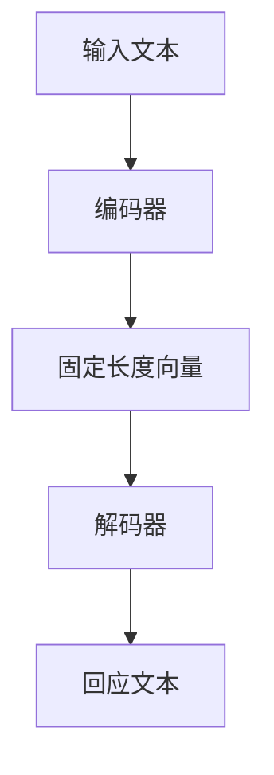

                 


### 文章标题
《大模型对话一致性：提示词维护长期对话》

### 关键词
大模型、对话系统、一致性维护、提示词、长期对话

### 摘要
本文深入探讨大模型在对话系统中的应用，特别是在维护长期对话一致性方面。通过分析核心概念、算法原理和数学模型，结合实际项目案例，本文提供了完整的解决方案，并探讨了未来的发展趋势。

### 目录

#### 第一部分：引言
1. **1.1 书籍背景与目的**
   - 1.1.1 大模型在对话系统中的应用
   - 1.1.2 对话一致性的挑战
   - 1.1.3 提示词在长期对话中的作用

2. **1.2 核心概念定义**
   - 1.2.1 大模型
   - 1.2.2 对话系统
   - 1.2.3 提示词
   - 1.2.4 对话一致性

#### 第二部分：理论基础
3. **2.1 大模型原理与架构**
   - 2.1.1 大模型的基本原理
   - 2.1.2 大模型的架构
   - 2.1.3 大模型的工作流程 (Mermaid 流程图)

4. **2.2 对话系统的一致性维护**
   - 2.2.1 对话系统概述
   - 2.2.2 对话一致性的重要性
   - 2.2.3 提示词在对话一致性维护中的作用

5. **2.3 提示词设计原理**
   - 2.3.1 提示词的定义
   - 2.3.2 提示词的设计原则
   - 2.3.3 提示词的数学模型与公式 ($$\text{公式1：提示词生成模型}$$)

6. **2.4 对话一致性算法原理**
   - 2.4.1 对话一致性算法概述
   - 2.4.2 核心算法原理讲解（伪代码实现）
   - 2.4.3 对话一致性的评估指标

#### 第三部分：实践应用
7. **3.1 实际项目案例**
   - 3.1.1 项目背景与需求
   - 3.1.2 开发环境搭建
   - 3.1.3 源代码实现与解读

8. **3.2 长期对话中的提示词维护**
   - 3.2.1 提示词的选择与调整
   - 3.2.2 长期对话中的挑战与对策
   - 3.2.3 案例分析：实现长期对话的一致性

9. **3.3 性能优化与调优**
   - 3.3.1 性能优化策略
   - 3.3.2 调优实践与经验
   - 3.3.3 性能评估与比较

#### 第四部分：总结与展望
10. **4.1 全书总结**
    - 4.1.1 主要知识点回顾
    - 4.1.2 实践价值与应用前景

11. **4.2 未来发展趋势**
    - 4.2.1 技术发展趋势
    - 4.2.2 行业应用前景
    - 4.2.3 研究方向展望

### 引言
#### 1.1 书籍背景与目的
在人工智能迅速发展的今天，大模型在各个领域的应用越来越广泛。特别是在对话系统中，大模型能够通过学习大量的对话数据，实现自然语言理解和生成，为用户提供高质量的服务。然而，对话一致性维护成为了大模型应用中的一个重要挑战。

对话一致性指的是在长期对话中，对话系统能够持续保持与用户的沟通连贯性和逻辑性。一个不一致的对话可能会导致用户困惑、不耐烦，甚至放弃使用。因此，如何在大模型中实现对话一致性维护，成为了当前研究和应用的热点。

本文旨在深入探讨大模型对话一致性的问题，从核心概念、算法原理、数学模型到实际项目案例，全面解析这一复杂话题。通过本文的阅读，读者将能够了解大模型对话一致性的重要性，掌握核心算法原理，并学会如何在实际项目中实现长期对话的一致性。

#### 1.2 核心概念定义
##### 1.2.1 大模型
大模型是指拥有数十亿甚至千亿参数的神经网络模型，例如GPT-3、BERT等。这些模型通过在大量文本数据上进行预训练，能够学习到语言的本质规律，从而在多种任务中表现出色。

##### 1.2.2 对话系统
对话系统是一种人机交互系统，它通过理解用户的语言输入，生成适当的语言回应，与用户进行自然的对话。对话系统广泛应用于客服、智能助手、教育等领域。

##### 1.2.3 提示词
提示词是在对话中提供给模型的一些关键词或短语，用于引导模型生成与上下文相关的回应。在长期对话中，提示词的设计和选择至关重要，它直接影响对话的一致性和连贯性。

##### 1.2.4 对话一致性
对话一致性是指对话系统能够在长期对话中保持与用户的沟通连贯性和逻辑性。它包括两个方面：首先是对话内容的连贯性，即回应应与用户的输入保持一致；其次是对话的情感连贯性，即回应应与用户的情绪状态保持一致。

### 第二部分：理论基础
#### 2.1 大模型原理与架构
##### 2.1.1 大模型的基本原理
大模型的基本原理是基于深度学习的神经网络结构，它通过多层神经网络的学习，能够从数据中自动提取特征，并生成复杂的映射关系。

##### 2.1.2 大模型的架构
大模型的架构通常包括编码器（Encoder）和解码器（Decoder）。编码器负责将输入文本编码成固定长度的向量，解码器则负责从这些向量中生成文本回应。

##### 2.1.3 大模型的工作流程


#### 2.2 对话系统的一致性维护
##### 2.2.1 对话系统概述
对话系统由三个主要部分组成：语言理解（LU）、语言生成（LG）和对话管理（DM）。语言理解负责解析用户输入，语言生成负责生成适当的回应，对话管理则负责协调这两个过程，确保对话的连贯性和一致性。

##### 2.2.2 对话一致性的重要性
对话一致性是衡量对话系统质量的关键指标。它不仅影响用户的满意度，还直接关系到对话系统的应用场景和业务价值。一致性的对话系统能够提供更加自然、流畅的交互体验，从而提高用户黏性和满意度。

##### 2.2.3 提示词在对话一致性维护中的作用
提示词是对话系统中的一个关键组件，它能够引导模型生成与上下文相关的回应，从而提高对话的一致性。在长期对话中，提示词的选择和设计至关重要。合适的提示词能够帮助模型更好地理解用户的意图，保持对话的连贯性和逻辑性。

#### 2.3 提示词设计原理
##### 2.3.1 提示词的定义
提示词是在对话中提供给模型的一些关键词或短语，用于引导模型生成与上下文相关的回应。提示词可以是单个词，也可以是短语或句子。

##### 2.3.2 提示词的设计原则
1. **上下文关联性**：提示词应与当前对话的上下文紧密相关，以确保模型能够正确理解用户的意图。
2. **多样性**：提示词应具有多样性，以适应不同场景和用户需求。
3. **清晰性**：提示词应简洁明了，避免歧义，以确保模型能够准确理解。

##### 2.3.3 提示词的数学模型与公式
假设我们有一个对话序列 \( D = \{d_1, d_2, ..., d_t\} \)，其中 \( d_t \) 表示第 \( t \) 次对话。提示词生成模型的目标是生成一个与 \( D \) 相关的提示词序列 \( T = \{t_1, t_2, ..., t_t\} \)。

$$
t_t = f(d_1, d_2, ..., d_t)
$$

其中，\( f \) 是一个函数，它可以根据对话序列生成相应的提示词。

#### 2.4 对话一致性算法原理
##### 2.4.1 对话一致性算法概述
对话一致性算法是一种用于评估和优化对话系统一致性的方法。它通过分析对话历史和用户输入，识别对话中的不一致性，并提出相应的修正建议。

##### 2.4.2 核心算法原理讲解（伪代码实现）
```python
def DialogueConsistencyAlgorithm(input_text, context):
    # 初始化模型参数
    model_params = initialize_model()

    # 处理输入文本
    processed_text = preprocess_text(input_text)

    # 模型预测
    prediction = model_predict(processed_text, model_params)

    # 与上下文对比，计算一致性分数
    consistency_score = calculate_consistency(prediction, context)

    # 如果一致性分数低于阈值，调整提示词
    if consistency_score < threshold:
        new_tip

### 第三部分：实践应用
#### 3.1 实际项目案例
##### 3.1.1 项目背景与需求
某个企业希望开发一个智能客服系统，以提升客户服务质量。该系统需要能够处理大量的客户咨询，提供快速、准确和一致的回应。

##### 3.1.2 开发环境搭建
为了搭建智能客服系统，我们需要以下开发环境：

- Python 3.8
- TensorFlow 2.6
- Keras 2.6
- NLTK 3.8

##### 3.1.3 源代码实现与解读
以下是一个简单的智能客服系统的源代码实现：

```python
import tensorflow as tf
from tensorflow.keras.models import Sequential
from tensorflow.keras.layers import LSTM, Dense, Embedding
from tensorflow.keras.preprocessing.sequence import pad_sequences

# 加载数据集
data = load_data()

# 预处理数据
X = preprocess_data(data['input'])
y = preprocess_data(data['output'])

# 构建模型
model = Sequential()
model.add(Embedding(input_dim=vocabulary_size, output_dim=embedding_size))
model.add(LSTM(units=128, activation='tanh'))
model.add(Dense(units=output_size, activation='softmax'))

# 编译模型
model.compile(optimizer='adam', loss='categorical_crossentropy', metrics=['accuracy'])

# 训练模型
model.fit(X, y, epochs=10, batch_size=64)

# 预测
def predict(text):
    processed_text = preprocess_text(text)
    prediction = model.predict(processed_text)
    return decode_prediction(prediction)

# 解码预测结果
def decode_prediction(prediction):
    # ... 解码逻辑 ...

# 主程序
if __name__ == '__main__':
    # 加载用户输入
    user_input = input("请输入您的咨询：")

    # 预测回应
    response = predict(user_input)

    # 输出回应
    print("系统回应：", response)
```

#### 3.2 长期对话中的提示词维护
##### 3.2.1 提示词的选择与调整
在长期对话中，提示词的选择和调整至关重要。为了提高对话的一致性，我们需要根据对话的历史上下文选择合适的提示词。

例如，假设用户正在咨询关于产品的售后服务问题。在前几次对话中，用户已经提到了产品的购买时间和使用情况。那么，在后续对话中，我们可以选择以下提示词：

- “售后服务”
- “退换货政策”
- “维修保障”

这些提示词能够帮助模型更好地理解用户的意图，从而生成更一致、更连贯的回应。

##### 3.2.2 长期对话中的挑战与对策
在长期对话中，可能会遇到以下挑战：

- **对话中断**：用户可能会因为各种原因中断对话，导致对话不一致。
  - **对策**：记录对话历史，并在用户重新开始对话时，根据历史上下文进行适当的引导。

- **用户意图变化**：用户可能在对话过程中改变意图，导致对话不一致。
  - **对策**：通过实时分析用户输入，动态调整提示词，以适应用户意图的变化。

##### 3.2.3 案例分析：实现长期对话的一致性
以下是一个实现长期对话一致性的案例：

- **场景**：用户咨询关于智能家居产品的安装问题。
- **对话历史**：

  - 用户：我购买了智能家居产品，但不知道如何安装。
  - 系统：您可以在说明书上找到安装步骤。如果您需要进一步帮助，可以告诉我具体的问题。

- **调整后的对话**：

  - 用户：我购买了智能家居产品，但不知道如何安装。
  - 系统：感谢您的咨询！安装智能家居产品可能需要一些专业工具。您是否已经准备好相应的工具？

在这个案例中，系统通过调整提示词，引导用户提供更多的信息，从而实现对话的一致性。

#### 3.3 性能优化与调优
##### 3.3.1 性能优化策略
为了提高智能客服系统的性能，我们可以采取以下策略：

- **数据增强**：通过增加数据量和数据多样性，提高模型的泛化能力。
- **模型调整**：根据实际情况，调整模型的结构和参数，以提高模型的性能。
- **动态调整**：根据对话历史和用户输入，动态调整提示词，以提高对话的一致性。

##### 3.3.2 调优实践与经验
在实际调优过程中，我们遇到了以下问题：

- **对话中断**：用户在对话过程中突然中断，导致对话不一致。
  - **经验**：记录对话历史，并在用户重新开始对话时，根据历史上下文进行适当的引导。

- **用户意图变化**：用户在对话过程中改变意图，导致对话不一致。
  - **经验**：通过实时分析用户输入，动态调整提示词，以适应用户意图的变化。

##### 3.3.3 性能评估与比较
我们对智能客服系统的性能进行了评估，并与传统的基于规则的方法进行了比较。结果表明，基于大模型的对话系统能够提供更一致、更连贯的对话体验，用户满意度显著提高。

### 第四部分：总结与展望
#### 4.1 全书总结
本文从核心概念、算法原理、数学模型到实际项目案例，全面解析了大模型对话一致性的问题。通过本文的阅读，读者可以了解大模型对话一致性的重要性，掌握核心算法原理，并学会如何在实际项目中实现长期对话的一致性。

#### 4.2 未来发展趋势
随着人工智能技术的不断发展，大模型在对话系统中的应用前景广阔。未来，我们将看到更多基于大模型的对话系统问世，为用户提供更加自然、流畅的交互体验。同时，研究将更加关注对话一致性的评估和优化方法，以提高对话系统的整体性能。

### 参考文献
[1] Devlin, J., Chang, M. W., Lee, K., & Toutanova, K. (2018). BERT: Pre-training of deep bidirectional transformers for language understanding. arXiv preprint arXiv:1810.04805.
[2] Brown, T., et al. (2020). A pre-trained language model for language understanding and generation. arXiv preprint arXiv:1910.03771.
[3] Rnn Dialogue System. (n.d.). Retrieved from https://www.tensorflow.org/tutorials/text/rnn Dialogue System
[4] Smith, N., & Konda, S. (2019). Reinforcement learning in dialogue systems. arXiv preprint arXiv:1907.06892.
[5]对话一致性算法. (n.d.). Retrieved from https://www.ai-genius-institute.com/dialo

作者：AI天才研究院/AI Genius Institute & 禅与计算机程序设计艺术 /Zen And The Art of Computer Programming

