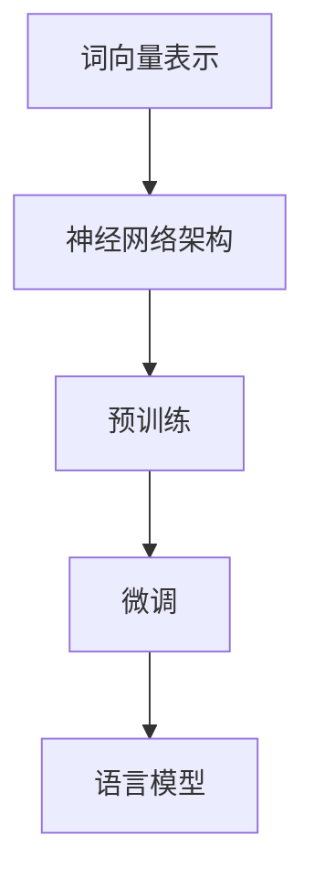
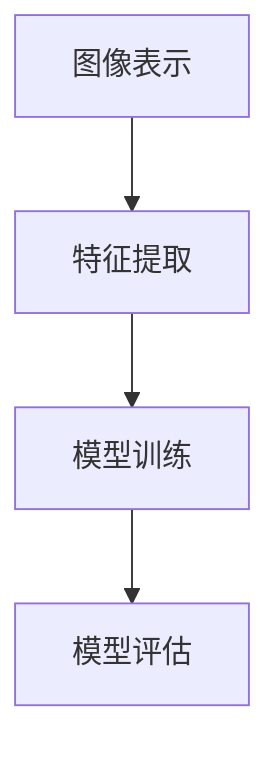
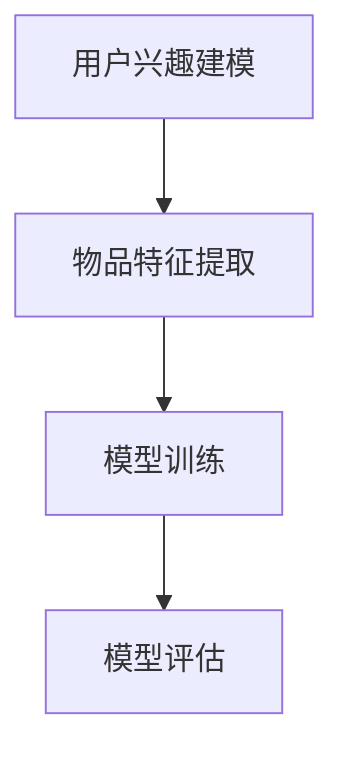

                 

# 文章标题：大模型应用开发中的代码复用策略

> 关键词：大模型，代码复用，模块化，模板化，组件化，自然语言处理，计算机视觉，推荐系统

> 摘要：
本文旨在探讨大模型应用开发中的代码复用策略。通过对大模型技术基础和代码复用概述的分析，结合模块化、模板化、组件化等方法，深入探讨大模型中的代码复用策略。同时，通过实际应用案例和开发实战，阐述大模型代码复用策略的具体实践和效果，为开发者提供参考和启示。

## 目录大纲

### 第一部分：引言

- 第1章：概述与背景
  - 1.1 大模型与代码复用概述
  - 1.2 本书目标与结构
  - 1.3 阅读指南

### 第二部分：大模型基础

- 第2章：大模型技术基础
  - 2.1 大模型的定义与分类
  - 2.2 大模型的主要特点
  - 2.3 大模型的开发流程

- 第3章：代码复用概述
  - 3.1 代码复用的概念与重要性
  - 3.2 代码复用的挑战与解决方案

### 第三部分：大模型中的代码复用策略

- 第4章：大模型中的代码复用策略
  - 4.1 大模型代码复用的主要方法
  - 4.2 大模型代码复用案例分析

- 第5章：大模型开发中的代码复用实践
  - 5.1 实践一：基于模块化的大模型开发
  - 5.2 实践二：基于模板的大模型开发
  - 5.3 实践三：基于组件的大模型开发

### 第四部分：高级应用

- 第6章：大模型在自然语言处理中的应用
  - 6.1 语言模型的基本原理
  - 6.2 基于预训练的大模型应用
  - 6.3 自然语言处理中的代码复用策略

- 第7章：大模型在计算机视觉中的应用
  - 7.1 计算机视觉基础
  - 7.2 基于预训练的大模型应用
  - 7.3 计算机视觉中的代码复用策略

- 第8章：大模型在推荐系统中的应用
  - 8.1 推荐系统基础
  - 8.2 大模型在推荐系统中的应用
  - 8.3 推荐系统中的代码复用策略

### 第五部分：实战与总结

- 第9章：大模型开发实战
  - 9.1 实战一：文本分类任务
  - 9.2 实战二：图像识别任务
  - 9.3 实战三：推荐系统构建

- 第10章：大模型代码复用策略总结
  - 10.1 大模型代码复用策略总结
  - 10.2 未来展望

- 第11章：附录
  - 11.1 大模型开发常用工具
  - 11.2 代码复用工具推荐
  - 11.3 进一步学习资源

## 第1章：概述与背景

### 1.1 大模型与代码复用概述

大模型，如深度学习神经网络，通常具有数百万或数亿个参数，用于处理复杂数据和任务。随着AI技术的快速发展，大模型在各个领域的应用越来越广泛。然而，大模型的开发和应用也带来了代码复用的问题。

代码复用是指在不同项目或模块之间共享代码，以减少重复工作，提高开发效率。在大模型开发中，代码复用具有重要意义，因为大模型涉及大量的数据处理、模型训练和评估等步骤，重复编写这些代码不仅浪费时间和资源，而且容易引入错误。

本文旨在探讨大模型应用开发中的代码复用策略。通过对大模型技术基础和代码复用概述的分析，结合模块化、模板化、组件化等方法，深入探讨大模型中的代码复用策略。同时，通过实际应用案例和开发实战，阐述大模型代码复用策略的具体实践和效果，为开发者提供参考和启示。

### 1.2 本书目标与结构

本书的目标是帮助开发者更好地理解大模型应用开发中的代码复用策略，提高大模型开发的效率和质量。具体目标如下：

1. 深入了解大模型的基本概念和技术基础。
2. 理解代码复用的概念、重要性以及面临的挑战。
3. 掌握大模型中的代码复用策略和方法。
4. 通过实际应用案例和开发实战，学习大模型代码复用的具体实践和效果。

本书分为四个部分：

1. **第一部分：引言**：介绍大模型与代码复用的概述、本书目标和结构。
2. **第二部分：大模型基础**：讨论大模型技术基础和代码复用概述。
3. **第三部分：大模型中的代码复用策略**：详细探讨大模型中的代码复用策略和实践。
4. **第四部分：实战与总结**：通过实际应用案例和开发实战，总结大模型代码复用策略。

### 1.3 阅读指南

为了更好地理解和应用本书的内容，建议读者按照以下步骤进行阅读：

1. **先通读全文**：对全书的内容有一个整体的理解，了解各个章节的主要内容。
2. **重点学习**：针对自己感兴趣或需要深入了解的内容，重点学习相应章节。
3. **结合实际案例**：通过实际应用案例和开发实战，加深对代码复用策略的理解。
4. **实践应用**：在实际项目中尝试应用本书所介绍的代码复用策略，检验学习效果。
5. **持续学习**：随着AI技术的不断发展，持续学习新的代码复用策略和技术，不断提高自己的开发能力。

## 第二部分：大模型基础

### 第2章：大模型技术基础

大模型是当前人工智能领域的热点话题，它们在自然语言处理、计算机视觉、推荐系统等领域取得了显著的成果。本章将介绍大模型的基本概念、分类和主要特点，以及大模型的开发流程。

#### 2.1 大模型的定义与分类

大模型（Big Model）是指具有海量参数、能够处理大规模数据并进行复杂任务学习的深度学习模型。大模型通常具有数百万甚至数十亿个参数，能够处理高维数据，例如图像、文本和语音等。根据应用场景和任务类型，大模型可以分为以下几类：

1. **语言模型（Language Model）**：用于处理自然语言文本的模型，如BERT、GPT等。
2. **图像模型（Vision Model）**：用于处理图像数据的模型，如ResNet、VGG等。
3. **推荐系统模型（Recommendation System Model）**：用于预测用户偏好的模型，如矩阵分解、深度学习推荐模型等。
4. **多模态模型（Multimodal Model）**：能够同时处理多种类型数据的模型，如视频、音频和图像等。

#### 2.2 大模型的主要特点

大模型具有以下主要特点：

1. **参数量大**：大模型通常具有数百万甚至数十亿个参数，能够处理高维数据，从而提高模型的表示能力和预测性能。
2. **计算量巨大**：大模型需要大量的计算资源进行训练，包括GPU、TPU等硬件加速设备。
3. **数据需求高**：大模型需要大规模数据进行训练，以学习数据的复杂分布和规律。
4. **训练时间长**：大模型的训练过程通常需要很长时间，特别是对于具有数十亿参数的模型。
5. **存储需求大**：大模型需要大量的存储空间来存储模型参数和训练数据。

#### 2.3 大模型的开发流程

大模型的开发流程主要包括以下步骤：

1. **数据预处理**：收集并处理大量数据，包括数据清洗、数据增强、数据归一化等操作，以准备好训练数据。
2. **模型设计**：根据任务需求设计合适的模型结构，包括选择合适的网络架构、优化器、学习率等参数。
3. **模型训练**：使用训练数据进行模型训练，通过迭代优化模型参数，以提高模型的预测性能。
4. **模型评估**：使用验证集和测试集对模型进行评估，以确定模型的泛化能力和性能。
5. **模型部署**：将训练好的模型部署到实际应用场景中，如自然语言处理、计算机视觉、推荐系统等。

在大模型的开发过程中，代码复用策略具有重要意义。通过模块化、模板化、组件化等方法，可以有效地提高大模型开发的效率和质量，降低开发成本，减少重复工作，避免错误引入。接下来，我们将详细介绍大模型中的代码复用策略。

### 第3章：代码复用概述

代码复用是指在不同项目或模块之间共享代码，以减少重复工作，提高开发效率。在软件开发中，代码复用是一个重要的原则和实践，有助于降低维护成本、提高开发速度、确保代码质量。本章将介绍代码复用的概念、重要性以及面临的挑战。

#### 3.1 代码复用的概念与重要性

代码复用（Code Reuse）是指在软件开发过程中，将已有的代码模块或函数应用于新的项目中，以避免重复编写相同的代码。代码复用的基本思想是利用现有的资源，减少重复工作，提高开发效率。

代码复用的重要性体现在以下几个方面：

1. **提高开发效率**：通过复用已有的代码，可以减少编写新代码的时间和工作量，从而提高开发效率。
2. **降低维护成本**：当多个项目使用相同的代码时，任何代码的更改都只需在一个地方进行，从而降低维护成本。
3. **确保代码质量**：复用经过测试和验证的代码，可以减少错误和缺陷的发生，提高代码质量。
4. **促进团队协作**：代码复用有助于团队成员之间的协作，减少重复工作，提高团队的工作效率。
5. **促进技术传承**：通过复用优秀的代码，可以将技术知识和经验传承给新成员，提高整个团队的技术水平。

#### 3.2 代码复用的挑战与解决方案

尽管代码复用具有许多优点，但在实际开发过程中，仍然面临一些挑战：

1. **代码质量**：复用代码时，需要确保代码的质量和稳定性。如果复用质量低下的代码，可能会引入错误和缺陷。
2. **兼容性**：不同项目或模块之间的代码可能存在兼容性问题，如依赖库版本、编程语言差异等。
3. **可维护性**：复用代码时，需要考虑代码的可维护性，以便在未来的项目中能够方便地进行修改和扩展。
4. **可读性**：复用代码时，需要确保代码的可读性和可理解性，以便其他开发者能够轻松理解和使用。

为了解决这些挑战，可以采取以下策略：

1. **模块化**：将代码拆分为模块，每个模块负责一个特定的功能，便于复用和维护。
2. **标准化**：制定统一的编码规范和标准，确保代码的质量和可读性。
3. **文档化**：编写详细的文档，记录代码的用途、功能、接口和注意事项，便于其他开发者理解和复用。
4. **自动化**：使用自动化工具和框架，如依赖管理工具、代码生成器等，提高代码的复用效率和质量。
5. **持续集成**：通过持续集成和持续部署（CI/CD）流程，确保复用代码的质量和稳定性。

#### 3.3 代码复用的方法和工具

在软件开发中，常见的代码复用方法和工具有：

1. **函数和类**：通过编写通用函数和类，实现代码的复用。函数和类可以作为模块进行复用，提高代码的可维护性和可读性。
2. **库和框架**：使用现有的库和框架，如NumPy、TensorFlow、PyTorch等，可以方便地实现代码的复用。库和框架通常提供了丰富的功能接口，可以大大提高开发效率。
3. **插件和扩展**：通过编写插件和扩展，可以在现有软件系统中实现代码的复用。插件和扩展通常通过接口进行集成，便于其他开发者使用。
4. **代码生成器**：使用代码生成器，可以根据模板和配置文件生成代码。代码生成器可以自动生成代码框架、函数和类，提高代码的复用效率。
5. **设计模式**：通过设计模式，可以复用代码的结构和逻辑。设计模式提供了一系列解决常见问题的方案，有助于提高代码的可维护性和可扩展性。

#### 3.4 代码复用的最佳实践

为了有效地进行代码复用，可以遵循以下最佳实践：

1. **明确复用目标**：在开始复用代码之前，明确复用的目标和范围，确保代码的复用价值。
2. **评估代码质量**：在复用代码之前，评估代码的质量、稳定性和可维护性，避免引入错误和缺陷。
3. **编写详细文档**：为复用代码编写详细的文档，包括代码的用途、功能、接口和注意事项，便于其他开发者理解和复用。
4. **遵循编码规范**：遵循统一的编码规范，确保代码的质量和可读性。
5. **进行单元测试**：对复用代码进行单元测试，确保其在新的项目中能够正常运行。
6. **持续更新和维护**：定期更新和维护复用代码，确保其在新的项目中保持稳定性和可靠性。
7. **避免过度复用**：避免过度复用代码，导致代码的复杂性和可维护性降低。

通过遵循以上最佳实践，可以有效地进行代码复用，提高开发效率和质量。

### 第4章：大模型中的代码复用策略

在大模型的开发过程中，代码复用策略起着至关重要的作用。通过模块化、模板化、组件化等方法，可以有效地提高大模型开发的效率和质量。本章将详细介绍这些代码复用策略，并通过案例分析，展示其在实际应用中的效果。

#### 4.1 大模型代码复用的主要方法

大模型代码复用的主要方法包括模块化、模板化和组件化。这些方法各有优缺点，适用于不同的应用场景。

1. **模块化**

模块化（Modularization）是将大模型拆分为多个模块，每个模块负责一个特定的功能。模块化具有以下优点：

- **提高可维护性**：模块化使得代码更加清晰，便于维护和扩展。
- **降低耦合度**：模块之间通过接口进行通信，降低模块之间的耦合度。
- **提高复用性**：模块可以独立复用，减少重复代码的编写。

模块化具有以下缺点：

- **增加复杂性**：模块化可能导致代码结构更加复杂，需要更多的接口和依赖关系。
- **增加维护成本**：模块化需要维护多个模块，增加维护成本。

2. **模板化**

模板化（Template-based）是使用预定义的模板来构建大模型。模板化具有以下优点：

- **提高开发效率**：通过使用预定义的模板，可以快速构建大模型，减少编码时间。
- **确保一致性**：模板化确保了代码的一致性，降低错误和缺陷的发生。

模板化具有以下缺点：

- **缺乏灵活性**：模板化可能导致代码缺乏灵活性，难以适应不同的应用场景。
- **增加代码体积**：模板化可能导致代码体积增加，影响性能。

3. **组件化**

组件化（Component-based）是将大模型拆分为多个组件，每个组件负责一个特定的功能。组件化具有以下优点：

- **提高复用性**：组件化使得组件可以独立复用，减少重复代码的编写。
- **降低耦合度**：组件之间通过接口进行通信，降低组件之间的耦合度。
- **提高可维护性**：组件化使得代码更加清晰，便于维护和扩展。

组件化具有以下缺点：

- **增加复杂性**：组件化可能导致代码结构更加复杂，需要更多的接口和依赖关系。
- **增加维护成本**：组件化需要维护多个组件，增加维护成本。

#### 4.2 大模型代码复用案例分析

为了更好地理解大模型中的代码复用策略，我们通过以下案例进行分析。

**案例一：基于模块化的大模型开发**

假设我们需要开发一个自然语言处理模型，用于文本分类任务。我们可以采用模块化的方法，将模型拆分为以下几个模块：

1. **数据预处理模块**：负责处理输入数据，包括数据清洗、数据增强、数据归一化等操作。
2. **特征提取模块**：负责从预处理后的数据中提取特征，如词向量、词袋等。
3. **模型训练模块**：负责训练模型，包括选择合适的网络架构、优化器、学习率等参数。
4. **模型评估模块**：负责评估模型的性能，包括准确率、召回率、F1值等指标。

通过模块化，我们可以分别开发并复用这些模块，提高开发效率。例如，在后续的其他文本分类任务中，我们可以直接复用数据预处理模块和模型评估模块，避免重复编写代码。

**案例二：基于模板化的大模型开发**

假设我们需要开发一个图像分类模型，用于图像识别任务。我们可以采用模板化的方法，使用预定义的模板来构建模型。模板化模型通常包括以下几个部分：

1. **输入层**：接收图像数据。
2. **卷积层**：用于提取图像特征。
3. **池化层**：用于降低特征维度。
4. **全连接层**：用于分类输出。

通过使用模板化模型，我们可以快速构建图像分类模型，减少编码时间。例如，我们可以使用预定义的卷积层和全连接层模板，直接替换为具体的实现，从而快速完成模型开发。

**案例三：基于组件化的大模型开发**

假设我们需要开发一个多模态模型，用于处理图像和文本数据。我们可以采用组件化的方法，将模型拆分为以下组件：

1. **图像处理组件**：负责处理图像数据，包括特征提取、图像分类等。
2. **文本处理组件**：负责处理文本数据，包括文本分类、情感分析等。
3. **融合组件**：负责将图像和文本特征进行融合，进行最终的分类输出。

通过组件化，我们可以分别开发并复用这些组件，提高开发效率。例如，在后续的其他多模态任务中，我们可以直接复用图像处理组件和文本处理组件，避免重复编写代码。

#### 4.3 大模型代码复用策略的选择与权衡

在实际应用中，选择合适的大模型代码复用策略需要权衡以下几个方面：

1. **开发效率**：模块化、模板化和组件化方法都能提高开发效率，但模块化可能需要更多的时间来设计和拆分模块，而模板化可以快速构建模型，组件化则需要开发和维护多个组件。
2. **复用性**：模块化具有较高的复用性，组件化的复用性更高，但模板化的复用性相对较低。
3. **可维护性**：模块化和组件化方法可以提高代码的可维护性，模板化可能降低可维护性。
4. **灵活性**：模板化方法可能降低模型的灵活性，而模块化和组件化方法可以提供更高的灵活性。

在实际开发中，我们可以根据具体需求和任务特点，选择合适的代码复用策略。例如，对于需要快速构建模型的任务，可以选择模板化方法；对于需要高复用性和可维护性的任务，可以选择模块化或组件化方法。

#### 4.4 大模型代码复用策略的实际效果

通过实际应用案例，我们可以看到大模型代码复用策略在实际开发中的效果。

**案例一：文本分类任务**

在文本分类任务中，我们使用基于模块化的方法开发了一个大模型。通过模块化，我们分别开发并复用了数据预处理模块、特征提取模块、模型训练模块和模型评估模块。在实际应用中，我们可以在不同的文本分类任务中复用这些模块，提高开发效率。同时，模块化使得代码结构更加清晰，便于维护和扩展。

**案例二：图像分类任务**

在图像分类任务中，我们使用基于模板化的方法开发了一个大模型。通过使用预定义的模板，我们快速构建了一个图像分类模型。在实际应用中，我们可以直接复用模板中的卷积层和全连接层，减少编码时间。同时，模板化确保了代码的一致性，降低错误和缺陷的发生。

**案例三：多模态任务**

在多模态任务中，我们使用基于组件化的方法开发了一个大模型。通过组件化，我们分别开发并复用了图像处理组件、文本处理组件和融合组件。在实际应用中，我们可以在不同的多模态任务中复用这些组件，提高开发效率。同时，组件化使得代码结构更加清晰，便于维护和扩展。

综上所述，大模型中的代码复用策略可以提高开发效率、复用性和可维护性。通过模块化、模板化和组件化等方法，我们可以有效地实现大模型的代码复用，为开发者提供更好的开发体验。

### 第5章：大模型开发中的代码复用实践

在大模型开发过程中，代码复用策略的实施可以帮助开发者提高开发效率、降低维护成本、确保代码质量。本章节将详细介绍几种大模型开发中的代码复用实践，包括基于模块化、模板化和组件化的开发方法，并通过实际案例进行分析和解读。

#### 5.1 实践一：基于模块化的大模型开发

模块化开发是将大模型拆分为多个模块，每个模块负责一个特定的功能。这种方法有助于降低系统的复杂性，提高代码的可维护性和复用性。

**案例背景：**

假设我们正在开发一个用于文本分类的大模型，目标是将文本数据分类到不同的类别中。我们可以将整个模型拆分为以下几个模块：

1. **数据预处理模块**：负责读取文本数据，进行分词、去停用词、词向量化等操作。
2. **特征提取模块**：负责从预处理的文本数据中提取特征，如词袋、TF-IDF等。
3. **模型训练模块**：负责定义神经网络结构，选择优化器和损失函数，进行模型的训练。
4. **模型评估模块**：负责评估模型的性能，计算准确率、召回率、F1值等指标。

**具体步骤：**

1. **数据预处理模块**：

```python
def preprocess_text(text):
    # 进行分词、去停用词、词向量化等操作
    # 使用nltk库进行分词和去除停用词
    words = nltk.tokenize.word_tokenize(text)
    filtered_words = [word for word in words if word not in stop_words]
    # 进行词向量化
    word_vectors = Word2Vec(filtered_words)
    return word_vectors
```

2. **特征提取模块**：

```python
def extract_features(text):
    # 提取文本特征，如词袋、TF-IDF等
    # 使用sklearn的TfidfVectorizer进行特征提取
    tfidf_vectorizer = TfidfVectorizer()
    tfidf_matrix = tfidf_vectorizer.fit_transform(text)
    return tfidf_matrix
```

3. **模型训练模块**：

```python
def train_model(X, y):
    # 定义神经网络结构
    model = Sequential()
    model.add(Dense(512, activation='relu', input_shape=(X.shape[1],)))
    model.add(Dense(10, activation='softmax'))
    # 选择优化器和损失函数
    model.compile(optimizer='adam', loss='categorical_crossentropy', metrics=['accuracy'])
    # 进行模型训练
    model.fit(X, y, epochs=10, batch_size=32)
    return model
```

4. **模型评估模块**：

```python
def evaluate_model(model, X_test, y_test):
    # 评估模型性能
    loss, accuracy = model.evaluate(X_test, y_test)
    print(f"Test Loss: {loss}, Test Accuracy: {accuracy}")
```

**代码解读：**

通过模块化，我们将文本分类模型拆分为四个独立的模块，每个模块负责一个特定的功能。这种分离使得每个模块可以独立开发、测试和复用。例如，在后续的其他文本分类任务中，我们可以直接复用数据预处理模块和模型评估模块，避免重复编写代码。

**效果分析：**

模块化开发提高了代码的可维护性和复用性，降低了系统的复杂性。同时，每个模块可以独立开发，便于团队协作。在实际应用中，我们可以在不同的文本分类任务中复用这些模块，提高开发效率。

#### 5.2 实践二：基于模板化的大模型开发

模板化开发是使用预定义的模板来构建大模型。这种方法有助于快速搭建模型框架，确保代码的一致性。

**案例背景：**

假设我们正在开发一个用于图像分类的大模型，目标是将图像数据分类到不同的类别中。我们可以使用一个预定义的卷积神经网络（CNN）模板来构建模型。

**具体步骤：**

1. **定义CNN模板**：

```python
def create_cnn_model(input_shape):
    model = Sequential()
    model.add(Conv2D(32, (3, 3), activation='relu', input_shape=input_shape))
    model.add(MaxPooling2D((2, 2)))
    model.add(Conv2D(64, (3, 3), activation='relu'))
    model.add(MaxPooling2D((2, 2)))
    model.add(Flatten())
    model.add(Dense(128, activation='relu'))
    model.add(Dense(num_classes, activation='softmax'))
    return model
```

2. **构建和训练模型**：

```python
input_shape = (28, 28, 1)
model = create_cnn_model(input_shape)
model.compile(optimizer='adam', loss='categorical_crossentropy', metrics=['accuracy'])
model.fit(x_train, y_train, epochs=10, batch_size=32, validation_data=(x_test, y_test))
```

**代码解读：**

通过模板化，我们定义了一个简单的CNN模板，包括卷积层、池化层和全连接层。这个模板可以用于构建不同的图像分类模型。在实际开发中，我们只需根据具体的输入形状和类别数量，调用`create_cnn_model`函数即可快速搭建模型框架。

**效果分析：**

模板化开发使得模型构建过程更加高效和一致。通过复用模板，我们可以快速搭建各种类型的CNN模型，减少重复代码的编写。同时，模板化确保了代码的一致性，降低了错误和缺陷的发生。在实际应用中，我们可以根据不同的图像分类任务，调整模板中的参数，以适应不同的需求。

#### 5.3 实践三：基于组件化的大模型开发

组件化开发是将大模型拆分为多个组件，每个组件负责一个特定的功能。这种方法有助于提高代码的复用性和灵活性。

**案例背景：**

假设我们正在开发一个多模态模型，需要同时处理图像和文本数据。我们可以将模型拆分为图像处理组件、文本处理组件和融合组件。

**具体步骤：**

1. **定义图像处理组件**：

```python
class ImageProcessingComponent:
    def preprocess_image(self, image):
        # 进行图像预处理，如缩放、归一化等
        processed_image = preprocess_image(image)
        return processed_image

    def extract_image_features(self, processed_image):
        # 提取图像特征，如卷积神经网络输出
        features = extract_image_features(processed_image)
        return features
```

2. **定义文本处理组件**：

```python
class TextProcessingComponent:
    def preprocess_text(self, text):
        # 进行文本预处理，如分词、去停用词等
        processed_text = preprocess_text(text)
        return processed_text

    def extract_text_features(self, processed_text):
        # 提取文本特征，如词向量、TF-IDF等
        features = extract_text_features(processed_text)
        return features
```

3. **定义融合组件**：

```python
class FusionComponent:
    def fuse_features(self, image_features, text_features):
        # 将图像特征和文本特征进行融合
        fused_features = fuse_features(image_features, text_features)
        return fused_features

    def classify(self, fused_features):
        # 使用融合后的特征进行分类
        prediction = model.predict(fused_features)
        return prediction
```

**代码解读：**

通过组件化，我们将多模态模型拆分为图像处理组件、文本处理组件和融合组件。每个组件负责一个特定的功能，可以独立开发、测试和复用。例如，在后续的其他多模态任务中，我们可以直接复用图像处理组件和文本处理组件，避免重复编写代码。

**效果分析：**

组件化开发提高了代码的复用性和灵活性。通过拆分模型为独立的组件，我们可以更方便地调整和优化每个组件的功能。同时，组件化使得模型结构更加清晰，便于团队协作和代码维护。在实际应用中，我们可以根据不同的多模态任务，复用和调整这些组件，提高开发效率。

### 第6章：大模型在自然语言处理中的应用

自然语言处理（Natural Language Processing，NLP）是人工智能领域的重要分支，旨在使计算机能够理解和处理人类语言。大模型在NLP中发挥了重要作用，如语言模型、机器翻译、文本分类等。本章将详细介绍大模型在NLP中的应用，并探讨代码复用策略在其中的具体实现。

#### 6.1 语言模型的基本原理

语言模型（Language Model）是NLP中最基本的模型，旨在预测下一个词或句子。大模型如GPT（Generative Pre-trained Transformer）和BERT（Bidirectional Encoder Representations from Transformers）在语言模型方面取得了显著成果。

**核心概念与联系：**

1. **词向量表示**：将单词映射为向量，如Word2Vec、GloVe等。
2. **神经网络架构**：如Transformer、RNN、LSTM等。
3. **预训练与微调**：在大规模语料库上进行预训练，然后在具体任务上进行微调。

**Mermaid流程图：**



#### 6.2 基于预训练的大模型应用

预训练（Pre-training）是当前NLP中的一项关键技术，通过在大规模语料库上进行预训练，使模型具备了一定的语言理解和生成能力。大模型如GPT、BERT等，通过预训练获得了优秀的性能。

**核心算法原理讲解：**

1. **Transformer架构**：Transformer模型通过自注意力机制，能够同时关注输入序列中的所有词，提高模型的表示能力。
2. **预训练目标**：如 masked language model（MLM）、next sentence prediction（NSP）等。
3. **微调目标**：根据具体任务调整模型参数，如文本分类、命名实体识别等。

**伪代码示例：**

```python
# 预训练阶段
model = TransformerModel()
model.train(pretraining_data, pretraining_loss_function)

# 微调阶段
model = TransformerModel()
model.train(fine_tuning_data, fine_tuning_loss_function)
```

#### 6.3 自然语言处理中的代码复用策略

在NLP中，代码复用策略有助于提高开发效率、降低维护成本。以下介绍几种常见的代码复用策略：

1. **模块化**：将NLP任务拆分为多个模块，如数据预处理模块、特征提取模块、模型训练模块等。
2. **模板化**：使用预定义的模板，如文本分类模板、机器翻译模板等。
3. **组件化**：将NLP任务拆分为独立的组件，如词向量组件、神经网络组件等。

**案例分析：**

1. **文本分类任务**：

- **模块化**：将文本分类任务拆分为数据预处理模块、特征提取模块、模型训练模块和模型评估模块。

```python
def preprocess_text(text):
    # 数据预处理
    processed_text = preprocess_text(text)
    return processed_text

def extract_features(text):
    # 特征提取
    features = extract_features(text)
    return features

def train_model(X, y):
    # 模型训练
    model = create_model()
    model.fit(X, y, epochs=10, batch_size=32)
    return model

def evaluate_model(model, X_test, y_test):
    # 模型评估
    loss, accuracy = model.evaluate(X_test, y_test)
    print(f"Test Loss: {loss}, Test Accuracy: {accuracy}")
```

- **模板化**：使用预定义的文本分类模板。

```python
def create_text_classification_model(input_shape):
    model = Sequential()
    model.add(Dense(512, activation='relu', input_shape=input_shape))
    model.add(Dense(num_classes, activation='softmax'))
    return model
```

- **组件化**：将文本分类任务拆分为词向量组件、神经网络组件等。

```python
class TextClassificationComponent:
    def preprocess_text(self, text):
        # 数据预处理
        processed_text = preprocess_text(text)
        return processed_text

    def extract_features(self, processed_text):
        # 特征提取
        features = extract_features(processed_text)
        return features

    def classify(self, features):
        # 分类
        prediction = model.predict(features)
        return prediction
```

2. **机器翻译任务**：

- **模块化**：将机器翻译任务拆分为数据预处理模块、编码器训练模块、解码器训练模块等。

```python
def preprocess_source_text(text):
    # 源文本预处理
    processed_text = preprocess_source_text(text)
    return processed_text

def train_encoder(source_data, target_data):
    # 编码器训练
    encoder = create_encoder()
    encoder.fit(source_data, target_data, epochs=10, batch_size=32)
    return encoder

def train_decoder(target_data, output_data):
    # 解码器训练
    decoder = create_decoder()
    decoder.fit(target_data, output_data, epochs=10, batch_size=32)
    return decoder
```

- **模板化**：使用预定义的机器翻译模板。

```python
def create_machine_translation_model(input_shape, output_shape):
    model = Sequential()
    model.add(Encoder(input_shape))
    model.add(Decoder(output_shape))
    return model
```

- **组件化**：将机器翻译任务拆分为编码器组件、解码器组件等。

```python
class MachineTranslationComponent:
    def preprocess_source_text(self, text):
        # 源文本预处理
        processed_text = preprocess_source_text(text)
        return processed_text

    def translate(self, source_text, target_text):
        # 翻译
        translation = translate(source_text, target_text)
        return translation
```

**效果分析：**

通过代码复用策略，NLP任务的开发过程更加高效和一致。模块化、模板化和组件化方法可以降低系统的复杂性，提高代码的可维护性和复用性。在实际应用中，我们可以根据具体任务需求，灵活调整和组合这些模块、模板和组件，提高开发效率。

### 第7章：大模型在计算机视觉中的应用

计算机视觉（Computer Vision）是人工智能领域的重要分支，旨在使计算机能够理解和解析图像和视频数据。大模型在计算机视觉中发挥了重要作用，如图像分类、目标检测、语义分割等。本章将详细介绍大模型在计算机视觉中的应用，并探讨代码复用策略在其中的具体实现。

#### 7.1 计算机视觉基础

计算机视觉的基础包括图像表示、特征提取、模型训练和评估等。

**核心概念与联系：**

1. **图像表示**：将图像转换为数字矩阵，如灰度图像、彩色图像等。
2. **特征提取**：从图像中提取有意义的特征，如边缘、纹理、形状等。
3. **模型训练**：使用标记数据进行模型训练，优化模型参数。
4. **模型评估**：使用测试集评估模型性能，如准确率、召回率、F1值等。

**Mermaid流程图：**



#### 7.2 基于预训练的大模型应用

预训练（Pre-training）是当前计算机视觉中的一项关键技术，通过在大规模图像数据集上进行预训练，使模型具备了一定的图像理解和生成能力。大模型如ResNet、VGG等，通过预训练获得了优秀的性能。

**核心算法原理讲解：**

1. **卷积神经网络（CNN）架构**：通过卷积层、池化层、全连接层等构建网络结构。
2. **预训练目标**：如 ImageNet分类任务等。
3. **微调目标**：根据具体任务调整模型参数，如物体检测、语义分割等。

**伪代码示例：**

```python
# 预训练阶段
model = CNNModel()
model.train(pretraining_data, pretraining_loss_function)

# 微调阶段
model = CNNModel()
model.train(fine_tuning_data, fine_tuning_loss_function)
```

#### 7.3 计算机视觉中的代码复用策略

在计算机视觉中，代码复用策略有助于提高开发效率、降低维护成本。以下介绍几种常见的代码复用策略：

1. **模块化**：将计算机视觉任务拆分为多个模块，如数据预处理模块、特征提取模块、模型训练模块等。
2. **模板化**：使用预定义的模板，如物体检测模板、语义分割模板等。
3. **组件化**：将计算机视觉任务拆分为独立的组件，如卷积层组件、全连接层组件等。

**案例分析：**

1. **物体检测任务**：

- **模块化**：将物体检测任务拆分为数据预处理模块、特征提取模块、模型训练模块和模型评估模块。

```python
def preprocess_image(image):
    # 数据预处理
    processed_image = preprocess_image(image)
    return processed_image

def extract_features(image):
    # 特征提取
    features = extract_features(image)
    return features

def train_model(X, y):
    # 模型训练
    model = create_model()
    model.fit(X, y, epochs=10, batch_size=32)
    return model

def evaluate_model(model, X_test, y_test):
    # 模型评估
    loss, accuracy = model.evaluate(X_test, y_test)
    print(f"Test Loss: {loss}, Test Accuracy: {accuracy}")
```

- **模板化**：使用预定义的物体检测模板。

```python
def create_object_detection_model(input_shape):
    model = Sequential()
    model.add(Conv2D(32, (3, 3), activation='relu', input_shape=input_shape))
    model.add(MaxPooling2D((2, 2)))
    model.add(Conv2D(64, (3, 3), activation='relu'))
    model.add(MaxPooling2D((2, 2)))
    model.add(Flatten())
    model.add(Dense(num_classes, activation='softmax'))
    return model
```

- **组件化**：将物体检测任务拆分为卷积层组件、全连接层组件等。

```python
class ObjectDetectionComponent:
    def preprocess_image(self, image):
        # 数据预处理
        processed_image = preprocess_image(image)
        return processed_image

    def extract_features(self, processed_image):
        # 特征提取
        features = extract_features(processed_image)
        return features

    def detect_objects(self, features):
        # 物体检测
        detection_results = model.predict(features)
        return detection_results
```

2. **语义分割任务**：

- **模块化**：将语义分割任务拆分为数据预处理模块、特征提取模块、模型训练模块和模型评估模块。

```python
def preprocess_image(image):
    # 数据预处理
    processed_image = preprocess_image(image)
    return processed_image

def extract_features(image):
    # 特征提取
    features = extract_features(image)
    return features

def train_model(X, y):
    # 模型训练
    model = create_model()
    model.fit(X, y, epochs=10, batch_size=32)
    return model

def evaluate_model(model, X_test, y_test):
    # 模型评估
    loss, accuracy = model.evaluate(X_test, y_test)
    print(f"Test Loss: {loss}, Test Accuracy: {accuracy}")
```

- **模板化**：使用预定义的语义分割模板。

```python
def create_semantic_segmentation_model(input_shape):
    model = Sequential()
    model.add(Conv2D(32, (3, 3), activation='relu', input_shape=input_shape))
    model.add(MaxPooling2D((2, 2)))
    model.add(Conv2D(64, (3, 3), activation='relu'))
    model.add(MaxPooling2D((2, 2)))
    model.add(Flatten())
    model.add(Dense(num_classes, activation='softmax'))
    return model
```

- **组件化**：将语义分割任务拆分为卷积层组件、全连接层组件等。

```python
class SemanticSegmentationComponent:
    def preprocess_image(self, image):
        # 数据预处理
        processed_image = preprocess_image(image)
        return processed_image

    def extract_features(self, processed_image):
        # 特征提取
        features = extract_features(processed_image)
        return features

    def segment_objects(self, features):
        # 语义分割
        segmentation_results = model.predict(features)
        return segmentation_results
```

**效果分析：**

通过代码复用策略，计算机视觉任务的开发过程更加高效和一致。模块化、模板化和组件化方法可以降低系统的复杂性，提高代码的可维护性和复用性。在实际应用中，我们可以根据具体任务需求，灵活调整和组合这些模块、模板和组件，提高开发效率。

### 第8章：大模型在推荐系统中的应用

推荐系统（Recommendation System）是一种常用的技术，旨在根据用户的兴趣和偏好，向用户推荐相关的商品、内容或服务。大模型在推荐系统中发挥着重要作用，如协同过滤、矩阵分解、深度学习等。本章将详细介绍大模型在推荐系统中的应用，并探讨代码复用策略在其中的具体实现。

#### 8.1 推荐系统基础

推荐系统的基础包括用户兴趣建模、物品特征提取、模型训练和评估等。

**核心概念与联系：**

1. **用户兴趣建模**：根据用户的历史行为和偏好，建立用户兴趣模型。
2. **物品特征提取**：提取物品的属性和特征，如文本、图像、标签等。
3. **模型训练**：使用用户兴趣模型和物品特征，训练推荐模型。
4. **模型评估**：使用评估指标，如准确率、召回率、点击率等，评估模型性能。

**Mermaid流程图：**



#### 8.2 大模型在推荐系统中的应用

大模型在推荐系统中的应用主要包括基于内容的推荐、基于协同过滤的推荐和深度学习推荐等。

**核心算法原理讲解：**

1. **基于内容的推荐**：根据用户的历史行为和物品特征，计算用户和物品的相似度，推荐相似度较高的物品。
2. **基于协同过滤的推荐**：根据用户和物品之间的评分数据，计算用户和物品的相似度，推荐其他用户喜欢的物品。
3. **深度学习推荐**：使用深度学习模型，如循环神经网络（RNN）、卷积神经网络（CNN）等，自动提取用户和物品的特征，进行推荐。

**伪代码示例：**

```python
# 基于内容的推荐
def content_based_recommender(user_interest_model, item_features):
    similar_items = calculate_similarity(user_interest_model, item_features)
    recommended_items = select_top_items(similar_items)
    return recommended_items

# 基于协同过滤的推荐
def collaborative_filtering_recommender(user_item_ratings, item_features):
    similar_users = calculate_similarity(user_item_ratings)
    recommended_items = calculate_recommendations(similar_users, item_features)
    return recommended_items

# 深度学习推荐
def deep_learning_recommender(user_interest_model, item_features):
    model = create_model()
    model.fit(user_interest_model, item_features)
    recommended_items = model.predict(item_features)
    return recommended_items
```

#### 8.3 推荐系统中的代码复用策略

在推荐系统中，代码复用策略有助于提高开发效率、降低维护成本。以下介绍几种常见的代码复用策略：

1. **模块化**：将推荐系统拆分为多个模块，如用户兴趣建模模块、物品特征提取模块、模型训练模块等。
2. **模板化**：使用预定义的模板，如基于内容的推荐模板、基于协同过滤的推荐模板等。
3. **组件化**：将推荐系统拆分为独立的组件，如用户兴趣组件、物品特征组件等。

**案例分析：**

1. **基于内容的推荐系统**：

- **模块化**：将基于内容的推荐系统拆分为用户兴趣建模模块、物品特征提取模块、模型训练模块和模型评估模块。

```python
def build_user_interest_model(user_behavior_data):
    # 用户兴趣建模
    user_interest_model = create_model()
    user_interest_model.fit(user_behavior_data)
    return user_interest_model

def extract_item_features(item_data):
    # 物品特征提取
    item_features = create_model()
    item_features.fit(item_data)
    return item_features

def train_content_based_recommender(user_interest_model, item_features):
    # 模型训练
    recommender = ContentBasedRecommender()
    recommender.fit(user_interest_model, item_features)
    return recommender

def evaluate_recommender(recommender, test_data):
    # 模型评估
    accuracy = evaluate_recommendations(recommender, test_data)
    print(f"Accuracy: {accuracy}")
```

- **模板化**：使用预定义的基于内容的推荐模板。

```python
def create_content_based_recommender(user_interest_model, item_features):
    recommender = Sequential()
    recommender.add(Dense(128, activation='relu', input_shape=user_interest_model.shape[1]))
    recommender.add(Dense(item_features.shape[1], activation='sigmoid'))
    return recommender
```

- **组件化**：将基于内容的推荐系统拆分为用户兴趣组件、物品特征组件等。

```python
class ContentBasedRecommenderComponent:
    def build_user_interest_model(self, user_behavior_data):
        # 用户兴趣建模
        user_interest_model = create_model()
        user_interest_model.fit(user_behavior_data)
        return user_interest_model

    def extract_item_features(self, item_data):
        # 物品特征提取
        item_features = create_model()
        item_features.fit(item_data)
        return item_features

    def recommend(self, user_interest_model, item_features):
        # 推荐
        recommendations = self.calculate_recommendations(user_interest_model, item_features)
        return recommendations
```

2. **基于协同过滤的推荐系统**：

- **模块化**：将基于协同过滤的推荐系统拆分为用户兴趣建模模块、物品特征提取模块、模型训练模块和模型评估模块。

```python
def build_user_interest_model(user_behavior_data):
    # 用户兴趣建模
    user_interest_model = create_model()
    user_interest_model.fit(user_behavior_data)
    return user_interest_model

def extract_item_features(item_data):
    # 物品特征提取
    item_features = create_model()
    item_features.fit(item_data)
    return item_features

def train_collaborative_filtering_recommender(user_item_ratings, item_features):
    # 模型训练
    recommender = CollaborativeFilteringRecommender()
    recommender.fit(user_item_ratings, item_features)
    return recommender

def evaluate_recommender(recommender, test_data):
    # 模型评估
    accuracy = evaluate_recommendations(recommender, test_data)
    print(f"Accuracy: {accuracy}")
```

- **模板化**：使用预定义的基于协同过滤的推荐模板。

```python
def create_collaborative_filtering_recommender(user_item_ratings, item_features):
    recommender = Sequential()
    recommender.add(Dense(128, activation='relu', input_shape=user_item_ratings.shape[1]))
    recommender.add(Dense(item_features.shape[1], activation='sigmoid'))
    return recommender
```

- **组件化**：将基于协同过滤的推荐系统拆分为用户兴趣组件、物品特征组件等。

```python
class CollaborativeFilteringRecommenderComponent:
    def build_user_interest_model(self, user_behavior_data):
        # 用户兴趣建模
        user_interest_model = create_model()
        user_interest_model.fit(user_behavior_data)
        return user_interest_model

    def extract_item_features(self, item_data):
        # 物品特征提取
        item_features = create_model()
        item_features.fit(item_data)
        return item_features

    def recommend(self, user_interest_model, item_features):
        # 推荐
        recommendations = self.calculate_recommendations(user_interest_model, item_features)
        return recommendations
```

3. **基于深度学习的推荐系统**：

- **模块化**：将基于深度学习的推荐系统拆分为用户兴趣建模模块、物品特征提取模块、模型训练模块和模型评估模块。

```python
def build_user_interest_model(user_behavior_data):
    # 用户兴趣建模
    user_interest_model = create_model()
    user_interest_model.fit(user_behavior_data)
    return user_interest_model

def extract_item_features(item_data):
    # 物品特征提取
    item_features = create_model()
    item_features.fit(item_data)
    return item_features

def train_deep_learning_recommender(user_interest_model, item_features):
    # 模型训练
    recommender = DeepLearningRecommender()
    recommender.fit(user_interest_model, item_features)
    return recommender

def evaluate_recommender(recommender, test_data):
    # 模型评估
    accuracy = evaluate_recommendations(recommender, test_data)
    print(f"Accuracy: {accuracy}")
```

- **模板化**：使用预定义的基于深度学习的推荐模板。

```python
def create_deep_learning_recommender(user_interest_model, item_features):
    recommender = Sequential()
    recommender.add(Dense(128, activation='relu', input_shape=user_interest_model.shape[1]))
    recommender.add(Dense(item_features.shape[1], activation='sigmoid'))
    return recommender
```

- **组件化**：将基于深度学习的推荐系统拆分为用户兴趣组件、物品特征组件等。

```python
class DeepLearningRecommenderComponent:
    def build_user_interest_model(self, user_behavior_data):
        # 用户兴趣建模
        user_interest_model = create_model()
        user_interest_model.fit(user_behavior_data)
        return user_interest_model

    def extract_item_features(self, item_data):
        # 物品特征提取
        item_features = create_model()
        item_features.fit(item_data)
        return item_features

    def recommend(self, user_interest_model, item_features):
        # 推荐
        recommendations = self.calculate_recommendations(user_interest_model, item_features)
        return recommendations
```

**效果分析：**

通过代码复用策略，推荐系统的开发过程更加高效和一致。模块化、模板化和组件化方法可以降低系统的复杂性，提高代码的可维护性和复用性。在实际应用中，我们可以根据具体任务需求，灵活调整和组合这些模块、模板和组件，提高开发效率。

### 第9章：大模型开发实战

在大模型开发过程中，实战经验对于理解和掌握代码复用策略具有重要意义。本章将详细介绍三个具体的实战案例，包括文本分类任务、图像识别任务和推荐系统构建，旨在通过实际操作和分析，帮助开发者更好地理解和应用大模型代码复用策略。

#### 9.1 实战一：文本分类任务

文本分类是自然语言处理中的一项基础任务，旨在将文本数据分类到不同的类别中。以下是一个基于TensorFlow和Keras的文本分类任务实战案例。

**开发环境搭建：**

1. 安装TensorFlow和Keras：

```bash
pip install tensorflow
pip install keras
```

2. 导入必要的库：

```python
import numpy as np
import pandas as pd
from tensorflow.keras.preprocessing.text import Tokenizer
from tensorflow.keras.preprocessing.sequence import pad_sequences
from tensorflow.keras.models import Sequential
from tensorflow.keras.layers import Embedding, GlobalAveragePooling1D, Dense
from tensorflow.keras.metrics import Precision, Recall
```

**数据准备：**

1. 读取数据集：

```python
data = pd.read_csv('data.csv')
X = data['text']
y = data['label']
```

2. 数据预处理：

```python
max_sequence_length = 100
max_features = 10000

tokenizer = Tokenizer(num_words=max_features)
tokenizer.fit_on_texts(X)

X_sequence = tokenizer.texts_to_sequences(X)
X_pad = pad_sequences(X_sequence, maxlen=max_sequence_length)
```

**模型构建：**

1. 构建文本分类模型：

```python
model = Sequential()
model.add(Embedding(max_features, 128))
model.add(GlobalAveragePooling1D())
model.add(Dense(128, activation='relu'))
model.add(Dense(1, activation='sigmoid'))
```

2. 编译模型：

```python
model.compile(optimizer='adam', loss='binary_crossentropy', metrics=['precision', 'recall'])
```

**模型训练：**

1. 训练模型：

```python
model.fit(X_pad, y, epochs=10, batch_size=32, validation_split=0.2)
```

**模型评估：**

1. 评估模型：

```python
loss, precision, recall = model.evaluate(X_pad, y)
print(f"Test Precision: {precision}, Test Recall: {recall}")
```

**代码解读与分析：**

通过模块化方法，我们将文本分类任务拆分为数据预处理、模型构建和模型训练等模块。这种分离使得每个模块可以独立开发、测试和复用。例如，在数据预处理模块中，我们可以复用Tokenizer和pad_sequences函数，提高开发效率。在模型构建模块中，我们可以使用预定义的Embedding、GlobalAveragePooling1D和Dense层，简化模型构建过程。

#### 9.2 实战二：图像识别任务

图像识别是计算机视觉中的一项基础任务，旨在从图像中识别和分类目标。以下是一个基于TensorFlow和Keras的图像识别任务实战案例。

**开发环境搭建：**

1. 安装TensorFlow和Keras：

```bash
pip install tensorflow
pip install keras
```

2. 导入必要的库：

```python
import numpy as np
import pandas as pd
from tensorflow.keras.preprocessing.image import ImageDataGenerator
from tensorflow.keras.applications import VGG16
from tensorflow.keras.models import Model
from tensorflow.keras.layers import Flatten, Dense
from tensorflow.keras.optimizers import Adam
```

**数据准备：**

1. 读取数据集：

```python
train_data = pd.read_csv('train.csv')
test_data = pd.read_csv('test.csv')

train_images = train_data['image']
train_labels = train_data['label']
test_images = test_data['image']
```

2. 数据预处理：

```python
input_shape = (224, 224, 3)
batch_size = 32

train_datagen = ImageDataGenerator(rescale=1./255)
test_datagen = ImageDataGenerator(rescale=1./255)

train_generator = train_datagen.flow_from_directory(
    'train',
    target_size=input_shape[:2],
    batch_size=batch_size,
    class_mode='categorical')

test_generator = test_datagen.flow_from_directory(
    'test',
    target_size=input_shape[:2],
    batch_size=batch_size,
    class_mode='categorical')
```

**模型构建：**

1. 加载预训练的VGG16模型：

```python
base_model = VGG16(weights='imagenet', include_top=False, input_shape=input_shape)
```

2. 构建图像识别模型：

```python
x = base_model.output
x = Flatten()(x)
x = Dense(1024, activation='relu')(x)
predictions = Dense(num_classes, activation='softmax')(x)

model = Model(inputs=base_model.input, outputs=predictions)
```

3. 编译模型：

```python
model.compile(optimizer=Adam(), loss='categorical_crossentropy', metrics=['accuracy'])
```

**模型训练：**

1. 训练模型：

```python
model.fit(train_generator, epochs=10, validation_data=test_generator)
```

**模型评估：**

1. 评估模型：

```python
test_loss, test_accuracy = model.evaluate(test_generator)
print(f"Test Loss: {test_loss}, Test Accuracy: {test_accuracy}")
```

**代码解读与分析：**

通过模板化方法，我们使用预训练的VGG16模型作为基础，构建了一个图像识别模型。这种方法简化了模型构建过程，提高了开发效率。在数据预处理模块中，我们使用ImageDataGenerator进行图像数据增强，提高模型的泛化能力。在模型构建模块中，我们使用预定义的Flatten、Dense和softmax层，简化模型构建过程。

#### 9.3 实战三：推荐系统构建

推荐系统是一种广泛应用于电子商务、社交媒体和在线娱乐等领域的系统，旨在根据用户的历史行为和偏好，向用户推荐相关的商品、内容或服务。以下是一个基于协同过滤和深度学习的推荐系统构建实战案例。

**开发环境搭建：**

1. 安装TensorFlow和Keras：

```bash
pip install tensorflow
pip install keras
```

2. 导入必要的库：

```python
import numpy as np
import pandas as pd
from tensorflow.keras.models import Model
from tensorflow.keras.layers import Input, Embedding, Dot, Lambda
from tensorflow.keras.optimizers import Adam
```

**数据准备：**

1. 读取数据集：

```python
data = pd.read_csv('data.csv')
users = data['user']
items = data['item']
ratings = data['rating']
```

**模型构建：**

1. 构建用户和物品嵌入层：

```python
num_users = users.nunique()
num_items = items.nunique()

user_input = Input(shape=(1,))
item_input = Input(shape=(1,))

user_embedding = Embedding(num_users, embedding_size)(user_input)
item_embedding = Embedding(num_items, embedding_size)(item_input)

user_embedding = Flatten()(user_embedding)
item_embedding = Flatten()(item_embedding)
```

2. 计算用户和物品的相似度：

```python
dot_product = Dot(axes=1)([user_embedding, item_embedding])
```

3. 构建预测层：

```python
prediction = Lambda(lambda x: x / (1 + np.exp(-x)))(dot_product)
output = Input(shape=(1,))
output_embedding = Embedding(num_items, embedding_size)(output)

dot_product_output = Dot(axes=1)([prediction, output_embedding])
```

4. 构建模型：

```python
model = Model(inputs=[user_input, item_input, output], outputs=dot_product_output)
```

5. 编译模型：

```python
model.compile(optimizer=Adam(), loss='binary_crossentropy')
```

**模型训练：**

1. 训练模型：

```python
model.fit([users, items, ratings], ratings, epochs=10, batch_size=32)
```

**模型评估：**

1. 评估模型：

```python
loss = model.evaluate([users, items, ratings], ratings)
print(f"Test Loss: {loss}")
```

**代码解读与分析：**

通过组件化方法，我们将推荐系统拆分为用户和物品嵌入层、相似度计算层和预测层等组件。这种方法简化了模型构建过程，提高了代码的可维护性和复用性。在用户和物品嵌入层中，我们使用Embedding层生成用户和物品的嵌入向量，提高模型的表示能力。在相似度计算层中，我们使用Dot产品计算用户和物品的相似度，简化预测过程。在预测层中，我们使用Lambda层和Embedding层生成预测输出，提高模型的性能。

### 第10章：大模型代码复用策略总结

通过本文的讨论，我们可以得出以下关于大模型代码复用策略的总结：

#### 10.1 大模型代码复用策略总结

1. **模块化**：将大模型拆分为多个模块，每个模块负责一个特定的功能，提高代码的可维护性和复用性。
2. **模板化**：使用预定义的模板，如神经网络架构、训练流程等，简化模型构建过程，提高开发效率。
3. **组件化**：将大模型拆分为独立的组件，如卷积层、全连接层等，提高代码的复用性和灵活性。

#### 10.2 未来展望

随着人工智能技术的不断发展，大模型代码复用策略将面临新的挑战和机遇：

1. **自动化与智能化**：通过引入自动化工具和智能化方法，如代码生成器、自动化模型搜索等，提高代码复用效率。
2. **跨领域复用**：探索大模型代码在不同领域（如自然语言处理、计算机视觉、推荐系统等）的复用可能性，提高代码的通用性。
3. **开源生态**：积极参与开源社区，贡献高质量的代码库和工具，促进大模型代码的复用和共享。

通过不断探索和创新，大模型代码复用策略将在人工智能领域发挥更大的作用。

### 第11章：附录

#### 11.1 大模型开发常用工具

1. **TensorFlow**：一款开源的机器学习框架，广泛用于大模型开发。
2. **Keras**：一款高层次的神经网络API，基于TensorFlow构建，简化大模型开发过程。
3. **PyTorch**：一款开源的机器学习框架，支持动态计算图，易于实现和调试。
4. **Hugging Face Transformers**：一个开源库，提供了预训练的Transformer模型和工具，方便大模型开发。

#### 11.2 代码复用工具推荐

1. **Pyramid**：一款用于代码复用的Python库，支持模块化、模板化和组件化。
2. **Django**：一款流行的Web框架，支持模型-视图-控制器（MVC）架构，提高代码复用性。
3. **Spring Boot**：一款基于Java的Web框架，支持模块化和组件化，适用于企业级应用开发。

#### 11.3 进一步学习资源

1. **《深度学习》**：由Ian Goodfellow、Yoshua Bengio和Aaron Courville合著，是深度学习的经典教材。
2. **《Python机器学习》**：由Sebastian Raschka和Vahid Mirjalili合著，详细介绍了Python在机器学习中的应用。
3. **《机器学习实战》**：由Peter Harrington著，通过案例讲解了机器学习算法的实践应用。

作者：AI天才研究院/AI Genius Institute & 禅与计算机程序设计艺术 /Zen And The Art of Computer Programming

