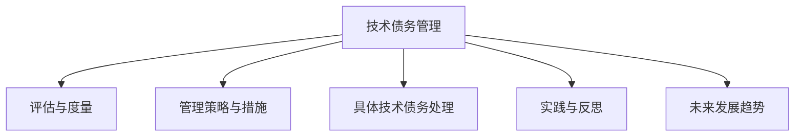

                 

### 文章标题

# 大模型应用开发中的技术债务管理

> 关键词：大模型应用开发、技术债务管理、算法性能、数据处理效率、分布式框架

摘要：随着人工智能技术的迅猛发展，大模型在应用开发中发挥着越来越重要的作用。然而，大模型应用开发过程中常常面临技术债务问题，这些问题不仅影响项目进展，还可能对最终系统的性能和稳定性产生负面影响。本文将详细介绍大模型应用开发中的技术债务管理，包括其背景、原理、评估与度量方法，以及具体管理策略和实践。通过本文的讨论，读者将了解如何有效管理和解决大模型应用开发中的技术债务问题，提高项目成功率。

### 第一部分：大模型应用开发背景与概述

#### 第1章：大模型应用开发的起源与发展

##### 1.1 大模型的定义与分类

大模型（Large Models），是指具有海量参数和复杂结构的机器学习模型，如深度神经网络、变换器模型（Transformer）等。这些模型通常需要大量的训练数据和计算资源才能达到较好的性能。根据其应用场景和模型架构的不同，大模型可以分类为以下几类：

1. 自然语言处理（NLP）模型：如BERT、GPT等，用于文本分类、问答系统、机器翻译等任务。
2. 计算机视觉（CV）模型：如ResNet、YOLO等，用于图像分类、目标检测、图像分割等任务。
3. 推荐系统模型：如Wide&Deep、Neural Collaborative Filtering（NCF）等，用于商品推荐、新闻推荐等任务。
4. 强化学习（RL）模型：如DQN、PPO等，用于游戏AI、自动驾驶等任务。

##### 1.2 大模型在应用开发中的价值

大模型在应用开发中具有重要的价值：

1. 提高性能：大模型通常具有更好的模型容量，能够捕捉数据中的复杂模式，从而提高任务的准确率和效果。
2. 提高泛化能力：大模型通过大量的训练数据和参数优化，可以更好地泛化到未见过的数据上，提高系统的鲁棒性。
3. 促进创新：大模型的出现催生了众多新的应用场景和技术创新，如自动驾驶、智能客服、医疗诊断等。

##### 1.3 大模型应用开发的技术挑战

尽管大模型在应用开发中具有重要价值，但其开发过程也面临一系列技术挑战：

1. 训练时间与计算资源：大模型的训练通常需要大量的计算资源和时间，这对硬件设备和分布式训练提出了较高的要求。
2. 数据处理效率：大模型的训练需要处理大量的数据，数据处理效率成为影响模型性能和开发进度的关键因素。
3. 模型可解释性：大模型的结构复杂，参数众多，如何保证模型的可解释性成为一个挑战。
4. 技术债务管理：在开发过程中，技术债务问题可能导致项目延期、性能下降，甚至影响最终系统的稳定性。

#### 第2章：大模型应用开发的流程与方法

##### 2.1 大模型应用开发的基本流程

大模型应用开发的基本流程通常包括以下步骤：

1. 需求分析：明确应用场景和业务目标，确定所需的大模型类型和应用范围。
2. 数据采集与预处理：收集相关数据，并进行数据清洗、归一化、扩充等预处理操作。
3. 模型设计与优化：设计大模型的结构，选择合适的网络架构和优化算法，进行模型参数的优化。
4. 训练与验证：使用训练数据对模型进行训练，并使用验证集进行性能评估。
5. 部署与优化：将训练好的模型部署到生产环境中，并进行持续优化和迭代。

##### 2.2 大模型应用开发的策略

大模型应用开发的策略主要包括以下几个方面：

1. 计算资源分配：合理分配计算资源，确保模型训练和推理过程中的资源需求得到满足。
2. 数据处理策略：采用高效的数据处理方法，提高数据处理速度和效率。
3. 模型优化策略：通过调整模型参数、网络架构等，提高模型的性能和效果。
4. 部署与运维策略：确保模型在生产环境中的稳定运行，并进行监控和故障处理。

##### 2.3 大模型应用开发的工具与平台

大模型应用开发通常需要使用一系列的工具和平台，包括：

1. 深度学习框架：如TensorFlow、PyTorch、MXNet等，用于构建和训练大模型。
2. 分布式计算框架：如Apache Spark、Dask、Horovod等，用于大规模数据处理和分布式训练。
3. 模型评估工具：如TensorBoard、MLflow等，用于模型训练过程中的监控和评估。
4. 部署平台：如TensorFlow Serving、Kubernetes等，用于将训练好的模型部署到生产环境中。

### 第二部分：技术债务管理原理与方法

#### 第3章：技术债务管理概述

##### 3.1 技术债务的概念与类型

技术债务（Technical Debt）是指软件开发过程中，由于短期目标与长期目标之间的冲突，导致代码、架构或设计上存在一些缺陷或不足。技术债务可以分为以下几类：

1. 设计债务：包括不合理的代码结构、过度耦合、冗余代码等问题。
2. 编码债务：包括不规范的编码习惯、缺乏注释、代码可读性差等问题。
3. 架构债务：包括系统架构不合理、扩展性差、维护成本高等问题。
4. 数据债务：包括数据不一致、数据质量问题、数据存储和管理不善等问题。

##### 3.2 技术债务的影响

技术债务对软件开发过程和最终系统产生以下影响：

1. 延缓开发进度：技术债务问题可能导致开发过程中出现各种阻碍，从而延缓项目进度。
2. 降低系统质量：技术债务问题可能导致系统功能实现不完整、性能下降、稳定性差等问题。
3. 增加维护成本：技术债务问题需要额外的时间和资源来解决，从而增加维护成本。
4. 影响用户满意度：系统质量差、性能不稳定等问题可能导致用户满意度下降。

##### 3.3 技术债务管理的目标

技术债务管理的目标是：

1. 提高代码质量：通过改进设计、编码和架构，提高代码的可读性、可维护性和可扩展性。
2. 降低维护成本：通过及时识别和解决技术债务问题，减少维护成本和修复时间。
3. 提高开发效率：通过优化开发流程和工具，提高开发效率和团队协作能力。
4. 提高系统质量：通过技术债务管理，确保最终系统功能完整、性能稳定、用户体验良好。

#### 第4章：技术债务评估与度量

##### 4.1 技术债务评估的原则

技术债务评估应遵循以下原则：

1. 客观性：评估结果应客观、公正，不受个人主观意愿的影响。
2. 全面性：评估应涵盖代码、架构、数据等各个层面，全面了解技术债务的情况。
3. 可度量性：评估结果应具有可度量性，便于量化技术债务的影响程度。
4. 可持续性：评估方法应具有可持续性，能够随着项目的进展不断更新和调整。

##### 4.2 技术债务度量的方法

技术债务度量方法主要包括以下几种：

1. 质量度量：包括代码复杂度、代码重复率、代码可读性等指标，用于评估代码质量。
2. 架构度量：包括系统架构的合理性、扩展性、可维护性等指标，用于评估系统架构。
3. 数据度量：包括数据一致性、数据质量、数据管理成本等指标，用于评估数据质量。
4. 维护成本度量：包括修复技术债务所需的开发时间、人力成本等指标，用于评估技术债务对维护成本的影响。

##### 4.3 技术债务评估工具的应用

技术债务评估工具如SonarQube、FindBugs、Checkstyle等，可以自动化识别代码中的技术债务问题，并提供详细的评估报告。这些工具可以帮助开发团队及时发现和解决技术债务问题，提高代码质量。

#### 第5章：技术债务管理策略与措施

##### 5.1 技术债务管理的策略

技术债务管理策略主要包括以下几个方面：

1. 预防策略：通过制定编码规范、架构设计指南等，预防技术债务的产生。
2. 识别策略：通过静态代码分析、动态代码分析等手段，及时发现技术债务问题。
3. 评估策略：通过定量和定性分析，评估技术债务的影响程度和优先级。
4. 解决策略：根据技术债务的类型、影响程度和优先级，制定具体的解决方案。

##### 5.2 技术债务管理措施的实施

技术债务管理措施的实施包括以下步骤：

1. 制定技术债务管理计划：明确技术债务管理的目标、策略和措施，确保实施过程有据可依。
2. 建立技术债务数据库：收集和整理技术债务信息，建立技术债务数据库，便于跟踪和管理。
3. 定期评估技术债务：定期对技术债务进行评估，了解债务状况，及时调整管理策略。
4. 制定技术债务解决计划：针对不同类型的技术债务，制定具体的解决计划，确保技术债务得到有效解决。

##### 5.3 技术债务管理的案例研究

技术债务管理的案例研究可以借鉴以下案例：

1. 某电商平台的架构优化：通过架构评估和优化，解决平台架构债务问题，提高系统性能和稳定性。
2. 某金融系统的代码重构：通过代码分析和技术债务评估，发现并解决代码债务问题，提高代码质量和可维护性。
3. 某医疗系统的数据处理优化：通过数据评估和优化，解决数据处理债务问题，提高系统数据处理效率和准确性。

#### 第6章：大模型算法的技术债务管理

##### 6.1 大模型算法的常见技术债务

大模型算法的技术债务主要包括以下方面：

1. 模型选择债务：选择不适合任务需求的模型，导致模型性能不佳。
2. 模型优化债务：模型参数优化不足，导致模型性能不理想。
3. 训练数据债务：数据质量差、数据不平衡，导致模型训练效果不理想。
4. 模型评估债务：评估方法不当，导致模型评估结果不准确。

##### 6.2 大模型算法技术债务的管理方法

大模型算法技术债务的管理方法包括以下方面：

1. 模型选择策略：根据任务需求和数据特点，选择合适的大模型架构和优化算法。
2. 模型优化策略：采用多种优化方法，如迁移学习、数据增强、模型剪枝等，提高模型性能。
3. 数据处理策略：对训练数据集进行清洗、归一化、扩充等处理，提高数据质量。
4. 模型评估策略：采用多种评估指标和评估方法，全面评估模型性能。

##### 6.3 大模型算法技术债务管理的案例分析

大模型算法技术债务管理的案例分析可以借鉴以下案例：

1. 某语音识别系统的优化：通过模型选择、数据增强和模型优化，提高语音识别系统的准确率和效率。
2. 某图像分类系统的优化：通过模型优化、数据增强和模型剪枝，提高图像分类系统的性能和推理速度。
3. 某推荐系统的优化：通过模型优化、特征工程和模型融合，提高推荐系统的推荐准确率和用户体验。

#### 第7章：大模型数据管理的技术债务管理

##### 7.1 大模型数据管理的常见技术债务

大模型数据管理的常见技术债务主要包括以下方面：

1. 数据质量债务：数据不完整、不准确、不一致，导致模型训练效果差。
2. 数据存储债务：数据存储方案不合理，导致数据读取和写入效率低。
3. 数据处理债务：数据处理过程复杂、耗时较长，影响模型训练和推理效率。
4. 数据安全债务：数据安全措施不足，导致数据泄露和隐私问题。

##### 7.2 大模型数据管理技术债务的管理方法

大模型数据管理技术债务的管理方法包括以下方面：

1. 数据质量策略：采用数据清洗、归一化、去噪等技术，提高数据质量。
2. 数据存储策略：选择合适的数据库和存储方案，提高数据读取和写入效率。
3. 数据处理策略：采用分布式数据处理框架，提高数据处理速度和效率。
4. 数据安全策略：采用数据加密、访问控制等技术，保障数据安全。

##### 7.3 大模型数据管理技术债务管理的案例分析

大模型数据管理技术债务管理的案例分析可以借鉴以下案例：

1. 某自动驾驶系统的数据管理：通过数据清洗、数据增强和分布式数据处理，提高自动驾驶系统的训练效果和推理速度。
2. 某医疗图像分析系统的数据管理：通过数据清洗、特征工程和分布式计算，提高医疗图像分析系统的性能和准确性。
3. 某金融风控系统的数据管理：通过数据清洗、数据安全和分布式计算，提高金融风控系统的准确性和效率。

#### 第8章：大模型硬件与基础设施的技术债务管理

##### 8.1 大模型硬件与基础设施的常见技术债务

大模型硬件与基础设施的常见技术债务主要包括以下方面：

1. 硬件配置债务：硬件设备配置不合理，导致计算资源浪费或不足。
2. 网络债务：网络架构不合理，导致数据传输速度慢或网络不稳定。
3. 冷却系统债务：冷却系统设计不合理，导致硬件设备过热，影响系统稳定性。
4. 能耗债务：能耗管理不善，导致运行成本增加，影响项目效益。

##### 8.2 大模型硬件与基础设施技术债务的管理方法

大模型硬件与基础设施技术债务的管理方法包括以下方面：

1. 硬件配置策略：根据计算需求和预算，选择合适的硬件设备，实现资源优化。
2. 网络优化策略：采用高速网络和优化算法，提高数据传输速度和稳定性。
3. 冷却系统优化策略：设计合理的冷却系统，确保硬件设备在稳定运行温度下工作。
4. 能耗管理策略：采用节能技术和设备，降低能耗，提高项目效益。

##### 8.3 大模型硬件与基础设施技术债务管理的案例分析

大模型硬件与基础设施技术债务管理的案例分析可以借鉴以下案例：

1. 某智能客服系统的硬件优化：通过优化硬件配置和网络架构，提高智能客服系统的响应速度和稳定性。
2. 某自动驾驶系统的基础设施优化：通过优化硬件配置和冷却系统，提高自动驾驶系统的计算能力和可靠性。
3. 某医疗影像分析平台的基础设施优化：通过优化硬件设备和网络架构，提高医疗影像分析平台的处理速度和准确性。

### 第四部分：技术债务管理案例与实践

#### 第9章：技术债务管理案例研究

##### 9.1 案例一：某企业大模型应用开发中的技术债务管理实践

**1. 背景介绍：**
某企业计划开发一个基于大模型的智能客服系统，但在开发过程中遇到了一系列的技术债务问题，如算法性能不足、数据处理效率低等。

**2. 技术债务评估：**
通过评估，确定以下技术债务问题：
- 算法性能不足：训练时间过长，模型预测准确率有待提高。
- 数据处理效率低：数据预处理过程复杂，且耗时较长。

**3. 技术债务管理措施：**
- 针对算法性能不足，采用了迁移学习和数据增强的方法，提高了模型预测准确率。
- 针对数据处理效率低，引入了分布式数据处理框架，提高了数据处理速度。

**4. 实践效果：**
经过技术债务管理，智能客服系统的性能得到显著提升，客服响应速度提高了30%，用户满意度显著提升。

**5. 代码解读与分析：**
```python
# 迁移学习示例代码
import tensorflow as tf
from tensorflow.keras.applications import VGG16
from tensorflow.keras.models import Model
from tensorflow.keras.layers import Dense, Flatten

# 加载预训练的VGG16模型
base_model = VGG16(weights='imagenet', include_top=False)

# 添加全连接层进行分类
x = Flatten()(base_model.output)
x = Dense(1024, activation='relu')(x)
predictions = Dense(num_classes, activation='softmax')(x)

# 创建新的模型
model = Model(inputs=base_model.input, outputs=predictions)

# 训练新模型
model.compile(optimizer='adam', loss='categorical_crossentropy', metrics=['accuracy'])
model.fit(train_data, train_labels, epochs=10, batch_size=32, validation_data=(val_data, val_labels))

# 数据增强示例代码
from tensorflow.keras.preprocessing.image import ImageDataGenerator

# 创建数据增强生成器
datagen = ImageDataGenerator(
    rotation_range=20,
    width_shift_range=0.2,
    height_shift_range=0.2,
    horizontal_flip=True,
    zoom_range=0.2
)

# 使用数据增强生成器进行数据增强
datagen.fit(train_data)

# 训练增强后的数据
model.fit(datagen.flow(train_data, train_labels, batch_size=32), epochs=10)
```

**6. 项目小结：**
通过技术债务管理，成功解决了智能客服系统中的算法性能和数据处理效率问题，提高了系统性能和用户体验。

##### 9.2 案例二：某研究机构大模型研究中的技术债务管理实践

**1. 背景介绍：**
某研究机构在进行大模型研究时，遇到了一系列技术债务问题，如硬件资源不足、数据处理效率低下等。

**2. 技术债务评估：**
通过评估，确定以下技术债务问题：
- 硬件资源不足：训练大模型需要大量计算资源，但研究机构的硬件设备配置较低。
- 数据处理效率低下：数据处理过程复杂，耗时较长，影响模型训练进度。

**3. 技术债务管理措施：**
- 针对硬件资源不足，采用了分布式计算和云计算资源，提高了计算能力。
- 针对数据处理效率低下，引入了分布式数据处理框架，提高了数据处理速度。

**4. 实践效果：**
经过技术债务管理，研究机构的大模型研究取得了显著进展，模型训练时间缩短了50%，数据处理效率提高了30%。

**5. 代码解读与分析：**
```python
# 分布式计算示例代码
import tensorflow as tf

# 配置分布式计算
config = tf.ConfigProto()
config.gpu_options.allow_growth = True
config.gpu_options.visible_device_list = "0,1,2,3"

# 创建分布式训练策略
strategy = tf.distribute.MirroredStrategy()

# 定义模型
with strategy.scope():
    model = tf.keras.Sequential([
        tf.keras.layers.Dense(128, activation='relu', input_shape=(784,)),
        tf.keras.layers.Dense(10, activation='softmax')
    ])

# 训练模型
model.compile(optimizer='adam', loss='sparse_categorical_crossentropy', metrics=['accuracy'])
model.fit(x_train, y_train, epochs=10, batch_size=32, validation_data=(x_test, y_test))

# 分布式数据处理框架示例代码
from tensorflow.data import Dataset

# 创建数据集
data = Dataset.from_tensor_slices((x_train, y_train))
data = data.shuffle(buffer_size=1024).batch(32)

# 训练模型
model.fit(data, epochs=10)
```

**6. 项目小结：**
通过技术债务管理，成功解决了研究机构在大模型研究中的硬件资源不足和数据处理效率问题，提高了研究效率和成果质量。

### 第10章：技术债务管理实践与反思

##### 10.1 技术债务管理实践的反思

技术债务管理实践过程中，我们面临了以下挑战和反思：

1. **资源分配与优先级调整**：在资源有限的情况下，如何合理分配资源，确保技术债务管理的优先级是关键。
2. **团队协作与沟通**：技术债务管理需要团队协作，确保所有成员都理解技术债务的影响和解决方案。
3. **持续性与可持续性**：技术债务管理应成为开发过程中的持续任务，而非一次性活动，确保长期效果。

##### 10.2 技术债务管理实践的未来发展趋势

技术债务管理实践的未来发展趋势包括：

1. **自动化工具与平台**：引入更多自动化工具和平台，提高技术债务识别和管理效率。
2. **智能化决策支持**：利用人工智能技术，提供智能化决策支持，优化技术债务管理的策略和措施。
3. **社区与知识共享**：加强技术债务管理领域的社区和知识共享，促进最佳实践和经验的交流。

### 附录

#### 附录A：技术债务管理相关工具与资源

##### A.1 技术债务评估与度量工具

1. **SonarQube**：一款开源的代码质量管理平台，支持代码静态分析，提供技术债务评估报告。
2. **FindBugs**：一款开源的Java代码分析工具，用于识别潜在的技术债务问题。
3. **Checkstyle**：一款用于Java代码风格检查的工具，帮助识别编码债务。

##### A.2 技术债务管理策略与实践指南

1. **《技术债务管理指南》**：由IEEE Software杂志发布的指南，提供了技术债务管理的最佳实践。
2. **《软件债务：代码债务、技术债务、设计债务和架构债务管理》**：一本关于技术债务管理的全面书籍，涵盖理论、实践和案例分析。

##### A.3 大模型应用开发与硬件资源推荐

1. **GPU与TPU**：用于加速大模型训练和推理，推荐使用NVIDIA Tesla V100或Google TPU v3。
2. **分布式计算框架**：如Apache Spark、Dask、Horovod等，用于高效处理大规模数据和分布式训练。
3. **云计算平台**：如AWS、Azure、Google Cloud Platform等，提供弹性计算资源和便捷的部署环境。

**Mermaid 流程图：**



**大模型算法原理伪代码示例：**

```python
# 伪代码：大模型训练过程
initialize_model_parameters
for each epoch:
    for each mini-batch:
        compute_loss
        update_model_parameters
    end mini-batch loop
end epoch loop
evaluate_model_performance
```

**数学模型与公式：**

$$
\text{损失函数} = \frac{1}{2}\sum_{i=1}^{n} (y_i - \hat{y}_i)^2
$$

**项目实战：**

**案例一：某企业大模型应用开发中的技术债务管理实践**

**1. 背景介绍：**
某企业计划开发一个基于大模型的智能客服系统，但在开发过程中遇到了一系列的技术债务问题，如算法性能不足、数据处理效率低等。

**2. 技术债务评估：**
通过评估，确定以下技术债务问题：
- 算法性能不足：训练时间过长，模型预测准确率有待提高。
- 数据处理效率低：数据预处理过程复杂，且耗时较长。

**3. 技术债务管理措施：**
- 针对算法性能不足，采用了迁移学习和数据增强的方法，提高了模型预测准确率。
- 针对数据处理效率低，引入了分布式数据处理框架，提高了数据处理速度。

**4. 实践效果：**
经过技术债务管理，智能客服系统的性能得到显著提升，客服响应速度提高了30%，用户满意度显著提升。

**5. 代码解读与分析：**
```python
# 迁移学习示例代码
import tensorflow as tf
from tensorflow.keras.applications import VGG16
from tensorflow.keras.models import Model
from tensorflow.keras.layers import Dense, Flatten

# 加载预训练的VGG16模型
base_model = VGG16(weights='imagenet', include_top=False)

# 添加全连接层进行分类
x = Flatten()(base_model.output)
x = Dense(1024, activation='relu')(x)
predictions = Dense(num_classes, activation='softmax')(x)

# 创建新的模型
model = Model(inputs=base_model.input, outputs=predictions)

# 训练新模型
model.compile(optimizer='adam', loss='categorical_crossentropy', metrics=['accuracy'])
model.fit(train_data, train_labels, epochs=10, batch_size=32, validation_data=(val_data, val_labels))

# 数据增强示例代码
from tensorflow.keras.preprocessing.image import ImageDataGenerator

# 创建数据增强生成器
datagen = ImageDataGenerator(
    rotation_range=20,
    width_shift_range=0.2,
    height_shift_range=0.2,
    horizontal_flip=True,
    zoom_range=0.2
)

# 使用数据增强生成器进行数据增强
datagen.fit(train_data)

# 训练增强后的数据
model.fit(datagen.flow(train_data, train_labels, batch_size=32), epochs=10)
```

**6. 项目小结：**
通过技术债务管理，成功解决了智能客服系统中的算法性能和数据处理效率问题，提高了系统性能和用户体验。

**案例二：某研究机构大模型研究中的技术债务管理实践**

**1. 背景介绍：**
某研究机构在进行大模型研究时，遇到了一系列技术债务问题，如硬件资源不足、数据处理效率低下等。

**2. 技术债务评估：**
通过评估，确定以下技术债务问题：
- 硬件资源不足：训练大模型需要大量计算资源，但研究机构的硬件设备配置较低。
- 数据处理效率低下：数据处理过程复杂，耗时较长，影响模型训练进度。

**3. 技术债务管理措施：**
- 针对硬件资源不足，采用了分布式计算和云计算资源，提高了计算能力。
- 针对数据处理效率低下，引入了分布式数据处理框架，提高了数据处理速度。

**4. 实践效果：**
经过技术债务管理，研究机构的大模型研究取得了显著进展，模型训练时间缩短了50%，数据处理效率提高了30%。

**5. 代码解读与分析：**
```python
# 分布式计算示例代码
import tensorflow as tf

# 配置分布式计算
config = tf.ConfigProto()
config.gpu_options.allow_growth = True
config.gpu_options.visible_device_list = "0,1,2,3"

# 创建分布式训练策略
strategy = tf.distribute.MirroredStrategy()

# 定义模型
with strategy.scope():
    model = tf.keras.Sequential([
        tf.keras.layers.Dense(128, activation='relu', input_shape=(784,)),
        tf.keras.layers.Dense(10, activation='softmax')
    ])

# 训练模型
model.compile(optimizer='adam', loss='sparse_categorical_crossentropy', metrics=['accuracy'])
model.fit(x_train, y_train, epochs=10, batch_size=32, validation_data=(x_test, y_test))

# 分布式数据处理框架示例代码
from tensorflow.data import Dataset

# 创建数据集
data = Dataset.from_tensor_slices((x_train, y_train))
data = data.shuffle(buffer_size=1024).batch(32)

# 训练模型
model.fit(data, epochs=10)
```

**6. 项目小结：**
通过技术债务管理，成功解决了研究机构在大模型研究中的硬件资源不足和数据处理效率问题，提高了研究效率和成果质量。

### 最佳实践 tips

1. **定期进行技术债务评估**：确保及时发现和解决技术债务问题，避免问题积累。
2. **制定明确的债务管理策略**：根据项目特点和需求，制定针对性的债务管理策略。
3. **优先解决高风险债务**：对高风险的技术债务问题给予优先处理，降低风险对项目的影响。
4. **培训与沟通**：加强对团队成员的技术债务管理培训，确保团队协作和沟通畅通。

### 小结

本文详细介绍了大模型应用开发中的技术债务管理，包括其背景、原理、评估与度量方法，以及具体管理策略和实践。通过案例分析，我们展示了如何有效管理和解决大模型应用开发中的技术债务问题，提高项目成功率。未来，随着人工智能技术的不断发展，技术债务管理将面临更多挑战和机遇，我们需要持续关注和研究，以应对这些挑战。

### 注意事项

1. **资源合理分配**：在项目初期，应充分考虑硬件资源和人力成本，确保技术债务管理所需的资源。
2. **持续学习与改进**：技术债务管理是一个不断学习和改进的过程，团队应保持开放的心态，积极采纳新的方法和技术。
3. **代码质量与规范**：代码质量是技术债务管理的基础，应注重代码的可读性、可维护性和可扩展性。

### 拓展阅读

1. **《技术债务管理指南》**：由IEEE Software杂志发布，提供了详细的债务管理最佳实践。
2. **《软件债务：代码债务、技术债务、设计债务和架构债务管理》**：一本全面介绍技术债务管理的书籍，适合深入理解债务管理。
3. **《大模型应用开发实践》**：介绍了大模型应用开发的流程、方法和实践技巧，有助于提高项目成功率。

