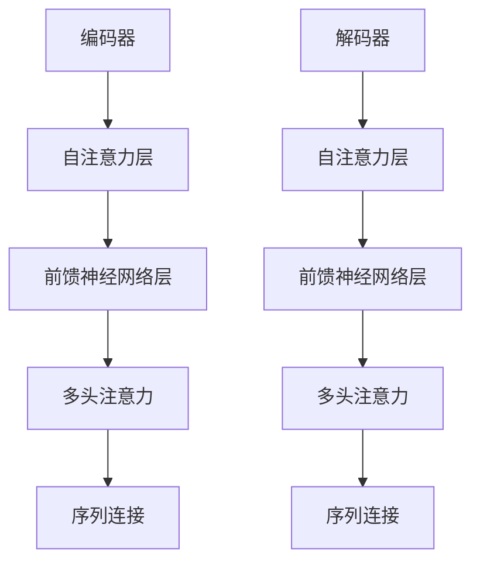
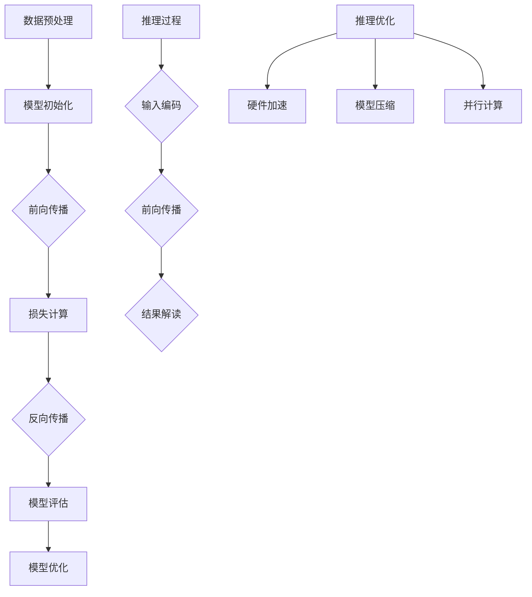
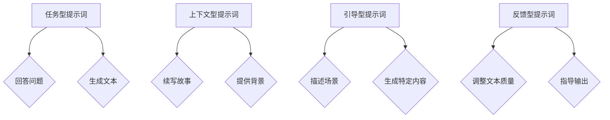
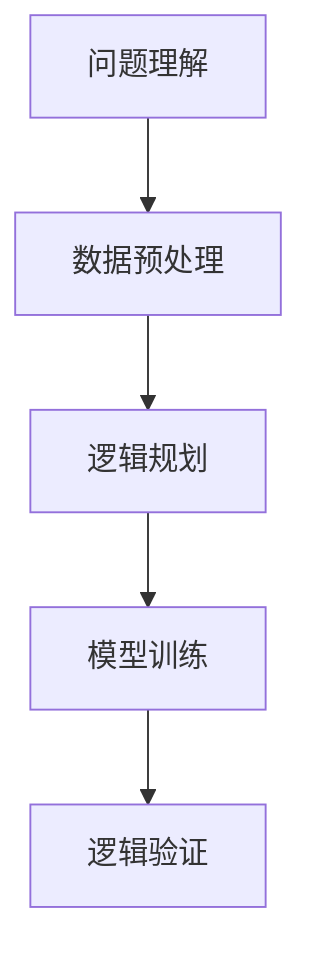
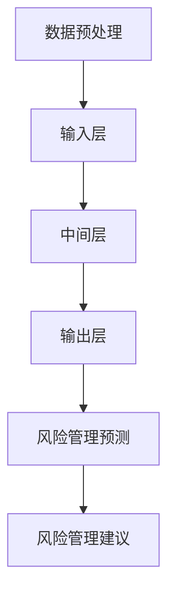

                 

## 文章标题

《大模型推理能力：提示词构建复杂逻辑链》

## 关键词

大模型，推理能力，提示词，复杂逻辑链，深度学习

## 摘要

本文深入探讨了大模型的推理能力及其在复杂逻辑链构建中的应用。首先，我们介绍了大模型的概念、分类、历史与发展，以及其在自然语言处理、计算机视觉和计算机音频等领域的应用。随后，我们详细阐述了大模型的核心技术，包括深度学习基础、自注意力机制和Transformer架构。在此基础上，本文重点探讨了如何通过提示词构建复杂逻辑链，并分析了大模型在复杂逻辑链构建中的作用和挑战。最后，文章提出了提升大模型推理能力的多种方法，并总结了相关资源，为读者提供了全面的技术视角和实用指南。

## 第1章：大模型概述

### 1.1 大模型的概念与分类

#### 1.1.1 大模型的定义

大模型，作为一种机器学习模型，具有以下特征：

1. **大规模参数**：大模型的参数数量通常在十亿以上，有些甚至达到上百亿或上千亿。这样的规模使得大模型能够捕捉到数据中的复杂特征和模式。
2. **复杂结构**：大模型的结构往往比传统的模型更加复杂，通常采用深度学习的架构，如Transformer、Gated Recurrent Unit (GRU)等。
3. **强大能力**：由于参数数量庞大和结构复杂，大模型在自然语言处理、图像识别、语音识别等领域表现出色，能够完成复杂的任务。

#### 1.1.2 大模型的分类

根据不同的分类标准，大模型可以分为以下几类：

1. **基于架构分类**：
   - **Transformer**：基于自注意力机制的架构，广泛应用于自然语言处理。
   - **Gated Recurrent Unit (GRU)**、**Long Short-Term Memory (LSTM)**：基于循环神经网络的架构，适用于序列数据的处理。

2. **基于任务分类**：
   - **文本生成**：如GPT-3、ChatGLM。
   - **图像识别**：如ResNet、VGG。
   - **目标检测**：如YOLO、SSD。
   - **视频理解**：如3D-CNN、C3D。

### 1.2 大模型的历史与发展

#### 1.2.1 大模型的历史

大模型的兴起可以追溯到2010年代中期，随着深度学习的快速发展，模型的规模逐渐扩大。以下几个事件标志着大模型的发展历程：

1. **2013年**：AlexNet在ImageNet竞赛中夺冠，标志着深度学习在图像识别领域的突破。
2. **2017年**：Google提出了Transformer模型，并在自然语言处理任务中取得了显著成果。
3. **2018年**：OpenAI发布了GPT模型，并引发了文本生成领域的革命。

#### 1.2.2 大模型的发展趋势

1. **模型规模持续增长**：随着计算资源的增加，模型的参数规模不断增长，从几十亿到上百亿，甚至上千亿。
2. **训练数据量不断增加**：更多的训练数据使得模型能够更好地泛化，处理更复杂的任务。
3. **分布式训练和推理**：为了应对大规模模型的计算需求，分布式训练和推理技术得到了广泛应用。

### 1.3 大模型的应用领域

#### 1.3.1 自然语言处理

大模型在自然语言处理领域有着广泛的应用，如：

1. **语言模型**：GPT-3、ChatGLM等大语言模型可以用于文本生成、机器翻译、问答系统等。
2. **文本分类**：如情感分析、新闻分类等。
3. **文本生成**：如生成对话、生成故事、生成摘要等。

#### 1.3.2 计算机视觉

在计算机视觉领域，大模型同样发挥着重要作用，如：

1. **图像识别**：ResNet、VGG等大模型在图像分类任务中表现出色。
2. **目标检测**：YOLO、SSD等大模型在目标检测任务中取得了很好的效果。
3. **视频理解**：3D-CNN、C3D等大模型可以用于视频分类和视频目标检测。

#### 1.3.3 计算机音频

大模型在计算机音频领域也有广泛应用，如：

1. **语音识别**：如基于深度神经网络的语音识别系统。
2. **音乐生成**：如使用深度学习生成音乐。
3. **音频增强**：如使用深度学习提高语音信号的清晰度和音质。

### 1.4 大模型的优势与挑战

#### 1.4.1 大模型的优势

1. **强大的表征能力**：由于参数数量庞大和结构复杂，大模型能够捕捉到数据中的复杂特征和模式，从而在各类任务中表现出色。
2. **高效的泛化能力**：大模型在训练时使用了大量数据，因此能够更好地泛化，处理未见过的数据。

#### 1.4.2 大模型的挑战

1. **计算资源需求大**：大模型的训练和推理都需要大量的计算资源，这对硬件设施提出了很高的要求。
2. **模型解释性差**：大模型的决策过程往往难以解释，这对于需要理解模型决策过程的任务（如医疗诊断）来说是一个挑战。

### 图1.1：大模型的分类

```mermaid
graph TB
A[大模型] --> B[基于架构分类]
B --> C{Transformer}
B --> D{Gated Recurrent Unit (GRU)}
B --> E{Long Short-Term Memory (LSTM)}

A --> F[基于任务分类]
F --> G{文本生成}
F --> H{图像识别}
F --> I{目标检测}
F --> J{视频理解}
F --> K{语音识别}
F --> L{音乐生成}
F --> M{音频增强}
```

## 第2章：大模型的核心技术

### 2.1 深度学习基础

#### 2.1.1 神经网络的基本结构

神经网络（Neural Network，简称NN）是深度学习的基础。一个基本的神经网络包括以下几个组成部分：

1. **层结构（Layers）**：神经网络由多个层次组成，包括输入层（Input Layer）、隐藏层（Hidden Layer）和输出层（Output Layer）。
2. **神经元（Neurons）**：每一层由多个神经元组成，神经元之间通过权重（Weights）和偏置（Bias）相连接。
3. **激活函数（Activation Function）**：激活函数用于引入非线性特性，常见的激活函数有Sigmoid、ReLU、Tanh等。
4. **反向传播算法（Backpropagation Algorithm）**：反向传播算法用于计算梯度，并更新神经网络的权重和偏置。

#### 2.1.2 常见的深度学习架构

在深度学习的发展过程中，出现了许多不同类型的神经网络架构。以下是几种常见的架构：

1. **卷积神经网络（Convolutional Neural Network，简称CNN）**：CNN专门用于处理图像数据，通过卷积层、池化层和全连接层等结构进行特征提取和分类。
2. **循环神经网络（Recurrent Neural Network，简称RNN）**：RNN适用于处理序列数据，通过隐藏状态和循环连接实现序列信息的传递。
3. **Transformer**：Transformer是一种基于自注意力机制的架构，广泛应用于自然语言处理任务。

#### 2.1.3 深度学习优化算法

深度学习模型的训练过程中，优化算法起着关键作用。以下是一些常见的优化算法：

1. **梯度下降（Gradient Descent）**：梯度下降是一种最基本的优化算法，通过计算损失函数的梯度来更新模型的权重和偏置。
2. **随机梯度下降（Stochastic Gradient Descent，简称SGD）**：SGD在每次迭代时随机选择一部分样本来计算梯度，这样可以加快收敛速度。
3. **Adam**：Adam是一种自适应优化算法，通过计算一阶矩估计和二阶矩估计来更新模型参数。

### 2.2 自注意力机制

#### 2.2.1 自注意力机制的原理

自注意力机制（Self-Attention Mechanism）是Transformer模型的核心组成部分。其基本原理如下：

1. **输入序列**：首先，输入序列（如单词序列）被映射为嵌入向量（Embedded Vectors）。
2. **计算注意力权重**：对于序列中的每个元素，计算其与其他元素之间的注意力权重。这些权重反映了元素之间的相关性。
3. **加权求和**：根据注意力权重，对序列中的每个元素进行加权求和，得到一个新的向量。

#### 2.2.2 自注意力在Transformer中的应用

Transformer模型通过自注意力机制实现了序列到序列的映射。其基本结构包括：

1. **编码器（Encoder）**：编码器由多个自注意力层和前馈神经网络层组成，用于处理输入序列。
2. **解码器（Decoder）**：解码器同样由多个自注意力层和前馈神经网络层组成，用于生成输出序列。

自注意力机制使得编码器能够捕捉到输入序列中的长距离依赖关系，从而在自然语言处理任务中表现出色。

### 2.3 Transformer架构

#### 2.3.1 Transformer的基本结构

Transformer模型的基本结构包括编码器（Encoder）和解码器（Decoder）两部分。每个部分由多个层组成，每层包括自注意力层和前馈神经网络层。以下是Transformer的基本结构：

1. **编码器**：
   - **自注意力层**：通过计算输入序列中每个元素之间的注意力权重，生成新的向量。
   - **前馈神经网络层**：对自注意力层生成的向量进行线性变换。
2. **解码器**：
   - **自注意力层**：首先计算编码器的输出序列和当前解码器输出之间的注意力权重，然后计算编码器输出序列之间的注意力权重。
   - **前馈神经网络层**：对自注意力层生成的向量进行线性变换。

#### 2.3.2 Transformer的工作原理

Transformer的工作原理如下：

1. **输入编码**：输入序列（如单词序列）被映射为嵌入向量。
2. **多头注意力**：通过多个自注意力头，捕捉序列中不同位置的信息。
3. **序列连接**：将多头注意力的输出进行序列连接。
4. **前馈神经网络**：对序列连接的结果进行线性变换，增强特征表示。
5. **解码输出**：解码器通过类似的过程生成输出序列。

### 图2.1：Transformer模型的基本结构



## 第3章：大模型训练与推理

### 3.1 大模型训练流程

#### 3.1.1 数据预处理

数据预处理是训练大模型的重要步骤，其主要包括以下任务：

1. **数据清洗**：去除无效数据、处理缺失值和异常值。
2. **数据增强**：通过旋转、翻转、裁剪等方法增加数据的多样性，提升模型的泛化能力。
3. **数据归一**：将数据缩放到相同的范围，以加快训练过程并提高模型的性能。

#### 3.1.2 大模型训练流程

大模型的训练流程通常包括以下步骤：

1. **模型初始化**：初始化模型的参数，常见的初始化方法包括随机初始化、高斯初始化等。
2. **前向传播**：将输入数据通过模型进行前向传播，计算输出结果。
3. **损失计算**：计算预测结果和真实标签之间的损失，常用的损失函数包括均方误差（MSE）、交叉熵（CE）等。
4. **反向传播**：通过反向传播算法计算梯度，更新模型的参数。
5. **模型评估**：在训练集和测试集上评估模型的性能，选择性能最佳的模型。

### 3.2 大模型推理机制

#### 3.2.1 推理过程

大模型的推理过程与训练过程类似，主要包括以下步骤：

1. **输入编码**：将输入数据编码为模型可以处理的格式。
2. **前向传播**：将编码后的输入数据通过模型进行前向传播，得到输出结果。
3. **结果解读**：根据输出结果进行决策或预测。

#### 3.2.2 推理优化

为了提高大模型的推理性能，可以采取以下优化方法：

1. **模型压缩**：通过剪枝、量化、蒸馏等方法减小模型的大小，提高推理速度。
2. **硬件加速**：利用GPU、TPU等硬件加速推理过程。
3. **并行计算**：通过分布式计算技术实现并行推理，提高处理速度。

### 3.3 大模型推理优化

#### 3.3.1 硬件加速

硬件加速是提高大模型推理性能的重要手段。以下是一些常用的硬件加速技术：

1. **GPU加速**：GPU具有并行计算能力，适合处理大规模的矩阵运算，可以显著提高推理速度。
2. **TPU加速**：TPU（Tensor Processing Unit）是专门为深度学习推理设计的芯片，具有更高的推理性能。
3. **FPGA加速**：FPGA（Field-Programmable Gate Array）可以根据特定任务进行编程，提高推理效率。

#### 3.3.2 模型压缩

模型压缩是通过减小模型的大小来提高推理性能的方法。以下是一些常见的模型压缩技术：

1. **剪枝（Pruning）**：通过剪枝算法去除模型中的冗余参数，减小模型大小。
2. **量化（Quantization）**：将模型的浮点数参数转换为较低精度的整数，减少存储和计算需求。
3. **蒸馏（Distillation）**：将一个大模型的知识传递给一个小模型，使小模型具有与原模型相似的性能。

#### 3.3.3 并行计算

并行计算是将任务分布在多个处理器上同时执行，以提高处理速度。以下是一些并行计算的方法：

1. **数据并行**：将数据集分割成多个子集，每个子集由不同的处理器处理，最后合并结果。
2. **模型并行**：将模型拆分成多个部分，每个部分由不同的处理器处理，最后合并结果。
3. **流水线并行**：将任务分解为多个阶段，每个阶段由不同的处理器处理，实现连续的流水线操作。

### 图3.1：大模型训练与推理流程



## 第4章：提示词概述

### 4.1 提示词的定义与作用

#### 4.1.1 提示词的定义

提示词（Prompt）是在人工智能模型，特别是自然语言处理模型中用于引导模型生成目标输出的一种文本输入。它通常是一个简短的句子或短语，用于描述模型的任务或提供上下文信息。

#### 4.1.2 提示词的作用

1. **任务引导**：提示词可以帮助模型明确任务目标，例如“生成一个关于春天的诗歌”。
2. **上下文提供**：提示词提供了任务的上下文信息，有助于模型理解任务背景，如“请根据以下文本续写故事”。
3. **质量控制**：通过精心设计的提示词，可以引导模型生成更符合期望的输出，提高生成文本的质量。

### 4.2 提示词的分类

提示词可以根据其功能和应用场景进行分类，以下是几种常见的提示词类型：

1. **任务型提示词**：这类提示词直接指定了模型的任务，例如“回答以下问题：什么是量子计算？”。
2. **上下文型提示词**：这类提示词提供了任务的上下文信息，例如“请续写下面的故事：今天早上，我醒来发现……”。
3. **引导型提示词**：这类提示词用于引导模型生成特定的内容，例如“请用浪漫的语言描述一次美丽的日落”。
4. **反馈型提示词**：这类提示词用于指导模型调整输出，例如“这段文字太枯燥了，请重新描述一下”。

### 4.3 提示词的设计原则

为了确保提示词的有效性和高效性，设计提示词时应遵循以下原则：

1. **清晰性**：提示词应简洁明了，能够准确传达任务要求。
2. **上下文相关**：提示词应与任务上下文紧密相关，提供足够的信息以帮助模型理解任务。
3. **灵活性**：提示词应具有一定的灵活性，能够适应不同的任务和场景。
4. **引导性**：提示词应引导模型生成高质量的输出，避免生成无关或低质量的文本。

### 图4.1：提示词的分类



## 第5章：构建复杂逻辑链

### 5.1 复杂逻辑链的概念与特点

#### 5.1.1 复杂逻辑链的定义

复杂逻辑链（Complex Logic Chain）是指在人工智能模型，尤其是大模型中，通过一系列的逻辑推理步骤，将原始数据或问题转化为期望的输出或解决方案的过程。

#### 5.1.2 复杂逻辑链的特点

1. **多步骤推理**：复杂逻辑链涉及多个推理步骤，每个步骤都对输入数据进行处理，逐步引导模型到达期望的输出。
2. **层次化结构**：复杂逻辑链通常具有层次化的结构，每个层次处理不同类型的信息，逐步构建完整的逻辑链条。
3. **多条件判断**：复杂逻辑链中包含多个条件判断，每个条件判断决定下一步的推理方向。

### 5.2 复杂逻辑链的构建方法

构建复杂逻辑链的方法主要包括以下几步：

1. **问题理解**：首先理解问题的核心内容和目标，明确需要解决的问题类型和所需的输出。
2. **数据预处理**：对输入数据进行预处理，如清洗、归一化、编码等，以便模型能够处理。
3. **逻辑规划**：设计逻辑链的推理步骤，确定每个步骤的任务和条件判断，构建完整的逻辑链条。
4. **模型训练**：使用设计好的逻辑链条对大模型进行训练，使模型能够根据逻辑步骤处理输入数据并生成期望的输出。
5. **逻辑验证**：通过测试数据验证逻辑链条的有效性和准确性，调整逻辑规划和模型参数，确保模型能够稳定工作。

### 5.3 复杂逻辑链的应用场景

复杂逻辑链在多个领域有着广泛的应用，以下是几个典型的应用场景：

1. **自然语言处理**：在自然语言处理任务中，复杂逻辑链可以帮助模型处理长文本、理解语义关系和生成文本。
2. **推理系统**：在推理系统中，复杂逻辑链用于处理复杂的推理任务，如基于知识图谱的推理、逻辑推理等。
3. **自动化决策**：在自动化决策系统中，复杂逻辑链可以帮助模型处理多条件决策问题，生成最优决策方案。
4. **游戏AI**：在游戏人工智能中，复杂逻辑链用于处理游戏中的复杂决策和策略，提高游戏智能水平。

### 图5.1：复杂逻辑链的构建方法



## 第6章：大模型在复杂逻辑链构建中的应用

### 6.1 大模型在复杂逻辑链构建中的作用

#### 6.1.1 提升推理能力

大模型通过其强大的表征能力和计算能力，可以处理复杂的逻辑链条，实现高效的多步骤推理。相比传统的逻辑推理系统，大模型能够在更短的时间内处理更多的信息，提高推理效率。

#### 6.1.2 捕捉长距离依赖

大模型，特别是基于Transformer的模型，能够捕捉长距离依赖关系，这对于构建复杂逻辑链至关重要。通过自注意力机制，模型可以关注到输入序列中不同位置的信息，从而在复杂的逻辑链条中保持一致的推理方向。

#### 6.1.3 提高泛化能力

大模型在训练时使用了大量的数据，因此具有较好的泛化能力。在构建复杂逻辑链时，大模型能够处理不同类型和来源的数据，确保逻辑链条的稳定性和可靠性。

### 6.2 大模型在复杂逻辑链构建中的案例分析

以下是一个具体的案例分析，展示了大模型在构建复杂逻辑链中的应用。

#### 案例背景

一个金融科技公司需要开发一个智能风险管理系统，该系统能够根据客户的交易历史、财务状况和市场数据，预测客户未来可能面临的风险，并提供相应的风险管理建议。

#### 模型设计

为了构建复杂逻辑链，公司选择了基于Transformer的模型架构。模型的设计分为以下几个部分：

1. **数据预处理**：对客户的交易数据、财务数据和市场数据进行清洗、归一化和编码。
2. **输入层**：将预处理后的数据输入到编码器中，编码器由多个自注意力层和前馈神经网络层组成。
3. **中间层**：通过中间层进行复杂的逻辑推理，捕捉长距离依赖关系。
4. **输出层**：解码器将中间层的结果解码为风险管理建议。

#### 模型训练

1. **数据集准备**：收集大量历史交易数据、财务数据和风险事件数据，用于训练模型。
2. **训练过程**：通过反向传播算法训练模型，调整模型的参数，使其能够准确预测风险并生成有效的风险管理建议。
3. **验证与调整**：在测试集上验证模型的性能，根据验证结果调整模型结构和参数，确保模型在实际应用中的效果。

#### 模型应用

1. **风险管理预测**：将客户的交易数据、财务数据和市场数据输入到模型中，模型根据复杂逻辑链生成风险管理预测。
2. **风险管理建议**：根据预测结果，模型提供相应的风险管理建议，如调整投资组合、增加保险等。
3. **持续优化**：通过持续收集新的数据，不断更新模型，提高模型在复杂逻辑链构建中的应用效果。

### 6.3 大模型在复杂逻辑链构建中的挑战与应对策略

#### 6.3.1 数据质量与隐私

在构建复杂逻辑链时，数据质量和隐私是重要的挑战。为了应对这一挑战，可以采取以下策略：

1. **数据清洗**：对输入数据进行严格的清洗，去除错误和异常数据，提高数据的可靠性。
2. **隐私保护**：采用数据加密、匿名化等技术，保护客户隐私。

#### 6.3.2 计算资源需求

大模型的训练和推理需要大量的计算资源，为了应对这一挑战，可以采取以下策略：

1. **分布式计算**：利用分布式计算技术，将任务分布在多个节点上，提高计算效率。
2. **硬件加速**：利用GPU、TPU等硬件加速器，提高模型的推理速度。

#### 6.3.3 模型解释性

大模型的决策过程通常难以解释，这对于需要理解模型决策过程的任务来说是一个挑战。为了应对这一挑战，可以采取以下策略：

1. **模型可视化**：通过可视化技术，展示模型的内部结构和决策过程。
2. **解释性模型**：开发具有高解释性的模型，如基于规则的模型，使其决策过程更容易理解。

### 图6.1：大模型在复杂逻辑链构建中的应用



## 第7章：大模型推理能力评估

### 7.1 大模型推理能力评价指标

评估大模型推理能力的关键在于选择合适的评价指标。以下是一些常用的评价指标：

1. **准确率（Accuracy）**：准确率是指模型预测正确的样本数占总样本数的比例。它是最常用的评价指标之一，适用于分类任务。
   - **公式**：$$ Accuracy = \frac{TP + TN}{TP + FN + FP + TN} $$
   - **优点**：简单直观。
   - **缺点**：对于类别不平衡的数据集效果不佳。

2. **精确率（Precision）**：精确率是指预测为正类的样本中，实际为正类的比例。它反映了模型对正类样本的判断准确性。
   - **公式**：$$ Precision = \frac{TP}{TP + FP} $$
   - **优点**：强调了对正类样本的判断准确性。
   - **缺点**：对于假阳性率敏感。

3. **召回率（Recall）**：召回率是指实际为正类的样本中，被模型正确预测为正类的比例。它反映了模型对负类样本的判断准确性。
   - **公式**：$$ Recall = \frac{TP}{TP + FN} $$
   - **优点**：强调了对负类样本的判断准确性。
   - **缺点**：对于假阴性率敏感。

4. **F1分数（F1 Score）**：F1分数是精确率和召回率的调和平均，综合反映了模型的性能。
   - **公式**：$$ F1 Score = 2 \times \frac{Precision \times Recall}{Precision + Recall} $$
   - **优点**：综合考虑了精确率和召回率。
   - **缺点**：对于类别不平衡的数据集效果不佳。

5. **ROC曲线和AUC（Area Under Curve）**：ROC曲线展示了不同阈值下模型的真正率（True Positive Rate）和假正率（False Positive Rate）之间的关系，AUC是ROC曲线下面积，用于评估模型的总体性能。
   - **公式**：$$ AUC = \int_{0}^{1} \frac{TPR(t) - FPR(t)}{1 - FPR(t)} dt $$
   - **优点**：适用于任意类别数。
   - **缺点**：受阈值选择影响。

6. **MAE（Mean Absolute Error）**：均方绝对误差用于回归任务，表示预测值与真实值之间的平均绝对误差。
   - **公式**：$$ MAE = \frac{1}{N} \sum_{i=1}^{N} | \hat{y}_i - y_i | $$
   - **优点**：对异常值不敏感。
   - **缺点**：对误差的分布敏感。

7. **RMSE（Root Mean Squared Error）**：均方根误差是MAE的平方根，用于衡量预测值的误差大小。
   - **公式**：$$ RMSE = \sqrt{ \frac{1}{N} \sum_{i=1}^{N} (\hat{y}_i - y_i)^2 } $$
   - **优点**：对误差的敏感度更高。
   - **缺点**：对异常值敏感。

### 7.2 大模型推理能力评估方法

评估大模型推理能力的方法主要包括以下几种：

1. **离线评估**：离线评估是指在模型部署前，使用独立的测试集对模型进行评估。这种方法可以全面评估模型的性能，但无法反映模型在实际应用中的效果。
   - **步骤**：
     1. 准备测试集：从原始数据中随机选取一部分样本作为测试集。
     2. 模型部署：将模型部署到测试环境中。
     3. 评估指标计算：计算模型的准确率、精确率、召回率等指标。

2. **在线评估**：在线评估是指在模型部署后，实时收集数据并评估模型的性能。这种方法可以反映模型在实际应用中的效果，但评估结果可能受到实时数据质量的影响。
   - **步骤**：
     1. 实时数据收集：收集模型在真实应用中的输入数据和输出结果。
     2. 模型性能评估：使用实时数据对模型进行评估，计算模型的准确率、精确率、召回率等指标。
     3. 持续优化：根据评估结果对模型进行优化和调整。

3. **A/B测试**：A/B测试是将模型的两个版本（A和B）同时部署到实际应用中，比较两者的性能。这种方法可以直观地比较不同模型的性能，但需要足够的数据量来确保结果的可靠性。
   - **步骤**：
     1. 准备测试环境：为每个模型准备独立的测试环境。
     2. 数据分配：将用户分配到两个模型中，确保每组用户数量相等。
     3. 性能比较：收集用户的使用数据，比较两个模型的性能指标。

### 7.3 大模型推理能力评估工具

评估大模型推理能力需要使用专门的工具和平台。以下是一些常用的评估工具：

1. **TensorFlow Model Optimization Toolkit (TF-MOT)**：TF-MOT是TensorFlow提供的一套模型优化工具，支持模型压缩、量化、硬件加速等，帮助用户评估和优化模型的推理性能。
   - **特点**：支持多种硬件平台（如CPU、GPU、TPU），提供丰富的优化策略。

2. **PyTorch Model Zoo**：PyTorch Model Zoo是一个开源的模型库，提供了大量预训练模型和优化工具，用户可以方便地评估和复现各种模型的推理性能。
   - **特点**：模型种类丰富，支持多种任务和应用场景。

3. **MLflow**：MLflow是一个开源的机器学习平台，支持模型训练、部署和评估。用户可以使用MLflow跟踪模型的性能变化，并比较不同模型的性能。
   - **特点**：支持多种框架和平台，提供丰富的监控和可视化功能。

4. **Keras Model Inspector**：Keras Model Inspector是一个用于Keras模型的调试和性能分析的工具。用户可以使用它评估模型在不同输入下的推理性能，并诊断性能瓶颈。
   - **特点**：简单易用，支持实时性能分析。

## 第8章：提升大模型推理能力的方法

### 8.1 硬件加速

#### 8.1.1 GPU加速

GPU（图形处理单元）因其强大的并行计算能力，成为加速大模型推理的常见选择。以下是一些GPU加速的方法：

1. **CUDA**：CUDA是NVIDIA推出的并行计算平台和编程模型，通过CUDA，程序员可以充分利用GPU的并行计算能力，加速模型的推理。
2. **cuDNN**：cuDNN是NVIDIA推出的深度神经网络加速库，专门用于加速深度学习推理。使用cuDNN可以显著提高GPU在深度学习推理任务中的性能。

#### 8.1.2 TPU加速

TPU（Tensor Processing Unit）是Google专门为深度学习推理设计的硬件加速器。以下是一些TPU加速的方法：

1. **TensorFlow TPU**：TensorFlow TPU是TensorFlow支持的一种TPU加速方式，通过将模型部署到TPU上，可以大幅提高模型的推理速度。
2. **XLA**：XLA（Accelerated Linear Algebra）是Google开发的一种编译优化中间表示，通过XLA可以将TensorFlow模型转换成高效的硬件执行代码，提高TPU的利用率和性能。

#### 8.1.3 FPG

FPGA（现场可编程门阵列）是一种可编程的数字电路，通过硬件定制可以实现特定的计算任务。以下是一些FPGA加速的方法：

1. **硬件描述语言（HDL）**：使用硬件描述语言（如VHDL或Verilog）编写FPGA硬件电路，以实现特定的计算功能。
2. **硬件加速模块（HLS）**：硬件加速模块（HLS）是一种用于FPGA的高层次设计工具，通过HLS，程序员可以使用C++等高级语言编写硬件电路，提高设计的效率和性能。

### 8.2 模型压缩

#### 8.2.1 剪枝（Pruning）

剪枝是通过移除模型中的一些冗余参数来减少模型大小的技术。以下是一些剪枝方法：

1. **权重剪枝**：权重剪枝通过移除权重较小的参数，降低模型的复杂度。
2. **结构剪枝**：结构剪枝通过移除一些层或神经元，简化模型的架构。

#### 8.2.2 量化（Quantization）

量化是通过将模型参数从浮点数转换为较低精度的整数来减少模型大小的技术。以下是一些量化方法：

1. **对称量化**：对称量化将所有参数统一转换为相同的精度，通常用于静态量化。
2. **非对称量化**：非对称量化根据参数的重要性分配不同的精度，通常用于动态量化。

#### 8.2.3 蒸馏（Distillation）

蒸馏是通过将知识从一个大模型传递给一个小模型来减小模型大小的技术。以下是一些蒸馏方法：

1. **软蒸馏**：软蒸馏将大模型的输出作为小模型的输入，通过交叉熵损失函数将知识传递给小模型。
2. **硬蒸馏**：硬蒸馏直接使用大模型的输出作为小模型的标签，通过分类损失函数将知识传递给小模型。

### 8.3 模型量化

#### 8.3.1 动态量化

动态量化是一种在推理过程中根据输入数据的分布动态调整模型参数精度的方法。以下是一些动态量化方法：

1. **静态阈值**：静态阈值使用一个固定的阈值来确定参数的精度。
2. **自适应阈值**：自适应阈值根据输入数据的分布动态调整阈值，以提高量化效果。

#### 8.3.2 静态量化

静态量化是在模型训练完成后，将模型参数一次性转换为较低精度的整数的方法。以下是一些静态量化方法：

1. **全局量化**：全局量化将所有参数统一转换为相同的精度。
2. **层级量化**：层级量化根据参数的重要性分配不同的精度，通常用于减少计算量。

### 8.4 并行计算

#### 8.4.1 数据并行

数据并行是将数据集分成多个子集，每个子集由不同的处理器处理，最后合并结果的方法。以下是一些数据并行方法：

1. **分布式训练**：分布式训练通过将数据集分布在多个节点上进行训练，提高训练速度。
2. **异步训练**：异步训练允许不同节点之间同时进行训练，以进一步加快训练速度。

#### 8.4.2 模型并行

模型并行是将模型拆分成多个部分，每个部分由不同的处理器处理，最后合并结果的方法。以下是一些模型并行方法：

1. **管道并行**：管道并行通过将模型的不同层分配到不同的处理器上，实现层级的并行计算。
2. **分区并行**：分区并行通过将模型的不同部分分配到不同的处理器上，实现模型的并行计算。

#### 8.4.3 流水线并行

流水线并行是将任务分解为多个阶段，每个阶段由不同的处理器处理，实现连续的流水线操作的方法。以下是一些流水线并行方法：

1. **硬件流水线**：硬件流水线通过硬件实现多个任务的并行处理，提高处理速度。
2. **软件流水线**：软件流水线通过软件调度实现多个任务的并行处理，提高处理效率。

## 附录

### 附录A：大模型推理能力相关资源

#### A.1 大模型推理框架与工具

1. **TensorFlow**：TensorFlow是Google开源的深度学习框架，支持多种大模型推理优化工具。
2. **PyTorch**：PyTorch是Facebook开源的深度学习框架，提供了丰富的模型优化和推理工具。
3. **MXNet**：MXNet是Apache Software Foundation开源的深度学习框架，支持多种硬件加速和模型压缩工具。

#### A.2 大模型推理能力评估数据集

1. **ImageNet**：ImageNet是一个广泛使用的图像分类数据集，用于评估大模型的推理性能。
2. **COCO**：COCO是一个用于目标检测和分割的数据集，涵盖了多种视觉任务。
3. **GLUE**：GLUE是一个用于自然语言处理任务的数据集，包括多种语言理解和生成任务。

#### A.3 大模型推理能力相关论文与书籍

1. **"Attention Is All You Need"（2017）**：这篇论文提出了Transformer模型，开启了自注意力机制在自然语言处理领域的新时代。
2. **"Bert: Pre-training of Deep Bidirectional Transformers for Language Understanding"（2018）**：这篇论文介绍了BERT模型，推动了预训练语言模型的发展。
3. **"Deep Learning"（2016）**：这本书是深度学习领域的经典教材，涵盖了深度学习的理论基础和应用。

#### A.4 大模型推理能力社区与论坛

1. **Reddit**：Reddit上有多个深度学习和自然语言处理的子版块，用户可以分享经验和讨论技术问题。
2. **Stack Overflow**：Stack Overflow是编程问题的问答社区，用户可以在这里找到关于深度学习和模型推理的解决方案。
3. **GitHub**：GitHub上有很多开源的大模型推理项目和工具，用户可以学习和复现相关技术。

