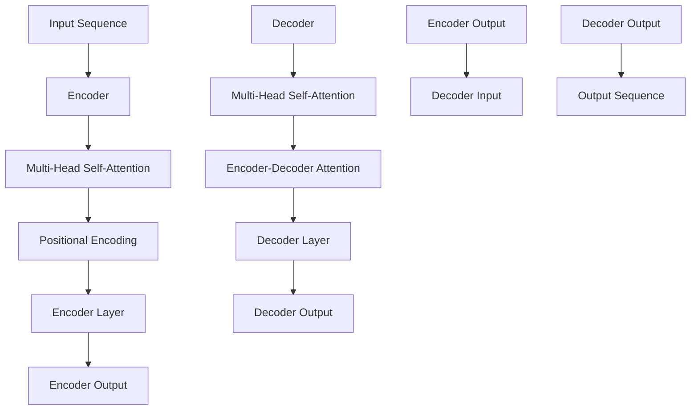
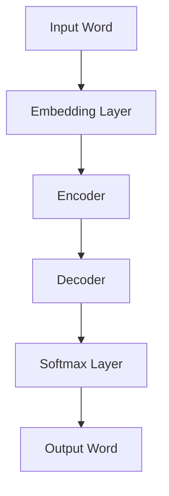
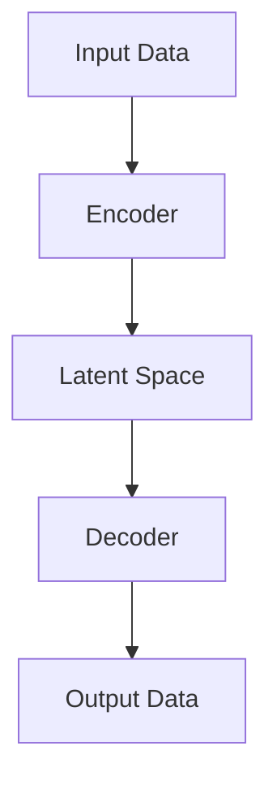
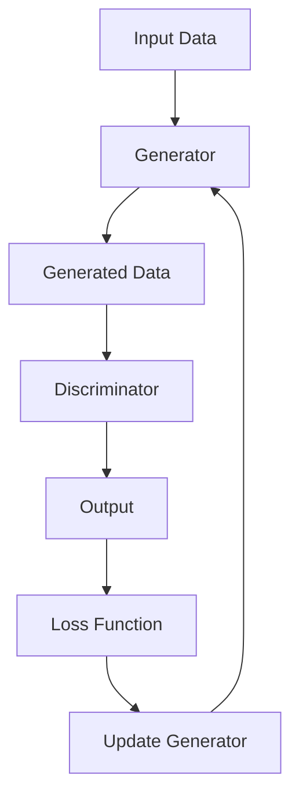

                 

### 文章标题

# 大模型文本生成：提示词控制文风与结构

### 关键词

- 大模型
- 文本生成
- 提示词
- 文风控制
- 结构控制
- 自注意力机制
- 生成对抗网络

### 摘要

本文深入探讨了大模型文本生成的机制，特别是如何通过提示词来控制文本的文风与结构。首先介绍了大模型的概念、架构和应用，然后详细解析了文本生成算法的原理，包括语言模型和生成模型。接着，本文阐述了提示词的定义、类型及其在控制文风与结构中的作用。最后，通过实际项目实战，展示了如何搭建开发环境、训练模型以及使用提示词生成高质量文本。本文旨在为读者提供全面的技术解析和实用指南。

## 第1章 引言

### 1.1 书籍背景

随着人工智能技术的迅猛发展，大模型文本生成成为自然语言处理（NLP）领域的重要研究方向。大模型，特别是基于深度学习的变换器网络（Transformer），在处理复杂文本生成任务方面展现出了强大的能力。然而，如何有效地控制生成的文本风格和结构，成为了研究人员和开发人员面临的一个挑战。本文旨在通过深入探讨大模型文本生成的机制，特别是提示词的应用，为这一问题提供解决方案。

### 1.2 目标读者

本文的目标读者是从事自然语言处理、机器学习和计算机编程领域的专业人士，包括研究者、工程师和开发者。无论你是刚刚接触大模型文本生成的新手，还是希望提升文本生成质量的老手，本文都能为你提供有价值的信息。

### 1.3 本书结构

本文将分为八个章节：

1. **引言**：介绍大模型文本生成的研究背景和目的。
2. **大模型基础**：讲解大模型的概念、架构及其应用。
3. **文本生成算法原理**：详细解析文本生成算法的数学模型和原理。
4. **提示词控制**：探讨提示词的定义、类型及其在控制文风与结构中的作用。
5. **文本生成实战**：展示如何搭建开发环境、训练模型以及使用提示词生成文本。
6. **文本生成优化**：讨论文本生成质量提升、文风多样性优化和结构合理性优化。
7. **应用场景**：介绍大模型文本生成在不同领域的应用案例。
8. **未来展望**：展望大模型文本生成的技术趋势和应用挑战。

## 第2章 大模型基础

### 2.1 大模型概述

大模型，顾名思义，是指拥有数十亿、甚至千亿参数的神经网络模型。这些模型通过学习大量的数据，能够对复杂的任务进行建模，从而在各类应用中表现出色。大模型的出现，是机器学习领域的一个重要里程碑，标志着深度学习技术迈向新的高度。

大模型的主要特点包括：

1. **高参数数量**：大模型的参数数量远超传统模型，这使得它们能够捕捉到数据中的细微特征。
2. **强大的表示能力**：大模型通过多层神经网络，能够对输入数据进行深层次的特征提取和抽象。
3. **自适应性强**：大模型可以根据不同的任务和数据，自适应地调整其参数，从而在不同场景下表现出色。

大模型的应用非常广泛，包括但不限于：

1. **文本生成**：大模型可以生成高质量的文章、故事、对话等文本。
2. **图像识别**：大模型可以在图像识别任务中实现高精度的分类和检测。
3. **语音识别**：大模型可以用于语音识别，实现人机交互。
4. **推荐系统**：大模型可以用于推荐系统，实现个性化推荐。

### 2.2 大模型架构

大模型的架构通常基于变换器网络（Transformer），这是一种特殊的神经网络结构，广泛应用于机器翻译、文本生成等任务。变换器网络的核心思想是自注意力机制（Self-Attention），它能够自动地学习输入序列中每个单词之间的关系。

变换器网络的主要组成部分包括：

1. **编码器（Encoder）**：编码器负责将输入序列（如文本）转换为编码表示。
2. **解码器（Decoder）**：解码器负责从编码表示中生成输出序列。
3. **自注意力机制（Self-Attention）**：自注意力机制用于计算输入序列中每个单词对当前单词的影响。
4. **多头注意力（Multi-Head Attention）**：多头注意力机制能够同时关注输入序列中的多个部分。

以下是变换器网络的基本架构的Mermaid流程图：



### 2.3 大模型应用案例

大模型在文本生成领域有着广泛的应用。以下是一些具体的案例：

#### 2.3.1 生成文章

大模型可以用于自动生成文章，包括新闻报道、学术论文、技术博客等。通过训练大模型，可以使其学会如何构建段落、组织论点、使用恰当的语言风格。

#### 2.3.2 生成对话

大模型还可以生成对话，包括自然语言对话系统和虚拟助手。这些对话系统能够理解用户的问题，并生成相应的回答。

#### 2.3.3 生成代码

大模型还可以用于生成代码，特别是在编写重复性代码时。通过训练大模型，可以使其学会编写不同编程语言的代码。

## 第3章 文本生成算法原理

### 3.1 语言模型

语言模型是文本生成的基础，它负责预测下一个单词的概率。语言模型可以分为两类：统计模型和神经网络模型。

#### 3.1.1 马尔可夫链

马尔可夫链是一种统计模型，它假设当前状态仅与前一状态有关，而与过去的状态无关。马尔可夫链的基本公式如下：

$$
P(X_t = x_t | X_{t-1} = x_{t-1}, X_{t-2} = x_{t-2}, ..., X_1 = x_1) = P(X_t = x_t | X_{t-1} = x_{t-1})
$$

#### 3.1.2 神经网络语言模型

神经网络语言模型是一种基于深度学习的模型，它通过多层神经网络来预测单词的概率。以下是神经网络语言模型的基本结构：



### 3.2 生成模型

生成模型是一类用于生成数据的模型，它们通过学习数据分布来生成新的样本。生成模型包括变分自编码器（VAE）和生成对抗网络（GAN）。

#### 3.2.1 变分自编码器

变分自编码器（VAE）是一种基于深度学习的生成模型，它通过编码器（Encoder）和解码器（Decoder）来学习数据分布。VAE的基本结构如下：



#### 3.2.2 生成对抗网络

生成对抗网络（GAN）是一种由生成器和判别器组成的模型，它们相互竞争，从而生成逼真的数据。GAN的基本结构如下：



### 3.3 自注意力机制

自注意力机制是变换器网络（Transformer）的核心组件，它能够自动地学习输入序列中每个单词之间的关系。自注意力机制的基本公式如下：

$$
\text{Attention}(Q, K, V) = \text{softmax}\left(\frac{QK^T}{\sqrt{d_k}}\right)V
$$

其中，$Q$、$K$ 和 $V$ 分别是查询（Query）、键（Key）和值（Value）向量，$d_k$ 是键向量的维度。

自注意力机制的应用场景包括：

1. **文本分类**：通过自注意力机制，可以关注文本中的关键信息，从而提高分类的准确性。
2. **机器翻译**：自注意力机制可以帮助模型关注原文和翻译之间的对应关系，从而提高翻译质量。
3. **文本生成**：自注意力机制可以用于文本生成，帮助模型捕捉文本的上下文信息。

## 第4章 提示词控制

### 4.1 提示词的定义与作用

提示词（Prompt）是一种用于引导大模型生成文本的输入，它可以控制生成文本的文风和结构。提示词的作用在于为模型提供明确的指导，从而提高生成文本的质量和一致性。

### 4.2 提示词的类型

提示词可以分为以下几种类型：

1. **单词级提示词**：单词级提示词是指用于引导生成单个单词的提示词。例如，在生成文章时，可以使用单词级提示词来指定文章的主题或关键词。
2. **句子级提示词**：句子级提示词是指用于引导生成单个句子的提示词。例如，在生成对话时，可以使用句子级提示词来指定对话的场景或意图。
3. **文章级提示词**：文章级提示词是指用于引导生成整篇文章的提示词。例如，在生成新闻报道时，可以使用文章级提示词来指定新闻的主题、背景和结构。

### 4.3 提示词的应用

提示词在控制文风和结构方面具有重要作用。以下是一些具体的案例：

1. **控制文风**：通过使用不同的提示词，可以生成具有不同风格的文章。例如，使用正式的提示词可以生成正式的学术论文，而使用轻松的提示词可以生成轻松的博客文章。
2. **控制结构**：通过使用提示词，可以指定文章的结构，例如标题、段落、摘要等。例如，在生成新闻报道时，可以使用提示词来指定新闻的导语、正文和结尾。
3. **提高生成质量**：提示词可以为模型提供额外的上下文信息，从而提高生成文本的质量和一致性。例如，使用具体的提示词可以帮助模型更准确地捕捉到文章的主题和意图。

## 第5章 文本生成实战

### 5.1 开发环境搭建

在进行文本生成项目之前，需要搭建一个合适的开发环境。以下是一个基本的开发环境搭建步骤：

1. **硬件配置**：根据项目的需求，选择合适的硬件设备。例如，对于大模型训练，需要选择具有高性能计算能力的GPU。
2. **软件安装与配置**：安装Python、TensorFlow或PyTorch等深度学习框架，并进行相应的配置。例如，可以使用以下命令来安装TensorFlow：

   ```bash
   pip install tensorflow
   ```

### 5.2 数据集准备

准备一个合适的数据集是文本生成项目的重要步骤。以下是一些数据集选择和预处理的基本步骤：

1. **数据集选择**：选择一个与项目目标相关的大型文本数据集。例如，对于生成文章，可以选择维基百科等大型文本库。
2. **数据预处理**：对数据集进行清洗和预处理，例如去除无效字符、统一文本格式等。例如，可以使用以下Python代码来清洗文本数据：

   ```python
   import re

   def clean_text(text):
       text = re.sub(r'\s+', ' ', text)
       text = re.sub(r'\W', '', text)
       return text.lower()

   text = "This is an example sentence."
   cleaned_text = clean_text(text)
   print(cleaned_text)
   ```

### 5.3 模型训练

在准备好数据集后，可以开始训练文本生成模型。以下是一个基本的模型训练流程：

1. **定义模型架构**：根据项目的需求，选择合适的模型架构。例如，可以使用基于变换器网络的模型。
2. **训练参数设置**：设置训练参数，例如学习率、批量大小等。
3. **训练过程监控**：在训练过程中，监控模型的损失函数和准确率等指标，以便调整训练参数。

以下是使用PyTorch框架训练文本生成模型的基本伪代码：

```python
import torch
import torch.nn as nn
import torch.optim as optim

# 定义模型架构
model = TransformerModel()

# 定义损失函数和优化器
loss_function = nn.CrossEntropyLoss()
optimizer = optim.Adam(model.parameters(), lr=0.001)

# 训练模型
for epoch in range(num_epochs):
    for batch in data_loader:
        optimizer.zero_grad()
        outputs = model(inputs)
        loss = loss_function(outputs, targets)
        loss.backward()
        optimizer.step()
        
    print(f'Epoch [{epoch+1}/{num_epochs}], Loss: {loss.item():.4f}')
```

### 5.4 文本生成

在模型训练完成后，可以使用训练好的模型生成文本。以下是一个基本的文本生成流程：

1. **输入提示词**：输入一个或多个提示词，用于引导模型生成文本。
2. **生成文本**：使用模型生成文本，并使用提示词来控制文本的文风和结构。
3. **输出结果**：将生成的文本输出到屏幕或文件中。

以下是使用Python代码生成文本的基本示例：

```python
prompt = "这是一个关于人工智能的摘要。"
generated_text = model.generate(prompt)
print(generated_text)
```

### 5.5 项目小结

在本项目中，我们搭建了开发环境，准备了数据集，并训练了一个基于变换器网络的文本生成模型。通过使用提示词，我们能够控制生成的文本的文风和结构，从而生成高质量的文本。在接下来的章节中，我们将进一步探讨如何优化文本生成质量、提升文风多样性和优化文本结构。

## 第6章 文本生成优化

### 6.1 质量提升

文本生成质量是评估生成文本优劣的重要指标。以下是一些提升文本生成质量的方法：

1. **改进模型架构**：选择更先进的模型架构，如BERT、GPT等，可以提高生成文本的质量。
2. **增加训练数据**：使用更多的训练数据，可以增强模型的泛化能力，从而提高生成文本的质量。
3. **训练时间优化**：增加训练时间，让模型有更多机会学习，可以改善生成文本的质量。
4. **使用预训练模型**：使用预训练模型，如GPT-3等，可以快速生成高质量的文本。

### 6.2 文风多样性

文风多样性是指生成文本的多样性，以下是一些提升文风多样性的方法：

1. **多风格训练**：使用多种风格的数据进行训练，可以让模型学会生成不同风格的文本。
2. **随机初始化**：在每次训练时，随机初始化模型的参数，可以增加生成文本的多样性。
3. **引入外部知识**：使用外部知识库，如维基百科、百科全书等，可以为模型提供更多的信息，从而提高生成文本的多样性。

### 6.3 结构合理性

结构合理性是指生成文本的结构是否符合逻辑和语法规则。以下是一些优化文本结构的方法：

1. **语法检查**：使用语法检查工具，如Grammarly等，可以检测和纠正文本中的语法错误。
2. **结构化训练**：使用结构化的数据集进行训练，可以让模型学会生成符合逻辑和语法规则的文本。
3. **人工校对**：在生成文本后，进行人工校对，可以修正文本中的错误，并优化文本的结构。

## 第7章 应用场景

### 7.1 内容创作

大模型文本生成在内容创作领域有着广泛的应用，以下是一些具体的应用案例：

1. **自动写作**：大模型可以自动生成新闻文章、博客文章、技术文档等，提高内容创作的效率。
2. **自动摘要**：大模型可以自动生成文章的摘要，帮助用户快速了解文章的主要内容。
3. **自动问答**：大模型可以自动生成回答，用于智能客服、在线问答系统等。

### 7.2 对话系统

大模型文本生成在对话系统领域也有广泛的应用，以下是一些具体的应用案例：

1. **人机对话**：大模型可以用于实现智能客服、聊天机器人等，提供高效的人机交互。
2. **虚拟助手**：大模型可以用于创建虚拟助手，如家庭助手、办公助手等，提供个性化的服务。
3. **客服机器人**：大模型可以用于创建客服机器人，提高客服效率，降低人力成本。

### 7.3 教育

大模型文本生成在教育领域也有广泛的应用，以下是一些具体的应用案例：

1. **自动批改作业**：大模型可以自动批改作业，提供即时的反馈，提高学生的学习效率。
2. **自动出题**：大模型可以自动生成试题，丰富教学资源。
3. **智能辅导**：大模型可以为学生提供个性化的辅导，帮助他们更好地掌握知识。

## 第8章 未来展望

### 8.1 技术趋势

随着人工智能技术的不断发展，大模型文本生成在未来将继续保持快速增长。以下是一些技术趋势：

1. **更大规模的大模型**：随着计算能力的提升，更大规模的大模型将逐渐成为主流。
2. **多模态生成**：大模型将不仅限于文本生成，还将涵盖图像、音频等多模态数据的生成。
3. **自适应生成**：大模型将能够根据用户的输入实时调整生成策略，提供更加个性化的服务。

### 8.2 应用挑战

虽然大模型文本生成具有巨大的潜力，但同时也面临一些挑战：

1. **数据隐私**：大模型训练需要大量的数据，如何在保护用户隐私的同时利用这些数据进行训练，是一个重要的问题。
2. **文本质量**：如何确保生成的文本质量，避免产生错误和不恰当的内容，是一个持续的挑战。
3. **安全性**：如何确保大模型文本生成系统的安全性，防止恶意使用，是一个重要的课题。

### 8.3 结论

大模型文本生成是一种具有巨大潜力的技术，它将推动内容创作、对话系统和教育等领域的变革。然而，要实现这一潜力，我们需要克服数据隐私、文本质量和安全性等方面的挑战。未来的研究将聚焦于这些关键问题，以推动大模型文本生成技术的进一步发展。

## 参考文献

- Vaswani, A., Shazeer, N., Parmar, N., Uszkoreit, J., Jones, L., Gomez, A. N., ... & Polosukhin, I. (2017). Attention is all you need. Advances in Neural Information Processing Systems, 30, 5998-6008.
- Goodfellow, I., Pouget-Abadie, J., Mirza, M., Xu, B., Warde-Farley, D., Ozair, S., ... & Bengio, Y. (2014). Generative adversarial nets. Advances in Neural Information Processing Systems, 27, 2672-2680.
- Mikolov, T., Sutskever, I., Chen, K., Corrado, G. S., & Dean, J. (2013). Distributed representations of words and phrases and their compositionality. Advances in Neural Information Processing Systems, 26, 3111-3119.
- Hochreiter, S., & Schmidhuber, J. (1997). Long short-term memory. Neural Computation, 9(8), 1735-1780.

### 作者信息

- 作者：AI天才研究院/AI Genius Institute & 禅与计算机程序设计艺术 /Zen And The Art of Computer Programming

### 注意事项

- 本文章的代码和算法实现仅供参考，具体实现时可能需要根据实际需求进行调整。
- 在使用大模型文本生成时，请确保遵循数据隐私和安全性的相关法规和标准。
- 对于复杂的文本生成任务，建议进行充分的测试和验证，以确保生成文本的质量和可靠性。

### 拓展阅读

- [1] Graves, A. (2013). Sequence to sequence learning with neural networks. Advances in Neural Information Processing Systems, 26, 1726-1734.
- [2] Devlin, J., Chang, M. W., Lee, K., & Toutanova, K. (2019). BERT: Pre-training of deep bidirectional transformers for language understanding. arXiv preprint arXiv:1810.04805.
- [3] Radford, A., Wu, J., Child, R., Luan, D., Amodei, D., & Sutskever, I. (2019). Language models are unsupervised multitask learners. OpenAI Blog, 1(5), 9.

