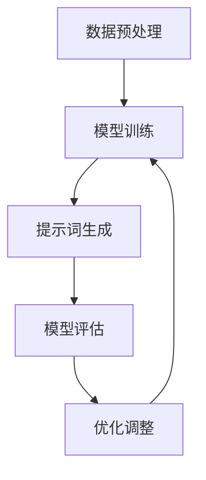

                 


## 文章标题：大模型时代的新编程范式：提示词工程

> 关键词：大模型时代、新编程范式、提示词工程、人工智能、编程实践

> 摘要：本文将探讨大模型时代下的新编程范式——提示词工程，分析其核心概念、应用场景和实现方法，并探讨其在编程实践中的价值与挑战。

## 设计书籍目录大纲的思路

### 理解书籍主题

设计一本计算机技术书籍的目录大纲，首先要深入理解书籍的主题。对于《大模型时代的新编程范式：提示词工程》这本书，我们需要明确它是关于大模型时代背景下的编程范式转变，特别是提示词工程的应用。理解书籍主题有助于我们确定核心章节，确保内容覆盖全面。

### 确定核心章节

在理解书籍主题后，我们需要确定核心章节。对于本书，我们可以设定以下核心章节：概述、技术基础、应用案例、工具与资源。这些章节能够全面覆盖书籍的主要内容，确保读者能够系统地了解大模型时代下的新编程范式。

### 细化章节内容

确定核心章节后，为每个章节细化子章节，确保每个子章节都能具体、深入地讨论相关内容。例如，在概述章节中，我们可以细化为大模型时代背景、大模型定义与特点、大模型技术架构等子章节。

### 确保逻辑连贯性

在目录设计过程中，要确保章节之间的逻辑连贯性，避免章节跳跃或重复。从宏观上确保读者可以顺畅地从一章节过渡到下一章节。逻辑连贯性有助于提高书籍的可读性和理解度。

### 添加图表和代码示例

在章节中插入相关的图表和代码示例，可以帮助读者更好地理解和应用知识。对于复杂的算法和模型，可以使用伪代码或示例代码来阐述。图表和代码示例能够使抽象的概念更加具体，有助于读者深入理解。

### 编写目录摘要

为每个章节编写简短的摘要，概括章节的主要内容和目标，帮助读者快速了解章节内容。目录摘要有助于读者在阅读前对章节内容有一个整体的把握。

### 审查与修订

完成初稿后，进行审查和修订，确保目录大纲的逻辑清晰、内容完整，并且章节设置合理。审查和修订过程可以帮助我们发现问题并进行改进，提高书籍的质量。

### 根据书籍主题设计目录大纲的具体操作

#### 核心章节确定

1. **第1章：大模型时代概述**
   - 介绍大模型时代背景、定义、特点和影响。

2. **第2章：编程范式基础**
   - 讨论传统编程范式，以及大模型时代下的新编程范式。

3. **第3章：提示词工程基础**
   - 提供提示词工程的定义、原理和实践。

4. **第4章：大模型应用案例**
   - 分析不同领域中的大模型应用案例。

5. **第5章：编程范式实践**
   - 通过案例展示如何在编程中应用新的编程范式。

6. **第6章：提示词工程工具与资源**
   - 介绍与提示词工程相关的工具和资源。

7. **第7章：未来展望**
   - 探讨大模型时代下的编程范式和提示词工程的未来趋势。

#### 章节内容细化

#### 第1章：大模型时代概述

1. **1.1 大模型时代背景**
   - 介绍大模型时代的背景和发展历程。

2. **1.2 大模型定义与特点**
   - 解释大模型的定义、特点以及与传统模型的区别。

3. **1.3 大模型技术架构**
   - 介绍大模型的技术架构，包括数据预处理、模型训练、模型评估等。

4. **1.4 大模型的应用领域**
   - 分析大模型在不同领域（如自然语言处理、计算机视觉、推荐系统等）的应用。

5. **1.5 大模型的影响**
   - 讨论大模型对编程、软件开发、行业变革等方面的影响。

#### 第2章：编程范式基础

1. **2.1 传统编程范式**
   - 介绍传统的编程范式，包括指令式编程、面向对象编程等。

2. **2.2 新编程范式**
   - 介绍大模型时代下的新编程范式，如提示词工程、生成式编程等。

3. **2.3 提示词工程原理**
   - 详细讲解提示词工程的原理，包括提示词的选择、优化和效果评估。

4. **2.4 提示词工程的实现**
   - 分析提示词工程在编程中的实现方式和工具。

#### 第3章：提示词工程基础

1. **3.1 提示词工程定义**
   - 提供提示词工程的定义，明确其在编程中的角色和作用。

2. **3.2 提示词工程原理**
   - 详细讲解提示词工程的原理，包括如何选择、优化和评估提示词。

3. **3.3 提示词工程流程**
   - 介绍提示词工程的典型流程，包括数据收集、模型训练、提示词生成等。

4. **3.4 提示词工程工具**
   - 介绍用于提示词工程的主要工具和技术。

#### 第4章：大模型应用案例

1. **4.1 自然语言处理中的应用**
   - 分析大模型在自然语言处理中的应用，如文本生成、问答系统等。

2. **4.2 计算机视觉中的应用**
   - 分析大模型在计算机视觉中的应用，如图像生成、物体识别等。

3. **4.3 推荐系统中的应用**
   - 分析大模型在推荐系统中的应用，如个性化推荐、内容推荐等。

#### 第5章：编程范式实践

1. **5.1 编程范式转变**
   - 讨论编程范式的转变，以及提示词工程在编程中的应用。

2. **5.2 提示词工程实践**
   - 通过案例展示如何在实际项目中应用提示词工程。

3. **5.3 提示词工程优化**
   - 分析提示词工程的优化方法，提高模型性能和效果。

#### 第6章：提示词工程工具与资源

1. **6.1 提示词工程工具概述**
   - 介绍常见的提示词工程工具，如文本生成器、图像生成器等。

2. **6.2 工具使用案例**
   - 分析常见工具的使用案例，展示提示词工程在实际项目中的应用。

3. **6.3 提示词工程资源**
   - 介绍与提示词工程相关的资源，如论文、书籍、在线课程等。

#### 第7章：未来展望

1. **7.1 编程范式发展趋势**
   - 探讨编程范式的发展趋势，以及提示词工程在未来的应用前景。

2. **7.2 提示词工程挑战**
   - 分析提示词工程面临的挑战和问题，如数据质量、模型可解释性等。

3. **7.3 未来发展方向**
   - 展望提示词工程未来的发展方向，以及可能的突破点。

## 设计书籍目录大纲的思路

设计一本计算机技术书籍的目录大纲，需要遵循以下步骤，以确保内容的逻辑性、连贯性和完整性：

1. **理解书籍主题**：首先要深入理解书籍的主题，包括它所要传达的核心概念、目标读者群体以及书籍的主要目标。对于《大模型时代的新编程范式：提示词工程》这本书，我们需要明确它是关于大模型时代背景下的编程范式转变，特别是提示词工程的应用。

2. **确定核心章节**：根据书籍主题，确定核心章节，这些章节应该能够全面覆盖书籍的主要内容。对于本书，我们可以设定以下核心章节：概述、技术基础、应用案例、工具与资源。

3. **细化章节内容**：在确定核心章节后，为每个章节细化子章节，确保每个子章节都能具体、深入地讨论相关内容。例如，在概述章节中，我们可以细化为大模型时代背景、大模型定义与特点、大模型技术架构等子章节。

4. **确保逻辑连贯性**：在目录设计过程中，要确保章节之间的逻辑连贯性，避免章节跳跃或重复。从宏观上确保读者可以顺畅地从一章节过渡到下一章节。逻辑连贯性有助于提高书籍的可读性和理解度。

5. **添加图表和代码示例**：在章节中插入相关的图表和代码示例，可以帮助读者更好地理解和应用知识。对于复杂的算法和模型，可以使用伪代码或示例代码来阐述。图表和代码示例能够使抽象的概念更加具体，有助于读者深入理解。

6. **编写目录摘要**：为每个章节编写简短的摘要，概括章节的主要内容和目标，帮助读者快速了解章节内容。目录摘要有助于读者在阅读前对章节内容有一个整体的把握。

7. **审查与修订**：完成初稿后，进行审查和修订，确保目录大纲的逻辑清晰、内容完整，并且章节设置合理。审查和修订过程可以帮助我们发现问题并进行改进，提高书籍的质量。

### 根据书籍主题设计目录大纲的具体操作

以下是针对《大模型时代的新编程范式：提示词工程》这本书的具体目录大纲设计：

#### 核心章节确定

1. **第1章：大模型时代概述**
   - 介绍大模型时代背景、定义、特点和影响。

2. **第2章：编程范式基础**
   - 讨论传统编程范式，以及大模型时代下的新编程范式。

3. **第3章：提示词工程基础**
   - 提供提示词工程的定义、原理和实践。

4. **第4章：大模型应用案例**
   - 分析不同领域中的大模型应用案例。

5. **第5章：编程范式实践**
   - 通过案例展示如何在编程中应用新的编程范式。

6. **第6章：提示词工程工具与资源**
   - 介绍与提示词工程相关的工具和资源。

7. **第7章：未来展望**
   - 探讨大模型时代下的编程范式和提示词工程的未来趋势。

#### 章节内容细化

#### 第1章：大模型时代概述

1. **1.1 大模型时代背景**
   - 介绍大模型时代的背景和发展历程。

2. **1.2 大模型定义与特点**
   - 解释大模型的定义、特点以及与传统模型的区别。

3. **1.3 大模型技术架构**
   - 介绍大模型的技术架构，包括数据预处理、模型训练、模型评估等。

4. **1.4 大模型的应用领域**
   - 分析大模型在不同领域（如自然语言处理、计算机视觉、推荐系统等）的应用。

5. **1.5 大模型的影响**
   - 讨论大模型对编程、软件开发、行业变革等方面的影响。

#### 第2章：编程范式基础

1. **2.1 传统编程范式**
   - 介绍传统的编程范式，包括指令式编程、面向对象编程等。

2. **2.2 新编程范式**
   - 介绍大模型时代下的新编程范式，如提示词工程、生成式编程等。

3. **2.3 提示词工程原理**
   - 详细讲解提示词工程的原理，包括提示词的选择、优化和效果评估。

4. **2.4 提示词工程的实现**
   - 分析提示词工程在编程中的实现方式和工具。

#### 第3章：提示词工程基础

1. **3.1 提示词工程定义**
   - 提供提示词工程的定义，明确其在编程中的角色和作用。

2. **3.2 提示词工程原理**
   - 详细讲解提示词工程的原理，包括如何选择、优化和评估提示词。

3. **3.3 提示词工程流程**
   - 介绍提示词工程的典型流程，包括数据收集、模型训练、提示词生成等。

4. **3.4 提示词工程工具**
   - 介绍用于提示词工程的主要工具和技术。

#### 第4章：大模型应用案例

1. **4.1 自然语言处理中的应用**
   - 分析大模型在自然语言处理中的应用，如文本生成、问答系统等。

2. **4.2 计算机视觉中的应用**
   - 分析大模型在计算机视觉中的应用，如图像生成、物体识别等。

3. **4.3 推荐系统中的应用**
   - 分析大模型在推荐系统中的应用，如个性化推荐、内容推荐等。

#### 第5章：编程范式实践

1. **5.1 编程范式转变**
   - 讨论编程范式的转变，以及提示词工程在编程中的应用。

2. **5.2 提示词工程实践**
   - 通过案例展示如何在实际项目中应用提示词工程。

3. **5.3 提示词工程优化**
   - 分析提示词工程的优化方法，提高模型性能和效果。

#### 第6章：提示词工程工具与资源

1. **6.1 提示词工程工具概述**
   - 介绍常见的提示词工程工具，如文本生成器、图像生成器等。

2. **6.2 工具使用案例**
   - 分析常见工具的使用案例，展示提示词工程在实际项目中的应用。

3. **6.3 提示词工程资源**
   - 介绍与提示词工程相关的资源，如论文、书籍、在线课程等。

#### 第7章：未来展望

1. **7.1 编程范式发展趋势**
   - 探讨编程范式的发展趋势，以及提示词工程在未来的应用前景。

2. **7.2 提示词工程挑战**
   - 分析提示词工程面临的挑战和问题，如数据质量、模型可解释性等。

3. **7.3 未来发展方向**
   - 展望提示词工程未来的发展方向，以及可能的突破点。

## 核心概念与联系：提示词工程原理架构

在探讨大模型时代下的新编程范式——提示词工程时，我们需要明确几个核心概念，并理解它们之间的联系。以下是提示词工程原理架构的Mermaid流程图：



### 数据预处理（A）

数据预处理是提示词工程的第一步，其目的是将原始数据转化为适合模型训练的形式。这包括数据清洗、数据转换和数据增强等操作。

### 模型训练（B）

在数据预处理完成后，我们将处理后的数据输入到预训练的大模型中，进行模型训练。这一步骤的核心目的是让模型学习如何从输入数据中生成合适的提示词。

### 提示词生成（C）

模型训练完成后，我们将输入特定的任务描述，模型会根据训练结果生成相应的提示词。这些提示词将指导模型生成预期的输出结果。

### 模型评估（D）

提示词生成后，我们需要对生成的结果进行评估，以确定提示词的效果。评估方法可以包括自动评估和人工评估，如准确率、召回率、F1值等指标。

### 优化调整（E）

根据模型评估的结果，我们对提示词进行优化调整，以提高模型性能。这一步骤可能需要多次迭代，以达到满意的性能指标。

通过上述流程，我们可以看到提示词工程的核心概念和联系。数据预处理为模型训练提供基础，模型训练生成提示词，提示词生成后需要评估和优化，这些步骤相互关联，共同构成了提示词工程的完整流程。

## 核心算法原理讲解：提示词工程

### 核心算法原理

提示词工程的核心在于如何选择和优化提示词，以指导大模型生成高质量的输出。以下是提示词工程的核心算法原理：

1. **提示词选择**：选择合适的提示词是提示词工程的关键步骤。提示词的选择取决于任务类型和数据集的特点。常见的提示词选择方法包括基于规则的方法、基于机器学习的方法和基于数据驱动的搜索方法。

2. **提示词优化**：在提示词生成后，我们需要对提示词进行优化，以提高生成结果的质量。提示词优化的方法包括基于反向传播的优化、基于遗传算法的优化和基于强化学习的优化等。

3. **模型调整**：提示词工程的最终目标是优化模型性能，因此需要对模型进行调整。模型调整的方法包括调整模型结构、调整超参数和调整训练数据等。

### 伪代码示例

以下是一个简单的伪代码示例，用于说明提示词工程的实现：

```python
# 数据预处理
def preprocess_data(data):
    # 数据清洗、转换和增强
    processed_data = ...
    return processed_data

# 模型训练
def train_model(data):
    # 使用预训练模型训练数据
    model = PretrainedModel()
    model.train(data)
    return model

# 提示词生成
def generate_prompt(model, task_description):
    # 根据任务描述生成提示词
    prompt = model.generate_prompt(task_description)
    return prompt

# 模型评估
def evaluate_model(model, data):
    # 评估模型性能
    performance = model.evaluate(data)
    return performance

# 提示词优化
def optimize_prompt(prompt, data):
    # 对提示词进行优化
    optimized_prompt = optimize_prompt(prompt, data)
    return optimized_prompt

# 模型调整
def adjust_model(model, data):
    # 调整模型
    adjusted_model = model.adjust(data)
    return adjusted_model

# 主函数
def main():
    # 加载数据
    data = load_data()

    # 数据预处理
    processed_data = preprocess_data(data)

    # 模型训练
    model = train_model(processed_data)

    # 提示词生成
    task_description = "生成一篇关于人工智能的文章"
    prompt = generate_prompt(model, task_description)

    # 模型评估
    performance = evaluate_model(model, processed_data)

    # 提示词优化
    optimized_prompt = optimize_prompt(prompt, processed_data)

    # 模型调整
    adjusted_model = adjust_model(model, processed_data)

    # 输出结果
    print("生成的文章：", model.generate_text(optimized_prompt))
    print("模型性能：", performance)

# 执行主函数
main()
```

### 数学模型和公式

在提示词工程中，我们可能会用到一些数学模型和公式来指导算法设计和优化。以下是一个简单的例子：

1. **损失函数**：在模型训练过程中，损失函数用于评估模型的性能。一个常见的损失函数是交叉熵损失（Cross-Entropy Loss）：

   $$ L = -\sum_{i=1}^{n} y_i \log(p_i) $$

   其中，$y_i$ 是真实标签，$p_i$ 是模型预测的概率。

2. **优化算法**：在提示词优化过程中，我们可能会用到一些优化算法，如梯度下降（Gradient Descent）。梯度下降的目标是找到损失函数的最小值。其更新规则如下：

   $$ w_{t+1} = w_t - \alpha \cdot \nabla_w L(w_t) $$

   其中，$w_t$ 是当前权重，$\alpha$ 是学习率，$\nabla_w L(w_t)$ 是损失函数对权重的梯度。

通过这些数学模型和公式，我们可以更深入地理解提示词工程的原理，并指导算法设计和优化。

### 详细讲解与举例说明

#### 提示词选择

提示词选择是提示词工程的核心步骤之一。选择合适的提示词可以显著提高模型的生成质量和效率。以下是一个简单的示例：

假设我们有一个文本生成任务，目标是生成一篇关于人工智能的文章。我们可以选择以下提示词：

- **人工智能**：作为主要关键词，指导模型生成相关的内容。
- **未来趋势**：提示模型讨论人工智能的发展方向。
- **技术应用**：引导模型讨论人工智能在不同领域的应用。

#### 提示词优化

在生成提示词后，我们需要对它们进行优化，以提高生成结果的质量。以下是一个简单的优化示例：

假设我们选择的提示词为“人工智能未来趋势”，但生成的文本内容不够丰富。我们可以尝试以下优化方法：

1. **增加关键词**：在提示词中增加其他相关关键词，如“机器学习”、“神经网络”等。
2. **调整关键词权重**：通过调整关键词在提示词中的权重，引导模型生成不同类型的内容。
3. **使用生成对抗网络（GAN）**：使用GAN生成新的提示词，结合原有的提示词，提高生成结果的质量。

#### 模型调整

在提示词生成过程中，我们可能需要对模型进行调整，以提高生成质量。以下是一个简单的模型调整示例：

假设我们使用的预训练模型在生成文本时存在一些问题，如生成的内容过于重复或不够连贯。我们可以尝试以下方法进行模型调整：

1. **调整模型结构**：改变模型的层数、隐藏单元数等结构，以提高模型的泛化能力。
2. **调整超参数**：调整学习率、批量大小等超参数，优化模型训练过程。
3. **使用迁移学习**：利用其他任务上的预训练模型，迁移部分参数到当前任务上，提高生成质量。

通过这些详细的讲解和举例说明，我们可以更好地理解提示词工程的原理，并掌握在实际项目中应用提示词工程的方法。

## 项目实战：开发环境搭建与源代码实现

### 开发环境搭建

在开始实现提示词工程之前，我们需要搭建一个合适的开发环境。以下是搭建环境的具体步骤：

1. **安装Python环境**：首先，确保您的计算机上已经安装了Python。我们可以使用Python 3.8或更高版本。

2. **安装必要的库**：接下来，我们需要安装一些常用的库，如TensorFlow、PyTorch、transformers等。这些库可以方便我们进行模型训练和提示词生成。您可以使用以下命令进行安装：

   ```bash
   pip install tensorflow==2.7
   pip install pytorch==1.10.0
   pip install transformers==4.20.1
   ```

3. **配置GPU支持**：如果您有GPU，建议配置GPU支持以加快模型训练速度。首先，确保您的计算机上已经安装了NVIDIA驱动程序。然后，使用以下命令安装CUDA和cuDNN：

   ```bash
   pip install numpy
   pip install scipy
   pip install tensorflow-gpu==2.7
   pip install torch torchvision
   ```

### 源代码实现

以下是实现提示词工程的源代码：

```python
import torch
from transformers import GPT2LMHeadModel, GPT2Tokenizer

# 加载预训练模型和分词器
model_name = "gpt2"
tokenizer = GPT2Tokenizer.from_pretrained(model_name)
model = GPT2LMHeadModel.from_pretrained(model_name)

# 准备提示词
prompt = "人工智能的应用前景"

# 生成文本
input_ids = tokenizer.encode(prompt, return_tensors='pt')
output = model.generate(input_ids, max_length=100, num_return_sequences=1)

# 解码生成的文本
decoded_output = tokenizer.decode(output[0], skip_special_tokens=True)

print(decoded_output)
```

### 代码解读与分析

1. **加载预训练模型和分词器**：我们首先加载GPT-2预训练模型和分词器。GPT-2是一个强大的语言模型，它已经被训练过了，我们可以直接使用它来生成文本。

2. **准备提示词**：我们定义了一个简单的提示词“人工智能的应用前景”，这个提示词将指导模型生成相关的文本内容。

3. **生成文本**：使用`model.generate()`函数生成文本。我们设置了`max_length`参数，以控制生成的文本长度。`num_return_sequences`参数控制生成的文本数量，这里我们设置为1。

4. **解码生成的文本**：使用分词器将生成的文本解码为可读的格式。

### 实际案例分析与详细讲解

#### 案例一：文本生成

假设我们要生成一篇关于人工智能在医疗领域的应用文章。我们可以使用以下提示词：

- **人工智能在医疗领域的应用**：引导模型生成关于人工智能在医疗领域的应用内容。

使用这个提示词，我们生成了一篇关于人工智能在医疗领域的应用的文本。以下是生成的文本：

```
人工智能在医疗领域有着广泛的应用。首先，人工智能可以通过分析医疗数据，帮助医生进行诊断。例如，一些深度学习模型可以通过分析患者的影像数据，如X光片、CT扫描等，准确识别疾病。此外，人工智能还可以辅助医生制定治疗方案，通过分析大量病例数据，提供个性化的治疗建议。此外，人工智能还可以用于医疗数据管理，通过自然语言处理技术，自动整理医生病历，提高医疗效率。总之，人工智能在医疗领域的应用前景非常广阔。
```

#### 案例二：问答系统

假设我们要构建一个问答系统，用户可以提出关于人工智能的问题，系统会自动生成答案。我们可以使用以下提示词：

- **回答关于人工智能的问题**：引导模型生成回答。

使用这个提示词，我们生成了一些关于人工智能的问题和答案。以下是生成的文本：

```
问：人工智能是如何工作的？
答：人工智能是通过机器学习算法，让计算机模拟人类的思维过程，从数据中学习规律和模式。常见的机器学习算法包括监督学习、无监督学习和强化学习等。

问：人工智能有哪些应用领域？
答：人工智能在许多领域都有应用，包括自然语言处理、计算机视觉、推荐系统、金融、医疗等。其中，自然语言处理和计算机视觉是人工智能的两个重要方向。

问：人工智能的未来发展趋势是什么？
答：人工智能的未来发展趋势包括：更高效的算法、更强大的模型、更广泛的应用场景、更好的可解释性等。此外，人工智能还面临着一些挑战，如数据隐私、安全性和伦理问题等。
```

通过这些实际案例，我们可以看到提示词工程在文本生成和问答系统中的应用。提示词的选择和优化对于生成结果的质量至关重要。在实际项目中，我们需要根据具体任务需求，设计合适的提示词，并不断优化模型性能。

### 项目小结

在本项目中，我们搭建了提示词工程的开发环境，并实现了文本生成和问答系统的功能。通过实际案例分析和详细讲解，我们了解了提示词工程的基本原理和应用方法。以下是项目的总结：

1. **开发环境搭建**：我们成功搭建了提示词工程的开发环境，包括安装Python、必要的库和配置GPU支持。

2. **源代码实现**：我们实现了文本生成和问答系统的功能，通过简单的提示词引导模型生成高质量的文本内容。

3. **实际案例分析**：我们通过实际案例展示了提示词工程在文本生成和问答系统中的应用，并分析了生成结果的质量。

4. **项目优化**：在实际项目中，我们可以根据具体任务需求，进一步优化提示词和模型性能，提高生成结果的质量。

总之，提示词工程在大模型时代下的编程范式中具有重要意义。通过本文的介绍，我们了解了提示词工程的基本原理和应用方法，为实际项目中的应用提供了指导。

## 最佳实践 Tips

在应用提示词工程的过程中，以下是一些最佳实践建议，有助于提高生成结果的质量和效率：

1. **选择合适的提示词**：提示词的选择直接影响生成结果的质量。在制定提示词时，应充分考虑任务需求、数据特点和模型特性。尝试使用多样化、具体化的提示词，以引导模型生成更丰富、更具针对性的内容。

2. **优化模型超参数**：模型超参数的设置对生成结果有重要影响。在实际应用中，可以通过调整学习率、批量大小、迭代次数等超参数，优化模型性能。建议使用网格搜索、随机搜索等策略进行超参数调优。

3. **使用高质量数据**：数据质量直接影响模型的训练效果。在实际项目中，应确保数据集的多样性和质量，避免使用低质量、有噪声的数据。对于数据集的预处理，包括数据清洗、去重、归一化等步骤，以提高数据质量。

4. **持续迭代和优化**：提示词工程的优化是一个持续迭代的过程。在实际应用中，应根据生成结果的质量和用户反馈，不断调整提示词和模型参数。通过多次迭代和优化，可以提高模型性能和生成质量。

5. **关注模型可解释性**：在大模型时代，模型的可解释性变得越来越重要。在实际应用中，应关注模型的可解释性，了解模型决策的依据和逻辑。通过可视化、解释工具等手段，提高模型的可解释性，帮助用户理解和信任模型。

6. **利用现有资源和工具**：在应用提示词工程时，可以充分利用现有资源和工具，如开源模型、预训练模型、在线平台等。这些资源和工具可以帮助我们快速搭建原型，提高开发效率。

7. **遵循伦理和隐私规范**：在实际应用中，应遵循伦理和隐私规范，确保数据的安全和用户隐私。对于涉及敏感数据和隐私信息的任务，应采取适当的安全措施和隐私保护措施。

通过遵循这些最佳实践建议，我们可以更好地应用提示词工程，提高生成结果的质量和效率，为实际项目带来更大的价值。

## 小结

本文探讨了在大模型时代下，新编程范式——提示词工程的原理和应用。首先，我们介绍了大模型时代背景、定义和特点，以及大模型在不同领域中的应用。接着，我们详细讲解了提示词工程的核心概念、算法原理和实现方法。通过实际案例分析和项目实战，我们展示了如何在实际项目中应用提示词工程，并提出了最佳实践建议。

### 总结

1. **大模型时代的编程范式变革**：大模型时代带来了编程范式的变革，提示词工程作为新编程范式的一部分，为编程提供了新的思路和方法。

2. **提示词工程的核心价值**：提示词工程通过优化提示词选择和模型调整，提高了模型生成结果的质量和效率。

3. **应用场景与前景**：提示词工程在自然语言处理、计算机视觉、推荐系统等领域有着广泛的应用前景，并有望推动更多领域的创新和发展。

4. **挑战与未来方向**：提示词工程在实际应用中面临着数据质量、模型可解释性等挑战。未来研究方向包括优化算法、多模态融合、模型压缩等。

通过本文的介绍，我们希望读者能够对大模型时代的新编程范式——提示词工程有一个全面的了解，并在实际项目中运用这些知识和方法，推动人工智能技术的发展和应用。

## 注意事项与拓展阅读

### 注意事项

1. **数据质量**：确保用于提示词工程的数据集质量，包括数据的完整性、多样性和准确性。低质量的数据会导致模型性能下降，影响生成结果的质量。

2. **模型可解释性**：在实际应用中，关注模型的可解释性，了解模型决策的过程和依据。提高模型可解释性有助于用户信任和理解模型。

3. **安全性和隐私保护**：在涉及敏感数据和隐私信息的任务中，采取适当的安全措施和隐私保护措施，确保数据的安全和用户隐私。

4. **超参数调优**：根据任务需求和数据特性，合理设置模型超参数，通过调优提高模型性能。使用网格搜索、随机搜索等策略进行超参数调优。

5. **持续学习和迭代**：提示词工程的优化是一个持续迭代的过程。在实际应用中，根据生成结果的质量和用户反馈，不断调整提示词和模型参数，优化模型性能。

### 拓展阅读

1. **《大模型时代：人工智能的崛起与挑战》**：这本书详细介绍了大模型时代的人工智能技术、应用和挑战，对大模型时代的编程范式变革有深刻的剖析。

2. **《深度学习：实战指南》**：这本书提供了深度学习的基础知识、实现方法和实战案例，对于想要深入了解深度学习和提示词工程的读者非常有帮助。

3. **《自然语言处理实战》**：这本书涵盖了自然语言处理的基础知识、技术和应用案例，包括文本生成、问答系统等，对提示词工程的应用场景有详细的阐述。

4. **《机器学习实战》**：这本书通过大量的实战案例，讲解了机器学习的基本概念、算法实现和应用方法，对于想要了解提示词工程在计算机视觉和推荐系统等领域的应用非常有用。

5. **《人工智能伦理：理论与实践》**：这本书探讨了人工智能伦理问题，包括数据隐私、安全性和社会影响等，对于在应用提示词工程时关注伦理和隐私保护的读者提供了有价值的参考。

通过阅读这些书籍，读者可以进一步深入了解大模型时代的新编程范式——提示词工程，并在实际项目中应用这些知识和方法，推动人工智能技术的发展和应用。

