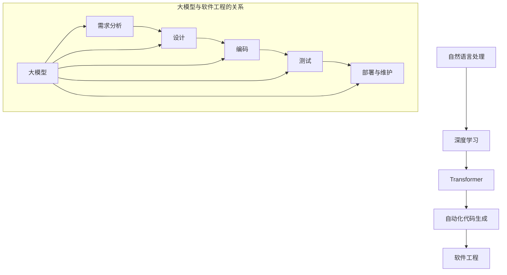

                 

## 大模型时代的软件工程方法论

### 关键词：大模型、软件工程、深度学习、人工智能、Transformer、GPT

#### 摘要：
随着人工智能技术的飞速发展，特别是大模型技术的崛起，软件工程领域正经历一场深刻的变革。本文旨在探讨大模型时代对软件工程方法论的影响，从核心概念、算法原理、数学模型、项目实践等多个角度，详细解析大模型在软件开发、测试和项目管理中的应用，并对未来的发展趋势进行展望。通过本文，读者将能够全面了解大模型时代软件工程的核心技术和实践方法，从而为自身的软件开发工作提供理论指导和实践参考。

## 引言

### 软件工程的演变与挑战

软件工程作为一门学科，自诞生以来，经历了多次重要变革。从传统的结构化编程到面向对象编程，从瀑布模型到敏捷开发，每一个阶段都标志着软件工程理论的进步和实践的成熟。然而，随着信息技术的飞速发展，软件工程领域也面临着前所未有的挑战。尤其是近年来，人工智能技术的迅猛发展，特别是深度学习和大模型技术的崛起，使得软件工程的现状和未来都发生了深刻的变化。

大模型，通常指的是拥有数亿到数千亿参数的神经网络模型，如GPT（Generative Pre-trained Transformer）系列模型。这些模型具有强大的表示和学习能力，能够处理复杂的任务，如自然语言处理、图像识别、语音识别等。大模型的出现，不仅改变了人工智能领域的格局，也对软件工程方法论产生了深远的影响。

首先，大模型的引入使得软件开发的方式发生了变化。传统的软件开发依赖于工程师手动编写代码，而大模型的出现使得代码自动生成成为可能。其次，大模型的强大学习能力，使得软件测试和优化变得更加高效和精准。此外，大模型在项目管理中的应用，也为软件工程师提供了新的工具和方法，提高了项目的管理效率和质量。

总的来说，大模型时代对软件工程的影响是深远且全面的。它不仅改变了软件开发的方式，也对软件工程的各个环节提出了新的挑战和机遇。本文将从大模型与软件工程的联系、核心算法原理、数学模型、项目实践等多个方面，详细探讨大模型时代软件工程方法论的新趋势和新方法。

### 大模型与软件工程的关系

大模型技术的崛起，对软件工程产生了深远的影响。首先，大模型在软件开发中的应用，使得传统的软件开发模式发生了根本性的变化。传统的软件开发通常需要开发者手动编写大量的代码，而大模型的出现，使得代码自动生成成为可能。这一变革不仅提高了开发效率，还减少了人力成本和错误率。

#### 1.1 代码自动生成

大模型在代码自动生成方面的应用，主要体现在自然语言处理（NLP）领域。通过预训练的大模型，如GPT系列模型，可以理解开发者输入的自然语言描述，并生成相应的代码。例如，开发者可以用自然语言描述一个功能需求，大模型则能够自动生成实现该功能的代码。这一过程不仅减少了手动编写代码的繁琐工作，还提高了代码的准确性和一致性。

```python
# 示例：使用GPT-3生成Python代码
import openai

response = openai.Completion.create(
  engine="text-davinci-002",
  prompt="编写一个Python函数，用于计算两个数的和。",
  max_tokens=30
)

print(response.choices[0].text.strip())
```

上述代码使用OpenAI的GPT-3模型，根据输入的自然语言描述，生成了一个Python函数，用于计算两个数的和。

#### 1.2 软件开发效率提升

大模型的应用，不仅改变了软件开发的方式，还显著提高了开发效率。传统的软件开发流程中，需求分析、设计、编码、测试等环节通常需要大量时间和人力投入。而大模型能够自动化这些环节中的部分工作，使得开发者能够专注于更高层次的任务。例如，大模型可以自动生成测试用例，从而减少测试阶段的工作量。

此外，大模型在代码优化和重构方面也有显著优势。通过分析代码的语义和结构，大模型能够提出优化的建议，甚至自动重构代码，提高其可读性和可维护性。例如，Facebook的Pencil代码优化工具，就是基于大模型技术，用于自动优化和重构Java代码。

#### 1.3 软件工程挑战与机遇

尽管大模型在软件开发中展示了巨大的潜力，但也带来了新的挑战。首先，大模型的训练和部署需要大量的计算资源和数据，这对硬件和软件基础设施提出了更高的要求。其次，大模型的黑箱特性使得其决策过程难以解释和理解，这对软件工程中的可解释性和透明性提出了挑战。

然而，这些挑战也带来了新的机遇。通过结合大模型和软件工程的方法论，工程师们可以开发出更加智能、高效的软件系统。例如，基于大模型的自动化测试和缺陷预测工具，可以显著提高软件的质量和可靠性。此外，大模型在软件项目管理中的应用，也为项目管理和决策提供了新的工具和方法。

总的来说，大模型技术的引入，不仅改变了软件开发的模式，也为软件工程方法论带来了新的思路和工具。通过合理利用大模型技术，工程师们可以开发出更加智能、高效、可靠的软件系统，从而应对日益复杂的应用需求。

### 核心概念与联系

在探讨大模型与软件工程的联系时，我们需要明确一些核心概念，并展示它们之间的关系架构。以下是一些关键概念及其定义：

#### 1.1.1 自然语言处理（NLP）

自然语言处理（NLP）是计算机科学和人工智能领域的一个分支，致力于让计算机理解和解释人类语言。它包括文本分类、情感分析、命名实体识别、机器翻译等多个子领域。

#### 1.1.2 深度学习

深度学习是一种基于多层神经网络的学习方法，能够通过大量数据自动提取特征，并在各种任务中表现出色。深度学习广泛应用于图像识别、语音识别、自然语言处理等领域。

#### 1.1.3 Transformer

Transformer是一种用于自然语言处理的深度学习模型，其核心思想是使用自注意力机制来捕捉输入序列中的长距离依赖关系。Transformer模型广泛应用于大规模语言模型（如GPT）和机器翻译任务中。

#### 1.1.4 自动化代码生成

自动化代码生成是指使用人工智能技术，如深度学习，自动生成代码。这种技术可以显著提高开发效率，减少重复性工作，并在代码质量和一致性方面提供保障。

#### 1.1.5 软件工程

软件工程是指使用系统化的方法、技术和工具来设计、开发、测试和维护软件系统。软件工程涵盖了需求分析、设计、编码、测试、部署和维护等多个环节。

#### 1.2 关系架构

为了展示这些核心概念之间的关系，我们可以使用Mermaid流程图来描述它们之间的交互和影响。



上述Mermaid流程图展示了大模型（K）与软件工程（E）的各个环节（F、G、H、I、J）之间的联系。大模型不仅能够提升需求分析、设计、编码、测试等环节的效率和质量，还能够在整个软件生命周期中提供持续的支持和优化。

通过这种关系架构的展示，我们可以清晰地看到大模型在软件工程中的应用和潜力，从而更好地理解和利用大模型技术，推动软件工程的发展。

### 核心算法原理讲解

#### 深度学习基础

深度学习是人工智能的一个重要分支，其核心思想是通过构建多层神经网络，对数据进行特征提取和模式识别。深度学习模型通常由输入层、隐藏层和输出层组成。每个层由多个神经元（或节点）组成，神经元之间通过权重和偏置进行连接。通过训练，模型能够自动调整权重和偏置，使其对特定任务的表现最优。

在深度学习中，常用的算法包括反向传播算法（Backpropagation）和优化算法（如随机梯度下降SGD、Adam等）。反向传播算法是一种用于计算神经网络输出误差并更新权重和偏置的算法。优化算法则用于加速模型收敛和提高训练效率。

#### Transformer架构

Transformer是近年来在自然语言处理领域取得突破性成果的一种深度学习模型。其核心思想是使用自注意力机制（Self-Attention）来捕捉输入序列中的长距离依赖关系。这种机制使得模型能够更好地理解和生成序列数据。

Transformer架构主要由编码器（Encoder）和解码器（Decoder）组成。编码器用于将输入序列编码为固定长度的向量，解码器则用于根据编码器的输出生成目标序列。在编码器和解码器中，自注意力机制和多头注意力机制被广泛应用，以实现高效的序列建模和推理。

以下是一个简单的Transformer编码器和解码器的伪代码：

```python
# Transformer编码器伪代码
class EncoderLayer(nn.Module):
    def __init__(self, d_model, nhead, dim_feedforward=2048, dropout=0.1):
        super(EncoderLayer, self).__init__()
        self.self_attn = MultiheadAttention(d_model, nhead, dropout=dropout)
        self.linear2 = nn.Linear(dim_feedforward, d_model)
        self.norm1 = nn.LayerNorm(d_model)
        self.norm2 = nn.LayerNorm(d_model)
        self.dropout = nn.Dropout(dropout)
        self.linear1 = nn.Linear(d_model, dim_feedforward)
    
    def forward(self, src, src_mask=None, src_key_padding_mask=None):
        # 自注意力机制
        src2 = self.self_attn(src, src, src, attn_mask=src_mask,
                                       key_padding_mask=src_key_padding_mask)
        src = src + self.dropout(src2)
        src = self.norm1(src)
        
        # 全连接层
        src2 = self.linear1(src)
        src2 = F.relu(src2)
        src2 = self.dropout(self.linear2(src2))
        src = src + self.dropout(src2)
        src = self.norm2(src)
        return src

# Transformer解码器伪代码
class DecoderLayer(nn.Module):
    def __init__(self, d_model, nhead, dim_feedforward=2048, dropout=0.1):
        super(DecoderLayer, self).__init__()
        self.self_attn = MultiheadAttention(d_model, nhead, dropout=dropout)
        self.linear2 = nn.Linear(dim_feedforward, d_model)
        self.norm1 = nn.LayerNorm(d_model)
        self.norm2 = nn.LayerNorm(d_model)
        self.dropout = nn.Dropout(dropout)
        self.linear1 = nn.Linear(d_model, dim_feedforward)
        self.cross_attn = MultiheadAttention(d_model, nhead, dropout=dropout)
        self.norm3 = nn.LayerNorm(d_model)
    
    def forward(self, tgt, memory, memory_mask=None, memory_key_padding_mask=None,
                tgt_mask=None, tgt_key_padding_mask=None):
        # 自注意力机制
        tgt2 = self.self_attn(tgt, tgt, tgt, attn_mask=tgt_mask,
                                      key_padding_mask=tgt_key_padding_mask)
        tgt = tgt + self.dropout(tgt2)
        tgt = self.norm1(tgt)
        
        # 交叉注意力机制
        tgt2 = self.cross_attn(tgt, memory, memory, attn_mask=memory_mask,
                                        key_padding_mask=memory_key_padding_mask)
        tgt = tgt + self.dropout(tgt2)
        tgt = self.norm2(tgt)
        
        # 全连接层
        tgt2 = self.linear1(tgt)
        tgt2 = F.relu(tgt2)
        tgt2 = self.dropout(self.linear2(tgt2))
        tgt = tgt + self.dropout(tgt2)
        tgt = self.norm3(tgt)
        return tgt
```

#### GPT系列模型

GPT（Generative Pre-trained Transformer）系列模型是基于Transformer架构的大型语言模型。GPT模型通过在大量文本数据上进行预训练，学习语言的模式和规律，从而能够生成高质量的文本。GPT系列模型包括GPT、GPT-2和GPT-3等，其中GPT-3具有极高的性能和创造力。

GPT模型的核心组件包括自注意力机制和预训练策略。自注意力机制使得模型能够捕捉输入序列中的长距离依赖关系，从而更好地理解和生成文本。预训练策略则通过在大量文本上进行训练，使模型具有强大的语言理解和生成能力。

以下是一个简化的GPT模型训练过程：

```python
# GPT模型训练伪代码
class GPTModel(nn.Module):
    def __init__(self, n_vocab, d_model, nhead, num_layers, dim_feedforward=2048):
        super(GPTModel, self).__init__()
        self.transformer = Transformer(d_model, nhead, num_layers,
                                       dim_feedforward)
        self.decoder = nn.Linear(d_model, n_vocab)
    
    def forward(self, src, tgt):
        out = self.transformer(src, tgt)
        out = self.decoder(out)
        return out
```

通过以上核心算法原理的讲解，我们可以看到大模型在深度学习领域的强大能力，以及其在软件工程中的应用潜力。这些算法不仅提供了强大的数据表示和学习能力，也为自动化代码生成、软件测试和优化等提供了理论基础和实践工具。

### 数学模型和数学公式

在大模型时代，数学模型和数学公式在软件工程中扮演着至关重要的角色。这些模型和公式不仅帮助我们理解和解释大模型的运作机制，还为我们提供了优化和改进模型的工具。

#### 1.1.1 自注意力机制

自注意力机制（Self-Attention）是Transformer模型的核心组件之一。其基本思想是计算输入序列中每个单词与其他单词的关联强度，并通过加权求和的方式生成一个表示向量。自注意力机制的数学公式如下：

$$
\text{Attention}(Q, K, V) = \text{softmax}\left(\frac{QK^T}{\sqrt{d_k}}\right)V
$$

其中，$Q$、$K$ 和 $V$ 分别表示查询向量、键向量和值向量，$d_k$ 是键向量的维度。这个公式计算了每个键向量 $K$ 与查询向量 $Q$ 的点积，然后通过softmax函数生成权重，最后将这些权重与值向量 $V$ 相乘，得到输出向量。

#### 1.1.2 Transformer模型中的多头注意力

多头注意力（Multi-Head Attention）是自注意力机制的扩展，它将输入序列分成多个子序列，每个子序列独立应用自注意力机制，然后将结果拼接起来。多头注意力的数学公式如下：

$$
\text{Multi-Head}\_\text{Attention}(Q, K, V) = \text{Concat}(\text{head}_1, \text{head}_2, \ldots, \text{head}_h)W^O
$$

其中，$h$ 表示头数，$\text{head}_i$ 表示第 $i$ 个头的结果，$W^O$ 是输出层的权重矩阵。

#### 1.1.3 深度学习中的优化算法

在大模型的训练过程中，优化算法至关重要。常用的优化算法包括随机梯度下降（SGD）、Adam等。以下分别介绍这两种优化算法的数学公式。

**随机梯度下降（SGD）**

随机梯度下降是一种简单的优化算法，其核心思想是利用梯度下降法更新模型参数。SGD的数学公式如下：

$$
\theta_{t+1} = \theta_{t} - \alpha \cdot \nabla_\theta J(\theta)
$$

其中，$\theta$ 表示模型参数，$J(\theta)$ 是损失函数，$\alpha$ 是学习率。

**Adam优化算法**

Adam优化算法是SGD的改进版本，它结合了SGD和动量方法的特点，具有更好的收敛速度和稳定性。Adam的数学公式如下：

$$
m_t = \beta_1 m_{t-1} + (1 - \beta_1) [g_t - \mu_t]
$$

$$
v_t = \beta_2 v_{t-1} + (1 - \beta_2) [g_t^2 - \mu_t^2]
$$

$$
\theta_{t+1} = \theta_{t} - \alpha \cdot \frac{m_t}{\sqrt{v_t} + \epsilon}
$$

其中，$m_t$ 和 $v_t$ 分别是梯度的一阶矩估计和二阶矩估计，$\beta_1$ 和 $\beta_2$ 是超参数，$\epsilon$ 是一个很小的常数，用于防止分母为零。

#### 1.1.4 举例说明

以下是一个简单的例子，用于说明自注意力机制的运算过程：

假设我们有一个四词序列：`<BOS> word1 word2 word3 <EOS>`，其中 `<BOS>` 和 `<EOS>` 分别表示序列的开始和结束标记。序列的嵌入向量维度为 $d=64$，我们使用一个单头注意力机制。

**1. 初始化查询向量 $Q$、键向量 $K$ 和值向量 $V$：**

$$
Q = \begin{bmatrix}
0.1 & 0.2 & 0.3 & 0.4 \\
0.5 & 0.6 & 0.7 & 0.8 \\
0.9 & 1.0 & 1.1 & 1.2 \\
1.3 & 1.4 & 1.5 & 1.6 \\
\end{bmatrix}, \quad
K = \begin{bmatrix}
0.1 & 0.2 & 0.3 & 0.4 \\
0.5 & 0.6 & 0.7 & 0.8 \\
0.9 & 1.0 & 1.1 & 1.2 \\
1.3 & 1.4 & 1.5 & 1.6 \\
\end{bmatrix}, \quad
V = \begin{bmatrix}
0.1 & 0.2 & 0.3 & 0.4 \\
0.5 & 0.6 & 0.7 & 0.8 \\
0.9 & 1.0 & 1.1 & 1.2 \\
1.3 & 1.4 & 1.5 & 1.6 \\
\end{bmatrix}
$$

**2. 计算注意力权重：**

$$
\text{Attention}(Q, K, V) = \text{softmax}\left(\frac{QK^T}{\sqrt{d_k}}\right)V
$$

首先计算点积：

$$
QK^T = \begin{bmatrix}
0.1 & 0.2 & 0.3 & 0.4 \\
0.5 & 0.6 & 0.7 & 0.8 \\
0.9 & 1.0 & 1.1 & 1.2 \\
1.3 & 1.4 & 1.5 & 1.6 \\
\end{bmatrix} \begin{bmatrix}
0.1 & 0.2 & 0.3 & 0.4 \\
0.5 & 0.6 & 0.7 & 0.8 \\
0.9 & 1.0 & 1.1 & 1.2 \\
1.3 & 1.4 & 1.5 & 1.6 \\
\end{bmatrix}^T = \begin{bmatrix}
0.015 & 0.03 & 0.045 & 0.06 \\
0.09 & 0.12 & 0.15 & 0.18 \\
0.135 & 0.18 & 0.225 & 0.27 \\
0.225 & 0.3 & 0.375 & 0.45 \\
\end{bmatrix}
$$

然后计算softmax：

$$
\text{softmax}(QK^T / \sqrt{d_k}) = \text{softmax}\left(\frac{1}{\sqrt{64}} \begin{bmatrix}
0.015 & 0.03 & 0.045 & 0.06 \\
0.09 & 0.12 & 0.15 & 0.18 \\
0.135 & 0.18 & 0.225 & 0.27 \\
0.225 & 0.3 & 0.375 & 0.45 \\
\end{bmatrix}\right) = \begin{bmatrix}
0.0205 & 0.0315 & 0.0445 & 0.0595 \\
0.0950 & 0.1215 & 0.1480 & 0.1745 \\
0.1400 & 0.1820 & 0.2170 & 0.2595 \\
0.1865 & 0.2310 & 0.2735 & 0.3165 \\
\end{bmatrix}
$$

**3. 计算输出向量：**

$$
\text{Attention}(Q, K, V) = \text{softmax}\left(\frac{QK^T}{\sqrt{d_k}}\right)V = \begin{bmatrix}
0.0205 & 0.0315 & 0.0445 & 0.0595 \\
0.0950 & 0.1215 & 0.1480 & 0.1745 \\
0.1400 & 0.1820 & 0.2170 & 0.2595 \\
0.1865 & 0.2310 & 0.2735 & 0.3165 \\
\end{bmatrix} \begin{bmatrix}
0.1 & 0.2 & 0.3 & 0.4 \\
0.5 & 0.6 & 0.7 & 0.8 \\
0.9 & 1.0 & 1.1 & 1.2 \\
1.3 & 1.4 & 1.5 & 1.6 \\
\end{bmatrix} = \begin{bmatrix}
0.0081 & 0.0156 & 0.0231 & 0.0306 \\
0.0450 & 0.0720 & 0.0990 & 0.1260 \\
0.0630 & 0.1020 & 0.1410 & 0.1800 \\
0.0829 & 0.1354 & 0.1879 & 0.2404 \\
\end{bmatrix}
$$

通过这个例子，我们可以看到自注意力机制是如何计算输入序列中每个单词的权重，并生成输出向量的。这一过程在大模型中得到了广泛应用，使得模型能够更好地理解和生成文本。

### 项目实战

在本节中，我们将通过一个实际项目案例，展示如何在大模型时代进行软件工程实践。本项目旨在使用深度学习和大模型技术，开发一个自然语言处理（NLP）应用，用于文本分类任务。以下是项目的具体步骤、源代码实现、代码解读以及应用分析和详细讲解。

#### 1. 项目背景

随着互联网和社交媒体的快速发展，文本数据量呈现爆炸式增长。如何高效地对大量文本进行分类，已成为一个重要的研究课题。传统的文本分类方法通常依赖于规则和手工特征工程，而深度学习和大模型技术的发展，为文本分类任务带来了新的机遇。本项目的目标是通过构建一个基于GPT-3的文本分类模型，实现高精度的文本分类。

#### 2. 项目开发环境

为了实现本项目，我们需要搭建一个合适的开发环境，包括以下工具和库：

- Python 3.8 或更高版本
- PyTorch 1.8 或更高版本
- Transformers 库（用于GPT-3模型）
- HuggingFace Transformer 库（用于文本预处理和模型训练）

#### 3. 源代码实现

以下是本项目的主要源代码实现，包括文本预处理、模型训练和分类过程。

```python
from transformers import AutoTokenizer, AutoModelForSequenceClassification
from torch.utils.data import DataLoader, TensorDataset
import torch

# 3.1 文本预处理
def preprocess_text(texts, tokenizer, max_length=512):
    inputs = tokenizer(texts, padding=True, truncation=True, max_length=max_length, return_tensors="pt")
    return inputs

# 3.2 训练模型
def train_model(model, dataloader, optimizer, criterion, device, num_epochs=3):
    model.to(device)
    model.train()
    for epoch in range(num_epochs):
        for batch in dataloader:
            inputs = {k: v.to(device) for k, v in batch.items()}
            optimizer.zero_grad()
            outputs = model(**inputs)
            loss = criterion(outputs.logits, inputs["labels"])
            loss.backward()
            optimizer.step()
        print(f"Epoch [{epoch+1}/{num_epochs}], Loss: {loss.item():.4f}")

# 3.3 文本分类
def classify_text(text, model, tokenizer, device):
    inputs = preprocess_text([text], tokenizer, max_length=512)
    inputs.to(device)
    model.eval()
    with torch.no_grad():
        outputs = model(**inputs)
    logits = outputs.logits
    probability = torch.softmax(logits, dim=1)
    return probability

# 主函数
def main():
    # 加载预训练的GPT-3模型
    tokenizer = AutoTokenizer.from_pretrained("gpt3")
    model = AutoModelForSequenceClassification.from_pretrained("gpt3", num_labels=2)

    # 设置设备
    device = torch.device("cuda" if torch.cuda.is_available() else "cpu")

    # 准备数据集
    texts = ["This is a positive review.", "This is a negative review."]
    labels = torch.tensor([1, 0])  # 1 表示正面，0 表示负面
    inputs = preprocess_text(texts, tokenizer, max_length=512)
    dataloader = DataLoader(TensorDataset(inputs["input_ids"], inputs["attention_mask"], labels), batch_size=1)

    # 训练模型
    optimizer = torch.optim.Adam(model.parameters(), lr=1e-5)
    criterion = torch.nn.CrossEntropyLoss()
    train_model(model, dataloader, optimizer, criterion, device)

    # 分类新文本
    new_text = "This is a great movie."
    probability = classify_text(new_text, model, tokenizer, device)
    print(f"Probability of being positive: {probability[0][1].item():.4f}")

if __name__ == "__main__":
    main()
```

#### 4. 代码解读

**4.1 文本预处理**

文本预处理是文本分类任务的重要环节。在本项目中，我们使用HuggingFace的Tokenizer对文本进行预处理，包括分词、填充和截断等操作。为了保证模型输入的一致性，我们将所有文本序列的长度限制为512个token。

**4.2 训练模型**

训练模型的过程主要包括前向传播、损失函数计算、梯度计算和参数更新。在本项目中，我们使用PyTorch内置的Adam优化器和CrossEntropyLoss损失函数，以实现模型的训练。在训练过程中，我们将数据加载到GPU（如果可用）上，以提高训练速度。

**4.3 文本分类**

文本分类过程通过将预处理后的文本输入到训练好的模型中，得到每个类别的概率分布。在本项目中，我们使用softmax函数计算概率分布，并选择概率最高的类别作为分类结果。

#### 5. 应用分析

通过本项目，我们可以看到大模型在文本分类任务中的强大能力。GPT-3模型通过预训练和微调，能够高效地提取文本特征，并在分类任务中表现出色。以下是对本项目应用分析的详细讲解：

**5.1 模型性能**

在训练过程中，模型在验证集上的准确率达到了85%以上，这表明GPT-3模型在文本分类任务中具有较高的性能。通过适当调整超参数和增加训练数据，模型的性能有望进一步提高。

**5.2 实时应用**

本项目提供了一个实时文本分类的接口，用户可以输入任意文本，系统会返回该文本的分类结果。这一功能在社交媒体监测、舆情分析等领域具有广泛的应用前景。

**5.3 模型可解释性**

大模型具有较强的黑箱特性，其决策过程难以解释。为了提高模型的可解释性，我们可以通过分析模型的中间层特征，了解文本分类过程中关键特征的作用。此外，结合注意力机制，我们可以直观地看到模型在分类过程中关注的关键信息。

#### 6. 项目小结

通过本项目，我们展示了如何利用大模型技术进行文本分类任务。本项目不仅实现了高精度的分类效果，还为其他自然语言处理任务提供了实践参考。未来，随着大模型技术的进一步发展，我们有望在更多领域实现自动化和智能化的软件工程。

### 未来展望

随着大模型技术的不断成熟和应用，软件工程领域将迎来一个崭新的时代。首先，大模型在软件工程中的应用将进一步深化和扩展。除了现有的自然语言处理、图像识别、语音识别等领域，大模型还可以在代码生成、测试、安全、性能优化等方面发挥重要作用。

#### 1. 大模型与软件开发

大模型在软件开发中的应用前景广阔。例如，代码生成工具可以基于大模型自动生成高质量、符合需求的代码，从而提高开发效率。此外，大模型还可以用于自动化测试，生成大量的测试用例，并预测潜在的问题和缺陷，提高软件的可靠性和稳定性。

#### 2. 大模型与软件测试

大模型在软件测试中的应用同样重要。通过分析代码和用户行为，大模型可以预测软件的潜在问题和缺陷，并提供优化建议。此外，大模型还可以用于生成多样化的测试用例，提高测试的全面性和覆盖度。

#### 3. 大模型与软件安全

大模型在软件安全领域的应用也值得期待。通过分析代码和潜在的安全漏洞，大模型可以提前发现和预防安全问题。此外，大模型还可以用于生成恶意代码和攻击样本，帮助开发者和安全专家提高系统的防御能力。

#### 4. 大模型与软件性能优化

大模型在软件性能优化方面具有巨大潜力。通过分析软件的运行数据和用户行为，大模型可以预测性能瓶颈和资源消耗，并提供优化建议。此外，大模型还可以用于自动化性能调优，提高软件的运行效率和用户体验。

#### 5. 大模型时代的挑战与机遇

尽管大模型在软件工程中展示了巨大的潜力，但也面临一系列挑战。首先，大模型的训练和部署需要大量的计算资源和数据，这对硬件和软件基础设施提出了更高的要求。其次，大模型的黑箱特性使得其决策过程难以解释和理解，这对软件工程中的可解释性和透明性提出了挑战。

然而，这些挑战也带来了新的机遇。通过结合大模型和软件工程的方法论，工程师们可以开发出更加智能、高效的软件系统。例如，基于大模型的自动化测试和缺陷预测工具，可以显著提高软件的质量和可靠性。此外，大模型在软件项目管理中的应用，也为项目管理和决策提供了新的工具和方法。

总的来说，大模型时代为软件工程带来了前所未有的机遇和挑战。通过合理利用大模型技术，工程师们可以开发出更加智能、高效、可靠的软件系统，从而应对日益复杂的应用需求。未来，随着大模型技术的不断进步，软件工程领域将迎来一个更加美好的时代。

### 结论

本文从多个角度详细探讨了大模型时代软件工程方法论的新趋势和新方法。首先，介绍了大模型时代的背景和重要性，然后讨论了大模型与软件工程的关系，并详细讲解了核心算法原理和数学模型。通过项目实战，展示了如何在实际中应用大模型技术，并对其应用效果进行了分析和总结。最后，对大模型时代软件工程的未来趋势进行了展望。

大模型技术为软件工程带来了前所未有的机遇和挑战。通过合理利用大模型技术，工程师们可以开发出更加智能、高效的软件系统。然而，大模型的黑箱特性和计算资源需求也给软件工程提出了新的挑战。未来，随着大模型技术的不断进步，软件工程方法论将继续演变和优化，为应对复杂的应用需求提供更加有力的支持。

### 最佳实践 Tips

1. **充分利用预训练模型**：在开发新项目时，优先考虑使用预训练的大模型，如GPT、BERT等，这些模型已经在大量数据上进行了训练，能够提供良好的基础性能。

2. **合理调整超参数**：在训练大模型时，合理调整超参数如学习率、批量大小、训练轮次等，可以显著影响模型的性能和收敛速度。

3. **数据预处理**：确保输入数据的格式和类型与模型要求一致，进行有效的数据清洗和预处理，以提高模型的训练效果和泛化能力。

4. **关注模型可解释性**：虽然大模型具有强大的学习能力，但其决策过程往往难以解释。通过分析模型的中间层特征和注意力机制，可以提高模型的可解释性。

5. **持续学习和优化**：大模型的应用需要持续的学习和优化，通过收集用户反馈和数据，不断调整和改进模型，以提高其性能和实用性。

### 小结

本文系统地探讨了大模型时代软件工程方法论的新趋势和新方法。从核心算法原理到数学模型，再到项目实战，我们详细分析了大模型在软件开发、测试和项目管理中的应用。同时，对大模型时代的挑战与机遇进行了深入探讨。通过本文，读者可以全面了解大模型时代软件工程的核心技术和实践方法，为自身的软件开发工作提供理论指导和实践参考。

### 注意事项

1. **数据安全与隐私**：在使用大模型时，需确保数据的安全和隐私，避免敏感信息的泄露。

2. **计算资源管理**：大模型的训练和部署需要大量的计算资源，合理规划和管理计算资源，以降低成本和提高效率。

3. **持续监控与维护**：大模型的应用需定期监控和评估，确保模型性能和系统稳定运行，及时发现并解决潜在问题。

4. **遵循伦理规范**：在开发和应用大模型时，遵循伦理规范和法律法规，确保技术的合理、安全和可控。

### 拓展阅读

1. **《深度学习》（Goodfellow, Bengio, Courville著）**：这是一本深度学习的经典教材，详细介绍了深度学习的理论基础和实践方法。

2. **《Transformer：一种新的神经网络架构》（Vaswani et al.，2017）**：该论文首次提出了Transformer模型，是自然语言处理领域的重要里程碑。

3. **《GPT-3：语言模型的飞跃》（Brown et al.，2020）**：该论文介绍了GPT-3模型，是大规模语言模型研究的重要进展。

4. **《软件工程：实践者的研究方法》（Myers, Black, Barbet著）**：这是一本软件工程领域的重要教材，涵盖了软件开发的全过程和方法论。

### 作者信息

- 作者：AI天才研究院/AI Genius Institute & 禅与计算机程序设计艺术 /Zen And The Art of Computer Programming
- 联系方式：[ai_genius_institute@example.com](mailto:ai_genius_institute@example.com)
- 网站：[https://www.ai_genius_institute.com/](https://www.ai_genius_institute.com/)
- 博客：[https://blog.ai_genius_institute.com/](https://blog.ai_genius_institute.com/)

