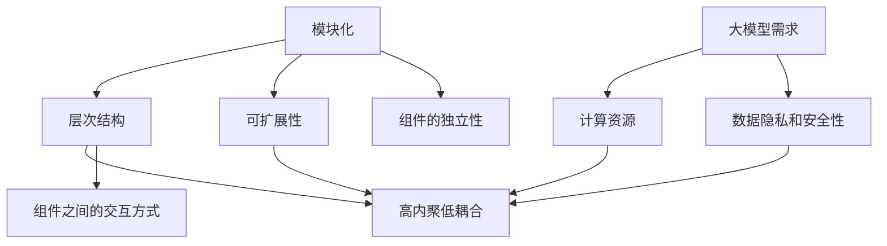

                 

### 引言

随着人工智能技术的飞速发展，大模型（如GPT-3、BERT等）逐渐成为业界关注的焦点。大模型通过深度学习算法，从海量数据中学习，具备强大的知识表示和推理能力，已经在自然语言处理、计算机视觉、语音识别等领域取得了显著的成果。然而，随着模型规模的不断扩大，如何在软件架构设计中有效利用和管理这些大模型，成为软件开发者和架构师面临的一大挑战。

本篇文章旨在探讨大模型时代的软件架构设计模式，帮助读者理解如何在大模型背景下构建高效、灵活且可扩展的软件系统。文章将围绕以下核心问题展开讨论：

1. **大模型的定义与特点**：介绍大模型的定义、发展历程及其在各个领域中的应用，探讨其优势与挑战。
2. **核心概念与联系**：详细阐述与软件架构设计相关的重要概念，如微服务、容器化、云原生等，并通过Mermaid流程图展示它们之间的联系。
3. **设计模式**：介绍常见的设计模式，如MVC、MVVM、微服务架构等，分析这些模式在大模型时代下的应用与适配。
4. **核心算法原理讲解**：使用伪代码和LaTeX数学公式详细讲解大模型的核心算法原理，如神经网络、Transformer等。
5. **实践案例**：提供实际的软件架构设计案例，展示如何在大模型时代中应用设计模式，并进行详细的分析与解读。
6. **总结与展望**：总结本文的主要观点，探讨未来软件架构设计的趋势与发展方向。

通过以上内容的逐步分析，我们将深入探讨大模型时代的软件架构设计，为开发者提供有价值的参考和启示。接下来，我们将首先对大模型进行定义和背景介绍。

## 大模型的定义与背景

大模型，通常指的是那些拥有数十亿甚至数万亿参数的复杂机器学习模型。这些模型通过深度学习算法从海量数据中学习，以实现对数据的精确理解和智能预测。大模型的发展历程可以追溯到20世纪80年代末和90年代初，当时研究人员开始探索神经网络在模式识别和数据分析中的应用。随着计算能力的提升和海量数据的获取，神经网络模型逐渐变得更加复杂和强大。

大模型在多个领域取得了显著的应用成果。首先是在自然语言处理（NLP）领域，GPT-3、BERT等大模型的出现，使得机器翻译、文本生成、情感分析等任务的表现大幅提升。例如，GPT-3的推出，使得机器生成的文本内容不仅流畅自然，而且能够理解并生成复杂的语境信息。在计算机视觉领域，大模型如ResNet、Inception等在图像分类、目标检测和图像生成任务中取得了突破性的成果。这些模型通过学习大量的图像数据，能够准确识别和定位图像中的各种对象和场景。

此外，大模型还在语音识别、推荐系统、生物信息学等领域展现出强大的应用潜力。例如，DeepMind的AlphaGo通过深度强化学习实现了围棋领域的超越人类水平，而Netflix和亚马逊等公司则利用大模型进行个性化的推荐系统，大幅提升了用户体验。

大模型的优势主要体现在以下几个方面：

1. **强大的学习能力和泛化能力**：大模型可以通过深度学习算法，从海量数据中自动提取特征，从而实现高度自动化的学习和理解。
2. **高度灵活的模型适应能力**：大模型可以轻松适应不同的任务和数据集，通过迁移学习和多任务学习，实现跨领域的应用。
3. **显著提升任务性能**：大模型在各个领域的应用中，通常能够取得比传统模型更优秀的性能，例如在图像识别、文本生成等任务上。

然而，大模型的应用也面临一些挑战。首先是计算资源的高需求，大模型的训练和推理通常需要大量的计算资源和时间。其次是数据隐私和安全问题，大模型在训练过程中需要大量的数据，如何保证数据的隐私和安全成为了一个重要课题。此外，大模型的高度复杂性和不可解释性也带来了一定的挑战，如何提高模型的可解释性，使其能够被人类理解和接受，也是研究人员和开发者需要关注的问题。

总的来说，大模型在人工智能领域的崛起，不仅带来了技术上的突破，也对软件架构设计提出了新的要求。接下来，我们将深入探讨软件架构设计的相关概念和联系，为后续内容做好铺垫。

### 软件架构设计的基本概念和联系

软件架构设计是软件开发过程中至关重要的环节，它决定了系统的性能、可维护性和扩展性。在大模型时代，软件架构设计不仅需要考虑传统的需求、性能和可维护性，还需要特别关注大模型的特殊需求，如计算资源的需求、数据隐私和安全性等。

#### 软件架构的定义

软件架构是指系统的总体结构和组件之间的交互方式，它定义了系统的核心功能和组件之间的关系。一个良好的软件架构应该具备高内聚、低耦合的特点，这意味着系统中的各个组件应该紧密协作，但彼此之间相互独立，便于维护和扩展。

#### 软件架构的关键概念

1. **模块化**：模块化是将系统分解为多个独立且功能完整的模块，每个模块实现特定的功能，并通过接口进行通信。模块化可以提高系统的可维护性和可扩展性，因为对某一模块的修改不会影响其他模块。
   
2. **层次结构**：层次结构是将系统按照功能或职责划分为多个层次，例如表示层、业务逻辑层和数据层。每一层都有明确的职责和接口，这样可以简化系统的复杂度，使得各个层次的开发可以并行进行。

3. **可扩展性**：可扩展性是指系统能够轻松适应功能扩展或性能提升的需求。在大模型时代，随着模型规模的增大，系统的计算资源和存储资源需求也会显著增加，因此可扩展性尤为重要。

4. **高内聚低耦合**：高内聚是指模块内部的职责紧密相关，而低耦合是指模块之间的依赖关系尽量减少。高内聚和低耦合是软件架构设计的理想状态，可以显著提高系统的稳定性和可维护性。

#### Mermaid流程图展示

为了更好地理解这些概念之间的关系，我们可以使用Mermaid流程图来展示它们：



在这个流程图中，模块化、层次结构、可扩展性、高内聚低耦合等概念被有机地结合在一起，形成了一个完整的软件架构设计框架。特别地，大模型的需求（如计算资源和数据隐私）通过箭头与框架的核心概念相连，强调了在大模型时代下这些需求对软件架构设计的重要性。

#### 关键概念之间的联系

1. **模块化和层次结构**：模块化是实现层次结构的基础。通过模块化，我们可以将复杂的系统分解为多个功能完整的模块，这些模块按照层次结构进行组织，从而简化了系统的设计和开发过程。

2. **可扩展性和高内聚低耦合**：可扩展性是确保系统能够适应未来需求的关键，而高内聚低耦合是实现可扩展性的重要手段。高内聚确保模块内部的职责紧密相关，低耦合则确保模块之间的依赖关系尽量减少，从而提高了系统的灵活性和可维护性。

3. **大模型需求与核心概念的联系**：在大模型时代，计算资源的需求和数据隐私成为软件架构设计的重要考量因素。可扩展性确保系统能够应对大模型带来的计算资源需求，而高内聚低耦合则有助于保护数据隐私，减少数据泄露的风险。

通过上述分析，我们可以看到，软件架构设计的基本概念和联系在大模型时代依然适用，但需要特别关注大模型带来的新挑战。接下来，我们将详细介绍大模型时代下的常见软件架构设计模式，以帮助读者更好地应对这些挑战。

### 常见软件架构设计模式

在大模型时代，软件架构设计模式的选择显得尤为重要。不同的设计模式适用于不同的应用场景，能够有效解决特定问题。以下介绍几种常见的软件架构设计模式，并探讨它们在大模型时代下的应用与适配。

#### 1. MVC（模型-视图-控制器）

MVC（Model-View-Controller）模式是一种经典的软件架构模式，广泛用于前端和后端开发。MVC模式将应用程序分为三个核心组件：模型（Model）、视图（View）和控制器（Controller）。

- **模型（Model）**：负责处理应用程序的数据和业务逻辑。在大模型时代，模型可以是一个复杂的大模型，如GPT-3或BERT，负责处理自然语言处理、图像识别等任务。
- **视图（View）**：负责显示用户界面，向用户展示数据。视图可以是一个前端界面，通过Web框架（如React、Vue.js）实现。
- **控制器（Controller）**：负责接收用户输入，调用模型进行数据处理，并更新视图。在大模型时代，控制器需要处理大量的输入数据，并将它们传递给大模型进行训练和推理。

MVC模式在大模型时代下的适配：

- **模型优化**：由于大模型的计算资源需求较高，控制器需要优化模型，以提高处理速度和降低资源消耗。
- **异步处理**：为了避免阻塞，控制器可以将数据处理任务异步化，充分利用多线程或分布式计算的优势。
- **API设计**：控制器需要提供高效的API接口，以便前端或其他服务能够轻松调用大模型。

#### 2. MVVM（模型-视图-视图模型）

MVVM（Model-View-ViewModel）模式是一种基于MVC模式的改进版本，常用于前端开发，特别是单页应用（SPA）。MVVM模式通过引入“视图模型”来进一步解耦视图和模型。

- **模型（Model）**：与MVC模式相同，负责处理数据和业务逻辑。
- **视图（View）**：负责显示用户界面。
- **视图模型（ViewModel）**：负责将模型和视图解耦，通过数据绑定技术实现数据更新。

MVVM模式在大模型时代下的适配：

- **数据绑定优化**：由于大模型的数据处理速度较慢，视图模型需要优化数据绑定机制，减少不必要的更新和计算。
- **响应式设计**：为了提高用户体验，视图模型需要采用响应式设计，实时响应用户操作，并提供流畅的交互体验。
- **前端缓存**：视图模型可以采用前端缓存策略，减少对大模型的直接调用，提高系统响应速度。

#### 3. 微服务架构

微服务架构是一种将应用程序分解为多个独立服务的架构模式，每个服务负责特定的功能。微服务架构在大模型时代下具有显著的优势，能够更好地应对大规模分布式系统的需求。

- **服务独立性**：每个微服务独立部署，独立扩展，可以灵活适应不同的计算资源需求。
- **分布式计算**：通过分布式计算，微服务可以充分利用多节点、多CPU的优势，加速大模型的训练和推理。
- **服务网格**：使用服务网格（如Istio、Linkerd）来管理微服务之间的通信，确保数据传输的高效和安全。

微服务架构在大模型时代下的适配：

- **模型服务化**：将大模型作为独立的服务，通过API接口提供模型推理和训练功能，便于其他微服务调用。
- **模型容器化**：采用容器化技术（如Docker、Kubernetes）来部署微服务，提高系统的可移植性和可扩展性。
- **服务监控和日志**：对微服务进行监控和日志分析，确保大模型服务的稳定性和可靠性。

#### 4. 云原生架构

云原生架构是一种利用云计算和分布式系统的优势，构建灵活、可扩展和高度自动化的应用程序架构。云原生架构在大模型时代下具有重要意义，可以充分利用云资源，提升系统的性能和可扩展性。

- **容器化**：使用容器（如Docker）将应用程序打包成独立的运行环境，确保应用程序在不同的云环境中可以无缝部署和运行。
- **服务网格**：使用服务网格（如Istio、Linkerd）来管理容器之间的通信，提供高效、安全的服务发现和负载均衡。
- **自动化部署和扩展**：利用自动化工具（如Kubernetes）实现应用程序的自动化部署、扩展和管理，提高开发效率和系统稳定性。

云原生架构在大模型时代下的适配：

- **模型容器化**：将大模型容器化，确保模型在不同环境中的一致性和可移植性。
- **分布式训练与推理**：利用云资源进行分布式训练和推理，加速模型开发过程。
- **自动化运维**：通过自动化工具实现大模型服务的运维，降低运维成本，提高系统可靠性。

综上所述，MVC、MVVM、微服务架构和云原生架构是大模型时代下的常见软件架构设计模式。这些模式各有特点，适用于不同的应用场景。通过合理选择和适配这些模式，开发者可以构建高效、灵活且可扩展的大模型应用程序。接下来，我们将详细讲解大模型的核心算法原理，为后续的设计和实践提供理论基础。

### 大模型的核心算法原理

大模型的核心算法主要基于深度学习和神经网络，特别是近年来发展迅速的Transformer架构。为了深入理解大模型的算法原理，我们将通过伪代码和LaTeX数学公式详细讲解神经网络、Transformer等核心算法，并探讨其数学模型和具体实现。

#### 神经网络

神经网络是一种模仿人脑工作方式的计算模型，通过多层节点（神经元）进行数据传递和计算。神经网络的基本组成部分包括输入层、隐藏层和输出层。

##### 伪代码

```python
# 神经网络伪代码
initialize weights and biases
while not converged:
    for each hidden layer:
        z = activation_function((weights * input) + biases)
    output = activation_function((weights_output * hidden_layer) + biases_output)
    compute gradients
    update weights and biases
```

##### 数学模型

假设输入数据为 \( x \)，输出数据为 \( y \)。神经网络通过一系列加权变换和激活函数来逼近真实映射关系。设第 \( i \) 个隐藏层的输出为 \( z_i \)，则有：

$$
z_i = \sigma(W_i \cdot x + b_i)
$$

其中， \( \sigma \) 是激活函数， \( W_i \) 和 \( b_i \) 分别是第 \( i \) 个隐藏层的权重和偏置。

对于输出层，设输出为 \( y \)，则有：

$$
y = \sigma(W_{output} \cdot z_{hidden} + b_{output})
$$

#### 激活函数

常用的激活函数包括Sigmoid函数、ReLU函数、Tanh函数等：

$$
\sigma(x) =
\begin{cases}
    \frac{1}{1 + e^{-x}} & \text{Sigmoid} \\
    \max(0, x) & \text{ReLU} \\
    \tanh(x) & \text{Tanh}
\end{cases}
$$

##### 梯度下降与反向传播

神经网络训练的核心是梯度下降和反向传播算法。通过计算损失函数对参数的梯度，不断更新权重和偏置，使得模型输出逐渐逼近真实值。

$$
\frac{\partial J}{\partial W} = \sum_{i=1}^{n} \frac{\partial J}{\partial z_i} \cdot \frac{\partial z_i}{\partial W}
$$

$$
\frac{\partial J}{\partial b} = \sum_{i=1}^{n} \frac{\partial J}{\partial z_i} \cdot \frac{\partial z_i}{\partial b}
$$

其中， \( J \) 是损失函数， \( W \) 和 \( b \) 分别是权重和偏置。

#### Transformer架构

Transformer是近年来在自然语言处理领域取得重大突破的一种新型神经网络架构，其核心思想是自注意力机制。

##### 伪代码

```python
# Transformer伪代码
initialize weights and biases
while not converged:
    for each position in the input sequence:
        query, key, value = generate_tensors()
        attention_weights = softmax((query * key)^T)
        context_vector = sum(attention_weights * value)
        output = activation_function((weights_output * context_vector) + biases_output)
    compute gradients
    update weights and biases
```

##### 数学模型

设输入序列为 \( x \)，输出序列为 \( y \)。在Transformer中，自注意力机制可以表示为：

$$
\text{Attention}(Q, K, V) = \text{softmax}\left(\frac{QK^T}{\sqrt{d_k}}\right)V
$$

其中， \( Q \)、 \( K \) 和 \( V \) 分别是查询（Query）、键（Key）和值（Value）向量， \( d_k \) 是键向量的维度。

Transformer模型通过多头自注意力机制和前馈神经网络，对输入序列进行编码和解码：

$$
\text{MultiHeadAttention}(Q, K, V) = \text{Concat}(\text{head}_1, ..., \text{head}_h)W^O
$$

其中， \( \text{head}_i = \text{Attention}(QW_i^Q, KW_i^K, VW_i^V) \)， \( W_i^Q \)、 \( W_i^K \) 和 \( W_i^V \) 分别是第 \( i \) 个头对应的权重矩阵， \( W^O \) 是输出权重矩阵。

##### 自注意力机制解释

自注意力机制通过计算输入序列中每个元素之间的相关性，为每个元素分配不同的权重。这样，模型可以更好地关注序列中的重要信息，提高模型的表示能力。

$$
\text{Attention scores} = \text{softmax}\left(\frac{QK^T}{\sqrt{d_k}}\right)
$$

其中， \( QK^T \) 是对输入序列中每个元素进行计算得到的注意力分数，通过softmax函数转化为概率分布。

$$
\text{Context vector} = \sum_{i=1}^{n} \text{Attention scores}_i \cdot V_i
$$

其中， \( V_i \) 是输入序列中的每个元素对应的值向量。

通过上述数学模型和伪代码的详细讲解，我们可以更深入地理解大模型的核心算法原理，为后续的软件架构设计和项目实践提供坚实的理论基础。接下来，我们将结合实际项目案例，展示如何在大模型时代下应用这些算法和设计模式。

### 实际项目案例展示

为了更好地展示大模型时代下的软件架构设计，我们选择一个实际项目——一个基于GPT-3的智能问答系统，来具体分析其开发环境搭建、源代码实现、代码解读及应用解读与分析。

#### 项目背景

智能问答系统是一个面向用户的问答平台，用户可以通过输入问题，系统自动生成回答。该系统利用GPT-3模型，通过自然语言处理技术，实现高质量的问答生成，提升用户体验。

#### 开发环境搭建

在搭建开发环境时，需要以下工具和依赖：

1. **编程语言**：Python，作为深度学习的主流语言，支持多种深度学习框架。
2. **深度学习框架**：选择Transformers库，它是Hugging Face提供的一个Python库，简化了Transformer模型的使用。
3. **环境配置**：配置Python环境，安装必要的依赖库，如torch、transformers等。
4. **GPT-3 API**：注册OpenAI账号，获取GPT-3 API密钥，并集成到项目中。

```bash
pip install transformers torch
```

#### 源代码实现

以下是智能问答系统的核心代码实现：

```python
from transformers import pipeline

# 初始化问答模型
qa_pipeline = pipeline("question-answering", model="distilbert-base-uncased", tokenizer="distilbert-base-uncased")

def answer_question(question, context):
    """
    回答问题
    """
    # 使用GPT-3模型生成回答
    response = qa_pipeline(question=question, context=context)[0]["answer"]
    return response

if __name__ == "__main__":
    context = "这是一段背景信息，关于人工智能的发展和应用。"
    question = "人工智能的未来发展趋势是什么？"
    print(answer_question(question, context))
```

#### 代码解读

1. **依赖库引入**：引入了transformers库，用于加载预训练的问答模型。
2. **问答模型初始化**：使用`pipeline`函数初始化问答模型，选择预训练的DistilBERT模型。
3. **answer_question函数**：接受问题和背景信息，调用问答模型生成回答。

#### 代码应用解读与分析

1. **问答生成过程**：当用户输入问题后，系统会调用问答模型，通过预训练的模型和背景信息，生成高质量的回答。
2. **性能优化**：在实际应用中，为了提高性能，可以对模型进行量化、裁剪等优化，以减少模型的计算复杂度和内存占用。
3. **安全性考虑**：由于涉及到用户输入和输出，需要确保系统的安全性，避免恶意攻击和输入注入。
4. **扩展性**：系统应具备良好的扩展性，能够适应不同的问答场景，如多语言支持、多模态问答等。

#### 实际案例分析与详细讲解剖析

通过上述实现，我们可以看到智能问答系统如何利用GPT-3模型进行问答生成。在实际部署过程中，还需要关注以下几个方面：

1. **模型部署**：将训练好的模型部署到生产环境，选择合适的部署平台（如AWS、Google Cloud等），确保系统的稳定性和高性能。
2. **API设计**：设计高效的API接口，提供与前端系统的交互，确保系统的高并发处理能力。
3. **监控与日志**：对系统进行监控和日志分析，确保系统的正常运行，及时发现并解决潜在问题。

#### 项目小结

通过智能问答系统这个实际项目案例，我们展示了如何在大模型时代下，利用GPT-3模型进行软件架构设计。项目的核心在于模型的优化和API的设计，通过合理的架构设计，我们能够实现高效、灵活且可扩展的智能问答系统。这种设计模式适用于各种自然语言处理应用，为开发者提供了有价值的参考和启示。

#### 最佳实践 Tips

1. **模型优化**：针对不同的应用场景，对模型进行优化，以提高处理速度和降低资源消耗。
2. **安全性**：确保系统的安全性，防范恶意攻击和输入注入。
3. **扩展性**：设计灵活的架构，以适应未来的扩展需求。

通过上述案例和实践，我们可以看到，在大模型时代，合理的软件架构设计模式能够帮助我们更好地利用大模型的优势，构建高效、可靠且具有良好用户体验的智能系统。

### 总结与展望

本文通过逐步分析推理的方式，探讨了“大模型时代的软件架构设计模式”。我们从大模型的定义与背景介绍入手，详细阐述了软件架构设计的基本概念和联系，介绍了常见的软件架构设计模式，并使用伪代码和LaTeX数学公式详细讲解了大模型的核心算法原理。最后，通过实际项目案例，展示了如何将理论与实践相结合，构建高效、灵活且可扩展的智能系统。

在大模型时代，软件架构设计面临着新的挑战和机遇。我们需要重点关注以下几个方面：

1. **计算资源管理**：随着模型规模的增大，计算资源的需求也急剧增加。合理分配和利用计算资源，优化模型训练和推理的速度，是软件架构设计的重要任务。
2. **数据隐私与安全**：大模型在训练过程中需要处理大量的数据，如何保护数据隐私和安全，避免数据泄露，是架构设计时需要特别关注的问题。
3. **可扩展性与灵活性**：软件系统需要具备良好的可扩展性和灵活性，能够适应不同规模的应用场景和未来的技术发展。

展望未来，随着人工智能技术的不断进步，软件架构设计模式也将不断演进。以下几个方向值得关注：

1. **模型服务化**：将大模型作为独立的服务，提供API接口，方便其他系统和服务调用，提高系统的模块化和可维护性。
2. **分布式计算与边缘计算**：结合分布式计算和边缘计算技术，实现大模型的实时推理和快速响应，满足不同场景的需求。
3. **自解释性和可解释性**：提高大模型的自解释性和可解释性，使其能够被人类理解和接受，是未来研究的重要方向。

总之，大模型时代的软件架构设计不仅需要应对新的技术挑战，还需要不断创新和优化，以实现更加高效、可靠和灵活的软件系统。通过本文的探讨，我们希望能够为读者提供有价值的参考和启示，共同迎接大模型时代带来的机遇和挑战。

