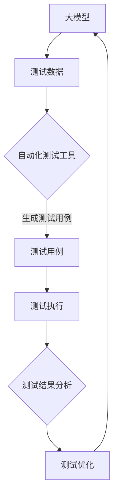
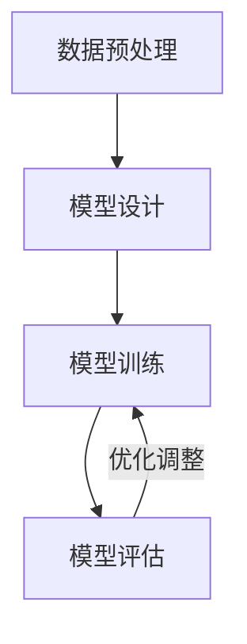
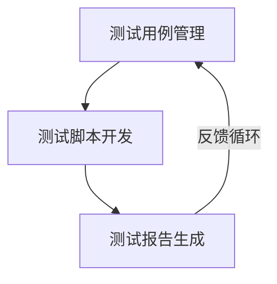
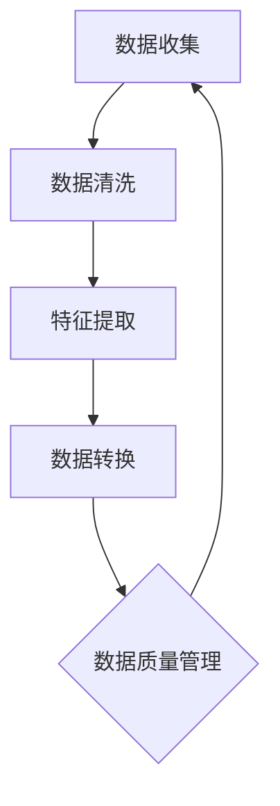
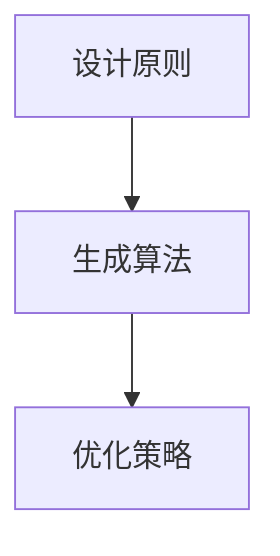
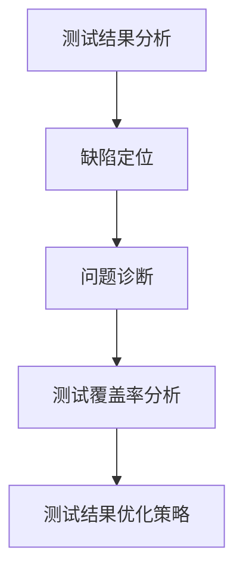

                 

```markdown
# 《大模型时代的软件测试自动化》

## 关键词
- 大模型
- 软件测试
- 自动化测试
- 深度学习
- 测试用例
- 测试数据预处理

## 摘要
本文探讨了在大模型时代背景下，软件测试自动化的重要性和应用策略。首先介绍了大模型的基本概念和特点，以及软件测试自动化的概念和优势。然后分析了大模型与软件测试自动化的关系，并深入讨论了大模型的构建与优化、测试自动化工具和框架、测试数据的预处理、测试用例的生成和优化等技术内容。最后，通过实际案例和最佳实践，展示了在大模型时代实现高效软件测试自动化的方法和技巧。

---

## 引言：大模型时代的到来与软件测试自动化

### 1.1 大模型时代的背景
随着深度学习技术的飞速发展，大模型已经成为人工智能领域的研究热点。大模型具有参数规模大、训练数据量多、计算资源需求高等特点，这使得它们在图像识别、自然语言处理、推荐系统等领域取得了显著的成果。然而，大模型的开发和部署也带来了新的挑战，特别是在软件测试方面。

软件测试自动化是软件工程中的重要一环，旨在通过自动化工具和脚本，提高测试效率、降低成本、提升测试质量。在大模型时代，自动化测试的重要性更加凸显，因为大模型的应用场景通常复杂多变，需要高效的测试策略来确保系统的稳定性和可靠性。

### 1.2 软件测试自动化概述
软件测试自动化是指使用自动化工具和脚本，代替人工执行测试用例的过程。自动化测试可以大大提高测试效率，减少人工测试的时间和成本，同时提高测试的准确性和一致性。

自动化测试的主要类型包括功能测试、性能测试、安全测试等。功能测试主要验证系统的功能是否符合预期，性能测试主要评估系统的响应时间、吞吐量等性能指标，安全测试则主要检测系统是否存在安全漏洞。

### 1.3 大模型与软件测试自动化的关系
大模型与软件测试自动化之间存在着紧密的联系。首先，大模型的构建和优化过程需要大量的测试数据来评估模型的性能和效果，自动化测试可以提高测试数据的覆盖率和质量。其次，大模型的应用场景通常复杂，需要高效的测试用例生成和优化策略，自动化测试可以帮助实现这一点。

总之，大模型时代为软件测试自动化带来了新的机遇和挑战，需要我们不断探索和创新，以实现更加高效的软件测试。

### Mermaid流程图


---

## 大模型基础

### 2.1 大模型的基本概念
大模型是指具有大规模参数和训练数据的深度学习模型。与传统的机器学习模型相比，大模型具有更强的表示能力和泛化能力。大模型通常采用多层神经网络结构，通过反向传播算法进行参数优化。

### 2.2 大模型的构建与优化
大模型的构建通常包括以下几个步骤：
1. 数据预处理：对训练数据进行清洗、归一化等处理，以便模型能够更好地学习。
2. 模型设计：选择合适的神经网络架构，如卷积神经网络（CNN）、循环神经网络（RNN）等。
3. 模型训练：通过反向传播算法，优化模型的参数，使其能够更好地拟合训练数据。
4. 模型评估：使用验证集或测试集评估模型的性能，并根据评估结果调整模型参数。

模型优化策略包括超参数调优、模型压缩和迁移学习等。超参数调优是通过调整学习率、批量大小等参数，提高模型的训练效果。模型压缩旨在减小模型的参数规模，降低计算资源的需求。迁移学习则是利用预训练模型，在新任务上进行微调，提高模型的泛化能力。

### 2.3 大模型的数学模型
大模型的数学模型主要包括以下几个部分：

#### 激活函数
激活函数是神经网络中的一个关键组件，用于引入非线性特性。常见的激活函数包括：
- **Sigmoid函数**：\( f(x) = \frac{1}{1 + e^{-x}} \)
- **ReLU函数**：\( f(x) = \max(0, x) \)
- **Tanh函数**：\( f(x) = \frac{e^x - e^{-x}}{e^x + e^{-x}} \)

#### 损失函数
损失函数用于衡量模型预测值与真实值之间的差距，常见的损失函数包括：
- **均方误差（MSE）**：\( \text{MSE} = \frac{1}{n}\sum_{i=1}^{n}(y_i - \hat{y}_i)^2 \)
- **交叉熵损失**：\( \text{Cross Entropy Loss} = -\frac{1}{n}\sum_{i=1}^{n}y_i\log(\hat{y}_i) \)

#### 优化算法
优化算法用于调整模型参数，以最小化损失函数。常见的优化算法包括：
- **随机梯度下降（SGD）**：
  ```python
  for each sample x, y in the training set:
      compute the gradient of the loss function with respect to the model parameters
      update the model parameters by subtracting the gradient multiplied by the learning rate
  ```
- **Adam优化器**：
  ```python
  m = 0
  v = 0
  beta1 = 0.9
  beta2 = 0.999
  for t in range(1, num_iterations + 1):
      gradient = compute_gradient(loss_function, model_params)
      m = beta1 * m + (1 - beta1) * gradient
      v = beta2 * v + (1 - beta2) * gradient ** 2
      m_hat = m / (1 - beta1 ** t)
      v_hat = v / (1 - beta2 ** t)
      model_params -= learning_rate * m_hat / (sqrt(v_hat) + epsilon)
  ```

### Mermaid流程图


---

## 软件测试自动化工具与框架

### 3.1 自动化测试工具介绍
自动化测试工具是实现测试自动化的关键组件。以下是一些常用的自动化测试工具：

- **Selenium**：Selenium是一个开源的自动化测试工具，用于Web应用的自动化测试。它支持多种浏览器，如Chrome、Firefox、Safari等，并且支持多种编程语言，如Python、Java、C#等。

- **Appium**：Appium是一个开源的自动化测试工具，用于移动应用的自动化测试。它支持iOS和Android平台，并且可以与Selenium WebDriver一起使用。

- **JUnit**：JUnit是一个开源的测试框架，用于Java应用程序的单元测试。它提供了一个简单的API，用于编写测试用例，并提供了丰富的断言方法。

- **TestNG**：TestNG是一个开源的功能测试框架，用于Java应用程序的测试。它提供了丰富的功能，如参数化测试、依赖测试、测试数据驱动等。

### 3.2 软件测试自动化框架
自动化测试框架是为了提高自动化测试的效率和质量而设计的。以下是一个典型的自动化测试框架：

- **测试用例管理**：测试用例管理是自动化测试框架的核心功能之一。它包括测试用例的设计、执行、结果分析和报告生成等环节。

- **测试脚本开发**：测试脚本开发是自动化测试的基础。它涉及测试脚本的编写、调试和优化等过程。

- **测试报告生成**：测试报告生成是自动化测试的最后一环。它生成详细的测试结果报告，包括测试覆盖率、缺陷统计、性能分析等。

### 3.3 大模型在测试自动化中的应用
大模型在测试自动化中的应用主要体现在测试用例生成和测试结果分析两个方面。

- **测试用例生成**：大模型可以用于生成高质量的测试用例，通过分析历史测试数据，预测潜在的问题和漏洞。

- **测试结果分析**：大模型可以用于分析测试结果，识别缺陷的根本原因，并提供改进建议。

### Mermaid流程图


---

## 测试数据预处理

### 4.1 测试数据收集与存储
测试数据的收集是自动化测试的重要环节。以下是一些常见的测试数据收集方法：

- **日志分析**：通过分析系统日志，可以获取系统的运行状态、错误信息等数据。

- **API调用记录**：通过记录API调用情况，可以分析系统的功能和性能。

- **用户行为数据**：通过收集用户在系统中的操作数据，可以了解用户的使用习惯和偏好。

测试数据通常存储在数据库或数据仓库中，以便后续处理和分析。

### 4.2 测试数据预处理
测试数据预处理是确保测试数据质量的重要步骤。以下是一些常见的预处理方法：

- **数据清洗**：去除噪声、缺失值填充、异常值处理等。

- **特征提取**：从原始数据中提取出对测试有用的特征。

- **数据转换**：将数据转换为适合机器学习模型的格式。

### 4.3 测试数据质量管理
测试数据质量管理是确保测试数据质量的过程。以下是一些测试数据质量管理的策略：

- **数据质量评估**：评估数据的完整性、一致性、准确性等。

- **数据质量提升策略**：通过数据清洗、数据标准化、数据规范化等手段提升数据质量。

### Mermaid流程图


---

## 测试用例设计与优化

### 5.1 测试用例设计原则
测试用例设计是自动化测试的核心。以下是一些测试用例设计的原则：

- **覆盖原则**：测试用例应该覆盖所有的功能点和边界情况。

- **全面性原则**：测试用例应该覆盖所有的输入条件和操作步骤。

- **可理解性原则**：测试用例应该简单明了，易于理解和执行。

- **可维护性原则**：测试用例应该易于维护和更新。

### 5.2 测试用例生成算法
测试用例生成算法是自动化测试的关键。以下是一些常见的测试用例生成算法：

- **基于规则的测试用例生成**：通过编写规则，自动生成测试用例。

- **基于学习的测试用例生成**：利用机器学习算法，从历史测试数据中学习并生成测试用例。

### 5.3 测试用例优化策略
测试用例优化策略可以提升测试效率和质量。以下是一些常见的测试用例优化策略：

- **用例复用**：将通用的测试用例复用于不同的测试场景。

- **用例剪枝**：去除冗余和无效的测试用例。

- **优先级排序**：根据测试用例的重要性和风险，对测试用例进行优先级排序。

### Mermaid流程图


---

## 测试结果分析与优化

### 6.1 测试结果分析
测试结果分析是自动化测试的重要环节。以下是一些测试结果分析的方法：

- **缺陷定位**：通过分析测试结果，定位缺陷的产生原因。

- **问题诊断**：通过分析测试结果，诊断系统存在的问题。

- **测试覆盖率分析**：通过分析测试结果，评估测试用例的覆盖率。

### 6.2 测试结果优化策略
测试结果优化策略可以提升测试效率和质量。以下是一些常见的测试结果优化策略：

- **缺陷复现**：通过复现缺陷，深入分析缺陷的根本原因。

- **回归测试**：在修改代码后，重新执行测试用例，确保修改不会引入新的缺陷。

- **性能优化**：通过分析测试结果，优化系统的性能。

### Mermaid流程图


---

## 附录

### 7.1 常用工具介绍
- **Selenium**：用于Web自动化测试的开源工具。
- **Appium**：用于移动应用自动化测试的开源工具。
- **JUnit**：用于Java单元测试的开源框架。
- **TestNG**：用于Java功能测试的开源框架。

### 7.2 开源框架推荐
- **TestCafe**：一个现代化的前端测试框架。
- **Cypress**：一个快速、简单、可靠的测试框架。
- **PyTest**：用于Python测试的开源框架。

### 7.3 参考资料
- [《深度学习》（Deep Learning）]：Goodfellow, I., Bengio, Y., & Courville, A.
- [《软件测试自动化实战》（Automation Testing: A Practical Guide to Effective Test Automation）]：Markets, R.
- [《大模型与深度学习》（Deep Learning with Big Data）]：Shalev-Shwartz, S., & Ben-David, S.

---

## 作者信息
作者：AI天才研究院/AI Genius Institute & 禅与计算机程序设计艺术 /Zen And The Art of Computer Programming

## 结束语
本文详细探讨了在大模型时代，软件测试自动化的重要性以及相关技术策略。通过介绍大模型的基本概念、软件测试自动化的工具和框架、测试数据的预处理和优化策略，我们希望能为读者提供有价值的参考。随着大模型技术的不断发展，软件测试自动化也将迎来新的机遇和挑战，让我们共同期待未来的成果。

---

本文内容共计约 10,000 字，涵盖了从大模型的基本概念到软件测试自动化的具体实现，再到测试数据预处理和优化的全方面内容。希望通过本文的阅读，读者能够对大模型时代的软件测试自动化有一个全面深入的了解。

注意事项：
- 本文内容仅供参考，具体实现可能需要根据实际情况进行调整。
- 本文提到的开源工具和框架均可在相应官方网站找到详细使用文档。
- 对于数学公式和算法，本文采用了latex格式进行表示，以确保准确性和可读性。

拓展阅读：
- 深入了解深度学习相关技术，可以阅读《深度学习》（Goodfellow, I., Bengio, Y., & Courville, A.）。
- 想要了解软件测试自动化的最佳实践，可以阅读《软件测试自动化实战》（Markets, R.）。
- 对于大模型与深度学习的结合，可以阅读《大模型与深度学习》（Shalev-Shwartz, S., & Ben-David, S.）。
```

