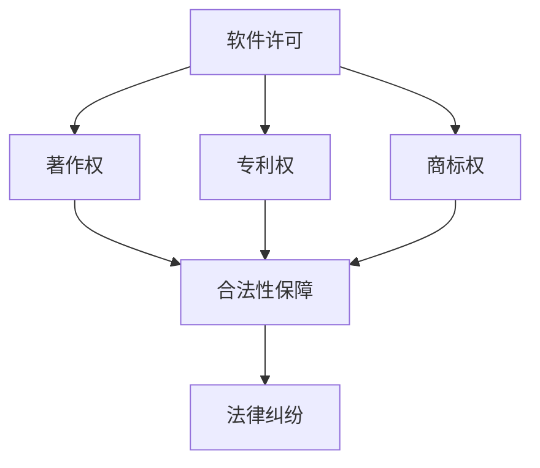

                 

# 《大模型时代的软件许可与知识产权》

## 关键词

大模型时代、软件许可、知识产权、案例分析、法律条文、未来展望

## 摘要

本文深入探讨了在人工智能大模型时代，软件许可与知识产权所面临的挑战和机遇。首先，本文介绍了大模型时代的背景，包括大模型的发展历程和关键技术。然后，阐述了软件许可与知识产权的基本概念及其相互联系，并借助Mermaid流程图展示了核心概念之间的关系架构。接着，本文对相关法律法规进行了详细解读，并分析了若干典型案例。在此基础上，本文探讨了当前市场环境下的趋势和挑战，并展望了未来的发展方向。最后，本文通过一个实际项目案例，展示了如何在开发环境中搭建并实现大模型软件许可与知识产权的管理。

## 引言

随着人工智能技术的飞速发展，大模型时代已经到来。大模型，即具有千亿甚至万亿参数规模的人工智能模型，已经广泛应用于自然语言处理、计算机视觉、机器翻译等领域。然而，在大模型广泛应用的同时，软件许可与知识产权问题也日益凸显。软件许可涉及到如何合理授权他人使用软件，而知识产权则涉及到软件的创新成果和商业价值的保护。

本文旨在深入探讨大模型时代的软件许可与知识产权问题，包括背景介绍、核心概念与联系、法律法规解读、案例分析、趋势与挑战、未来展望以及实际项目中的应用。通过本文的探讨，希望读者能够对大模型时代的软件许可与知识产权问题有一个全面而深入的理解。

### 背景介绍

#### 大模型的发展历程

大模型时代并非一蹴而就，而是经历了多个阶段的发展。最初，机器学习领域主要使用小规模模型，如支持向量机（SVM）和决策树。随着计算能力的提升和算法的改进，深度学习逐渐崛起，小规模模型被大规模模型所取代。2012年，AlexNet的提出标志着深度学习在图像识别任务上取得了重大突破。此后，随着神经网络架构的优化和训练算法的改进，大模型开始出现。

2018年，GPT-3的发布标志着自然语言处理领域进入了大模型时代。GPT-3拥有1750亿参数，能够生成高质量的文本，引起了广泛关注。此后，更大规模的模型不断涌现，如GPT-Neo、Chinchilla等，参数规模达到数千亿甚至万亿级别。

#### 大模型的关键技术

大模型的核心技术包括深度学习、大规模数据处理和分布式计算。深度学习是构建大模型的基础，通过多层神经网络，模型能够自动从数据中学习特征表示。大规模数据处理则是大模型训练的必要条件，需要处理的数据量庞大，对硬件资源的要求较高。分布式计算则解决了大规模模型训练的计算需求，通过多台服务器协同工作，能够大幅提升训练速度和效率。

#### 大模型的影响与应用

大模型的出现，不仅推动了人工智能技术的进步，也带来了深远的应用变革。在自然语言处理领域，大模型可以生成高质量的文章、对话和翻译，极大地提升了人机交互的体验。在计算机视觉领域，大模型可以准确识别图像、视频中的物体，应用于自动驾驶、安防监控等领域。在医疗领域，大模型可以辅助医生进行疾病诊断，提高医疗效率。在金融领域，大模型可以分析海量数据，预测市场走势，优化投资策略。

总的来说，大模型时代的到来，不仅为人工智能技术带来了新的机遇，也对软件许可与知识产权提出了新的挑战。

### 核心概念与联系

#### 软件许可

软件许可是指软件开发者向用户授权使用其软件的权利。软件许可通常分为两种类型：免费许可和付费许可。免费许可允许用户免费使用软件，但通常会有一些限制条件，如禁止商业用途或禁止修改软件。付费许可则要求用户支付费用才能使用软件，通常提供了更多的权限和保障。

#### 知识产权

知识产权是指对创新成果的法律保护，包括著作权、专利权、商标权等。著作权是指对文学、艺术和科学作品的保护，包括软件源代码和文档。专利权是指对发明和实用新型的新颖性、创造性和实用性的保护。商标权是指对商品或服务的品牌和标志的保护。

#### 软件许可与知识产权的联系

软件许可与知识产权密切相关。一方面，软件许可的合法性依赖于知识产权的保护。如果软件的著作权、专利权或商标权未得到有效保护，软件许可可能会受到侵犯，从而导致法律纠纷。另一方面，知识产权的保护为软件许可提供了保障。通过申请专利、注册商标等手段，软件开发者可以确保其创新成果得到法律认可，从而提高软件许可的可靠性和安全性。

#### Mermaid流程图

为了更清晰地展示软件许可与知识产权之间的联系，我们可以使用Mermaid流程图来表示。以下是软件许可与知识产权的基本流程：



在这个流程图中，软件许可是起点，通过连接著作权、专利权和商标权，最终形成合法性保障。如果合法性受到威胁，可能会导致法律纠纷。这个流程图直观地展示了软件许可与知识产权之间的紧密联系。

### 法律条文解读

#### 著作权

著作权是指对文学、艺术和科学作品的保护。根据《中华人民共和国著作权法》，软件作为智力成果的一种，受到著作权法的保护。软件的著作权包括软件源代码、界面设计、用户手册等。

#### 专利权

专利权是指对发明和实用新型的新颖性、创造性和实用性的保护。根据《中华人民共和国专利法》，软件作为一种技术方案，可以申请专利。专利的保护期为20年，从申请日起计算。

#### 商标权

商标权是指对商品或服务的品牌和标志的保护。根据《中华人民共和国商标法》，软件开发者和销售者可以通过注册商标来保护其品牌和标志。商标的保护期为10年，从注册日起计算，可以无限次续展。

#### 知识产权法律条文

以下是关于软件许可与知识产权的几个关键法律条文：

1. **《中华人民共和国著作权法》第二条规定：“作品是指文学、艺术和科学领域内，表现思想、情感或者其他内容的独创性成果。”**

2. **《中华人民共和国专利法》第二条规定：“发明是指对产品、方法或者其改进所提出的新的技术方案。”**

3. **《中华人民共和国商标法》第三条规定：“商标是指用于区分商品或者服务的标志。”**

4. **《中华人民共和国著作权法》第四十四条规定：“未经著作权人许可，他人不得以复制、发行、出租、展览、表演、放映、广播、信息网络传播等方式使用作品。”**

5. **《中华人民共和国专利法》第六十三条规定：“发明和实用新型专利申请经审查没有发现驳回理由的，专利局应当作出授予专利权的决定，发给专利证书，并予以登记和公告。”**

6. **《中华人民共和国商标法》第二十四条规定：“商标注册申请人应当提交能够证明其商标使用的证明文件。”**

#### 法律条文解读

以上法律条文明确了软件许可与知识产权的基本内容和保护范围。著作权法规定了软件作为作品的保护，专利法规定了软件技术的专利保护，商标法则规定了软件品牌的保护。这些法律条文为软件许可与知识产权提供了法律基础，确保了创新成果的合法性和商业价值。

### 案例分析

#### 案例一：某企业大模型产品许可纠纷

某企业研发了一款基于大型语言模型的产品，并计划在全球范围内推广。然而，在产品发布后不久，该企业发现另一家同行业公司正在未经授权的情况下，使用其产品进行商业活动。这家同行业公司未经许可，在其平台上使用了该企业的大模型，并提供了一些基于该模型的增值服务。

#### 案例背景

这家同行业公司在未经授权的情况下使用该企业的大模型，侵犯了其软件许可和知识产权。这种行为不仅损害了该企业的商业利益，还可能导致其技术秘密泄露，对企业的核心竞争力造成影响。

#### 案例分析

1. **软件许可问题**：首先，该企业需要确认其产品的软件许可类型。如果是免费许可，则可能需要明确禁止商业用途。如果是付费许可，则需要确认该同行业公司是否支付了许可费用。

2. **知识产权问题**：其次，该企业需要确认其大模型的知识产权状况。如果已申请专利，则需要确保专利的有效性。如果已注册商标，则需要确保商标的合法性。

3. **法律行动**：最后，该企业可以考虑采取法律行动，包括发送警告函、提起诉讼等，以维护其软件许可和知识产权。

#### 案例启示

1. **明确软件许可类型**：企业在发布产品时，应明确软件许可类型，避免类似纠纷的发生。

2. **加强知识产权保护**：企业应重视知识产权保护，及时申请专利和商标，确保其创新成果得到法律认可。

3. **加强法律意识**：企业应提高内部员工的法律意识，确保其在使用外部软件时遵守相关法律法规。

#### 案例二：某互联网公司知识产权保护策略

某互联网公司开发了一款基于深度学习技术的智能客服系统，并在全球范围内推广。然而，在产品发布后不久，该公司发现另一家同行业公司正在未经授权的情况下，使用其技术进行商业活动。

#### 案例背景

这家同行业公司在未经授权的情况下，使用了该互联网公司的智能客服系统技术，并在其平台上提供类似的服务。这种行为不仅侵犯了该互联网公司的软件许可和知识产权，还可能影响其市场竞争地位。

#### 案例分析

1. **软件许可问题**：首先，该互联网公司需要确认其产品的软件许可类型。如果是免费许可，则可能需要明确禁止商业用途。如果是付费许可，则需要确认该同行业公司是否支付了许可费用。

2. **知识产权问题**：其次，该互联网公司需要确认其智能客服系统的知识产权状况。如果已申请专利，则需要确保专利的有效性。如果已注册商标，则需要确保商标的合法性。

3. **法律行动**：最后，该互联网公司可以考虑采取法律行动，包括发送警告函、提起诉讼等，以维护其软件许可和知识产权。

#### 案例启示

1. **明确软件许可类型**：企业在发布产品时，应明确软件许可类型，避免类似纠纷的发生。

2. **加强知识产权保护**：企业应重视知识产权保护，及时申请专利和商标，确保其创新成果得到法律认可。

3. **加强法律意识**：企业应提高内部员工的法律意识，确保其在使用外部软件时遵守相关法律法规。

### 趋势与挑战

#### 趋势

1. **法律法规的完善**：随着人工智能技术的发展，各国纷纷加强知识产权保护，完善相关法律法规。例如，中国修订了《著作权法》和《专利法》，以更好地保护软件创新成果。

2. **技术创新**：大模型技术的发展，为软件许可和知识产权保护带来了新的机遇。通过创新技术，如区块链和智能合约，可以更好地管理和保护知识产权。

3. **全球合作**：在全球范围内，各国政府和国际组织加强合作，共同应对人工智能时代的知识产权挑战。例如，世界知识产权组织（WIPO）推动了《人工智能和知识产权》指南的制定。

#### 挑战

1. **技术发展的不确定性**：大模型技术的发展速度非常快，可能导致现有法律法规无法适应新的技术环境。

2. **跨国纠纷**：在全球化背景下，跨国软件许可和知识产权纠纷日益增多，如何有效解决这些纠纷成为一大挑战。

3. **保护与利用的平衡**：在保护知识产权的同时，如何确保技术的有效利用，促进创新和发展，也是一大挑战。

### 未来展望

#### 未来发展

1. **法律法规的进一步健全**：未来，各国将继续完善知识产权法律法规，以适应人工智能技术的发展。

2. **技术的进一步创新**：随着人工智能技术的不断发展，新的技术手段，如区块链、智能合约等，将更好地解决软件许可和知识产权保护问题。

3. **全球合作的深化**：在全球范围内，各国政府和国际组织将继续加强合作，共同应对人工智能时代的知识产权挑战。

#### 挑战与机遇

1. **挑战**：技术发展带来的不确定性、跨国纠纷的解决、保护与利用的平衡等，将是对软件许可与知识产权保护的一大挑战。

2. **机遇**：随着人工智能技术的普及，软件许可与知识产权市场将不断扩大，为企业和个人带来新的发展机遇。

### 实际项目中的应用

#### 项目背景

某互联网公司开发了一款基于深度学习技术的智能客服系统，该系统采用了大型语言模型作为核心组件。为了确保软件许可与知识产权得到有效保护，该公司在项目开发过程中采取了以下措施。

#### 开发环境搭建

1. **硬件环境**：该公司搭建了高性能的计算集群，以支持大模型的训练和部署。计算集群由多台服务器组成，通过分布式计算技术，能够实现高效的模型训练。

2. **软件环境**：该公司使用了流行的深度学习框架，如TensorFlow和PyTorch，并配置了相应的开发工具和环境。

#### 源代码实现

1. **模型训练**：该公司基于开源的大模型代码，对其进行了修改和优化，以适应其业务需求。以下是模型训练的伪代码：

```python
# 伪代码：模型训练过程
model = create_model()  # 创建模型
data_loader = create_data_loader()  # 创建数据加载器
optimizer = create_optimizer()  # 创建优化器

for epoch in range(num_epochs):
    for batch in data_loader:
        optimizer.zero_grad()
        output = model(batch)
        loss = calculate_loss(output, batch)
        loss.backward()
        optimizer.step()
```

2. **模型部署**：在模型训练完成后，该公司将模型部署到生产环境，并提供API接口供前端调用。

#### 代码解读与分析

1. **代码解析**：该公司的源代码包含了模型的定义、训练过程、评估过程等。以下是对关键代码的解读：

```python
# 伪代码：模型定义
class Model(nn.Module):
    def __init__(self):
        super(Model, self).__init__()
        self.layer1 = nn.Linear(input_size, hidden_size)
        self.relu = nn.ReLU()
        self.layer2 = nn.Linear(hidden_size, output_size)

    def forward(self, x):
        x = self.layer1(x)
        x = self.relu(x)
        x = self.layer2(x)
        return x
```

这段代码定义了一个简单的全连接神经网络模型，用于预测输出结果。

```python
# 伪代码：模型训练
def train_model(model, data_loader, optimizer, num_epochs):
    model.train()
    for epoch in range(num_epochs):
        for batch in data_loader:
            optimizer.zero_grad()
            output = model(batch)
            loss = calculate_loss(output, batch)
            loss.backward()
            optimizer.step()
```

这段代码实现了模型的训练过程，包括前向传播、损失计算、反向传播和参数更新。

2. **代码分析**：通过以上代码，我们可以看到模型训练的基本流程。首先，创建模型和优化器，然后使用数据加载器加载训练数据。在训练过程中，模型对每个批次的数据进行前向传播，计算损失，然后通过反向传播更新模型参数。

#### 项目实战

1. **知识产权保护**：在项目开发过程中，该公司注重知识产权保护，包括申请专利和注册商标。为了确保其技术的独特性，该公司进行了详细的技术文档编写，并在申请专利时提供了充分的证据。

2. **软件许可管理**：为了确保软件许可的有效性，该公司制定了详细的许可协议，明确软件的使用范围和条件。在软件发布前，该公司对潜在用户进行了许可检查，确保其符合许可要求。

#### 案例分析与详细讲解

1. **案例分析**：通过以上项目实战，我们可以看到该公司在软件许可与知识产权保护方面采取了多项措施，确保其技术得到有效保护。

2. **详细讲解**：首先，该公司通过申请专利和注册商标，确保其技术创新得到法律认可。其次，通过详细的许可协议，明确软件的使用范围和条件，确保用户合规使用软件。最后，通过严格的许可检查，确保软件许可的有效性。

#### 项目小结

通过该项目实战，我们可以得出以下结论：

1. **知识产权保护的重要性**：在人工智能时代，知识产权保护至关重要，确保创新成果得到法律认可，有助于企业保持竞争优势。

2. **软件许可管理的重要性**：通过明确的许可协议和严格的许可检查，确保软件许可的有效性，有助于降低法律风险，保护企业利益。

3. **技术创新的持续投入**：为了在人工智能领域保持领先地位，企业需要持续投入技术创新，不断提高软件质量和竞争力。

### 最佳实践 Tips、小结、注意事项、拓展阅读

#### 最佳实践 Tips

1. **加强知识产权保护**：在项目开发过程中，注重知识产权保护，包括申请专利和注册商标。

2. **制定详细的许可协议**：明确软件的使用范围和条件，确保用户合规使用软件。

3. **定期进行许可检查**：确保软件许可的有效性，降低法律风险。

4. **关注法律法规更新**：及时关注相关法律法规的更新，确保项目的合法合规。

#### 小结

大模型时代的软件许可与知识产权问题日益复杂，企业需要采取有效的措施来保护其创新成果和商业利益。通过加强知识产权保护、制定详细的许可协议、定期进行许可检查以及关注法律法规更新，企业可以更好地应对大模型时代的挑战。

#### 注意事项

1. **明确软件许可类型**：在发布产品时，明确软件许可类型，避免发生许可纠纷。

2. **重视知识产权保护**：申请专利和注册商标，确保创新成果得到法律认可。

3. **加强内部法律培训**：提高员工的法律意识，确保其在使用外部软件时遵守相关法律法规。

#### 拓展阅读

1. **《人工智能时代的知识产权保护》**：探讨人工智能时代的知识产权保护问题，包括法律法规、技术创新等方面。

2. **《软件许可与知识产权管理》**：详细讲解软件许可与知识产权管理的基本概念、方法和实践。

3. **《区块链与知识产权保护》**：探讨区块链技术在知识产权保护中的应用，包括智能合约、去中心化存储等。

## 作者信息

作者：AI天才研究院/AI Genius Institute & 禅与计算机程序设计艺术 /Zen And The Art of Computer Programming

