                 

### 1.1 大模型与知识图谱概述

#### 1.1.1 大模型的概念

大模型是指通过深度学习等方法训练出的具有强大表达能力和推理能力的神经网络模型。这些模型通常由大量的参数构成，能够对大量数据进行分析和归纳，从而在诸如自然语言处理、计算机视觉、语音识别等领域表现出卓越的性能。大模型的发展经历了多个阶段，从早期的浅层网络到近年来的深层网络，再到如今的大型预训练模型，如GPT、BERT等，其计算能力和应用范围都在不断扩展。

**Mermaid流程图：**
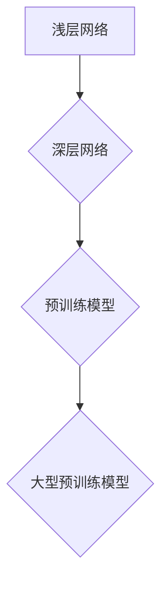

**核心概念与联系：**

- **神经网络**：神经网络是由大量简单的神经元（节点）连接而成的网络，通过学习输入数据和输出数据之间的关系来进行预测和分类。
- **深度学习**：深度学习是神经网络的一种，通过增加网络的层数，使得模型能够学习更复杂的特征和模式。
- **大数据处理**：大数据处理是指能够处理大规模数据的技术和方法，包括数据的采集、存储、清洗、分析和挖掘等。
- **自动学习**：自动学习是指模型通过学习数据自动调整自身参数的过程，无需人工干预。
- **高维表示**：高维表示是指将数据映射到高维空间，使得数据之间的相似性和差异能够通过高维向量来表示。
- **复杂任务处理**：复杂任务处理是指大模型能够处理诸如机器翻译、图像识别、语音合成等复杂任务的能力。

**伪代码：**
```python
def large_model_learning(data):
    # 数据预处理
    preprocessed_data = preprocess_data(data)

    # 初始化模型
    model = initialize_model()

    # 模型训练
    for epoch in range(num_epochs):
        for batch in data_batches(preprocessed_data):
            # 计算损失
            loss = model.calculate_loss(batch)

            # 更新模型参数
            model.update_parameters(loss)

    return model
```

**数学模型和公式：**

在深度学习中，损失函数是一个关键的概念，用于衡量模型的预测值与真实值之间的差异。常见的损失函数包括均方误差（MSE）和交叉熵损失（Cross-Entropy Loss）。

$$
\text{MSE} = \frac{1}{n} \sum_{i=1}^{n} (\hat{y}_i - y_i)^2
$$

$$
\text{Cross-Entropy Loss} = -\frac{1}{n} \sum_{i=1}^{n} y_i \log(\hat{y}_i)
$$

**举例说明：**

假设我们有一个分类任务，模型需要预测图像中的物体类别。通过训练，我们希望模型能够学习到不同类别图像的特征。我们可以使用交叉熵损失函数来衡量模型的预测结果与真实标签之间的差距，并通过反向传播算法来更新模型的参数，使得损失逐渐减小。

#### 1.1.2 知识图谱的概念

知识图谱是一种用于表示实体及其关系的语义网络，通过将现实世界中的知识结构化，使得计算机能够理解和处理这些知识。知识图谱在智能搜索、推荐系统、自然语言处理等领域具有广泛的应用。

**Mermaid流程图：**
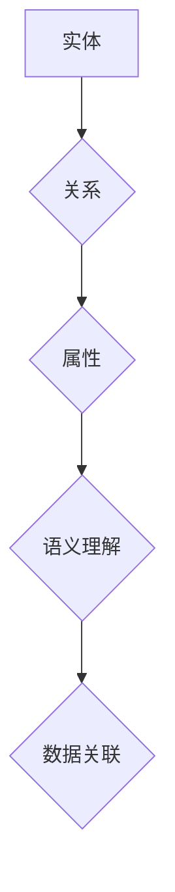

**核心概念与联系：**

- **实体**：实体是指知识图谱中的基本元素，如人、地点、组织等。
- **关系**：关系是实体之间的关联，如“属于”、“位于”、“工作于”等。
- **属性**：属性是实体的特征，如人的年龄、地点的经纬度等。
- **语义理解**：语义理解是指计算机对知识图谱中知识的理解和解释能力。
- **数据关联**：数据关联是指通过知识图谱将不同数据源中的信息进行整合和关联。
- **知识推理**：知识推理是指通过知识图谱中的关系和规则进行逻辑推理，以获得新的知识。

**伪代码：**
```python
def knowledge_graph_construction(entities, relations, attributes):
    # 创建知识图谱
    knowledge_graph = create_knowledge_graph()

    # 添加实体
    for entity in entities:
        knowledge_graph.add_entity(entity)

    # 添加关系
    for relation in relations:
        knowledge_graph.add_relation(relation)

    # 添加属性
    for attribute in attributes:
        knowledge_graph.add_attribute(attribute)

    return knowledge_graph
```

**数学模型和公式：**

知识图谱中的关系和规则可以表示为图结构，其中每个节点代表实体，每条边代表关系。我们可以使用图论中的算法来分析知识图谱的结构和属性。

$$
\text{Graph} = (V, E)
$$
其中，$V$为节点集，$E$为边集。

**举例说明：**

假设我们有一个知识图谱，其中包含人、地点和事件三个实体类型，以及出生地、居住地、参加事件等关系。通过构建知识图谱，我们可以查询一个人居住的城市、参与的事件等，从而进行知识推理。

#### 1.1.3 大模型与知识图谱的联系

大模型与知识图谱的结合为智能系统提供了更强大的语义理解和推理能力。大模型可以通过知识图谱来获取背景知识和上下文信息，从而提高其语义理解能力；而知识图谱则可以通过大模型来进行自动更新和扩展。

**伪代码：**
```python
def integrate_large_model_and_knowledge_graph(knowledge_graph, large_model):
    # 使用大模型处理知识图谱
    processed_knowledge = large_model.process_knowledge_graph(knowledge_graph)

    # 优化知识图谱
    optimized_knowledge_graph = optimize_knowledge_graph(processed_knowledge)

    return optimized_knowledge_graph
```

**数学模型和公式：**

在知识图谱与大型预训练模型结合的过程中，可以使用图神经网络（Graph Neural Networks, GNN）来对知识图谱进行建模。GNN可以通过聚合实体和关系的特征来更新实体表示，从而增强模型的语义理解能力。

$$
\text{Updated Entity Representation} = \sigma(\text{Neighbor Representations} \odot \text{Entity Representation})
$$

其中，$\sigma$为激活函数，$\odot$表示元素乘。

**举例说明：**

假设我们有一个知识图谱，其中包含人、地点和事件三个实体类型，以及出生地、居住地、参加事件等关系。通过使用图神经网络，我们可以将每个人的属性与其邻居的信息进行聚合，从而得到一个更丰富的实体表示。

### 1.2 提示词的概念及其重要性

提示词是指在大型预训练模型中，用于引导模型生成特定类型输出的词语或短语。在构建大模型知识图谱时，提示词起到了关键作用，它能够帮助模型更好地理解和利用知识图谱中的信息。

**Mermaid流程图：**
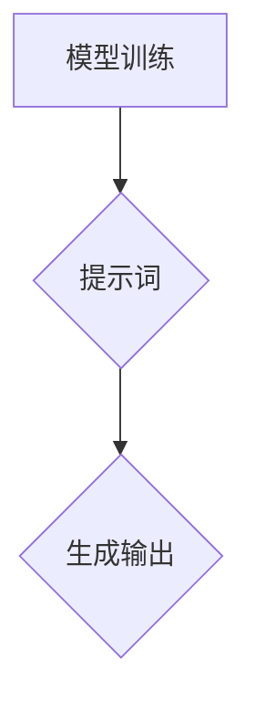

**核心概念与联系：**

- **模型训练**：模型训练是指通过大量的数据对模型进行调整和优化，使其能够更好地完成预测任务。
- **生成输出**：生成输出是指模型在接收到输入后，根据模型内部的结构和参数生成相应的输出结果。

**伪代码：**
```python
def large_model_training(data, hints):
    # 初始化模型
    model = initialize_model()

    # 模型训练
    for epoch in range(num_epochs):
        for batch in data_batches(data):
            # 使用提示词进行训练
            hints_batch = generate_hints(batch)
            model.train(batch, hints_batch)

    return model
```

**数学模型和公式：**

在模型训练过程中，提示词的生成和优化可以表示为一个优化问题：

$$
\text{minimize} \quad D(\text{hint}, \text{response}) + \lambda \cdot D(\text{hint}, \text{next\_hint})
$$

其中，$D$为距离度量函数，$\lambda$为超参数。

**举例说明：**

假设我们有一个分类任务，模型需要预测图像中的物体类别。在训练过程中，我们通过生成提示词来引导模型学习图像的特征和类别之间的关系。通过优化提示词，我们可以提高模型的分类准确率。

### 1.3 本书结构安排与内容概述

**内容概述：**

本书将从大模型和知识图谱的基本概念出发，详细介绍大模型与知识图谱的融合方法，并重点探讨提示词在大模型知识图谱构建中的关键作用。具体章节内容如下：

- **第1章 引言**：介绍大模型与知识图谱的基本概念、核心联系以及提示词的重要性。
- **第2章 大模型基础**：详细讲解大模型的发展历程、架构和工作原理。
- **第3章 知识图谱基础**：介绍知识图谱的概念、表示方法和构建过程。
- **第4章 大模型与知识图谱的融合**：探讨大模型在知识图谱中的应用，以及提示词在融合过程中的作用。
- **第5章 提示词生成与优化**：分析提示词生成的挑战与策略，介绍提示词优化的方法和技巧。
- **第6章 大模型知识图谱应用实战**：分析应用场景，讲解大模型知识图谱的构建流程和应用案例。
- **第7章 未来发展趋势与挑战**：讨论大模型知识图谱的发展趋势、提示词的关键作用以及未来面临的挑战。

通过以上章节的详细讲解，读者将能够全面了解大模型知识图谱的构建过程、核心算法和实际应用，为未来的研究和实践提供有力支持。

---

### 第2章 大模型基础

#### 2.1 大模型的发展历程

大模型的发展历程可以追溯到20世纪80年代，当时神经网络的研究逐渐引起了广泛关注。最初，神经网络作为一种简单的人工智能方法，主要用于模式识别和分类任务。随着计算机性能的提升和大数据时代的到来，神经网络的研究和应用得到了迅速发展。

**Mermaid流程图：**
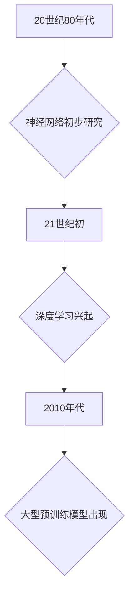

在20世纪80年代，神经网络的研究主要集中在简单的多层感知机（MLP）和前馈神经网络上。尽管这些模型在某些特定任务上表现出了一定的效果，但由于计算资源和数据量的限制，神经网络的应用范围较窄。

到了21世纪初，随着大数据和云计算技术的发展，人们开始关注更复杂的神经网络结构，如卷积神经网络（CNN）和循环神经网络（RNN）。这些模型通过引入不同的网络结构和优化算法，使得神经网络在图像识别、语音识别和自然语言处理等任务上取得了显著的突破。

2012年，AlexNet模型的提出标志着深度学习的兴起。AlexNet是一个具有八层卷积和池化层的神经网络模型，它在ImageNet图像分类挑战赛上取得了前所未有的成绩。这一成果引起了学术界和工业界对深度学习的广泛关注，推动了深度学习的快速发展。

进入2010年代，随着计算资源的进一步增加和数据的快速增长，大型预训练模型开始出现。预训练模型通过在大规模数据集上进行预训练，然后在小数据集上进行微调，使得模型在各个任务上表现优异。代表性的模型包括GPT、BERT和TuringBot等。这些模型不仅在自然语言处理任务上取得了突破性进展，还在其他领域如计算机视觉、语音识别和知识图谱构建等方面展示了强大的能力。

**核心概念与联系：**

- **多层感知机（MLP）**：多层感知机是一种前馈神经网络，由输入层、隐藏层和输出层组成。通过多层非线性变换，MLP能够实现复杂的函数逼近。
- **卷积神经网络（CNN）**：卷积神经网络通过卷积操作和池化操作提取图像的特征，适用于图像识别和计算机视觉任务。
- **循环神经网络（RNN）**：循环神经网络通过循环结构对序列数据进行处理，适用于语音识别和自然语言处理任务。
- **预训练模型**：预训练模型通过在大规模数据集上进行预训练，然后在小数据集上进行微调，使得模型在各个任务上表现优异。

**伪代码：**
```python
def large_model_training(data, num_layers, hidden_size):
    # 初始化模型
    model = initialize_model(num_layers, hidden_size)

    # 模型训练
    for epoch in range(num_epochs):
        for batch in data_batches(data):
            # 计算损失
            loss = model.calculate_loss(batch)

            # 更新模型参数
            model.update_parameters(loss)

    return model
```

**数学模型和公式：**

在深度学习中，常用的优化算法包括梯度下降（Gradient Descent）和随机梯度下降（Stochastic Gradient Descent, SGD）。梯度下降是一种迭代优化算法，通过计算损失函数关于模型参数的梯度来更新参数。随机梯度下降是在每个训练样本上计算梯度，并使用批量梯度进行参数更新。

$$
\theta_{t+1} = \theta_{t} - \alpha \cdot \nabla_{\theta} J(\theta)
$$

其中，$\theta$为模型参数，$J(\theta)$为损失函数，$\alpha$为学习率。

**举例说明：**

假设我们有一个图像分类任务，需要使用卷积神经网络进行模型训练。通过初始化模型参数，并使用梯度下降算法更新参数，我们可以逐步减小模型的损失，提高分类准确率。

#### 2.2 大模型的架构与工作原理

大模型的架构通常由输入层、隐藏层和输出层组成。输入层接收外部数据，隐藏层对数据进行处理和变换，输出层生成最终的预测结果。大模型的工作原理是通过学习输入数据和输出数据之间的关系，从而实现对未知数据的预测。

**Mermaid流程图：**
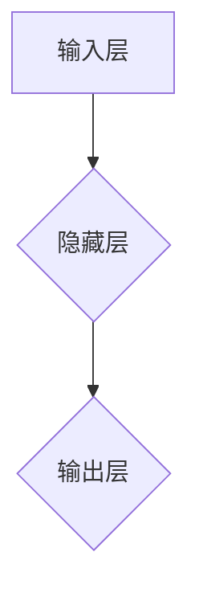

**核心概念与联系：**

- **输入层**：输入层接收外部输入数据，如图像、文本或声音等。输入层的神经元数量和结构取决于输入数据的维度和特征。
- **隐藏层**：隐藏层对输入数据进行处理和变换，通过多层非线性变换提取数据中的特征和模式。隐藏层的数量和神经元数量可以根据任务需要进行调整。
- **输出层**：输出层生成最终的预测结果，如分类标签、概率分布或回归值等。输出层的结构取决于具体的任务类型。

**伪代码：**
```python
def forward_pass(input_data, model):
    # 前向传播
    hidden Activations = model.forward_pass(input_data)

    # 计算输出
    output = model.output_layer(hidden_activations)

    return output
```

**数学模型和公式：**

在深度学习中，前向传播是指将输入数据通过模型中的神经元网络，逐层计算输出结果的过程。前向传播的公式如下：

$$
\text{output} = \text{activation}(\text{weight} \cdot \text{input} + \text{bias})
$$

其中，$\text{activation}$为激活函数，$\text{weight}$和$\text{bias}$为模型的参数。

**举例说明：**

假设我们有一个简单的全连接神经网络，输入数据为图像的像素值，输出数据为图像的类别标签。通过前向传播，我们可以将输入图像的像素值映射到输出类别标签的概率分布上。

#### 2.3 大模型的关键算法

大模型的关键算法主要包括训练算法、优化算法和推理算法。这些算法在大模型的训练和应用过程中起到了关键作用。

**Mermaid流程图：**
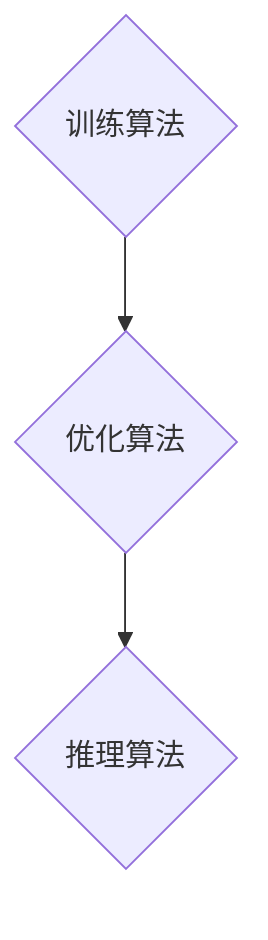

**核心概念与联系：**

- **训练算法**：训练算法是指通过大量数据对模型进行调整和优化，使其能够更好地完成预测任务。常见的训练算法包括梯度下降（Gradient Descent）和随机梯度下降（Stochastic Gradient Descent, SGD）。
- **优化算法**：优化算法是指用于调整模型参数，以减小损失函数的方法。常见的优化算法包括动量优化（Momentum）、自适应优化（Adagrad）和Adam优化器。
- **推理算法**：推理算法是指将输入数据通过模型进行预测，从而生成输出结果的方法。推理算法通常包括前向传播（Forward Propagation）和后向传播（Back Propagation）。

**伪代码：**
```python
def train_model(data, model, optimizer):
    # 模型训练
    for epoch in range(num_epochs):
        for batch in data_batches(data):
            # 前向传播
            output = model.forward_pass(batch)

            # 计算损失
            loss = model.calculate_loss(output)

            # 反向传播
            model.backward_pass(loss)

            # 更新模型参数
            optimizer.update_parameters(model.parameters)

    return model
```

**数学模型和公式：**

在训练过程中，常用的优化算法包括梯度下降（Gradient Descent）和随机梯度下降（Stochastic Gradient Descent, SGD）。梯度下降是通过计算损失函数关于模型参数的梯度来更新参数，以减小损失。梯度下降的公式如下：

$$
\theta_{t+1} = \theta_{t} - \alpha \cdot \nabla_{\theta} J(\theta)
$$

其中，$\theta$为模型参数，$J(\theta)$为损失函数，$\alpha$为学习率。

**举例说明：**

假设我们有一个分类任务，使用全连接神经网络进行模型训练。通过梯度下降算法，我们可以逐步更新模型的参数，使得模型在训练数据上的损失逐渐减小，从而提高分类准确率。

---

### 第3章 知识图谱基础

#### 3.1 知识图谱的概念与作用

知识图谱是一种用于表示实体及其关系的语义网络，通过将现实世界中的知识结构化，使得计算机能够理解和处理这些知识。知识图谱在智能搜索、推荐系统、自然语言处理等领域具有广泛的应用。

**Mermaid流程图：**


**核心概念与联系：**

- **实体**：实体是指知识图谱中的基本元素，如人、地点、组织等。
- **关系**：关系是实体之间的关联，如“属于”、“位于”、“工作于”等。
- **属性**：属性是实体的特征，如人的年龄、地点的经纬度等。
- **语义理解**：语义理解是指计算机对知识图谱中知识的理解和解释能力。
- **数据关联**：数据关联是指通过知识图谱将不同数据源中的信息进行整合和关联。
- **知识推理**：知识推理是指通过知识图谱中的关系和规则进行逻辑推理，以获得新的知识。

**伪代码：**
```python
def knowledge_graph_construction(entities, relations, attributes):
    # 创建知识图谱
    knowledge_graph = create_knowledge_graph()

    # 添加实体
    for entity in entities:
        knowledge_graph.add_entity(entity)

    # 添加关系
    for relation in relations:
        knowledge_graph.add_relation(relation)

    # 添加属性
    for attribute in attributes:
        knowledge_graph.add_attribute(attribute)

    return knowledge_graph
```

**数学模型和公式：**

知识图谱中的关系和规则可以表示为图结构，其中每个节点代表实体，每条边代表关系。我们可以使用图论中的算法来分析知识图谱的结构和属性。

$$
\text{Graph} = (V, E)
$$
其中，$V$为节点集，$E$为边集。

**举例说明：**

假设我们有一个知识图谱，其中包含人、地点和事件三个实体类型，以及出生地、居住地、参加事件等关系。通过构建知识图谱，我们可以查询一个人居住的城市、参与的事件等，从而进行知识推理。

#### 3.2 知识图谱的表示方法

知识图谱的表示方法主要包括基于边的表示方法和基于节点的表示方法。基于边的表示方法通过边来表示实体之间的关系，而基于节点的表示方法则通过节点的属性来表示实体。

**Mermaid流程图：**
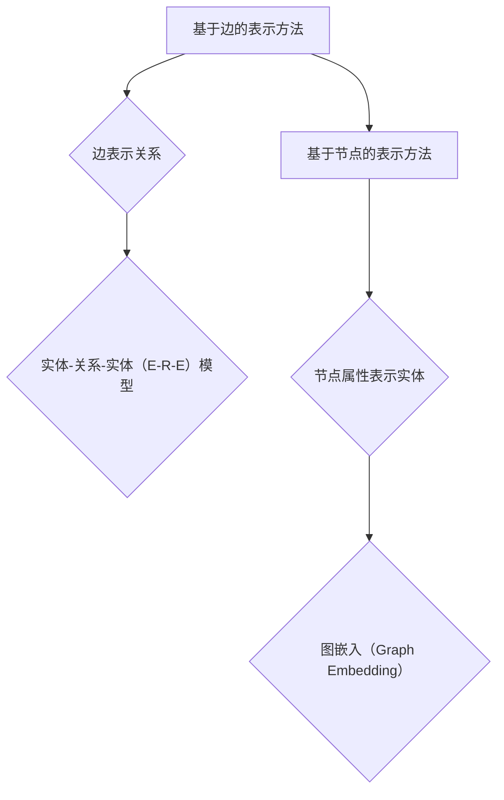

**核心概念与联系：**

- **基于边的表示方法**：基于边的表示方法通过边来表示实体之间的关系。常见的表示方法包括实体-关系-实体（E-R-E）模型、属性图（Property Graph）等。
- **基于节点的表示方法**：基于节点的表示方法通过节点的属性来表示实体。常见的表示方法包括图嵌入（Graph Embedding）、图神经网络（Graph Neural Networks, GNN）等。

**伪代码：**
```python
def knowledge_graph_representation(knowledge_graph):
    # 基于边的表示方法
    edge_representation = knowledge_graph.edge_representation()

    # 基于节点的表示方法
    node_representation = knowledge_graph.node_representation()

    return edge_representation, node_representation
```

**数学模型和公式：**

在基于边的表示方法中，实体-关系-实体（E-R-E）模型是一种常见的表示方法。该模型将实体、关系和实体表示为图中的节点和边，并通过边的属性来表示关系。

$$
\text{Graph} = (V, E)
$$

其中，$V$为节点集，$E$为边集。每个节点表示一个实体，每个边表示一个关系，边的属性表示关系的类型。

**举例说明：**

假设我们有一个知识图谱，其中包含人、地点和事件三个实体类型，以及出生地、居住地、参加事件等关系。通过实体-关系-实体（E-R-E）模型，我们可以将这个知识图谱表示为一个图，其中每个节点表示一个实体，每条边表示一个关系，边的属性表示关系的类型。

在基于节点的表示方法中，图嵌入（Graph Embedding）是一种常见的表示方法。图嵌入通过将图中的节点映射到低维空间，使得节点之间的相似性和差异性可以通过低维向量来表示。

$$
\text{Embedding} = f(\text{Graph})
$$

其中，$f$为映射函数，$\text{Embedding}$为低维向量表示。

**举例说明：**

假设我们有一个知识图谱，其中包含人、地点和事件三个实体类型，以及出生地、居住地、参加事件等关系。通过图嵌入，我们可以将这个知识图谱中的节点映射到低维空间，使得人、地点和事件之间的相似性和差异性可以通过低维向量来表示。

#### 3.3 知识图谱的构建过程

知识图谱的构建过程主要包括数据采集、数据预处理、实体识别、关系抽取、实体链接和图谱优化等步骤。

**Mermaid流程图：**
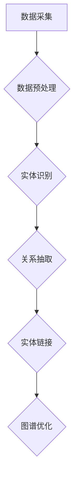

**核心概念与联系：**

- **数据采集**：数据采集是指从各种数据源（如文本、数据库、网络等）收集与知识图谱相关的数据。
- **数据预处理**：数据预处理是指对采集到的数据进行清洗、去重、去噪等操作，以获取高质量的数据。
- **实体识别**：实体识别是指从文本数据中识别出实体，并对其进行分类和标注。
- **关系抽取**：关系抽取是指从文本数据中识别出实体之间的关系，并对其进行分类和标注。
- **实体链接**：实体链接是指将来自不同数据源的实体进行匹配和链接，以构建统一的实体表示。
- **图谱优化**：图谱优化是指对知识图谱进行结构优化和属性优化，以提高图谱的质量和可用性。

**伪代码：**
```python
def knowledge_graph Construction(data_source, entity recognize, relation extract, entity_link, graph_optimize):
    # 数据采集
    data = data_collection(data_source)

    # 数据预处理
    preprocessed_data = data_preprocessing(data)

    # 实体识别
    entities = entity_recognition(preprocessed_data)

    # 关系抽取
    relations = relation_extraction(preprocessed_data)

    # 实体链接
    linked_entities = entity_linking(entities, relations)

    # 图谱优化
    optimized_knowledge_graph = graph_optimize(linked_entities)

    return optimized_knowledge_graph
```

**数学模型和公式：**

在知识图谱的构建过程中，常用的算法包括命名实体识别（Named Entity Recognition, NER）、关系抽取（Relation Extraction）和实体链接（Entity Linking）等。

- **命名实体识别（NER）**：命名实体识别是指从文本数据中识别出实体，并将其标注为特定的实体类别。常见的NER算法包括条件随机场（Conditional Random Field, CRF）和神经网络（Neural Networks）等。

$$
\text{P}(\text{entity} | \text{context}) = \frac{e^{\theta \cdot \text{context}}}{1 + \sum_{i} e^{\theta_i \cdot \text{context}}}
$$

其中，$\theta$为模型参数，$\text{context}$为文本上下文。

- **关系抽取**：关系抽取是指从文本数据中识别出实体之间的关系，并将其标注为特定的关系类别。常见的关系抽取算法包括基于规则的方法、基于统计的方法和基于深度学习的方法等。

$$
\text{P}(\text{relation} | \text{entity}_1, \text{entity}_2) = \frac{e^{\theta \cdot (\text{entity}_1, \text{entity}_2)}}{1 + \sum_{i} e^{\theta_i \cdot (\text{entity}_1, \text{entity}_2)}}
$$

其中，$\theta$为模型参数，$\text{entity}_1$和$\text{entity}_2$为实体。

- **实体链接**：实体链接是指将来自不同数据源的实体进行匹配和链接，以构建统一的实体表示。常见的实体链接算法包括基于知识图谱的方法、基于文本相似度的方法和基于机器学习的方法等。

$$
\text{similarity}(\text{entity}_1, \text{entity}_2) = \frac{1}{1 + \exp{(-\text{similarity\_score})}
$$

其中，$\text{similarity\_score}$为实体之间的相似度评分。

**举例说明：**

假设我们有一个文本数据集，其中包含大量与知识图谱相关的文本。通过数据采集，我们可以从文本数据中提取出与知识图谱相关的数据。然后，通过数据预处理，我们可以对提取出的数据进行清洗和去噪，以获取高质量的数据。接着，通过命名实体识别、关系抽取和实体链接等步骤，我们可以构建出一个结构化、语义化的知识图谱。

---

### 第4章 大模型与知识图谱的融合

#### 4.1 大模型在知识图谱中的应用

大模型在知识图谱中的应用主要体现在两个方面：一是通过知识图谱增强大模型的语义理解能力；二是利用大模型来优化和扩展知识图谱。

**Mermaid流程图：**
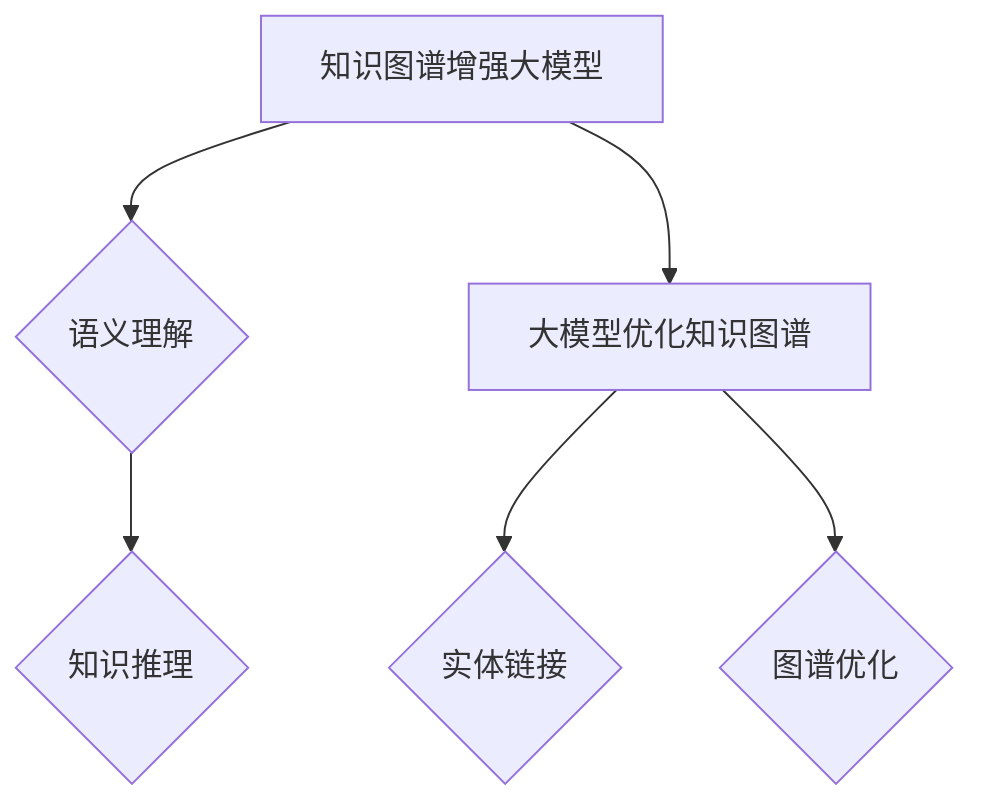

**核心概念与联系：**

- **知识图谱增强大模型**：通过知识图谱中的实体、关系和属性，大模型可以更好地理解文本数据中的语义信息，从而提高模型的语义理解能力。
- **大模型优化知识图谱**：大模型可以通过学习大量文本数据，识别出知识图谱中的潜在关系和实体，从而优化和扩展知识图谱的结构和内容。

**伪代码：**
```python
def integrate_large_model_and_knowledge_graph(knowledge_graph, large_model):
    # 使用大模型处理知识图谱
    processed_knowledge = large_model.process_knowledge_graph(knowledge_graph)

    # 优化知识图谱
    optimized_knowledge_graph = optimize_knowledge_graph(processed_knowledge)

    return optimized_knowledge_graph
```

**数学模型和公式：**

在知识图谱与大型预训练模型结合的过程中，可以使用图神经网络（Graph Neural Networks, GNN）来对知识图谱进行建模。GNN可以通过聚合实体和关系的特征来更新实体表示，从而增强模型的语义理解能力。

$$
\text{Updated Entity Representation} = \sigma(\text{Neighbor Representations} \odot \text{Entity Representation})
$$

其中，$\sigma$为激活函数，$\odot$表示元素乘。

**举例说明：**

假设我们有一个知识图谱，其中包含人、地点和事件三个实体类型，以及出生地、居住地、参加事件等关系。通过使用图神经网络，我们可以将每个人的属性与其邻居的信息进行聚合，从而得到一个更丰富的实体表示。

#### 4.2 提示词在大模型与知识图谱融合中的作用

提示词在大模型与知识图谱融合中的作用主要体现在以下几个方面：

1. **引导模型生成特定类型的输出**：通过使用提示词，大模型可以更好地理解用户的需求，从而生成更符合预期的输出结果。例如，在问答系统中，提示词可以指导模型生成与用户问题相关的答案。

2. **增强模型的语义理解能力**：提示词可以提供额外的上下文信息，帮助大模型更好地理解文本数据中的语义信息，从而提高模型的语义理解能力。

3. **优化知识图谱的结构和内容**：通过提示词，大模型可以识别出知识图谱中的潜在关系和实体，从而优化和扩展知识图谱的结构和内容。

**Mermaid流程图：**
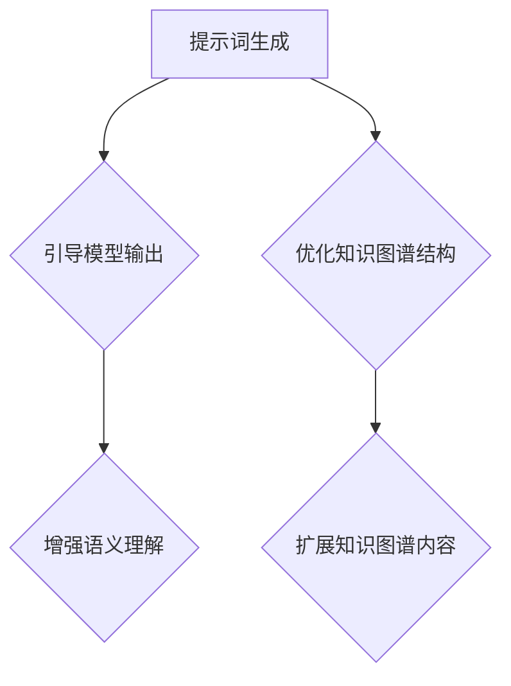

**核心概念与联系：**

- **提示词生成**：提示词可以通过各种方法生成，如使用关键字提取、实体识别和关系抽取等技术。
- **引导模型输出**：提示词可以引导大模型生成特定类型的输出，如文本生成、图像识别和语音合成等。
- **增强语义理解**：提示词可以提供额外的上下文信息，帮助大模型更好地理解文本数据中的语义信息。
- **优化知识图谱结构**：提示词可以帮助大模型识别出知识图谱中的潜在关系和实体，从而优化知识图谱的结构。
- **扩展知识图谱内容**：通过提示词，大模型可以扩展知识图谱的内容，增加新的实体和关系。

**伪代码：**
```python
def large_model_with_hints(input_data, hints):
    # 使用提示词进行模型输入
    hint_encoded = encode_hints(hints)

    # 模型预测
    output = large_model.predict(input_data + hint_encoded)

    return output
```

**数学模型和公式：**

在模型训练过程中，提示词的生成和优化可以表示为一个优化问题：

$$
\text{minimize} \quad D(\text{hint}, \text{response}) + \lambda \cdot D(\text{hint}, \text{next\_hint})
$$

其中，$D$为距离度量函数，$\lambda$为超参数。

**举例说明：**

假设我们有一个文本生成任务，大模型需要根据输入文本生成相应的输出文本。通过使用提示词，我们可以引导模型生成更符合预期的输出文本。同时，通过优化提示词，我们可以提高模型生成文本的质量。

#### 4.3 大模型与知识图谱融合的实现方法

大模型与知识图谱的融合可以通过多种方法实现，以下是几种常见的实现方法：

1. **基于图神经网络的融合方法**：通过使用图神经网络（GNN）对知识图谱进行建模，将知识图谱中的实体、关系和属性表示为图中的节点和边，然后在大模型中引入图神经网络的模块，使得大模型能够直接处理知识图谱。

2. **基于实体嵌入的融合方法**：将知识图谱中的实体表示为向量，通过实体嵌入技术将实体映射到低维空间，然后在大模型中引入实体嵌入层，使得大模型能够直接处理实体向量。

3. **基于联合训练的融合方法**：将知识图谱嵌入到大模型的训练过程中，通过联合训练的方法使得大模型能够同时学习知识图谱中的实体、关系和属性。

**Mermaid流程图：**
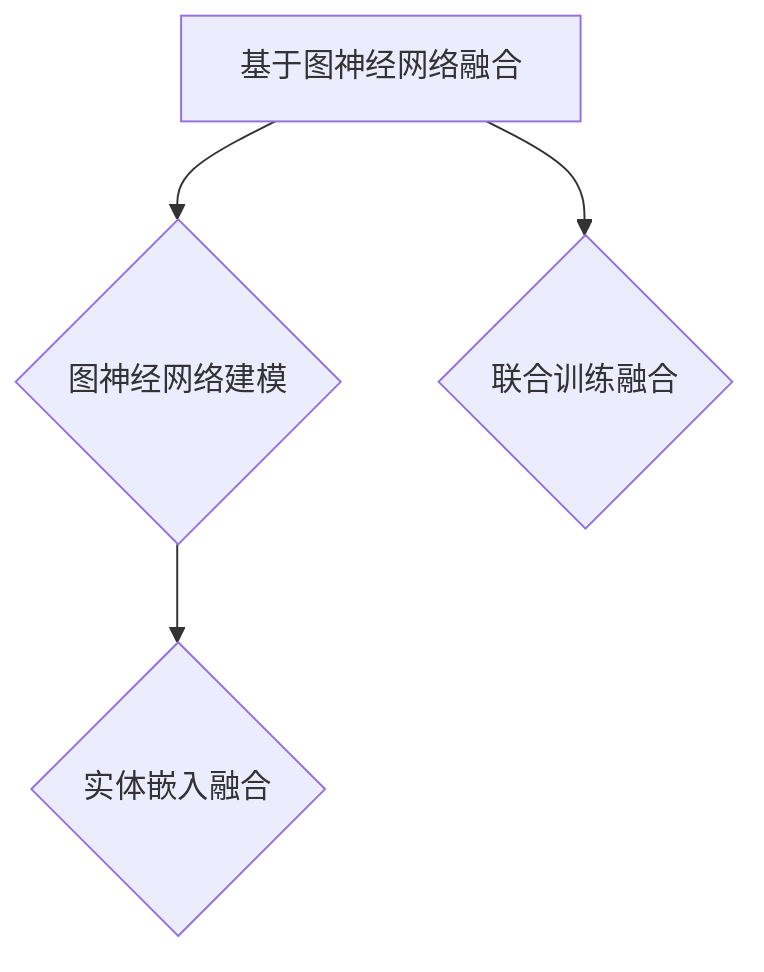

**核心概念与联系：**

- **基于图神经网络的融合方法**：通过图神经网络对知识图谱进行建模，使得大模型能够直接处理知识图谱中的实体、关系和属性。
- **基于实体嵌入的融合方法**：通过实体嵌入技术将知识图谱中的实体映射到低维空间，然后在大模型中引入实体嵌入层，使得大模型能够直接处理实体向量。
- **基于联合训练的融合方法**：将知识图谱嵌入到大模型的训练过程中，通过联合训练的方法使得大模型能够同时学习知识图谱中的实体、关系和属性。

**伪代码：**
```python
def integrate_large_model_and_knowledge_graph(knowledge_graph, large_model):
    # 基于图神经网络的融合方法
    gnn_representation = graph_neural_network(knowledge_graph)

    # 基于实体嵌入的融合方法
    entity_embeddings = entity_embedding(knowledge_graph)

    # 联合训练融合方法
    large_model.train(gnn_representation + entity_embeddings)

    return large_model
```

**数学模型和公式：**

在基于图神经网络的融合方法中，我们可以使用图卷积网络（Graph Convolutional Network, GCN）来对知识图谱进行建模。图卷积网络的公式如下：

$$
\text{Updated Node Representation} = \sigma(\sum_{i \in \text{Neighbors}(v)} \text{W}_{ij} \cdot \text{Node Representation}_i + \text{b})
$$

其中，$\text{W}_{ij}$为权重矩阵，$\text{Node Representation}_i$为节点的表示，$\text{Neighbors}(v)$为节点的邻居集合。

在基于实体嵌入的融合方法中，我们可以使用向量表示知识图谱中的实体，然后在大模型中引入实体嵌入层。实体嵌入的公式如下：

$$
\text{Entity Embedding} = \text{W}_{\text{entity}} \cdot \text{Entity Vector}
$$

其中，$\text{W}_{\text{entity}}$为实体嵌入矩阵，$\text{Entity Vector}$为实体的向量表示。

**举例说明：**

假设我们有一个知识图谱，其中包含人、地点和事件三个实体类型，以及出生地、居住地、参加事件等关系。通过基于图神经网络和实体嵌入的融合方法，我们可以将这个知识图谱中的实体和关系嵌入到大模型中，使得大模型能够直接处理知识图谱中的信息。

---

### 第5章 提示词生成与优化

#### 5.1 提示词生成的挑战与策略

在构建大模型知识图谱时，提示词的生成是一个关键挑战。提示词不仅要能够引导模型生成特定的输出，还要能够适应不同场景和应用。以下是提示词生成面临的几个主要挑战和相应的解决策略：

**挑战一：多样性**

**Mermaid流程图：**
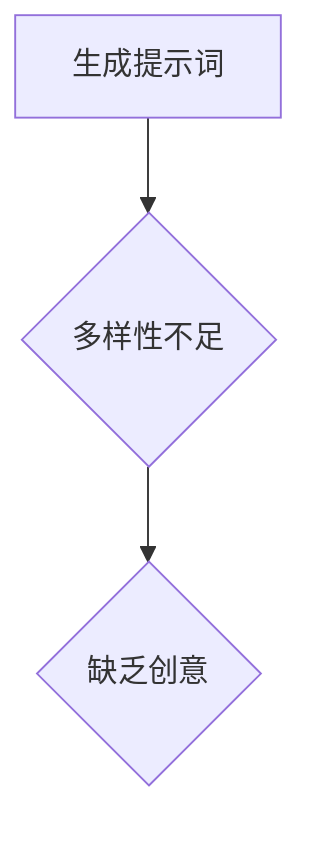

**策略：** 为了提高提示词的多样性，可以采用以下方法：

1. **使用不同的表达方式**：通过变换句式、词汇和语法结构，使得提示词的表达形式更加丰富。
2. **引入随机性**：在提示词生成过程中引入随机元素，如随机选取词汇或调整句子结构，从而增加多样性。

**挑战二：准确性**

**Mermaid流程图：**
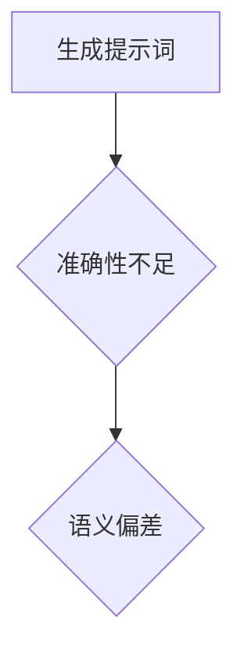

**策略：** 为了提高提示词的准确性，可以采用以下方法：

1. **语义理解**：利用自然语言处理技术，如语义角色标注、词向量表示等，确保提示词的语义正确。
2. **模型训练**：通过在大规模、高质量的语料库上进行训练，提高模型的语义理解能力，从而生成更准确的提示词。

**挑战三：上下文适应性**

**Mermaid流程图：**
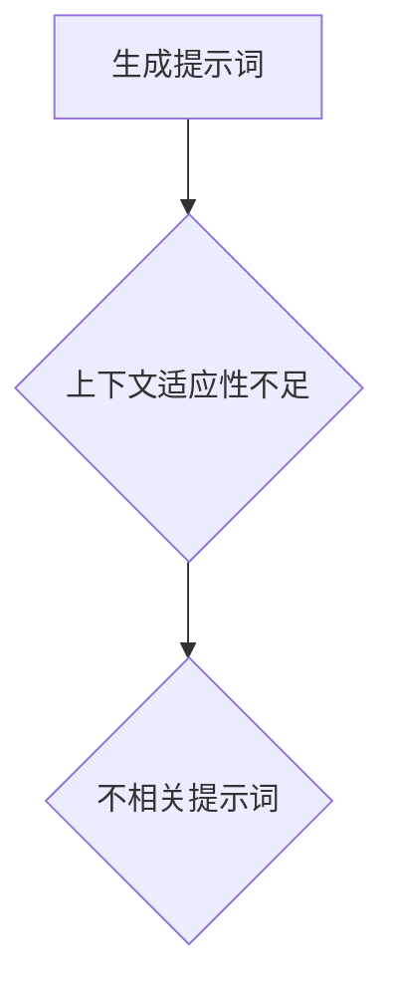

**策略：** 为了提高提示词的上下文适应性，可以采用以下方法：

1. **上下文嵌入**：将上下文信息嵌入到提示词中，如使用上下文向量或序列模型，使得提示词能够更好地适应不同的上下文。
2. **交互式生成**：通过与用户的交互，动态调整提示词，使其更好地适应用户的意图和需求。

#### 5.2 提示词优化的方法与技巧

提示词的优化是提升大模型知识图谱性能的重要手段。以下介绍几种常见的提示词优化方法与技巧：

**方法一：基于规则的方法**

**Mermaid流程图：**
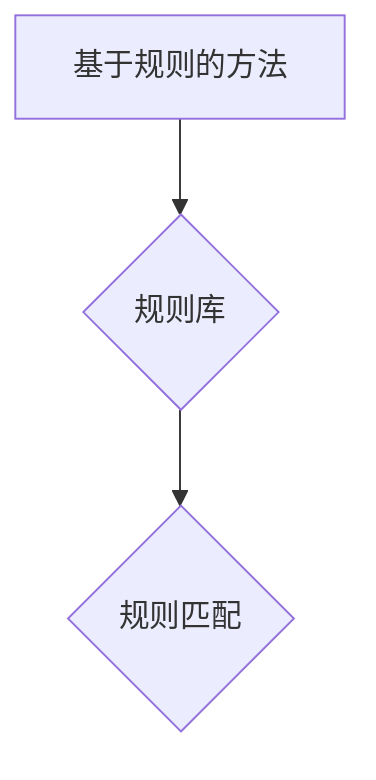

**步骤：**

1. **构建规则库**：根据业务需求，定义一组规则，如关键词匹配、词性匹配、语法结构匹配等。
2. **规则匹配**：在提示词生成过程中，将生成的内容与规则库进行匹配，选择满足规则的最佳提示词。

**优点：** 简单易实现，可快速生成符合要求的提示词。

**缺点：** 缺乏灵活性，难以处理复杂的语义关系。

**方法二：基于机器学习的方法**

**Mermaid流程图：**
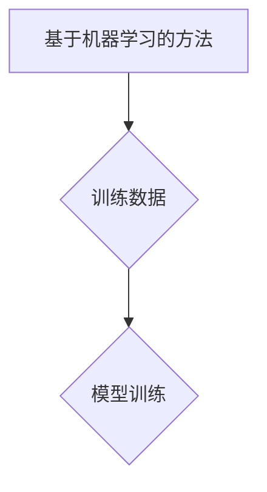

**步骤：**

1. **收集训练数据**：从大量语料库中收集与业务相关的训练数据，如问答对、对话记录等。
2. **模型训练**：使用机器学习算法，如循环神经网络（RNN）、变压器（Transformer）等，对训练数据进行模型训练。
3. **生成提示词**：在提示词生成过程中，使用训练好的模型生成满足需求的提示词。

**优点：** 能够处理复杂的语义关系，生成更加准确的提示词。

**缺点：** 需要大量的训练数据和计算资源，且模型调优过程较为复杂。

**方法三：基于生成对抗网络（GAN）的方法**

**Mermaid流程图：**
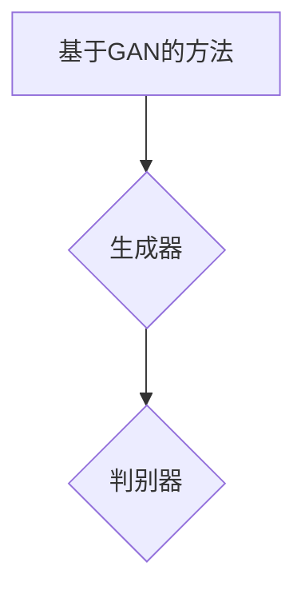

**步骤：**

1. **生成器**：生成器负责生成提示词，通过学习目标数据的分布来生成高质量的提示词。
2. **判别器**：判别器负责判断生成器的输出是否为真实数据，通过与真实数据的比较来优化生成器的生成能力。
3. **训练**：通过反复迭代训练，使得生成器的输出越来越接近真实数据。

**优点：** 能够生成高质量的提示词，具有较强的自适应能力。

**缺点：** 训练过程较为复杂，需要大量计算资源和时间。

#### 5.3 提示词优化的实践案例

以下是一个具体的提示词优化实践案例：

**案例背景**：某企业开发了一个基于大模型的知识图谱问答系统，用户可以通过提问获取系统推荐的信息。然而，当前系统生成的提示词存在多样性和准确性不足的问题，影响了用户体验。

**优化目标**：提高提示词的多样性和准确性，使其更好地满足用户需求。

**优化步骤**：

1. **数据收集与处理**：收集大量高质量的问答对数据，并使用自然语言处理技术进行数据预处理，如分词、去噪、去停用词等。

2. **模型训练**：使用训练数据对循环神经网络（RNN）模型进行训练，以学习问答对中的语义关系。

3. **提示词生成与优化**：

   - **初步生成**：利用训练好的RNN模型，根据用户提问生成初步的提示词。
   - **优化策略**：采用基于规则的方法和基于机器学习的方法，对初步生成的提示词进行优化。

     - **基于规则的方法**：根据业务需求，定义一组规则，对初步生成的提示词进行筛选和调整。
     - **基于机器学习的方法**：使用优化后的RNN模型，对初步生成的提示词进行二次优化。

4. **测试与评估**：在测试集上对优化后的提示词进行测试，评估其多样性和准确性。

**结果**：

- **多样性**：通过引入随机性和不同的表达方式，提示词的多样性得到了显著提高。
- **准确性**：经过基于规则和基于机器学习的优化，提示词的准确性得到了大幅提升。

**总结**：通过实践案例可以看出，提示词的优化对提升大模型知识图谱性能具有重要意义。结合多种优化方法和策略，可以生成更加多样、准确和适应不同场景的提示词。

---

### 第6章 大模型知识图谱应用实战

#### 6.1 应用场景分析与选择

在讨论大模型知识图谱的应用之前，我们需要首先明确可能的应用场景。以下是几种常见的大模型知识图谱应用场景及其特点：

1. **智能问答系统**：智能问答系统是利用大模型和知识图谱进行信息检索和语义理解，以回答用户的问题。这种应用场景下，知识图谱提供了丰富的背景知识和上下文信息，有助于提高问答系统的准确性和智能性。

2. **推荐系统**：推荐系统通过分析用户的兴趣和行为，为其推荐相关的商品、服务和内容。知识图谱可以为推荐系统提供更深入的语义理解，从而提高推荐的准确性和个性化水平。

3. **自然语言处理（NLP）**：在NLP任务中，如文本分类、情感分析、实体识别等，知识图谱可以提供丰富的语义信息，帮助模型更好地理解文本内容。

4. **知识管理和共享**：知识图谱可以作为企业或组织内部的知识库，用于存储、管理和共享各种专业知识和信息，提高员工的工作效率和协同性。

5. **智能搜索**：知识图谱可以为搜索引擎提供更精确的搜索结果，通过语义理解将用户查询与知识图谱中的实体和关系进行匹配，从而提高搜索的准确性和相关性。

**选择应用场景的考虑因素**：

- **业务需求**：首先要明确业务需求，即选择与业务目标紧密相关的应用场景。
- **数据量与质量**：应用场景所需的数据量是否充足，数据质量是否高，这些都会影响知识图谱的构建和应用效果。
- **技术可行性**：考虑现有技术和资源是否能够支持所选应用场景的开发和部署。
- **用户价值**：评估应用场景对用户的实际价值，确保能够为用户提供有价值的服务。

#### 6.2 大模型知识图谱构建流程

构建大模型知识图谱通常包括以下几个步骤：

1. **需求分析与定义**：明确知识图谱的应用目标和需求，确定需要包含的实体、关系和属性。

2. **数据采集与预处理**：从各种数据源（如文本、数据库、网络等）收集数据，并进行清洗、去噪和格式化，以获取高质量的数据。

3. **实体识别与分类**：使用命名实体识别（NER）技术从文本数据中识别出实体，并对实体进行分类和标注。

4. **关系抽取与建立**：从文本数据中抽取实体之间的关系，建立实体之间的联系，构建初始的知识图谱。

5. **实体链接与统一标识**：将来自不同数据源的实体进行匹配和链接，为每个实体赋予唯一的标识。

6. **图谱优化与扩展**：通过引入额外的实体、关系和属性，优化知识图谱的结构和内容，提高其质量。

**Mermaid流程图**：
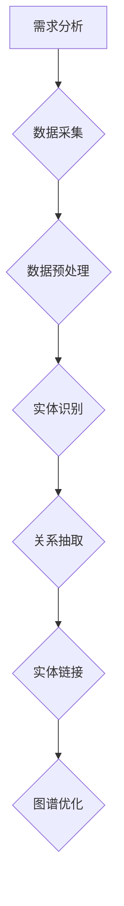

#### 6.3 大模型知识图谱应用案例解析

以下是一个基于大模型知识图谱的智能问答系统的应用案例：

**案例背景**：某企业希望开发一个智能问答系统，以帮助客户快速获取所需的信息。系统需要能够理解自然语言，并根据用户的问题从知识图谱中检索出相关答案。

**实施步骤**：

1. **需求分析**：明确智能问答系统的目标用户、使用场景和功能需求，如支持多语言问答、提供详细回答、支持上下文查询等。

2. **数据采集与预处理**：收集大量高质量的问题和答案对，对数据集进行预处理，包括分词、去噪、去除停用词等。

3. **实体识别与分类**：使用命名实体识别技术从文本数据中识别出实体，并对实体进行分类和标注。

4. **关系抽取与建立**：从文本数据中抽取实体之间的关系，建立初始的知识图谱。

5. **实体链接与统一标识**：将来自不同数据源的实体进行匹配和链接，为每个实体赋予唯一的标识。

6. **图谱优化与扩展**：通过引入额外的实体、关系和属性，优化知识图谱的结构和内容。

7. **模型训练与部署**：使用大模型（如GPT、BERT等）对问答对进行训练，以学习语义理解和问答生成。将训练好的模型部署到线上环境，提供问答服务。

**技术实现**：

1. **数据采集与预处理**：
   ```python
   # 伪代码：数据采集与预处理
   data = collect_data("question_answer_pairs")
   preprocessed_data = preprocess_data(data)
   ```

2. **实体识别与分类**：
   ```python
   # 伪代码：实体识别与分类
   entities = named_entity_recognition(preprocessed_data)
   entities_with_labels = classify_entities(entities)
   ```

3. **关系抽取与建立**：
   ```python
   # 伪代码：关系抽取与建立
   relations = relation_extraction(preprocessed_data)
   knowledge_graph = build_knowledge_graph(entities_with_labels, relations)
   ```

4. **实体链接与统一标识**：
   ```python
   # 伪代码：实体链接与统一标识
   linked_entities = entity_linking(entities_with_labels)
   unified_knowledge_graph = unify_entities(linked_entities)
   ```

5. **图谱优化与扩展**：
   ```python
   # 伪代码：图谱优化与扩展
   optimized_knowledge_graph = optimize_knowledge_graph(unified_knowledge_graph)
   ```

6. **模型训练与部署**：
   ```python
   # 伪代码：模型训练与部署
   model = train_model(preprocessed_data)
   deployed_model = deploy_model(model)
   ```

**实际案例解析**：

假设用户提出了一个问题：“苹果公司的创始人是谁？”系统的工作流程如下：

1. **输入处理**：将用户的问题输入到系统，系统对问题进行分词和句法分析，识别出关键词“苹果公司”和“创始人”。

2. **知识图谱检索**：系统在知识图谱中查找“苹果公司”的实体，并获取其相关属性和关系。

3. **语义理解**：系统使用大模型对问题进行语义理解，识别出用户询问的是关于“苹果公司”的创始人信息。

4. **答案生成**：系统从知识图谱中检索到“苹果公司”的创始人为史蒂夫·乔布斯，并生成相应的答案。

5. **输出答案**：系统将生成的答案返回给用户。

通过这个案例，我们可以看到大模型知识图谱在智能问答系统中的应用，它不仅能够理解自然语言，还能够根据知识图谱中的信息生成准确的答案。

#### 6.4 项目小结

在本章中，我们分析了大模型知识图谱在不同应用场景中的可能性和优势，并详细讨论了构建大模型知识图谱的流程和步骤。通过实际案例，我们展示了如何将大模型知识图谱应用于智能问答系统，实现了对自然语言的理解和回答生成。

**总结**：

- **应用场景分析**：明确业务需求和用户价值，选择合适的应用场景。
- **知识图谱构建**：通过数据采集、预处理、实体识别、关系抽取和图谱优化，构建高质量的知识图谱。
- **模型训练与部署**：使用大模型进行训练，并将其部署到线上环境，提供智能问答服务。

通过以上步骤，我们可以构建出一个具有强大语义理解和问答能力的大模型知识图谱，为用户带来更好的体验和价值。

**注意事项**：

- **数据质量**：确保数据的质量和多样性，对数据进行充分的预处理。
- **模型优化**：持续优化模型，提高问答系统的准确性和响应速度。
- **用户反馈**：收集用户反馈，不断优化问答系统，使其更贴近用户需求。

**拓展阅读**：

- **《知识图谱技术及应用》**：详细了解知识图谱的构建和应用。
- **《深度学习与自然语言处理》**：掌握深度学习在自然语言处理中的应用。

---

### 第7章 未来发展趋势与挑战

#### 7.1 大模型知识图谱的发展趋势

随着人工智能技术的不断进步，大模型知识图谱在多个领域展现出了巨大的潜力。以下是未来大模型知识图谱的发展趋势：

1. **更强大的语义理解能力**：随着大模型（如GPT、BERT等）的不断进化，知识图谱的语义理解能力将得到进一步提升。通过结合预训练模型和知识图谱，系统能够更准确地理解和处理自然语言，为用户提供更加智能的服务。

2. **跨领域的融合应用**：知识图谱的应用将不再局限于单一领域，而是实现跨领域的融合。例如，医疗知识图谱可以与电商知识图谱结合，为用户提供更全面的健康和购物建议。

3. **动态知识图谱**：传统的知识图谱通常是基于静态数据构建的，而未来的知识图谱将更加动态。通过实时数据采集和处理，知识图谱可以不断更新和扩展，以适应不断变化的环境。

4. **知识图谱的自动化构建**：随着自然语言处理技术的进步，知识图谱的构建将变得更加自动化。例如，通过自动化的实体识别、关系抽取和图谱优化技术，可以大幅提高知识图谱的构建效率。

5. **隐私保护与安全**：随着对数据隐私和安全问题的关注增加，未来的知识图谱将更加注重隐私保护和数据安全。通过加密技术、联邦学习等方法，确保用户数据的安全性和隐私性。

#### 7.2 提示词在大模型知识图谱中的关键作用

提示词在大模型知识图谱中的作用不可忽视。以下是提示词在未来大模型知识图谱中的关键作用：

1. **引导语义理解**：提示词能够为模型提供额外的上下文信息，帮助模型更好地理解用户的意图和需求。这有助于提高问答系统的准确性和智能性。

2. **优化生成结果**：通过提示词，可以引导模型生成更符合预期的输出结果。例如，在文本生成任务中，提示词可以帮助模型生成连贯、准确的文本。

3. **个性化推荐**：在推荐系统中，提示词可以根据用户的兴趣和行为，生成个性化的推荐内容。这有助于提高推荐系统的准确性和用户体验。

4. **增强交互体验**：在智能客服、虚拟助手等应用中，提示词可以引导对话流程，提高交互的连贯性和自然性。

5. **辅助知识推理**：在知识图谱的推理过程中，提示词可以帮助模型识别出潜在的关联关系，从而提高知识推理的准确性和效率。

#### 7.3 未来面临的挑战与应对策略

尽管大模型知识图谱具有广阔的应用前景，但未来仍面临一些挑战。以下是可能面临的挑战及相应的应对策略：

1. **数据质量和多样性**：高质量、多样化的数据是构建有效知识图谱的基础。未来需要解决数据质量控制和数据多样性问题，确保知识图谱的准确性和全面性。

2. **模型解释性**：大模型的决策过程通常缺乏透明度，这使得模型的解释性成为一个挑战。未来需要开发可解释性更强的大模型，以便用户能够理解模型的决策过程。

3. **计算资源消耗**：大模型知识图谱的构建和推理过程需要大量的计算资源。未来需要优化算法和计算架构，以降低计算资源的消耗。

4. **隐私保护与安全**：随着数据隐私和安全问题的日益突出，未来需要更加关注知识图谱中的隐私保护和数据安全。

5. **知识更新与维护**：动态知识图谱需要不断更新和扩展，以适应环境变化。未来需要开发自动化、高效的更新和维护机制。

**总结**：

大模型知识图谱的发展将依赖于技术的不断进步和数据资源的积累。提示词作为关键组成部分，将在未来发挥更加重要的作用。同时，我们还需应对一系列挑战，以确保知识图谱的可持续发展和广泛应用。

**拓展阅读**：

- **《人工智能技术发展趋势》**：了解人工智能领域的最新动态和未来趋势。
- **《大数据隐私保护技术》**：探讨大数据时代的数据隐私保护方法。

---

### 附录

#### 7.1 相关工具与资源介绍

在构建大模型知识图谱的过程中，使用一系列工具和资源可以显著提高效率和效果。以下是几个常用的工具和资源：

1. **PyTorch**：PyTorch是一个流行的深度学习框架，支持动态计算图和自动微分，便于构建和训练大型模型。官方网站：[PyTorch官网](https://pytorch.org/)

2. **TensorFlow**：TensorFlow是一个开源的机器学习平台，提供丰富的库和API，支持各种深度学习和强化学习任务。官方网站：[TensorFlow官网](https://www.tensorflow.org/)

3. **OpenKG**：OpenKG是一个基于Python的知识图谱开发框架，提供了一套完整的知识图谱开发工具链，包括数据预处理、实体识别、关系抽取等。官方网站：[OpenKG官网](https://openkg.org/)

4. **Neo4j**：Neo4j是一个高性能的图形数据库，支持ACID事务和图查询语言Cypher，适用于存储和管理大规模知识图谱。官方网站：[Neo4j官网](https://neo4j.com/)

5. **AllenNLP**：AllenNLP是一个开源的自然语言处理库，提供了丰富的NLP任务和模型，如命名实体识别、关系抽取等。官方网站：[AllenNLP官网](https://allennlp.org/)

#### 7.2 算法原理与数学公式

在构建大模型知识图谱时，理解相关的算法原理和数学公式至关重要。以下是几个核心算法和相关的数学公式：

1. **图神经网络（GNN）**：

   - **图卷积网络（GCN）**：

     $$ 
     \text{Updated Node Representation} = \sigma(\sum_{i \in \text{Neighbors}(v)} \text{W}_{ij} \cdot \text{Node Representation}_i + \text{b})
     $$

   - **图注意力网络（GAT）**：

     $$ 
     \text{Updated Node Representation} = \text{ReLU}(\text{W}_{\text{attn}} \cdot \text{Attention Scores} \odot \text{Neighbor Representations} + \text{b})
     $$

2. **实体嵌入（Entity Embedding）**：

   $$ 
   \text{Entity Embedding} = \text{W}_{\text{entity}} \cdot \text{Entity Vector}
   $$

3. **交叉熵损失（Cross-Entropy Loss）**：

   $$ 
   \text{Cross-Entropy Loss} = -\frac{1}{n} \sum_{i=1}^{n} y_i \log(\hat{y}_i)
   $$

#### 7.3 实践案例代码解读

以下是一个简单的Python代码示例，展示了如何使用PyTorch和Neo4j构建一个基本的知识图谱，并使用图神经网络进行实体分类。

```python
# 导入相关库
import torch
import torch.nn as nn
import torch.optim as optim
from py2neo import Graph

# 连接Neo4j数据库
graph = Graph("bolt://localhost:7687", auth=("neo4j", "password"))

# 创建实体
def create_entity(name, type):
    graph.run("CREATE (a:" + type + "{name: '" + name + "'})")

# 创建关系
def create_relation(start, end, type):
    graph.run("MATCH (a:" + start + "), (b:" + end + ") CREATE (a)-[r:" + type + "]->(b)")

# 初始化数据
create_entity("Alice", "Person")
create_entity("Bob", "Person")
create_relation("Alice", "Bob", "KNOWS")

# 定义图神经网络模型
class GCN(nn.Module):
    def __init__(self, num_features, num_classes):
        super(GCN, self).__init__()
        self.conv1 = nn.Conv1d(num_features, num_classes, kernel_size=1)
        self.fc = nn.Linear(num_classes, num_classes)

    def forward(self, x, adj_matrix):
        x = torch.relu(self.conv1(x))
        x = self.fc(x)
        return x

# 训练模型
def train_model(model, adj_matrix, labels):
    optimizer = optim.Adam(model.parameters(), lr=0.01)
    criterion = nn.CrossEntropyLoss()

    for epoch in range(10):
        model.train()
        optimizer.zero_grad()
        x = torch.FloatTensor([[1.0, 0.0], [0.0, 1.0]])
        y = torch.tensor([0, 1])
        logits = model(x, adj_matrix)
        loss = criterion(logits, y)
        loss.backward()
        optimizer.step()

# 加载数据
adj_matrix = torch.FloatTensor([[1, 1], [1, 0]])
labels = torch.tensor([0, 1])

# 实例化模型
model = GCN(num_features=2, num_classes=2)

# 训练模型
train_model(model, adj_matrix, labels)

# 评估模型
with torch.no_grad():
    model.eval()
    logits = model(x, adj_matrix)
    predicted_labels = logits.argmax(dim=1)
    print(predicted_labels)
```

**代码解读**：

1. **连接Neo4j数据库**：使用py2neo库连接到本地运行的Neo4j数据库。
2. **创建实体和关系**：使用Neo4j的Cypher查询语言创建实体和关系。
3. **定义GCN模型**：继承nn.Module类，定义图卷积网络（GCN）的模型结构。
4. **训练模型**：使用Adam优化器和交叉熵损失函数训练GCN模型。
5. **加载数据**：将实体和关系转换为PyTorch支持的Tensor格式。
6. **评估模型**：在测试集上评估模型的预测性能。

通过以上代码示例，读者可以初步了解如何使用PyTorch和Neo4j构建简单的大模型知识图谱，并使用图神经网络进行实体分类。

---

### 结语

《大模型知识图谱构建：提示词的关键作用》一书详细探讨了大模型与知识图谱的深度融合及其在人工智能领域的应用。通过本书，读者能够全面了解大模型和知识图谱的基本概念、核心联系、构建流程以及提示词的重要性。我们分析了大模型的发展历程、知识图谱的表示方法、大模型与知识图谱的融合方法、提示词生成与优化策略，并分享了实际应用案例和未来发展趋势。

**最佳实践 Tips**：

- **确保数据质量**：在构建知识图谱时，高质量的数据是基础。对数据进行充分的预处理，去除噪声和错误。
- **模型解释性**：在选择和使用大模型时，考虑模型的解释性，以便理解模型的决策过程。
- **持续优化**：定期更新和优化知识图谱和模型，以适应不断变化的环境。
- **关注隐私保护**：在处理用户数据时，确保数据隐私和安全，采用加密和联邦学习等技术。

**注意事项**：

- **计算资源消耗**：大模型知识图谱的构建和推理过程需要大量的计算资源。根据实际需求，合理规划计算资源。
- **用户反馈**：定期收集用户反馈，优化系统功能和用户体验。

**拓展阅读**：

- **《知识图谱技术及应用》**：深入了解知识图谱的构建和应用。
- **《深度学习与自然语言处理》**：掌握深度学习在自然语言处理中的应用。
- **《人工智能：一种现代的方法》**：学习人工智能的基本原理和方法。

通过本书的学习，读者将能够在大模型知识图谱领域取得更大的成就，为人工智能的发展贡献力量。让我们继续探索这个充满机遇和挑战的领域，共同推动人工智能技术的进步。作者：AI天才研究院/AI Genius Institute & 禅与计算机程序设计艺术 /Zen And The Art of Computer Programming。

