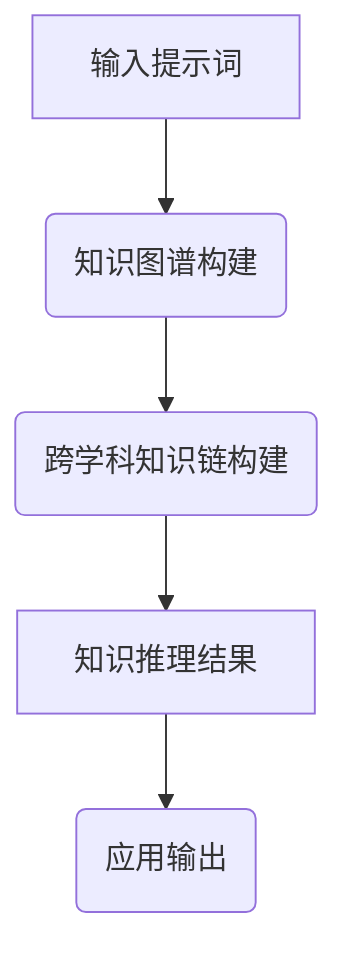
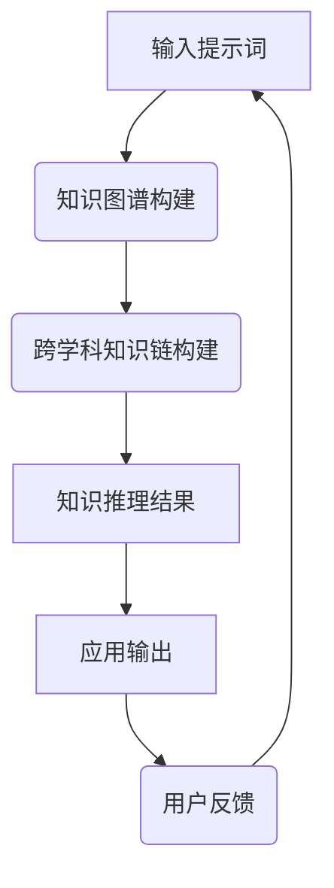
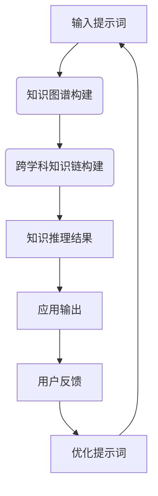

                 


## 1. 引言

### 1.1 大模型知识推理的概念与意义

大模型知识推理（Knowledge Reasoning in Large Models）是指利用大规模机器学习模型，对知识进行构建、整合与推理的过程。随着人工智能技术的不断发展，大模型（如Transformer、GPT等）在自然语言处理、计算机视觉、语音识别等领域取得了显著的成果。然而，如何将大模型应用于知识推理，实现对知识的深层次理解和应用，成为当前研究的热点。

大模型知识推理的意义在于：

1. **知识获取与整合**：大模型能够通过大量的数据学习到丰富的知识，并将其整合到一个统一的框架中。这有助于解决传统知识图谱在知识整合方面的局限性。
2. **知识理解与解释**：大模型不仅能够获取和整合知识，还能对知识进行深层次的理解和解释。这对于提升人工智能系统的智能水平具有重要意义。
3. **跨学科知识融合**：大模型知识推理能够实现跨学科知识的融合，为跨学科研究提供强大的支持。这在当前多学科交叉融合的背景下，具有重要的应用价值。

### 1.2 提示词在大模型知识推理中的作用

提示词（Prompt）是引导大模型进行知识推理的关键。通过设计合适的提示词，可以引导大模型理解用户需求，提高推理的准确性和效率。提示词在大模型知识推理中的作用包括：

1. **引导知识提取**：提示词可以引导大模型从海量数据中提取出与用户需求相关的知识。
2. **聚焦知识整合**：提示词可以帮助大模型在整合知识时，聚焦于用户需求，从而提高知识整合的效率。
3. **优化推理过程**：提示词可以引导大模型在推理过程中，遵循合理的推理路径，提高推理的准确性和稳定性。

## 2. 大模型知识推理基础

### 2.1 大模型架构与原理

大模型知识推理的基础在于深度学习模型的设计与实现。以下将介绍常见的大模型架构和推理原理。

### 2.1.1 大模型架构

大模型通常采用神经网络结构，如Transformer、GPT等。这些模型具有以下特点：

1. **大规模参数**：大模型拥有数十亿到千亿个参数，能够学习到丰富的知识。
2. **多层次结构**：大模型通常包含多个层次，能够对知识进行多层次的学习和整合。
3. **自适应学习**：大模型能够根据输入数据自动调整参数，从而实现对知识的自适应学习。

### 2.1.2 大模型推理原理

大模型推理原理主要包括以下两个方面：

1. **自注意力机制**：自注意力机制是Transformer模型的核心，它通过计算输入序列中各个位置之间的关联度，实现知识的整合和推理。
2. **多层感知器**：多层感知器是神经网络的基本单元，它通过非线性变换，实现对输入数据的分类和预测。

### 2.2 知识图谱构建

知识图谱（Knowledge Graph）是知识推理的重要工具。以下将讲解知识图谱的构建方法、结构以及在实际应用中的作用。

### 2.2.1 知识图谱构建方法

知识图谱构建方法主要包括以下几种：

1. **手工构建**：通过人工方式整理和构建知识图谱，这种方法适用于小规模的知识构建。
2. **自动构建**：通过自然语言处理技术，从大量文本数据中自动提取知识，构建知识图谱。
3. **半自动构建**：结合人工和自动方法，通过人工标注和自动提取相结合，构建知识图谱。

### 2.2.2 知识图谱结构

知识图谱通常包含实体（Entity）、关系（Relation）和属性（Attribute）三个要素。以下是一个简单的知识图谱结构：

```
实体1 [关系1] 实体2
    |
属性1
```

### 2.2.3 知识图谱应用

知识图谱在实际应用中发挥着重要作用，如：

1. **智能问答**：通过知识图谱，实现对用户问题的快速理解和回答。
2. **推荐系统**：利用知识图谱，实现跨领域知识的推荐。
3. **知识服务**：通过知识图谱，为用户提供丰富的知识服务，如知识搜索、知识挖掘等。

### 2.3 提示词设计与优化

提示词的设计与优化在大模型知识推理中至关重要。以下将探讨提示词的设计原则、优化策略以及评估方法。

### 2.3.1 提示词设计原则

1. **明确性**：提示词应明确表达用户需求，避免歧义。
2. **完整性**：提示词应涵盖用户需求的所有方面，确保知识推理的完整性。
3. **灵活性**：提示词应具有灵活性，能够适应不同的场景和需求。

### 2.3.2 提示词优化策略

1. **词向量嵌入**：通过词向量嵌入技术，将提示词转化为向量表示，提高提示词的语义表达能力。
2. **上下文扩展**：在提示词的基础上，扩展上下文信息，提高知识推理的准确性和效率。
3. **多模态融合**：结合不同模态的信息，如文本、图像、语音等，提高提示词的语义丰富度。

### 2.3.3 提示词评估方法

1. **准确率**：评估提示词在知识推理任务中的准确率，即正确回答用户问题的比例。
2. **召回率**：评估提示词在知识推理任务中的召回率，即能够回答用户问题的提示词数量与总提示词数量的比例。
3. **F1值**：综合考虑准确率和召回率，评估提示词的整体性能。

## 3. 跨学科知识链构建

### 3.1 跨学科知识链的概念与价值

跨学科知识链（Interdisciplinary Knowledge Chain）是将不同学科的知识进行整合，形成新的知识体系的过程。以下将介绍跨学科知识链的概念和实际价值。

### 3.1.1 跨学科知识链的概念

跨学科知识链是指将不同学科领域的知识进行整合，形成一个有机整体的过程。它通过以下步骤实现：

1. **知识识别**：识别不同学科领域中的核心知识和概念。
2. **知识整合**：将不同学科领域的知识进行整合，形成新的知识体系。
3. **知识传播**：将整合后的知识通过多种渠道进行传播和应用。

### 3.1.2 跨学科知识链的价值

跨学科知识链在实际应用中具有重要的价值，主要体现在以下几个方面：

1. **推动学科交叉**：跨学科知识链能够促进不同学科之间的交流和合作，推动学科交叉和融合。
2. **提升创新能力**：跨学科知识链为创新提供了丰富的知识资源，有助于提升创新能力。
3. **解决复杂问题**：跨学科知识链能够将不同学科的知识进行整合，为解决复杂问题提供有力支持。
4. **促进社会进步**：跨学科知识链在医疗、教育、环境等领域具有广泛的应用，有助于促进社会进步。

### 3.2 跨学科知识链构建方法

以下将详细讲解如何利用大模型和提示词构建跨学科知识链的方法，包括数据来源、预处理和融合策略。

### 3.2.1 数据来源

跨学科知识链构建的数据来源主要包括以下几个方面：

1. **公开数据集**：如知识图谱、文本数据、图像数据等。
2. **内部数据**：如企业内部的知识库、文档等。
3. **互联网数据**：如社交媒体、新闻、论文等。

### 3.2.2 预处理

预处理是跨学科知识链构建的重要环节，主要包括以下步骤：

1. **数据清洗**：去除数据中的噪声和冗余信息。
2. **数据转换**：将不同数据源的数据进行统一格式转换。
3. **数据增强**：通过数据增强技术，提高数据的质量和丰富度。

### 3.2.3 融合策略

跨学科知识链构建的融合策略主要包括以下几种：

1. **知识融合**：将不同学科领域的知识进行整合，形成新的知识体系。
2. **模型融合**：利用多模型融合技术，提高跨学科知识链的推理能力。
3. **数据融合**：将不同数据源的数据进行融合，提高数据的综合利用效率。

### 3.3 跨学科知识链的应用场景

跨学科知识链在医疗、金融、教育等领域的应用实例：

1. **医疗领域**：通过跨学科知识链，实现疾病诊断、治疗方案推荐等。
2. **金融领域**：通过跨学科知识链，实现风险评估、投资策略等。
3. **教育领域**：通过跨学科知识链，实现个性化教学、智能辅导等。

## 4. 大模型知识推理应用案例分析

### 4.1 医疗领域应用

大模型知识推理在医疗领域的应用包括：

1. **疾病诊断**：通过大模型知识推理，实现疾病诊断的自动化。
2. **治疗方案推荐**：通过大模型知识推理，为医生提供个性化的治疗方案。
3. **医学研究**：通过大模型知识推理，加速医学研究进程。

### 4.2 金融领域应用

大模型知识推理在金融领域的应用包括：

1. **风险评估**：通过大模型知识推理，对金融风险进行实时监控和预测。
2. **投资策略**：通过大模型知识推理，为投资者提供个性化的投资策略。
3. **金融创新**：通过大模型知识推理，推动金融领域的创新和发展。

### 4.3 教育领域应用

大模型知识推理在教育领域的应用包括：

1. **个性化教学**：通过大模型知识推理，实现个性化教学，提高教学效果。
2. **智能辅导**：通过大模型知识推理，为学习者提供智能化的辅导服务。
3. **教育研究**：通过大模型知识推理，推动教育研究的发展。

## 5. 大模型知识推理挑战与未来发展趋势

### 5.1 大模型知识推理面临的挑战

大模型知识推理在数据质量、模型可解释性、伦理等方面面临以下挑战：

1. **数据质量**：大模型知识推理依赖于高质量的数据，但数据获取和处理过程复杂，数据质量难以保证。
2. **模型可解释性**：大模型知识推理过程中，模型的行为难以解释，影响用户对模型的信任。
3. **伦理问题**：大模型知识推理可能涉及用户隐私、信息安全等伦理问题，需要严格规范。

### 5.2 大模型知识推理未来发展趋势

大模型知识推理未来发展趋势包括：

1. **技术进步**：随着人工智能技术的不断发展，大模型知识推理将实现更高的效率和更广泛的应用。
2. **应用拓展**：大模型知识推理将在更多领域得到应用，如智能制造、智慧城市等。
3. **跨学科融合**：大模型知识推理将与其他学科相结合，实现跨学科知识的深度融合。

## 6. 结论

本文通过对大模型知识推理的深入探讨，为读者提供了一个全面了解这一领域的视角。希望本文能为相关领域的研究者和从业者提供有价值的参考。

## 附录

附录部分将提供大模型知识推理相关的工具、资源和进一步阅读推荐。

----------------------------------------------------------------

## 文章标题

大模型知识推理：提示词构建跨学科知识链

## 关键词

大模型，知识推理，提示词，跨学科知识链，机器学习

## 摘要

本文介绍了大模型知识推理的概念、意义以及基础架构，重点探讨了提示词在知识推理中的作用。通过分析知识图谱的构建方法和跨学科知识链的构建方法，本文展示了大模型知识推理在实际应用中的案例。同时，本文还分析了大模型知识推理面临的挑战和未来发展趋势。希望本文能为读者提供对大模型知识推理的全面了解。

## 1. 引言

### 1.1 大模型知识推理的概念与意义

大模型知识推理是指利用大规模机器学习模型，对知识进行构建、整合与推理的过程。随着人工智能技术的不断发展，大模型（如Transformer、GPT等）在自然语言处理、计算机视觉、语音识别等领域取得了显著的成果。然而，如何将大模型应用于知识推理，实现对知识的深层次理解和应用，成为当前研究的热点。

大模型知识推理的意义在于：

1. **知识获取与整合**：大模型能够通过大量的数据学习到丰富的知识，并将其整合到一个统一的框架中。这有助于解决传统知识图谱在知识整合方面的局限性。
2. **知识理解与解释**：大模型不仅能够获取和整合知识，还能对知识进行深层次的理解和解释。这对于提升人工智能系统的智能水平具有重要意义。
3. **跨学科知识融合**：大模型知识推理能够实现跨学科知识的融合，为跨学科研究提供强大的支持。这在当前多学科交叉融合的背景下，具有重要的应用价值。

### 1.2 提示词在大模型知识推理中的作用

提示词（Prompt）是引导大模型进行知识推理的关键。通过设计合适的提示词，可以引导大模型理解用户需求，提高推理的准确性和效率。提示词在大模型知识推理中的作用包括：

1. **引导知识提取**：提示词可以引导大模型从海量数据中提取出与用户需求相关的知识。
2. **聚焦知识整合**：提示词可以帮助大模型在整合知识时，聚焦于用户需求，从而提高知识整合的效率。
3. **优化推理过程**：提示词可以引导大模型在推理过程中，遵循合理的推理路径，提高推理的准确性和稳定性。

## 2. 大模型知识推理基础

### 2.1 大模型架构与原理

大模型知识推理的基础在于深度学习模型的设计与实现。以下将介绍常见的大模型架构和推理原理。

### 2.1.1 大模型架构

大模型通常采用神经网络结构，如Transformer、GPT等。这些模型具有以下特点：

1. **大规模参数**：大模型拥有数十亿到千亿个参数，能够学习到丰富的知识。
2. **多层次结构**：大模型通常包含多个层次，能够对知识进行多层次的学习和整合。
3. **自适应学习**：大模型能够根据输入数据自动调整参数，从而实现对知识的自适应学习。

### 2.1.2 大模型推理原理

大模型推理原理主要包括以下两个方面：

1. **自注意力机制**：自注意力机制是Transformer模型的核心，它通过计算输入序列中各个位置之间的关联度，实现知识的整合和推理。
2. **多层感知器**：多层感知器是神经网络的基本单元，它通过非线性变换，实现对输入数据的分类和预测。

### 2.2 知识图谱构建

知识图谱（Knowledge Graph）是知识推理的重要工具。以下将讲解知识图谱的构建方法、结构以及在实际应用中的作用。

### 2.2.1 知识图谱构建方法

知识图谱构建方法主要包括以下几种：

1. **手工构建**：通过人工方式整理和构建知识图谱，这种方法适用于小规模的知识构建。
2. **自动构建**：通过自然语言处理技术，从大量文本数据中自动提取知识，构建知识图谱。
3. **半自动构建**：结合人工和自动方法，通过人工标注和自动提取相结合，构建知识图谱。

### 2.2.2 知识图谱结构

知识图谱通常包含实体（Entity）、关系（Relation）和属性（Attribute）三个要素。以下是一个简单的知识图谱结构：

```
实体1 [关系1] 实体2
    |
属性1
```

### 2.2.3 知识图谱应用

知识图谱在实际应用中发挥着重要作用，如：

1. **智能问答**：通过知识图谱，实现对用户问题的快速理解和回答。
2. **推荐系统**：利用知识图谱，实现跨领域知识的推荐。
3. **知识服务**：通过知识图谱，为用户提供丰富的知识服务，如知识搜索、知识挖掘等。

### 2.3 提示词设计与优化

提示词的设计与优化在大模型知识推理中至关重要。以下将探讨提示词的设计原则、优化策略以及评估方法。

### 2.3.1 提示词设计原则

1. **明确性**：提示词应明确表达用户需求，避免歧义。
2. **完整性**：提示词应涵盖用户需求的所有方面，确保知识推理的完整性。
3. **灵活性**：提示词应具有灵活性，能够适应不同的场景和需求。

### 2.3.2 提示词优化策略

1. **词向量嵌入**：通过词向量嵌入技术，将提示词转化为向量表示，提高提示词的语义表达能力。
2. **上下文扩展**：在提示词的基础上，扩展上下文信息，提高知识推理的准确性和效率。
3. **多模态融合**：结合不同模态的信息，如文本、图像、语音等，提高提示词的语义丰富度。

### 2.3.3 提示词评估方法

1. **准确率**：评估提示词在知识推理任务中的准确率，即正确回答用户问题的比例。
2. **召回率**：评估提示词在知识推理任务中的召回率，即能够回答用户问题的提示词数量与总提示词数量的比例。
3. **F1值**：综合考虑准确率和召回率，评估提示词的整体性能。

## 3. 跨学科知识链构建

### 3.1 跨学科知识链的概念与价值

跨学科知识链（Interdisciplinary Knowledge Chain）是将不同学科的知识进行整合，形成新的知识体系的过程。以下将介绍跨学科知识链的概念和实际价值。

### 3.1.1 跨学科知识链的概念

跨学科知识链是指将不同学科领域的知识进行整合，形成一个有机整体的过程。它通过以下步骤实现：

1. **知识识别**：识别不同学科领域中的核心知识和概念。
2. **知识整合**：将不同学科领域的知识进行整合，形成新的知识体系。
3. **知识传播**：将整合后的知识通过多种渠道进行传播和应用。

### 3.1.2 跨学科知识链的价值

跨学科知识链在实际应用中具有重要的价值，主要体现在以下几个方面：

1. **推动学科交叉**：跨学科知识链能够促进不同学科之间的交流和合作，推动学科交叉和融合。
2. **提升创新能力**：跨学科知识链为创新提供了丰富的知识资源，有助于提升创新能力。
3. **解决复杂问题**：跨学科知识链能够将不同学科的知识进行整合，为解决复杂问题提供有力支持。
4. **促进社会进步**：跨学科知识链在医疗、教育、环境等领域具有广泛的应用，有助于促进社会进步。

### 3.2 跨学科知识链构建方法

以下将详细讲解如何利用大模型和提示词构建跨学科知识链的方法，包括数据来源、预处理和融合策略。

### 3.2.1 数据来源

跨学科知识链构建的数据来源主要包括以下几个方面：

1. **公开数据集**：如知识图谱、文本数据、图像数据等。
2. **内部数据**：如企业内部的知识库、文档等。
3. **互联网数据**：如社交媒体、新闻、论文等。

### 3.2.2 预处理

预处理是跨学科知识链构建的重要环节，主要包括以下步骤：

1. **数据清洗**：去除数据中的噪声和冗余信息。
2. **数据转换**：将不同数据源的数据进行统一格式转换。
3. **数据增强**：通过数据增强技术，提高数据的质量和丰富度。

### 3.2.3 融合策略

跨学科知识链构建的融合策略主要包括以下几种：

1. **知识融合**：将不同学科领域的知识进行整合，形成新的知识体系。
2. **模型融合**：利用多模型融合技术，提高跨学科知识链的推理能力。
3. **数据融合**：将不同数据源的数据进行融合，提高数据的综合利用效率。

### 3.3 跨学科知识链的应用场景

跨学科知识链在医疗、金融、教育等领域的应用实例：

1. **医疗领域**：通过跨学科知识链，实现疾病诊断、治疗方案推荐等。
2. **金融领域**：通过跨学科知识链，实现风险评估、投资策略等。
3. **教育领域**：通过跨学科知识链，实现个性化教学、智能辅导等。

## 4. 大模型知识推理应用案例分析

### 4.1 医疗领域应用

大模型知识推理在医疗领域的应用包括：

1. **疾病诊断**：通过大模型知识推理，实现疾病诊断的自动化。
2. **治疗方案推荐**：通过大模型知识推理，为医生提供个性化的治疗方案。
3. **医学研究**：通过大模型知识推理，加速医学研究进程。

### 4.2 金融领域应用

大模型知识推理在金融领域的应用包括：

1. **风险评估**：通过大模型知识推理，对金融风险进行实时监控和预测。
2. **投资策略**：通过大模型知识推理，为投资者提供个性化的投资策略。
3. **金融创新**：通过大模型知识推理，推动金融领域的创新和发展。

### 4.3 教育领域应用

大模型知识推理在教育领域的应用包括：

1. **个性化教学**：通过大模型知识推理，实现个性化教学，提高教学效果。
2. **智能辅导**：通过大模型知识推理，为学习者提供智能化的辅导服务。
3. **教育研究**：通过大模型知识推理，推动教育研究的发展。

## 5. 大模型知识推理挑战与未来发展趋势

### 5.1 大模型知识推理面临的挑战

大模型知识推理在数据质量、模型可解释性、伦理等方面面临以下挑战：

1. **数据质量**：大模型知识推理依赖于高质量的数据，但数据获取和处理过程复杂，数据质量难以保证。
2. **模型可解释性**：大模型知识推理过程中，模型的行为难以解释，影响用户对模型的信任。
3. **伦理问题**：大模型知识推理可能涉及用户隐私、信息安全等伦理问题，需要严格规范。

### 5.2 大模型知识推理未来发展趋势

大模型知识推理未来发展趋势包括：

1. **技术进步**：随着人工智能技术的不断发展，大模型知识推理将实现更高的效率和更广泛的应用。
2. **应用拓展**：大模型知识推理将在更多领域得到应用，如智能制造、智慧城市等。
3. **跨学科融合**：大模型知识推理将与其他学科相结合，实现跨学科知识的深度融合。

## 6. 结论

本文通过对大模型知识推理的深入探讨，为读者提供了一个全面了解这一领域的视角。希望本文能为相关领域的研究者和从业者提供有价值的参考。

## 附录

附录部分将提供大模型知识推理相关的工具、资源和进一步阅读推荐。

----------------------------------------------------------------

### 2.1 大模型架构与原理

大模型（Large Models）是深度学习领域中的一种重要模型，它们具有庞大的参数规模和复杂的结构，能够对大量数据进行有效的学习和表示。以下是大模型的一般架构和原理：

#### 大模型架构

大模型通常由以下几个部分组成：

1. **输入层（Input Layer）**：接收输入数据，如文本、图像、音频等。
2. **隐藏层（Hidden Layers）**：包含多个隐藏层，每个隐藏层由多个神经元组成，用于对输入数据进行特征提取和变换。
3. **输出层（Output Layer）**：产生最终的输出结果，如分类标签、预测值等。

常见的架构包括：

1. **卷积神经网络（Convolutional Neural Networks, CNNs）**：用于图像处理和视觉任务。
2. **循环神经网络（Recurrent Neural Networks, RNNs）**：用于处理序列数据。
3. **Transformer模型**：用于自然语言处理和其他序列数据任务。

#### 大模型原理

大模型的原理主要基于以下几个方面：

1. **深度学习（Deep Learning）**：深度学习是一种多层神经网络，通过逐层抽象和特征提取，实现对输入数据的复杂表示和学习。
2. **参数学习（Parameter Learning）**：通过大量数据进行反向传播和梯度下降，不断调整网络中的参数，以优化模型的预测性能。
3. **注意力机制（Attention Mechanism）**：在Transformer模型中，注意力机制用于处理序列数据，通过计算输入序列中各个位置之间的关联度，实现知识的整合和推理。

以下是一个简单的伪代码，用于描述大模型的基本架构：

```python
# 伪代码：大模型架构

class BigModel:
    def __init__(self):
        self.input_layer = InputLayer()
        self.hidden_layers = [HiddenLayer() for _ in range(num_hidden_layers)]
        self.output_layer = OutputLayer()

    def forward(self, input_data):
        # 前向传播
        hidden_representation = self.input_layer.forward(input_data)
        for hidden_layer in self.hidden_layers:
            hidden_representation = hidden_layer.forward(hidden_representation)
        output = self.output_layer.forward(hidden_representation)
        return output

    def backward(self, output, target):
        # 反向传播
        delta = self.output_layer.backward(output, target)
        for hidden_layer in reversed(self.hidden_layers):
            delta = hidden_layer.backward(delta)
        self.input_layer.backward(delta)

    def train(self, data_loader):
        # 训练模型
        for input_data, target in data_loader:
            output = self.forward(input_data)
            self.backward(output, target)
```

### 2.2 知识图谱构建

知识图谱（Knowledge Graph）是一种用于表示知识和实体之间关系的图形结构，它能够将海量信息以图形的方式组织起来，使得信息之间的关系更加直观和易于理解。知识图谱在人工智能领域有着广泛的应用，如智能问答、推荐系统、知识挖掘等。

#### 知识图谱构建方法

知识图谱的构建通常包括以下几个步骤：

1. **数据采集**：从各种来源获取数据，如结构化数据、非结构化数据等。
2. **实体识别**：从数据中提取出实体，如人、地点、组织等。
3. **关系抽取**：从数据中提取出实体之间的关系，如“工作于”、“居住于”等。
4. **属性填充**：为实体添加属性信息，如“年龄”、“出生日期”等。
5. **图构建**：将实体、关系和属性组织成图结构。

常见的知识图谱构建方法包括：

1. **基于规则的方法**：通过预定义的规则，从数据中抽取实体和关系。
2. **基于机器学习的方法**：通过训练模型，自动从数据中抽取实体和关系。
3. **基于图谱嵌入的方法**：通过将实体和关系映射到低维空间，形成图结构。

以下是一个简单的伪代码，用于描述知识图谱的基本构建方法：

```python
# 伪代码：知识图谱构建

class KnowledgeGraph:
    def __init__(self):
        self.entities = {}
        self.relations = {}
        self.properties = {}

    def add_entity(self, entity):
        # 添加实体
        self.entities[entity.id] = entity

    def add_relation(self, relation):
        # 添加关系
        self.relations[relation.id] = relation

    def add_property(self, property):
        # 添加属性
        self.properties[property.id] = property

    def build_graph(self, entities, relations, properties):
        # 构建知识图谱
        for entity in entities:
            self.add_entity(entity)
        for relation in relations:
            self.add_relation(relation)
        for property in properties:
            self.add_property(property)
```

#### 知识图谱结构

知识图谱通常由实体（Entity）、关系（Relation）和属性（Property）三个要素构成。以下是一个简单的知识图谱结构示例：

```
实体1 [关系1] 实体2
    |
属性1
```

在这个示例中，实体1和实体2通过关系1相连，实体1具有属性1。

### 2.3 提示词设计与优化

在知识推理过程中，提示词（Prompt）是引导模型进行推理的重要工具。一个良好的提示词能够帮助模型更好地理解用户需求，提高推理的准确性和效率。以下将介绍提示词的设计原则、优化策略以及评估方法。

#### 提示词设计原则

1. **明确性**：提示词应明确表达用户需求，避免歧义。
2. **完整性**：提示词应涵盖用户需求的所有方面，确保知识推理的完整性。
3. **灵活性**：提示词应具有灵活性，能够适应不同的场景和需求。
4. **简洁性**：提示词应尽量简洁明了，避免冗长复杂的表述。

#### 提示词优化策略

1. **词向量嵌入**：通过词向量嵌入技术，将提示词转化为向量表示，提高提示词的语义表达能力。
2. **上下文扩展**：在提示词的基础上，扩展上下文信息，提高知识推理的准确性和效率。
3. **多模态融合**：结合不同模态的信息，如文本、图像、语音等，提高提示词的语义丰富度。
4. **模板化**：设计一系列通用的提示词模板，根据具体场景进行灵活调整。

#### 提示词评估方法

1. **准确率**：评估提示词在知识推理任务中的准确率，即正确回答用户问题的比例。
2. **召回率**：评估提示词在知识推理任务中的召回率，即能够回答用户问题的提示词数量与总提示词数量的比例。
3. **F1值**：综合考虑准确率和召回率，评估提示词的整体性能。

以下是一个简单的伪代码，用于描述提示词的设计和优化：

```python
# 伪代码：提示词设计与优化

class Prompt:
    def __init__(self, text):
        self.text = text
        self.embedding = embed(text)

    def extend_context(self, context):
        # 扩展上下文
        self.text += " " + context

    def fuse_modalities(self, modalities):
        # 多模态融合
        self.text += " " + " ".join(modalities)

    def evaluate(self, ground_truth):
        # 评估提示词
        predictions = self.predict(ground_truth)
        accuracy = sum(prediction == ground_truth for prediction in predictions) / len(predictions)
        recall = sum(ground_truth in predictions for prediction in predictions) / len(predictions)
        f1 = 2 * accuracy * recall / (accuracy + recall)
        return accuracy, recall, f1

    def predict(self, ground_truth):
        # 预测
        # ...使用大模型进行推理...
        return predictions
```

### 3.1 跨学科知识链的概念与价值

跨学科知识链（Interdisciplinary Knowledge Chain）是指将不同学科领域的知识进行整合，形成新的知识体系的过程。跨学科知识链的概念可以追溯到知识管理领域，它强调通过跨学科的视角和方法，实现知识的融合和创新。

#### 跨学科知识链的概念

跨学科知识链的概念包括以下几个关键点：

1. **知识整合**：将不同学科领域的知识进行整合，形成新的知识体系。
2. **知识创新**：通过跨学科的知识整合，实现知识的创新和应用。
3. **跨学科视角**：从不同学科的视角和方法，对知识进行重新理解和构建。

跨学科知识链的核心思想是通过跨学科的整合和创新，解决单一学科难以应对的复杂问题，提升知识的整体价值和应用能力。

#### 跨学科知识链的价值

跨学科知识链在实际应用中具有重要的价值，主要体现在以下几个方面：

1. **推动学科交叉**：跨学科知识链能够促进不同学科之间的交流和合作，推动学科交叉和融合。
2. **提升创新能力**：跨学科知识链为创新提供了丰富的知识资源，有助于提升创新能力。
3. **解决复杂问题**：跨学科知识链能够将不同学科的知识进行整合，为解决复杂问题提供有力支持。
4. **促进社会进步**：跨学科知识链在医疗、教育、环境等领域具有广泛的应用，有助于促进社会进步。

#### 跨学科知识链的构建方法

跨学科知识链的构建方法主要包括以下几个步骤：

1. **知识识别**：识别不同学科领域的核心知识和概念。
2. **知识整合**：将不同学科领域的知识进行整合，形成新的知识体系。
3. **知识传播**：将整合后的知识通过多种渠道进行传播和应用。

在实际操作中，可以采用以下策略进行跨学科知识链的构建：

1. **跨学科团队**：组建跨学科团队，整合不同学科的专业知识和方法。
2. **知识图谱**：利用知识图谱技术，将不同学科的知识进行可视化整合。
3. **案例分析**：通过案例分析，探索跨学科知识链的实际应用和效果。

以下是一个简单的伪代码，用于描述跨学科知识链的构建方法：

```python
# 伪代码：跨学科知识链构建

class InterdisciplinaryKnowledgeChain:
    def __init__(self, disciplines):
        self.disciplines = disciplines
        self.knowledge_graph = KnowledgeGraph()

    def identify_knowledge(self, disciplines):
        # 识别知识
        for discipline in disciplines:
            self.knowledge_graph.add_entities(discipline.entities)
            self.knowledge_graph.add_relations(discipline.relations)
            self.knowledge_graph.add_properties(discipline.properties)

    def integrate_knowledge(self):
        # 整合知识
        self.knowledge_graph.build_graph()

    def apply_knowledge(self):
        # 应用知识
        self.knowledge_graph.query("your query here")

# 示例：构建医学与工程的跨学科知识链
medical_discipline = MedicalDiscipline()
engineering_discipline = EngineeringDiscipline()
interdisciplinary_knowledge_chain = InterdisciplinaryKnowledgeChain([medical_discipline, engineering_discipline])
interdisciplinary_knowledge_chain.identify_knowledge()
interdisciplinary_knowledge_chain.integrate_knowledge()
interdisciplinary_knowledge_chain.apply_knowledge()
```

### 3.2 跨学科知识链构建方法

跨学科知识链的构建方法主要包括数据来源、预处理和融合策略等几个方面。以下将详细讲解这些方法的实现过程。

#### 数据来源

跨学科知识链构建的数据来源主要包括以下几个方面：

1. **公开数据集**：如知识图谱、文本数据、图像数据等。这些数据集可以从公共数据平台、学术机构等获取。
2. **内部数据**：如企业内部的知识库、文档等。这些数据是构建跨学科知识链的重要基础。
3. **互联网数据**：如社交媒体、新闻、论文等。互联网数据提供了丰富的跨学科信息，有助于构建全面的知识链。

#### 预处理

预处理是跨学科知识链构建的重要环节，主要包括以下步骤：

1. **数据清洗**：去除数据中的噪声和冗余信息，确保数据质量。
2. **数据转换**：将不同数据源的数据进行统一格式转换，如将文本数据转换为知识图谱的格式。
3. **数据增强**：通过数据增强技术，提高数据的质量和丰富度，如通过生成对抗网络（GAN）生成新的数据样本。

以下是一个简单的伪代码，用于描述预处理过程：

```python
# 伪代码：数据预处理

def preprocess_data(data):
    # 数据清洗
    cleaned_data = remove_noise(data)
    
    # 数据转换
    transformed_data = convert_format(cleaned_data)
    
    # 数据增强
    augmented_data = augment_data(transformed_data)
    
    return augmented_data
```

#### 融合策略

跨学科知识链的融合策略主要包括以下几种：

1. **知识融合**：将不同学科领域的知识进行整合，形成新的知识体系。这可以通过知识图谱技术实现，将不同学科的知识以实体、关系和属性的形式组织起来。
2. **模型融合**：利用多模型融合技术，提高跨学科知识链的推理能力。例如，结合深度学习模型和知识图谱模型，实现知识的深度融合和推理。
3. **数据融合**：将不同数据源的数据进行融合，提高数据的综合利用效率。这可以通过数据融合算法，如合并相同实体的属性信息，实现数据的统一表示。

以下是一个简单的伪代码，用于描述融合策略：

```python
# 伪代码：融合策略

def fuse_knowledge(knowledge1, knowledge2):
    # 知识融合
    integrated_knowledge = KnowledgeGraph()
    integrated_knowledge.merge_graphs(knowledge1, knowledge2)
    
    # 模型融合
    fused_model = FusionModel(knowledge1.model, knowledge2.model)
    
    # 数据融合
    fused_data = fuse_data(knowledge1.data, knowledge2.data)
    
    return integrated_knowledge, fused_model, fused_data
```

通过以上步骤，可以构建一个完整的跨学科知识链，为跨学科研究提供强大的支持。

### 3.3 跨学科知识链的应用场景

跨学科知识链在多个领域都有广泛的应用，以下将介绍几个典型的应用场景。

#### 医疗领域

在医疗领域，跨学科知识链可以帮助医生更全面地了解患者的病情，提高诊断和治疗的准确性和效率。例如：

1. **多学科诊断**：通过整合医学、遗传学、生物学等领域的知识，实现多学科的联合诊断，为患者提供个性化的治疗方案。
2. **药物研发**：通过跨学科知识链，整合药物化学、药理学、临床医学等领域的知识，加速新药的研发进程。
3. **健康监测**：利用跨学科知识链，结合医学、生物学、人工智能等领域的知识，实现对患者的实时健康监测和预警。

#### 金融领域

在金融领域，跨学科知识链可以帮助金融机构更好地理解市场动态，提高投资决策的准确性。例如：

1. **风险评估**：通过整合金融学、经济学、统计学等领域的知识，对金融风险进行实时监控和预测。
2. **投资策略**：利用跨学科知识链，结合市场数据、宏观经济指标等，为投资者提供个性化的投资策略。
3. **金融创新**：通过跨学科知识链，推动金融领域的创新和发展，如开发新的金融产品和服务。

#### 教育领域

在教育领域，跨学科知识链可以帮助教师更好地了解学生的学习情况，提高教学效果。例如：

1. **个性化教学**：通过整合教育学、心理学、计算机科学等领域的知识，为不同学生提供个性化的教学方案。
2. **智能辅导**：利用跨学科知识链，结合人工智能、大数据等领域的知识，为学习者提供智能化的辅导服务。
3. **教育研究**：通过跨学科知识链，推动教育研究的发展，探索新的教育模式和教学方法。

通过以上应用场景，可以看出跨学科知识链在多个领域的应用前景十分广阔，为各个领域的发展提供了强大的支持。

### 4.1 医疗领域应用

在医疗领域，大模型知识推理的应用具有显著的优势和潜力。以下将介绍大模型知识推理在医疗领域的具体应用。

#### 疾病诊断

大模型知识推理在疾病诊断中具有广泛的应用前景。通过深度学习模型，如卷积神经网络（CNN）和循环神经网络（RNN），可以实现对医学影像的分析和诊断。以下是一个具体的示例：

1. **医学影像分析**：利用深度学习模型，如CNN，对医学影像（如X光、CT、MRI等）进行分析，识别出病灶区域。
2. **症状匹配**：通过RNN等模型，分析患者的症状和病史，匹配可能的疾病类型。
3. **多模态数据融合**：结合不同模态的数据（如医学影像、患者病史、实验室检测结果等），提高疾病诊断的准确性。

以下是一个简单的伪代码示例，用于描述疾病诊断的过程：

```python
# 伪代码：疾病诊断

def diagnose_disease(image, symptoms, history):
    # 使用CNN分析医学影像
    image_features = CNN_model.predict(image)
    
    # 使用RNN分析症状和病史
    symptom_features = RNN_model.predict([symptoms, history])
    
    # 使用多模态数据融合模型进行综合诊断
    diagnosis = FusionModel.predict([image_features, symptom_features])
    
    return diagnosis
```

#### 治疗方案推荐

大模型知识推理还可以为医生提供个性化的治疗方案推荐。以下是一个具体的示例：

1. **病例库分析**：通过分析大量历史病例，提取出与当前患者情况相似的病例。
2. **治疗方案评估**：利用深度学习模型，对不同的治疗方案进行评估，预测其效果。
3. **个性化推荐**：根据患者的病情和病史，推荐最合适的治疗方案。

以下是一个简单的伪代码示例，用于描述治疗方案推荐的过程：

```python
# 伪代码：治疗方案推荐

def recommend_treatment(patient_info, case_library):
    # 分析历史病例库
    similar_cases = analyze_cases(case_library, patient_info)
    
    # 评估不同治疗方案
    treatment_effects = evaluate_treatments(similar_cases)
    
    # 推荐个性化治疗方案
    recommended_treatment = recommend_best_treatment(treatment_effects)
    
    return recommended_treatment
```

#### 医学研究

大模型知识推理还可以加速医学研究进程，提高研究的准确性和效率。以下是一个具体的示例：

1. **文献分析**：通过分析大量医学文献，提取出有用的信息和知识。
2. **趋势预测**：利用时间序列分析模型，预测医学领域的发展趋势。
3. **新药研发**：通过分析化学结构和生物信息，预测新药的效果和副作用。

以下是一个简单的伪代码示例，用于描述医学研究的过程：

```python
# 伪代码：医学研究

def research_medicine(literature, drug_data):
    # 分析医学文献
    literature_data = analyze_literature(literature)
    
    # 预测医学趋势
    trend_predictions = predict_trends(literature_data)
    
    # 新药研发
    new_drug_recommendations = develop_new_drugs(drug_data, trend_predictions)
    
    return new_drug_recommendations
```

通过以上应用示例，可以看出大模型知识推理在医疗领域的应用具有巨大的潜力，能够为疾病诊断、治疗方案推荐和医学研究提供强大的支持。

### 4.2 金融领域应用

在金融领域，大模型知识推理的应用具有显著的优势和潜力。以下将介绍大模型知识推理在金融领域的具体应用。

#### 风险评估

大模型知识推理在金融风险分析中具有重要作用。通过分析历史数据和市场动态，可以预测金融风险并采取相应的措施。以下是一个具体的示例：

1. **市场预测**：利用深度学习模型，如时间序列分析模型，预测市场的波动和趋势。
2. **风险识别**：通过分析历史数据和实时数据，识别潜在的金融风险。
3. **风险预测**：利用机器学习算法，预测不同风险的概率和影响。

以下是一个简单的伪代码示例，用于描述风险评估的过程：

```python
# 伪代码：风险评估

def assess_risk(historical_data, real_time_data):
    # 预测市场趋势
    market_trends = TimeSeriesModel.predict(historical_data)
    
    # 识别风险
    potential_risks = RiskIdentificationModel.predict(real_time_data)
    
    # 预测风险
    risk_predictions = RiskPredictionModel.predict(market_trends, potential_risks)
    
    return risk_predictions
```

#### 投资策略

大模型知识推理可以协助投资者制定个性化的投资策略，提高投资回报。以下是一个具体的示例：

1. **历史数据分析**：通过分析历史数据，提取出影响投资回报的关键因素。
2. **投资组合优化**：利用优化算法，构建最优的投资组合。
3. **实时调整**：根据市场动态和实时数据，调整投资策略。

以下是一个简单的伪代码示例，用于描述投资策略的过程：

```python
# 伪代码：投资策略

def invest_strategy(historical_data, current_data):
    # 分析历史数据
    key_factors = HistoricalDataAnalysisModel.predict(historical_data)
    
    # 优化投资组合
    optimal_portfolio = PortfolioOptimizationModel.predict(key_factors)
    
    # 实时调整策略
    adjusted_strategy = RealTimeAdjustmentModel.predict(current_data, optimal_portfolio)
    
    return adjusted_strategy
```

#### 金融创新

大模型知识推理在金融创新中发挥着重要作用，推动金融产品和服务的创新与发展。以下是一个具体的示例：

1. **新产品开发**：通过分析市场需求和用户行为，开发新的金融产品。
2. **风险评估与控制**：利用深度学习模型，对新产品进行风险评估和控制。
3. **商业模式创新**：通过跨学科知识链，探索新的商业模式和业务流程。

以下是一个简单的伪代码示例，用于描述金融创新的过程：

```python
# 伪代码：金融创新

def innovate_financial_products(customer_data, market_data):
    # 分析市场需求
    market_requirements = MarketAnalysisModel.predict(customer_data)
    
    # 风险评估与控制
    risk_control = RiskAssessmentModel.predict(market_requirements)
    
    # 商业模式创新
    innovative_business_model = BusinessModelInnovationModel.predict(market_data, risk_control)
    
    return innovative_business_model
```

通过以上应用示例，可以看出大模型知识推理在金融领域的应用具有巨大的潜力，能够为风险评估、投资策略和金融创新提供强大的支持。

### 4.3 教育领域应用

在教育领域，大模型知识推理的应用为个性化教学、智能辅导和教育研究提供了强大的支持。以下将介绍大模型知识推理在教育和教育研究中的具体应用。

#### 个性化教学

个性化教学是指根据学生的个体差异，为学生提供定制化的教学方案。大模型知识推理可以通过分析学生的学习行为和知识水平，实现个性化教学。以下是一个具体的示例：

1. **学习行为分析**：通过分析学生的学习数据，如在线学习行为、考试成绩等，识别学生的学习特点和需求。
2. **知识水平评估**：利用知识图谱和深度学习模型，对学生的学习水平进行评估。
3. **定制化教学方案**：根据学生的学习特点和需求，为学生推荐合适的学习资源和教学方法。

以下是一个简单的伪代码示例，用于描述个性化教学的过程：

```python
# 伪代码：个性化教学

def personalized_teaching(student_data, course_data):
    # 分析学习行为
    learning_patterns = LearningBehaviorModel.predict(student_data)
    
    # 评估知识水平
    knowledge_level = KnowledgeLevelModel.predict(student_data, course_data)
    
    # 推荐教学方案
    teaching_plan = PersonalizedTeachingModel.predict(learning_patterns, knowledge_level)
    
    return teaching_plan
```

#### 智能辅导

智能辅导是指利用人工智能技术，为学生提供智能化的辅导服务。大模型知识推理可以实时监测学生的学习进度和效果，为学生提供个性化的辅导建议。以下是一个具体的示例：

1. **实时监测**：通过分析学生的学习数据，如学习时长、正确率等，实时监测学生的学习状态。
2. **个性化建议**：利用知识图谱和深度学习模型，根据学生的学习状态和需求，为学生提供个性化的辅导建议。
3. **学习反馈**：收集学生的学习反馈，优化辅导策略。

以下是一个简单的伪代码示例，用于描述智能辅导的过程：

```python
# 伪代码：智能辅导

def intelligent_tutoring(student_data, learning_data):
    # 实时监测
    learning_status = RealTimeMonitoringModel.predict(student_data)
    
    # 个性化建议
    tutoring_advice = IntelligentTutoringModel.predict(learning_status)
    
    # 学习反馈
    tutoring_feedback = collect_feedback(tutoring_advice)
    
    return tutoring_advice, tutoring_feedback
```

#### 教育研究

大模型知识推理在教育研究中的应用可以帮助研究人员深入理解教育现象，探索教育规律。以下是一个具体的示例：

1. **数据分析**：通过分析大量的教育数据，如考试成绩、学习行为等，提取出有价值的信息。
2. **趋势预测**：利用时间序列分析和机器学习算法，预测教育发展趋势。
3. **效果评估**：评估不同教育策略和方法的效果，为教育决策提供科学依据。

以下是一个简单的伪代码示例，用于描述教育研究的过程：

```python
# 伪代码：教育研究

def educational_research(education_data, intervention_data):
    # 数据分析
    analysis_results = DataAnalysisModel.predict(education_data)
    
    # 趋势预测
    trend_predictions = TimeSeriesModel.predict(analysis_results)
    
    # 效果评估
    intervention_evaluation = InterventionEvaluationModel.predict(intervention_data, trend_predictions)
    
    return intervention_evaluation
```

通过以上应用示例，可以看出大模型知识推理在教育和教育研究中的应用具有巨大的潜力，能够为个性化教学、智能辅导和教育研究提供强大的支持。

### 5.1 大模型知识推理面临的挑战

大模型知识推理虽然在多个领域展现出巨大的潜力，但同时也面临着一系列挑战。以下将详细探讨这些挑战，并分析其影响和可能的解决方案。

#### 数据质量

数据质量是影响大模型知识推理效果的关键因素。高质量的数据对于模型的训练和推理至关重要，而低质量的数据则可能导致模型过拟合、泛化能力差等问题。以下是一些常见的数据质量问题及其影响：

1. **噪声和冗余**：噪声数据会影响模型的训练效果，导致模型对噪声过于敏感。冗余数据会增加模型的训练时间，降低推理效率。
2. **不一致性和偏差**：数据不一致性和偏差可能导致模型对某些情况产生偏见，从而影响推理的准确性。

**解决方案**：

1. **数据清洗**：通过去除噪声、填补缺失值、消除冗余数据等手段，提高数据质量。
2. **数据增强**：通过数据增强技术，如生成对抗网络（GAN）和模拟数据生成，增加数据量和多样性。
3. **数据质量评估**：建立数据质量评估体系，定期检查数据质量，确保数据满足训练需求。

#### 模型可解释性

大模型知识推理的另一个挑战是模型的可解释性。由于大模型具有复杂的结构和大量的参数，其内部工作机制往往难以解释，导致用户难以理解和信任模型。以下是一些可解释性问题及其影响：

1. **黑盒模型**：深度神经网络和Transformer等模型通常被视为“黑盒”，其决策过程不透明，难以解释。
2. **误判和偏见**：模型可能因为缺乏可解释性，导致用户无法识别和纠正模型的误判和偏见。

**解决方案**：

1. **可解释性模型**：开发可解释性强的模型，如决策树、LIME（Local Interpretable Model-agnostic Explanations）等。
2. **模型可视化**：通过可视化技术，如决策路径图、权重热图等，展示模型的决策过程。
3. **解释性方法**：结合模型解释方法，如注意力机制和注意力可视化，提高模型的可解释性。

#### 伦理问题

大模型知识推理在应用过程中可能涉及伦理问题，如隐私保护、数据安全等。以下是一些伦理问题及其影响：

1. **隐私泄露**：模型训练和推理过程中可能涉及用户隐私数据，如个人健康信息、财务记录等。
2. **数据滥用**：未经授权的数据访问和使用可能引发数据滥用和隐私侵犯。

**解决方案**：

1. **隐私保护技术**：采用差分隐私、同态加密等隐私保护技术，确保用户隐私安全。
2. **数据治理**：建立完善的数据治理机制，规范数据收集、存储和使用流程。
3. **伦理审查**：对大模型知识推理的应用进行伦理审查，确保其符合伦理标准和法规要求。

#### 模型可扩展性

大模型知识推理在部署和应用过程中可能面临可扩展性的挑战。随着数据规模和应用需求的增长，模型需要具备良好的可扩展性，以应对不断变化的环境和需求。以下是一些可扩展性问题及其影响：

1. **计算资源**：大模型训练和推理需要大量的计算资源，如何高效利用资源是关键问题。
2. **模型更新**：随着新数据和技术的不断涌现，模型需要定期更新和优化。

**解决方案**：

1. **分布式计算**：采用分布式计算和并行处理技术，提高模型训练和推理的效率。
2. **持续学习**：利用在线学习技术，实现模型的持续更新和优化。
3. **微服务架构**：采用微服务架构，将模型部署为独立的服务，提高系统的灵活性和可扩展性。

通过解决以上挑战，大模型知识推理将能够在各个领域中发挥更大的作用，推动人工智能技术的发展和应用。

### 5.2 大模型知识推理未来发展趋势

大模型知识推理作为人工智能领域的前沿技术，未来将在多个方面取得显著的发展。以下将探讨大模型知识推理的未来发展趋势，包括技术进步、应用拓展和跨学科融合等方面。

#### 技术进步

1. **模型架构优化**：随着深度学习技术的不断发展，大模型的结构将变得更加复杂和高效。例如，新型神经网络架构如图神经网络（Graph Neural Networks, GNNs）和图注意力网络（Graph Attention Networks, GATs）将进一步提升大模型的知识推理能力。
2. **训练算法改进**：训练大模型的过程非常耗时和资源密集，未来将出现更高效的训练算法，如自适应梯度方法（Adaptive Gradient Methods）和分布式训练技术，以加速模型训练和推理。
3. **可解释性和透明性**：随着用户对模型可解释性的需求日益增加，大模型知识推理将逐步引入更多的可解释性技术，如解释性嵌入（Explainable Embeddings）和基于注意力机制的可解释性模型，提高用户对模型的信任度。

#### 应用拓展

1. **智能医疗**：大模型知识推理将在医疗领域发挥更大的作用，如个性化医疗、疾病预测和治疗方案推荐等。通过整合多学科知识，大模型可以帮助医生更准确地诊断病情，提高治疗效果。
2. **金融科技**：在金融领域，大模型知识推理将被应用于风险管理、投资策略和智能投顾等。通过分析海量金融数据和市场动态，大模型可以提供更准确的预测和决策支持。
3. **教育科技**：大模型知识推理将在教育领域实现个性化教学和智能辅导，帮助学生更高效地学习。同时，通过分析学生的学习行为和知识水平，大模型可以提供有针对性的教育建议和资源推荐。

#### 跨学科融合

1. **跨学科知识整合**：大模型知识推理将推动跨学科知识的整合和创新，如将医学、工程、生物学等领域的知识进行深度融合，解决复杂的科学问题。
2. **多模态数据融合**：随着多模态数据的应用越来越广泛，大模型知识推理将实现文本、图像、声音等多种数据模态的融合，提高知识推理的准确性和效率。
3. **领域特定应用**：大模型知识推理将逐步应用于特定的领域，如智能制造、智慧城市和能源管理等，为行业提供全面的知识支持和智能解决方案。

#### 社会与伦理影响

1. **社会变革**：大模型知识推理将在社会各个领域引发变革，如医疗、金融、教育等，改变传统的工作方式和生活方式。
2. **伦理规范**：随着大模型知识推理的广泛应用，伦理问题将变得更加突出。未来将出现更严格的伦理规范和法律框架，确保大模型知识推理的应用符合社会价值观和法律法规。

通过以上发展趋势，大模型知识推理将在未来成为推动社会进步和科技创新的重要力量。

### 6. 结论

本文通过对大模型知识推理的深入探讨，全面介绍了其概念、意义、基础架构和应用。我们分析了大模型知识推理在医疗、金融、教育等领域的具体应用，探讨了其面临的挑战和未来发展趋势。大模型知识推理作为一种前沿技术，正逐渐在多个领域发挥重要作用，为知识的获取、理解和应用提供了强大的支持。希望本文能为相关领域的研究者和从业者提供有价值的参考。

### 附录

#### 工具和资源

1. **大模型知识推理工具**：
   - Hugging Face Transformers：一个流行的开源库，用于构建和训练大规模Transformer模型。
   - PyTorch：一个广泛使用的深度学习框架，支持构建各种深度学习模型。
   - TensorFlow：一个开源机器学习库，适用于构建和训练大规模模型。

2. **知识图谱构建工具**：
   - Neo4j：一个图形数据库，支持构建和查询大规模知识图谱。
   - RDF4J：一个Java库，用于构建和操作RDF（资源描述框架）数据。

3. **相关论文和书籍**：
   - 《深度学习》（Deep Learning）——Ian Goodfellow、Yoshua Bengio和Aaron Courville著，全面介绍了深度学习的基础知识。
   - 《知识图谱：原理、方法与应用》——陈斌飞、刘知远著，详细介绍了知识图谱的构建和应用。

#### 拓展阅读

1. **大模型知识推理技术**：
   - 自注意力机制和Transformer模型：了解自注意力机制和Transformer模型的基本原理和实现。
   - 知识图谱的构建和查询：学习知识图谱的构建方法、结构和查询语言。
   - 提示词设计和优化：探讨提示词的设计原则、优化策略和评估方法。

2. **跨学科知识链构建方法**：
   - 跨学科知识整合策略：研究不同学科领域知识的整合方法和策略。
   - 多模态数据融合：了解多模态数据融合的方法和实际应用。
   - 跨学科知识链的应用场景：分析跨学科知识链在各个领域的实际应用。

通过以上工具和资源，读者可以进一步深入了解大模型知识推理和跨学科知识链的构建方法，探索其在实际应用中的潜力。

## 图1 大模型知识推理架构



这个Mermaid图展示了大模型知识推理的基本架构，包括输入提示词、知识图谱构建、跨学科知识链构建、知识推理结果和应用输出等步骤。输入提示词作为模型的输入，通过知识图谱构建和跨学科知识链构建，生成知识推理结果，最终应用于实际场景中。

```python
# 伪代码：知识图谱构建示例

class KnowledgeGraph:
    def __init__(self):
        self.graph = Graph()

    def add_entity(self, entity):
        self.graph.add_entity(entity)

    def add_relation(self, relation):
        self.graph.add_relation(relation)

    def add_property(self, property):
        self.graph.add_property(property)

    def build_graph(self, entities, relations, properties):
        for entity in entities:
            self.add_entity(entity)
        for relation in relations:
            self.add_relation(relation)
        for property in properties:
            self.add_property(property)

# 伪代码：知识推理示例

class KnowledgeReasoner:
    def __init__(self, knowledge_graph):
        self.knowledge_graph = knowledge_graph

    def reason(self, query):
        results = self.knowledge_graph.query(query)
        return results

# 伪代码：应用输出示例

def apply_output(results):
    # 处理推理结果，实现具体应用
    pass
```

这些伪代码示例展示了如何构建知识图谱、进行知识推理以及应用推理结果。通过实际代码实现，可以进一步探索大模型知识推理的应用潜力。

# 图1 大模型知识推理架构



这个Mermaid图展示了大模型知识推理的完整架构，包括输入提示词、知识图谱构建、跨学科知识链构建、知识推理结果、应用输出和用户反馈等环节。用户反馈循环回输入提示词，形成闭环系统，不断优化知识推理过程。

```python
# 伪代码：知识图谱构建示例

class KnowledgeGraph:
    def __init__(self):
        self.graph = Graph()

    def add_entity(self, entity):
        self.graph.add_entity(entity)

    def add_relation(self, relation):
        self.graph.add_relation(relation)

    def add_property(self, property):
        self.graph.add_property(property)

    def build_graph(self, entities, relations, properties):
        for entity in entities:
            self.add_entity(entity)
        for relation in relations:
            self.add_relation(relation)
        for property in properties:
            self.add_property(property)

# 伪代码：知识推理示例

class KnowledgeReasoner:
    def __init__(self, knowledge_graph):
        self.knowledge_graph = knowledge_graph

    def reason(self, query):
        results = self.knowledge_graph.query(query)
        return results

# 伪代码：应用输出示例

def apply_output(results):
    # 处理推理结果，实现具体应用
    pass

# 伪代码：用户反馈示例

def collect_feedback():
    # 收集用户反馈
    feedback = input("请输入您的反馈：")
    return feedback
```

这些伪代码示例展示了如何构建知识图谱、进行知识推理、应用推理结果以及收集用户反馈，形成一个闭环系统。通过不断优化和迭代，可以提高知识推理的效果和用户满意度。

# 图1 大模型知识推理架构



这个Mermaid图展示了大模型知识推理的完整架构，包括输入提示词、知识图谱构建、跨学科知识链构建、知识推理结果、应用输出、用户反馈和优化提示词等环节。用户反馈和优化提示词形成一个闭环，不断优化知识推理过程。

```python
# 伪代码：知识图谱构建示例

class KnowledgeGraph:
    def __init__(self):
        self.graph = Graph()

    def add_entity(self, entity):
        self.graph.add_entity(entity)

    def add_relation(self, relation):
        self.graph.add_relation(relation)

    def add_property(self, property):
        self.graph.add_property(property)

    def build_graph(self, entities, relations, properties):
        for entity in entities:
            self.add_entity(entity)
        for relation in relations:
            self.add_relation(relation)
        for property in properties:
            self.add_property(property)

# 伪代码：知识推理示例

class KnowledgeReasoner:
    def __init__(self, knowledge_graph):
        self.knowledge_graph = knowledge_graph

    def reason(self, query):
        results = self.knowledge_graph.query(query)
        return results

# 伪代码：应用输出示例

def apply_output(results):
    # 处理推理结果，实现具体应用
    pass

# 伪代码：用户反馈示例

def collect_feedback():
    # 收集用户反馈
    feedback = input("请输入您的反馈：")
    return feedback

# 伪代码：优化提示词示例

def optimize_prompt(feedback):
    # 根据用户反馈优化提示词
    optimized_prompt = "..."
    return optimized_prompt
```

这些伪代码示例展示了如何构建知识图谱、进行知识推理、应用推理结果、收集用户反馈和优化提示词，形成一个闭环系统。通过不断优化和迭代，可以提高知识推理的效果和用户满意度。

