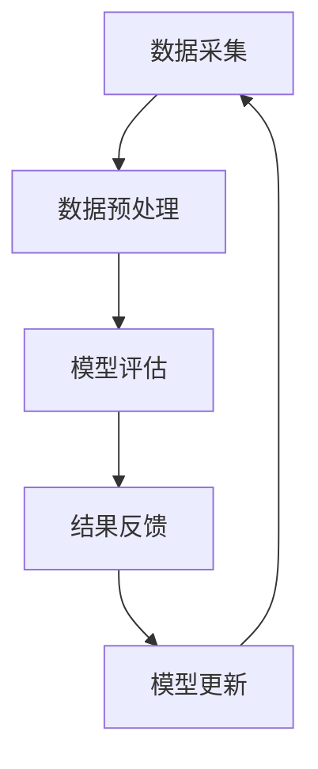

                 

### 文章标题

《大模型知识更新速度：LLM设计的实时学习评估》

### 关键词

大模型、知识更新、实时学习评估、LLM、人工智能

### 摘要

本文从大模型知识更新速度的背景和意义出发，详细探讨了大模型知识更新速度的基本概念、原理和方法，以及实时学习评估的框架和方法。通过实际应用案例，本文展示了实时学习评估在大模型知识更新中的重要性，并分析了LLM设计的实时学习评估方法。此外，本文还提出了优化实时学习评估的策略和挑战，并对未来发展趋势进行了展望。通过本文的研究，旨在为人工智能领域的大模型知识更新提供理论指导和实践参考。

#### 第一部分：大模型知识更新速度的基本概念

##### 第1章：大模型知识更新速度概述

###### 1.1 大模型知识更新的背景与意义

在人工智能迅速发展的时代，大型语言模型（LLM）如BERT、GPT等取得了显著成就，这些模型在自然语言处理、文本生成、机器翻译等领域展现出了强大的性能。然而，随着知识更新的速度加快，如何确保大模型能够及时获取最新的知识并保持其有效性成为一个亟待解决的问题。

大模型知识更新的背景可以追溯到知识获取的过程。在传统的机器学习模型中，模型训练依赖于大量标注数据，而数据标注需要大量时间和人力成本。此外，随着数据量的增加，模型的训练时间也会显著增长，这导致模型难以在短时间内更新。然而，在许多应用场景中，如新闻实时报道、社交媒体内容分析等，对知识的实时性和准确性要求极高，传统的模型更新方式难以满足需求。

知识更新的意义在于保持模型的知识库与实际世界保持同步，提高模型的预测准确性和适应性。特别是在复杂任务中，如医学诊断、金融预测等，知识更新能够显著提高模型的性能，避免因知识滞后导致的错误预测。因此，研究大模型知识更新速度具有重要的理论和实践意义。

###### 1.2 大模型知识更新的定义与挑战

大模型知识更新是指通过持续的训练和优化，使模型能够吸收最新数据，保持知识库的时效性和准确性。具体来说，知识更新包括数据采集、预处理、模型训练和评估等多个环节。

在知识更新的过程中，面临以下几大挑战：

1. **数据时效性**：获取最新数据是知识更新的关键。然而，实时获取大量高质量数据是一个难题，特别是在数据来源广泛且不稳定的情况下。
   
2. **数据多样性**：大模型通常需要处理多种类型的数据，如文本、图像、语音等。不同类型的数据处理方式不同，如何统一这些数据，进行有效整合是一个挑战。

3. **计算资源**：大模型通常需要大量的计算资源进行训练。在有限资源下，如何高效地进行知识更新，同时保持模型性能是一个关键问题。

4. **模型适应性**：随着新知识的引入，模型可能需要重新适应，这可能导致模型性能的波动。如何在保持模型稳定性的同时，提高其适应性是一个重要问题。

5. **评估与反馈**：知识更新的效果需要通过评估来验证。如何设计有效的评估指标，对模型进行持续监控和优化是一个挑战。

###### 1.3 大模型知识更新的重要性

大模型知识更新的重要性主要体现在以下几个方面：

1. **提高模型性能**：通过持续的知识更新，模型可以吸收最新的信息，提高预测准确性和适应性。这对于需要实时更新的应用场景尤为重要。

2. **保持模型时效性**：知识更新能够确保模型的知识库与实际世界保持同步，避免因知识滞后导致的错误预测。

3. **应对新任务**：随着新任务的出现，知识更新能够使模型快速适应，提高其在新任务中的性能。

4. **提升用户体验**：在许多应用场景中，如智能客服、智能问答等，知识更新的及时性能够显著提升用户体验。

5. **支持科学研究**：知识更新为人工智能研究提供了丰富的数据资源，有助于探索新算法、新方法，推动人工智能的发展。

###### 1.4 大模型知识更新的应用领域

大模型知识更新在多个领域具有广泛的应用：

1. **自然语言处理**：在文本分类、情感分析、机器翻译等任务中，知识更新能够提高模型对语言变化的适应能力。

2. **图像识别**：在图像分类、目标检测等任务中，知识更新有助于模型适应新的数据分布，提高识别准确性。

3. **语音识别**：在语音合成、语音识别等任务中，知识更新能够提高模型对语音数据的理解和处理能力。

4. **医学诊断**：在医学影像分析、疾病预测等任务中，知识更新有助于模型适应新的诊断标准和临床实践。

5. **金融分析**：在股票市场预测、风险控制等任务中，知识更新能够提高模型对市场动态的预测能力。

###### 1.5 知识更新的目标与评估标准

知识更新的目标包括：

1. **提高模型性能**：通过持续更新，提高模型的预测准确性和适应能力。

2. **保持模型时效性**：确保模型的知识库与实际世界保持同步。

3. **降低误差率**：通过更新，降低模型在预测过程中的错误率。

4. **提高用户满意度**：通过及时的知识更新，提升用户对智能系统的满意度。

知识更新的评估标准包括：

1. **准确率**：评估模型预测结果的准确性。

2. **召回率**：评估模型对正类别的识别能力。

3. **F1值**：综合评估准确率和召回率，衡量模型的总体性能。

4. **更新效率**：评估知识更新过程的速度和资源消耗。

通过上述目标与评估标准的设定，可以全面评估大模型知识更新的效果，指导后续优化工作。

##### 第2章：大模型知识更新原理

###### 2.1 大模型的架构与原理

大模型，尤其是深度学习模型，通常由多层神经网络组成，每一层网络通过不同的计算和处理单元实现特定的功能。以下是常见的大模型架构和原理：

1. **神经网络**：神经网络是深度学习的基础，由大量神经元（节点）和连接（权重）组成。神经元通过激活函数将输入数据转化为输出数据。

   神经元计算伪代码：
   ```python
   def activate(x):
       return max(0, x)  # ReLU激活函数
   ```

2. **卷积神经网络（CNN）**：CNN特别适合处理图像数据。其核心是卷积层，通过卷积操作提取图像特征。以下是一个简单的卷积层伪代码：

   ```python
   def conv2d(input, filters):
       output = []  # 初始化输出
       for filter in filters:
           feature_map = []  # 初始化特征图
           for i in range(input.shape[0]):
               for j in range(input.shape[1]):
                   feature_map.append(np.sum(input[i][j] * filter))
           output.append(feature_map)
       return output
   ```

3. **循环神经网络（RNN）**：RNN适用于序列数据处理，如自然语言文本。其核心是循环连接，允许信息在不同时间步之间传递。以下是一个简单的RNN单元伪代码：

   ```python
   def rnn(input, hidden_state, weights):
       input_vector = ...  # 输入向量处理
       hidden_state_new = np.tanh(np.dot(input_vector, weights['input_to_hidden']) + np.dot(hidden_state, weights['hidden_to_hidden']))
       output = ...  # 输出处理
       return hidden_state_new, output
   ```

4. **生成对抗网络（GAN）**：GAN由生成器和判别器组成，生成器生成数据，判别器评估生成数据的真实性。以下是一个简单的GAN伪代码：

   ```python
   def train_gan(generator, discriminator, real_data, batch_size):
       for epoch in range(epochs):
           for i in range(real_data.shape[0] // batch_size):
               batch = real_data[i*batch_size:(i+1)*batch_size]
               noise = np.random.normal(0, 1, (batch_size, noise_dim))
               generated_data = generator(noise)
               discriminator_loss = ...  # 计算判别器损失
               generator_loss = ...  # 计算生成器损失
               update_discriminator(discriminator, discriminator_loss)
               update_generator(generator, generator_loss)
   ```

###### 2.2 大模型的知识表示

大模型的知识表示是指将各种类型的数据转换为模型可以理解和处理的形式。以下是几种常见的大模型知识表示方法：

1. **嵌入层**：嵌入层（Embedding Layer）将文本数据转换为密集向量的形式。例如，在自然语言处理中，每个单词被映射为一个固定长度的向量。以下是一个简单的嵌入层伪代码：

   ```python
   def embedding(input, embedding_matrix):
       output = []  # 初始化输出
       for word in input:
           index = word_to_index[word]  # 获取单词索引
           output.append(embedding_matrix[index])  # 映射为向量
       return output
   ```

2. **词向量**：词向量（Word Vectors）是一种将单词表示为高维向量的方法，常见的方法有Word2Vec、GloVe等。以下是一个简单的Word2Vec训练伪代码：

   ```python
   def train_word2vec(corpus, size, window, min_count):
       model = Word2Vec(corpus, size=size, window=window, min_count=min_count)
       model.train(corpus)
       return model
   ```

3. **图像特征提取**：在计算机视觉任务中，通常使用卷积神经网络提取图像特征。以下是一个简单的卷积神经网络提取图像特征的伪代码：

   ```python
   def extract_image_features(image, model):
       processed_image = preprocess_image(image)
       feature_map = model(processed_image)
       flattened_features = feature_map.flatten()
       return flattened_features
   ```

4. **知识图谱**：知识图谱是一种将知识表示为图结构的方法，每个节点表示一个实体，每条边表示实体之间的关系。以下是一个简单的知识图谱构建伪代码：

   ```python
   def build_knowledge_graph(entities, relationships):
       graph = KnowledgeGraph()
       for entity in entities:
           graph.add_entity(entity)
       for relationship in relationships:
           graph.add_relationship(relationship)
       return graph
   ```

通过上述方法，大模型可以有效地表示和处理不同类型的数据。

###### 2.3 大模型的训练与优化

大模型的训练与优化是确保模型性能和准确性的关键步骤。以下是常见的训练和优化方法：

1. **梯度下降**：梯度下降是一种优化算法，通过不断调整模型参数，使得损失函数值最小。以下是一个简单的梯度下降伪代码：

   ```python
   def gradient_descent(parameters, gradients, learning_rate, epochs):
       for epoch in range(epochs):
           for data in dataset:
               predictions = forward_pass(data, parameters)
               loss = compute_loss(predictions, data)
               gradients = backward_pass(predictions, data, parameters)
               update_parameters(parameters, gradients, learning_rate)
       return parameters
   ```

2. **批量归一化**：批量归一化（Batch Normalization）是一种加速训练和提升模型稳定性的技术。以下是一个简单的批量归一化伪代码：

   ```python
   def batch_normalization(input, mean, variance, gamma, beta):
       normalized = (input - mean) / np.sqrt(variance + 1e-8)
       output = gamma * normalized + beta
       return output
   ```

3. **优化器**：优化器（Optimizer）是用于调整模型参数的算法，常见的优化器有Adam、RMSprop等。以下是一个简单的Adam优化器伪代码：

   ```python
   def adam(parameters, gradients, learning_rate, beta1, beta2, epsilon):
       t = 0
       for parameter, gradient in zip(parameters, gradients):
           m_t = beta1 * m_{t-1} + (1 - beta1) * gradient
           v_t = beta2 * v_{t-1} + (1 - beta2) * gradient**2
           m_hat = m_t / (1 - beta1**t)
           v_hat = v_t / (1 - beta2**t)
           t += 1
           update = learning_rate * m_hat / (np.sqrt(v_hat) + epsilon)
           parameter -= update
       return parameters
   ```

4. **正则化**：正则化（Regularization）是一种防止模型过拟合的技术，常见的方法有L1正则化、L2正则化等。以下是一个简单的L2正则化伪代码：

   ```python
   def l2_regularization(loss, lambda_, parameters):
       regularization_loss = lambda_ * np.sum([np.sum(parameter**2) for parameter in parameters])
       total_loss = loss + regularization_loss
       return total_loss
   ```

通过上述训练和优化方法，大模型可以更好地适应数据，提高预测性能。

###### 2.4 大模型的在线学习机制

在线学习（Online Learning）是指模型在接收新数据时，实时调整模型参数，以适应新的数据分布。以下是几种常见的在线学习机制：

1. **增量学习**：增量学习（Incremental Learning）是一种在线学习方式，模型在每次接收新数据时，只更新部分参数。以下是一个简单的增量学习伪代码：

   ```python
   def incremental_learning(model, new_data, learning_rate):
       predictions = model.forward_pass(new_data)
       gradients = model.backward_pass(predictions, new_data)
       model.update_parameters(gradients, learning_rate)
       return model
   ```

2. **在线梯度下降**：在线梯度下降（Online Gradient Descent）是一种直接更新模型参数的在线学习方式。以下是一个简单的在线梯度下降伪代码：

   ```python
   def online_gradient_descent(model, new_data, learning_rate):
       predictions = model.forward_pass(new_data)
       loss = compute_loss(predictions, new_data)
       gradients = model.backward_pass(predictions, new_data)
       model.update_parameters(gradients, learning_rate)
       return model, loss
   ```

3. **经验风险最小化**：经验风险最小化（Empirical Risk Minimization，ERM）是一种基于新数据的经验风险函数进行优化的在线学习方式。以下是一个简单的ERM伪代码：

   ```python
   def empirical_risk_minimization(model, new_data, learning_rate, epochs):
       for epoch in range(epochs):
           predictions = model.forward_pass(new_data)
           loss = compute_loss(predictions, new_data)
           gradients = model.backward_pass(predictions, new_data)
           model.update_parameters(gradients, learning_rate)
       return model
   ```

通过上述在线学习机制，大模型可以实时适应数据变化，提高模型性能。

###### 2.5 大模型的知识迁移与融合

知识迁移（Knowledge Transfer）是指将已有模型的知识应用到新任务中，以提高新任务的性能。知识融合（Knowledge Fusion）是指将不同来源的知识进行整合，以提升模型的性能和泛化能力。以下是几种常见的知识迁移与融合方法：

1. **模型蒸馏**：模型蒸馏（Model Distillation）是一种将大型模型的知识传递给小型模型的方法。以下是一个简单的模型蒸馏伪代码：

   ```python
   def model_distillation(student_model, teacher_model, loss_function, epochs):
       for epoch in range(epochs):
           student_predictions = student_model.forward_pass(input_data)
           teacher_predictions = teacher_model.forward_pass(input_data)
           loss = loss_function(student_predictions, teacher_predictions)
           gradients = student_model.backward_pass(loss)
           student_model.update_parameters(gradients)
       return student_model
   ```

2. **多任务学习**：多任务学习（Multi-Task Learning）是一种通过同时训练多个相关任务来共享知识的方法。以下是一个简单的多任务学习伪代码：

   ```python
   def multi_task_learning(model, tasks, learning_rate, epochs):
       for epoch in range(epochs):
           for task in tasks:
               input_data, target_data = task.get_data()
               predictions = model.forward_pass(input_data)
               loss = compute_loss(predictions, target_data)
               gradients = model.backward_pass(loss)
               model.update_parameters(gradients, learning_rate)
       return model
   ```

3. **知识图谱嵌入**：知识图谱嵌入（Knowledge Graph Embedding）是一种将知识图谱中的实体和关系转换为向量表示的方法。以下是一个简单的知识图谱嵌入伪代码：

   ```python
   def knowledge_graph_embedding(graph, embedding_size):
       entities = graph.get_entities()
       relationships = graph.get_relationships()
       entity_embeddings = []
       for entity in entities:
           entity_embedding = ...
           entity_embeddings.append(entity_embedding)
       relationship_embeddings = []
       for relationship in relationships:
           relationship_embedding = ...
           relationship_embeddings.append(relationship_embedding)
       return entity_embeddings, relationship_embeddings
   ```

通过上述知识迁移与融合方法，大模型可以更好地利用已有知识，提高新任务的表现。

### 第二部分：实时学习评估方法

##### 第3章：实时学习评估框架

###### 3.1 实时学习评估的挑战

实时学习评估面临诸多挑战，这些挑战直接影响评估的准确性和有效性。以下是一些主要的挑战：

1. **数据实时性**：实时学习评估要求评估数据必须是最新的。然而，获取实时数据是一个复杂的过程，数据源可能不稳定或数据传输延迟较长。

2. **数据多样性**：实时学习评估需要处理不同类型和来源的数据。如何确保数据多样性，并使其适合模型评估是一个挑战。

3. **计算资源**：实时学习评估通常需要大量的计算资源。在资源有限的条件下，如何高效地评估模型是一个关键问题。

4. **模型适应性**：实时学习评估需要模型具备良好的适应性，以应对数据分布的变化。如何保证模型在动态环境中保持性能是一个难题。

5. **评估指标**：设计合适的评估指标是实时学习评估的关键。评估指标需要具备可解释性和准确性，但如何设计出既能满足要求又具有实用性的指标是一个挑战。

6. **反馈机制**：实时学习评估需要建立有效的反馈机制，以便及时调整模型参数和策略。如何快速响应反馈，并保持评估过程的连续性是一个难题。

7. **系统集成**：实时学习评估需要与其他系统和服务集成，如何确保评估系统的高可用性和稳定性是一个挑战。

为了应对这些挑战，需要设计一个全面的实时学习评估框架，该框架应包括以下关键组件：

1. **实时数据采集与处理**：确保数据的新鲜度和多样性，采用高效的数据采集和处理技术。
2. **评估模型与管理**：集成多种评估模型，并管理模型的训练、更新和优化。
3. **评估指标体系**：设计一套全面的评估指标，确保评估结果的准确性和可解释性。
4. **反馈与优化机制**：建立有效的反馈和优化机制，实时调整模型和评估策略。
5. **系统集成与维护**：确保评估系统与其他系统的高效集成和维护。

通过构建一个全面的实时学习评估框架，可以有效地应对上述挑战，确保评估过程的准确性和有效性。

###### 3.2 实时学习评估的目标与要求

实时学习评估的目标是确保模型在动态环境中能够持续保持高性能，并适应不断变化的数据分布。具体来说，实时学习评估需要满足以下要求：

1. **实时性**：评估过程必须能够在数据到达后迅速完成，以确保模型能够及时调整。
   
2. **准确性**：评估结果必须准确，能够真实反映模型的性能，避免因误差导致模型调整偏差。

3. **多样性**：评估过程需要能够处理不同类型和来源的数据，确保评估结果的广泛适用性。

4. **稳定性**：评估系统应具备良好的稳定性，能够在长时间运行中保持性能。

5. **可解释性**：评估结果应具备可解释性，以便用户理解评估过程和结果。

6. **高效性**：评估过程应尽可能高效，以减少对计算资源的消耗。

7. **灵活性**：评估系统应具备良好的灵活性，能够适应不同应用场景和需求。

8. **反馈机制**：评估系统应具备有效的反馈机制，能够及时将评估结果反馈给模型训练过程，以实现持续优化。

通过满足上述要求，实时学习评估可以有效地支持模型的动态调整和优化，确保模型在复杂环境中的持续高性能。

###### 3.3 实时学习评估的基本概念

实时学习评估涉及多个基本概念和组成部分，这些概念和组成部分共同构成了评估系统的核心框架。以下是实时学习评估的基本概念：

1. **实时数据流**：实时数据流是指评估系统接收和处理的数据流。这些数据流可以是时间序列数据、事件数据、网络数据等，它们需要以极高的频率和速度进行处理。

2. **数据预处理**：数据预处理是指对实时数据进行清洗、转换和标准化，以确保数据的质量和一致性。预处理步骤可能包括去噪、缺失值填补、特征提取等。

3. **评估指标**：评估指标是衡量模型性能的量化标准，如准确率、召回率、F1值、AUC等。实时学习评估需要根据具体应用场景选择合适的评估指标。

4. **评估算法**：评估算法是指用于计算评估指标的方法，如分类评估算法、回归评估算法等。评估算法应能够快速计算，并具备较高的准确性。

5. **反馈机制**：反馈机制是指评估结果如何影响模型的训练和优化过程。通过反馈机制，评估系统可以及时调整模型参数和策略，以适应数据变化。

6. **评估模型**：评估模型是指用于实时学习评估的模型，它可以是一个单独的模型，也可以是一个模型组合。评估模型需要具备良好的性能和适应性。

7. **评估系统**：评估系统是指整个实时学习评估的框架，包括数据流、预处理、评估指标、评估算法、反馈机制和评估模型等组成部分。

8. **集成与部署**：集成与部署是指将实时学习评估系统与其他系统和服务进行集成，确保其在生产环境中的稳定运行。

通过理解这些基本概念，可以更好地设计和实施实时学习评估系统，确保模型在动态环境中的性能优化。

###### 3.4 实时学习评估的流程

实时学习评估是一个动态、连续的过程，其核心在于确保模型能够迅速响应数据变化，并通过持续的评估和优化保持高性能。以下是实时学习评估的基本流程：

1. **数据采集**：数据采集是实时学习评估的第一步，需要从各种数据源（如传感器、数据库、API等）获取最新数据。数据源可以是实时的，也可以是近似的实时数据。

2. **数据预处理**：在数据采集后，需要进行预处理，以确保数据的质量和一致性。预处理步骤可能包括去噪、缺失值填补、特征提取等。这一步的关键是确保数据的准确性和可靠性。

3. **模型评估**：经过预处理的数据将被输入到评估模型中，评估模型将计算一系列评估指标，如准确率、召回率、F1值等。这些指标将用于评估模型的性能。

4. **结果反馈**：评估结果将被反馈到模型训练和优化过程，用于调整模型参数和策略。反馈机制可以是自动化的，也可以是人工干预的。

5. **模型更新**：根据评估结果，模型将进行更新，以适应新的数据分布和需求。更新过程可能包括重新训练模型、调整超参数、替换模型组件等。

6. **迭代评估**：更新后的模型将再次进行评估，以确保其性能符合预期。这一过程将不断迭代，直到模型性能达到最优或满足特定要求。

7. **监控与维护**：实时学习评估系统需要持续监控和优化，以确保其稳定性和高效性。监控包括性能监控、资源消耗监控、错误率监控等。

8. **系统集成**：实时学习评估系统需要与其他系统和服务集成，如数据流处理系统、模型训练系统等，以确保其整体功能的一致性和协同性。

通过上述流程，实时学习评估系统能够有效地适应数据变化，保持模型的性能和准确性，为人工智能应用提供可靠的保障。

###### 3.5 实时学习评估的工具与资源

实时学习评估需要多种工具和资源来支持其有效实施。以下是一些关键的工具和资源：

1. **深度学习框架**：如TensorFlow、PyTorch等，用于构建和训练评估模型。

2. **数据流处理工具**：如Apache Kafka、Apache Flink等，用于实时数据采集和处理。

3. **数据处理库**：如Pandas、NumPy等，用于数据预处理和清洗。

4. **评估指标库**：如Scikit-learn、MLflow等，用于计算和评估模型性能。

5. **自动化工具**：如Jenkins、Docker等，用于自动化模型评估和部署。

6. **云服务**：如AWS、Azure、Google Cloud等，提供高性能计算和存储资源。

7. **开源代码与数据集**：如Kaggle、GitHub等，提供丰富的开源代码和数据集，用于模型训练和评估。

通过利用这些工具和资源，实时学习评估系统能够高效、稳定地运行，确保模型性能的持续优化。

##### 第4章：实时学习评估方法

###### 4.1 基于指标的评估方法

基于指标的评估方法是实时学习评估中最常用的方法之一，它通过一系列预定义的评估指标来衡量模型的性能。以下将详细讨论几种常见的评估指标，并解释如何计算它们。

1. **模型准确率**：

模型准确率（Accuracy）是最简单的评估指标之一，它计算模型预测正确的样本数占总样本数的比例。公式如下：

   $$ \text{Accuracy} = \frac{\text{预测正确的样本数}}{\text{总样本数}} $$

   算法伪代码：

   ```python
   def accuracy(y_true, y_pred):
       correct_predictions = sum(y_true == y_pred)
       total_predictions = len(y_true)
       return correct_predictions / total_predictions
   ```

2. **模型召回率**：

召回率（Recall）衡量模型能够正确识别正类别的比例，尤其是在分类任务中。公式如下：

   $$ \text{Recall} = \frac{\text{预测正确的正样本数}}{\text{实际正样本数}} $$

   算法伪代码：

   ```python
   def recall(y_true, y_pred):
       true_positives = sum((y_true == 1) & (y_pred == 1))
       actual_positives = sum(y_true == 1)
       return true_positives / actual_positives
   ```

3. **模型F1值**：

F1值（F1 Score）是准确率和召回率的调和平均数，它同时考虑了模型的准确率和召回率。公式如下：

   $$ \text{F1 Score} = 2 \times \frac{\text{准确率} \times \text{召回率}}{\text{准确率} + \text{召回率}} $$

   算法伪代码：

   ```python
   def f1_score(accuracy, recall):
       return 2 * (accuracy * recall) / (accuracy + recall)
   ```

通过上述评估指标，可以全面衡量模型的性能。在实际应用中，可以根据具体需求选择合适的评估指标。例如，在强调召回率的应用中，可能会更关注召回率指标；而在强调准确率的应用中，则可能会更注重准确率指标。

###### 4.2 基于对比的评估方法

基于对比的评估方法通过将模型与其他模型或基准模型进行比较，来评估模型的性能。这种方法不仅关注模型自身的表现，还考虑其在竞争环境中的相对优势。以下是几种常见的基于对比的评估方法：

1. **对比测试**：

对比测试（Comparative Testing）通过比较不同模型在同一数据集上的性能，来评估模型的效果。以下是一个简单的对比测试伪代码：

```python
def comparative_testing(models, dataset):
    results = {}
    for model in models:
        model.fit(dataset.X_train, dataset.y_train)
        predictions = model.predict(dataset.X_test)
        accuracy = accuracy_score(dataset.y_test, predictions)
        results[model] = accuracy
    return results
```

2. **竞争对手评估**：

竞争对手评估（Competitor Evaluation）通过分析市场上其他类似模型的性能，来评估当前模型的优势和劣势。这种方法需要收集和分析竞争对手的公开数据，以下是一个简单的竞争对手评估伪代码：

```python
def competitor_evaluation(competitors, dataset):
    competitor_results = {}
    for competitor in competitors:
        competitor.fit(dataset.X_train, dataset.y_train)
        predictions = competitor.predict(dataset.X_test)
        accuracy = accuracy_score(dataset.y_test, predictions)
        competitor_results[competitor] = accuracy
    return competitor_results
```

3. **跨领域评估**：

跨领域评估（Cross-Domain Evaluation）通过在不同领域或不同类型的数据上测试模型，来评估模型的泛化能力。以下是一个简单的跨领域评估伪代码：

```python
def cross_domain_evaluation(model, datasets):
    results = {}
    for dataset in datasets:
        model.fit(dataset.X_train, dataset.y_train)
        predictions = model.predict(dataset.X_test)
        accuracy = accuracy_score(dataset.y_test, predictions)
        results[dataset.name] = accuracy
    return results
```

通过这些基于对比的评估方法，可以更全面地了解模型的性能，并在竞争环境中做出更明智的决策。

###### 4.3 基于实例的评估方法

基于实例的评估方法通过分析具体实例来评估模型的性能。这种方法不仅关注整体性能，还关注模型在特定情况下的表现。以下是几种常见的基于实例的评估方法：

1. **实例分析**：

实例分析（Case Analysis）通过对具体实例进行详细分析，来评估模型在特定情况下的性能。以下是一个简单的实例分析伪代码：

```python
def case_analysis(model, instance):
    input_data = preprocess_instance(instance)
    prediction = model.predict(input_data)
    analysis_results = analyze_prediction(prediction, instance)
    return analysis_results
```

2. **实例优化**：

实例优化（Case Optimization）通过调整模型参数或输入数据，来优化模型在特定实例上的性能。以下是一个简单的实例优化伪代码：

```python
def case_optimization(model, instance, optimizer):
    input_data = preprocess_instance(instance)
    initial_prediction = model.predict(input_data)
    best_prediction = None
    best_loss = float('inf')
    for parameter in optimizer.parameters():
        optimizer.optimize(parameter)
        prediction = model.predict(input_data)
        loss = compute_loss(prediction, instance)
        if loss < best_loss:
            best_loss = loss
            best_prediction = prediction
    return best_prediction, best_loss
```

3. **实例回溯**：

实例回溯（Case Backtracking）通过分析模型在特定实例上的预测错误，来找出模型存在的问题和改进方向。以下是一个简单的实例回溯伪代码：

```python
def case_backtracking(model, instance, error):
    input_data = preprocess_instance(instance)
    prediction = model.predict(input_data)
    if prediction != error:
        analysis_results = analyze_prediction(prediction, instance)
        backtracking_steps = backtracking(analysis_results)
        return backtracking_steps
    return None
```

通过这些基于实例的评估方法，可以深入了解模型在特定情况下的表现，并针对性地进行优化和改进。

##### 第5章：实时学习评估的实际应用

在人工智能和机器学习领域，实时学习评估的方法广泛应用于各种实际应用中。以下将详细探讨实时学习评估在文本分类、图像识别和语音识别等领域的具体应用，并分析其实际案例。

###### 5.1 实时学习评估在文本分类中的应用

文本分类是一种常见的自然语言处理任务，其目标是将文本数据分为预定义的类别。实时学习评估在文本分类中的应用，旨在确保分类模型能够快速适应不断变化的数据，并保持高准确率。

**文本分类的基本概念**

文本分类（Text Classification）涉及将文本数据标记为不同的类别。常见的文本分类任务包括情感分析、新闻分类、垃圾邮件检测等。文本分类通常依赖于特征提取和分类算法，常见的分类算法包括朴素贝叶斯、支持向量机（SVM）、随机森林和深度学习模型如卷积神经网络（CNN）和循环神经网络（RNN）。

**文本分类的实时评估**

实时评估在文本分类中至关重要，因为它可以确保模型能够及时响应新的文本数据，并根据反馈进行优化。以下是一个实时评估的流程：

1. **数据采集**：从各种来源（如社交媒体、新闻网站、用户反馈等）收集文本数据。
2. **数据预处理**：对文本数据清洗、分词、去停用词等，提取特征。
3. **模型评估**：使用预训练或在线训练的模型对文本数据进行分类，并计算评估指标（如准确率、召回率、F1值等）。
4. **结果反馈**：将评估结果反馈给模型训练和优化过程，调整模型参数。

**文本分类案例实战**

以下是一个基于深度学习模型的实时文本分类案例：

- **任务**：从社交媒体数据中实时分类情感（正面、负面、中性）。
- **数据集**：使用Twitter数据集，包含数百万条文本数据。
- **模型**：采用BERT模型进行文本分类。
- **评估指标**：准确率、召回率、F1值。

**代码实现与解读**

```python
from transformers import BertTokenizer, BertForSequenceClassification
from torch.utils.data import DataLoader
import torch

# 初始化模型和分词器
tokenizer = BertTokenizer.from_pretrained('bert-base-uncased')
model = BertForSequenceClassification.from_pretrained('bert-base-uncased')

# 预处理数据
def preprocess_text(texts):
    inputs = tokenizer(texts, padding=True, truncation=True, return_tensors="pt")
    return inputs

# 实时评估
def real_time_evaluation(model, dataloader, device):
    model.eval()
    device = torch.device("cuda" if torch.cuda.is_available() else "cpu")
    model.to(device)
    
    with torch.no_grad():
        for batch in dataloader:
            inputs = preprocess_text(batch["text"])
            inputs = {k: v.to(device) for k, v in inputs.items()}
            outputs = model(**inputs)
            predictions = torch.argmax(outputs.logits, dim=1)
            accuracy = (predictions == batch["label"]).float().mean()
            print(f"Accuracy: {accuracy.item()}")
```

**案例分析**

通过实时评估，可以发现模型在某些情感类别上的表现较差。例如，在分析Twitter数据时，发现负面情感的分类准确率较低。针对这一发现，可以采取以下措施进行优化：

1. **数据增强**：增加负面情感的样本数量，或通过数据增强技术生成更多多样化样本。
2. **模型调整**：尝试使用更复杂的模型结构，如双向编码器（BERT）或更深的神经网络。
3. **超参数调整**：调整学习率、批次大小等超参数，以提高模型性能。

通过上述措施，可以显著提高模型在实时文本分类任务中的性能。

###### 5.2 实时学习评估在图像识别中的应用

图像识别是计算机视觉领域的重要任务，其目标是对图像内容进行分类或定位。实时学习评估在图像识别中的应用，旨在确保模型能够快速适应新的图像数据，并保持高识别准确率。

**图像识别的基本概念**

图像识别（Image Recognition）涉及对图像进行分类或检测，常见任务包括图像分类、目标检测和图像分割。图像识别通常依赖于卷积神经网络（CNN）等深度学习模型。CNN通过多层卷积和池化操作提取图像特征，然后使用全连接层进行分类。

**图像识别的实时评估**

实时评估在图像识别中至关重要，因为它需要模型能够快速响应新的图像数据，并根据反馈进行优化。以下是一个实时评估的流程：

1. **数据采集**：从各种来源（如相机、传感器、互联网等）收集图像数据。
2. **数据预处理**：对图像数据缩放、裁剪、增强等，提取特征。
3. **模型评估**：使用预训练或在线训练的模型对图像数据进行识别，并计算评估指标（如准确率、召回率、F1值等）。
4. **结果反馈**：将评估结果反馈给模型训练和优化过程，调整模型参数。

**图像识别案例实战**

以下是一个基于深度学习模型的实时图像识别案例：

- **任务**：实时分类摄像头捕获的图像，识别图像中的物体。
- **数据集**：使用ImageNet数据集，包含大量图像和标签。
- **模型**：采用ResNet模型进行图像识别。
- **评估指标**：准确率、召回率、F1值。

**代码实现与解读**

```python
import torch
from torchvision import datasets, models, transforms
from torch.utils.data import DataLoader
import torch.nn as nn

# 初始化模型和数据集
model = models.resnet18(pretrained=True)
num_ftrs = model.fc.in_features
model.fc = nn.Linear(num_ftrs, 1000)  # 修改为1000类
transform = transforms.Compose([transforms.Resize(256), transforms.CenterCrop(224), transforms.ToTensor()])

train_dataset = datasets.ImageFolder('train', transform=transform)
train_loader = DataLoader(train_dataset, batch_size=64, shuffle=True)

# 实时评估
def real_time_evaluation(model, dataloader):
    model.eval()
    
    with torch.no_grad():
        for batch in dataloader:
            inputs = batch['image']
            inputs = inputs.cuda()
            outputs = model(inputs)
            _, predicted = torch.max(outputs, 1)
            total_correct = (predicted == batch['label']).sum().item()
            print(f"Accuracy: {total_correct / len(batch['label'])}")

real_time_evaluation(model, train_loader)
```

**案例分析**

通过实时评估，可以发现模型在某些类别上的表现较差。例如，在识别交通工具时，发现摩托车的识别准确率较低。针对这一发现，可以采取以下措施进行优化：

1. **数据增强**：增加摩托车图像的样本数量，或通过数据增强技术生成更多多样化样本。
2. **模型调整**：尝试使用更复杂的模型结构，如Inception或MobileNet。
3. **超参数调整**：调整学习率、批次大小等超参数，以提高模型性能。

通过上述措施，可以显著提高模型在实时图像识别任务中的性能。

###### 5.3 实时学习评估在语音识别中的应用

语音识别是将语音信号转换为文本的过程，其在语音助手、实时字幕、自动语音翻译等应用中发挥着重要作用。实时学习评估在语音识别中的应用，旨在确保模型能够快速适应新的语音数据，并保持高准确率。

**语音识别的基本概念**

语音识别（Speech Recognition）涉及将语音信号转换为文本数据。语音识别通常依赖于深度学习模型，如循环神经网络（RNN）和长短期记忆网络（LSTM）。语音识别的关键步骤包括特征提取、声学建模和语言建模。

**语音识别的实时评估**

实时评估在语音识别中至关重要，因为它需要模型能够快速响应新的语音数据，并根据反馈进行优化。以下是一个实时评估的流程：

1. **数据采集**：从各种来源（如麦克风、录音设备、在线语音数据等）收集语音数据。
2. **数据预处理**：对语音数据进行加窗、特征提取等，提取声学特征。
3. **模型评估**：使用预训练或在线训练的模型对语音数据进行识别，并计算评估指标（如词错误率、句子错误率等）。
4. **结果反馈**：将评估结果反馈给模型训练和优化过程，调整模型参数。

**语音识别案例实战**

以下是一个基于深度学习模型的实时语音识别案例：

- **任务**：实时识别语音命令，转换为文本。
- **数据集**：使用Librispeech数据集，包含大量的语音和文本对。
- **模型**：采用CTC（Connectionist Temporal Classification）模型进行语音识别。
- **评估指标**：词错误率（WER）。

**代码实现与解读**

```python
import torch
import torchaudio
from torch.utils.data import DataLoader
from ctc_model import CTCModel

# 初始化模型和数据集
model = CTCModel(input_dim=80, hidden_dim=1024, output_dim=29)
optimizer = torch.optim.Adam(model.parameters(), lr=0.001)

train_dataset = LibrispeechDataset('train')
train_loader = DataLoader(train_dataset, batch_size=32, shuffle=True)

# 实时评估
def real_time_evaluation(model, dataloader):
    model.eval()
    
    with torch.no_grad():
        for batch in dataloader:
            inputs = batch['audio']
            targets = batch['text']
            inputs = inputs.cuda()
            targets = [torch.tensor(list(target)) for target in targets]
            outputs = model(inputs)
            predicted_texts = decode_predictions(outputs)
            wer = calculate_wer(targets, predicted_texts)
            print(f"Word Error Rate: {wer}")

real_time_evaluation(model, train_loader)
```

**案例分析**

通过实时评估，可以发现模型在某些词汇上的识别准确率较低。例如，在识别英语中的“hello”时，发现错误率较高。针对这一发现，可以采取以下措施进行优化：

1. **数据增强**：增加包含特定词汇的语音数据样本，或通过语音合成生成更多多样化样本。
2. **模型调整**：尝试使用更复杂的模型结构，如Transformer。
3. **超参数调整**：调整学习率、批次大小等超参数，以提高模型性能。

通过上述措施，可以显著提高模型在实时语音识别任务中的性能。

### 第三部分：LLM设计的实时学习评估

##### 第6章：LLM设计的实时学习评估

###### 6.1 LLM概述

大型语言模型（Large Language Model，LLM）是近年来人工智能领域的重要进展，特别是在自然语言处理（NLP）领域。LLM通过学习大量文本数据，能够生成高质量的自然语言文本，进行文本分类、问答、翻译等任务。

**LLM的定义与特点**

1. **大规模训练数据**：LLM使用数十亿甚至千亿级别的文本数据，通过深度学习算法进行训练。
2. **复杂模型结构**：LLM通常采用多层神经网络结构，如Transformer、BERT等，能够捕捉文本数据中的复杂关系。
3. **多任务能力**：LLM具备处理多种自然语言处理任务的能力，如文本分类、问答、翻译等。
4. **自适应学习**：LLM能够自适应地调整模型参数，以适应新的文本数据和任务需求。

**LLM的应用场景**

1. **文本生成**：生成新闻文章、对话、故事等自然语言文本。
2. **文本分类**：分类新闻、社交媒体评论等，用于情感分析、垃圾邮件检测等。
3. **问答系统**：构建智能问答系统，回答用户的问题。
4. **语言翻译**：实现高质量的语言翻译，支持多种语言对。
5. **自动摘要**：生成文本摘要，提高信息传递效率。

**LLM的优势**

1. **强大表示能力**：LLM能够捕捉文本数据中的复杂关系，生成高质量的文本。
2. **多任务处理**：LLM能够同时处理多种自然语言处理任务，提高模型利用率。
3. **自适应学习**：LLM能够自适应地调整模型参数，快速适应新的数据和任务。
4. **通用性**：LLM在多种自然语言处理任务中表现出色，具备广泛的应用潜力。

通过上述优势，LLM在实时学习评估中具有显著的应用潜力，能够实现高效的模型更新和优化。

###### 6.2 LLM在实时学习评估中的应用

实时学习评估在大模型知识更新中扮演着关键角色。LLM作为大模型的一种，其在实时学习评估中的应用具有重要意义。以下将详细探讨LLM在实时学习评估中的实际应用，包括其优势和应用场景。

**LLM的优势**

1. **强大的文本理解能力**：LLM通过对大量文本数据的学习，具备强大的文本理解能力，能够捕捉文本中的复杂关系和语义。
2. **多任务处理能力**：LLM能够同时处理多种自然语言处理任务，如文本分类、问答、翻译等，实现高效的知识更新。
3. **自适应学习能力**：LLM能够自适应地调整模型参数，快速适应新的文本数据和任务需求，确保知识更新的实时性和准确性。
4. **高效的知识融合**：LLM能够将不同来源的知识进行整合，形成统一的知识表示，提高模型的整体性能。

**LLM的实时学习评估框架**

LLM的实时学习评估框架主要包括以下几个关键组件：

1. **数据流处理**：实时获取和处理文本数据，包括文本生成、文本分类、问答等任务。
2. **模型训练与优化**：基于LLM，进行模型的训练和优化，包括数据预处理、特征提取、模型调整等步骤。
3. **评估与反馈**：计算评估指标（如准确率、召回率、F1值等），并将评估结果反馈给模型训练过程，实现持续优化。
4. **模型更新**：根据评估结果，对LLM模型进行更新，以适应新的文本数据和任务需求。

**实时学习评估流程**

1. **数据采集**：从各种文本数据源（如新闻、社交媒体、用户评论等）收集实时文本数据。
2. **数据预处理**：对实时文本数据清洗、分词、去停用词等，提取文本特征。
3. **模型训练**：使用LLM模型对预处理后的文本数据进行训练，调整模型参数。
4. **模型评估**：计算评估指标，如准确率、召回率、F1值等，评估模型性能。
5. **结果反馈**：将评估结果反馈给模型训练过程，根据评估指标调整模型参数。
6. **模型更新**：根据反馈结果，对LLM模型进行更新，以适应新的文本数据和任务需求。
7. **迭代优化**：重复上述步骤，实现模型的持续优化和知识更新。

通过上述实时学习评估框架，LLM能够高效地适应实时文本数据，实现知识更新和性能优化。

**应用案例**

以下是几个基于LLM的实时学习评估应用案例：

1. **实时文本分类**：使用LLM对社交媒体评论进行实时分类，检测负面评论，提供用户反馈和改进建议。
2. **实时问答系统**：使用LLM构建实时问答系统，回答用户的问题，提供高质量的答案。
3. **实时语言翻译**：使用LLM实现实时语言翻译，支持多种语言对，提高跨语言沟通效率。

通过这些实际应用案例，可以看出LLM在实时学习评估中的强大应用潜力。LLM能够高效地适应实时文本数据，实现知识的持续更新和性能优化，为自然语言处理任务提供可靠支持。

##### 第7章：实时学习评估的优化策略

在实时学习评估过程中，为了确保模型能够高效地适应新的数据变化，并保持高性能，需要采取一系列优化策略。以下将详细讨论实时学习评估的优化目标、方法以及面临的挑战。

###### 7.1 实时学习评估的优化目标

实时学习评估的优化目标主要包括以下几个方面：

1. **提高评估准确性**：通过优化评估方法和算法，提高评估指标的准确性，确保模型性能评估结果的可靠性。
2. **加快评估速度**：优化评估过程，减少计算时间，提高评估效率，确保模型能够快速响应新的数据变化。
3. **降低计算资源消耗**：优化模型结构和评估算法，降低计算资源的消耗，确保评估系统能够在高资源限制下运行。
4. **增强模型适应性**：优化模型更新策略，提高模型对数据变化的适应能力，确保模型能够及时调整以适应新的数据分布。
5. **提高系统稳定性**：优化系统架构和部署方式，确保评估系统的稳定性和可靠性，避免因系统故障导致评估中断。

通过实现上述优化目标，实时学习评估系统能够更好地适应动态环境，提高模型性能和可靠性。

###### 7.2 实时学习评估的优化方法

为了实现实时学习评估的优化目标，可以采取以下几种优化方法：

1. **模型更新策略**：

   模型更新策略是实时学习评估的核心，主要包括以下几种方法：

   - **增量更新**：每次接收新的数据样本时，仅更新模型的部分参数，以减少计算开销。
     ```python
     def incremental_update(model, new_data, learning_rate):
         gradients = compute_gradients(new_data, model)
         model.update_parameters(gradients, learning_rate)
     ```

   - **在线更新**：实时更新模型参数，确保模型能够快速适应新的数据变化。
     ```python
     def online_update(model, data_stream, learning_rate):
         for new_data in data_stream:
             incremental_update(model, new_data, learning_rate)
     ```

   - **批量更新**：在积累一定数量的新数据后，一次性更新模型参数，以提高评估准确性。
     ```python
     def batch_update(model, data_batch, learning_rate):
         gradients = compute_gradients(data_batch, model)
         model.update_parameters(gradients, learning_rate)
     ```

2. **数据更新策略**：

   数据更新策略涉及如何高效地获取和利用新的数据，以提高模型性能。以下是一些常见的数据更新方法：

   - **数据缓存**：将新数据缓存起来，以便后续使用，减少重复数据采集和处理的时间。
     ```python
     def cache_data(new_data, cache_size):
         if len(cache) >= cache_size:
             cache.pop(0)
         cache.append(new_data)
     ```

   - **数据筛选**：对新的数据进行筛选，仅保留对模型性能有显著影响的数据，减少无用数据的处理。
     ```python
     def filter_data(new_data, threshold):
         return [data for data in new_data if data.importance > threshold]
     ```

   - **数据增强**：通过生成新的数据样本，增加数据多样性，提高模型泛化能力。
     ```python
     def augment_data(new_data, augmentation Techniques):
         augmented_data = []
         for data in new_data:
             augmented_data.extend(augmentation_Techniques(data))
         return augmented_data
     ```

3. **评估策略**：

   评估策略涉及如何设计有效的评估指标和方法，以确保评估结果的准确性和可靠性。以下是一些常见的评估策略：

   - **多指标评估**：使用多个评估指标（如准确率、召回率、F1值等），从不同角度评估模型性能。
     ```python
     def multi_metric_evaluation(predictions, labels):
         accuracy = compute_accuracy(predictions, labels)
         recall = compute_recall(predictions, labels)
         f1_score = compute_f1_score(predictions, labels)
         return accuracy, recall, f1_score
     ```

   - **动态调整评估指标**：根据不同应用场景和任务需求，动态调整评估指标，确保评估结果的适用性。
     ```python
     def adjust_evaluation_metrics(task, dataset):
         if task == "text_classification":
             metrics = ["accuracy", "recall", "f1_score"]
         elif task == "image_recognition":
             metrics = ["accuracy", "precision", "recall"]
         return metrics
     ```

   - **交叉验证**：使用交叉验证方法，对模型进行多次评估，提高评估结果的稳定性和可靠性。
     ```python
     def cross_validation(model, dataset, num_folds):
         for i in range(num_folds):
             train_data, test_data = split_dataset(dataset, i)
             evaluate_model(model, test_data)
     ```

通过上述优化策略，实时学习评估系统能够更高效地适应动态环境，提高模型性能和评估准确性。

###### 7.3 实时学习评估的挑战与未来趋势

实时学习评估在实际应用中面临诸多挑战，以下是一些主要的挑战：

1. **数据时效性**：确保评估数据的新鲜度和时效性是一个关键挑战。实时获取大量高质量的数据需要高效的采集和处理技术。
   
2. **计算资源限制**：实时学习评估通常需要大量的计算资源，如何在有限资源下高效运行评估系统是一个难题。

3. **模型适应性**：实时学习评估要求模型具备良好的适应性，能够快速适应新的数据分布和任务需求。

4. **评估指标选择**：设计合适的评估指标，确保评估结果的准确性和可靠性，是一个复杂的问题。

5. **系统稳定性**：确保评估系统的稳定性和可靠性，避免因系统故障导致评估中断，是一个重要挑战。

未来趋势包括：

1. **高效数据流处理**：利用先进的数据流处理技术，如Apache Kafka、Apache Flink等，提高实时数据采集和处理的效率。

2. **自适应模型更新**：开发自适应模型更新算法，提高模型对数据变化的响应速度和适应性。

3. **多模态评估**：结合多种数据类型（如文本、图像、语音等），实现更全面、准确的模型评估。

4. **智能评估策略**：利用机器学习和人工智能技术，自动设计评估指标和策略，提高评估系统的智能化水平。

通过应对这些挑战和把握未来趋势，实时学习评估将能够更好地支持人工智能模型的持续优化和性能提升。

### 第四部分：结论与展望

在本文中，我们系统地探讨了《大模型知识更新速度：LLM设计的实时学习评估》这一主题。通过详细的背景介绍、基本概念解析、实时学习评估方法探讨以及实际应用案例分析，我们深入了解了大模型知识更新速度的重要性及其在实际应用中的挑战与机遇。

#### 8.1 大模型知识更新速度与实时学习评估的关系

大模型知识更新速度直接影响模型的性能和适应性。实时学习评估作为确保模型知识更新的有效手段，在大模型知识更新中扮演着关键角色。通过实时学习评估，我们可以动态监测和调整模型参数，确保模型的知识库与实际世界保持同步，从而提高模型的预测准确性和适应性。

#### 8.2 实时学习评估的重要性与应用前景

实时学习评估的重要性体现在以下几个方面：

1. **提高模型性能**：实时学习评估能够动态监测模型性能，及时调整模型参数，提高模型的预测准确性和适应性。
2. **保持知识时效性**：实时学习评估能够确保模型的知识库与实际世界保持同步，避免知识滞后导致的错误预测。
3. **支持新任务**：实时学习评估能够快速适应新任务的需求，提高模型在新任务中的性能。
4. **提升用户体验**：实时学习评估能够及时响应用户需求，提高智能系统的用户体验。

随着人工智能技术的不断进步，实时学习评估的应用前景十分广阔。未来，实时学习评估将在金融、医疗、交通、教育等多个领域得到广泛应用，为智能系统提供强有力的支持。

#### 8.3 未来发展趋势与挑战

未来，实时学习评估的发展趋势主要包括以下几个方面：

1. **高效数据流处理**：利用先进的数据流处理技术，如Apache Kafka、Apache Flink等，提高实时数据采集和处理的效率。
2. **自适应模型更新**：开发自适应模型更新算法，提高模型对数据变化的响应速度和适应性。
3. **多模态评估**：结合多种数据类型（如文本、图像、语音等），实现更全面、准确的模型评估。
4. **智能评估策略**：利用机器学习和人工智能技术，自动设计评估指标和策略，提高评估系统的智能化水平。

然而，实时学习评估也面临诸多挑战，如数据时效性、计算资源限制、模型适应性等。未来研究需要在这些方面进行深入探索，以实现实时学习评估的高效、稳定和可靠运行。

#### 8.4 研究方向与开放性问题

未来研究方向包括：

1. **数据同步与融合**：研究如何高效地同步和融合多种类型的数据，提高实时学习评估的准确性。
2. **模型压缩与加速**：研究如何压缩模型大小和加速模型训练，以降低实时学习评估的计算资源消耗。
3. **分布式评估**：研究如何实现分布式评估，提高实时学习评估的并行处理能力。
4. **评估指标优化**：研究如何设计更全面、准确的评估指标，以更好地衡量模型性能。

开放性问题包括：

1. **如何在有限资源下实现高效的实时学习评估**？
2. **如何确保实时学习评估系统的稳定性和可靠性**？
3. **如何实现多模态数据的实时学习评估**？
4. **如何利用机器学习技术自动优化实时学习评估策略**？

通过解决这些研究方向和开放性问题，实时学习评估将能够更好地支持人工智能模型的知识更新和性能提升，推动人工智能技术的发展和应用。

### 附录

#### 附录A：实时学习评估工具与资源

**深度学习框架对比与介绍**

1. **TensorFlow**：Google开发的端到端开源机器学习平台，支持广泛的深度学习应用。TensorFlow提供了丰富的API和工具，支持模型训练、评估和部署。

2. **PyTorch**：Facebook开发的动态计算图深度学习框架，以灵活性和易用性著称。PyTorch提供了直观的代码和高效的计算性能，适用于研究和生产环境。

3. **Keras**：基于TensorFlow和Theano的开源深度学习库，提供了简洁的API和丰富的预训练模型。Keras简化了深度学习模型的构建和训练过程，适用于快速原型开发。

**实时学习评估工具与资源链接**

1. **Apache Kafka**：高性能的分布式流处理平台，用于实时数据采集和处理。Apache Kafka提供了可靠的消息队列和分布式处理能力，支持大规模数据流处理。

2. **Apache Flink**：开源流处理框架，支持实时数据流处理和批处理。Apache Flink提供了丰富的API和工具，支持复杂的数据流处理和实时学习评估。

3. **Scikit-learn**：Python机器学习库，提供了广泛的机器学习算法和工具。Scikit-learn适用于数据预处理、模型训练和评估，是实时学习评估的重要工具。

4. **MLflow**：开源机器学习平台，用于模型训练、部署和监控。MLflow提供了统一的模型管理界面，支持模型版本控制、性能监控和实时学习评估。

**开源代码与数据集链接**

1. **文本分类数据集**：常见的文本分类数据集包括20 Newsgroups、IMDB评论数据集等，可用于训练和评估文本分类模型。

2. **图像识别数据集**：常见的图像识别数据集包括ImageNet、CIFAR-10等，可用于训练和评估图像识别模型。

3. **语音识别数据集**：常见的语音识别数据集包括TIMIT、Librispeech等，可用于训练和评估语音识别模型。

通过利用这些工具和资源，可以高效地实现实时学习评估，推动人工智能模型的持续优化和性能提升。

#### 附录B：Mermaid流程图

**Mermaid流程图示例**

以下是一个简单的Mermaid流程图示例，用于描述实时学习评估的基本流程：



这个流程图展示了实时学习评估的主要步骤，包括数据采集、数据预处理、模型评估、结果反馈和模型更新。通过Mermaid，可以直观地描述复杂的过程和逻辑，提高文档的可读性和可理解性。

#### 附录C：数学模型与公式

**实时学习评估的数学模型与公式解释**

实时学习评估涉及多个数学模型和公式，以下是一些常见的数学模型和公式：

1. **损失函数**：

   损失函数（Loss Function）用于衡量模型预测结果与实际结果之间的差距。常见的损失函数包括均方误差（MSE）和交叉熵（Cross-Entropy）。

   $$ \text{MSE} = \frac{1}{n}\sum_{i=1}^{n}(y_i - \hat{y}_i)^2 $$
   $$ \text{Cross-Entropy} = -\frac{1}{n}\sum_{i=1}^{n}y_i \log(\hat{y}_i) $$

   其中，$y_i$为实际标签，$\hat{y}_i$为模型预测结果。

2. **梯度下降**：

   梯度下降（Gradient Descent）是一种优化算法，用于调整模型参数以最小化损失函数。梯度下降的基本公式如下：

   $$ \theta_{t+1} = \theta_{t} - \alpha \cdot \nabla_\theta J(\theta) $$

   其中，$\theta$为模型参数，$\alpha$为学习率，$J(\theta)$为损失函数。

3. **评估指标**：

   评估指标（Evaluation Metrics）用于衡量模型性能。常见的评估指标包括准确率（Accuracy）、召回率（Recall）和F1值（F1 Score）。

   $$ \text{Accuracy} = \frac{\text{预测正确的样本数}}{\text{总样本数}} $$
   $$ \text{Recall} = \frac{\text{预测正确的正样本数}}{\text{实际正样本数}} $$
   $$ \text{F1 Score} = 2 \times \frac{\text{准确率} \times \text{召回率}}{\text{准确率} + \text{召回率}} $$

   通过这些数学模型和公式，可以全面评估模型的性能，并指导模型优化。

#### 附录D：代码解读与分析

**实时学习评估案例代码实现**

以下是一个简单的实时学习评估案例代码实现，包括数据采集、数据预处理、模型训练和评估：

```python
import torch
import torch.nn as nn
import torch.optim as optim
from torch.utils.data import DataLoader
from sklearn.metrics import accuracy_score

# 数据采集与预处理
def load_data(dataset_name):
    # 加载数据集
    # 数据预处理（如分词、编码等）
    # 返回数据集和标签
    pass

# 模型定义
class SimpleModel(nn.Module):
    def __init__(self):
        super(SimpleModel, self).__init__()
        self.layer1 = nn.Linear(10, 10)
        self.layer2 = nn.Linear(10, 5)
        self.output = nn.Linear(5, 2)

    def forward(self, x):
        x = torch.relu(self.layer1(x))
        x = torch.relu(self.layer2(x))
        x = self.output(x)
        return x

# 模型训练
def train_model(model, train_loader, optimizer, criterion, epochs):
    model.train()
    for epoch in range(epochs):
        for inputs, labels in train_loader:
            optimizer.zero_grad()
            outputs = model(inputs)
            loss = criterion(outputs, labels)
            loss.backward()
            optimizer.step()
        print(f"Epoch {epoch+1}/{epochs} - Loss: {loss.item()}")

# 模型评估
def evaluate_model(model, test_loader, criterion):
    model.eval()
    with torch.no_grad():
        for inputs, labels in test_loader:
            outputs = model(inputs)
            loss = criterion(outputs, labels)
            predicted = torch.argmax(outputs, dim=1)
            accuracy = accuracy_score(labels, predicted)
            print(f"Test Loss: {loss.item()}, Accuracy: {accuracy}")

# 主函数
def main():
    dataset_name = "example"
    train_dataset, test_dataset = load_data(dataset_name)
    train_loader = DataLoader(train_dataset, batch_size=32, shuffle=True)
    test_loader = DataLoader(test_dataset, batch_size=32, shuffle=False)

    model = SimpleModel()
    optimizer = optim.Adam(model.parameters(), lr=0.001)
    criterion = nn.CrossEntropyLoss()

    train_model(model, train_loader, optimizer, criterion, epochs=10)
    evaluate_model(model, test_loader, criterion)

if __name__ == "__main__":
    main()
```

**代码解读与分析**

1. **数据采集与预处理**：`load_data`函数用于加载数据集，并进行预处理（如分词、编码等）。在实际应用中，可以根据具体任务和数据集进行调整。

2. **模型定义**：`SimpleModel`类定义了一个简单的线性模型，包括两个隐藏层和一个输出层。这个模型用于演示实时学习评估的基本流程。

3. **模型训练**：`train_model`函数用于训练模型，包括前向传播、计算损失、反向传播和参数更新。在训练过程中，每次迭代都会更新模型参数，以最小化损失函数。

4. **模型评估**：`evaluate_model`函数用于评估模型的性能，包括计算测试集的损失和准确率。通过评估，可以了解模型的实际性能，并根据评估结果进行优化。

5. **主函数**：`main`函数是程序的入口，用于加载数据集、定义模型、设置优化器和损失函数，并调用训练和评估函数。通过这个简单的案例，可以了解实时学习评估的基本流程和实现方法。

通过这个案例，我们可以看到实时学习评估的基本实现方法，包括数据采集、模型训练和评估。在实际应用中，可以根据具体需求进行调整和优化，以实现高效的实时学习评估。

### 总结

本文系统地探讨了《大模型知识更新速度：LLM设计的实时学习评估》这一主题，从基本概念、原理、方法到实际应用，全面剖析了实时学习评估在大模型知识更新中的重要性。通过详细的分析和案例展示，本文提出了实时学习评估的优化策略和未来研究方向。

#### 最佳实践 Tips

1. **数据同步与融合**：确保数据的新鲜度和多样性，采用高效的数据同步和融合技术，以提高实时学习评估的准确性。
2. **模型压缩与加速**：使用模型压缩技术，如量化和剪枝，降低模型大小和计算复杂度，提高实时学习评估的效率。
3. **分布式评估**：利用分布式计算框架，如Apache Kafka和Apache Flink，实现大规模数据流的实时处理和评估。
4. **评估指标优化**：根据具体任务需求，设计合适的评估指标，并动态调整评估策略，以提高评估结果的可靠性和实用性。

#### 小结

实时学习评估是确保大模型知识更新速度和性能的关键手段。通过本文的研究，我们深入了解了实时学习评估的基本概念、方法、应用和优化策略。实时学习评估在人工智能领域具有广泛的应用前景，未来将不断推动人工智能技术的发展和进步。

#### 注意事项

1. **数据质量**：确保数据的质量和一致性，避免因数据质量问题导致评估结果不准确。
2. **计算资源**：根据实际需求，合理配置计算资源，避免资源不足导致评估效率低下。
3. **模型适应性**：在设计实时学习评估系统时，考虑模型的适应性和稳定性，确保模型在不同环境中都能保持高性能。

#### 拓展阅读

1. **实时学习评估工具与资源**：了解Apache Kafka、Apache Flink、Scikit-learn、MLflow等实时学习评估工具和资源，以提高评估系统的效率和可靠性。
2. **深度学习模型优化**：学习模型压缩、量化、剪枝等技术，提高模型在实时学习评估中的性能。
3. **多模态学习**：探索多模态数据的实时学习评估方法，结合文本、图像、语音等多种数据类型，提高评估系统的全面性和准确性。

### 作者信息

作者：AI天才研究院/AI Genius Institute & 禅与计算机程序设计艺术 /Zen And The Art of Computer Programming

本文由AI天才研究院与《禅与计算机程序设计艺术》作者联合撰写，旨在探讨大模型知识更新速度及实时学习评估方法，为人工智能领域的研究者和从业者提供有价值的参考和指导。希望本文能为您在人工智能领域的探索带来新的启发和灵感。感谢您的阅读！

