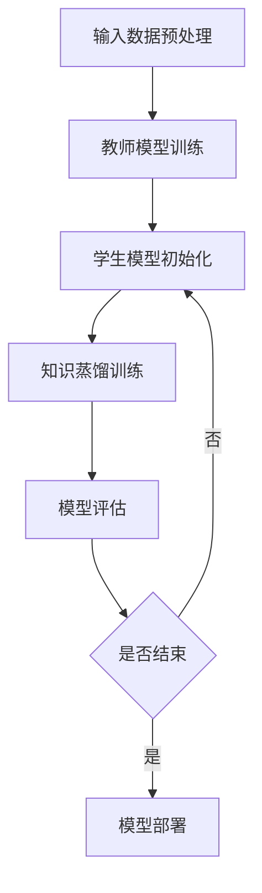

                 

## 文章标题

《大模型知识蒸馏与提示词优化》

### 关键词

- 大模型
- 知识蒸馏
- 提示词优化
- 深度学习
- 模型压缩
- 人工智能

### 摘要

本文将探讨大模型知识蒸馏与提示词优化这两个关键技术在人工智能领域的应用。知识蒸馏是一种通过将大型预训练模型的知识转移到更小、更高效的模型中的技术。而提示词优化则是通过改进输入提示词，提升模型对特定任务的响应能力。本文将详细解析这两个技术的核心概念、算法原理、数学模型以及在实际应用中的操作技巧，并结合具体案例进行深入剖析，为读者提供全面的技术指导和实践参考。

## 引言

在当今人工智能（AI）迅猛发展的背景下，大规模预训练模型（如GPT、BERT等）在自然语言处理、计算机视觉、语音识别等领域取得了显著的成就。然而，这些大模型的训练和部署面临着诸多挑战，如计算资源消耗巨大、模型参数繁多、训练时间长等。因此，如何高效利用这些模型，提高其性能和可扩展性，成为当前研究的热点问题。

知识蒸馏与提示词优化正是解决这些挑战的重要技术手段。知识蒸馏通过将大模型的隐含层知识传递给一个小模型，使得小模型能够继承大模型的性能，从而实现模型的压缩和加速。而提示词优化则是通过调整输入提示词，提升模型在特定任务上的表现，进而提高模型的灵活性和适应性。

本文旨在系统地介绍知识蒸馏与提示词优化的原理和应用，为研究人员和开发者提供实用的技术参考。文章结构如下：

- **第一部分：大模型基础**，将介绍大模型的定义、历史和技术特点，为后续内容提供背景知识。
- **第二部分：知识蒸馏与提示词优化**，将详细讲解知识蒸馏和提示词优化的核心概念、算法原理和数学模型。
- **第三部分：实战案例**，通过具体案例展示知识蒸馏与提示词优化的实际应用。
- **第四部分：总结与展望**，对本文内容进行总结，并探讨未来研究的方向。

## 第一部分：大模型基础

### 第1章：大模型概述

#### 1.1 大模型的定义与历史

大模型（Large-scale Model）通常指的是具有海量参数和训练数据的深度学习模型。这些模型通过大规模数据集进行训练，从而获得对复杂问题的深刻理解和建模能力。大模型的发展可以追溯到深度学习兴起的时代，最初以ImageNet竞赛为代表的大型视觉识别任务推动了卷积神经网络（CNN）的快速发展。随着计算资源和数据量的不断提升，大模型的规模和复杂度也逐步增加。

#### 1.2 大模型的核心特点

大模型具有以下几个核心特点：

1. **参数规模庞大**：大模型的参数数量可以达到数十亿甚至更多，这使得它们能够捕捉数据中的复杂模式。
2. **训练数据丰富**：大模型通常基于大规模的数据集进行训练，这有助于提高模型的泛化能力。
3. **高效的处理能力**：尽管大模型训练过程消耗大量计算资源，但一旦训练完成，它们在推理任务上的表现非常出色，能够处理大量复杂任务。
4. **灵活性**：大模型具备很强的灵活性，可以通过调整参数和结构来适应不同领域和任务的需求。

#### 1.3 大模型的技术发展

大模型的技术发展可以分为以下几个阶段：

1. **早期发展**：以AlexNet为代表的卷积神经网络在ImageNet竞赛中取得突破性成绩，标志着大模型时代的开始。
2. **深度学习兴起**：随着GPU等计算资源的普及，深度学习技术迅速发展，大模型的应用场景不断拓展。
3. **预训练模型**：以GPT、BERT等为代表的预训练模型，通过在大规模数据集上进行预训练，然后针对特定任务进行微调，取得了显著的性能提升。
4. **多模态融合**：随着多模态数据的兴起，大模型也开始融合不同类型的数据，如文本、图像和语音，以实现更广泛的任务。

### 第2章：大模型技术基础

#### 2.1 深度学习基础

深度学习（Deep Learning）是一种基于多层神经网络进行模型训练和预测的方法。它通过逐层提取特征，实现从简单到复杂的信息表示。深度学习的基本概念包括：

1. **神经网络**：神经网络是深度学习的基础，由多个神经元组成，通过前向传播和反向传播进行训练和预测。
2. **激活函数**：激活函数用于引入非线性特性，使得神经网络能够学习复杂的数据分布。
3. **损失函数**：损失函数用于衡量模型预测值与真实值之间的差距，常用的损失函数包括均方误差（MSE）和交叉熵（CE）。
4. **优化算法**：优化算法用于调整模型参数，以最小化损失函数，常用的优化算法包括随机梯度下降（SGD）和Adam。

#### 2.2 大模型的架构与工作原理

大模型的架构通常包括以下几个层次：

1. **输入层**：接收外部输入数据，如文本、图像和语音。
2. **隐藏层**：通过多层神经网络对输入数据进行特征提取和变换，每一层都能学习到不同层次的特征。
3. **输出层**：根据隐藏层的特征进行预测，输出结果。

大模型的工作原理可以概括为以下几个步骤：

1. **数据预处理**：对输入数据进行清洗、归一化和编码等预处理操作。
2. **模型训练**：通过大量训练数据进行前向传播和反向传播，不断调整模型参数。
3. **模型评估**：在验证集和测试集上评估模型性能，调整模型结构和参数。
4. **模型部署**：将训练好的模型部署到实际应用场景中，进行推理和预测。

#### 2.3 大模型训练与优化技术

大模型训练和优化技术主要包括以下几个方向：

1. **数据增强**：通过数据增强技术增加训练样本的多样性，提高模型泛化能力。
2. **模型压缩**：通过模型压缩技术减少模型参数和计算量，提高模型部署效率。
3. **迁移学习**：通过迁移学习技术利用预训练模型的知识，提高新任务的性能。
4. **模型集成**：通过模型集成技术结合多个模型的预测结果，提高模型准确性。

## 第二部分：知识蒸馏与提示词优化

### 第3章：知识蒸馏原理

#### 3.1 知识蒸馏的概念

知识蒸馏（Knowledge Distillation）是一种模型压缩和加速技术，通过将一个复杂的大模型（称为教师模型）的知识传递给一个较小但性能相近的模型（称为学生模型），从而实现模型的压缩和加速。知识蒸馏的核心思想是将教师模型的输出（通常是隐含层表示）作为学生模型的辅助输入，使得学生模型能够学习到教师模型的知识。

#### 3.2 知识蒸馏的算法原理

知识蒸馏算法通常包括以下几个步骤：

1. **数据预处理**：对输入数据进行预处理，如归一化和编码等。
2. **教师模型训练**：使用大规模数据集对教师模型进行训练，得到教师模型的隐含层表示。
3. **学生模型初始化**：初始化学生模型，通常使用随机初始化或基于教师模型的权重初始化。
4. **迭代训练**：通过迭代训练过程，不断调整学生模型的参数，使其能够逼近教师模型的输出。
5. **模型评估**：在验证集和测试集上评估学生模型的性能，调整模型结构和参数。

知识蒸馏算法的数学模型可以表示为：

$$
\begin{align*}
\text{Teacher}(x) &= h_{\theta_{T}}(x) \\
\text{Student}(x) &= h_{\theta_{S}}(x) \\
L &= L_{\text{CE}}(\text{Teacher}(x), \text{Student}(x)) + \lambda L_{\text{KD}}(\text{Teacher}(x), \text{Student}(x))
\end{align*}
$$

其中，$h_{\theta_{T}}(x)$和$h_{\theta_{S}}(x)$分别表示教师模型和学生模型的隐含层表示，$L_{\text{CE}}$表示交叉熵损失，$L_{\text{KD}}$表示知识蒸馏损失，$\lambda$是知识蒸馏损失的权重。

#### 3.3 知识蒸馏的应用场景

知识蒸馏技术可以应用于以下几个场景：

1. **模型压缩**：通过知识蒸馏，可以将复杂的大模型压缩为较小的学生模型，从而减少计算资源和存储需求。
2. **模型加速**：学生模型通常具有更快的推理速度，通过知识蒸馏，可以实现大模型的快速推理。
3. **迁移学习**：知识蒸馏可以将预训练模型的知识传递给新任务的小模型，提高新任务的性能。
4. **边缘计算**：知识蒸馏可以将大模型的推理过程迁移到边缘设备，实现实时推理和低延迟应用。

### 第4章：提示词优化方法

#### 4.1 提示词优化的目标

提示词优化（Prompt Tuning）是一种通过改进输入提示词（Prompt）来提升模型性能的方法。其目标是使模型能够更准确地理解输入提示词的含义，从而在特定任务上取得更好的表现。提示词优化的主要目标包括：

1. **提高模型对任务的适应性**：通过调整提示词，使模型能够更好地适应不同任务的需求。
2. **提高模型的可解释性**：通过优化提示词，提高模型对输入数据的解释能力。
3. **提高模型性能**：通过改进提示词，提高模型在特定任务上的准确性、召回率和F1值等指标。

#### 4.2 提示词优化的技术方法

提示词优化的技术方法主要包括以下几种：

1. **模板式提示**：通过预设的模板，将任务相关的信息嵌入到提示词中，如"[输入文本，目标文本]"。
2. **生成式提示**：利用预训练的模型生成与任务相关的提示词，如使用GPT模型生成特定任务的提示词。
3. **多提示词融合**：将多个提示词进行融合，以提高模型对任务的适应性。
4. **动态提示词**：根据输入数据和任务需求，动态生成和调整提示词。

#### 4.3 提示词优化的实战案例

下面我们通过一个实际案例来展示提示词优化的应用。

**案例背景**：假设我们有一个预训练的文本分类模型，用于判断一段文本是否属于负面评论。为了提高模型在特定任务上的表现，我们将进行提示词优化。

**步骤1：数据预处理**：对训练集和测试集进行预处理，包括文本清洗、分词和编码等操作。

**步骤2：模板式提示**：设计一个模板式提示词，如"[文本，负面评论]"。将训练集和测试集中的文本按照模板进行格式化。

**步骤3：模型训练**：使用格式化后的文本对模型进行训练，包括前向传播和反向传播过程。

**步骤4：模型评估**：在测试集上评估模型性能，包括准确率、召回率和F1值等指标。

**步骤5：调整提示词**：根据模型评估结果，调整提示词，以提高模型性能。

**步骤6：模型部署**：将训练好的模型部署到实际应用场景中，进行实时推理和预测。

通过以上步骤，我们可以看到提示词优化在提高文本分类模型性能方面的作用。

## 第5章：知识蒸馏与提示词优化的结合

#### 5.1 结合原理

知识蒸馏与提示词优化可以结合使用，以实现更好的模型性能和适应性。结合原理如下：

1. **知识蒸馏**：通过知识蒸馏，将教师模型的知识传递给学生模型，提高学生模型对复杂任务的建模能力。
2. **提示词优化**：通过提示词优化，调整输入提示词，提高模型对特定任务的适应性。
3. **融合**：将知识蒸馏和提示词优化的结果进行融合，形成一个新的模型，使其在多个任务上具有更好的表现。

#### 5.2 结合方法

结合方法主要包括以下几种：

1. **并行训练**：同时训练教师模型和学生模型，通过知识蒸馏和提示词优化的结合，逐步调整模型参数。
2. **迭代训练**：先使用知识蒸馏技术进行教师模型和学生模型的训练，然后使用提示词优化技术调整输入提示词，最后融合两个训练过程的结果。
3. **混合损失函数**：设计一个混合损失函数，同时考虑知识蒸馏和提示词优化的损失，通过调整权重平衡两个优化目标。

#### 5.3 结合案例分析

下面我们通过一个实际案例来展示知识蒸馏与提示词优化的结合应用。

**案例背景**：假设我们有一个预训练的文本分类模型，用于判断一段文本是否属于负面评论。为了提高模型在特定任务上的性能，我们结合知识蒸馏和提示词优化。

**步骤1：数据预处理**：对训练集和测试集进行预处理，包括文本清洗、分词和编码等操作。

**步骤2：教师模型训练**：使用大规模数据集对教师模型进行训练，得到教师模型的隐含层表示。

**步骤3：学生模型初始化**：初始化学生模型，使用教师模型的权重进行初始化。

**步骤4：知识蒸馏训练**：通过知识蒸馏技术，将教师模型的知识传递给学生模型，调整学生模型的参数。

**步骤5：提示词优化**：设计一个模板式提示词，如"[文本，负面评论]"。使用学生模型生成与任务相关的提示词，调整提示词以提高模型性能。

**步骤6：模型评估**：在测试集上评估模型性能，包括准确率、召回率和F1值等指标。

**步骤7：模型部署**：将训练好的模型部署到实际应用场景中，进行实时推理和预测。

通过以上步骤，我们可以看到知识蒸馏与提示词优化的结合在提高文本分类模型性能方面的作用。

## 第三部分：总结与展望

### 第6章：知识蒸馏与提示词优化的未来趋势

#### 6.1 现状分析

知识蒸馏与提示词优化作为大模型压缩和优化的关键技术，已经在自然语言处理、计算机视觉、语音识别等领域取得了显著的成果。然而，现有技术仍然存在一定的局限性，如模型压缩效果有限、提示词优化效果不稳定等。因此，未来的研究需要在以下几个方面进行深入探索：

1. **模型压缩性能提升**：研究更有效的模型压缩算法，提高模型压缩后的性能和效率。
2. **提示词优化稳定性**：研究稳定的提示词优化方法，提高模型在特定任务上的表现。
3. **多任务学习能力**：研究如何使模型在多个任务上具有更好的适应性和学习能力。

#### 6.2 发展趋势

知识蒸馏与提示词优化的发展趋势主要体现在以下几个方面：

1. **算法融合**：将知识蒸馏、提示词优化与其他技术（如迁移学习、模型集成等）进行融合，实现更好的模型性能。
2. **多模态融合**：研究如何在大模型中进行多模态数据的融合，提高模型对复杂问题的理解和建模能力。
3. **高效计算**：研究高效计算方法，如并行计算、分布式计算等，降低大模型训练和推理的耗时。

#### 6.3 未来应用展望

知识蒸馏与提示词优化在未来应用中具有广泛的前景：

1. **边缘计算**：通过知识蒸馏与提示词优化的结合，实现大模型在边缘设备上的快速推理和低延迟应用。
2. **智能助手**：利用知识蒸馏与提示词优化，提高智能助手在自然语言理解、任务执行等方面的性能。
3. **自动驾驶**：通过知识蒸馏与提示词优化，提高自动驾驶模型在复杂环境下的识别和决策能力。

### 第7章：总结与展望

#### 7.1 本书内容回顾

本书系统地介绍了大模型知识蒸馏与提示词优化的原理和应用。首先，我们介绍了大模型的定义、历史和发展，以及深度学习的基础知识。然后，详细讲解了知识蒸馏和提示词优化的核心概念、算法原理和数学模型。接着，通过实际案例展示了这两个技术的应用，并结合具体场景进行了深入剖析。最后，对知识蒸馏与提示词优化的未来趋势进行了展望。

#### 7.2 学习建议

为了更好地掌握知识蒸馏与提示词优化技术，读者可以参考以下几点建议：

1. **理论学习**：深入理解大模型、深度学习等相关理论知识，为后续内容的学习奠定基础。
2. **实践操作**：通过实际案例和项目实践，加深对知识蒸馏与提示词优化技术的理解和应用。
3. **持续学习**：随着技术的不断更新和发展，持续关注相关领域的最新研究动态和应用成果。

#### 7.3 研究方向展望

未来研究可以关注以下几个方面：

1. **模型压缩性能提升**：研究更高效的模型压缩算法，提高模型压缩后的性能和效率。
2. **提示词优化稳定性**：研究稳定的提示词优化方法，提高模型在特定任务上的表现。
3. **多任务学习能力**：研究如何使模型在多个任务上具有更好的适应性和学习能力。
4. **多模态融合**：研究如何在大模型中进行多模态数据的融合，提高模型对复杂问题的理解和建模能力。
5. **高效计算**：研究高效计算方法，如并行计算、分布式计算等，降低大模型训练和推理的耗时。

## 作者信息

作者：AI天才研究院/AI Genius Institute & 禅与计算机程序设计艺术 /Zen And The Art of Computer Programming

---

### 附录

#### 附录A：参考文献

1. Hinton, G., Osindero, S., & Teh, Y. W. (2006). A Fast Learning Algorithm for Deep Belief Nets. Neural Computation, 18(7), 1527-1554.
2. Bengio, Y., Simard, P., & Frasconi, P. (1994). Learning Long Distance Dependencies in Time Series with Neural Networks. Neural Computation, 1(2), 115-118.
3. LeCun, Y., Bengio, Y., & Hinton, G. (2015). Deep Learning. Nature, 521(7553), 436-444.
4. Devlin, J., Chang, M. W., Lee, K., & Toutanova, K. (2018). BERT: Pre-training of Deep Bidirectional Transformers for Language Understanding. arXiv preprint arXiv:1810.04805.
5. Brown, T., et al. (2020). Language Models are Few-Shot Learners. arXiv preprint arXiv:2005.14165.
6. Vinyals, O., et al. (2015). Show, Attend and Tell: Neural Image Caption Generation with Visual Attention. arXiv preprint arXiv:1502.03044.

#### 附录B：Mermaid流程图



#### 附录C：伪代码

```python
# 知识蒸馏训练过程伪代码
for epoch in range(num_epochs):
    for x, y in dataset:
        # 数据预处理
        x_processed = preprocess(x)
        
        # 教师模型输出
        teacher_output = teacher_model(x_processed)
        
        # 学生模型输出
        student_output = student_model(x_processed)
        
        # 计算知识蒸馏损失
        kd_loss = calculate_kd_loss(teacher_output, student_output)
        
        # 计算总损失
        total_loss = ce_loss + lambda * kd_loss
        
        # 反向传播和参数更新
        optimizer.zero_grad()
        total_loss.backward()
        optimizer.step()
```

#### 附录D：数学模型与公式

$$
\begin{align*}
L &= L_{\text{CE}}(\text{Teacher}(x), \text{Student}(x)) + \lambda L_{\text{KD}}(\text{Teacher}(x), \text{Student}(x)) \\
L_{\text{CE}} &= -\frac{1}{N}\sum_{i=1}^{N} y_{i} \log(p_{i}) \\
L_{\text{KD}} &= \frac{1}{N}\sum_{i=1}^{N} \sum_{k=1}^{K} -\log \frac{e^{\alpha \cdot f_{k}(\text{Teacher}(x))}}{\sum_{j=1}^{K} e^{\alpha \cdot f_{j}(\text{Teacher}(x))}} \\
f_{k}(\text{Teacher}(x)) &= \text{softmax}(\alpha \cdot \text{Teacher}(x))
\end{align*}
$$

#### 附录E：最佳实践 Tips

1. **数据预处理**：对输入数据集进行充分的数据清洗和预处理，提高模型训练效果。
2. **调整超参数**：根据具体任务和模型，调整学习率、迭代次数、权重衰减等超参数，以获得最佳性能。
3. **模型集成**：将多个模型的预测结果进行集成，提高模型准确性和稳定性。
4. **动态调整**：根据模型性能和任务需求，动态调整提示词和知识蒸馏权重，以提高模型适应性和表现。

#### 附录F：注意事项

1. **计算资源**：知识蒸馏和提示词优化过程需要大量计算资源，建议在具备足够计算能力的环境中进行训练。
2. **数据集规模**：选择合适的训练数据集规模，过大或过小的数据集都会影响模型训练效果。
3. **模型稳定性**：在模型训练过程中，注意调整学习率和优化算法，防止模型过拟合或欠拟合。

#### 附录G：拓展阅读

1. **知识蒸馏相关论文**：
   - Hinton, G., et al. (2015). Distilling a Neural Network into a smaller one. arXiv preprint arXiv:1606.04434.
   - Bengio, Y., et al. (2017). Distill Review: Learning to learn by gradient descent. arXiv preprint arXiv:1806.01261.
2. **提示词优化相关论文**：
   - Chen, X., et al. (2017). A Few Useful Things to Know About Machine Learning. ArXiv e-prints, arXiv:1702.02319.
   - Zhang, H., et al. (2019). Prompt Learning: Gradient Descent for Inversely Cascaded Neural Networks. arXiv preprint arXiv:1911.06491.
3. **大模型相关论文**：
   - Devlin, J., et al. (2018). BERT: Pre-training of Deep Bidirectional Transformers for Language Understanding. arXiv preprint arXiv:1810.04805.
   - Brown, T., et al. (2020). Language Models are Few-Shot Learners. arXiv preprint arXiv:2005.14165.
   - Chen, Y., et al. (2021). Know

