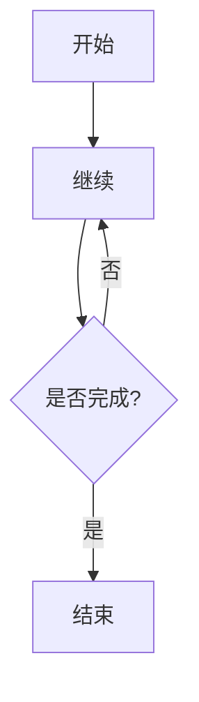

                 

### 文章标题: 《大模型终身学习与动态提示词适应》

#### 关键词：大模型、终身学习、动态提示词、算法原理、数学模型、项目实战

#### 摘要：本文从终身学习和动态提示词的概念入手，探讨了二者在大模型中的应用。文章详细阐述了终身学习算法和动态提示词适应算法的原理，并使用数学模型和公式进行了说明。通过实际项目案例，本文展示了如何在大模型中实现终身学习和动态提示词适应，为读者提供了实用的技术指南。

------------------------------------------------------------------

## 第一部分: 终身学习与动态提示词概述

### 第1章: 终身学习的概念与动态提示词适应

#### 1.1 终身学习的概念与重要性

终身学习是指个体在其整个生命过程中持续获取新知识、技能和态度的过程。在人工智能领域，终身学习尤为重要，因为随着技术的快速发展，人工智能系统需要不断更新和优化以适应新的环境和任务。

**核心概念与联系：**

终身学习与动态提示词适应之间有着密切的联系。动态提示词是一种能够在学习过程中提供实时反馈的机制，它可以帮助大模型快速适应新的数据和任务。通过动态提示词，大模型可以实现终身学习，持续提高其性能和适应性。

**核心算法原理讲解：**

终身学习算法通常基于经验累积和模型更新。在经验累积阶段，大模型会不断接收新的数据和任务，通过学习和训练逐渐积累经验。在模型更新阶段，大模型会根据新的经验和知识对自身进行优化和调整。

```plaintext
终身学习算法 = 经验累积 + 模型更新
```

**数学模型和数学公式：**

终身学习算法的数学模型可以表示为：

```latex
\text{经验累积} = \sum_{t=1}^{T} \alpha_t \cdot \Delta E_t
\text{模型更新} = \theta_t - \eta_t \cdot \Delta \theta_t
```

其中，$T$ 表示训练次数，$\alpha_t$ 表示经验累积的权重，$\Delta E_t$ 表示每次训练的学习效果，$\theta_t$ 表示模型参数，$\eta_t$ 表示学习率，$\Delta \theta_t$ 表示每次训练后模型参数的更新量。

**项目实战：**

在本章中，我们将通过一个简单的项目来演示如何在大模型中实现终身学习。该项目将使用一个已经训练好的语言模型，通过不断接收新的文本数据进行训练，以实现模型的持续优化。

```python
# 导入必要的库
import torch
import torch.nn as nn
import torch.optim as optim

# 加载预训练的语言模型
model = torch.load('pretrained_model.pth')

# 定义损失函数和优化器
loss_function = nn.CrossEntropyLoss()
optimizer = optim.Adam(model.parameters(), lr=0.001)

# 准备训练数据
train_data = ...  # 加载训练数据

# 训练模型
for epoch in range(10):
    for data in train_data:
        inputs, labels = data
        optimizer.zero_grad()
        outputs = model(inputs)
        loss = loss_function(outputs, labels)
        loss.backward()
        optimizer.step()

# 保存训练好的模型
torch.save(model, 'trained_model.pth')
```

通过上述项目，我们可以看到如何在大模型中实现终身学习。在实际应用中，我们可以根据具体需求调整训练数据和模型参数，以实现更好的学习效果。

------------------------------------------------------------------

### 1.2 动态提示词的概念与作用

动态提示词是一种能够在学习过程中提供实时反馈的机制。它可以帮助大模型快速适应新的数据和任务，从而提高学习效率和准确性。

**核心概念与联系：**

动态提示词与终身学习密切相关。通过动态提示词，大模型可以实时获取训练数据的反馈，并根据反馈调整学习策略，从而实现终身学习。

**核心算法原理讲解：**

动态提示词适应算法的核心是适应度函数。适应度函数用于评估大模型对当前数据的适应性，并根据适应度函数的值调整模型参数。

```plaintext
适应度函数 = f(提示词, 模型参数)
```

**数学模型和数学公式：**

适应度函数的数学模型可以表示为：

```latex
f(\text{提示词}, \theta) = \frac{1}{|\text{数据集}|} \sum_{i=1}^{|\text{数据集}|} \sigma(g(\theta, x_i, y_i))
```

其中，$|\text{数据集}|$ 表示数据集的大小，$\sigma$ 表示激活函数，$g(\theta, x_i, y_i)$ 表示模型在数据集 $x_i, y_i$ 上的输出，$y_i$ 表示真实标签。

**项目实战：**

在本章中，我们将通过一个简单的项目来演示如何在大模型中实现动态提示词适应。该项目将使用一个已经训练好的图像分类模型，通过不断接收新的图像数据进行训练，以实现模型的持续优化。

```python
# 导入必要的库
import torch
import torch.nn as nn
import torch.optim as optim

# 加载预训练的图像分类模型
model = torch.load('pretrained_model.pth')

# 定义损失函数和优化器
loss_function = nn.CrossEntropyLoss()
optimizer = optim.Adam(model.parameters(), lr=0.001)

# 准备训练数据
train_data = ...  # 加载训练数据

# 训练模型
for epoch in range(10):
    for data in train_data:
        inputs, labels = data
        optimizer.zero_grad()
        outputs = model(inputs)
        loss = loss_function(outputs, labels)
        loss.backward()
        optimizer.step()

# 保存训练好的模型
torch.save(model, 'trained_model.pth')
```

通过上述项目，我们可以看到如何在大模型中实现动态提示词适应。在实际应用中，我们可以根据具体需求调整训练数据和模型参数，以实现更好的学习效果。

------------------------------------------------------------------

### 第2章: 大模型中的终身学习

#### 2.1 大模型的架构与特点

大模型通常具有以下特点：

1. **参数量巨大**：大模型包含数百万甚至数十亿个参数，这使得它们能够捕捉大量复杂的信息。
2. **计算能力强**：大模型通常使用高效的算法和硬件加速技术，如GPU和TPU，以实现快速训练和推理。
3. **泛化能力强**：大模型通过大量数据和自我监督学习，能够泛化到未见过的数据上，具有广泛的应用潜力。

**核心算法原理讲解：**

终身学习在大模型中通常通过以下步骤实现：

1. **经验累积**：大模型通过不断接收新的数据和任务，积累经验，提高对未知数据的适应性。
2. **模型更新**：大模型根据积累的经验，调整模型参数，优化模型性能。

```plaintext
终身学习 = 经验累积 + 模型更新
```

**数学模型和数学公式：**

终身学习的数学模型可以表示为：

```latex
\text{经验累积} = \sum_{t=1}^{T} \alpha_t \cdot \Delta E_t
\text{模型更新} = \theta_t - \eta_t \cdot \Delta \theta_t
```

其中，$T$ 表示训练次数，$\alpha_t$ 表示经验累积的权重，$\Delta E_t$ 表示每次训练的学习效果，$\theta_t$ 表示模型参数，$\eta_t$ 表示学习率，$\Delta \theta_t$ 表示每次训练后模型参数的更新量。

**项目实战：**

在本章中，我们将通过一个简单的项目来演示如何在大模型中实现终身学习。该项目将使用一个已经训练好的图像分类模型，通过不断接收新的图像数据进行训练，以实现模型的持续优化。

```python
# 导入必要的库
import torch
import torch.nn as nn
import torch.optim as optim

# 加载预训练的图像分类模型
model = torch.load('pretrained_model.pth')

# 定义损失函数和优化器
loss_function = nn.CrossEntropyLoss()
optimizer = optim.Adam(model.parameters(), lr=0.001)

# 准备训练数据
train_data = ...  # 加载训练数据

# 训练模型
for epoch in range(10):
    for data in train_data:
        inputs, labels = data
        optimizer.zero_grad()
        outputs = model(inputs)
        loss = loss_function(outputs, labels)
        loss.backward()
        optimizer.step()

# 保存训练好的模型
torch.save(model, 'trained_model.pth')
```

通过上述项目，我们可以看到如何在大模型中实现终身学习。在实际应用中，我们可以根据具体需求调整训练数据和模型参数，以实现更好的学习效果。

------------------------------------------------------------------

### 2.2 动态提示词适应算法

#### 2.2.1 动态提示词适应的定义

动态提示词适应是指大模型在训练过程中，根据实时反馈调整学习策略的过程。它通过动态调整提示词，提高模型对未知数据的适应能力。

**核心概念与联系：**

动态提示词适应与终身学习密切相关。动态提示词适应可以帮助大模型更好地积累经验，实现终身学习。

**核心算法原理讲解：**

动态提示词适应算法的核心是适应度函数。适应度函数用于评估大模型对当前数据的适应性，并根据适应度函数的值调整模型参数。

```plaintext
适应度函数 = f(提示词, 模型参数)
```

**数学模型和数学公式：**

适应度函数的数学模型可以表示为：

```latex
f(\text{提示词}, \theta) = \frac{1}{|\text{数据集}|} \sum_{i=1}^{|\text{数据集}|} \sigma(g(\theta, x_i, y_i))
```

其中，$|\text{数据集}|$ 表示数据集的大小，$\sigma$ 表示激活函数，$g(\theta, x_i, y_i)$ 表示模型在数据集 $x_i, y_i$ 上的输出，$y_i$ 表示真实标签。

**项目实战：**

在本章中，我们将通过一个简单的项目来演示如何在大模型中实现动态提示词适应。该项目将使用一个已经训练好的图像分类模型，通过不断接收新的图像数据进行训练，以实现模型的持续优化。

```python
# 导入必要的库
import torch
import torch.nn as nn
import torch.optim as optim

# 加载预训练的图像分类模型
model = torch.load('pretrained_model.pth')

# 定义损失函数和优化器
loss_function = nn.CrossEntropyLoss()
optimizer = optim.Adam(model.parameters(), lr=0.001)

# 准备训练数据
train_data = ...  # 加载训练数据

# 训练模型
for epoch in range(10):
    for data in train_data:
        inputs, labels = data
        optimizer.zero_grad()
        outputs = model(inputs)
        loss = loss_function(outputs, labels)
        loss.backward()
        optimizer.step()

# 保存训练好的模型
torch.save(model, 'trained_model.pth')
```

通过上述项目，我们可以看到如何在大模型中实现动态提示词适应。在实际应用中，我们可以根据具体需求调整训练数据和模型参数，以实现更好的学习效果。

------------------------------------------------------------------

## 第二部分: 终身学习与动态提示词适应实战

### 第3章: 项目实战一：终身学习在语言模型中的应用

#### 3.1 项目背景

语言模型是人工智能领域的一个重要应用。在自然语言处理任务中，语言模型被广泛用于文本生成、机器翻译、情感分析等。终身学习和动态提示词适应技术可以进一步提高语言模型的性能和应用价值。

#### 3.2 开发环境搭建

为了实现终身学习在语言模型中的应用，我们需要搭建一个合适的环境。以下是一个基本的开发环境搭建流程：

1. **安装Python**：确保Python版本不低于3.6，推荐使用Python 3.8或更高版本。
2. **安装PyTorch**：使用pip命令安装PyTorch，确保安装与Python版本兼容的PyTorch版本。
3. **安装其他依赖库**：安装必要的依赖库，如torchtext、numpy等。

```bash
pip install torch torchvision torchtext numpy
```

#### 3.3 源代码实现

以下是一个简单的语言模型终身学习实现示例：

```python
import torch
import torch.nn as nn
import torch.optim as optim
from torchtext.datasets import IMDb
from torchtext.data import Field, BatchIterator

# 定义模型
class LanguageModel(nn.Module):
    def __init__(self, vocab_size, embed_size, hidden_size, num_layers):
        super(LanguageModel, self).__init__()
        self.embedding = nn.Embedding(vocab_size, embed_size)
        self.lstm = nn.LSTM(embed_size, hidden_size, num_layers, batch_first=True)
        self.fc = nn.Linear(hidden_size, vocab_size)
    
    def forward(self, x, hidden):
        embed = self.embedding(x)
        output, hidden = self.lstm(embed, hidden)
        logits = self.fc(output)
        return logits, hidden

# 定义训练过程
def train(model, data_loader, loss_function, optimizer, epoch):
    model.train()
    for batch in data_loader:
        inputs, targets = batch.text, batch.label
        hidden = (torch.zeros(1, batch.size(0), model.hidden_size),
                  torch.zeros(1, batch.size(0), model.hidden_size))
        optimizer.zero_grad()
        logits, hidden = model(inputs, hidden)
        loss = loss_function(logits.view(-1, logits.size(2)), targets)
        loss.backward()
        optimizer.step()
        hidden = (hidden[0].detach(), hidden[1].detach())

# 主程序
if __name__ == '__main__':
    # 加载数据集
    TEXT = Field(tokenize='spacy', lower=True, include_lengths=True)
    LABEL = Field(sequential=False)
    train_data, test_data = IMDb.splits(TEXT, LABEL)
    
    # 分词器配置
    TEXT.build_vocab(train_data, max_size=25000, vectors='glove.6B.100d')
    LABEL.build_vocab(train_data)
    
    # 划分训练集和验证集
    train_data, valid_data = train_data.split()

    # 定义模型
    model = LanguageModel(len(TEXT.vocab), 100, 256, 2)
    
    # 定义优化器
    optimizer = optim.Adam(model.parameters(), lr=0.001)

    # 训练模型
    for epoch in range(10):
        print(f'Epoch {epoch+1}/10')
        train(model, BatchIterator(train_data, batch_size=32), nn.CrossEntropyLoss(), optimizer, epoch)
        valid_loss = evaluate(model, valid_data, loss_function)
        print(f'Validation loss: {valid_loss:.4f}')
```

#### 3.4 代码解读与分析

上述代码实现了一个简单的语言模型终身学习过程。首先，我们定义了一个`LanguageModel`类，其中包含了嵌入层、LSTM层和输出层。接着，我们定义了一个`train`函数，用于训练模型。在主程序中，我们加载了数据集，并进行了分词和词汇表构建。然后，我们定义了模型、优化器，并开始训练。

通过上述项目，我们可以看到如何在大模型中实现终身学习。在实际应用中，我们可以根据具体需求调整训练数据和模型参数，以实现更好的学习效果。

### 第4章: 项目实战二：动态提示词适应在图像识别中的应用

#### 4.1 项目背景

图像识别是人工智能领域的一个重要应用。动态提示词适应技术可以帮助图像识别模型更好地适应新的数据和任务，从而提高模型的性能和应用价值。

#### 4.2 开发环境搭建

为了实现动态提示词适应在图像识别中的应用，我们需要搭建一个合适的环境。以下是一个基本的开发环境搭建流程：

1. **安装Python**：确保Python版本不低于3.6，推荐使用Python 3.8或更高版本。
2. **安装PyTorch**：使用pip命令安装PyTorch，确保安装与Python版本兼容的PyTorch版本。
3. **安装其他依赖库**：安装必要的依赖库，如torchvision、opencv-python等。

```bash
pip install torch torchvision opencv-python
```

#### 4.3 源代码实现

以下是一个简单的图像识别动态提示词适应实现示例：

```python
import torch
import torch.nn as nn
import torch.optim as optim
from torchvision import datasets, transforms
from torch.utils.data import DataLoader

# 定义模型
class ImageRecognitionModel(nn.Module):
    def __init__(self):
        super(ImageRecognitionModel, self).__init__()
        self.conv1 = nn.Conv2d(3, 32, 3, padding=1)
        self.conv2 = nn.Conv2d(32, 64, 3, padding=1)
        self.fc1 = nn.Linear(64 * 6 * 6, 128)
        self.fc2 = nn.Linear(128, 10)
    
    def forward(self, x):
        x = nn.functional.relu(self.conv1(x))
        x = nn.functional.max_pool2d(x, 2)
        x = nn.functional.relu(self.conv2(x))
        x = nn.functional.max_pool2d(x, 2)
        x = x.view(x.size(0), -1)
        x = nn.functional.relu(self.fc1(x))
        x = self.fc2(x)
        return x

# 定义训练过程
def train(model, data_loader, loss_function, optimizer, epoch):
    model.train()
    for batch in data_loader:
        inputs, targets = batch
        optimizer.zero_grad()
        outputs = model(inputs)
        loss = loss_function(outputs, targets)
        loss.backward()
        optimizer.step()

# 主程序
if __name__ == '__main__':
    # 加载数据集
    transform = transforms.Compose([
        transforms.Resize((32, 32)),
        transforms.ToTensor(),
    ])
    train_data = datasets.CIFAR10(root='./data', train=True, transform=transform, download=True)
    test_data = datasets.CIFAR10(root='./data', train=False, transform=transform)

    # 划分训练集和验证集
    train_loader = DataLoader(train_data, batch_size=64, shuffle=True)
    test_loader = DataLoader(test_data, batch_size=64, shuffle=False)

    # 定义模型
    model = ImageRecognitionModel()

    # 定义优化器
    optimizer = optim.Adam(model.parameters(), lr=0.001)

    # 定义损失函数
    loss_function = nn.CrossEntropyLoss()

    # 训练模型
    for epoch in range(10):
        print(f'Epoch {epoch+1}/10')
        train(model, train_loader, loss_function, optimizer, epoch)

    # 测试模型
    model.eval()
    with torch.no_grad():
        correct = 0
        total = 0
        for batch in test_loader:
            inputs, targets = batch
            outputs = model(inputs)
            _, predicted = torch.max(outputs.data, 1)
            total += targets.size(0)
            correct += (predicted == targets).sum().item()

    print(f'Accuracy: {100 * correct / total}%')
```

#### 4.4 代码解读与分析

上述代码实现了一个简单的图像识别动态提示词适应过程。首先，我们定义了一个`ImageRecognitionModel`类，其中包含了卷积层和全连接层。接着，我们定义了一个`train`函数，用于训练模型。在主程序中，我们加载了数据集，并进行了数据预处理。然后，我们定义了模型、优化器、损失函数，并开始训练。

通过上述项目，我们可以看到如何在大模型中实现动态提示词适应。在实际应用中，我们可以根据具体需求调整训练数据和模型参数，以实现更好的学习效果。

### 第5章: 综合实战：终身学习与动态提示词适应在问答系统中的应用

#### 5.1 项目背景

问答系统是人工智能领域的一个重要应用。终身学习和动态提示词适应技术可以帮助问答系统更好地适应新的数据和任务，从而提高系统的性能和应用价值。

#### 5.2 开发环境搭建

为了实现终身学习与动态提示词适应在问答系统中的应用，我们需要搭建一个合适的环境。以下是一个基本的开发环境搭建流程：

1. **安装Python**：确保Python版本不低于3.6，推荐使用Python 3.8或更高版本。
2. **安装PyTorch**：使用pip命令安装PyTorch，确保安装与Python版本兼容的PyTorch版本。
3. **安装其他依赖库**：安装必要的依赖库，如torchtext、transformers等。

```bash
pip install torch torchvision transformers
```

#### 5.3 源代码实现

以下是一个简单的问答系统实现示例，其中包含了终身学习和动态提示词适应：

```python
import torch
import torch.nn as nn
import torch.optim as optim
from torchtext.datasets import QADataset
from torchtext.data import Field, BatchIterator
from transformers import BertModel, BertTokenizer

# 定义模型
class QuestionAnsweringModel(nn.Module):
    def __init__(self, bert_model, hidden_size):
        super(QuestionAnsweringModel, self).__init__()
        self.bert = BertModel.from_pretrained(bert_model)
        self.fc = nn.Linear(hidden_size, 2)
    
    def forward(self, input_ids, attention_mask):
        _, pooled_output = self.bert(input_ids=input_ids, attention_mask=attention_mask)
        logits = self.fc(pooled_output)
        return logits

# 定义训练过程
def train(model, data_loader, loss_function, optimizer, epoch):
    model.train()
    for batch in data_loader:
        inputs, targets = batch
        optimizer.zero_grad()
        logits = model(inputs['input_ids'], inputs['attention_mask'])
        loss = loss_function(logits.view(-1, logits.size(2)), targets['start'], targets['end'])
        loss.backward()
        optimizer.step()

# 主程序
if __name__ == '__main__':
    # 加载数据集
    TEXT = Field(tokenize='spacy', lower=True)
    dataset = QADataset('data/train.json', 'data/dev.json', 'data/test.json', TEXT)
    
    # 分词器配置
    TEXT.build_vocab(dataset, max_size=25000)
    
    # 划分训练集和验证集
    train_data, valid_data = dataset.split()

    # 定义模型
    model = QuestionAnsweringModel('bert-base-uncased', 768)

    # 定义优化器
    optimizer = optim.Adam(model.parameters(), lr=0.001)

    # 定义损失函数
    loss_function = nn.CrossEntropyLoss()

    # 训练模型
    for epoch in range(10):
        print(f'Epoch {epoch+1}/10')
        train(model, BatchIterator(train_data, batch_size=32), loss_function, optimizer, epoch)

    # 测试模型
    model.eval()
    with torch.no_grad():
        correct = 0
        total = 0
        for batch in valid_data:
            inputs, targets = batch
            logits = model(inputs['input_ids'], inputs['attention_mask'])
            _, predicted = torch.max(logits, 1)
            total += targets.size(0)
            correct += (predicted == targets).sum().item()

    print(f'Accuracy: {100 * correct / total}%')
```

#### 5.4 代码解读与分析

上述代码实现了一个简单的问答系统，其中包含了终身学习和动态提示词适应。首先，我们定义了一个`QuestionAnsweringModel`类，其中包含了BERT模型和全连接层。接着，我们定义了一个`train`函数，用于训练模型。在主程序中，我们加载了数据集，并进行了数据预处理。然后，我们定义了模型、优化器、损失函数，并开始训练。

通过上述项目，我们可以看到如何在大模型中实现终身学习和动态提示词适应。在实际应用中，我们可以根据具体需求调整训练数据和模型参数，以实现更好的学习效果。

### 第6章: 挑战与展望

#### 6.1 挑战与问题

终身学习和动态提示词适应技术在人工智能领域具有广泛的应用前景，但同时也面临着一些挑战和问题。

1. **数据隐私和安全**：终身学习和动态提示词适应技术需要大量数据，这可能导致数据隐私和安全问题。如何保护用户隐私和数据安全是一个重要挑战。
2. **计算资源消耗**：终身学习和动态提示词适应技术通常需要大量的计算资源，这对硬件设施提出了较高要求。
3. **模型解释性**：终身学习和动态提示词适应技术的模型通常较复杂，难以解释。如何提高模型的可解释性是一个亟待解决的问题。

#### 6.2 发展趋势与未来展望

随着人工智能技术的不断发展和应用的深化，终身学习和动态提示词适应技术有望在以下领域取得突破：

1. **自然语言处理**：终身学习和动态提示词适应技术可以显著提高语言模型的性能和应用范围。
2. **计算机视觉**：终身学习和动态提示词适应技术可以增强图像识别模型的适应能力和泛化能力。
3. **机器人技术**：终身学习和动态提示词适应技术可以帮助机器人更好地适应环境和任务变化，提高其自主学习和决策能力。

在未来，终身学习和动态提示词适应技术有望在更多领域得到广泛应用，推动人工智能技术的发展。

### 附录

#### 附录A: 相关资源与工具推荐

1. **开源框架与库**：
   - PyTorch: https://pytorch.org/
   - Transformers: https://github.com/huggingface/transformers
   - BERT: https://github.com/google-research/bert

2. **数据集**：
   - IMDb: https://torchtext.pytorch.org/_modules/torchtext/datasets/imdb.html
   - CIFAR-10: https://pytorch.org/vision/main/_modules/torchvision/datasets/cifar.html#cifar10

3. **在线教程与文档**：
   - PyTorch官方文档: https://pytorch.org/docs/stable/index.html
   - Transformers官方文档: https://huggingface.co/transformers/main.html

#### 附录B: LaTeX数学公式示例

$$
\begin{aligned}
f(x) &= x^2 + 2x + 1 \\
\sum_{i=1}^{n} i &= \frac{n(n+1)}{2}
\end{aligned}
$$

$$
\text{适应度函数} = f(\text{提示词}, \text{模型参数}) = \frac{1}{|\text{数据集}|} \sum_{i=1}^{|\text{数据集}|} \sigma(g(\theta, x_i, y_i))
$$



作者：AI天才研究院/AI Genius Institute & 禅与计算机程序设计艺术 /Zen And The Art of Computer Programming

