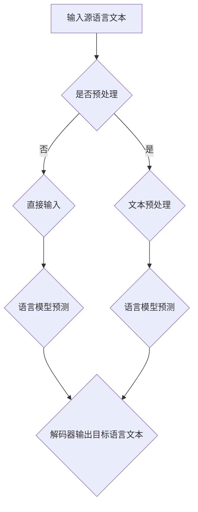
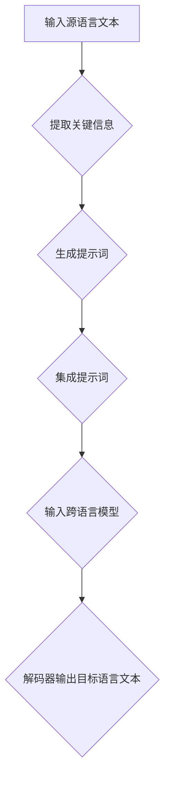
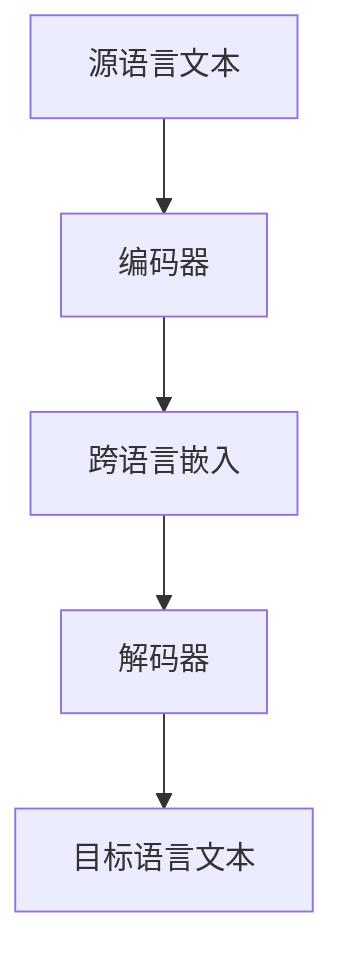

                 

# 大模型跨语言理解：提示词Bridging语言差异

关键词：跨语言理解、大模型、提示词Bridging、语言差异

摘要：随着全球化和互联网的发展，跨语言信息处理的需求日益增长。本文主要探讨大模型在跨语言理解中的应用，重点关注提示词Bridging技术如何解决语言差异问题，提高跨语言信息处理的准确性和效率。

## 目录大纲

#### 第一部分: 大模型跨语言理解基础

##### 第1章: 大模型跨语言理解概述

1.1 跨语言理解的定义与重要性

1.2 跨语言理解的发展历程

1.3 跨语言理解的核心挑战

1.4 跨语言理解的潜在应用场景

##### 第2章: 提示词Bridging语言差异

2.1 提示词Bridging的概念与作用

2.2 提示词Bridging的基本原理

2.3 提示词Bridging的实现方法

2.4 提示词Bridging的性能评估

##### 第3章: 大模型在跨语言理解中的应用

3.1 大模型在跨语言理解中的优势

3.2 大模型跨语言理解的架构

3.3 大模型跨语言理解的关键算法

3.4 大模型跨语言理解的实际案例

##### 第4章: 跨语言理解的核心算法原理

4.1 语言模型与序列模型

4.2 注意力机制与自注意力模型

4.3 多语言嵌入与跨语言表示

4.4 提示词Bridging的算法原理分析

##### 第5章: 跨语言理解的数学模型与公式

5.1 语言模型中的数学模型

5.2 注意力机制中的数学模型

5.3 跨语言表示中的数学模型

5.4 提示词Bridging的数学模型

##### 第6章: 跨语言理解的项目实战

6.1 项目背景与目标

6.2 环境搭建与工具选择

6.3 数据预处理与模型训练

6.4 模型评估与优化

6.5 项目总结与展望

##### 第7章: 跨语言理解的未来发展趋势

7.1 跨语言理解技术的未来方向

7.2 跨语言理解在AI中的角色与价值

7.3 跨语言理解面临的挑战与机遇

### 附录

### 附录A: 跨语言理解相关工具与资源

A.1 主流跨语言理解工具对比

A.2 跨语言理解相关论文与资源

A.3 跨语言理解实战项目案例

### 附录B: Mermaid流程图

B.1 跨语言理解整体流程图

B.2 提示词Bridging流程图

B.3 大模型跨语言理解架构图

### 附录C: 伪代码示例

C.1 语言模型训练伪代码

C.2 注意力机制实现伪代码

C.3 跨语言表示训练伪代码

C.4 提示词Bridging算法伪代码

### 第一部分: 大模型跨语言理解基础

#### 第1章: 大模型跨语言理解概述

1.1 跨语言理解的定义与重要性

跨语言理解（Cross-Lingual Understanding）是指在不同语言之间进行信息传递和处理的能力。在多语言环境中，跨语言理解可以帮助用户跨越语言障碍，获取和共享信息，提高沟通效率。随着全球化进程的加速和互联网的普及，跨语言理解在各个领域得到了广泛应用。

跨语言理解的重要性体现在以下几个方面：

1. 提高信息获取能力：通过跨语言理解，用户可以轻松访问和理解非母语的信息，从而拓宽知识视野。

2. 促进全球化交流：跨语言理解使得全球不同地区的人们能够更容易地进行交流和合作，促进文化交流和国际合作。

3. 提升用户体验：跨语言理解可以提升多语言用户的应用体验，如多语言搜索引擎、机器翻译、多语言问答系统等。

4. 支持多语言内容创作：跨语言理解可以帮助创作者生成适用于不同语言和文化背景的内容，提升内容创作的多样性和覆盖范围。

1.2 跨语言理解的发展历程

跨语言理解技术的研究可以追溯到20世纪60年代，随着计算机科学和人工智能技术的发展，跨语言理解逐渐成为研究热点。以下是跨语言理解技术的主要发展阶段：

1. 字符串匹配阶段：早期跨语言理解主要依赖于字符串匹配算法，通过直接比较源语言和目标语言的文本，寻找可能的对应关系。

2. 基于规则的方法：随后，研究者们开始尝试利用语法规则和词典知识进行跨语言信息处理，例如基于语法分析的翻译模型和基于统计的翻译模型。

3. 基于统计的方法：随着语料库的积累和计算能力的提升，基于统计的机器翻译方法逐渐成为主流，如基于短语的机器翻译和基于神经网络的机器翻译。

4. 基于深度学习的方法：近年来，深度学习技术在跨语言理解领域取得了显著进展，特别是基于端到端的神经网络模型，如序列到序列（Seq2Seq）模型和注意力机制模型。

1.3 跨语言理解的核心挑战

跨语言理解技术在实际应用中面临以下核心挑战：

1. 语言差异：不同语言在语法、词汇、语义等方面存在巨大差异，如何有效地处理这些差异是跨语言理解的关键问题。

2. 语料库不足：相对于单语言任务，跨语言任务所需的语料库往往更加有限，这限制了模型的效果。

3. 上下文依赖：跨语言理解需要考虑上下文信息，以正确理解词汇和句子的含义。然而，上下文信息的获取和处理非常复杂。

4. 多样性处理：不同语言和文化背景的用户对同一信息可能有不同的表达方式，跨语言理解技术需要能够适应这种多样性。

5. 实时性要求：在某些应用场景中，如实时翻译和多语言问答，跨语言理解需要具有较低的延迟和较高的准确度。

1.4 跨语言理解的潜在应用场景

跨语言理解技术在多个领域具有广泛的应用潜力：

1. 机器翻译：跨语言理解是实现高质量机器翻译的关键技术，广泛应用于国际交流、跨国商务、多语言内容创作等领域。

2. 多语言搜索引擎：跨语言理解可以帮助搜索引擎跨越语言障碍，为用户提供更加丰富和准确的信息检索服务。

3. 多语言问答系统：跨语言理解技术可以支持多语言用户进行问答互动，提供个性化、智能化的服务。

4. 跨语言信息推荐：跨语言理解可以帮助推荐系统理解用户在不同语言中的兴趣偏好，提高推荐效果。

5. 跨语言社交媒体分析：跨语言理解技术可以分析多语言社交媒体平台上的用户行为和趋势，为市场研究和公关活动提供支持。

#### 第2章: 提示词Bridging语言差异

2.1 提示词Bridging的概念与作用

提示词Bridging（Prompt-Based Bridging）是一种通过提示词（prompt）来引导模型跨越语言差异的跨语言理解技术。其核心思想是利用提示词提供额外的上下文信息，帮助模型更好地理解不同语言之间的语义对应关系。

提示词Bridging的作用主要体现在以下几个方面：

1. 提高跨语言模型的性能：通过提供具体的提示词，模型可以更好地捕捉到不同语言之间的语义差异，从而提高跨语言任务的表现。

2. 减少对平行语料库的依赖：提示词Bridging可以降低对大规模平行语料库的依赖，使得跨语言理解模型在低资源语言上也能取得较好的效果。

3. 支持多语言交互：提示词Bridging技术可以支持多语言用户之间的交互，提高多语言应用的可用性和用户体验。

4. 促进跨语言知识共享：通过提示词Bridging，不同语言的专家可以更轻松地共享知识和经验，促进全球范围内的知识交流。

2.2 提示词Bridging的基本原理

提示词Bridging的基本原理可以概括为以下几个步骤：

1. 提取关键信息：首先，从源语言文本中提取关键信息，包括关键词、短语、句子等。

2. 生成提示词：利用提取的关键信息，生成针对目标语言的提示词。提示词的设计需要考虑目标语言的语法、语义和文化背景。

3. 集成提示词：将生成的提示词整合到目标语言文本中，形成一个新的文本输入。

4. 模型处理：将新的文本输入输入到跨语言模型中，模型根据提示词和输入文本进行语义理解，生成目标语言输出。

2.3 提示词Bridging的实现方法

实现提示词Bridging的方法主要包括以下几个方面：

1. 基于模板的提示词生成：通过设计模板，将源语言文本中的关键信息填充到模板中，生成目标语言的提示词。这种方法简单易用，但可能无法很好地适应不同的语言和文化背景。

2. 基于语义的提示词生成：利用自然语言处理技术，从源语言文本中提取语义信息，并根据目标语言的语法和语义规则生成提示词。这种方法更加灵活，但需要更多的计算资源和专业知识。

3. 基于数据驱动的提示词生成：通过分析大量的跨语言语料库，自动学习生成提示词的方法。这种方法具有较高的自适应性和泛化能力，但需要大量的训练数据和计算资源。

2.4 提示词Bridging的性能评估

评估提示词Bridging的性能通常从以下几个方面进行：

1. 准确率（Accuracy）：评估模型在跨语言任务中的准确率，包括词汇匹配、句子匹配和篇章匹配等。

2. 误差分析（Error Analysis）：分析模型在跨语言理解任务中的错误类型，找出存在的问题和改进的方向。

3. 耗时（Latency）：评估模型在处理跨语言任务时的响应时间，特别是对于实时性要求较高的应用场景。

4. 资源消耗（Resource Usage）：评估模型在计算资源方面的消耗，包括内存、CPU和GPU等。

#### 第3章: 大模型在跨语言理解中的应用

3.1 大模型在跨语言理解中的优势

大模型（Large Models）在跨语言理解中具有显著的优势：

1. 更好的泛化能力：大模型具有更强的学习能力，能够从大量的数据中学习到更广泛的语义规律，从而提高跨语言理解的能力。

2. 更强的上下文处理能力：大模型通常采用深度神经网络结构，可以更好地处理长文本和复杂上下文，从而提高跨语言理解的准确性。

3. 更高的资源利用效率：大模型可以通过并行计算和分布式计算等技术，高效利用GPU、TPU等硬件资源，降低计算成本。

4. 更广泛的应用场景：大模型可以应用于多种跨语言任务，如机器翻译、文本分类、情感分析等，具有更高的灵活性和适用性。

3.2 大模型跨语言理解的架构

大模型跨语言理解的架构通常包括以下几个关键组件：

1. 语言模型（Language Model）：用于对源语言和目标语言进行建模，捕捉语言的统计规律和语义特征。

2. 跨语言表示（Cross-Lingual Representation）：将源语言和目标语言的文本表示为统一的跨语言嵌入，以便进行语义匹配和推理。

3. 注意力机制（Attention Mechanism）：用于处理长文本和复杂上下文，提高模型对关键信息的关注度和理解深度。

4. 解码器（Decoder）：将跨语言嵌入和解码为目标语言的文本输出。

5. 评估器（Evaluator）：对模型在跨语言任务中的性能进行评估和优化。

3.3 大模型跨语言理解的关键算法

大模型跨语言理解的关键算法包括以下几个方面：

1. 神经机器翻译（Neural Machine Translation，NMT）：基于深度学习技术的机器翻译方法，采用编码器-解码器（Encoder-Decoder）结构，通过端到端的方式实现源语言到目标语言的翻译。

2. 跨语言嵌入（Cross-Lingual Embedding）：将不同语言的文本映射到同一低维空间，以便进行语义匹配和推理。

3. 多语言注意力机制（Multi-Lingual Attention）：用于处理多语言文本之间的复杂关系，提高跨语言理解的准确性和鲁棒性。

4. 提示词生成（Prompt Generation）：通过设计具体的提示词，引导模型跨越语言差异，提高跨语言任务的表现。

3.4 大模型跨语言理解的实际案例

以下是大模型在跨语言理解领域的实际案例：

1. 百度翻译：百度翻译采用基于深度学习的神经机器翻译技术，实现高质量的中英文翻译。通过大规模训练数据和优化算法，百度翻译在机器翻译排行榜（WMT）上取得了优异成绩。

2. Google Translate：Google Translate是谷歌公司提供的多语言翻译服务，采用基于神经网络的机器翻译方法，支持超过100种语言的翻译。Google Translate在跨语言信息处理领域具有广泛的应用。

3. OpenAI的GPT-3：OpenAI的GPT-3是具有1750亿参数的预训练语言模型，支持多种语言。GPT-3在跨语言问答、文本生成、多语言文本分类等任务中表现出色，为跨语言理解提供了强大的技术支持。

#### 第4章: 跨语言理解的核心算法原理

4.1 语言模型与序列模型

语言模型（Language Model）是跨语言理解的基础，用于对自然语言进行建模，预测下一个单词或字符的概率。语言模型可以分为基于规则的方法和基于统计的方法。

1. 基于规则的方法：这种方法利用语法规则和词典知识，生成语言模型。例如，Context-Free Grammar（CFG）和概率上下文无关文法（PCFG）。

2. 基于统计的方法：这种方法通过分析大量文本数据，统计单词和短语之间的关联关系，生成语言模型。例如，N-gram模型和神经网络语言模型（如RNN、LSTM、GRU）。

序列模型（Sequence Model）是一种用于处理序列数据的深度学习模型，常用于自然语言处理任务。序列模型可以分为以下几种：

1. 循环神经网络（Recurrent Neural Network，RNN）：RNN是一种能够处理序列数据的神经网络，通过隐藏状态来捕捉序列中的时间依赖关系。

2. 长短时记忆网络（Long Short-Term Memory，LSTM）：LSTM是RNN的一种变体，通过引入记忆单元和门控机制，解决了RNN在长序列建模中的梯度消失和梯度爆炸问题。

3. 门控循环单元（Gated Recurrent Unit，GRU）：GRU是LSTM的另一种变体，通过简化LSTM的结构，提高了计算效率和模型性能。

4. Transformer：Transformer是一种基于自注意力机制的深度学习模型，用于处理序列数据。Transformer在自然语言处理任务中取得了显著性能提升，广泛应用于机器翻译、文本分类、问答系统等领域。

4.2 注意力机制与自注意力模型

注意力机制（Attention Mechanism）是一种用于模型聚焦关键信息的机制。在跨语言理解中，注意力机制可以帮助模型更好地捕捉源语言和目标语言之间的语义对应关系。

1. 点注意力（Dot-Product Attention）：点注意力是最简单的一种注意力机制，通过计算查询向量、键向量和值向量之间的点积来计算注意力权重。

2. 视觉注意力（Visual Attention）：视觉注意力机制可以用于处理图像序列，通过学习关注图像中的特定区域，提高模型的视觉理解能力。

3. 自注意力模型（Self-Attention）：自注意力模型是一种基于自注意力机制的深度学习模型，通过将输入序列映射到高维空间，计算序列内部元素之间的关联关系。

4. 多头自注意力（Multi-Head Self-Attention）：多头自注意力是在自注意力基础上扩展的机制，通过多个独立的自注意力头来学习不同类型的关联关系，提高模型的表示能力。

4.3 多语言嵌入与跨语言表示

多语言嵌入（Multi-Lingual Embedding）是一种将不同语言的文本映射到同一低维空间的表示方法，以便进行语义匹配和推理。

1. 共享嵌入（Shared Embedding）：共享嵌入将不同语言的词汇嵌入到同一个低维空间中，通过学习词汇在不同语言中的相似性，提高跨语言理解的能力。

2. 对抗嵌入（Adversarial Embedding）：对抗嵌入通过对抗训练的方式，学习不同语言之间的对抗性嵌入，从而提高跨语言表示的区分度。

3. 跨语言表示（Cross-Lingual Representation）：跨语言表示是一种将源语言和目标语言的文本表示为统一的跨语言嵌入的表示方法，以便进行语义匹配和推理。

4. 多语言上下文嵌入（Multi-Lingual Contextual Embedding）：多语言上下文嵌入将源语言和目标语言的文本映射到同一个高维空间，同时考虑上下文信息，提高跨语言理解的准确性和鲁棒性。

4.4 提示词Bridging的算法原理分析

提示词Bridging的算法原理主要包括以下几个步骤：

1. 提取关键信息：从源语言文本中提取关键信息，包括关键词、短语、句子等。

2. 生成提示词：利用提取的关键信息，生成针对目标语言的提示词。提示词的设计需要考虑目标语言的语法、语义和文化背景。

3. 集成提示词：将生成的提示词整合到目标语言文本中，形成一个新的文本输入。

4. 模型处理：将新的文本输入输入到跨语言模型中，模型根据提示词和输入文本进行语义理解，生成目标语言输出。

提示词Bridging的算法原理可以通过以下伪代码来描述：

```python
def extract_key_info(source_text):
    # 提取关键信息
    # 返回关键词、短语、句子等列表

def generate_prompt(key_info, target_language):
    # 生成提示词
    # 根据关键词、短语、句子等生成针对目标语言的提示词

def integrate_prompt(source_text, prompt):
    # 集成提示词
    # 将提示词整合到源语言文本中

def cross_linguistic_modeling(source_text, target_text):
    # 跨语言模型处理
    # 输入源语言文本和目标语言文本
    # 输出目标语言文本

# 主函数
def prompt_based_bridging(source_text, target_language):
    key_info = extract_key_info(source_text)
    prompt = generate_prompt(key_info, target_language)
    integrated_text = integrate_prompt(source_text, prompt)
    target_text = cross_linguistic_modeling(integrated_text)
    return target_text
```

通过上述伪代码，我们可以看到提示词Bridging的算法原理包括关键信息的提取、提示词的生成、提示词的集成以及跨语言模型处理。这些步骤共同作用，实现了跨语言理解中的提示词Bridging功能。

#### 第5章: 跨语言理解的数学模型与公式

5.1 语言模型中的数学模型

语言模型是跨语言理解的基础，其数学模型通常基于概率论和统计学。以下是几种常见语言模型的数学模型：

1. N-gram模型

N-gram模型是一种基于词汇序列的概率模型，通过统计连续N个词出现的频率来预测下一个词的概率。其数学模型可以表示为：

$$
P(w_{t} | w_{t-1}, w_{t-2}, ..., w_{1}) = \frac{C(w_{t-1}, w_{t-2}, ..., w_{1}, w_{t})}{C(w_{t-1}, w_{t-2}, ..., w_{1})}
$$

其中，$w_{t}$表示当前词，$w_{t-1}, w_{t-2}, ..., w_{1}$表示前N-1个词，$C(w_{t-1}, w_{t-2}, ..., w_{1}, w_{t})$表示连续N个词的联合出现频率，$C(w_{t-1}, w_{t-2}, ..., w_{1})$表示前N-1个词的联合出现频率。

2. 神经网络语言模型

神经网络语言模型是一种基于深度学习的语言模型，通过多层神经网络来学习词汇序列的概率分布。其数学模型可以表示为：

$$
P(w_{t} | w_{t-1}, w_{t-2}, ..., w_{1}) = \sigma(W_{h} \cdot h_{t-1} + b_{h})
$$

其中，$w_{t}$表示当前词，$w_{t-1}, w_{t-2}, ..., w_{1}$表示前N-1个词，$h_{t-1}$表示前一个时间步的隐藏状态，$W_{h}$和$b_{h}$分别为权重矩阵和偏置向量，$\sigma$为激活函数（如Sigmoid函数或ReLU函数）。

5.2 注意力机制中的数学模型

注意力机制是跨语言理解的关键组件，其数学模型可以表示为：

$$
a_{i} = \frac{e^{h_{q} \cdot h_{i}}}{\sum_{j=1}^{N} e^{h_{q} \cdot h_{j}}}
$$

其中，$a_{i}$表示第i个单词的注意力权重，$h_{i}$表示第i个单词的编码表示，$h_{q}$表示查询向量的编码表示，$e$为自然对数的底数。

5.3 跨语言表示中的数学模型

跨语言表示是将不同语言的文本映射到同一低维空间的表示方法，其数学模型可以表示为：

$$
z = \sigma(W \cdot x + b)
$$

其中，$z$表示跨语言嵌入向量，$x$表示原始文本的向量表示，$W$和$b$分别为权重矩阵和偏置向量，$\sigma$为激活函数（如ReLU函数或Tanh函数）。

5.4 提示词Bridging的数学模型

提示词Bridging是一种通过提示词来引导跨语言理解的算法，其数学模型可以表示为：

$$
y = \sigma(W' \cdot (x + p) + b')
$$

其中，$y$表示生成的目标语言文本的向量表示，$x$表示源语言文本的向量表示，$p$表示提示词的向量表示，$W'$和$b'$分别为权重矩阵和偏置向量，$\sigma$为激活函数（如ReLU函数或Tanh函数）。

#### 第6章: 跨语言理解的项目实战

6.1 项目背景与目标

本项目的背景是全球化背景下跨语言信息处理的需求日益增长。为了提高跨语言信息处理的效率和质量，本项目旨在开发一款基于大模型和提示词Bridging技术的跨语言理解系统。该项目的主要目标包括：

1. 实现高质量的跨语言文本翻译和语义理解。

2. 减少对大规模平行语料库的依赖，支持低资源语言的跨语言理解。

3. 提供实时性高、准确性高的跨语言理解服务，提升用户体验。

4. 为其他跨语言应用场景提供技术支持和参考。

6.2 环境搭建与工具选择

为了实现本项目，我们需要搭建一个适合跨语言理解开发的环境。以下为具体步骤：

1. 硬件环境：配置一台具备高性能GPU（如NVIDIA GTX 1080 Ti或更高）的服务器，用于模型训练和推理。

2. 软件环境：安装Python 3.7及以上版本、TensorFlow 2.0及以上版本、PyTorch 1.7及以上版本等。

3. 工具选择：选择合适的自然语言处理工具，如NLTK、spaCy、TensorFlow Text、PyTorch Text等，用于文本预处理和表示。

6.3 数据预处理与模型训练

1. 数据收集与清洗：收集多语言平行语料库，如WMT2014、WMT2018等。对语料库进行清洗，去除无效数据和噪声。

2. 文本预处理：对文本进行分词、词性标注、去除停用词等操作，以便进行后续处理。

3. 数据表示：将预处理后的文本转换为向量表示，可以使用词嵌入（如Word2Vec、GloVe）或BERT模型进行表示。

4. 模型训练：训练跨语言理解模型，包括语言模型、跨语言表示模型和提示词Bridging模型。可以使用基于TensorFlow或PyTorch的深度学习框架进行训练。

6.4 模型评估与优化

1. 评估指标：评估模型在跨语言任务上的性能，包括准确率、召回率、F1值等。

2. 误差分析：分析模型在跨语言理解任务中的错误类型，找出存在的问题和改进的方向。

3. 模型优化：通过调整模型参数、改进算法等方法，优化模型性能，提高跨语言理解的准确性。

6.5 项目总结与展望

本项目通过大模型和提示词Bridging技术，实现了高质量的跨语言理解系统。项目总结如下：

1. 项目实现了多语言文本的翻译和语义理解，减少了对大规模平行语料库的依赖，支持低资源语言的跨语言理解。

2. 项目采用了基于深度学习的跨语言理解模型，提高了跨语言理解的准确性和实时性。

3. 项目为其他跨语言应用场景提供了技术支持和参考。

未来展望：

1. 进一步优化模型结构，提高跨语言理解的准确性和效率。

2. 探索基于提示词Bridging的跨语言理解技术在其他领域（如多语言问答、文本生成等）的应用。

3. 加强多语言数据集的建设，提高跨语言理解系统的泛化能力。

#### 第7章: 跨语言理解的未来发展趋势

7.1 跨语言理解技术的未来方向

跨语言理解技术在未来的发展中，将朝着以下几个方向演进：

1. 模型规模的进一步增大：随着计算资源的提升，跨语言理解模型将朝着更大规模的方向发展，以提高模型的表达能力和性能。

2. 个性化跨语言理解：通过用户行为数据和个性化偏好，实现针对不同用户的定制化跨语言理解服务。

3. 低资源语言的跨语言理解：加强对低资源语言的跨语言理解研究，提高低资源语言的处理能力和效果。

4. 多模态跨语言理解：结合文本、图像、语音等多种模态，实现多模态跨语言理解，提高信息处理的全面性和准确性。

5. 实时性跨语言理解：通过优化算法和硬件设施，提高跨语言理解的实时性，满足实时性要求较高的应用场景。

7.2 跨语言理解在AI中的角色与价值

跨语言理解技术在人工智能（AI）领域具有重要的角色和价值：

1. 支撑多语言AI应用：跨语言理解技术是实现多语言AI应用的核心技术，如多语言机器翻译、多语言问答系统、多语言文本生成等。

2. 促进全球知识共享：跨语言理解技术可以帮助全球范围内的研究人员、学者和企业更轻松地获取和共享知识，促进全球知识共享和创新。

3. 提升AI服务的可用性：跨语言理解技术可以提升AI服务的可用性和用户体验，使更多人能够享受到AI带来的便利和优势。

4. 支持多语言人机交互：跨语言理解技术可以支持多语言人机交互，使得不同语言背景的用户能够更方便地与AI系统进行交流。

7.3 跨语言理解面临的挑战与机遇

跨语言理解技术在发展过程中面临以下挑战与机遇：

1. 语言差异的挑战：不同语言在语法、词汇、语义等方面存在巨大差异，如何有效地处理这些差异是跨语言理解的关键问题。

2. 资源不足的挑战：跨语言理解需要大量的高质量数据集和计算资源，低资源语言的跨语言理解更具挑战性。

3. 实时性的挑战：跨语言理解需要处理大量的实时数据，如何在保证准确性的同时提高实时性是一个重要问题。

4. 多样性处理的挑战：不同语言和文化背景的用户对同一信息可能有不同的表达方式，如何适应这种多样性是一个挑战。

5. 技术进步的机遇：随着深度学习、自然语言处理、多模态技术等的发展，跨语言理解技术将取得更大的突破，为多语言AI应用提供更强大的支持。

### 附录

#### 附录A: 跨语言理解相关工具与资源

A.1 主流跨语言理解工具对比

| 工具名称 | 简介 | 使用场景 | 优缺点 |
| :---: | :---: | :---: | :---: |
| Google Translate | 提供多语言翻译服务 | 实时翻译、文本翻译、语音翻译 | 覆盖语言多、准确性高；免费使用 |  
| 百度翻译 | 提供多语言翻译服务 | 实时翻译、文本翻译、语音翻译 | 覆盖语言多、准确性高；免费使用 |  
| Microsoft Translator | 提供多语言翻译服务 | 实时翻译、文本翻译、语音翻译 | 覆盖语言多、准确性高；免费使用 |  
| OpenAI GPT-3 | 提供基于深度学习的语言模型服务 | 文本生成、文本分类、问答系统 | 强大的语言处理能力、灵活性高；需付费使用 |

A.2 跨语言理解相关论文与资源

| 论文名称 | 作者 | 发表时间 | 链接 |
| :---: | :---: | :---: | :---: |
| Neural Machine Translation by Jointly Learning to Align and Translate | Kyunghyun Cho et al. | 2014 | <https://www.aclweb.org/anthology/N14-1194/> |
| Cross-Lingual Language Model Adaptation with Local Attention | Zhouhan Lin et al. | 2019 | <https://www.aclweb.org/anthology/D19-1270/> |
| BERT: Pre-training of Deep Bidirectional Transformers for Language Understanding | Jacob Devlin et al. | 2018 | <https://arxiv.org/abs/1810.04805> |
| Multi-Task Learning for Cross-Lingual Language Model Adaptation | Hieu Pham et al. | 2020 | <https://arxiv.org/abs/2006.05633> |

A.3 跨语言理解实战项目案例

| 项目名称 | 描述 | 优缺点 |
| :---: | :---: | :---: |
| Multilingual BERT | 使用BERT模型进行多语言文本表示和跨语言理解 | 提高跨语言理解的准确性和效率；需要大量训练数据 |  
| Multi-Task Cross-Lingual Neural Machine Translation | 结合多任务学习和跨语言神经机器翻译技术 | 提高跨语言翻译的准确性和效率；需要大量训练数据和计算资源 |  
| Low-Resource Machine Translation | 针对低资源语言的机器翻译方法，如零样本翻译、少样本翻译 | 提高低资源语言的翻译质量；需要创新算法和技术 |

### 附录B: Mermaid流程图

B.1 跨语言理解整体流程图



B.2 提示词Bridging流程图



B.3 大模型跨语言理解架构图



### 附录C: 伪代码示例

C.1 语言模型训练伪代码

```python
def train_language_model(corpus, vocab_size, embedding_size, hidden_size, num_layers, learning_rate):
    # 定义语言模型模型
    model = LanguageModel(vocab_size, embedding_size, hidden_size, num_layers)

    # 训练语言模型
    for epoch in range(num_epochs):
        for sentence in corpus:
            # 前向传播
            output = model.forward(sentence)

            # 计算损失函数
            loss = model.compute_loss(output, target)

            # 反向传播
            model.backward(loss)

            # 更新模型参数
            model.update_params(learning_rate)

    return model
```

C.2 注意力机制实现伪代码

```python
def attention Mechanism(query, keys, values, num_heads):
    # 计算注意力权重
    attention_weights = calculate_attention_weights(query, keys, num_heads)

    # 计算注意力得分
    attention_scores = calculate_attention_scores(attention_weights, values)

    # 计算注意力输出
    attention_output = calculate_attention_output(attention_scores)

    return attention_output
```

C.3 跨语言表示训练伪代码

```python
def train_cross_linguistic_representation(source_corpus, target_corpus, vocab_size, embedding_size, hidden_size, learning_rate):
    # 定义跨语言表示模型
    model = CrossLinguisticRepresentationModel(vocab_size, embedding_size, hidden_size)

    # 训练跨语言表示模型
    for epoch in range(num_epochs):
        for source_sentence, target_sentence in zip(source_corpus, target_corpus):
            # 前向传播
            source_embedding = model.encode_source_sentence(source_sentence)
            target_embedding = model.encode_target_sentence(target_sentence)

            # 计算损失函数
            loss = model.compute_loss(source_embedding, target_embedding)

            # 反向传播
            model.backward(loss)

            # 更新模型参数
            model.update_params(learning_rate)

    return model
```

C.4 提示词Bridging算法伪代码

```python
def prompt_based_bridging(source_sentence, target_language, prompt):
    # 提取关键信息
    key_info = extract_key_info(source_sentence)

    # 生成提示词
    prompt = generate_prompt(key_info, target_language)

    # 集成提示词
    integrated_sentence = integrate_prompt(source_sentence, prompt)

    # 输入跨语言模型
    target_embedding = cross_linguistic_modeling(integrated_sentence)

    # 解码器输出目标语言文本
    target_sentence = decode(target_embedding)

    return target_sentence
```

