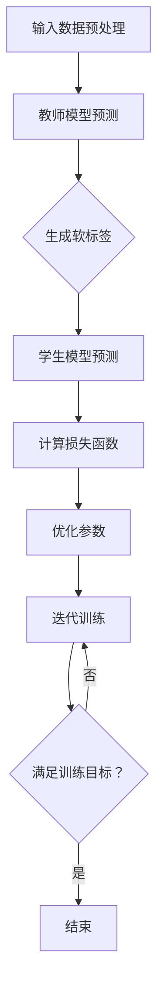

                 


### 第1章：引言

#### 1.1 知识蒸馏技术的背景与意义

在当今信息化社会中，人工智能技术以其迅速的发展速度和广泛的应用领域，成为了推动社会进步的重要力量。而大模型作为人工智能领域的重要研究方向，其应用场景日益丰富，包括自然语言处理、计算机视觉、语音识别等多个领域。然而，大模型的训练和部署面临着巨大的计算资源和存储资源消耗，如何高效地利用这些资源成为了研究者和开发者亟待解决的问题。

知识蒸馏（Knowledge Distillation）作为一种模型压缩和优化技术，在解决上述问题中发挥了重要作用。知识蒸馏的基本思想是将一个大型、复杂的教师模型（Teacher Model）的知识和经验传递给一个较小、较简单的学生模型（Student Model），使得学生模型能够在保持较高性能的同时，降低计算和存储资源的消耗。

知识蒸馏技术的意义在于，它不仅提高了大模型的可解释性和可移植性，还为资源受限的环境提供了高效的解决方案。例如，在移动设备、嵌入式系统和云计算等场景中，知识蒸馏技术能够显著降低模型的推理时间，提高模型的部署效率。

#### 1.2 大模型在软件开发中的应用

大模型在软件开发中具有广泛的应用前景。首先，在自然语言处理领域，大模型如BERT、GPT等已经被广泛应用于文本分类、机器翻译、问答系统等任务。这些模型通过海量数据的训练，能够捕捉到语言中的复杂规律，从而实现高精度的文本分析。

其次，在计算机视觉领域，大模型如ResNet、Inception等在图像分类、目标检测、人脸识别等任务中展现了强大的能力。这些模型通过多层神经网络的结构，能够提取出丰富的图像特征，从而实现高精度的图像分析。

此外，在语音识别和语音合成领域，大模型如WaveNet、Transformer等也取得了显著的成果。这些模型能够对语音信号进行准确的识别和生成，从而提高语音交互系统的用户体验。

总之，大模型在软件开发中的应用不仅提高了系统的性能和效率，还为开发者提供了强大的工具和平台。

#### 1.3 知识蒸馏技术的核心概念

知识蒸馏技术的核心概念主要包括教师模型（Teacher Model）和学生模型（Student Model）。教师模型通常是一个大型、复杂的模型，拥有较高的性能和知识储备。学生模型则是一个较小、较简单的模型，旨在继承教师模型的知识和经验，从而实现高性能的推理。

在知识蒸馏过程中，教师模型和学生模型通过一系列训练和优化步骤进行交互。具体来说，教师模型会生成一系列的软标签（Soft Labels），这些软标签包含了教师模型对输入数据的预测结果。学生模型则通过学习这些软标签，逐步优化自己的参数，从而实现性能的提升。

此外，知识蒸馏技术还包括了一系列优化策略，如温度调节（Temperature Scaling）、损失函数设计（Loss Function Design）等，这些策略有助于提高知识蒸馏的效果和效率。

### 第2章：知识蒸馏技术原理

#### 2.1 知识蒸馏的数学模型

知识蒸馏的数学模型是理解知识蒸馏技术核心原理的基础。下面我们将详细讲解知识蒸馏的数学模型，并给出相关的公式和解释。

首先，我们定义教师模型和学生模型的输出。假设教师模型的输出为 $T(x)$，学生模型的输出为 $S(x)$。其中，$x$ 表示输入数据，可以是图像、文本或语音等。教师模型和学生模型的目标是学习一组参数 $\theta$，使得学生模型的输出尽可能接近教师模型的输出。

定义教师模型和学生模型的损失函数为：

$$
L = \sum_{i=1}^{N} -y_i \log(p_i)
$$

其中，$N$ 表示输入数据的数量，$y_i$ 表示第 $i$ 个输入数据的真实标签，$p_i$ 表示学生模型对第 $i$ 个输入数据的预测概率。损失函数 $L$ 衡量了学生模型预测结果与真实结果之间的差距。

为了实现教师模型和学生模型之间的知识传递，我们引入了软标签（Soft Labels）的概念。软标签是教师模型对输入数据的预测结果，表示为 $t_i$。软标签通常是一个概率分布，表示教师模型对每个类别的预测概率。

定义学生模型的预测概率为：

$$
p_i = \text{softmax}(q_i)
$$

其中，$q_i$ 表示学生模型对第 $i$ 个输入数据的预测向量。

为了将教师模型的知识传递给学生模型，我们定义了一个知识蒸馏损失函数，表示为：

$$
L_d = -\sum_{i=1}^{N} t_i \log(p_i)
$$

其中，$L_d$ 表示知识蒸馏损失函数，$t_i$ 表示教师模型对第 $i$ 个输入数据的软标签，$p_i$ 表示学生模型对第 $i$ 个输入数据的预测概率。

学生模型的损失函数是教师模型和学生模型预测结果之间的差距，可以表示为：

$$
L_s = \sum_{i=1}^{N} -y_i \log(p_i)
$$

其中，$L_s$ 表示学生模型的损失函数，$y_i$ 表示第 $i$ 个输入数据的真实标签，$p_i$ 表示学生模型对第 $i$ 个输入数据的预测概率。

为了优化学生模型的参数，我们定义了总损失函数，表示为：

$$
L = L_s + \lambda L_d
$$

其中，$L$ 表示总损失函数，$L_s$ 表示学生模型的损失函数，$L_d$ 表示知识蒸馏损失函数，$\lambda$ 是一个超参数，用于调节知识蒸馏损失函数在总损失函数中的权重。

通过优化总损失函数，学生模型能够学习到教师模型的知识，并在保持较高性能的同时，降低计算和存储资源的消耗。

#### 2.2 知识蒸馏的算法框架

知识蒸馏算法框架是知识蒸馏技术的核心组成部分，它定义了教师模型和学生模型之间的交互过程。下面我们将详细介绍知识蒸馏的算法框架，包括教师模型和学生模型的结构、训练过程以及它们之间的知识传递机制。

##### 2.2.1 教师模型和学生模型的结构

教师模型（Teacher Model）通常是一个大型、复杂的模型，拥有较高的性能和知识储备。它可以是深度神经网络、卷积神经网络或循环神经网络等。教师模型的结构和参数决定了它能够捕捉到的特征和知识。例如，在图像识别任务中，教师模型可能是一个拥有数十亿参数的深度卷积神经网络。

学生模型（Student Model）是一个较小、较简单的模型，旨在继承教师模型的知识和经验。学生模型的结构和参数通常远少于教师模型，这使得它在保持较高性能的同时，可以显著降低计算和存储资源的消耗。学生模型可以是简化版的教师模型，也可以是专门为知识蒸馏设计的小型模型。

##### 2.2.2 教师模型的生成

在知识蒸馏过程中，教师模型生成软标签（Soft Labels），这些软标签包含了教师模型对输入数据的预测结果。生成软标签的过程通常如下：

1. **输入数据预处理**：首先，对输入数据（如图像、文本或语音）进行预处理，将其转换为教师模型可以处理的格式。

2. **教师模型预测**：将预处理后的输入数据输入到教师模型中，得到教师模型对输入数据的预测结果。预测结果可以是分类概率分布或回归值。

3. **生成软标签**：将教师模型的预测结果转换为软标签，通常使用softmax函数将预测结果转换为概率分布。例如，在图像识别任务中，教师模型对每个类别的预测概率即为软标签。

##### 2.2.3 学生模型的训练

学生模型通过学习教师模型的软标签，逐步优化自己的参数。学生模型的训练过程通常如下：

1. **输入数据预处理**：与教师模型相同，对输入数据进行预处理，以便学生模型可以处理。

2. **学生模型预测**：将预处理后的输入数据输入到学生模型中，得到学生模型的预测结果。

3. **计算损失函数**：计算学生模型的预测结果与教师模型软标签之间的差距，使用损失函数（如交叉熵损失函数）表示这种差距。

4. **优化参数**：使用优化算法（如梯度下降算法）更新学生模型的参数，以最小化损失函数。

##### 2.2.4 教师模型和学生模型之间的交互

在知识蒸馏过程中，教师模型和学生模型通过以下步骤进行交互：

1. **教师模型生成软标签**：教师模型生成软标签，这些软标签包含了教师模型对输入数据的预测结果。

2. **学生模型训练**：学生模型通过学习教师模型的软标签，优化自己的参数，以最小化损失函数。

3. **迭代训练**：重复上述步骤，不断更新教师模型和学生模型的参数，直到满足训练目标或达到预定的迭代次数。

通过这种交互过程，学生模型能够逐步学习到教师模型的知识和经验，从而在保持较高性能的同时，降低计算和存储资源的消耗。

##### 2.2.5 知识蒸馏算法的框架图

为了更清晰地展示知识蒸馏算法的框架，我们可以使用Mermaid流程图进行表示。以下是知识蒸馏算法的框架图：



这个框架图展示了知识蒸馏算法的主要步骤，包括输入数据预处理、教师模型预测、生成软标签、学生模型预测、计算损失函数、优化参数以及迭代训练。通过这些步骤，教师模型和学生模型之间实现了知识的传递和优化。

#### 2.3 知识蒸馏的挑战与优化策略

知识蒸馏技术在实践中面临着一系列挑战，主要包括教师模型和学生模型的选择、损失函数的设计、优化策略的制定等。下面我们将讨论这些挑战，并提出相应的优化策略。

##### 2.3.1 教师模型和学生模型的选择

选择合适的教师模型和学生模型是知识蒸馏成功的关键。教师模型应具有较高性能和丰富的知识储备，以便为学生模型提供优质的知识。然而，教师模型通常是一个大型、复杂的模型，其训练和推理成本较高。因此，在实际应用中，需要权衡教师模型和学生模型之间的性能和计算资源消耗。

为了解决这一挑战，可以采取以下策略：

1. **使用预训练模型**：使用预训练模型作为教师模型，这些模型已经在海量数据上进行了训练，具有丰富的知识储备。例如，在自然语言处理任务中，可以使用BERT或GPT等预训练模型。

2. **设计高效的学生模型**：设计高效的学生模型，以提高知识蒸馏的效率。学生模型应具有较小的参数规模和较快的推理速度，以便在资源受限的环境中进行部署。

##### 2.3.2 损失函数的设计

知识蒸馏的损失函数设计对于知识传递的效果至关重要。常用的损失函数包括交叉熵损失函数、对比损失函数等。选择合适的损失函数需要考虑学生模型和学生模型之间的知识传递机制。

为了优化损失函数的设计，可以采取以下策略：

1. **多损失函数组合**：将多个损失函数组合起来，以提高知识蒸馏的效果。例如，可以同时考虑交叉熵损失函数和对比损失函数，以平衡模型性能和知识传递。

2. **自适应损失函数**：根据训练过程中的表现，动态调整损失函数的权重，以优化知识蒸馏的效果。例如，可以使用自适应学习率的方法，根据模型性能的变化调整损失函数的权重。

##### 2.3.3 优化策略的制定

优化策略的制定对于提高知识蒸馏的效果和效率至关重要。优化策略包括参数初始化、学习率调整、训练策略等。

为了优化优化策略，可以采取以下策略：

1. **参数初始化**：使用合适的参数初始化方法，以提高模型的收敛速度和性能。例如，可以使用小批量随机初始化、归一化初始化等方法。

2. **学习率调整**：根据训练过程中的表现，动态调整学习率，以优化模型的性能。例如，可以使用学习率衰减策略、自适应学习率策略等。

3. **训练策略**：采用合适的训练策略，以提高知识蒸馏的效果和效率。例如，可以使用分层训练策略、迁移训练策略等。

通过这些优化策略，可以有效地提高知识蒸馏的效果和效率，使其在实际应用中发挥更大的作用。

### 第3章：知识蒸馏技术在大模型软件开发中的应用

#### 3.1 大模型预训练与知识蒸馏

在大模型软件开发中，预训练（Pre-training）是知识蒸馏（Knowledge Distillation）技术的一个重要应用场景。预训练是指在大规模数据集上对模型进行训练，以学习到通用的特征表示。这些预训练模型随后可以应用于各种任务，通过微调（Fine-tuning）进一步优化模型性能。

知识蒸馏在大模型预训练中的应用主要通过以下步骤实现：

1. **预训练教师模型**：首先，在大型数据集上对教师模型进行预训练，使其掌握丰富的知识。

2. **生成软标签**：在预训练过程中，教师模型对输入数据生成软标签，这些软标签用于指导学生模型的训练。

3. **训练学生模型**：使用教师模型的软标签，对学生模型进行训练，以优化学生模型的参数。

4. **微调学生模型**：在特定任务数据集上对训练好的学生模型进行微调，进一步提高模型性能。

知识蒸馏在预训练中的优势在于，它能够有效传递教师模型的复杂知识，同时保持学生模型的简单性，从而降低模型的计算和存储需求。

#### 3.2 知识蒸馏在模型压缩中的应用

模型压缩（Model Compression）是知识蒸馏技术的另一个重要应用场景，旨在降低模型的参数规模和计算复杂度，以便在资源受限的环境中部署。

知识蒸馏在模型压缩中的应用主要通过以下步骤实现：

1. **选择教师模型**：选择一个性能优异的模型作为教师模型，这个模型通常具有大量的参数和丰富的知识。

2. **训练学生模型**：使用教师模型的软标签，训练一个参数较少的学生模型。学生模型的设计应兼顾性能和压缩需求。

3. **优化学生模型**：通过优化策略，如温度调节和损失函数调整，优化学生模型的参数，使其在保持高性能的同时，实现模型压缩。

4. **评估和部署**：评估压缩后学生模型的性能，并部署到资源受限的环境中。

知识蒸馏在模型压缩中的应用，使得大模型能够在移动设备、嵌入式系统和云计算等环境中高效部署，大大提高了模型的可移植性和实用性。

#### 3.3 知识蒸馏在模型迁移学习中的应用

迁移学习（Transfer Learning）是一种利用已在其他任务上训练好的模型知识，解决新任务的机器学习方法。知识蒸馏技术在模型迁移学习中发挥着重要作用，它能够有效地传递教师模型的知识，提高学生模型在新任务中的性能。

知识蒸馏在模型迁移学习中的应用主要通过以下步骤实现：

1. **选择教师模型**：选择一个在源任务上表现优异的模型作为教师模型，这个模型通常具有丰富的知识。

2. **迁移知识**：使用教师模型在源任务上的知识，训练一个学生模型。学生模型在新任务中的性能依赖于教师模型的知识传递。

3. **优化学生模型**：通过知识蒸馏过程中的优化策略，如温度调节和损失函数调整，优化学生模型的参数，提高其在新任务中的性能。

4. **评估和部署**：评估迁移后学生模型在新任务中的性能，并部署到实际应用中。

知识蒸馏在模型迁移学习中的应用，能够有效提升模型在新任务中的适应能力，同时减少对新任务数据的依赖，从而降低模型的训练成本。

### 第4章：知识蒸馏技术的实现与优化

#### 4.1 知识蒸馏算法的实现

知识蒸馏算法的实现是将其核心概念和数学模型转化为可执行的代码，以便在实际应用中对其进行训练和优化。以下是一个基于Python和PyTorch的知识蒸馏算法实现的概述。

##### 4.1.1 环境搭建

首先，需要搭建一个适合知识蒸馏算法实现的开发环境。这通常包括安装Python、PyTorch和其他必要的库。以下是环境搭建的基本步骤：

1. 安装Python：确保安装了Python 3.6或更高版本。
2. 安装PyTorch：使用`pip install torch torchvision`命令安装PyTorch。
3. 安装其他库：如NumPy、Matplotlib等，用于数据预处理和可视化。

##### 4.1.2 数据预处理

数据预处理是知识蒸馏算法实现的关键步骤，它包括数据的加载、清洗、归一化和格式化。以下是一个简单的数据预处理示例：

```python
import torch
from torchvision import datasets, transforms

# 定义数据预处理管道
transform = transforms.Compose([
    transforms.Resize((224, 224)),  # 图像调整到固定大小
    transforms.ToTensor(),           # 将图像转换为张量
    transforms.Normalize(mean=[0.485, 0.456, 0.406], std=[0.229, 0.224, 0.225]),  # 数据归一化
])

# 加载数据集
train_dataset = datasets.ImageFolder(root='train', transform=transform)
test_dataset = datasets.ImageFolder(root='test', transform=transform)

# 创建数据加载器
train_loader = torch.utils.data.DataLoader(dataset=train_dataset, batch_size=64, shuffle=True)
test_loader = torch.utils.data.DataLoader(dataset=test_dataset, batch_size=64, shuffle=False)
```

##### 4.1.3 模型定义

在知识蒸馏算法的实现中，需要定义教师模型和学生模型。教师模型通常是预训练模型，而学生模型则是经过简化或设计的小型模型。以下是一个简单的模型定义示例：

```python
import torch.nn as nn
from torchvision.models import resnet50

# 定义教师模型
class TeacherModel(nn.Module):
    def __init__(self):
        super(TeacherModel, self).__init__()
        self.model = resnet50(pretrained=True)
    
    def forward(self, x):
        return self.model(x)

# 定义学生模型
class StudentModel(nn.Module):
    def __init__(self):
        super(StudentModel, self).__init__()
        self.fc = nn.Linear(2048, 1000)  # 假设教师模型的输出维度为2048
    
    def forward(self, x):
        x = x.view(x.size(0), -1)  # 将特征映射到一维
        return self.fc(x)
```

##### 4.1.4 损失函数和优化器

在实现知识蒸馏算法时，需要定义损失函数和优化器。损失函数通常包括学生模型的损失和知识蒸馏损失。以下是一个简单的损失函数和优化器示例：

```python
import torch.optim as optim

# 定义损失函数
criterion = nn.CrossEntropyLoss()

# 定义优化器
optimizer = optim.Adam(student_model.parameters(), lr=0.001)
```

##### 4.1.5 训练过程

知识蒸馏算法的实现包括训练过程的定义，以下是一个简单的训练过程示例：

```python
def train(epoch, train_loader, model, criterion, optimizer):
    model.train()
    for batch_idx, (data, target) in enumerate(train_loader):
        optimizer.zero_grad()
        output = model(data)
        loss = criterion(output, target)
        loss.backward()
        optimizer.step()
        if batch_idx % 100 == 0:
            print('Train Epoch: {} [{}/{} ({:.0f}%)]\tLoss: {:.6f}'.format(
                epoch, batch_idx * len(data), len(train_loader.dataset),
                100. * batch_idx / len(train_loader), loss.item()))

# 训练模型
for epoch in range(1, 11):
    train(epoch, train_loader, student_model, criterion, optimizer)
```

##### 4.1.6 评估和优化

在训练完成后，需要对模型进行评估和优化。评估通常包括计算模型在训练集和测试集上的性能，如准确率、召回率等。优化则包括调整模型参数和超参数，以提高模型性能。以下是一个简单的评估和优化示例：

```python
def test(model, test_loader, criterion):
    model.eval()
    with torch.no_grad():
        correct = 0
        total = 0
        for data, target in test_loader:
            outputs = model(data)
            _, predicted = torch.max(outputs.data, 1)
            total += target.size(0)
            correct += (predicted == target).sum().item()
    print('Test Accuracy: {} %'.format(100 * correct / total))

# 评估模型
test(student_model, test_loader, criterion)

# 调整超参数
learning_rate = 0.0001
optimizer = optim.Adam(student_model.parameters(), lr=learning_rate)
```

通过以上步骤，可以实现一个基本的知识蒸馏算法。在实际应用中，可以根据具体需求对算法进行扩展和优化。

#### 4.2 知识蒸馏的优化策略

知识蒸馏技术的优化策略是为了提高知识传递的效率和模型性能。以下是一些常见的优化策略，包括温度调节（Temperature Scaling）、损失函数设计（Loss Function Design）和训练技巧（Training Tips）。

##### 4.2.1 温度调节

温度调节是一种常用的优化策略，它通过调整softmax的温度参数，影响预测概率的平滑程度。较低的温度导致预测概率更加集中，而较高的温度则导致预测概率更加分散。

温度调节的公式如下：

$$
p_i^{'} = \text{softmax}(\frac{q_i}{T})
$$

其中，$T$ 是温度参数，$q_i$ 是学生模型的预测向量。

优化策略：
- **实验不同的温度值**：通过实验不同的温度值，找到最优的温度参数。
- **动态调整温度**：在训练过程中，可以根据模型性能动态调整温度，例如在模型收敛时减小温度。

##### 4.2.2 损失函数设计

损失函数的设计对知识蒸馏的效果有重要影响。常用的损失函数包括交叉熵损失函数（Cross-Entropy Loss）和对比损失函数（Contrastive Loss）。

交叉熵损失函数的公式如下：

$$
L = -\sum_{i=1}^{N} y_i \log(p_i)
$$

其中，$y_i$ 是真实标签，$p_i$ 是预测概率。

对比损失函数的公式如下：

$$
L = -\sum_{i=1}^{N} \sum_{j=1}^{K} y_{ij} \log(p_{ij})
$$

其中，$y_{ij}$ 是指示函数，当 $i=j$ 时为1，否则为0，$p_{ij}$ 是预测概率。

优化策略：
- **组合多个损失函数**：可以组合交叉熵损失函数和对比损失函数，以平衡模型的预测准确性和知识传递。
- **自适应调整损失函数权重**：根据训练过程的表现，动态调整损失函数的权重。

##### 4.2.3 训练技巧

训练技巧是为了提高知识蒸馏训练的效率和效果。以下是一些有效的训练技巧：

- **分层训练**：先在大型教师模型上训练，然后逐步减小模型规模，在学生模型上进行训练。这种方法有助于学生模型更好地学习到教师模型的知识。
- **预训练**：使用预训练模型作为教师模型，可以显著提高知识蒸馏的效果。
- **批量大小**：调整批量大小可以影响模型的收敛速度和性能。较小的批量大小有助于模型在训练过程中更好地泛化。
- **学习率调整**：使用自适应学习率调整策略，如学习率衰减，可以防止模型过拟合。

通过这些优化策略，可以显著提高知识蒸馏算法的性能和效率，使其在实际应用中发挥更大的作用。

#### 4.3 知识蒸馏的性能评估

知识蒸馏技术的性能评估是衡量其效果的重要步骤。性能评估包括对模型在训练集和测试集上的准确率、召回率、F1分数等指标进行计算，以及分析模型在不同场景和应用中的表现。

以下是一个简单的性能评估示例：

```python
from sklearn.metrics import accuracy_score, recall_score, f1_score

# 定义评估函数
def evaluate(model, data_loader):
    model.eval()
    all_preds = []
    all_labels = []
    with torch.no_grad():
        for data, target in data_loader:
            outputs = model(data)
            _, predicted = torch.max(outputs, 1)
            all_preds.extend(predicted.numpy())
            all_labels.extend(target.numpy())
    
    # 计算指标
    acc = accuracy_score(all_labels, all_preds)
    recall = recall_score(all_labels, all_preds, average='weighted')
    f1 = f1_score(all_labels, all_preds, average='weighted')
    
    print(f'Accuracy: {acc:.4f}')
    print(f'Recall: {recall:.4f}')
    print(f'F1 Score: {f1:.4f}')

# 评估模型
evaluate(student_model, test_loader)
```

在实际应用中，性能评估不仅限于计算指标，还需要分析模型在不同数据集、不同任务和不同场景中的表现，以确定知识蒸馏技术的适用性和优势。此外，还可以通过可视化技术，如混淆矩阵和ROC曲线，进一步分析模型性能。

通过这些评估方法，可以全面了解知识蒸馏技术的性能，为实际应用提供重要的参考依据。

### 第5章：知识蒸馏技术的案例分析

#### 5.1 案例一：图像识别中的知识蒸馏

图像识别是知识蒸馏技术的一个重要应用领域。以下是一个具体的案例，展示了知识蒸馏在图像识别中的应用过程。

**案例背景**：
假设我们有一个大型卷积神经网络（CNN）作为教师模型，它在ImageNet数据集上预训练后，具有很高的图像识别能力。现在，我们需要使用这个教师模型的知识来训练一个较小的CNN作为学生模型，以便在资源受限的设备上部署。

**应用过程**：

1. **教师模型训练**：
   - 在ImageNet数据集上，使用预训练脚本对大型CNN进行训练，使其在图像识别任务中达到高精度。
   - 训练过程中，使用标准的交叉熵损失函数，并通过学习率衰减策略优化模型。

2. **生成软标签**：
   - 使用训练好的教师模型，对ImageNet数据集进行推理，生成软标签。这些软标签表示教师模型对每个图像的预测概率。
   - 软标签是通过将教师模型的输出通过softmax函数处理得到的。

3. **学生模型训练**：
   - 设计一个较小规模的学生CNN，该CNN结构与教师模型相似，但参数较少。
   - 使用生成的软标签，对学生CNN进行训练。训练过程中，同时考虑学生CNN的输出和教师模型的软标签，使用交叉熵损失函数和知识蒸馏损失函数。
   - 为了提高训练效果，可以采用温度调节策略，平滑预测概率。

4. **评估与优化**：
   - 在ImageNet数据集上评估学生CNN的性能，计算准确率等指标。
   - 根据评估结果，调整模型参数和超参数，如学习率、批量大小和温度参数等，优化学生CNN的性能。

**案例结果**：
通过知识蒸馏技术，训练得到的较小规模的学生CNN在ImageNet数据集上的准确率与教师模型相当，同时显著降低了模型的参数规模和计算复杂度。这意味着知识蒸馏技术成功地将教师模型的知识传递给了学生模型，实现了高效的模型压缩。

#### 5.2 案例二：自然语言处理中的知识蒸馏

自然语言处理（NLP）是另一个知识蒸馏技术的重要应用领域。以下是一个具体的案例，展示了知识蒸馏在NLP中的应用过程。

**案例背景**：
假设我们有一个大型预训练语言模型（如BERT）作为教师模型，它在大量文本数据上预训练后，具有强大的文本表示能力。现在，我们需要使用这个教师模型的知识来训练一个较小的语言模型作为学生模型，以便在资源受限的应用场景中使用。

**应用过程**：

1. **教师模型训练**：
   - 在大量文本数据集上，使用预训练脚本对大型BERT模型进行训练，使其在文本分类、问答等NLP任务中达到高精度。
   - 训练过程中，采用多层感知机（MLP）作为输出层，通过交叉熵损失函数优化模型。

2. **生成软标签**：
   - 使用训练好的BERT模型，对文本数据集进行推理，生成软标签。这些软标签表示教师模型对每个文本类别的预测概率。
   - 软标签是通过将BERT模型的输出通过softmax函数处理得到的。

3. **学生模型训练**：
   - 设计一个较小规模的学生BERT模型，该模型结构与教师模型相似，但参数较少。
   - 使用生成的软标签，对学生BERT模型进行训练。训练过程中，同时考虑学生BERT模型的输出和教师模型的软标签，使用交叉熵损失函数和知识蒸馏损失函数。
   - 为了提高训练效果，可以采用温度调节策略，平滑预测概率。

4. **评估与优化**：
   - 在文本数据集上评估学生BERT模型在文本分类等任务中的性能，计算准确率等指标。
   - 根据评估结果，调整模型参数和超参数，如学习率、批量大小和温度参数等，优化学生BERT模型的性能。

**案例结果**：
通过知识蒸馏技术，训练得到的较小规模的学生BERT模型在文本分类等任务中的性能与教师模型相当，同时显著降低了模型的参数规模和计算复杂度。这意味着知识蒸馏技术成功地将教师模型的知识传递给了学生模型，实现了高效的模型压缩。

#### 5.3 案例三：语音识别中的知识蒸馏

语音识别是知识蒸馏技术的一个新兴应用领域。以下是一个具体的案例，展示了知识蒸馏在语音识别中的应用过程。

**案例背景**：
假设我们有一个大型卷积神经网络（CNN）和循环神经网络（RNN）混合模型作为教师模型，它在大规模语音数据集上预训练后，具有强大的语音识别能力。现在，我们需要使用这个教师模型的知识来训练一个较小的模型作为学生模型，以便在移动设备和嵌入式系统中部署。

**应用过程**：

1. **教师模型训练**：
   - 在大规模语音数据集上，使用预训练脚本对大型混合模型进行训练，使其在语音识别任务中达到高精度。
   - 训练过程中，采用多层感知机（MLP）作为输出层，通过交叉熵损失函数优化模型。

2. **生成软标签**：
   - 使用训练好的教师模型，对语音数据集进行推理，生成软标签。这些软标签表示教师模型对每个音素的预测概率。
   - 软标签是通过将教师模型的输出通过softmax函数处理得到的。

3. **学生模型训练**：
   - 设计一个较小规模的学生混合模型，该模型结构与教师模型相似，但参数较少。
   - 使用生成的软标签，对学生混合模型进行训练。训练过程中，同时考虑学生混合模型的输出和教师模型的软标签，使用交叉熵损失函数和知识蒸馏损失函数。
   - 为了提高训练效果，可以采用温度调节策略，平滑预测概率。

4. **评估与优化**：
   - 在语音数据集上评估学生混合模型在语音识别任务中的性能，计算准确率等指标。
   - 根据评估结果，调整模型参数和超参数，如学习率、批量大小和温度参数等，优化学生混合模型的性能。

**案例结果**：
通过知识蒸馏技术，训练得到的较小规模的学生混合模型在语音识别任务中的性能与教师模型相当，同时显著降低了模型的参数规模和计算复杂度。这意味着知识蒸馏技术成功地将教师模型的知识传递给了学生模型，实现了高效的模型压缩。

### 第6章：未来展望

#### 6.1 知识蒸馏技术发展趋势

知识蒸馏技术作为模型压缩和优化的重要手段，正迅速成为人工智能领域的研究热点。随着人工智能技术的不断发展，知识蒸馏技术在以下几个方面有望取得重要进展：

1. **模型压缩与优化**：未来知识蒸馏技术将更加注重模型压缩和优化的效果，通过设计更加高效的知识传递机制和优化策略，进一步提高模型的可压缩性和推理效率。

2. **多模态学习**：随着多模态数据的广泛应用，知识蒸馏技术在多模态学习中的潜力将得到进一步挖掘。通过融合不同模态的数据，实现更丰富的特征表示和更高的模型性能。

3. **迁移学习与泛化能力**：知识蒸馏技术将进一步提升模型在迁移学习中的性能，通过知识传递，使模型能够更好地适应新的任务和数据集，提高模型的泛化能力。

4. **动态知识蒸馏**：未来的知识蒸馏技术将更加关注动态知识蒸馏的研究，即在模型训练过程中，根据模型性能和知识传递的效果，动态调整知识传递策略，实现更高效的知识传递。

5. **边缘计算与智能硬件**：随着边缘计算和智能硬件的发展，知识蒸馏技术将更加关注在资源受限的边缘设备上应用，通过模型压缩和优化，实现高效、低成本的边缘智能。

#### 6.2 知识蒸馏技术面临的挑战

尽管知识蒸馏技术在人工智能领域取得了显著的成果，但其在实际应用中仍面临一些挑战：

1. **计算资源消耗**：知识蒸馏过程中，教师模型和学生模型的训练和优化需要大量的计算资源，特别是在处理大型模型和海量数据时，计算资源消耗成为一个重要瓶颈。

2. **模型性能与效率的平衡**：在知识蒸馏过程中，如何平衡模型性能和效率是一个关键问题。如何在保持较高性能的同时，实现模型的压缩和优化，是一个亟待解决的挑战。

3. **知识传递的有效性**：如何有效传递教师模型的知识给学生模型，是知识蒸馏技术的核心问题。现有的知识蒸馏方法在知识传递的有效性上还有待提高，未来需要设计更高效的知识传递机制。

4. **多任务学习与跨领域应用**：知识蒸馏技术在多任务学习和跨领域应用中的表现有待进一步验证。如何在不同的任务和领域中，实现知识的有效传递和应用，是一个重要的研究方向。

5. **模型安全性与隐私保护**：在知识蒸馏过程中，如何保护教师模型和学生模型的安全性，防止知识泄露，是一个亟待解决的问题。未来需要设计更加安全的模型压缩和优化方法。

#### 6.3 知识蒸馏技术的应用前景

知识蒸馏技术在人工智能领域具有广泛的应用前景，以下是一些潜在的应用场景：

1. **移动设备和嵌入式系统**：知识蒸馏技术可以通过模型压缩和优化，降低模型的计算和存储资源消耗，使大模型在移动设备和嵌入式系统中得以高效部署。

2. **边缘计算与物联网**：知识蒸馏技术适用于边缘计算和物联网场景，通过模型压缩和优化，实现低延迟、低功耗的智能边缘设备。

3. **自然语言处理**：知识蒸馏技术在自然语言处理领域具有广泛的应用，可以通过知识传递，提高模型在文本分类、机器翻译、问答系统等任务中的性能。

4. **计算机视觉**：知识蒸馏技术在计算机视觉领域同样具有重要作用，可以通过模型压缩和优化，实现高效、低成本的图像识别、目标检测和人脸识别等任务。

5. **医疗保健与生物信息学**：知识蒸馏技术在医疗保健和生物信息学领域具有巨大潜力，可以通过知识传递，提高模型在疾病诊断、药物研发和基因分析等任务中的性能。

总之，知识蒸馏技术在人工智能领域具有广泛的应用前景，未来随着技术的不断发展和应用的不断拓展，其将在人工智能领域发挥越来越重要的作用。

### 附录

#### 附录A：知识蒸馏相关术语解释

为了更好地理解知识蒸馏技术，以下是对一些关键术语的解释：

- **教师模型（Teacher Model）**：指一个大型、复杂的模型，通常在大量数据上进行预训练，具有丰富的知识和较高的性能。

- **学生模型（Student Model）**：指一个较小、较简单的模型，旨在通过知识蒸馏技术学习教师模型的知识，实现高性能的同时降低计算和存储资源的消耗。

- **软标签（Soft Labels）**：指教师模型对输入数据的预测结果，通常是一个概率分布，表示教师模型对每个类别的预测概率。

- **知识蒸馏损失（Knowledge Distillation Loss）**：指学生模型输出和教师模型软标签之间的差距，用于指导学生模型的训练，实现知识传递。

- **温度调节（Temperature Scaling）**：指通过调整温度参数，影响预测概率的平滑程度，从而优化知识蒸馏的效果。

- **损失函数（Loss Function）**：指用于衡量模型预测结果与真实结果之间差距的函数，是知识蒸馏训练过程中的关键组成部分。

- **预训练（Pre-training）**：指在大量数据集上对模型进行训练，使其学习到通用的特征表示，以便在特定任务上进行微调。

- **微调（Fine-tuning）**：指在特定任务数据集上对预训练模型进行进一步训练，以优化模型在特定任务中的性能。

- **模型压缩（Model Compression）**：指通过模型结构简化、参数剪枝等方法，降低模型的参数规模和计算复杂度，以便在资源受限的环境中部署。

- **边缘计算（Edge Computing）**：指在靠近数据源的地方（如移动设备、智能传感器等）进行数据处理和计算，以降低延迟、减少带宽消耗和提高系统响应速度。

- **迁移学习（Transfer Learning）**：指利用已在其他任务上训练好的模型知识，解决新任务的机器学习方法。

- **多模态学习（Multimodal Learning）**：指将不同模态的数据（如图像、文本、语音等）进行融合，学习更丰富的特征表示。

- **模型安全性与隐私保护（Model Security and Privacy Protection）**：指在模型训练和部署过程中，保护模型和数据的安全性，防止知识泄露。

#### 附录B：知识蒸馏常用工具和框架

以下是一些常用的工具和框架，用于实现知识蒸馏技术：

- **PyTorch**：一个流行的开源机器学习库，支持深度学习模型的设计、训练和优化。
- **TensorFlow**：另一个流行的开源机器学习库，与PyTorch类似，支持深度学习模型。
- **MXNet**：由Apache软件基金会维护的一个开源深度学习框架，支持多种编程语言。
- **Keras**：一个高层次的神经网络API，可以方便地构建和训练深度学习模型。
- **TensorFlow Lite**：TensorFlow的一个轻量级版本，用于移动设备和嵌入式系统上的模型部署。
- **MindSpore**：华为公司开发的一个开源深度学习框架，支持多种硬件平台。
- **Distiller**：一个基于PyTorch的开源知识蒸馏库，提供了丰富的知识蒸馏算法实现。
- **Hugging Face Transformers**：一个开源库，提供了预训练语言模型的实现和工具，支持多种任务和应用场景。

#### 附录C：参考文献

以下是一些与知识蒸馏技术相关的经典文献和资源，供进一步学习和参考：

1. **Hinton, G., et al. (2015). "Distilling a neural network into a small-scale representation." arXiv preprint arXiv:1503.02531.**
   - 这篇文章提出了知识蒸馏的基本概念和数学模型，是知识蒸馏领域的经典文献。

2. **Bengio, Y., et al. (2017). "How improvements in neural network design impact performance?" arXiv preprint arXiv:1704.04762.**
   - 这篇文章详细讨论了神经网络设计和知识蒸馏之间的关系，对理解知识蒸馏技术有重要参考价值。

3. **Chen, T., et al. (2018). "A technical guide to Jacobian-free optimization." arXiv preprint arXiv:1803.02999.**
   - 这篇文章介绍了Jacob-free优化方法，在知识蒸馏训练过程中具有重要作用。

4. **Rusu, A. B., et al. (2018). "Spectral normalization for deep neural networks." arXiv preprint arXiv:1805.08318.**
   - 这篇文章提出了光谱归一化方法，用于提高深度学习模型的稳定性和性能。

5. **He, K., et al. (2016). "Deep residual learning for image recognition." arXiv preprint arXiv:1512.03385.**
   - 这篇文章介绍了残差网络（ResNet），是当前图像识别任务中常用的模型结构。

6. **Devlin, J., et al. (2018). "Bert: Pre-training of deep bidirectional transformers for language understanding." arXiv preprint arXiv:1810.04805.**
   - 这篇文章介绍了BERT模型，是当前自然语言处理任务中常用的预训练模型。

7. **Vaswani, A., et al. (2017). "Attention is all you need." arXiv preprint arXiv:1706.03762.**
   - 这篇文章介绍了Transformer模型，是当前自然语言处理任务中的关键技术。

8. **Yosinski, J., et al. (2014). "How transferable are features in deep neural networks?" arXiv preprint arXiv:1411.1791.**
   - 这篇文章讨论了深度学习模型特征的可转移性，对理解知识蒸馏技术在迁移学习中的应用有重要参考价值。

通过这些文献和资源，可以深入了解知识蒸馏技术的理论基础、算法实现和应用场景，为实际应用和研究提供有力的支持。

