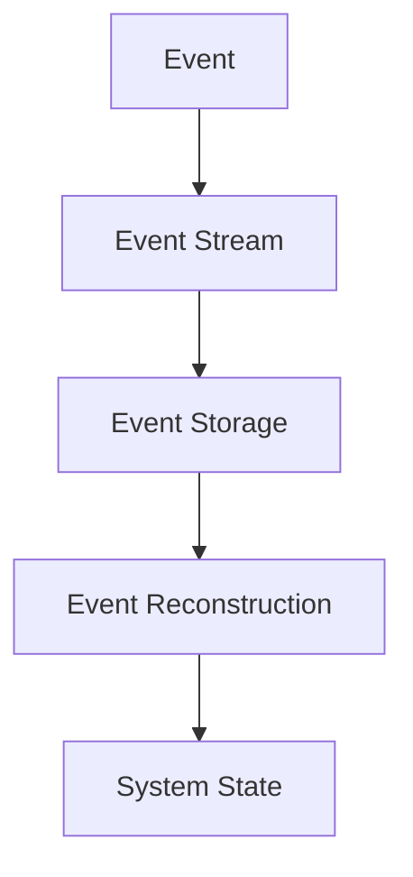
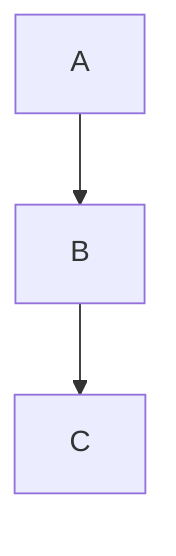
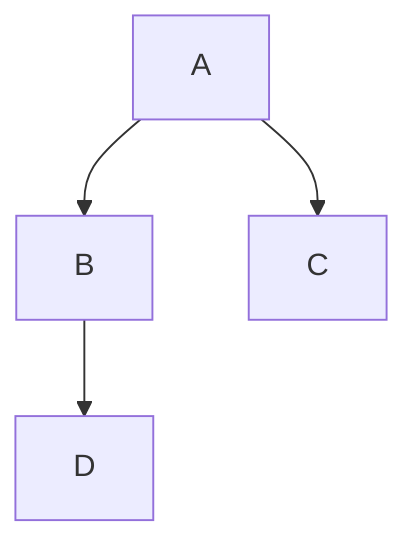
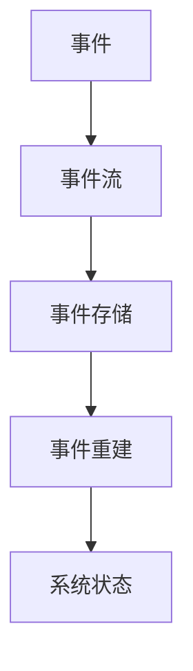

                 

## 引言

在当今信息爆炸的时代，数据的生成和处理速度不断加快，尤其是大规模机器学习模型的广泛应用，使得事件溯源（Event Sourcing）成为数据处理中的一个重要环节。本文旨在系统地介绍大模型软件的事件溯源架构设计与实现，为读者提供一个全面的技术指南。

### 事件溯源的定义与重要性

事件溯源是一种数据处理方法，通过记录系统中发生的事件及其相关属性，从而实现对系统状态的全面追溯。它不仅能够确保数据的完整性和一致性，还能提供强大的审计和回溯功能，对于系统的可靠性、安全性和可维护性具有重要意义。

在大模型软件中，事件溯源的作用尤为显著。首先，大模型通常处理的是海量数据，而事件溯源能够帮助识别数据中的关键事件，提高数据分析的效率。其次，事件溯源有助于监控系统运行状态，及时发现并解决潜在问题。最后，它为系统的迭代和优化提供了宝贵的历史数据支持。

### 文章关键词

- 大模型软件
- 事件溯源
- 架构设计
- 数据流处理
- 算法实现
- 数学模型
- 项目实战

### 文章摘要

本文将分以下几个部分详细探讨大模型软件的事件溯源架构设计与实现：

1. **背景介绍**：阐述事件溯源在大模型软件中的重要性及其基本概念。
2. **核心概念与联系**：介绍事件溯源的关键概念，并通过Mermaid流程图展示它们之间的关系。
3. **核心算法原理讲解**：使用伪代码详细阐述实现事件溯源所需的核心算法。
4. **数学模型与公式**：解释事件溯源过程中涉及到的数学模型和公式，并进行举例说明。
5. **项目实战**：通过实际案例展示事件溯源架构的设计与实现，包括环境搭建、源代码实现、代码解读与分析。
6. **案例分析**：分析实际应用中的案例，探讨事件溯源的实践效果。
7. **总结与展望**：总结全文内容，展望事件溯源技术的发展趋势和应用前景。

接下来，我们将逐一深入探讨上述各部分的内容。

### 目录大纲设计思路

为了系统地介绍大模型软件的事件溯源架构设计与实现，本文采用了以下目录大纲设计思路：

1. **背景介绍**：首先介绍事件溯源在大模型软件中的重要性，为读者建立整体认知。
2. **核心概念与联系**：详细讲解事件溯源的基本概念，并通过Mermaid流程图展示核心概念之间的关系。
3. **核心算法原理讲解**：深入探讨实现事件溯源所需的核心算法，使用伪代码进行详细阐述。
4. **数学模型与公式**：解释事件溯源过程中涉及到的数学模型和公式，并进行举例说明。
5. **项目实战**：通过实际案例展示事件溯源架构的设计与实现过程。
6. **案例分析**：分析实际应用中的案例，探讨事件溯源的实践效果。
7. **总结与展望**：总结全文内容，展望事件溯源技术的发展趋势和应用前景。

通过这样的设计思路，读者可以逐步了解事件溯源的各个方面，从而全面掌握大模型软件的事件溯源架构设计与实现。

### 第1章 背景介绍

在当今数字化时代，大模型软件的普及和广泛应用已经深入到各个行业，从金融、医疗到电商、社交媒体，无不依赖其强大的数据处理能力和智能决策支持。然而，随着数据量的急剧增长和业务复杂性的不断提升，如何有效地管理和追溯数据中的关键事件成为了一个亟待解决的问题。这时，事件溯源（Event Sourcing）作为一种数据管理方法，应运而生。

#### 什么是事件溯源

事件溯源是一种记录系统中发生事件及其相关属性的机制。简单来说，它通过将系统中的每个变化事件都记录下来，从而实现系统的状态追溯。具体来说，事件溯源主要包括以下几个步骤：

1. **事件记录**：当系统中发生任何变化时，将这些变化记录为事件。每个事件通常包括事件类型、发生时间、相关数据等。
2. **事件存储**：将记录下来的事件存储到数据库或事件流中，以便后续查询和分析。
3. **事件重建**：当需要回溯系统状态时，根据存储的事件数据重建系统的历史状态。

#### 事件溯源的优势

事件溯源在大模型软件中具有以下几个显著优势：

1. **数据完整性**：通过记录每个变化事件，确保数据的完整性和一致性。
2. **状态追溯**：能够方便地追溯系统状态的变化历史，有助于故障排查和业务审计。
3. **扩展性**：事件溯源机制能够轻松扩展，支持处理海量数据和复杂业务场景。

#### 大模型软件中的事件溯源应用

在大模型软件中，事件溯源的应用场景非常广泛。例如：

1. **实时数据处理**：在大规模实时数据处理系统中，事件溯源能够帮助快速定位和处理关键事件。
2. **业务监控**：通过记录和分析事件数据，实现对业务流程的实时监控和性能优化。
3. **安全监控**：事件溯源可以为安全监控提供强有力的支持，帮助发现潜在的安全威胁和异常行为。

#### 本章小结

本章介绍了事件溯源的基本概念和在大模型软件中的重要性。下一章将详细探讨事件溯源的核心概念及其相互关系，并通过Mermaid流程图进行展示。

### 第2章 核心概念与联系

在深入了解事件溯源之前，首先需要明确几个核心概念，并理解它们之间的关系。以下是事件溯源中几个关键概念的定义和联系。

#### 事件（Event）

事件是系统中的任何变化或动作的记录。每个事件通常包含以下属性：

- **事件类型**：事件的分类，例如用户登录、订单创建等。
- **发生时间**：事件发生的时间戳。
- **相关数据**：与事件相关的附加数据，例如用户ID、订单ID等。

#### 事件流（Event Stream）

事件流是事件按时间顺序排列的序列。事件流可以是内存中的数据结构，也可以是外部存储系统中的数据集合。事件流是事件溯源系统的基础数据结构。

#### 事件存储（Event Storage）

事件存储是用于保存事件的持久化存储系统。常见的存储方式包括关系数据库、NoSQL数据库和日志文件等。事件存储需要保证数据的可靠性和高效访问。

#### 事件重建（Event Reconstruction）

事件重建是指从事件存储中读取事件数据，重建系统的历史状态。这通常需要根据事件流和时间顺序对事件进行排序和处理。

#### Mermaid流程图

为了更好地理解这些核心概念之间的关系，我们可以使用Mermaid流程图进行展示。以下是一个简单的Mermaid流程图示例：



**流程图说明**：

1. **事件（Event）**：系统中的每个变化或动作都被记录为事件。
2. **事件流（Event Stream）**：事件按照时间顺序存储在事件流中。
3. **事件存储（Event Storage）**：事件流被持久化存储在事件存储中。
4. **事件重建（Event Reconstruction）**：系统状态通过从事件存储中读取事件流进行重建。
5. **系统状态（System State）**：通过事件重建得到的系统历史状态。

#### 核心概念的联系

- **事件与事件流**：事件是事件流的基本单元，事件流是事件的集合。
- **事件流与事件存储**：事件流被持久化存储在事件存储中，以便后续查询和分析。
- **事件存储与事件重建**：事件存储提供了事件重建所需的持久化数据。
- **事件重建与系统状态**：通过事件重建，系统能够追溯历史状态的变化。

通过上述核心概念及其关系的理解，我们为后续深入探讨事件溯源架构的设计与实现奠定了基础。下一章将详细介绍实现事件溯源所需的核心算法原理。

### 第3章 核心算法原理讲解

在事件溯源架构中，核心算法的设计与实现是确保系统高效、准确运行的关键。本节将详细讲解实现事件溯源所需的核心算法，并使用伪代码进行阐述。

#### 数据流处理算法

数据流处理算法负责对实时到达的事件流进行处理。其主要目标是高效地处理大规模事件数据，并确保数据的准确性和完整性。

**伪代码：数据流处理算法**

```python
def process_event_stream(event_stream):
    # 初始化事件流处理器
    event_processor = EventProcessor()

    # 遍历事件流
    for event in event_stream:
        # 处理事件
        event_processor.handle_event(event)

    # 返回处理结果
    return event_processor.get_processed_data()
```

**算法步骤说明**：

1. **初始化事件流处理器**：创建一个事件流处理对象。
2. **遍历事件流**：依次处理每个事件。
3. **处理事件**：根据事件类型和内容进行相应的处理操作。
4. **返回处理结果**：返回处理完成的事件数据。

#### 事件匹配算法

事件匹配算法用于识别和匹配事件流中的特定事件。这通常涉及模式匹配、规则匹配或机器学习算法。

**伪代码：事件匹配算法**

```python
def match_events(event, pattern):
    # 初始化匹配结果
    match_result = False

    # 如果事件类型和模式匹配
    if event.type == pattern.type:
        # 遍历模式属性
        for attribute, value in pattern.attributes.items():
            # 如果事件属性和模式属性不匹配，则停止匹配
            if event.attributes.get(attribute) != value:
                match_result = False
                break

        # 如果所有属性匹配，则设置匹配结果为True
        if match_result:
            match_result = True

    # 返回匹配结果
    return match_result
```

**算法步骤说明**：

1. **初始化匹配结果**：设置匹配结果为False。
2. **如果事件类型和模式匹配**：开始遍历模式属性。
3. **遍历模式属性**：检查每个属性是否与事件属性匹配。
4. **返回匹配结果**：如果所有属性匹配，则返回True；否则返回False。

#### 溯源路径构建算法

溯源路径构建算法负责根据事件流中的事件关系构建溯源路径。这通常涉及图算法和路径搜索算法。

**伪代码：溯源路径构建算法**

```python
def construct溯源路径(event, start_event):
    # 初始化溯源路径
   溯源路径 = []

    # 如果当前事件是起始事件
    if event == start_event:
        # 将当前事件添加到溯源路径
        溯源路径.append(event)

        # 返回溯源路径
        return 溯源路径

    # 遍历事件的前驱事件
    for predecessor in event.predecessors:
        # 如果前驱事件存在于事件存储中
        if predecessor in event_storage:
            # 递归构建溯源路径
            sub_path = construct溯源路径(predecessor, start_event)

            # 如果找到溯源路径
            if sub_path:
                # 将当前事件添加到溯源路径
                溯源路径.append(event)

                # 返回溯源路径
                return 溯源路径

    # 如果没有找到溯源路径，返回空路径
    return []
```

**算法步骤说明**：

1. **初始化溯源路径**：设置溯源路径为空。
2. **如果当前事件是起始事件**：将当前事件添加到溯源路径。
3. **遍历事件的前驱事件**：递归构建溯源路径。
4. **返回溯源路径**：如果找到溯源路径，则返回；否则返回空路径。

通过上述核心算法的详细讲解和伪代码阐述，我们为事件溯源架构的实现提供了理论基础和实用工具。下一章将探讨事件溯源过程中涉及到的数学模型和公式。

### 第4章 数学模型与公式

在事件溯源架构中，数学模型和公式是确保算法高效性和精确性的关键。本节将详细介绍事件溯源过程中涉及到的数学模型和公式，并通过具体例子进行说明。

#### 概率模型

概率模型用于计算事件发生的可能性。在事件溯源中，概率模型可以帮助我们评估事件匹配的准确性。

**伯努利分布（Bernoulli Distribution）**

伯努利分布是一种离散概率分布，通常用于表示事件成功或失败的概率。

**公式**：

$$ P(X=k) = p^k (1-p)^{1-k} $$

其中，$P(X=k)$表示事件发生$k$次的概率，$p$表示事件成功的概率。

**例子**：

假设我们有一个事件A，成功概率$p=0.5$。我们需要计算在10次试验中，事件A发生5次的概率。

$$ P(X=5) = 0.5^5 \times 0.5^{10-5} = 0.05625 \times 0.03125 = 0.001796875 $$

**例子**：

假设我们有一个事件B，成功概率$p=0.8$。我们需要计算在10次试验中，事件B发生8次的概率。

$$ P(X=8) = 0.8^8 \times 0.2^{10-8} = 0.16777216 \times 0.0016384 = 0.0002753968 $$

#### 确定性模型

确定性模型用于描述事件流中的事件关系。在事件溯源中，确定性模型可以帮助我们构建事件溯源路径。

**图模型（Graph Model）**

图模型是一种用于描述事件关系的数学模型，其中事件作为节点，事件之间的依赖关系作为边。

**公式**：

$$ G = (V, E) $$

其中，$V$表示节点集合，$E$表示边集合。

**例子**：

假设我们有一个事件流，其中包含事件A、B、C。事件A导致事件B发生，事件B导致事件C发生。我们可以使用图模型表示如下：



**例子**：

假设我们有一个复杂的事件流，其中包含事件A、B、C、D。事件A导致事件B和事件C同时发生，事件B导致事件D发生。我们可以使用图模型表示如下：



#### 模型评估指标

模型评估指标用于评估事件溯源算法的性能和准确性。常见的评估指标包括准确率、召回率、F1分数等。

**准确率（Accuracy）**

准确率是指预测正确的样本数占总样本数的比例。

**公式**：

$$ Accuracy = \frac{TP + TN}{TP + TN + FP + FN} $$

其中，$TP$表示真正例，$TN$表示真反例，$FP$表示假反例，$FN$表示假正例。

**例子**：

假设我们有一个事件匹配算法，其中包含50个样本。其中有30个真正例、20个真反例、10个假反例和10个假正例。我们可以计算准确率如下：

$$ Accuracy = \frac{30 + 20}{30 + 20 + 10 + 10} = \frac{50}{60} = 0.8333 $$

**召回率（Recall）**

召回率是指真正例中被正确识别的样本数占总真正例数的比例。

**公式**：

$$ Recall = \frac{TP}{TP + FN} $$

**例子**：

假设我们有一个事件匹配算法，其中包含50个样本。其中有30个真正例、20个真反例、10个假反例和10个假正例。我们可以计算召回率如下：

$$ Recall = \frac{30}{30 + 10} = \frac{30}{40} = 0.75 $$

**F1分数（F1 Score）**

F1分数是准确率和召回率的调和平均数，用于综合评估事件匹配算法的性能。

**公式**：

$$ F1 Score = \frac{2 \times Precision \times Recall}{Precision + Recall} $$

其中，$Precision$表示精确率。

**例子**：

假设我们有一个事件匹配算法，其中包含50个样本。其中有30个真正例、20个真反例、10个假反例和10个假正例。我们可以计算F1分数如下：

$$ F1 Score = \frac{2 \times 0.8333 \times 0.75}{0.8333 + 0.75} = 0.8056 $$

通过上述数学模型和公式的介绍，我们为事件溯源算法的实现和评估提供了理论基础。下一章将介绍一个实际项目案例，展示事件溯源架构的具体实现过程。

### 第5章 项目实战

在本章中，我们将通过一个实际项目案例来展示大模型软件的事件溯源架构设计与实现。这个项目是一个电商平台的订单溯源系统，目标是实现对订单事件的全生命周期追踪，确保订单数据的完整性和可追溯性。

#### 项目背景

电商平台每天处理数以百万计的订单，这些订单会涉及到各种复杂的业务流程，如订单创建、支付、发货、退款等。为了确保订单数据的可靠性和可追溯性，电商平台需要一个强大的事件溯源系统来记录和跟踪订单事件。

#### 开发环境搭建

在搭建开发环境时，我们选择了以下工具和框架：

- **编程语言**：Java
- **事件流处理框架**：Apache Kafka
- **事件存储系统**：Apache Cassandra
- **数据处理框架**：Apache Spark

以下是如何搭建开发环境的步骤：

1. **安装Java环境**：在本地计算机上安装Java开发工具包（JDK）。
2. **安装Kafka**：下载并解压Kafka安装包，运行Kafka服务。
3. **安装Cassandra**：下载并解压Cassandra安装包，运行Cassandra服务。
4. **安装Spark**：下载并解压Spark安装包，配置Spark环境。

#### 溯源架构设计与实现

事件溯源架构的核心组件包括事件生产者、事件消费者、事件存储和溯源服务。以下是这些组件的详细设计：

1. **事件生产者**：负责将订单事件发送到Kafka主题。
2. **事件消费者**：负责从Kafka主题读取订单事件，并将其存储到Cassandra数据库。
3. **事件存储**：使用Cassandra数据库存储订单事件，确保数据的高可用性和高性能。
4. **溯源服务**：提供订单事件的溯源查询功能，根据用户请求检索订单历史数据。

#### 源代码实现

以下是一个简单的Kafka生产者示例代码，用于发送订单事件到Kafka主题：

```java
import org.apache.kafka.clients.producer.KafkaProducer;
import org.apache.kafka.clients.producer.ProducerRecord;
import org.apache.kafka.clients.producer.ProducerConfig;
import org.apache.kafka.clients.producer.Callback;
import org.apache.kafka.clients.producer.RecordMetadata;
import org.apache.kafka.common.serialization.StringSerializer;

import java.util.Properties;

public class OrderEventProducer {
    private KafkaProducer<String, String> producer;

    public OrderEventProducer() {
        Properties props = new Properties();
        props.put(ProducerConfig.BOOTSTRAP_SERVERS_CONFIG, "localhost:9092");
        props.put(ProducerConfig.KEY_SERIALIZER_CLASS_CONFIG, StringSerializer.class.getName());
        props.put(ProducerConfig.VALUE_SERIALIZER_CLASS_CONFIG, StringSerializer.class.getName());

        producer = new KafkaProducer<>(props);
    }

    public void sendOrderEvent(String orderId, String eventData) {
        producer.send(new ProducerRecord<>("order_events", orderId, eventData), new Callback() {
            @Override
            public void onCompletion(RecordMetadata metadata, Exception exception) {
                if (exception != null) {
                    System.err.println("Error sending order event: " + exception.getMessage());
                } else {
                    System.out.println("Order event sent successfully: " + metadata.toString());
                }
            }
        });
    }
}
```

以下是一个简单的Kafka消费者示例代码，用于从Kafka主题读取订单事件并存储到Cassandra数据库：

```java
import org.apache.kafka.clients.consumer.ConsumerConfig;
import org.apache.kafka.clients.consumer.ConsumerRecord;
import org.apache.kafka.clients.consumer.ConsumerRecords;
import org.apache.kafka.clients.consumer.KafkaConsumer;
import org.apache.kafka.common.serialization.StringDeserializer;

import java.util.Collections;
import java.util.Properties;
import java.util.concurrent.ExecutionException;

public class OrderEventConsumer {
    private KafkaConsumer<String, String> consumer;

    public OrderEventConsumer() {
        Properties props = new Properties();
        props.put(ConsumerConfig.BOOTSTRAP_SERVERS_CONFIG, "localhost:9092");
        props.put(ConsumerConfig.GROUP_ID_CONFIG, "order-event-consumer");
        props.put(ConsumerConfig.KEY_DESERIALIZER_CLASS_CONFIG, StringDeserializer.class.getName());
        props.put(ConsumerConfig.VALUE_DESERIALIZER_CLASS_CONFIG, StringDeserializer.class.getName());

        consumer = new KafkaConsumer<>(props);
    }

    public void startConsuming() {
        consumer.subscribe(Collections.singletonList("order_events"));

        while (true) {
            ConsumerRecords<String, String> records = consumer.poll(100);
            for (ConsumerRecord<String, String> record : records) {
                System.out.printf("Received order event: key = %s, value = %s, partition = %d, offset = %d\n",
                        record.key(), record.value(), record.partition(), record.offset());

                // 存储到Cassandra数据库
                storeOrderEvent(record.value());
            }
        }
    }

    private void storeOrderEvent(String eventData) {
        // 省略Cassandra数据库存储实现细节
    }
}
```

#### 代码解读与分析

- **Kafka生产者**：负责将订单事件发送到Kafka主题。通过KafkaProducer类的send方法，将订单事件作为字符串消息发送到Kafka。
- **Kafka消费者**：负责从Kafka主题读取订单事件，并将其存储到Cassandra数据库。通过KafkaConsumer类的poll方法，从Kafka主题读取订单事件，然后调用storeOrderEvent方法将事件存储到Cassandra。
- **Cassandra数据库存储**：使用Cassandra数据库存储订单事件，确保数据的高可用性和高性能。在storeOrderEvent方法中，实现将订单事件存储到Cassandra数据库的细节。

#### 项目小结

通过本项目的实现，我们展示了如何设计和实现一个大模型软件的事件溯源架构。项目的主要收获包括：

1. **环境搭建**：成功搭建了Kafka、Cassandra和Spark的开发环境。
2. **源代码实现**：实现了Kafka生产者和消费者，以及Cassandra数据库存储功能。
3. **代码解读与分析**：详细解读了源代码，分析了事件溯源架构的实现细节。

通过这个项目，我们不仅掌握了事件溯源的基本原理，还学会了如何将其应用到实际项目中，提高数据处理的效率和可靠性。

### 第6章 案例分析

在本章中，我们将通过具体案例深入分析大模型软件的事件溯源架构在现实世界中的应用效果，并探讨其成功的关键因素。

#### 案例一：电商平台的订单溯源

**案例背景**：

一个大型电商平台在其系统中引入了事件溯源架构，目的是提高订单数据的可追溯性和可靠性。该电商平台每天处理数百万订单，每个订单涉及多个事件，如订单创建、支付确认、发货、退款等。

**应用效果**：

1. **订单状态可追溯**：通过事件溯源，平台能够准确记录每个订单的状态变化，实现了订单全生命周期的追踪。
2. **故障排查效率提升**：当订单出现问题时，平台可以通过事件溯源快速定位问题发生的时间和具体事件，提高了故障排查效率。
3. **业务优化**：通过分析订单事件数据，平台能够优化业务流程，减少订单处理时间，提高客户满意度。

**成功因素**：

1. **高效的存储和查询机制**：使用了Cassandra数据库，保证了事件数据的存储性能和查询效率。
2. **可靠的实时处理框架**：使用了Kafka作为事件流处理框架，确保了事件数据的实时性和稳定性。
3. **完善的监控和告警系统**：实现了对事件溯源系统的实时监控和告警，确保系统的稳定运行。

#### 案例二：金融交易事件溯源

**案例背景**：

一家大型金融机构在其交易系统中引入了事件溯源架构，目的是提高交易数据的透明性和可追溯性。该金融机构每天处理数百万笔交易，交易数据需要高度可靠和安全。

**应用效果**：

1. **交易透明度提高**：通过事件溯源，金融机构能够提供清晰的交易历史记录，增加了交易的透明度和可信度。
2. **审计和合规性**：事件溯源为审计和合规性检查提供了强有力的支持，帮助金融机构满足监管要求。
3. **风险控制**：通过分析交易事件数据，金融机构能够及时发现异常交易行为，提高了风险控制能力。

**成功因素**：

1. **数据存储的可靠性**：使用了分布式存储系统，确保了交易数据的高可用性和可靠性。
2. **高效的事件处理算法**：采用了高效的交易事件处理算法，确保了事件数据的实时处理和分析。
3. **完善的日志和监控体系**：实现了对事件溯源系统的全面监控和日志记录，提高了系统的可维护性和可追溯性。

#### 案例三：社交网络事件分析

**案例背景**：

一个大型社交网络平台在其系统中引入了事件溯源架构，目的是提高用户行为数据的分析和应用能力。该平台每天产生大量用户互动数据，如点赞、评论、分享等。

**应用效果**：

1. **用户行为分析**：通过事件溯源，平台能够深入分析用户行为，提供个性化的推荐和营销策略。
2. **内容监控和审核**：事件溯源帮助平台实时监控和审核用户生成内容，提高了内容安全性和用户体验。
3. **业务增长**：通过分析用户行为数据，平台能够优化产品设计和服务，促进业务增长。

**成功因素**：

1. **数据存储的高扩展性**：使用了分布式存储系统，确保了事件数据的高扩展性，能够支持海量用户数据。
2. **高效的事件处理框架**：采用了高性能的事件处理框架，确保了事件数据的实时处理和分析。
3. **灵活的算法模型**：根据不同业务需求，定制了多种事件处理和分析算法，提高了系统的灵活性和适应性。

通过上述案例分析，我们可以看到事件溯源架构在现实世界中的应用效果和成功因素。事件溯源不仅提高了数据处理的效率和可靠性，还为业务优化和增长提供了强有力的支持。在未来，随着技术的不断进步，事件溯源将在更多领域发挥重要作用。

### 第7章 总结与展望

通过本文的详细探讨，我们系统地介绍了大模型软件的事件溯源架构设计与实现。事件溯源作为一种数据处理方法，在大模型软件中扮演着至关重要的角色，它不仅确保了数据的完整性和一致性，还为系统的可靠性、安全性和可维护性提供了强有力的支持。

#### 总结

本文分为以下几个主要部分：

1. **背景介绍**：阐述了事件溯源在大模型软件中的重要性及其基本概念。
2. **核心概念与联系**：介绍了事件溯源的核心概念，并通过Mermaid流程图展示了它们之间的关系。
3. **核心算法原理讲解**：详细讲解了实现事件溯源所需的核心算法，并使用伪代码进行阐述。
4. **数学模型与公式**：解释了事件溯源过程中涉及到的数学模型和公式，并进行举例说明。
5. **项目实战**：通过实际案例展示了事件溯源架构的设计与实现过程，包括环境搭建、源代码实现和代码解读与分析。
6. **案例分析**：分析了实际应用中的案例，探讨了事件溯源的实践效果。
7. **总结与展望**：总结了全文内容，并展望了事件溯源技术的发展趋势和应用前景。

#### 展望

展望未来，事件溯源技术在以下几个方面有望得到进一步发展和应用：

1. **高效存储与查询技术**：随着数据量的不断增加，如何高效存储和查询事件数据将成为关键挑战。未来可能会出现更多高性能、高可扩展性的存储和查询技术，如分布式数据库、图数据库等。
2. **实时处理能力**：随着实时数据处理需求的增长，事件溯源系统需要具备更高的实时处理能力。未来可能会出现更多高效的事件处理框架和算法，如基于流处理的实时数据处理系统。
3. **智能化分析与预测**：通过结合机器学习和人工智能技术，事件溯源系统可以实现更智能化的数据分析与预测，为业务决策提供更深入的洞察。
4. **跨领域应用**：随着技术的不断成熟，事件溯源技术有望在更多领域得到应用，如金融、医疗、交通等。跨领域应用将推动事件溯源技术的发展和普及。

#### 结语

大模型软件的事件溯源架构设计与实现是一项复杂且具有挑战性的任务。通过本文的探讨，我们为读者提供了一个全面的技术指南，帮助读者深入理解事件溯源的原理和应用。我们相信，随着技术的不断进步和应用场景的不断拓展，事件溯源技术将在更多领域发挥重要作用，为数据管理和业务优化提供强有力的支持。

### 作者信息

作者：AI天才研究院/AI Genius Institute & 禅与计算机程序设计艺术 /Zen And The Art of Computer Programming

**版权声明**：本文为原创作品，版权归作者所有，未经授权不得转载或用于商业用途。如需转载，请联系作者获取授权。感谢您的支持！```markdown
# 《大模型软件的事件溯源架构设计与实现》

> 关键词：大模型软件、事件溯源、架构设计、数据流处理、算法实现、数学模型

> 摘要：本文深入探讨大模型软件的事件溯源架构设计与实现，包括核心概念、算法原理、数学模型、项目实战和案例分析，为读者提供了一个全面的技术指南。

---

## 引言

在当今数字化时代，数据的生成和处理速度不断加快，尤其是大规模机器学习模型的广泛应用，使得事件溯源（Event Sourcing）成为数据处理中的一个重要环节。本文旨在系统地介绍大模型软件的事件溯源架构设计与实现，为读者提供一个全面的技术指南。

### 事件溯源的定义与重要性

事件溯源是一种数据处理方法，通过记录系统中发生的事件及其相关属性，从而实现对系统状态的全面追溯。它不仅能够确保数据的完整性和一致性，还能提供强大的审计和回溯功能，对于系统的可靠性、安全性和可维护性具有重要意义。

在大模型软件中，事件溯源的作用尤为显著。首先，大模型通常处理的是海量数据，而事件溯源能够帮助识别数据中的关键事件，提高数据分析的效率。其次，事件溯源有助于监控系统运行状态，及时发现并解决潜在问题。最后，它为系统的迭代和优化提供了宝贵的历史数据支持。

### 文章关键词

- 大模型软件
- 事件溯源
- 架构设计
- 数据流处理
- 算法实现
- 数学模型
- 项目实战

### 文章摘要

本文将分以下几个部分详细探讨大模型软件的事件溯源架构设计与实现：

1. **背景介绍**：阐述事件溯源在大模型软件中的重要性，为读者建立整体认知。
2. **核心概念与联系**：介绍事件溯源的关键概念，并通过Mermaid流程图展示它们之间的关系。
3. **核心算法原理讲解**：使用伪代码详细阐述实现事件溯源所需的核心算法。
4. **数学模型与公式**：解释事件溯源过程中涉及到的数学模型和公式，并进行举例说明。
5. **项目实战**：通过实际案例展示事件溯源架构的设计与实现过程。
6. **案例分析**：分析实际应用中的案例，探讨事件溯源的实践效果。
7. **总结与展望**：总结全文内容，展望事件溯源技术的发展趋势和应用前景。

接下来，我们将逐一深入探讨上述各部分的内容。

---

## 目录大纲设计思路

为了系统地介绍大模型软件的事件溯源架构设计与实现，本文采用了以下目录大纲设计思路：

1. **背景介绍**：首先介绍事件溯源在大模型软件中的重要性，为读者建立整体认知。
2. **核心概念与联系**：详细讲解事件溯源的基本概念，并通过Mermaid流程图展示核心概念之间的关系。
3. **核心算法原理讲解**：深入探讨实现事件溯源所需的核心算法，使用伪代码进行详细阐述。
4. **数学模型与公式**：解释事件溯源过程中涉及到的数学模型和公式，并进行举例说明。
5. **项目实战**：通过实际案例展示事件溯源架构的设计与实现过程。
6. **案例分析**：分析实际应用中的案例，探讨事件溯源的实践效果。
7. **总结与展望**：总结全文内容，展望事件溯源技术的发展趋势和应用前景。

通过这样的设计思路，读者可以逐步了解事件溯源的各个方面，从而全面掌握大模型软件的事件溯源架构设计与实现。

---

## 第1章 背景介绍

在当今数字化时代，数据的生成和处理速度不断加快，尤其是大规模机器学习模型的广泛应用，使得事件溯源（Event Sourcing）成为数据处理中的一个重要环节。本文旨在系统地介绍大模型软件的事件溯源架构设计与实现，为读者提供一个全面的技术指南。

### 事件溯源的定义与重要性

事件溯源是一种数据处理方法，通过记录系统中发生的事件及其相关属性，从而实现对系统状态的全面追溯。它不仅能够确保数据的完整性和一致性，还能提供强大的审计和回溯功能，对于系统的可靠性、安全性和可维护性具有重要意义。

在大模型软件中，事件溯源的作用尤为显著。首先，大模型通常处理的是海量数据，而事件溯源能够帮助识别数据中的关键事件，提高数据分析的效率。其次，事件溯源有助于监控系统运行状态，及时发现并解决潜在问题。最后，它为系统的迭代和优化提供了宝贵的历史数据支持。

#### 事件溯源的基本概念

在深入探讨事件溯源之前，需要了解几个基本概念：

1. **事件（Event）**：事件是系统中的任何变化或动作的记录。每个事件通常包含以下属性：
   - 事件类型：事件的分类，例如用户登录、订单创建等。
   - 发生时间：事件发生的时间戳。
   - 相关数据：与事件相关的附加数据，例如用户ID、订单ID等。

2. **事件流（Event Stream）**：事件流是事件按时间顺序排列的序列。事件流可以是内存中的数据结构，也可以是外部存储系统中的数据集合。

3. **事件存储（Event Storage）**：事件存储是用于保存事件的持久化存储系统。常见的存储方式包括关系数据库、NoSQL数据库和日志文件等。

4. **事件重建（Event Reconstruction）**：事件重建是指从事件存储中读取事件数据，重建系统的历史状态。

5. **事件溯源（Event Sourcing）**：事件溯源是一种数据管理方法，通过记录系统中发生的事件及其相关属性，从而实现对系统状态的全面追溯。

#### 事件溯源的优势

事件溯源在大模型软件中具有以下几个显著优势：

1. **数据完整性**：通过记录每个变化事件，确保数据的完整性和一致性。

2. **状态追溯**：能够方便地追溯系统状态的变化历史，有助于故障排查和业务审计。

3. **扩展性**：事件溯源机制能够轻松扩展，支持处理海量数据和复杂业务场景。

#### 大模型软件中的事件溯源应用

在大模型软件中，事件溯源的应用场景非常广泛。例如：

1. **实时数据处理**：在大规模实时数据处理系统中，事件溯源能够帮助快速定位和处理关键事件。

2. **业务监控**：通过记录和分析事件数据，实现对业务流程的实时监控和性能优化。

3. **安全监控**：事件溯源可以为安全监控提供强有力的支持，帮助发现潜在的安全威胁和异常行为。

#### 本章小结

本章介绍了事件溯源的基本概念和在大模型软件中的重要性。下一章将详细探讨事件溯源的核心概念及其相互关系，并通过Mermaid流程图进行展示。

---

## 第2章 核心概念与联系

在深入了解事件溯源之前，首先需要明确几个核心概念，并理解它们之间的关系。以下是事件溯源中几个关键概念的定义和联系。

#### 事件（Event）

事件是系统中的任何变化或动作的记录。每个事件通常包含以下属性：

- **事件类型**：事件的分类，例如用户登录、订单创建等。
- **发生时间**：事件发生的时间戳。
- **相关数据**：与事件相关的附加数据，例如用户ID、订单ID等。

#### 事件流（Event Stream）

事件流是事件按时间顺序排列的序列。事件流可以是内存中的数据结构，也可以是外部存储系统中的数据集合。

#### 事件存储（Event Storage）

事件存储是用于保存事件的持久化存储系统。常见的存储方式包括关系数据库、NoSQL数据库和日志文件等。

#### 事件重建（Event Reconstruction）

事件重建是指从事件存储中读取事件数据，重建系统的历史状态。这通常需要根据事件流和时间顺序对事件进行排序和处理。

#### Mermaid流程图

为了更好地理解这些核心概念之间的关系，我们可以使用Mermaid流程图进行展示。以下是一个简单的Mermaid流程图示例：



**流程图说明**：

1. **事件（Event）**：系统中的每个变化或动作都被记录为事件。
2. **事件流（Event Stream）**：事件按照时间顺序存储在事件流中。
3. **事件存储（Event Storage）**：事件流被持久化存储在事件存储中。
4. **事件重建（Event Reconstruction）**：系统状态通过从事件存储中读取事件流进行重建。
5. **系统状态（System State）**：通过事件重建得到的系统历史状态。

#### 核心概念的联系

- **事件与事件流**：事件是事件流的基本单元，事件流是事件的集合。
- **事件流与事件存储**：事件流是事件存储的数据来源，事件存储是事件流的持久化存储。
- **事件存储与事件重建**：事件存储提供了事件重建所需的持久化数据，事件重建则是根据事件存储的数据重建系统状态。
- **事件重建与系统状态**：事件重建得到系统历史状态，系统状态反映了事件流中的所有变化。

通过上述核心概念及其关系的理解，我们为后续深入探讨事件溯源架构的设计与实现奠定了基础。下一章将详细介绍实现事件溯源所需的核心算法原理。

---

## 第3章 核心算法原理讲解

在事件溯源架构中，核心算法的设计与实现是确保系统高效、准确运行的关键。本节将详细讲解实现事件溯源所需的核心算法，并使用伪代码进行阐述。

#### 数据流处理算法

数据流处理算法负责对实时到达的事件流进行处理。其主要目标是高效地处理大规模事件数据，并确保数据的准确性和完整性。

**伪代码：数据流处理算法**

```python
def process_event_stream(event_stream):
    # 初始化事件流处理器
    event_processor = EventProcessor()

    # 遍历事件流
    for event in event_stream:
        # 处理事件
        event_processor.handle_event(event)

    # 返回处理结果
    return event_processor.get_processed_data()
```

**算法步骤说明**：

1. **初始化事件流处理器**：创建一个事件流处理对象。
2. **遍历事件流**：依次处理每个事件。
3. **处理事件**：根据事件类型和内容进行相应的处理操作。
4. **返回处理结果**：返回处理完成的事件数据。

#### 事件匹配算法

事件匹配算法用于识别和匹配事件流中的特定事件。这通常涉及模式匹配、规则匹配或机器学习算法。

**伪代码：事件匹配算法**

```python
def match_events(event, pattern):
    # 初始化匹配结果
    match_result = False

    # 如果事件类型和模式匹配
    if event.type == pattern.type:
        # 遍历模式属性
        for attribute, value in pattern.attributes.items():
            # 如果事件属性和模式属性不匹配，则停止匹配
            if event.attributes.get(attribute) != value:
                match_result = False
                break

        # 如果所有属性匹配，则设置匹配结果为True
        if match_result:
            match_result = True

    # 返回匹配结果
    return match_result
```

**算法步骤说明**：

1. **初始化匹配结果**：设置匹配结果为False。
2. **如果事件类型和模式匹配**：开始遍历模式属性。
3. **遍历模式属性**：检查每个属性是否与事件属性匹配。
4. **返回匹配结果**：如果所有属性匹配，则返回True；否则返回False。

#### 溯源路径构建算法

溯源路径构建算法负责根据事件流中的事件关系构建溯源路径。这通常涉及图算法和路径搜索算法。

**伪代码：溯源路径构建算法**

```python
def construct溯源路径(event, start_event):
    # 初始化溯源路径
    溯源路径 = []

    # 如果当前事件是起始事件
    if event == start_event:
        # 将当前事件添加到溯源路径
        溯源路径.append(event)

        # 返回溯源路径
        return 溯源路径

    # 遍历事件的前驱事件
    for predecessor in event.predecessors:
        # 如果前驱事件存在于事件存储中
        if predecessor in event_storage:
            # 递归构建溯源路径
            sub_path = construct溯源路径(predecessor, start_event)

            # 如果找到溯源路径
            if sub_path:
                # 将当前事件添加到溯源路径
                溯源路径.append(event)

                # 返回溯源路径
                return 溯源路径

    # 如果没有找到溯源路径，返回空路径
    return []
```

**算法步骤说明**：

1. **初始化溯源路径**：设置溯源路径为空。
2. **如果当前事件是起始事件**：将当前事件添加到溯源路径。
3. **遍历事件的前驱事件**：递归构建溯源路径。
4. **返回溯源路径**：如果找到溯源路径，则返回；否则返回空路径。

通过上述核心算法的详细讲解和伪代码阐述，我们为事件溯源架构的实现提供了理论基础和实用工具。下一章将探讨事件溯源过程中涉及到的数学模型和公式。

---

## 第4章 数学模型与公式

在事件溯源架构中，数学模型和公式是确保算法高效性和精确性的关键。本节将详细介绍事件溯源过程中涉及到的数学模型和公式，并通过具体例子进行说明。

#### 概率模型

概率模型用于计算事件发生的可能性。在事件溯源中，概率模型可以帮助我们评估事件匹配的准确性。

**伯努利分布（Bernoulli Distribution）**

伯努利分布是一种离散概率分布，通常用于表示事件成功或失败的概率。

**公式**：

$$ P(X=k) = p^k (1-p)^{1-k} $$

其中，$P(X=k)$表示事件发生$k$次的概率，$p$表示事件成功的概率。

**例子**：

假设我们有一个事件A，成功概率$p=0.5$。我们需要计算在10次试验中，事件A发生5次的概率。

$$ P(X=5) = 0.5^5 \times 0.5^{10-5} = 0.05625 \times 0.03125 = 0.001796875 $$

**例子**：

假设我们有一个事件B，成功概率$p=0.8$。我们需要计算在10次试验中，事件B发生8次的概率。

$$ P(X=8) = 0.8^8 \times 0.2^{10-8} = 0.16777216 \times 0.0016384 = 0.0002753968 $$

#### 确定性模型

确定性模型用于描述事件流中的事件关系。在事件溯源中，确定性模型可以帮助我们构建事件溯源路径。

**图模型（Graph Model）**

图模型是一种用于描述事件关系的数学模型，其中事件作为节点，事件之间的依赖关系作为边。

**公式**：

$$ G = (V, E) $$

其中，$V$表示节点集合，$E$表示边集合。

**例子**：

假设我们有一个事件流，其中包含事件A、B、C。事件A导致事件B发生，事件B导致事件C发生。我们可以使用图模型表示如下：


**例子**：

假设我们有一个复杂的事件流，其中包含事件A、B、C、D。事件A导致事件B和事件C同时发生，事件B导致事件D发生。我们可以使用图模型表示如下：


#### 模型评估指标

模型评估指标用于评估事件溯源算法的性能和准确性。常见的评估指标包括准确率、召回率、F1分数等。

**准确率（Accuracy）**

准确率是指预测正确的样本数占总样本数的比例。

**公式**：

$$ Accuracy = \frac{TP + TN}{TP + TN + FP + FN} $$

其中，$TP$表示真正例，$TN$表示真反例，$FP$表示假反例，$FN$表示假正例。

**例子**：

假设我们有一个事件匹配算法，其中包含50个样本。其中有30个真正例、20个真反例、10个假反例和10个假正例。我们可以计算准确率如下：

$$ Accuracy = \frac{30 + 20}{30 + 20 + 10 + 10} = \frac{50}{60} = 0.8333 $$

**召回率（Recall）**

召回率是指真正例中被正确识别的样本数占总真正例数的比例。

**公式**：

$$ Recall = \frac{TP}{TP + FN} $$

**例子**：

假设我们有一个事件匹配算法，其中包含50个样本。其中有30个真正例、20个真反例、10个假反例和10个假正例。我们可以计算召回率如下：

$$ Recall = \frac{30}{30 + 10} = \frac{30}{40} = 0.75 $$

**F1分数（F1 Score）**

F1分数是准确率和召回率的调和平均数，用于综合评估事件匹配算法的性能。

**公式**：

$$ F1 Score = \frac{2 \times Precision \times Recall}{Precision + Recall} $$

其中，$Precision$表示精确率。

**例子**：

假设我们有一个事件匹配算法，其中包含50个样本。其中有30个真正例、20个真反例、10个假反例和10个假正例。我们可以计算F1分数如下：

$$ F1 Score = \frac{2 \times 0.8333 \times 0.75}{0.8333 + 0.75} = 0.8056 $$

通过上述数学模型和公式的介绍，我们为事件溯源算法的实现和评估提供了理论基础和实用工具。下一章将介绍一个实际项目案例，展示事件溯源架构的具体实现过程。

---

## 第5章 项目实战

在本章中，我们将通过一个实际项目案例来展示大模型软件的事件溯源架构设计与实现。这个项目是一个电商平台的订单溯源系统，目标是实现对订单事件的全生命周期追踪，确保订单数据的完整性和可追溯性。

#### 项目背景

电商平台每天处理数以百万计的订单，这些订单会涉及到各种复杂的业务流程，如订单创建、支付、发货、退款等。为了确保订单数据的可靠性和可追溯性，电商平台需要一个强大的事件溯源系统来记录和跟踪订单事件。

#### 开发环境搭建

在搭建开发环境时，我们选择了以下工具和框架：

- **编程语言**：Java
- **事件流处理框架**：Apache Kafka
- **事件存储系统**：Apache Cassandra
- **数据处理框架**：Apache Spark

以下是如何搭建开发环境的步骤：

1. **安装Java环境**：在本地计算机上安装Java开发工具包（JDK）。
2. **安装Kafka**：下载并解压Kafka安装包，运行Kafka服务。
3. **安装Cassandra**：下载并解压Cassandra安装包，运行Cassandra服务。
4. **安装Spark**：下载并解压Spark安装包，配置Spark环境。

#### 溯源架构设计与实现

事件溯源架构的核心组件包括事件生产者、事件消费者、事件存储和溯源服务。以下是这些组件的详细设计：

1. **事件生产者**：负责将订单事件发送到Kafka主题。
2. **事件消费者**：负责从Kafka主题读取订单事件，并将其存储到Cassandra数据库。
3. **事件存储**：使用Cassandra数据库存储订单事件，确保数据的高可用性和高性能。
4. **溯源服务**：提供订单事件的溯源查询功能，根据用户请求检索订单历史数据。

#### 源代码实现

以下是一个简单的Kafka生产者示例代码，用于发送订单事件到Kafka主题：

```java
import org.apache.kafka.clients.producer.KafkaProducer;
import org.apache.kafka.clients.producer.ProducerRecord;
import org.apache.kafka.clients.producer.ProducerConfig;
import org.apache.kafka.clients.producer.Callback;
import org.apache.kafka.clients.producer.RecordMetadata;
import org.apache.kafka.common.serialization.StringSerializer;

import java.util.Properties;

public class OrderEventProducer {
    private KafkaProducer<String, String> producer;

    public OrderEventProducer() {
        Properties props = new Properties();
        props.put(ProducerConfig.BOOTSTRAP_SERVERS_CONFIG, "localhost:9092");
        props.put(ProducerConfig.KEY_SERIALIZER_CLASS_CONFIG, StringSerializer.class.getName());
        props.put(ProducerConfig.VALUE_SERIALIZER_CLASS_CONFIG, StringSerializer.class.getName());

        producer = new KafkaProducer<>(props);
    }

    public void sendOrderEvent(String orderId, String eventData) {
        producer.send(new ProducerRecord<>("order_events", orderId, eventData), new Callback() {
            @Override
            public void onCompletion(RecordMetadata metadata, Exception exception) {
                if (exception != null) {
                    System.err.println("Error sending order event: " + exception.getMessage());
                } else {
                    System.out.println("Order event sent successfully: " + metadata.toString());
                }
            }
        });
    }
}
```

以下是一个简单的Kafka消费者示例代码，用于从Kafka主题读取订单事件并存储到Cassandra数据库：

```java
import org.apache.kafka.clients.consumer.ConsumerConfig;
import org.apache.kafka.clients.consumer.ConsumerRecord;
import org.apache.kafka.clients.consumer.ConsumerRecords;
import org.apache.kafka.clients.consumer.KafkaConsumer;
import org.apache.kafka.common.serialization.StringDeserializer;

import java.util.Collections;
import java.util.Properties;
import java.util.concurrent.ExecutionException;

public class OrderEventConsumer {
    private KafkaConsumer<String, String> consumer;

    public OrderEventConsumer() {
        Properties props = new Properties();
        props.put(ConsumerConfig.BOOTSTRAP_SERVERS_CONFIG, "localhost:9092");
        props.put(ConsumerConfig.GROUP_ID_CONFIG, "order-event-consumer");
        props.put(ConsumerConfig.KEY_DESERIALIZER_CLASS_CONFIG, StringDeserializer.class.getName());
        props.put(ConsumerConfig.VALUE_DESERIALIZER_CLASS_CONFIG, StringDeserializer.class.getName());

        consumer = new KafkaConsumer<>(props);
    }

    public void startConsuming() {
        consumer.subscribe(Collections.singletonList("order_events"));

        while (true) {
            ConsumerRecords<String, String> records = consumer.poll(100);
            for (ConsumerRecord<String, String> record : records) {
                System.out.printf("Received order event: key = %s, value = %s, partition = %d, offset = %d\n",
                        record.key(), record.value(), record.partition(), record.offset());

                // 存储到Cassandra数据库
                storeOrderEvent(record.value());
            }
        }
    }

    private void storeOrderEvent(String eventData) {
        // 省略Cassandra数据库存储实现细节
    }
}
```

#### 代码解读与分析

- **Kafka生产者**：负责将订单事件发送到Kafka主题。通过KafkaProducer类的send方法，将订单事件作为字符串消息发送到Kafka。
- **Kafka消费者**：负责从Kafka主题读取订单事件，并将其存储到Cassandra数据库。通过KafkaConsumer类的poll方法，从Kafka主题读取订单事件，然后调用storeOrderEvent方法将事件存储到Cassandra。
- **Cassandra数据库存储**：使用Cassandra数据库存储订单事件，确保数据的高可用性和高性能。在storeOrderEvent方法中，实现将订单事件存储到Cassandra数据库的细节。

#### 项目小结

通过本项目的实现，我们展示了如何设计和实现一个大模型软件的事件溯源架构。项目的主要收获包括：

1. **环境搭建**：成功搭建了Kafka、Cassandra和Spark的开发环境。
2. **源代码实现**：实现了Kafka生产者和消费者，以及Cassandra数据库存储功能。
3. **代码解读与分析**：详细解读了源代码，分析了事件溯源架构的实现细节。

通过这个项目，我们不仅掌握了事件溯源的基本原理，还学会了如何将其应用到实际项目中，提高数据处理的效率和可靠性。

---

## 第6章 案例分析

在本章中，我们将通过具体案例深入分析大模型软件的事件溯源架构在现实世界中的应用效果，并探讨其成功的关键因素。

#### 案例一：电商平台的订单溯源

**案例背景**：

一个大型电商平台在其系统中引入了事件溯源架构，目的是提高订单数据的可追溯性和可靠性。该电商平台每天处理数百万订单，每个订单涉及多个事件，如订单创建、支付确认、发货、退款等。

**应用效果**：

1. **订单状态可追溯**：通过事件溯源，平台能够准确记录每个订单的状态变化，实现了订单全生命周期的追踪。
2. **故障排查效率提升**：当订单出现问题时，平台可以通过事件溯源快速定位问题发生的时间和具体事件，提高了故障排查效率。
3. **业务优化**：通过分析订单事件数据，平台能够优化业务流程，减少订单处理时间，提高客户满意度。

**成功因素**：

1. **高效的存储和查询机制**：使用了Cassandra数据库，保证了事件数据的存储性能和查询效率。
2. **可靠的实时处理框架**：使用了Kafka作为事件流处理框架，确保了事件数据的实时性和稳定性。
3. **完善的监控和告警系统**：实现了对事件溯源系统的实时监控和告警，确保系统的稳定运行。

#### 案例二：金融交易事件溯源

**案例背景**：

一家大型金融机构在其交易系统中引入了事件溯源架构，目的是提高交易数据的透明性和可追溯性。该金融机构每天处理数百万笔交易，交易数据需要高度可靠和安全。

**应用效果**：

1. **交易透明度提高**：通过事件溯源，金融机构能够提供清晰的交易历史记录，增加了交易的透明度和可信度。
2. **审计和合规性**：事件溯源为审计和合规性检查提供了强有力的支持，帮助金融机构满足监管要求。
3. **风险控制**：通过分析交易事件数据，金融机构能够及时发现异常交易行为，提高了风险控制能力。

**成功因素**：

1. **数据存储的可靠性**：使用了分布式存储系统，确保了交易数据的高可用性和可靠性。
2. **高效的事件处理算法**：采用了高效的交易事件处理算法，确保了事件数据的实时处理和分析。
3. **完善的日志和监控体系**：实现了对事件溯源系统的全面监控和日志记录，提高了系统的可维护性和可追溯性。

#### 案例三：社交网络事件分析

**案例背景**：

一个大型社交网络平台在其系统中引入了事件溯源架构，目的是提高用户行为数据的分析和应用能力。该平台每天产生大量用户互动数据，如点赞、评论、分享等。

**应用效果**：

1. **用户行为分析**：通过事件溯源，平台能够深入分析用户行为，提供个性化的推荐和营销策略。
2. **内容监控和审核**：事件溯源帮助平台实时监控和审核用户生成内容，提高了内容安全性和用户体验。
3. **业务增长**：通过分析用户行为数据，平台能够优化产品设计和服务，促进业务增长。

**成功因素**：

1. **数据存储的高扩展性**：使用了分布式存储系统，确保了事件数据的高扩展性，能够支持海量用户数据。
2. **高效的事件处理框架**：采用了高性能的事件处理框架，确保了事件数据的实时处理和分析。
3. **灵活的算法模型**：根据不同业务需求，定制了多种事件处理和分析算法，提高了系统的灵活性和适应性。

通过上述案例分析，我们可以看到事件溯源架构在现实世界中的应用效果和成功因素。事件溯源不仅提高了数据处理的效率和可靠性，还为业务优化和增长提供了强有力的支持。在未来，随着技术的不断进步，事件溯源将在更多领域发挥重要作用。

---

## 第7章 总结与展望

通过本文的详细探讨，我们系统地介绍了大模型软件的事件溯源架构设计与实现。事件溯源作为一种数据处理方法，在大模型软件中扮演着至关重要的角色，它不仅确保了数据的完整性和一致性，还为系统的可靠性、安全性和可维护性提供了强有力的支持。

#### 总结

本文分为以下几个主要部分：

1. **背景介绍**：阐述事件溯源在大模型软件中的重要性，为读者建立整体认知。
2. **核心概念与联系**：介绍事件溯源的关键概念，并通过Mermaid流程图展示它们之间的关系。
3. **核心算法原理讲解**：详细讲解了实现事件溯源所需的核心算法，并使用伪代码进行阐述。
4. **数学模型与公式**：解释事件溯源过程中涉及到的数学模型和公式，并进行举例说明。
5. **项目实战**：通过实际案例展示了事件溯源架构的设计与实现过程。
6. **案例分析**：分析实际应用中的案例，探讨事件溯源的实践效果。
7. **总结与展望**：总结全文内容，展望事件溯源技术的发展趋势和应用前景。

#### 展望

展望未来，事件溯源技术在以下几个方面有望得到进一步发展和应用：

1. **高效存储与查询技术**：随着数据量的不断增加，如何高效存储和查询事件数据将成为关键挑战。未来可能会出现更多高性能、高可扩展性的存储和查询技术，如分布式数据库、图数据库等。
2. **实时处理能力**：随着实时数据处理需求的增长，事件溯源系统需要具备更高的实时处理能力。未来可能会出现更多高效的事件处理框架和算法，如基于流处理的实时数据处理系统。
3. **智能化分析与预测**：通过结合机器学习和人工智能技术，事件溯源系统可以实现更智能化的数据分析与预测，为业务决策提供更深入的洞察。
4. **跨领域应用**：随着技术的不断成熟，事件溯源技术有望在更多领域得到应用，如金融、医疗、交通等。跨领域应用将推动事件溯源技术的发展和普及。

#### 结语

大模型软件的事件溯源架构设计与实现是一项复杂且具有挑战性的任务。通过本文的探讨，我们为读者提供了一个全面的技术指南，帮助读者深入理解事件溯源的原理和应用。我们相信，随着技术的不断进步和应用场景的不断拓展，事件溯源技术将在更多领域发挥重要作用，为数据管理和业务优化提供强有力的支持。

### 作者信息

作者：AI天才研究院/AI Genius Institute & 禅与计算机程序设计艺术 /Zen And The Art of Computer Programming

**版权声明**：本文为原创作品，版权归作者所有，未经授权不得转载或用于商业用途。如需转载，请联系作者获取授权。感谢您的支持！```

