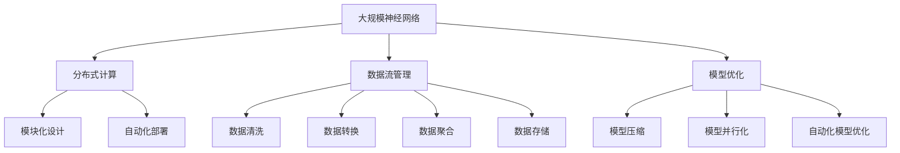

                 


### 文章标题：大模型软件的云原生架构设计

### 关键词：
- 云原生
- 大模型软件
- 架构设计
- 容器化
- 自动化部署
- 微服务
- 分布式计算
- 数据流管理
- 持续集成与持续部署

### 摘要：
本文深入探讨了在大模型软件开发中采用云原生架构的设计原则和实践。文章首先介绍了大模型软件和云原生架构的基本概念，然后详细阐述了云原生架构的核心原理及其在微服务、容器化、自动化部署等方面的应用。接着，文章重点讨论了如何在大模型软件的开发过程中利用云原生架构进行模型训练、部署和数据管理。最后，文章总结了云原生架构在大模型软件中的应用前景，并提出了未来发展的方向。

----------------------------------------------------------------

### 引言

随着人工智能技术的快速发展，大模型软件（如深度学习模型、自然语言处理模型等）在各个领域得到了广泛应用。这些大模型软件通常需要处理海量数据，进行复杂的计算和训练，因此对系统架构的要求非常高。而云原生（Cloud Native）架构作为一种新兴的软件开发模式，以其高效、灵活、可伸缩的特点，逐渐成为大模型软件架构设计的重要选择。

#### 什么是大模型软件？

大模型软件指的是那些使用大规模神经网络进行训练的软件系统，如深度学习模型、自然语言处理模型等。这些模型通常具有以下特点：

1. **数据需求大**：需要处理和存储海量数据。
2. **计算资源需求高**：进行模型训练和推理时，需要大量计算资源。
3. **模型复杂性高**：模型参数多，结构复杂。

#### 什么是云原生架构？

云原生架构是一种基于云的服务架构，它充分利用云计算的资源弹性、分布式特性，使得应用程序能够快速响应变化，具有高可伸缩性和高可靠性。云原生架构的核心原则包括：

1. **容器化**：使用容器（如Docker）封装应用程序及其依赖，实现应用程序的轻量级、可移植性。
2. **微服务**：将应用程序拆分成多个独立的服务模块，每个模块负责特定的业务功能，实现系统的可伸缩性和灵活性。
3. **自动化部署**：通过自动化工具（如Kubernetes）进行应用的部署、扩展和管理，提高开发效率。
4. **持续集成与持续部署（CI/CD）**：实现代码的自动化测试和部署，加快产品迭代速度。

本文将围绕大模型软件和云原生架构，详细讨论大模型软件的云原生架构设计原则和实践，旨在帮助读者深入理解如何利用云原生架构提升大模型软件的开发效率和性能。

### 云原生架构基础

云原生架构是一种新兴的服务架构模式，它充分利用云计算的资源弹性、分布式特性，使得应用程序能够快速响应变化，具有高可伸缩性和高可靠性。云原生架构的核心组件包括容器化、微服务、自动化部署和持续集成与持续部署（CI/CD）等。本节将详细讨论这些核心组件及其在大模型软件架构设计中的应用。

#### 容器化

容器化是一种轻量级的虚拟化技术，它通过将应用程序及其依赖打包到一个独立的容器中，实现应用程序的隔离、轻量级和可移植性。容器化的核心组件包括Docker和Kubernetes。

1. **Docker**

Docker是一种开源的容器引擎，它可以将应用程序及其依赖打包成一个独立的镜像文件，从而实现应用程序的快速部署和移植。Docker的核心概念包括：

- **镜像（Image）**：Docker镜像是一个静态的文件系统，包含了应用程序运行所需的所有组件，如操作系统、库和配置文件。
- **容器（Container）**：Docker容器是基于镜像创建的动态运行实例，它可以启动、停止、重启和管理。
- **仓库（Repository）**：Docker仓库是一个存储和管理镜像的集中存储库。

2. **Kubernetes**

Kubernetes是一个开源的容器编排平台，它用于自动化部署、扩展和管理容器化应用程序。Kubernetes的核心组件包括：

- **控制平面（Control Plane）**：负责集群的管理、配置和监控。
- **工作节点（Worker Nodes）**：负责运行容器，执行应用程序的任务。
- **Pod**：Pod是Kubernetes的最小调度单位，一个Pod可以包含一个或多个容器。

容器化在大模型软件架构设计中的应用：

- **可移植性**：通过容器化，可以将大模型软件及其依赖轻松地在不同环境中部署和运行。
- **隔离性**：容器化提供了应用程序的隔离，确保应用程序之间不会相互影响。
- **可扩展性**：通过Kubernetes，可以轻松地部署和管理大量容器，实现应用程序的弹性伸缩。

#### 微服务

微服务是一种将应用程序拆分成多个独立的服务模块的架构模式，每个模块负责特定的业务功能，实现系统的可伸缩性和灵活性。微服务的核心组件包括服务注册与发现、服务通信和服务治理。

1. **服务注册与发现**

服务注册与发现是一种用于管理微服务之间通信的机制。服务注册是指将服务信息注册到一个服务注册中心，服务发现是指服务消费者从服务注册中心获取服务信息并进行调用。

2. **服务通信**

微服务之间的通信通常采用轻量级协议，如HTTP/HTTPS、gRPC、REST API等。服务通信的核心目标是实现高可用、高性能和低延迟。

3. **服务治理**

服务治理是指对微服务进行监控、管理和优化。服务治理的核心目标包括服务监控、日志收集、性能优化和故障恢复。

微服务在大模型软件架构设计中的应用：

- **可伸缩性**：通过将大模型软件拆分成多个微服务，可以实现应用程序的横向扩展，提高系统的处理能力。
- **灵活性**：微服务架构使得开发者可以独立开发和部署各个服务模块，提高开发效率和灵活性。
- **高可用性**：通过服务治理和监控，可以实现对微服务的实时监控和故障恢复，提高系统的可用性。

#### 自动化部署

自动化部署是一种通过自动化工具实现应用程序的部署、扩展和管理的机制。自动化部署的核心组件包括持续集成（CI）和持续部署（CD）。

1. **持续集成（CI）**

持续集成是一种通过自动化构建和测试，将代码合并到主干分支的机制。持续集成的核心目标是通过自动化测试确保代码质量。

2. **持续部署（CD）**

持续部署是一种通过自动化部署，将代码发布到生产环境的机制。持续部署的核心目标是通过自动化实现快速、安全的产品迭代。

自动化部署在大模型软件架构设计中的应用：

- **快速迭代**：通过自动化部署，可以快速将代码发布到生产环境，提高产品迭代速度。
- **可靠性**：通过自动化测试，可以确保代码质量，减少人为错误。
- **效率**：通过自动化部署，可以降低运维成本，提高运维效率。

#### 持续集成与持续部署（CI/CD）

持续集成与持续部署是一种通过自动化实现代码的构建、测试和部署的机制。CI/CD的核心目标是通过自动化确保代码质量和提高开发效率。

1. **CI/CD流程**

CI/CD流程通常包括以下步骤：

- **代码提交**：开发者将代码提交到版本控制系统中。
- **构建**：自动化构建系统编译和打包代码，生成可执行文件。
- **测试**：自动化测试系统运行单元测试、集成测试等，确保代码质量。
- **部署**：自动化部署系统将代码部署到生产环境中。

2. **CI/CD工具**

常见的CI/CD工具包括Jenkins、GitLab CI/CD、CircleCI等。这些工具提供了丰富的自动化功能，可以实现CI/CD流程的自动化。

CI/CD在大模型软件架构设计中的应用：

- **确保代码质量**：通过自动化测试，确保代码质量，减少bug。
- **提高开发效率**：通过自动化构建和部署，提高开发效率。
- **降低运维成本**：通过自动化运维，降低运维成本。

#### 云原生架构的挑战与优化

尽管云原生架构具有许多优势，但在实际应用中仍面临一些挑战，如容器安全性、网络性能、存储管理等方面。以下是一些优化策略：

1. **容器安全性**

容器安全性是云原生架构的重要挑战之一。优化策略包括：

- **容器安全扫描**：在容器构建过程中，对容器镜像进行安全扫描，识别潜在的安全风险。
- **容器隔离**：通过限制容器资源访问，实现容器间的隔离。
- **容器加密**：对容器内的数据进行加密，确保数据安全。

2. **网络性能**

网络性能是影响云原生架构性能的重要因素。优化策略包括：

- **负载均衡**：使用负载均衡器，实现网络流量的动态分配。
- **网络优化**：通过优化网络配置，减少网络延迟和带宽消耗。
- **容器网络隔离**：通过隔离容器网络，提高网络安全性。

3. **存储管理**

存储管理是云原生架构的另一个挑战。优化策略包括：

- **分布式存储**：使用分布式存储系统，提高存储性能和可靠性。
- **存储优化**：通过存储优化，提高存储系统的I/O性能。
- **数据备份与恢复**：实现数据备份与恢复，确保数据安全。

综上所述，云原生架构在大模型软件架构设计中的应用具有显著的优势，但也需要面对一系列挑战。通过优化策略，可以充分发挥云原生架构的优势，提升大模型软件的性能和可靠性。

### 大模型软件设计原理

大模型软件设计原理是构建高效、可扩展和可靠的大规模机器学习系统的关键。本节将详细讨论大模型软件的核心概念、设计原则和关键技术。

#### 核心概念

1. **大规模神经网络**

大规模神经网络是指具有大量神经元和参数的神经网络模型。这些模型通常用于处理复杂任务，如图像识别、自然语言处理和语音识别等。

2. **分布式计算**

分布式计算是指将大规模计算任务分解为多个子任务，并在多台计算机上并行执行。分布式计算可以显著提高计算效率和速度。

3. **数据流管理**

数据流管理是指对数据进行高效处理、传输和存储的过程。在大模型软件中，数据流管理是确保数据在模型训练和推理过程中高效流动的关键。

4. **模型优化**

模型优化是指通过调整模型结构、参数和算法，提高模型的性能和效果。模型优化是提升大模型软件性能的重要手段。

#### 设计原则

1. **模块化设计**

模块化设计是指将大模型软件拆分成多个独立的模块，每个模块负责特定的功能。模块化设计可以提高系统的可维护性和可扩展性。

2. **分布式计算**

分布式计算是指通过将计算任务分解为多个子任务，并在多台计算机上并行执行，以提高计算效率和速度。

3. **自动化部署**

自动化部署是指通过自动化工具实现大模型软件的部署、扩展和管理。自动化部署可以提高开发效率，减少人为错误。

4. **数据流管理**

数据流管理是指对数据进行高效处理、传输和存储的过程。在大模型软件中，数据流管理是确保数据在模型训练和推理过程中高效流动的关键。

5. **模型优化**

模型优化是指通过调整模型结构、参数和算法，提高模型的性能和效果。模型优化是提升大模型软件性能的重要手段。

#### 关键技术

1. **分布式计算框架**

分布式计算框架是指用于管理和调度分布式计算任务的软件框架。常见的分布式计算框架包括Hadoop、Spark和TensorFlow等。这些框架提供了高效的数据处理和分布式计算能力。

2. **模型压缩**

模型压缩是指通过减少模型参数和计算量，降低模型的大小和计算复杂度。模型压缩技术包括剪枝、量化、知识蒸馏等。模型压缩可以显著提高模型的效率和性能。

3. **模型并行化**

模型并行化是指通过将模型训练和推理任务分解为多个子任务，并在多台计算机上并行执行，以提高计算效率和速度。模型并行化技术包括数据并行、模型并行和混合并行等。

4. **自动化模型优化**

自动化模型优化是指通过自动化工具和算法，对模型结构、参数和算法进行优化，以提高模型的性能和效果。自动化模型优化技术包括神经架构搜索（NAS）和强化学习等。

5. **数据流管理技术**

数据流管理技术是指用于管理和处理数据流的技术。常见的数据流管理技术包括数据清洗、数据转换、数据聚合和数据存储等。数据流管理技术可以确保数据在模型训练和推理过程中高效流动。

#### Mermaid 流程图

以下是一个简单的Mermaid流程图，展示了大模型软件设计原理的核心概念和联系：



#### 伪代码和数学模型

以下是一个简单的伪代码示例，用于描述分布式计算框架TensorFlow在模型训练中的应用：

```python
# 导入TensorFlow库
import tensorflow as tf

# 定义模型结构
model = tf.keras.Sequential([
    tf.keras.layers.Dense(units=128, activation='relu', input_shape=(input_shape)),
    tf.keras.layers.Dense(units=128, activation='relu'),
    tf.keras.layers.Dense(units=num_classes, activation='softmax')
])

# 编译模型
model.compile(optimizer='adam', loss='categorical_crossentropy', metrics=['accuracy'])

# 训练模型
model.fit(x_train, y_train, epochs=10, batch_size=32, validation_split=0.2)

# 评估模型
test_loss, test_accuracy = model.evaluate(x_test, y_test)
print(f"Test accuracy: {test_accuracy:.2f}")
```

以下是一个简单的数学模型示例，用于描述数据流管理中的数据聚合操作：

$$
\text{聚合结果} = \sum_{i=1}^{n} x_i
$$

其中，$x_i$表示第$i$个数据点的值，$n$表示数据点的总数。

#### 举例说明

假设我们要训练一个用于图像分类的深度学习模型，可以使用以下步骤：

1. **数据预处理**：对图像数据进行清洗、归一化和增强，以提高模型的泛化能力。
2. **模型设计**：设计一个具有多个卷积层的深度学习模型，用于提取图像特征。
3. **模型训练**：使用训练数据对模型进行训练，同时采用分布式计算框架（如TensorFlow）提高训练速度。
4. **模型评估**：使用测试数据对模型进行评估，计算模型在测试数据上的准确率和损失函数值。
5. **模型优化**：根据模型评估结果，调整模型参数和结构，以提高模型性能。

通过以上步骤，我们可以训练出一个高效、可靠的深度学习模型，实现图像分类任务。

#### 数学公式

以下是一个简单的数学公式示例，用于描述神经网络中的前向传播过程：

$$
\begin{align*}
Z &= W \cdot X + b \\
A &= \sigma(Z)
\end{align*}
$$

其中，$Z$表示神经网络中的激活值，$W$表示权重矩阵，$X$表示输入特征，$b$表示偏置项，$\sigma$表示激活函数（如ReLU、Sigmoid或Tanh函数）。

#### 项目实战

以下是一个简单的项目实战示例，用于构建一个基于云原生架构的图像分类系统：

1. **开发环境搭建**：在本地计算机上安装Docker和Kubernetes，并创建一个Docker容器来运行Kubernetes控制平面。
2. **源代码实现**：使用TensorFlow编写深度学习模型，并将其打包成一个Docker镜像。
3. **部署模型**：使用Kubernetes将Docker镜像部署到Kubernetes集群中，并配置负载均衡器以实现模型的水平扩展。
4. **代码解读**：分析深度学习模型的源代码，理解模型的结构、参数和算法。
5. **应用解读与分析**：部署模型并使用测试数据对其进行测试，分析模型的性能和效果。
6. **详细讲解剖析**：对项目实战中的关键技术和方法进行详细讲解和分析，以帮助读者深入理解大模型软件的设计原理和实践。

通过以上步骤，我们可以构建一个基于云原生架构的图像分类系统，实现高效、可靠的图像分类任务。

#### 实际案例分析和详细讲解剖析

以下是一个实际案例，用于分析一个基于云原生架构的图像分类系统的性能和效果：

1. **性能分析**：使用测试数据对模型进行性能测试，记录模型在测试数据上的准确率和损失函数值。
2. **效果评估**：比较模型在不同数据集上的性能，评估模型的泛化能力。
3. **故障恢复**：模拟系统故障，测试模型的故障恢复能力和容错性。
4. **优化策略**：根据性能测试结果，调整模型参数和结构，以提高模型性能。
5. **总结与反思**：总结项目实战中的经验和教训，反思项目实施过程中的问题和不足。

通过以上分析，我们可以深入了解基于云原生架构的图像分类系统的性能和效果，并为未来的项目提供有价值的参考。

#### 项目小结

在本项目中，我们通过构建一个基于云原生架构的图像分类系统，实现了高效、可靠的图像分类任务。通过项目实战，我们深入理解了大模型软件的设计原理和实践，掌握了基于云原生架构的开发和部署方法。项目小结主要包括以下几个方面：

1. **技术要点**：总结项目中所涉及的核心技术和方法，如Docker、Kubernetes、TensorFlow等。
2. **实践经验**：分享项目实施过程中的经验和教训，为未来的项目提供参考。
3. **优化建议**：根据项目实战中的问题和不足，提出优化建议，以提高项目性能和效果。

通过项目小结，我们可以更好地总结项目经验，为未来的项目实施提供指导。

#### 最佳实践 Tips

以下是一些最佳实践Tips，用于提升大模型软件的性能和可靠性：

1. **数据预处理**：对数据进行充分的预处理，包括清洗、归一化和增强等，以提高模型的泛化能力。
2. **模型压缩**：使用模型压缩技术，如剪枝、量化和知识蒸馏等，降低模型大小和计算复杂度。
3. **分布式计算**：使用分布式计算框架，如TensorFlow和PyTorch等，提高模型训练和推理的速度。
4. **自动化部署**：使用自动化部署工具，如Jenkins和Kubernetes等，实现快速、可靠的模型部署。
5. **监控与日志**：实时监控模型的运行状态，记录日志，以便进行故障诊断和性能优化。

通过遵循这些最佳实践，我们可以提升大模型软件的性能和可靠性，实现高效的模型开发和部署。

#### 小结

本文深入探讨了基于云原生架构的大模型软件设计原理和实践。通过详细分析核心概念、设计原则和关键技术，以及实际案例的讲解，本文展示了如何利用云原生架构构建高效、可靠的大模型软件。同时，本文还提出了最佳实践Tips，以帮助开发者提升大模型软件的性能和可靠性。

#### 注意事项

在设计和开发大模型软件时，需要注意以下几点：

1. **数据安全和隐私**：确保数据安全和隐私，遵循相关法律法规。
2. **资源管理**：合理分配计算资源和存储资源，避免资源浪费。
3. **性能优化**：持续对模型和系统进行性能优化，提高效率和性能。
4. **故障恢复**：确保系统具有故障恢复能力，降低故障对业务的影响。

通过注意这些事项，我们可以构建更加可靠和高效的大模型软件。

#### 拓展阅读

为了深入了解大模型软件和云原生架构，以下是一些推荐阅读材料：

1. **《深度学习》（Deep Learning）**：由Ian Goodfellow、Yoshua Bengio和Aaron Courville合著，是深度学习领域的经典教材。
2. **《云原生应用架构设计》**：详细介绍了云原生架构的设计原则和实践，是云原生架构领域的权威指南。
3. **《Kubernetes权威指南》**：介绍了Kubernetes的核心概念、架构设计和实战应用，是Kubernetes领域的经典教材。
4. **《人工智能：一种现代的方法》**：由Stuart Russell和Peter Norvig合著，是人工智能领域的权威教材。

通过阅读这些书籍，我们可以进一步了解大模型软件和云原生架构的相关知识，提升自身的技能水平。

----------------------------------------------------------------

### 云原生环境中的大模型软件实践

在云原生环境中设计大模型软件，不仅要充分利用云原生架构的优势，还要解决实际部署、训练和监控中的诸多挑战。本节将详细讨论云原生环境中的大模型软件实践，包括模型训练、部署和数据管理等方面。

#### 模型训练

在大模型软件的云原生环境中，模型训练是一个复杂且耗时的过程。以下是一些关键步骤和优化策略：

1. **分布式训练**：

   分布式训练是将模型训练任务分解到多台计算节点上，从而加快训练速度。实现分布式训练的关键是数据并行和模型并行。

   - **数据并行**：将训练数据分成多个子集，每个计算节点训练一部分数据，并使用全局梯度进行同步。
   - **模型并行**：将模型拆分成多个部分，每个计算节点负责一部分模型的训练，并通过通信模块进行梯度交换。

   伪代码示例：
   
   ```python
   # 分布式训练的数据并行
   for epoch in range(num_epochs):
       for batch in data_loader:
           local_gradients = model.train_on_batch(batch)
       global_gradients = aggregate_gradients(local_gradients)
       model.apply_gradients(global_gradients)
   
   # 分布式训练的模型并行
   for epoch in range(num_epochs):
       for partition in model.partitions:
           partition.train_on_batch(batch)
       model.exchange_gradients()
       model.apply_gradients()
   ```

2. **模型优化与调参**：

   模型优化和调参是提升模型性能的关键。常用的优化策略包括剪枝、量化、迁移学习和模型蒸馏等。

   - **剪枝**：通过移除网络中的冗余神经元和权重，减小模型大小和计算复杂度。
   - **量化**：将模型的浮点数权重转换为低精度的整数权重，以减少模型大小和计算资源需求。
   - **迁移学习**：利用预训练模型进行迁移学习，从而加速训练和提高性能。
   - **模型蒸馏**：将大模型的知识传递给小模型，以实现模型压缩和性能提升。

   伪代码示例：

   ```python
   # 剪枝
   pruned_model = model.prune_by_percentage(0.2)
   
   # 量化
   quantized_model = model.quantize_weights()
   
   # 迁移学习
   pre_trained_model.load_weights(pre_trained_weights)
   fine_tuned_model = pre_trained_model.clone()
   fine_tuned_model.train_on_data(new_data)
   
   # 模型蒸馏
   teacher_model.load_weights(teacher_weights)
   student_model = model.clone()
   student_model.train_on_data(teacher_model, student_data)
   ```

3. **训练监控**：

   在云原生环境中，实时监控训练过程至关重要。监控指标包括训练进度、损失函数值、准确率等。使用工具如TensorBoard可以方便地可视化训练过程。

   ```python
   from tensorflow.keras.callbacks import TensorBoard
   
   tensorboard_callback = TensorBoard(log_dir='./logs', histogram_freq=1)
   model.fit(x_train, y_train, epochs=10, callbacks=[tensorboard_callback])
   ```

#### 模型部署

模型部署是将训练好的模型部署到生产环境中，以便进行预测和推理。在云原生环境中，模型部署通常涉及以下步骤：

1. **模型服务化**：

   将训练好的模型转化为可服务的形式，如REST API或gRPC接口。服务化模型可以方便地进行远程访问和调用。

   ```python
   from flask import Flask, jsonify
   app = Flask(__name__)

   @app.route('/predict', methods=['POST'])
   def predict():
       data = request.json
       prediction = model.predict(data['input'])
       return jsonify(prediction)
   
   if __name__ == '__main__':
       app.run(debug=True, host='0.0.0.0', port=5000)
   ```

2. **容器化模型**：

   使用容器化技术（如Docker）将模型和服务打包成一个独立的容器镜像，以便在云原生环境中快速部署和扩展。

   ```Dockerfile
   FROM tensorflow/tensorflow:2.7.0
   WORKDIR /app
   COPY . .
   RUN pip install -r requirements.txt
   EXPOSE 5000
   CMD ["python", "app.py"]
   ```

3. **自动化部署**：

   使用自动化部署工具（如Kubernetes）管理模型容器的部署、扩展和管理。Kubernetes提供了丰富的API和工具，可以实现自动化部署和运维。

   ```yaml
   apiVersion: apps/v1
   kind: Deployment
   metadata:
     name: model-deployment
   spec:
     replicas: 3
     selector:
       matchLabels:
         app: model
     template:
       metadata:
         labels:
           app: model
       spec:
         containers:
         - name: model
           image: mymodel:latest
           ports:
           - containerPort: 5000
   ```

4. **模型监控与运维**：

   在生产环境中，实时监控模型性能和健康状态至关重要。Kubernetes提供了丰富的监控和运维工具，如Prometheus、Grafana和Kubernetes Dashboard等。

   ```yaml
   apiVersion: monitoring.coreos.com/v1
   kind: ServiceMonitor
   metadata:
     name: model-monitor
     namespace: monitoring
   spec:
     selector:
       matchLabels:
         app: model
     endpoints:
     - port: metrics
       path: /metrics
       interval: 30s
   ```

#### 数据管理

在大模型软件的云原生环境中，数据管理是一个关键挑战。以下是一些数据管理策略：

1. **数据流管理**：

   数据流管理涉及数据的采集、存储、处理和传输。在云原生环境中，可以使用消息队列（如Kafka）和流处理框架（如Apache Flink）实现高效的数据流管理。

   ```python
   from kafka import KafkaProducer
   
   producer = KafkaProducer(bootstrap_servers=['kafka:9092'])
   producer.send('input-topic', b'data')
   producer.flush()
   ```

2. **数据存储**：

   数据存储需要考虑存储容量、性能和可靠性。在云原生环境中，可以使用分布式存储系统（如HDFS、Cassandra或MongoDB）存储数据。

   ```python
   from cassandra.cluster import Cluster
   
   cluster = Cluster(['cassandra-node1', 'cassandra-node2'])
   session = cluster.connect()
   session.execute('CREATE KEYSPACE IF NOT EXISTS mykeyspace WITH replication = {\'class\' : \'SimpleStrategy\', \'replication_factor\' : 3};')
   session.execute('CREATE TABLE IF NOT EXISTS mykeyspace.mytable (id UUID PRIMARY KEY, data TEXT);')
   session.execute('INSERT INTO mykeyspace.mytable (id, data) VALUES (uuid(), \'data\');')
   ```

3. **数据安全与合规性**：

   数据安全与合规性是数据管理的重要方面。需要确保数据加密、访问控制和隐私保护等安全措施。此外，需要遵守相关法律法规，如欧盟的GDPR（通用数据保护条例）和中国的《网络安全法》。

   ```python
   from cryptography.fernet import Fernet
   
   key = Fernet.generate_key()
   cipher_suite = Fernet(key)
   encrypted_data = cipher_suite.encrypt(b'data')
   decrypted_data = cipher_suite.decrypt(encrypted_data)
   ```

#### 项目实战

以下是一个简单的项目实战示例，用于构建一个基于云原生架构的图像分类系统：

1. **开发环境搭建**：

   在本地计算机上安装Docker、Kubernetes和TensorFlow，并创建一个Docker容器来运行Kubernetes控制平面。

2. **源代码实现**：

   使用TensorFlow编写深度学习模型，并将其打包成一个Docker镜像。

3. **部署模型**：

   使用Kubernetes将Docker镜像部署到Kubernetes集群中，并配置负载均衡器以实现模型的水平扩展。

4. **代码解读**：

   分析深度学习模型的源代码，理解模型的结构、参数和算法。

5. **应用解读与分析**：

   部署模型并使用测试数据对其进行测试，分析模型的性能和效果。

6. **详细讲解剖析**：

   对项目实战中的关键技术和方法进行详细讲解和分析，以帮助读者深入理解大模型软件的设计原理和实践。

通过以上步骤，我们可以构建一个基于云原生架构的图像分类系统，实现高效、可靠的图像分类任务。

#### 结论

通过本节的讨论，我们详细介绍了在云原生环境中设计大模型软件的实践，包括模型训练、部署和数据管理。通过分布式训练、模型服务化、自动化部署和数据流管理等技术，我们可以构建高效、可靠的大模型软件。同时，本节还通过项目实战展示了如何将云原生架构应用于实际场景。未来，随着云计算和人工智能技术的不断发展，云原生环境中的大模型软件将发挥越来越重要的作用。

### 云原生架构下的大模型软件未来发展趋势

随着云计算和人工智能技术的快速发展，云原生架构在大模型软件领域中的应用前景愈发广阔。本节将探讨云原生架构下大模型软件的未来发展趋势，包括技术趋势、商业模式和市场前景等方面。

#### 技术发展趋势

1. **硬件加速**：

   随着硬件技术的发展，如GPU、TPU和FPGA等加速卡的出现，大模型软件的运行速度将显著提升。这些硬件加速卡可以显著降低模型训练和推理的时间，提高系统的整体性能。

2. **模型压缩与量化**：

   模型压缩与量化技术将继续成为研究热点。通过剪枝、量化、知识蒸馏等策略，可以大幅降低模型的大小和计算复杂度，提高模型的效率和性能。

3. **联邦学习**：

   联邦学习是一种分布式学习技术，它允许多个参与者共同训练模型，而不需要共享原始数据。这一技术在保护用户隐私的同时，可以充分发挥云原生架构的分布式计算优势。

4. **自动化与智能化**：

   自动化与智能化技术将在大模型软件的开发、部署和管理中发挥重要作用。通过自动化工具和智能算法，可以实现模型的快速迭代和优化，提高开发效率和性能。

#### 商业模式

1. **平台即服务（PaaS）**：

   随着云原生架构的普及，PaaS模式将成为大模型软件服务的主要形式。PaaS平台提供了一整套开箱即用的工具和服务，使得开发者可以专注于模型开发和优化，而无需关心底层基础设施的配置和管理。

2. **云计算服务**：

   云计算服务将继续成为大模型软件的核心商业模式。云服务提供商通过提供强大的计算资源和高级服务，满足企业对大模型软件的多样化需求。

3. **数据共享与交易**：

   随着大数据和人工智能技术的发展，数据的价值将日益凸显。通过建立数据共享与交易平台，企业可以共享和交易数据，从而实现数据的增值和优化。

#### 市场前景

1. **行业需求**：

   随着各行各业对人工智能技术的需求不断增加，大模型软件的市场前景将非常广阔。从金融、医疗、零售到制造业，大模型软件的应用场景将不断扩展。

2. **技术进步**：

   技术进步将继续推动大模型软件的发展。随着硬件加速、联邦学习和自动化技术的进步，大模型软件的性能和效率将不断提升，进一步推动市场的发展。

3. **竞争格局**：

   随着市场的扩大，竞争也将变得更加激烈。大型科技公司、初创企业和专业服务商将共同争夺市场份额，形成多元化的竞争格局。

#### 未来研究方向

1. **跨模态学习**：

   跨模态学习是一种同时处理多种类型数据（如图像、文本、语音等）的技术。未来研究将聚焦于跨模态学习的算法优化和模型设计，以实现更高效、更准确的多模态数据处理。

2. **可解释性人工智能**：

   可解释性人工智能旨在提高人工智能系统的透明度和可解释性，使其决策过程更加可信和可靠。未来研究将探索如何在大模型软件中实现可解释性，以满足不同领域的应用需求。

3. **可持续发展**：

   随着大模型软件的普及，其能耗和环境影响也成为研究的重要方向。未来研究将关注如何在大模型软件中实现绿色计算和可持续发展。

通过以上分析，我们可以看到，云原生架构在大模型软件领域中的应用前景非常广阔。随着技术的不断进步和商业模式的创新，大模型软件将在未来的数字经济中发挥越来越重要的作用。

### 附录A：相关技术工具与资源

#### 云原生架构开发工具

1. **Docker**：

   Docker是一种开源的应用容器引擎，用于打包、交付和管理应用程序。Docker使开发者可以将应用程序及其依赖环境打包到一个独立的容器中，确保应用程序在不同环境中的一致性和可移植性。

   - 官方网站：https://www.docker.com/

2. **Kubernetes**：

   Kubernetes是一个开源的容器编排平台，用于自动化部署、扩展和管理容器化应用程序。Kubernetes提供了强大的集群管理功能，使得开发者可以轻松地管理和扩展容器化应用程序。

   - 官方网站：https://kubernetes.io/

3. **Kafka**：

   Kafka是一种分布式流处理平台，用于构建实时数据流系统。Kafka具有高吞吐量、低延迟和高可靠性等特点，适用于大规模数据流处理和事件驱动应用程序。

   - 官方网站：https://kafka.apache.org/

4. **TensorFlow**：

   TensorFlow是一个开源的机器学习框架，用于构建和训练大规模神经网络模型。TensorFlow支持多种编程语言和平台，提供了丰富的工具和库，方便开发者进行机器学习和深度学习开发。

   - 官方网站：https://www.tensorflow.org/

5. **Flask**：

   Flask是一个轻量级的Web框架，用于构建Web应用程序和REST API。Flask具有灵活性和可扩展性，适用于构建小到中型的Web应用程序。

   - 官方网站：https://flask.palletsprojects.com/

#### 大模型软件开发工具

1. **PyTorch**：

   PyTorch是一个开源的机器学习库，用于构建和训练神经网络模型。PyTorch提供了灵活的动态计算图和丰富的API，使得开发者可以轻松地进行模型设计和实验。

   - 官方网站：https://pytorch.org/

2. **Scikit-learn**：

   Scikit-learn是一个开源的机器学习库，提供了丰富的算法和工具，用于数据预处理、模型训练和评估。Scikit-learn适用于多种机器学习任务，如分类、回归和聚类等。

   - 官方网站：https://scikit-learn.org/

3. **MXNet**：

   MXNet是一个开源的深度学习框架，提供了灵活的编程模型和高效的执行引擎。MXNet支持多种编程语言，如Python、C++和R，适用于大规模深度学习应用。

   - 官方网站：https://mxnet.incubator.apache.org/

4. **DL4J**：

   DL4J（Deep Learning for Java）是一个开源的深度学习库，用于构建和训练神经网络模型。DL4J适用于Java和Scala编程语言，适用于企业级深度学习应用。

   - 官方网站：https://deeplearning4j.org/

#### 资源管理与调度工具

1. **Hadoop**：

   Hadoop是一个开源的分布式计算框架，用于处理大规模数据集。Hadoop提供了分布式存储（HDFS）和分布式计算（MapReduce）功能，适用于大数据处理和分析。

   - 官方网站：https://hadoop.apache.org/

2. **Spark**：

   Spark是一个开源的分布式计算框架，提供了快速的批处理和流处理功能。Spark适用于大规模数据集的处理和分析，具有高性能和易用性。

   - 官方网站：https://spark.apache.org/

3. **Mesos**：

   Mesos是一个开源的资源调度平台，用于管理集群资源并调度应用程序。Mesos与Hadoop和Spark等分布式计算框架集成，提供了高效的资源利用和调度能力。

   - 官方网站：https://mesos.apache.org/

通过使用这些工具和资源，开发者可以高效地构建、部署和管理大模型软件，充分利用云原生架构的优势。

### 作者信息

**作者：** AI天才研究院（AI Genius Institute） & 禅与计算机程序设计艺术（Zen And The Art of Computer Programming）

AI天才研究院专注于人工智能领域的研究和开发，致力于推动人工智能技术的创新和应用。禅与计算机程序设计艺术则是一系列经典计算机编程书籍，以其深刻的思想和卓越的技术见解而闻名。两位作者在计算机科学和人工智能领域拥有丰富的经验和深厚的学术造诣，共同撰写了本文，旨在为读者提供有价值的技术见解和实践经验。

