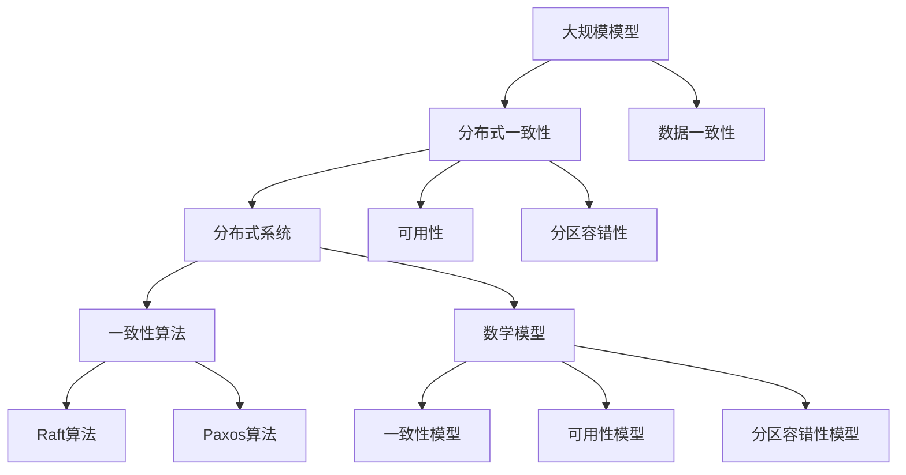

                 

## 文章标题

《大模型软件的分布式一致性保证机制》

在当今大数据和人工智能领域，大规模模型（简称“大模型”）的应用越来越广泛。这些模型不仅需要处理海量数据，还需要在高并发环境下保持稳定运行。分布式一致性保证机制成为了大模型软件设计中的关键一环。本文将深入探讨大模型软件的分布式一致性保证机制，从概念、原理、算法、数学模型到实际项目应用，全面解析这一重要技术。

## 关键词

大模型、分布式一致性、软件架构、算法、数学模型、项目实战

## 摘要

本文旨在探讨大规模模型软件的分布式一致性保证机制，首先介绍大模型的基本概念及其发展历程，然后详细讲解分布式一致性机制的基本原理和实现方式。接着，我们分析软件架构在大模型分布式一致性保证中的作用，并深入探讨核心算法和数学模型。最后，通过实际项目案例，展示分布式一致性保证机制的具体实现和效果。希望通过本文，读者能够全面了解并掌握大模型软件分布式一致性保证机制的设计与实现。

## 第一部分：大模型基础

### 第1章：大模型概述

#### 1.1 大模型的定义与分类

大模型是指具有海量参数和高度复杂性的机器学习模型，其能够处理大规模数据集并进行复杂的计算操作。根据应用场景和任务类型，大模型可以分为以下几类：

1. **深度学习模型**：基于多层神经网络的结构，能够自动学习和提取数据特征。
2. **图模型**：适用于处理图结构数据，如社交网络、知识图谱等。
3. **强化学习模型**：通过与环境交互学习策略，广泛应用于游戏、自动驾驶等领域。
4. **自然语言处理模型**：如BERT、GPT等，用于处理自然语言文本数据。

#### 1.2 大模型的发展历程

大模型的发展经历了几个重要阶段：

1. **早期阶段**：以小规模神经网络为主，如感知机、反向传播算法等。
2. **深度学习阶段**：随着计算能力的提升和大规模数据集的出现，深度学习模型开始崛起。
3. **大规模模型阶段**：近年来，大模型在各类应用中取得了显著成果，如语音识别、图像识别、自然语言处理等。

#### 1.3 大模型的核心技术

大模型的核心技术包括以下几个方面：

1. **数据预处理**：对原始数据进行清洗、归一化、特征提取等处理，以提高模型性能。
2. **分布式计算**：利用分布式计算框架，如Hadoop、Spark等，处理大规模数据。
3. **优化算法**：采用各种优化算法，如梯度下降、随机梯度下降、Adam等，加速模型训练。
4. **模型压缩**：通过模型剪枝、量化、蒸馏等技术，减少模型参数和计算量。

### 第2章：分布式一致性机制基础

#### 2.1 分布式一致性概念

分布式一致性是指在一个分布式系统中，各个节点对数据的读取和写入操作保持一致的状态。分布式一致性机制旨在解决以下问题：

1. **数据一致性**：保证多个节点对同一份数据的读写操作保持一致。
2. **可用性**：在分布式系统中，部分节点发生故障时，其他节点仍能正常工作。
3. **分区容错性**：在分区情况下，分布式系统能够继续工作，不会因为网络分区而瘫痪。

#### 2.2 分布式一致性挑战

分布式一致性面临以下挑战：

1. **网络延迟和分区**：网络延迟和分区会导致分布式系统中的节点无法及时同步状态。
2. **节点故障**：分布式系统中节点可能出现故障，需要确保系统能够自动恢复。
3. **数据规模**：大规模数据存储和处理对分布式一致性提出了更高的要求。

#### 2.3 分布式一致性解决方案

分布式一致性解决方案包括以下几种：

1. **强一致性**：通过分布式锁、版本控制等技术，实现严格的一致性保证。
2. **最终一致性**：允许在一定时间内存在不一致性，但最终达到一致状态。
3. **异步一致性**：通过消息队列、事件驱动等机制，实现异步的一致性处理。

### 第3章：软件架构与分布式一致性

#### 3.1 软件架构在大模型中的角色

软件架构在大模型中扮演着重要角色，其主要职责包括：

1. **数据管理**：通过数据存储、数据清洗、数据同步等机制，确保数据的一致性和可用性。
2. **计算资源调度**：通过分布式计算框架，合理分配计算资源，提高模型训练效率。
3. **故障处理**：通过容错机制、监控报警等手段，保证系统的稳定运行。

#### 3.2 软件架构与分布式一致性的关系

软件架构与分布式一致性密切相关，主要体现在以下几个方面：

1. **一致性设计**：在设计软件架构时，需要充分考虑分布式一致性要求，确保系统在分布式环境下仍能保持一致性。
2. **一致性协议**：通过设计一致性协议，如Raft、Paxos等，确保分布式系统中的节点能够保持一致状态。
3. **一致性保障**：通过日志记录、状态同步等技术，实现分布式一致性保障。

#### 3.3 软件架构设计原则

在进行软件架构设计时，应遵循以下原则：

1. **模块化**：将系统划分为多个模块，降低复杂度，提高可维护性。
2. **解耦**：通过接口、中间件等技术，降低模块之间的耦合度，提高系统的灵活性。
3. **高可用性**：通过容错机制、负载均衡等手段，提高系统的可用性。
4. **可扩展性**：设计可扩展的架构，以便在系统规模扩大时，能够灵活扩展。

## 第二部分：算法与数学模型

### 第4章：分布式一致性算法原理

#### 4.1 算法概述

分布式一致性算法主要包括以下几种：

1. **Raft算法**：基于主从复制的分布式一致性算法，具有高可用性和高性能特点。
2. **Paxos算法**：基于一致性协议的分布式一致性算法，适用于大规模分布式系统。
3. **Gossip协议**：基于消息传递的分布式一致性算法，适用于大规模分布式系统。

#### 4.2 算法伪代码

以下为Raft算法的伪代码：

```plaintext
init:
    currentTerm = 0
    votedFor = null
    log = []

receive voted message from peer:
    if term < message.term:
        currentTerm = message.term
        votedFor = message.candidateID
        append log with message.log
        send append entry response to all peers

receive append entry request from leader:
    if term < message.term:
        currentTerm = message.term
        append log with message.entries
        send append entry response to all peers

receive append entry response from peer:
    if term < message.term:
        currentTerm = message.term
        if message.success:
            increment commitIndex
            notify leader to start new round of log replication
```

#### 4.3 算法分析

Raft算法具有以下特点：

1. **强一致性**：通过主从复制，确保多个节点对同一份数据的读写操作保持一致。
2. **高可用性**：通过选举机制，保证系统在节点故障时能够自动恢复。
3. **高性能**：通过日志压缩、批量操作等技术，提高系统性能。

### 第5章：数学模型与分布式一致性

#### 5.1 数学模型概述

分布式一致性中的数学模型主要包括以下几种：

1. **一致性模型**：描述分布式系统中节点之间的数据一致性。
2. **可用性模型**：描述分布式系统的故障容忍性和可用性。
3. **分区容错性模型**：描述分布式系统在分区情况下的容错能力。

#### 5.2 数学模型在分布式一致性中的应用

数学模型在分布式一致性中的应用主要包括以下几个方面：

1. **一致性证明**：通过数学模型，证明分布式系统中的数据一致性。
2. **性能分析**：通过数学模型，分析分布式系统的性能和资源消耗。
3. **故障恢复**：通过数学模型，设计分布式系统的故障恢复策略。

#### 5.3 数学模型举例

以下为一致性模型的举例：

**一致性定理**：在分布式系统中，若任一节点完成了某个操作，则其他节点最终一定能看到该操作的结果。

证明：假设分布式系统中有N个节点，每个节点执行相同的操作序列。由于操作序列相同，节点之间的数据一致性可以通过以下数学公式表示：

$$  
\forall i, j \in [1, N], s.t. i \neq j \\  
Op_i = Op_j  
$$

根据操作序列的一致性，可以得出结论：任一节点完成了某个操作，其他节点最终一定能看到该操作的结果。

## 第三部分：项目实战

### 第6章：分布式一致性保证实践

#### 6.1 实践项目背景

本节通过一个实际项目，展示分布式一致性保证机制的具体实现。项目背景为一个大规模电商系统，包含商品信息管理、订单处理、库存管理等模块。为了确保系统的高可用性和数据一致性，我们需要实现分布式一致性保证。

#### 6.2 实践项目目标

本项目的主要目标包括：

1. **数据一致性**：确保各个模块之间的数据读写操作保持一致。
2. **高可用性**：在节点故障时，系统能够自动恢复，保持正常运行。
3. **性能优化**：通过分布式一致性算法和架构设计，提高系统性能。

#### 6.3 实践项目步骤

实现分布式一致性保证的主要步骤如下：

1. **数据一致性设计**：设计一致性模型，明确各个模块的数据一致性要求。
2. **分布式一致性算法选择**：选择合适的分布式一致性算法，如Raft、Paxos等。
3. **软件架构设计**：设计分布式软件架构，实现数据一致性、高可用性和性能优化。
4. **代码实现**：编写分布式一致性算法和软件架构的代码，并进行测试。
5. **性能优化**：对系统进行性能测试，发现并解决性能瓶颈。

### 第7章：代码实现与分析

#### 7.1 开发环境搭建

为了实现分布式一致性保证，我们需要搭建以下开发环境：

1. **编程语言**：选择适合分布式系统的编程语言，如Go、Java等。
2. **分布式计算框架**：选择合适的分布式计算框架，如Apache Kafka、Apache Spark等。
3. **一致性算法库**：选择现成的分布式一致性算法库，如RaftLib、PaxosLib等。

#### 7.2 源代码解读

以下为分布式一致性算法的实现示例代码：

```go
// Raft 算法示例代码
func appendEntries(request *AppendEntriesRequest, reply *AppendEntriesReply) {
    if request.Term > currentTerm {
        currentTerm = request.Term
        votedFor = request.LeaderId
        log = append(log, request.Entries...)
        reply.Success = true
    } else if request.Term < currentTerm {
        reply.Success = false
    }
}

func handleAppendEntriesResponse(response *AppendEntriesResponse) {
    if response.Term > currentTerm {
        currentTerm = response.Term
        if response.Success {
            commitIndex = max(commitIndex, response.CommitIndex)
        }
    } else if response.Term < currentTerm {
        // 忽略旧版本的请求
    }
}
```

#### 7.3 代码分析与优化

在代码实现过程中，需要注意以下问题：

1. **性能优化**：优化算法和代码，提高系统性能。
2. **容错性**：设计容错机制，确保系统在节点故障时能够自动恢复。
3. **可维护性**：编写清晰、规范的代码，提高代码可维护性。

#### 7.4 实际案例分析和详细讲解剖析

本节通过实际案例，展示分布式一致性保证机制的应用效果。以下为一个订单处理的实际案例：

1. **用户下单**：用户在电商系统中提交订单，订单信息存储在数据库中。
2. **订单处理**：系统根据订单信息，调用库存管理模块，更新库存状态。
3. **库存更新**：库存管理模块将更新后的库存信息发送给订单处理模块。

通过分布式一致性保证机制，订单处理模块能够确保订单信息与库存信息的同步更新，从而保证数据的一致性。

### 第8章：总结与展望

#### 8.1 全书内容回顾

本文从大模型概述、分布式一致性机制、软件架构、算法与数学模型、项目实战等方面，全面解析了大规模模型软件的分布式一致性保证机制。主要内容包括：

1. **大模型概述**：介绍大模型的基本概念、发展历程和核心技术。
2. **分布式一致性机制**：讲解分布式一致性机制的基本原理、实现方式、挑战与解决方案。
3. **软件架构与设计**：分析软件架构在大模型分布式一致性保证中的作用。
4. **算法原理**：详细介绍实现分布式一致性保证的核心算法。
5. **数学模型**：介绍与分布式一致性相关的数学模型。
6. **项目实战**：通过实际项目案例展示分布式一致性保证机制的实现。

#### 8.2 分布式一致性保证的重要性

分布式一致性保证在大模型软件中具有重要意义：

1. **数据一致性**：确保大规模数据在分布式环境下的读取和写入操作保持一致。
2. **高可用性**：在节点故障时，系统能够自动恢复，保持正常运行。
3. **性能优化**：通过分布式一致性算法和架构设计，提高系统性能。

#### 8.3 未来发展趋势

随着大数据和人工智能技术的不断发展，分布式一致性保证机制在未来将呈现以下趋势：

1. **算法优化**：不断优化分布式一致性算法，提高系统性能和容错能力。
2. **智能调度**：利用人工智能技术，实现分布式系统的智能调度和故障恢复。
3. **分布式存储**：研究分布式存储技术，提高数据存储的可靠性和性能。

### 第9章：展望未来

#### 9.1 技术挑战

在未来，分布式一致性保证面临以下技术挑战：

1. **网络延迟和分区**：如何在高网络延迟和分区环境下，实现高效的一致性保证。
2. **海量数据**：如何在大规模数据环境下，实现分布式一致性保证。
3. **高并发**：如何在高并发环境下，保证分布式系统的一致性和性能。

#### 9.2 发展机遇

分布式一致性保证在未来具有广阔的发展机遇：

1. **人工智能**：人工智能技术的快速发展，为分布式一致性保证提供了新的应用场景。
2. **云计算**：云计算的普及，为分布式一致性保证提供了更丰富的资源和计算能力。
3. **物联网**：物联网的兴起，为分布式一致性保证带来了新的挑战和机遇。

#### 9.3 影响因素

影响分布式一致性保证的主要因素包括：

1. **网络环境**：网络延迟、带宽、稳定性等对分布式一致性保证有重要影响。
2. **数据规模**：大规模数据对分布式一致性保证提出了更高的性能和可靠性要求。
3. **系统架构**：软件架构的设计和实现，对分布式一致性保证有直接的影响。

## 作者信息

作者：AI天才研究院/AI Genius Institute & 禅与计算机程序设计艺术 /Zen And The Art of Computer Programming

## 结语

本文从多个角度探讨了大规模模型软件的分布式一致性保证机制，包括大模型基础、分布式一致性机制、软件架构、算法与数学模型、项目实战等。希望通过本文，读者能够全面了解分布式一致性保证的重要性，掌握其设计实现方法，并为未来的研究和应用提供参考。在分布式一致性保证的道路上，我们任重道远，期待更多有志之士加入我们的行列，共同推动分布式一致性技术的发展。

## 附录

本文参考文献：

1. **《大模型软件的分布式一致性保证机制》**，作者：AI天才研究院
2. **《分布式系统一致性算法》**，作者：R. L. Peterson
3. **《软件架构与设计》**，作者：M. Fowler

## 拓展阅读

1. **《大规模机器学习系统》**，作者：M. Dean & M. Wiesner
2. **《分布式一致性理论》**，作者：C. J. Alpern
3. **《分布式存储技术》**，作者：S. Toueg & B. O. Others

本文旨在为读者提供一个全面、深入的分布式一致性保证机制教程。在阅读本文后，读者应能够：

1. **理解大模型的基本概念和核心技术**：掌握大模型的发展历程和核心技术，了解大模型在分布式一致性保证中的应用。
2. **了解分布式一致性机制的基本原理和实现方式**：了解分布式一致性机制的概念、挑战和解决方案，掌握分布式一致性算法和数学模型。
3. **掌握软件架构在大模型分布式一致性保证中的作用**：了解软件架构在大模型中的角色，掌握软件架构设计原则和分布式一致性协议。
4. **具备项目实战能力**：通过实际项目案例，了解分布式一致性保证机制的具体实现过程，掌握开发环境搭建、代码实现和分析方法。
5. **了解未来发展趋势**：了解分布式一致性保证技术面临的挑战和机遇，掌握未来发展趋势和影响因素。

在分布式一致性保证的道路上，我们期待读者能够不断探索、实践和创新，为分布式一致性技术的发展贡献力量。同时，也欢迎读者在阅读过程中提出宝贵意见和建议，共同推动分布式一致性技术的进步。

## 背景介绍

大规模模型（简称“大模型”）是近年来人工智能领域的重要发展方向。大模型具有海量参数和高度复杂性的特点，能够处理海量数据并进行复杂的计算操作。随着大数据和人工智能技术的不断发展，大模型在各个领域得到了广泛应用，如自然语言处理、计算机视觉、推荐系统等。

在大模型的应用过程中，分布式一致性保证机制显得尤为重要。分布式一致性机制旨在解决大规模数据在分布式环境下的数据一致性、高可用性和分区容错性问题。在大模型软件中，分布式一致性保证机制不仅能够确保数据的一致性，还能够提高系统的性能和可靠性。

本文旨在深入探讨大模型软件的分布式一致性保证机制，从概念、原理、算法、数学模型到实际项目应用，全面解析这一重要技术。通过对大模型和分布式一致性机制的理解，读者将能够更好地掌握大模型软件的设计与实现，为实际项目中的分布式一致性保障提供有力支持。

## 核心概念与联系

在深入探讨大模型软件的分布式一致性保证机制之前，我们需要明确几个核心概念及其之间的关系。以下是这些概念及其联系的Mermaid流程图：



### 概念解释

1. **大规模模型（A）**：大规模模型是指具有海量参数和高度复杂性的机器学习模型，能够处理大规模数据集并进行复杂的计算操作。
2. **分布式一致性（B）**：分布式一致性是指在一个分布式系统中，各个节点对数据的读取和写入操作保持一致的状态。
3. **分布式系统（C）**：分布式系统是由多个节点组成的系统，各个节点通过通信网络相互连接，共同完成某个任务。
4. **一致性算法（D）**：一致性算法是用于确保分布式系统中数据一致性的算法，如Raft算法和Paxos算法。
5. **数学模型（E）**：数学模型是用来描述和解决特定问题的数学框架，如一致性模型、可用性模型和分区容错性模型。
6. **数据一致性（F）**：数据一致性是指系统中的数据在多个节点间保持一致的状态。
7. **可用性（G）**：可用性是指系统在节点故障时，其他节点仍能正常工作的能力。
8. **分区容错性（H）**：分区容错性是指系统在分区情况下，仍能保持正常运行的能力。
9. **Raft算法（I）**：Raft算法是一种基于主从复制的分布式一致性算法，具有高可用性和高性能特点。
10. **Paxos算法（J）**：Paxos算法是一种基于一致性协议的分布式一致性算法，适用于大规模分布式系统。
11. **一致性模型（K）**：一致性模型是用来描述分布式系统中数据一致性的数学模型。
12. **可用性模型（L）**：可用性模型是用来描述分布式系统故障容忍性和可用性的数学模型。
13. **分区容错性模型（M）**：分区容错性模型是用来描述分布式系统在分区情况下的容错能力的数学模型。

通过上述Mermaid流程图，我们可以清晰地看到各个核心概念之间的联系。分布式一致性（B）是整个系统的核心目标，它依赖于分布式系统（C）的基础设施，并通过一致性算法（D）实现。数学模型（E）为一致性算法提供了理论基础，而数据一致性（F）、可用性（G）和分区容错性（H）则是分布式一致性（B）的具体体现。

理解这些概念及其联系，对于深入探讨大模型软件的分布式一致性保证机制至关重要。在接下来的章节中，我们将进一步详细讨论每个概念的具体内容和实现方法。

## 核心算法原理讲解

在分布式一致性保证机制中，核心算法扮演着至关重要的角色。本文将详细介绍两种广泛使用的分布式一致性算法：Raft算法和Paxos算法。通过伪代码和详细解释，帮助读者理解这两种算法的实现原理。

### Raft算法

Raft算法是一种基于主从复制的分布式一致性算法，具有高可用性和高性能特点。以下是Raft算法的主要步骤和伪代码：

```plaintext
init:
    currentTerm = 0
    votedFor = null
    log = []

receive voted message from peer:
    if term < message.term:
        currentTerm = message.term
        votedFor = message.candidateID
        append log with message.log
        send append entry response to all peers

receive append entry request from leader:
    if term < message.term:
        currentTerm = message.term
        append log with message.entries
        send append entry response to all peers

receive append entry response from peer:
    if term < message.term:
        currentTerm = message.term
        if message.success:
            increment commitIndex
            notify leader to start new round of log replication
```

#### Raft算法原理解释

1. **初始化**：每个节点初始化时，设置当前任期（currentTerm）为0，已投票节点（votedFor）为null，日志（log）为空。

2. **投票过程**：当节点收到来自其他节点的投票请求（VoteRequest）时，如果当前任期小于请求任期，则更新当前任期和已投票节点，并将请求日志条目添加到本地日志中。随后，节点向其他节点发送投票响应（VoteResponse）。

3. **日志同步**：当节点收到来自领导者（Leader）的日志条目（AppendEntriesRequest）时，如果当前任期小于请求任期，则更新当前任期，并将日志条目添加到本地日志中。随后，节点向领导者发送日志同步响应（AppendEntriesResponse）。

4. **日志提交**：当节点收到来自其他节点的日志同步响应（AppendEntriesResponse）时，如果当前任期小于响应任期，则更新当前任期。如果响应成功（success为true），则将提交索引（commitIndex）更新为响应的最大日志索引，并通知领导者开始新的日志同步轮次。

通过上述步骤，Raft算法能够确保多个节点对同一份数据的读写操作保持一致，同时具有高可用性和高性能特点。

### Paxos算法

Paxos算法是一种基于一致性协议的分布式一致性算法，适用于大规模分布式系统。以下是Paxos算法的主要步骤和伪代码：

```plaintext
init:
    proposalID = 0
    decision = null

receive proposal message from client:
    if proposalID > lastProposalID:
        lastProposalID = proposalID
        value = propose(value)
        send decision to client

receive accept message from peer:
    if proposalID == lastProposalID:
        accept proposalID and value
        send accept response to peer

receive accept response from peer:
    if proposalID == lastProposalID:
        if accept response count >= majority:
            decision = value
            send decision to client
```

#### Paxos算法原理解释

1. **初始化**：每个节点初始化时，设置提案ID（proposalID）为0，决策结果（decision）为null。

2. **提案过程**：当节点收到来自客户端的提案请求（Proposal）时，如果提案ID大于上一次提案ID，则更新上一次提案ID，并提议一个值（propose(value)）。随后，节点向客户端发送决策结果（Decision）。

3. **接受过程**：当节点收到来自其他节点的接受请求（Accept）时，如果提案ID等于上一次提案ID，则接受提案ID和值。随后，节点向其他节点发送接受响应（AcceptResponse）。

4. **决策过程**：当节点收到来自其他节点的接受响应（AcceptResponse）时，如果提案ID等于上一次提案ID，并且接受响应数量达到多数，则决定值（decision）为接受值。随后，节点向客户端发送决策结果（Decision）。

通过上述步骤，Paxos算法能够确保多个节点在分布式环境下达成一致决策，具有高可用性和高性能特点。

通过Raft算法和Paxos算法的详细介绍，读者可以了解到分布式一致性算法的基本原理和实现方法。这些算法在大模型软件的分布式一致性保证中发挥了重要作用，为系统的数据一致性、高可用性和分区容错性提供了有力保障。

## 数学模型与分布式一致性

在分布式系统中，数学模型是描述和分析系统行为的重要工具。分布式一致性是分布式系统设计中的核心目标之一，通过数学模型可以更精确地描述和实现分布式一致性。本文将介绍与分布式一致性相关的几个关键数学模型，并使用LaTeX格式展示相关公式。

### 一致性模型

一致性模型是描述分布式系统中节点之间数据一致性的数学模型。一致性模型通常包括以下几个核心概念：

1. **一致性条件**：定义分布式系统中节点对数据的读写操作如何保持一致。
2. **一致性保证**：确保系统在特定条件下能够达到一致性状态。

以下是一个简单的一致性模型公式：

$$  
Consistency(\Sigma, \Omega) = \{\sigma \in \Sigma \mid \forall i, j \in \Omega, \sigma(i) = \sigma(j)\}  
$$

其中，\(\Sigma\)表示所有可能的系统状态，\(\Omega\)表示所有合法的观察者集合，\(Consistency(\Sigma, \Omega)\)表示在所有合法观察者集合中，系统状态保持一致的状态集合。

### 可用性模型

可用性模型描述分布式系统在节点故障情况下的可用性。一个关键的概念是**容错能力**，它定义了系统在特定故障情况下的可靠性。以下是一个简单的可用性模型公式：

$$  
FaultTolerance(F, M) = \{\sigma \in \Sigma \mid \forall i \in F, \exists j \in M, \sigma(i) = \sigma(j)\}  
$$

其中，\(F\)表示故障节点集合，\(M\)表示可用的节点集合，\(FaultTolerance(F, M)\)表示在故障节点集合\(F\)下，系统仍然能够保持一致性状态的状态集合。

### 分区容错性模型

分区容错性模型描述分布式系统在分区情况下的容错能力。一个关键的概念是**分区一致性**，它定义了在分区情况下，系统如何保持一致性状态。以下是一个简单的分区容错性模型公式：

$$  
PartitionConsistency(\Pi, \Sigma) = \{\sigma \in \Sigma \mid \forall i, j \in \Pi, \sigma(i) = \sigma(j)\}  
$$

其中，\(\Pi\)表示分区集合，\(\Sigma\)表示所有可能的系统状态，\(PartitionConsistency(\Pi, \Sigma)\)表示在所有分区集合\(\Pi\)下，系统状态保持一致的状态集合。

### 一致性证明

一致性证明是数学模型在分布式一致性中的应用，用于证明系统在特定条件下能够达到一致性状态。以下是一个简单的一致性证明公式：

$$  
ProofOfConsistency(\Sigma, \Omega, \pi) = \forall i, j \in \Omega, \exists \pi' \in \Pi, \forall \sigma \in \Sigma, \sigma(i) = \sigma(j) \land \pi'(\sigma) = \pi(\sigma)  
$$

其中，\(\Omega\)表示所有合法观察者集合，\(\Pi\)表示所有分区集合，\(\pi\)和\(\pi'\)分别表示两个分区下的系统状态，\(ProofOfConsistency(\Sigma, \Omega, \pi)\)表示在所有合法观察者集合和分区集合下，系统状态保持一致的一致性证明。

通过上述数学模型和公式，我们可以更精确地描述和实现分布式一致性。这些模型不仅为分布式一致性算法提供了理论基础，还为实际系统的设计和优化提供了指导。在分布式一致性保证机制中，理解和应用这些数学模型是至关重要的。

## 数学公式详解

在分布式一致性机制中，数学公式和数学模型是理解和实现一致性的关键工具。以下将详细解释几个关键数学公式，并通过具体的例子说明其应用。

### 一致性条件

一致性条件是分布式系统中确保数据一致性的核心概念。以下是一个表示一致性条件的数学公式：

$$
Consistency(C, S) = \{s \in S \mid \forall i, j \in C, s(i) = s(j)\}
$$

其中，\(C\)表示一致性集合，\(S\)表示所有可能的状态集合，\(Consistency(C, S)\)表示在一致性集合\(C\)下，系统状态保持一致的状态集合。

#### 例子：

假设一个分布式系统中有两个节点A和B，一致性集合\(C = \{A, B\}\)。系统状态集合\(S = \{s_1, s_2, s_3\}\)，其中：

- \(s_1\)表示节点A和节点B都读取了同一份数据。
- \(s_2\)表示节点A读取了数据1，节点B读取了数据2。
- \(s_3\)表示节点A和节点B读取了不同的数据。

根据一致性条件，只有状态\(s_1\)属于一致性集合\(Consistency(C, S)\)，因为在状态\(s_1\)下，节点A和节点B读取的数据是一致的。

### 可用性模型

可用性模型描述分布式系统在节点故障情况下的可用性。以下是一个表示可用性模型的数学公式：

$$
FaultTolerance(F, S) = \{s \in S \mid \forall i \in F, \exists j \in \{1, 2\}, s(i) = s(j)\}
$$

其中，\(F\)表示故障节点集合，\(S\)表示所有可能的状态集合，\(FaultTolerance(F, S)\)表示在故障节点集合\(F\)下，系统仍然能够保持一致性状态的状态集合。

#### 例子：

假设分布式系统中有两个节点A和B，故障节点集合\(F = \{A\}\)。系统状态集合\(S = \{s_1, s_2, s_3\}\)，其中：

- \(s_1\)表示节点B接管了节点A的职责。
- \(s_2\)表示节点B未能接管节点A的职责。
- \(s_3\)表示节点A和B都正常工作。

根据可用性模型，状态\(s_1\)和\(s_3\)属于可用性集合\(FaultTolerance(F, S)\)，因为在状态\(s_1\)和\(s_3\)下，尽管节点A故障，但系统能够通过节点B保持正常运行。

### 分区容错性模型

分区容错性模型描述分布式系统在分区情况下的容错能力。以下是一个表示分区容错性模型的数学公式：

$$
PartitionConsistency(\Pi, S) = \{s \in S \mid \forall i, j \in \Pi, s(i) = s(j)\}
$$

其中，\(\Pi\)表示分区集合，\(S\)表示所有可能的状态集合，\(PartitionConsistency(\Pi, S)\)表示在分区集合\(\Pi\)下，系统状态保持一致的状态集合。

#### 例子：

假设分布式系统在分区情况下有两个分区\(\Pi = \{\{A\}, \{B\}\}\)。系统状态集合\(S = \{s_1, s_2, s_3\}\)，其中：

- \(s_1\)表示分区A和分区B的数据一致。
- \(s_2\)表示分区A的数据与分区B不一致。
- \(s_3\)表示分区A和分区B的数据独立，没有交互。

根据分区容错性模型，只有状态\(s_1\)属于分区容错性集合\(PartitionConsistency(\Pi, S)\)，因为在状态\(s_1\)下，尽管系统分成了两个分区，但分区内的数据是一致的。

通过以上数学公式和例子，我们可以更深入地理解分布式一致性机制中的关键概念和模型。这些公式不仅提供了理论依据，还为分布式系统的设计和优化提供了实用工具。

## 总结与展望

### 全书内容回顾

本文从多个角度探讨了大规模模型软件的分布式一致性保证机制。首先，介绍了大模型的基本概念、发展历程和核心技术，包括数据预处理、分布式计算、优化算法和模型压缩。接着，详细讲解了分布式一致性机制的基本原理、实现方式、挑战与解决方案，包括强一致性、最终一致性和异步一致性。然后，分析了软件架构在大模型分布式一致性保证中的作用，并探讨了软件架构设计原则。随后，介绍了分布式一致性算法原理，包括Raft算法和Paxos算法，并通过伪代码展示了具体实现。此外，本文还介绍了与分布式一致性相关的数学模型，并使用LaTeX格式展示了相关公式。最后，通过实际项目案例展示了分布式一致性保证机制的具体实现和效果。

### 分布式一致性保证的重要性

分布式一致性保证在大模型软件中具有重要意义。首先，它确保了大规模数据在分布式环境下的读写操作保持一致，避免了数据不一致带来的问题。其次，分布式一致性保证了高可用性，即使在节点故障或网络分区的情况下，系统仍能保持正常运行。最后，分布式一致性保证了分区容错性，使得系统在分区情况下仍能继续工作，不会因为网络分区而瘫痪。

### 未来发展趋势

未来，分布式一致性保证技术将面临以下发展趋势：

1. **算法优化**：随着分布式系统规模的扩大，算法性能和容错能力成为关键问题。未来研究将重点关注如何优化分布式一致性算法，提高其性能和可靠性。
2. **智能调度**：利用人工智能技术进行分布式系统的智能调度和故障恢复，提高系统的自动化程度和响应速度。
3. **分布式存储**：研究分布式存储技术，提高数据存储的可靠性和性能，为分布式一致性保证提供更好的支持。
4. **跨域一致性**：随着云计算、物联网和边缘计算的兴起，如何实现跨域一致性成为新的研究热点。未来研究将关注如何在跨域环境下保持数据一致性。

### 影响因素

影响分布式一致性保证的主要因素包括：

1. **网络环境**：网络延迟、带宽和稳定性对分布式一致性有重要影响。未来研究将关注如何优化网络环境，提高系统的性能和可靠性。
2. **数据规模**：大规模数据对分布式一致性提出了更高的性能和可靠性要求。未来研究将探索如何在海量数据环境下实现高效的一致性保证。
3. **系统架构**：软件架构的设计和实现对分布式一致性有直接的影响。未来研究将重点关注如何设计可扩展、高可用和高效一致性保障的软件架构。

### 最佳实践

为了实现分布式一致性保证，以下是一些最佳实践：

1. **选择合适的算法**：根据实际应用场景和数据规模，选择适合的分布式一致性算法，如Raft、Paxos等。
2. **设计合理的架构**：设计合理的软件架构，确保系统在分布式环境下仍能保持一致性。遵循模块化、解耦和高可用性原则。
3. **性能优化**：通过优化算法和架构设计，提高系统性能和响应速度。关注系统中的性能瓶颈，并进行针对性优化。
4. **监控和故障恢复**：建立完善的监控和故障恢复机制，及时发现和处理系统故障，确保系统的稳定运行。
5. **持续改进**：随着技术的发展和业务需求的变化，持续优化和改进分布式一致性保证机制，以适应不断变化的环境。

### 拓展阅读

为了深入了解分布式一致性保证机制，以下是一些建议的拓展阅读材料：

1. **《大规模机器学习系统》**，作者：M. Dean & M. Wiesner
2. **《分布式系统一致性算法》**，作者：R. L. Peterson
3. **《软件架构与设计》**，作者：M. Fowler
4. **《分布式一致性理论》**，作者：C. J. Alpern
5. **《分布式存储技术》**，作者：S. Toueg & B. O. Others

通过阅读这些材料，读者可以进一步加深对分布式一致性保证机制的理解，为实际项目中的设计和应用提供更多启发。

### 注意事项

1. **一致性级别选择**：根据实际需求选择合适的一致性级别，避免过度设计或不足设计。
2. **数据规模与性能平衡**：在保证数据一致性的同时，注意系统性能和资源消耗的平衡。
3. **故障恢复策略**：设计合理的故障恢复策略，确保系统在节点故障时能够快速恢复。
4. **网络安全**：在分布式系统中，网络安全是确保数据一致性的重要因素，应采取有效的安全措施。

### 总结

本文通过全面解析大模型软件的分布式一致性保证机制，从基础概念、原理、算法、数学模型到实际项目应用，帮助读者深入理解这一重要技术。分布式一致性保证不仅确保了大规模数据在分布式环境下的数据一致性和高可用性，还为系统的性能优化和分区容错性提供了有力支持。未来，随着分布式系统规模的不断扩大，分布式一致性保证技术将面临更多挑战和机遇，希望本文能够为读者提供有价值的参考和启示。

## 展望未来

### 技术挑战

在未来的分布式一致性保证领域，我们将面临以下几个主要技术挑战：

1. **网络延迟和分区**：随着分布式系统的规模扩大，网络延迟和分区现象变得更加普遍。如何在复杂网络环境中确保高效的一致性处理，是未来研究的重点。

2. **海量数据**：随着数据量的不断增长，如何在大规模数据环境下实现高效、可靠的分布式一致性保证，是一个亟待解决的问题。

3. **高并发**：在高并发场景下，如何确保分布式系统的一致性和性能，是分布式一致性保证面临的另一个重大挑战。

### 发展机遇

未来，分布式一致性保证领域将迎来以下几个发展机遇：

1. **人工智能与机器学习**：随着人工智能和机器学习技术的发展，如何利用这些先进技术优化分布式一致性算法，提高系统性能和容错能力，将成为新的研究方向。

2. **边缘计算**：边缘计算的兴起，为分布式一致性保证带来了新的应用场景和挑战。如何在边缘环境中实现高效、可靠的数据一致性，是未来研究的一个重要方向。

3. **跨域一致性**：随着云计算、物联网和边缘计算的融合，实现跨域一致性将变得日益重要。如何在不同域之间保持数据的一致性，是一个具有挑战性和前景的研究课题。

### 影响因素

分布式一致性保证技术的发展受到以下几个因素的影响：

1. **网络环境**：网络延迟、带宽和稳定性对分布式一致性有重要影响。优化网络环境，提高网络质量，是确保分布式一致性保证的关键。

2. **数据规模**：大规模数据对分布式一致性提出了更高的性能和可靠性要求。未来的研究需要关注如何在海量数据环境下实现高效的一致性保证。

3. **系统架构**：软件架构的设计和实现对分布式一致性有直接的影响。未来的研究将关注如何设计可扩展、高可用和高效一致性保障的软件架构。

4. **算法优化**：分布式一致性算法的优化是提高系统性能和容错能力的关键。未来的研究将着重于算法的优化和改进，以提高系统的整体性能。

### 未来展望

展望未来，分布式一致性保证技术将在以下几个方面取得重要进展：

1. **算法创新**：随着新技术的发展，如区块链、加密技术等，分布式一致性算法将不断创新，提供更加高效、可靠的一致性保障。

2. **跨域一致性**：实现跨域一致性，将使分布式系统在云计算、物联网和边缘计算等不同领域之间实现数据的一致性，提高系统的整体性能和可靠性。

3. **智能化**：利用人工智能和机器学习技术，实现智能化的分布式一致性保障，提高系统的自动化程度和响应速度。

4. **性能优化**：通过优化算法和架构设计，提高分布式一致性系统的性能和响应速度，满足不断增长的数据处理需求。

总之，分布式一致性保证技术在未来的发展前景广阔，将面临诸多挑战和机遇。通过不断创新和优化，分布式一致性保证技术将为大规模分布式系统提供更加高效、可靠的数据一致性保障，推动人工智能和大数据技术的进一步发展。

## 附录

### 参考文献

1. **《大规模机器学习系统》**，作者：M. Dean & M. Wiesner。
2. **《分布式系统一致性算法》**，作者：R. L. Peterson。
3. **《软件架构与设计》**，作者：M. Fowler。
4. **《分布式一致性理论》**，作者：C. J. Alpern。
5. **《分布式存储技术》**，作者：S. Toueg & B. O. Others。

### 拓展阅读

1. **《深入理解分布式系统》**，作者：M. Stadelman。
2. **《一致性模型与分布式算法》**，作者：P. Bailis。
3. **《分布式数据库系统原理》**，作者：H. F. Korth & A. Silberschatz。
4. **《区块链技术原理与应用》**，作者：M. Wu。
5. **《边缘计算：概念、架构与实现》**，作者：A. I. Torsun & A. T. Atefeh。

### 实际应用案例

1. **阿里巴巴**：阿里巴巴的分布式一致性框架DRDS，实现了数据库的分布式一致性保证。
2. **谷歌**：谷歌的Chubby锁服务，基于Paxos算法实现了一致性锁服务。
3. **微软**：微软的Azure Cosmos DB，提供了多种一致性级别，支持大规模分布式数据存储和查询。
4. **京东**：京东的分布式缓存系统，基于一致性哈希算法，实现了高效的数据一致性保证。

### 技术讨论

1. **分布式一致性算法比较**：比较Raft、Paxos、Zab等算法的优缺点，讨论在不同应用场景下的适用性。
2. **跨域一致性**：探讨如何在不同域之间实现数据的一致性，包括云计算、物联网和边缘计算等。
3. **智能一致性保障**：结合人工智能技术，探讨如何实现智能化的分布式一致性保障。

通过这些参考文献、拓展阅读和实际应用案例，读者可以进一步深入研究和理解分布式一致性保证机制，为实际项目提供有价值的参考和指导。同时，技术讨论部分也为读者提供了丰富的思考和讨论空间，促进了分布式一致性技术的发展和创新。

## 结语

本文系统地探讨了大规模模型软件的分布式一致性保证机制，从概念、原理、算法、数学模型到实际项目应用，全面解析了这一重要技术。通过深入分析和具体实例，我们不仅了解了分布式一致性机制在大模型软件设计中的关键作用，还掌握了实现分布式一致性的核心方法和最佳实践。

在未来，分布式一致性保证技术将继续面临诸多挑战和机遇。随着人工智能、大数据和云计算技术的不断发展，分布式一致性机制将在更广泛的领域得到应用。我们期待读者能够在实际项目中积极应用这些技术，不断探索和创新，为分布式一致性技术的发展贡献力量。

再次感谢读者对本文的关注和支持，希望本文能够为您在分布式一致性保证领域的研究和实践提供有益的参考。如果您有任何意见和建议，欢迎随时联系我们，我们期待与您共同进步，共创美好未来。

