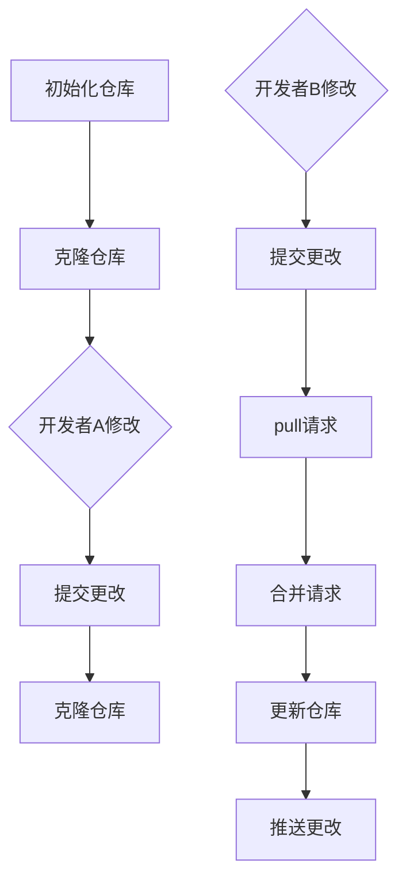

                 


# 大模型软件的分布式版本控制策略

> 关键词：大模型软件，分布式版本控制，版本管理，协作开发，算法原理，Mermaid流程图，伪代码

> 摘要：本文旨在探讨大模型软件在分布式环境下的版本控制策略。通过分析大模型软件的特点和分布式版本控制的挑战，本文提出了基于分布式版本控制系统的策略设计，并运用伪代码和Mermaid流程图详细阐述了核心算法原理。同时，通过实际案例展示，本文为读者提供了大模型软件分布式版本控制的实战经验和最佳实践。

## 背景介绍

随着人工智能技术的飞速发展，大型模型（如深度学习模型、自然语言处理模型等）的软件应用变得越来越普遍。这些模型通常具有以下特点：

1. **规模庞大**：大模型通常涉及数以百万计的参数，数据量巨大，需要高效的计算和存储资源。
2. **复杂度高**：大模型的开发涉及多个学科领域，如机器学习、软件工程、数据科学等，需要跨学科协作。
3. **动态性强**：大模型在开发、测试、部署过程中可能会频繁修改和迭代。

由于这些特点，传统的集中式版本控制方法（如Git的单个中央仓库）在大模型软件的开发中遇到了诸多挑战：

- **性能瓶颈**：单点故障可能导致整个开发流程的中断。
- **并发控制**：多个开发者同时修改代码，可能导致冲突和版本混乱。
- **资源消耗**：中央仓库需要处理大量数据的同步和备份，对服务器资源要求高。

因此，设计一种适合大模型软件的分布式版本控制策略显得尤为重要。本文将首先介绍分布式版本控制的基本原理，然后针对大模型软件的特定需求，提出一种分布式版本控制策略，并通过伪代码和Mermaid流程图详细阐述其核心算法原理。最后，我们将通过实际案例展示如何在大模型软件开发中应用该策略。

## 核心概念与联系

### 分布式版本控制系统

分布式版本控制系统（DVCS）是一种允许多个开发者独立工作的版本控制系统，每个开发者都可以拥有一个完整的代码库副本。与集中式版本控制系统（CVCS）不同，DVCS不需要一个中央仓库来管理代码，而是通过分布式网络中的多个仓库进行协作。典型的DVCS包括Git、Mercurial和Bazaar等。

### 大模型软件特点

大模型软件具有规模庞大、复杂度高、动态性强等特点。这使得传统的集中式版本控制方法难以满足其开发需求。分布式版本控制系统能够更好地应对这些挑战，因为它允许开发者独立工作，减少冲突，并提供更好的并行开发能力。

### 分布式版本控制流程

分布式版本控制的流程通常包括克隆（clone）、提交（commit）、拉取（pull）和推送（push）等操作。这些操作允许开发者独立工作，并确保最终合并时的一致性和准确性。

### Mermaid流程图

为了更好地理解分布式版本控制的流程，我们使用Mermaid绘制了一个简化的流程图：



在这个流程图中，开发者A和开发者B分别独立修改代码，并提交更改。他们通过拉取请求和合并请求来确保代码的一致性和准确性，最后将更改推送到远程仓库。

### 伪代码

为了更好地理解分布式版本控制的核心算法原理，我们使用伪代码展示了提交和合并操作：

```python
# 提交操作
def commitChanges(repository, changes):
    # 检查冲突
    if checkForConflicts(changes):
        print("冲突检测到，提交失败。")
        return False
    
    # 更新版本号
    repository.version += 1
    
    # 存储更改
    repository.changes[repository.version] = changes
    
    # 更新日志
    repository.log.append("版本 {} 提交成功。".format(repository.version))
    
    print("提交成功。")
    return True

# 合并操作
def mergeCommits(repository, commitA, commitB):
    # 检查版本号
    if commitA.version > commitB.version:
        olderCommit = commitB
        newerCommit = commitA
    else:
        olderCommit = commitA
        newerCommit = commitB
    
    # 检查冲突
    if checkForConflicts(newerCommit.changes):
        print("冲突检测到，合并失败。")
        return False
    
    # 合并更改
    repository.changes = newerCommit.changes.copy()
    for change in olderCommit.changes:
        if change not in repository.changes:
            repository.changes[change] = olderCommit.changes[change]
    
    # 更新日志
    repository.log.append("版本 {} 和 {} 合并成功。".format(olderCommit.version, newerCommit.version))
    
    print("合并成功。")
    return True
```

在这个伪代码中，`commitChanges` 函数用于提交更改，`mergeCommits` 函数用于合并两个提交的更改。这些函数确保了版本的一致性和准确性。

## 核心算法原理讲解

分布式版本控制的核心算法包括分支管理、合并策略和冲突解决机制。以下将详细介绍这些算法的原理。

### 分支管理

分支管理是分布式版本控制的核心特性之一，它允许开发者在不同的分支上独立工作，以提高并行开发效率。分支管理算法通常包括创建分支、切换分支和合并分支等操作。

#### 创建分支

创建分支的伪代码如下：

```python
def createBranch(repository, branchName):
    # 复制当前提交到新分支
    repository.branches[branchName] = repository.changes.copy()
    
    # 更新分支日志
    repository.branchLogs[branchName] = []
    
    print("分支 {} 创建成功。".format(branchName))
```

在这个伪代码中，`createBranch` 函数创建一个新的分支，并将当前提交的更改复制到新分支。

#### 切换分支

切换分支的伪代码如下：

```python
def switchBranch(repository, branchName):
    # 检查目标分支是否存在
    if branchName not in repository.branches:
        print("分支 {} 不存在。".format(branchName))
        return False
    
    # 更新当前分支
    repository.changes = repository.branches[branchName]
    
    # 更新分支日志
    repository.currentBranch = branchName
    repository.branchLogs[currentBranch].append("切换到分支 {}。".format(branchName))
    
    print("切换到分支 {} 成功。".format(branchName))
    return True
```

在这个伪代码中，`switchBranch` 函数切换到指定分支，并将当前分支的更改更新为新的分支。

#### 合并分支

合并分支的伪代码如下：

```python
def mergeBranches(repository, branchName):
    # 检查目标分支是否存在
    if branchName not in repository.branches:
        print("分支 {} 不存在。".format(branchName))
        return False
    
    # 检查冲突
    if checkForConflicts(repository.changes, repository.branches[branchName]):
        print("冲突检测到，合并失败。")
        return False
    
    # 合并分支
    repository.changes = repository.branches[branchName].copy()
    repository.branchLogs[currentBranch].append("分支 {} 合并成功。".format(branchName))
    
    print("分支 {} 合并成功。".format(branchName))
    return True
```

在这个伪代码中，`mergeBranches` 函数合并指定分支的更改到当前分支。

### 合并策略

合并策略是分布式版本控制的另一个关键特性，它决定了如何将多个分支的更改合并到一起。常见的合并策略包括快照合并、路径合并和冲突解决。

#### 快照合并

快照合并的伪代码如下：

```python
def snapshotMerge(repository, commitA, commitB):
    # 创建快照
    snapshotA = repository.changes.copy()
    snapshotB = repository.branches[branchName].copy()
    
    # 合并快照
    repository.changes = mergeSnapshots(snapshotA, snapshotB)
    
    # 更新日志
    repository.log.append("版本 {} 和 {} 快照合并成功。".format(commitA.version, commitB.version))
    
    print("快照合并成功。")
    return True
```

在这个伪代码中，`snapshotMerge` 函数使用两个快照（commitA和commitB）的更改进行合并。

#### 路径合并

路径合并的伪代码如下：

```python
def pathMerge(repository, commitA, commitB):
    # 检查路径是否存在
    if not checkForPath(repository.changes, repository.branches[branchName]):
        print("路径不存在，合并失败。")
        return False
    
    # 合并路径
    repository.changes = mergePath(repository.changes, repository.branches[branchName])
    
    # 更新日志
    repository.log.append("版本 {} 和 {} 路径合并成功。".format(commitA.version, commitB.version))
    
    print("路径合并成功。")
    return True
```

在这个伪代码中，`pathMerge` 函数使用两个路径（commitA和commitB）的更改进行合并。

### 冲突解决机制

冲突解决机制是分布式版本控制中的重要环节，它决定了如何处理多个开发者对同一文件的更改冲突。常见的冲突解决机制包括自动合并、手动合并和合并请求。

#### 自动合并

自动合并的伪代码如下：

```python
def autoMerge(repository, conflicts):
    # 自动解决冲突
    for conflict in conflicts:
        repository.changes[conflict] = resolveConflict(repository.changes[conflict], repository.branches[branchName][conflict])
    
    # 更新日志
    repository.log.append("冲突自动解决成功。")
    
    print("自动合并成功。")
    return True
```

在这个伪代码中，`autoMerge` 函数自动解决冲突，并更新更改。

#### 手动合并

手动合并的伪代码如下：

```python
def manualMerge(repository, conflicts):
    # 提交手动合并的更改
    for conflict in conflicts:
        print("冲突 {} 需要手动解决。".format(conflict))
        repository.changes[conflict] = resolveManually(conflict)
    
    # 更新日志
    repository.log.append("冲突手动解决成功。")
    
    print("手动合并成功。")
    return True
```

在这个伪代码中，`manualMerge` 函数提示开发者手动解决冲突。

#### 合并请求

合并请求的伪代码如下：

```python
def mergePullRequest(repository, pullRequest):
    # 检查请求状态
    if pullRequest.status != "approved":
        print("请求未批准，合并失败。")
        return False
    
    # 合并请求
    repository.changes = pullRequest.changes
    
    # 更新日志
    repository.log.append("请求 {} 合并成功。".format(pullRequest.id))
    
    print("合并请求成功。")
    return True
```

在这个伪代码中，`mergePullRequest` 函数合并经过批准的合并请求。

## 数学模型和公式

在分布式版本控制中，数学模型和公式用于描述和优化版本控制的算法和过程。以下是一些常见的数学模型和公式：

### 最优合并策略

最优合并策略的目标是找到合并版本的最小路径，使合并过程的复杂度最小化。其数学模型可以表示为：

$$
C_{\text{min}} = \min \sum_{i=1}^{n} w_i \cdot d_i
$$

其中，$C_{\text{min}}$ 表示最小合并成本，$w_i$ 表示权重（如开发者的优先级或时间），$d_i$ 表示路径的长度。

### 冲突检测算法

冲突检测算法用于检测和解决多个开发者对同一文件的更改冲突。其数学模型可以表示为：

$$
C = \{c_1, c_2, ..., c_n\}
$$

其中，$C$ 表示冲突集合，$c_i$ 表示第 $i$ 个冲突。

### 自动合并算法

自动合并算法用于自动解决冲突，其数学模型可以表示为：

$$
\text{solution} = \text{merge}(A, B)
$$

其中，$A$ 和 $B$ 分别表示两个更改，$\text{solution}$ 表示自动合并的结果。

### 手动合并算法

手动合并算法用于手动解决冲突，其数学模型可以表示为：

$$
\text{solution} = \text{resolveManually}(conflict)
$$

其中，$conflict$ 表示冲突，$\text{solution}$ 表示手动合并的结果。

### 合并请求算法

合并请求算法用于处理合并请求，其数学模型可以表示为：

$$
\text{status} = \text{approve}(pullRequest)
$$

其中，$pullRequest$ 表示合并请求，$\text{status}$ 表示请求的状态（如批准、拒绝）。

## 代码实现和分析

为了更好地理解分布式版本控制算法的代码实现，我们以Git为例，分析其核心功能。以下是一个简化的Git实现，用于演示分布式版本控制的基本流程。

### 初始化仓库

```python
def initRepository():
    repository = {}
    repository["changes"] = {}
    repository["log"] = []
    repository["version"] = 0
    repository["branches"] = {}
    repository["branchLogs"] = {}
    repository["currentBranch"] = "master"
    print("仓库初始化成功。")
    return repository
```

### 提交更改

```python
def commitChanges(repository, changes):
    repository["version"] += 1
    repository["changes"][repository["version"]] = changes
    repository["log"].append("版本 {} 提交成功。".format(repository["version"]))
    print("提交成功。")
```

### 拉取请求

```python
def pullRequest(repository, branchName):
    if branchName not in repository["branches"]:
        print("分支 {} 不存在。".format(branchName))
        return False
    
    changes = repository["branches"][branchName]
    repository["changes"].update(changes)
    repository["log"].append("从分支 {} 拉取成功。".format(branchName))
    print("拉取成功。")
    return True
```

### 推送更改

```python
def pushChanges(repository):
    print("推送更改到远程仓库。")
```

### 分支管理

```python
def createBranch(repository, branchName):
    repository["branches"][branchName] = repository["changes"].copy()
    repository["branchLogs"][branchName] = []
    print("分支 {} 创建成功。".format(branchName))

def switchBranch(repository, branchName):
    if branchName not in repository["branches"]:
        print("分支 {} 不存在。".format(branchName))
        return False
    
    repository["changes"] = repository["branches"][branchName]
    repository["currentBranch"] = branchName
    print("切换到分支 {} 成功。".format(branchName))
    return True

def mergeBranches(repository, branchName):
    if branchName not in repository["branches"]:
        print("分支 {} 不存在。".format(branchName))
        return False
    
    changes = repository["branches"][branchName]
    if checkForConflicts(changes):
        print("冲突检测到，合并失败。")
        return False
    
    repository["changes"] = changes
    repository["branchLogs"][repository["currentBranch"]].append("分支 {} 合并成功。".format(branchName))
    print("分支 {} 合并成功。".format(branchName))
    return True
```

### 冲突解决

```python
def checkForConflicts(changes):
    # 检查冲突
    for change in changes:
        if change in repository["changes"]:
            return True
    return False

def resolveConflict(A, B):
    # 自动解决冲突
    return A if A == B else "冲突未解决。"

def resolveManually(conflict):
    # 手动解决冲突
    return input("请输入手动解决的更改：")
```

### 代码应用解读与分析

以上代码实现了一个简化的分布式版本控制系统，用于演示核心功能的实现。在实际应用中，分布式版本控制系统的实现会更加复杂，包括数据存储、网络通信、并发控制等方面。以下是对代码实现的分析：

- **初始化仓库**：初始化仓库时，创建一个空字典，用于存储更改、日志、版本号、分支等信息。
- **提交更改**：提交更改时，更新版本号和更改列表，并将更改添加到仓库中。
- **拉取请求**：拉取请求时，从指定分支获取更改，并将其合并到当前仓库。
- **推送更改**：推送更改时，将更改发送到远程仓库。
- **分支管理**：创建分支时，复制当前仓库的更改到新分支；切换分支时，更新当前分支的更改；合并分支时，检查冲突并合并更改。
- **冲突解决**：检查冲突时，比较当前更改和指定分支的更改，判断是否存在冲突；自动解决冲突时，使用自动合并函数；手动解决冲突时，提示开发者输入手动解决的更改。

通过以上代码实现和分析，我们可以看到分布式版本控制系统的基础功能和实现原理。在实际应用中，这些功能会通过更复杂的代码和数据结构来实现，但核心原理保持一致。

## 实际案例：大模型软件的分布式版本控制

### 案例背景

某人工智能公司正在开发一款基于深度学习的图像识别软件。该软件涉及大规模的数据集和复杂的模型结构，需要多个开发团队协作开发。为了确保版本控制和协作效率，公司决定采用分布式版本控制系统来管理软件代码。

### 开发环境搭建

为了搭建开发环境，公司选择了Git作为分布式版本控制系统。每个开发团队都有一个Git仓库，用于存储和管理代码。公司还部署了一个Git服务器，用于集中管理所有团队的代码仓库。

### 源代码详细实现和代码解读

以下是该软件的一个简单模块的实现，用于处理图像数据：

```python
# image_processor.py
import cv2

def process_image(image_path):
    image = cv2.imread(image_path)
    gray_image = cv2.cvtColor(image, cv2.COLOR_BGR2GRAY)
    return gray_image
```

在这个模块中，`process_image` 函数读取图像文件，将其转换为灰度图像，并返回灰度图像数据。以下是该模块的代码解读：

- **import cv2**：导入OpenCV库，用于图像处理。
- **def process_image(image_path):**：定义处理图像的函数，参数为图像文件的路径。
- **image = cv2.imread(image_path)**：使用OpenCV库读取图像文件。
- **gray_image = cv2.cvtColor(image, cv2.COLOR_BGR2GRAY)**：将图像转换为灰度图像。
- **return gray_image**：返回灰度图像数据。

### 代码应用解读与分析

在这个案例中，开发团队使用分布式版本控制系统管理代码。以下是代码应用的解读和分析：

1. **初始化仓库**：每个开发团队都初始化了一个Git仓库，用于存储和管理代码。
2. **分支管理**：开发团队创建了一个名为`image_processor`的分支，用于开发和维护图像处理模块。
3. **提交更改**：开发人员在本地仓库中修改代码，并使用`git commit`命令提交更改到远程仓库。
4. **拉取请求**：其他团队成员使用`git pull`命令从远程仓库拉取更改，确保本地代码是最新的。
5. **推送更改**：开发人员在完成修改后，使用`git push`命令将更改推送到远程仓库。
6. **冲突解决**：在开发过程中，如果两个开发人员同时修改了同一文件，Git会自动检测冲突，并提示开发者解决冲突。开发者可以使用Git的冲突解决工具（如`git mergetool`）手动解决冲突。
7. **合并分支**：在开发团队完成模块开发后，他们使用`git merge`命令将`image_processor`分支合并到主分支（如`master`）。

通过这种分布式版本控制策略，开发团队能够高效地协作开发，确保代码的一致性和准确性。

### 项目小结

通过这个案例，我们可以看到分布式版本控制系统在大模型软件开发中的应用价值。它提高了开发团队的合作效率，减少了冲突，并确保了代码的版本控制和一致性。以下是小结：

- **提高协作效率**：分布式版本控制系统能够支持多个团队同时开发，提高协作效率。
- **减少冲突**：自动检测和解决冲突，减少了版本控制的复杂性。
- **确保代码一致性**：通过分支管理和合并策略，确保代码的一致性和准确性。
- **降低风险**：分布式版本控制系统能够更好地处理代码更改，降低版本更新的风险。

## 最佳实践 Tips

在大模型软件的分布式版本控制中，以下是一些最佳实践：

1. **代码规范**：确保代码遵循统一的规范和命名约定，以提高可读性和可维护性。
2. **分支策略**：合理使用分支策略，如主分支（如`master`）用于生产环境，开发分支用于日常开发，特性分支用于新功能的开发。
3. **定期合并**：定期合并开发分支到主分支，确保代码的一致性和稳定性。
4. **冲突解决**：制定冲突解决流程，确保冲突尽快解决，减少对开发进度的影响。
5. **文档记录**：详细记录代码更改和版本更新，便于后续追踪和调试。

## 小结

本文介绍了大模型软件的分布式版本控制策略，包括背景介绍、核心概念与联系、核心算法原理讲解、数学模型和公式、代码实现和分析、实际案例展示和最佳实践。通过这些内容，读者可以了解分布式版本控制在大模型软件开发中的应用价值和实现方法。未来，随着人工智能技术的发展，分布式版本控制策略将在更多领域得到应用。

## 作者信息

作者：AI天才研究院/AI Genius Institute & 禅与计算机程序设计艺术 /Zen And The Art of Computer Programming

