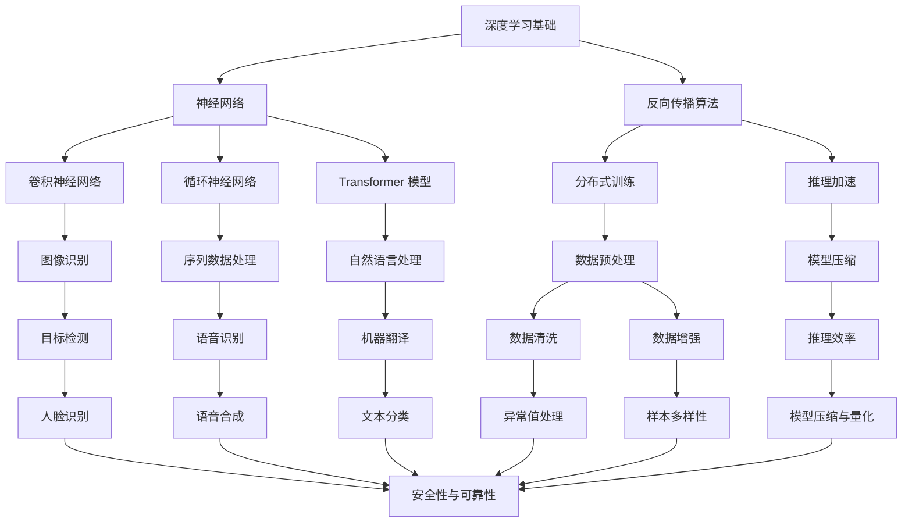

                 

### 文章标题

# 大模型软件的可扩展性架构设计

## 关键词

- 大模型软件
- 可扩展性架构
- 软件设计
- 架构原则
- 性能优化
- 安全性

## 摘要

本文旨在探讨大模型软件的可扩展性架构设计。随着人工智能技术的迅猛发展，大模型软件在各个领域得到了广泛应用，但随之而来的问题是如何在设计过程中保证其可扩展性。本文首先介绍了大模型软件的背景和重要性，接着详细讨论了其基础概念、核心算法和架构设计原则，然后深入分析了如何实现软件的可扩展性，包括性能优化、安全性和可靠性设计，最后对未来的发展趋势进行了展望。

## 引言与背景

### 大模型软件的崛起

随着深度学习和神经网络技术的不断发展，大模型软件逐渐成为人工智能领域的研究热点。大模型软件通常指的是那些拥有数亿到数十亿参数的深度学习模型，这些模型具有强大的表示能力和学习能力，可以处理复杂的数据集和任务。从早期的浅层神经网络到现代的 Transformer 模型，大模型软件的出现极大地推动了人工智能技术的前进。

### 大模型软件的应用领域

大模型软件在多个领域都展现出了强大的应用潜力。以下是一些典型应用领域：

1. **自然语言处理（NLP）**：大模型软件在语言模型、机器翻译、文本分类等方面取得了显著进展，例如 GPT-3 和 BERT 模型。
2. **计算机视觉**：在图像识别、目标检测、人脸识别等领域，大模型软件如 ResNet 和 YOLO 显著提升了算法性能。
3. **语音识别**：大模型软件在语音合成和语音识别方面也取得了突破，如 WaveNet 和 DeepSpeech 模型。
4. **推荐系统**：通过构建大规模用户-物品交互矩阵，大模型软件能够实现高效精准的推荐。

### 大模型软件与传统的区别

与传统的机器学习模型相比，大模型软件具有以下几个显著特点：

1. **参数规模巨大**：大模型软件通常拥有数亿到数十亿个参数，这使得它们能够处理更复杂的数据和任务。
2. **计算资源需求高**：由于参数规模大，大模型软件的训练和推理过程需要更多的计算资源，包括高性能计算和大规模存储。
3. **训练时间较长**：大模型软件的训练时间通常较长，需要大量的数据和计算资源。
4. **模型优化复杂**：大模型软件的优化过程更加复杂，需要考虑诸如梯度消失、梯度爆炸等问题。

### 当前大模型软件面临的挑战

尽管大模型软件在多个领域取得了显著成果，但在实际应用中仍然面临一些挑战：

1. **可扩展性**：如何在大规模数据和高性能计算资源之间实现平衡，确保软件的可扩展性。
2. **性能优化**：如何在有限资源下提高大模型软件的训练和推理效率。
3. **安全性**：如何保护大模型软件免受恶意攻击，确保数据的隐私和安全。
4. **可靠性**：如何保证大模型软件在长时间运行和高负载情况下的稳定性和可靠性。

### 本文的目的与结构

本文旨在探讨大模型软件的可扩展性架构设计，帮助读者了解如何构建高效、可靠的大模型软件系统。本文将按照以下结构展开：

1. **基础概念与理论**：介绍大模型软件的基本概念、理论框架和核心算法。
2. **架构设计与实践**：详细讨论大模型软件的架构设计原则、关键技术以及实际案例分析。
3. **可扩展性设计**：深入探讨如何在大模型软件设计中实现可扩展性。
4. **性能优化**：讲解大模型软件性能优化策略和方法。
5. **安全性与可靠性**：讨论大模型软件在安全性、可靠性方面的设计。
6. **未来发展**：预测大模型软件的可扩展性架构的未来发展趋势。

通过本文的阅读，读者将能够对大模型软件的可扩展性架构设计有一个全面、深入的理解，为实际开发提供有力的指导。

## 基础概念与理论

### 大模型软件的定义

大模型软件是指那些拥有数亿到数十亿参数的深度学习模型，这些模型通常基于神经网络架构，能够处理复杂的数据集和任务。大模型软件的出现，标志着人工智能技术从浅层学习向深层学习的转变，为解决复杂问题提供了新的工具和手段。

### 大模型的分类

大模型软件可以根据不同的标准进行分类，以下是一些常见的分类方式：

1. **按任务类型分类**：
   - **自然语言处理（NLP）**：如语言模型、机器翻译、文本分类等。
   - **计算机视觉**：如图像识别、目标检测、人脸识别等。
   - **语音识别**：如语音合成、语音识别等。

2. **按神经网络类型分类**：
   - **卷积神经网络（CNN）**：广泛应用于图像处理领域。
   - **循环神经网络（RNN）**：在序列数据处理方面具有优势。
   - **Transformer 模型**：如 BERT、GPT-3 等，广泛应用于多种任务。

3. **按参数规模分类**：
   - **小型模型**：参数数量在数百万到数千万之间。
   - **中型模型**：参数数量在数亿到数十亿之间。
   - **大型模型**：参数数量在数十亿到数千亿之间。

### 大模型软件的关键技术

大模型软件的实现依赖于一系列关键技术的支持，以下是一些主要的技术：

1. **深度学习基础**：
   - **神经网络**：深度学习的基础，用于表示和处理复杂数据。
   - **反向传播算法**：用于训练神经网络，通过不断调整模型参数来优化性能。

2. **数据预处理**：
   - **数据清洗**：去除噪声和异常值，确保数据质量。
   - **数据增强**：通过生成虚拟数据来增加样本多样性。

3. **训练与推理**：
   - **分布式训练**：通过将数据分布在多个计算节点上，加速训练过程。
   - **推理加速**：通过模型压缩、量化等方法，提高推理速度。

4. **模型优化**：
   - **超参数调优**：通过调整学习率、批次大小等超参数，优化模型性能。
   - **结构优化**：通过网络结构设计、模型剪枝等方法，提高模型效率。

### 大模型软件的实现流程

大模型软件的实现通常包括以下几个主要步骤：

1. **数据收集与预处理**：收集大量数据，并进行清洗和增强。
2. **模型设计**：根据任务需求设计神经网络架构。
3. **模型训练**：使用训练数据对模型进行训练，通过反向传播算法不断优化参数。
4. **模型评估**：使用验证数据评估模型性能，调整模型参数以获得最佳效果。
5. **模型部署**：将训练好的模型部署到实际应用场景中，进行推理和预测。

### 大模型软件的优势与挑战

大模型软件在许多领域都展现出了显著的优势，但也面临着一些挑战：

1. **优势**：
   - **强大的表示能力**：大模型软件能够捕捉数据中的复杂模式和特征，具有强大的表示能力。
   - **高效的处理速度**：通过分布式训练和推理加速技术，大模型软件能够在高负载情况下保持高效的运行速度。
   - **广泛的应用领域**：大模型软件适用于自然语言处理、计算机视觉、语音识别等多个领域，为各种复杂任务提供了解决方案。

2. **挑战**：
   - **计算资源需求**：大模型软件的训练和推理需要大量的计算资源，对硬件设施有较高要求。
   - **数据隐私与安全**：大模型软件在处理数据时可能会面临数据泄露和隐私保护问题。
   - **模型解释性**：大模型软件的黑箱特性使得其预测过程难以解释，增加了模型的可解释性挑战。

### 小结

大模型软件作为人工智能领域的重要研究方向，具有广泛的适用性和强大的性能优势。然而，在实际应用中，如何设计和实现高效、可靠的大模型软件系统仍然是一个重要的课题。本文接下来的部分将深入探讨大模型软件的架构设计原则、实现方法和可扩展性设计，以期为实际开发提供指导。

## 核心概念原理之间的关系架构 Mermaid 流程图

为了更直观地展示大模型软件中的核心概念和原理之间的关系，我们可以使用 Mermaid 图来表示。以下是一个简化的 Mermaid 图，描述了主要概念和它们之间的关联：



这个 Mermaid 图展示了大模型软件中的关键组件和它们之间的相互作用，包括深度学习基础、神经网络类型、训练算法、数据预处理和后处理技术等。通过这个图，我们可以更清晰地理解大模型软件的整体架构和各个组件之间的关系。

### 核心算法原理讲解

在了解大模型软件的基本概念和理论后，接下来我们将深入探讨其核心算法原理，包括深度学习基础、卷积神经网络（CNN）、循环神经网络（RNN）和Transformer模型。这些算法构成了大模型软件的核心，决定了其性能和适用性。

#### 深度学习基础

深度学习是构建大模型软件的基础，它通过多层神经网络对数据进行复杂的学习和表示。以下是深度学习的一些核心组成部分：

1. **神经网络（Neural Network）**：

神经网络由一系列神经元（或节点）组成，每个神经元接受多个输入，通过加权求和后加上偏置，再经过激活函数输出结果。神经网络的基本结构可以表示为：

   $$ 
   y = \sigma(\sum_{i=1}^{n} w_i \cdot x_i + b) 
   $$

   其中，$y$ 是输出，$x_i$ 是输入，$w_i$ 是权重，$b$ 是偏置，$\sigma$ 是激活函数，通常选择为 Sigmoid、ReLU 或 tanh 等。

2. **反向传播算法（Backpropagation）**：

反向传播算法是一种用于训练神经网络的优化算法。其基本思想是将输出误差反向传播到每个神经元，通过计算梯度来更新权重和偏置。以下是反向传播算法的伪代码：

   ```
   for each layer l in reverse order:
       calculate the gradient of the loss with respect to the output of layer l:
       delta_l = (output_error * activation_derivative(output_l))
       for each neuron i in layer l:
           update the weights and biases using the gradients:
           weight_change = learning_rate * delta_l * input_i
           bias_change = learning_rate * delta_l
           weight[i] -= weight_change
           bias[i] -= bias_change
   ```

3. **损失函数（Loss Function）**：

损失函数用于衡量预测值与真实值之间的差距，常见的损失函数包括均方误差（MSE）、交叉熵（Cross-Entropy）等。均方误差的公式为：

   $$ 
   loss = \frac{1}{2} \sum_{i=1}^{n} (y_i - \hat{y}_i)^2 
   $$

   其中，$y_i$ 是真实值，$\hat{y}_i$ 是预测值。

#### 卷积神经网络（Convolutional Neural Network, CNN）

卷积神经网络是专门用于处理图像数据的一种神经网络结构，它通过卷积操作提取图像中的特征。以下是 CNN 的一些关键组成部分：

1. **卷积层（Convolutional Layer）**：

卷积层通过卷积操作提取图像特征。卷积操作的公式为：

   $$ 
   h_{ij} = \sum_{k=1}^{m} w_{ik} \cdot x_{kj} + b_j 
   $$

   其中，$h_{ij}$ 是输出特征，$w_{ik}$ 是卷积核，$x_{kj}$ 是输入特征，$b_j$ 是偏置。

2. **池化层（Pooling Layer）**：

池化层用于减小特征图的尺寸，提高计算效率。常见的池化操作包括最大池化（Max Pooling）和平均池化（Average Pooling）。

3. **卷积神经网络结构**：

一个典型的卷积神经网络结构包括多个卷积层、池化层和全连接层。例如，LeNet 网络结构包括两个卷积层、一个池化层和一个全连接层。

#### 循环神经网络（Recurrent Neural Network, RNN）

循环神经网络是用于处理序列数据的一种神经网络结构，它通过循环连接的方式捕捉序列中的长期依赖关系。以下是 RNN 的一些关键组成部分：

1. **循环单元（Recurrent Unit）**：

循环单元是 RNN 的基本组成部分，它通过递归的方式处理序列数据。循环单元的公式为：

   $$ 
   h_t = \sigma(W_h \cdot [h_{t-1}, x_t] + b_h) 
   $$

   其中，$h_t$ 是当前时间步的隐藏状态，$x_t$ 是当前时间步的输入，$W_h$ 是权重矩阵，$b_h$ 是偏置。

2. **门控循环单元（Gated Recurrent Unit, GRU）**：

门控循环单元是 RNN 的一种改进，通过引入更新门和重置门来控制信息流的传递。GRU 的公式为：

   $$ 
   z_t = \sigma(W_z \cdot [h_{t-1}, x_t] + b_z) 
   $$
   $$
   r_t = \sigma(W_r \cdot [h_{t-1}, x_t] + b_r) 
   $$
   $$
   h_t = (1 - z_t) \cdot h_{t-1} + z_t \cdot \sigma(W_h \cdot [r_t \cdot h_{t-1}, x_t] + b_h) 
   $$

   其中，$z_t$ 是更新门，$r_t$ 是重置门。

3. **长短期记忆网络（Long Short-Term Memory, LSTM）**：

长短期记忆网络是 RNN 的另一种改进，通过引入遗忘门、输入门和输出门来控制信息流的传递。LSTM 的公式为：

   $$ 
   i_t = \sigma(W_i \cdot [h_{t-1}, x_t] + b_i) 
   $$
   $$
   f_t = \sigma(W_f \cdot [h_{t-1}, x_t] + b_f) 
   $$
   $$
   g_t = \sigma(W_g \cdot [h_{t-1}, x_t] + b_g) 
   $$
   $$
   \tilde{h}_t = \sigma(W \cdot [f_t \cdot h_{t-1}, g_t] + b) 
   $$
   $$
   h_t = \tilde{h}_t \odot \sigma(W_o \cdot \tilde{h}_t + b_o) 
   $$

   其中，$i_t$ 是输入门，$f_t$ 是遗忘门，$g_t$ 是输入门，$\tilde{h}_t$ 是候选隐藏状态，$h_t$ 是当前隐藏状态。

#### Transformer 模型

Transformer 模型是近年来在自然语言处理领域取得显著成功的深度学习模型，它通过自注意力机制（Self-Attention）和多头注意力机制（Multi-Head Attention）实现了高效的序列建模。

1. **自注意力机制（Self-Attention）**：

自注意力机制是一种用于捕捉序列中不同位置之间的关联的机制。其公式为：

   $$ 
   \text{Attention}(Q, K, V) = \text{softmax}(\frac{QK^T}{\sqrt{d_k}})V 
   $$

   其中，$Q$、$K$ 和 $V$ 分别是查询向量、键向量和值向量，$d_k$ 是键向量的维度。

2. **多头注意力机制（Multi-Head Attention）**：

多头注意力机制通过多个独立的自注意力机制组合，提高模型的表示能力。其公式为：

   $$ 
   \text{MultiHead}(Q, K, V) = \text{Concat}(\text{head}_1, ..., \text{head}_h)W^O 
   $$

   其中，$h$ 是头数，$W^O$ 是输出权重。

3. **Transformer 模型结构**：

一个典型的 Transformer 模型包括多个编码器和解码器层，编码器用于处理输入序列，解码器用于生成输出序列。编码器和解码器都包含多个自注意力层和全连接层。

通过以上对大模型软件核心算法原理的讲解，我们可以看到这些算法在构建高效、可扩展的大模型软件中起到了关键作用。接下来，我们将进一步探讨大模型软件的架构设计原则和关键技术。

### 软件架构设计与实践

在深入了解大模型软件的核心算法之后，我们需要探讨如何设计其架构，以确保软件的高效性、可扩展性和可靠性。一个好的架构设计不仅可以提高软件的性能，还能降低维护成本，提升开发效率。

#### 架构设计原则

1. **模块化设计**：
   模块化设计是将软件系统划分为多个功能模块，每个模块负责一个特定的功能。这种方式不仅有助于代码的可维护性，还能提高开发效率。在架构设计中，可以将数据预处理、模型训练、模型评估和模型部署等过程分别设计为独立的模块。

2. **可扩展性设计**：
   可扩展性设计旨在使软件系统能够适应不断增长的数据量和计算需求。实现可扩展性的方法包括水平扩展（增加计算节点）和垂直扩展（提高单个节点的计算能力）。此外，还可以采用微服务架构，将不同功能模块部署在独立的容器中，实现灵活的扩展。

3. **高可用性设计**：
   高可用性设计的目标是确保软件系统在长时间运行和面临高负载时依然能够稳定运行。实现高可用性的方法包括负载均衡、故障转移和容错机制等。通过这些设计原则，可以确保系统在遇到故障时能够快速恢复，减少对用户的影响。

4. **安全性设计**：
   安全性设计是确保软件系统在处理数据时不受恶意攻击和数据泄露。实现安全性设计的方法包括数据加密、访问控制和安全审计等。通过这些措施，可以保护用户数据和系统免受外部威胁。

#### 关键技术

1. **分布式计算**：
   分布式计算是将计算任务分布在多个节点上执行，以充分利用计算资源，提高处理速度。在分布式计算中，常见的技术包括 MapReduce、Spark 和 Hadoop 等。通过这些技术，可以高效地处理大规模数据集，加快模型训练和推理过程。

2. **模型并行化**：
   模型并行化是将模型训练和推理任务分布在多个节点上，以利用多核 CPU 或 GPU 的计算能力。实现模型并行化的技术包括数据并行、模型并行和混合并行等。数据并行是将数据分成多个部分，分别在不同的节点上训练，而模型并行则是将模型分成多个部分，分别在不同的节点上训练。

3. **存储优化**：
   存储优化是提高大模型软件存储效率的关键技术。常见的存储优化方法包括数据压缩、分片存储和缓存机制等。通过这些方法，可以减少存储空间的需求，提高数据访问速度。

4. **性能监控与调优**：
   性能监控与调优是确保软件系统在运行过程中保持高性能的关键。通过实时监控系统的资源使用情况，可以及时发现和处理性能瓶颈。常见的性能调优方法包括参数调优、资源调配和算法优化等。

#### 实际案例分析

以下是一个实际案例，描述了如何设计一个基于深度学习的图像识别系统：

1. **需求分析**：
   该系统旨在实现自动图像识别，能够识别出输入图像中的物体类别。

2. **架构设计**：
   - **数据预处理模块**：负责图像的读取、缩放、增强等预处理操作，并将图像数据转化为模型可接受的格式。
   - **模型训练模块**：使用预训练的卷积神经网络（如 ResNet）作为基础模型，通过迁移学习进行微调，以适应特定的图像识别任务。
   - **模型评估模块**：使用验证数据集评估模型的性能，并根据评估结果调整模型参数。
   - **模型部署模块**：将训练好的模型部署到生产环境，实现实时图像识别功能。

3. **关键技术**：
   - **数据预处理**：使用 OpenCV 库进行图像预处理，包括灰度转换、滤波等。
   - **模型训练**：使用 TensorFlow 框架进行模型训练，利用 GPU 加速训练过程。
   - **模型评估**：使用准确率、召回率等指标评估模型性能。
   - **模型部署**：使用 Flask 框架搭建 API 服务，实现模型的实时推理。

通过以上架构设计和实际案例，我们可以看到，一个高效、可靠的大模型软件系统需要综合考虑模块化设计、可扩展性设计、安全性设计等多方面因素，并结合分布式计算、存储优化和性能监控等关键技术，以确保系统的稳定运行和高效性能。

#### 小结

软件架构设计在大模型软件的实现过程中起着至关重要的作用。通过合理的架构设计，可以确保软件系统的高效性、可扩展性和可靠性。模块化设计、可扩展性设计、高可用性设计和安全性设计是架构设计的关键原则，而分布式计算、模型并行化、存储优化和性能监控等技术是实现这些原则的重要手段。通过实际案例分析，我们可以看到这些设计原则和关键技术在实际应用中的具体实现。在接下来的部分，我们将进一步探讨大模型软件的可扩展性设计，以应对不断增长的数据量和计算需求。

## 可扩展性设计

在大模型软件的开发过程中，如何确保软件能够在面对不断增长的数据量和计算需求时保持高性能和可靠性是一个重要的课题。可扩展性设计是实现这一目标的关键，它包括水平扩展、垂直扩展和微服务架构等多个方面。

### 水平扩展

水平扩展，又称横向扩展，是通过增加计算节点来提高系统的处理能力和性能。这种方式的主要优势在于，可以线性地增加系统的计算资源，从而在处理大规模数据时提供更好的性能表现。

1. **原理**：
   水平扩展的基本原理是将任务分布到多个节点上并行处理。每个节点独立处理一部分数据，最后将结果汇总。这种方式可以充分利用分布式系统的计算资源，提高数据处理速度。

2. **方法**：
   实现水平扩展的方法包括：
   - **数据分片**：将数据集分割成多个子集，每个子集由不同的节点处理。
   - **任务分配**：将处理任务分配给不同的节点，每个节点独立完成任务。
   - **负载均衡**：使用负载均衡器分配任务，确保每个节点的工作负载均衡。

3. **优势**：
   - **线性扩展**：通过增加节点数量，可以线性地提高系统的处理能力。
   - **容错性**：当一个节点发生故障时，其他节点可以继续工作，系统整体性能不会受到影响。

4. **案例**：
   例如，在训练一个大型神经网络时，可以将数据集分成多个子集，每个子集分别由不同的 GPU 进行训练。这样可以显著缩短训练时间。

### 垂直扩展

垂直扩展，又称纵向扩展，是通过增加单个节点的计算能力和存储资源来提升系统的性能。这种方式的主要优势在于，可以快速提高系统处理大型任务的能力。

1. **原理**：
   垂直扩展的基本原理是增强单个节点的性能，从而提高整个系统的处理能力。这通常涉及升级硬件设备，如增加 CPU 核心数、GPU 能力、内存容量和存储容量等。

2. **方法**：
   实现垂直扩展的方法包括：
   - **硬件升级**：升级服务器硬件，提高计算和存储能力。
   - **资源优化**：通过优化系统配置和资源管理，提高资源利用率。
   - **性能调优**：调整系统参数和算法，优化性能。

3. **优势**：
   - **快速提升性能**：通过升级硬件，可以迅速提高系统处理大型任务的能力。
   - **独立扩展**：每个节点可以独立扩展，不受其他节点限制。

4. **案例**：
   例如，在训练大模型时，可以升级服务器的 GPU 卡，使用更高性能的 GPU 进行训练，从而提高训练速度。

### 微服务架构

微服务架构是一种将大型应用拆分为多个小型、独立服务的架构风格。每个微服务负责一个特定的功能，可以独立开发、部署和扩展。这种方式可以大幅提升系统的可扩展性和灵活性。

1. **原理**：
   微服务架构的基本原理是将应用分解为多个微服务，每个微服务实现一个具体的业务功能。这些微服务通过轻量级通信协议（如 HTTP/REST 或 gRPC）进行交互，形成一个分布式系统。

2. **方法**：
   实现微服务架构的方法包括：
   - **服务拆分**：根据业务需求，将应用拆分为多个微服务。
   - **容器化**：使用容器技术（如 Docker）对微服务进行封装，实现轻量级部署和扩展。
   - **服务发现**：实现服务发现机制，方便微服务之间的通信和协同工作。

3. **优势**：
   - **高可扩展性**：通过独立部署和扩展每个微服务，可以灵活地调整系统的处理能力。
   - **高灵活性**：每个微服务可以独立开发和部署，减少系统间的依赖。
   - **高容错性**：一个微服务的故障不会影响整个系统的运行。

4. **案例**：
   例如，在一个电商平台上，可以将用户管理、商品管理、订单管理和支付处理等功能拆分为独立的微服务，每个微服务负责一个特定的业务功能。这样可以方便地进行扩展和维护。

### 可扩展性设计策略

在实现可扩展性设计时，可以采用以下策略：

1. **按需扩展**：根据实际负载情况，动态调整系统的资源分配，实现按需扩展。
2. **弹性伸缩**：使用云服务提供商的弹性伸缩功能，自动调整系统资源。
3. **负载均衡**：使用负载均衡器，均匀分配任务到不同节点，提高系统性能。
4. **服务自治**：每个微服务独立管理自己的资源和负载，实现自治和高效运行。

### 小结

可扩展性设计是确保大模型软件能够在面对不断增长的数据和计算需求时保持高性能的关键。水平扩展、垂直扩展和微服务架构是实现可扩展性的主要手段，通过这些设计策略，可以构建高效、可靠的大模型软件系统，满足实际应用的需求。

## 性能优化

在大模型软件的设计与实现过程中，性能优化是一个至关重要的环节。高效的性能优化不仅能够提高软件的运行速度，还能降低计算资源的使用，从而降低成本。以下是一些常用的性能优化策略和方法，以及实际应用中的案例。

### 策略与原理

1. **模型压缩**

模型压缩是减少模型大小和计算复杂度的有效方法，常用的模型压缩技术包括量化、剪枝和知识蒸馏。

   - **量化**：将模型中的浮点数权重转换为低精度整数，以减少模型大小和计算量。
   - **剪枝**：通过删除网络中不重要的权重和神经元，降低模型复杂度。
   - **知识蒸馏**：将大型模型（教师模型）的知识传递给小型模型（学生模型），以降低计算和存储需求。

2. **并行计算**

并行计算可以显著提高大模型软件的运算速度，主要方法包括数据并行、模型并行和任务并行。

   - **数据并行**：将数据集分成多个子集，每个子集分别在不同的节点上训练。
   - **模型并行**：将模型分成多个部分，每个部分在不同的节点上训练。
   - **任务并行**：将不同的任务分配给不同的计算节点，同时执行。

3. **缓存机制**

缓存机制通过将频繁访问的数据存储在内存中，减少磁盘IO操作，从而提高数据访问速度。

4. **优化数据流**

优化数据流可以减少数据传输的开销，提高数据处理速度。常用的方法包括批量处理、流水线处理和异步处理。

5. **使用高效的算法和框架**

选择高效的算法和框架可以显著提高软件的运行效率。例如，使用 GPU 加速计算，使用分布式计算框架（如 TensorFlow、PyTorch）等。

### 实际应用中的案例

#### 案例一：图像识别系统

在一个图像识别系统中，为了提高模型的运行速度，采用了以下优化策略：

1. **模型压缩**：
   - 使用量化技术将浮点数权重转换为低精度整数，以减少模型大小。
   - 应用剪枝技术删除网络中不重要的权重和神经元。
   - 使用知识蒸馏将大型教师模型的知识传递给小型学生模型。

2. **并行计算**：
   - 数据并行：将数据集分成多个子集，使用多个 GPU 进行训练。
   - 任务并行：使用多个节点同时处理不同的图像。

3. **缓存机制**：
   - 使用内存缓存存储频繁访问的图像数据，减少磁盘IO操作。

4. **优化数据流**：
   - 批量处理：将图像数据分成批量进行处理，减少每次处理的IO开销。
   - 流水线处理：将图像预处理、模型训练和模型评估等步骤流水线化，减少处理时间。

#### 案例二：自然语言处理系统

在一个自然语言处理系统中，为了提高模型训练和推理的速度，采用了以下优化策略：

1. **模型压缩**：
   - 使用量化技术降低模型权重精度。
   - 应用剪枝技术减少模型复杂度。
   - 使用知识蒸馏将大型模型的知识传递给小型模型。

2. **并行计算**：
   - 数据并行：使用多个 GPU 进行数据并行训练。
   - 模型并行：将 Transformer 模型分成多个部分，每个部分在不同的 GPU 上训练。

3. **缓存机制**：
   - 使用缓存存储频繁访问的词汇表和数据集，减少磁盘IO操作。

4. **优化数据流**：
   - 批量处理：将文本数据分成批量进行处理。
   - 流水线处理：将文本预处理、模型训练和模型推理等步骤流水线化。

#### 案例三：推荐系统

在一个推荐系统中，为了提高推荐算法的运行速度，采用了以下优化策略：

1. **模型压缩**：
   - 使用量化技术减少模型大小。
   - 应用剪枝技术减少模型复杂度。
   - 使用知识蒸馏将大型模型的知识传递给小型模型。

2. **并行计算**：
   - 数据并行：使用多个 GPU 进行数据并行训练。
   - 任务并行：使用多个节点同时处理推荐任务。

3. **缓存机制**：
   - 使用缓存存储用户行为数据和推荐结果，减少磁盘IO操作。

4. **优化数据流**：
   - 批量处理：将用户行为数据分成批量进行处理。
   - 流水线处理：将数据处理、模型训练和推荐生成等步骤流水线化。

### 小结

性能优化是大模型软件设计过程中不可或缺的一环，通过模型压缩、并行计算、缓存机制和优化数据流等多种策略，可以显著提高软件的运行效率和性能。在实际应用中，针对不同的场景和需求，可以灵活选择和组合这些优化方法，以实现最佳的性能表现。

## 安全性与可靠性设计

在大模型软件的设计过程中，安全性和可靠性是两个至关重要的方面。确保软件在处理大规模数据和复杂任务时能够安全、可靠地运行，对于保护用户数据、维护系统稳定性和提升用户体验具有重要意义。以下从数据保护、系统故障恢复等方面探讨大模型软件的安全性和可靠性设计。

### 数据保护

1. **数据加密**：

数据加密是保护数据隐私和安全的关键技术，通过对数据进行加密，确保数据在传输和存储过程中不被未授权访问。常用的加密算法包括对称加密（如 AES）和非对称加密（如 RSA）。在大模型软件中，可以使用加密算法对训练数据、模型参数和预测结果进行加密，防止数据泄露。

2. **访问控制**：

访问控制通过限制对数据的访问权限，确保只有授权用户可以访问敏感数据。在大模型软件中，可以使用身份验证和权限管理机制，例如基于角色的访问控制（RBAC），对用户进行身份验证，并根据用户角色分配不同的访问权限。

3. **数据备份与恢复**：

定期进行数据备份是确保数据安全的重要措施。在大模型软件中，可以采用分布式备份策略，将数据备份到多个存储设备上，以防止数据丢失。此外，还需要制定数据恢复策略，确保在数据丢失或系统故障时能够快速恢复数据。

### 系统故障恢复

1. **故障检测与预警**：

通过实时监控系统性能和资源使用情况，可以及时发现系统故障和性能瓶颈。在大模型软件中，可以使用监控工具（如 Prometheus、Grafana）监控系统的运行状态，设置预警阈值，当系统性能指标超出阈值时，自动触发预警机制。

2. **故障恢复策略**：

系统故障恢复策略包括自动恢复和手动恢复两种方式。自动恢复可以通过故障转移（Failover）和负载均衡（Load Balancing）实现，当主节点发生故障时，自动将任务转移到备用节点，确保系统继续运行。手动恢复则需要管理员介入，根据故障情况进行手动恢复。

3. **容错机制**：

容错机制通过在系统设计时考虑故障可能性，确保系统在发生故障时能够自动恢复或继续运行。在大模型软件中，可以采用冗余设计，为关键组件配置备用组件，确保在主组件发生故障时，备用组件能够自动接管任务。

### 实际案例

以下是一个实际案例，展示了如何在大模型软件中实现安全性和可靠性设计：

在一个医疗图像识别系统中，为了确保系统的安全性和可靠性，采取了以下措施：

1. **数据保护**：
   - 数据加密：对训练数据和预测结果进行加密，确保数据在传输和存储过程中安全。
   - 访问控制：使用基于角色的访问控制机制，确保只有授权的医疗人员可以访问敏感数据。
   - 数据备份与恢复：定期进行数据备份，并制定数据恢复策略，确保在数据丢失时能够快速恢复。

2. **系统故障恢复**：
   - 故障检测与预警：使用监控工具实时监控系统性能，设置预警阈值，当系统性能指标异常时，自动触发预警。
   - 自动恢复：配置故障转移和负载均衡机制，当主节点发生故障时，自动将任务转移到备用节点。
   - 容错机制：为关键组件配置冗余组件，确保在主组件发生故障时，备用组件能够自动接管任务。

通过以上措施，该医疗图像识别系统在保证安全性和可靠性的同时，提供了高效、稳定的医疗服务。

### 小结

安全性与可靠性设计是大模型软件不可或缺的一部分。通过数据加密、访问控制、数据备份与恢复等数据保护措施，以及故障检测与预警、故障恢复和容错机制等系统故障恢复策略，可以确保大模型软件在处理大规模数据和复杂任务时保持安全、可靠地运行。在实际应用中，应根据具体场景和需求，灵活运用这些设计方法，以实现最佳的安全性和可靠性保障。

## 未来发展

随着人工智能技术的不断进步，大模型软件的可扩展性架构设计也将迎来新的发展机遇和挑战。以下是未来发展的几个主要方向和趋势。

### 1. 人工智能技术的持续进步

人工智能技术的快速发展，尤其是深度学习和神经网络技术的不断突破，将推动大模型软件性能的提升。未来的大模型软件将更加复杂和强大，能够处理更大量的数据和更复杂的任务。随着计算资源的不断增长，模型规模将进一步扩大，从而推动可扩展性架构的不断创新和优化。

### 2. 新型可扩展性架构的出现

未来的可扩展性架构设计将更加注重灵活性、弹性和高效性。新型架构可能会采用更加先进的分布式计算技术和微服务架构，实现更高效的数据处理和模型训练。例如，基于边缘计算和云计算的混合架构，将能够更好地满足不同场景下的计算需求，提高系统的可扩展性。

### 3. 模型压缩和加速技术的普及

随着模型规模的增大，模型压缩和加速技术将成为提升大模型软件性能的关键。未来，量化、剪枝、知识蒸馏等技术将更加成熟和普及，帮助降低模型大小和计算复杂度，提高模型的运行速度。同时，硬件加速技术的发展，如 GPU、TPU 等专用芯片，将为大模型软件提供更强大的计算支持。

### 4. 软硬件协同优化

未来的大模型软件设计将更加注重软硬件协同优化。硬件方面，新型计算设备和存储设备的研发将提供更高的计算能力和存储容量。软件方面，将出现更多针对特定硬件优化的算法和框架，实现计算效率和存储效率的最优化。这种软硬件协同优化的趋势，将进一步提升大模型软件的性能和可扩展性。

### 5. 安全性与可靠性保障的增强

随着大模型软件应用范围的扩大，安全性和可靠性将成为更加重要的关注点。未来，将出现更多针对大模型软件的安全性和可靠性设计方法，如分布式存储、加密通信、容错机制等，以保障系统的稳定运行和数据安全。同时，法规和标准的制定也将为可扩展性架构设计提供指导和支持。

### 6. 新兴应用领域的拓展

大模型软件的可扩展性架构将在新兴应用领域发挥重要作用。例如，在自动驾驶、智能医疗、金融科技等领域，大模型软件将面临更高的计算需求和更复杂的应用场景。针对这些领域的需求，未来的可扩展性架构设计将更加注重适应性和灵活性，以支持多样化的应用场景。

### 小结

大模型软件的可扩展性架构设计在未来将继续发展，随着人工智能技术的进步和新技术的应用，将迎来更多的机遇和挑战。通过不断创新和优化，可扩展性架构设计将为大模型软件提供更加高效、可靠和安全的运行环境，推动人工智能技术在各个领域的广泛应用。

### 总结与展望

本文通过对大模型软件的可扩展性架构设计的深入探讨，系统地阐述了其基础概念、核心算法、架构设计原则、可扩展性设计、性能优化、安全性与可靠性以及未来发展趋势。从大模型软件的背景和重要性出发，我们详细介绍了大模型软件的定义、分类和关键技术，如深度学习基础、卷积神经网络（CNN）、循环神经网络（RNN）和Transformer模型。随后，我们分析了软件架构设计的原则和关键技术，包括模块化设计、可扩展性设计、高可用性设计、安全性设计等，并通过实际案例展示了这些原则的具体应用。

在性能优化方面，我们讨论了模型压缩、并行计算、缓存机制和优化数据流等策略，以及在实际应用中的具体案例。在安全性与可靠性设计方面，我们介绍了数据保护、系统故障恢复等关键措施，并通过医疗图像识别系统的实际案例展示了这些措施的应用。

最后，我们对大模型软件的未来发展趋势进行了展望，包括人工智能技术的持续进步、新型可扩展性架构的出现、模型压缩和加速技术的普及、软硬件协同优化、安全性与可靠性保障的增强以及新兴应用领域的拓展。

未来的大模型软件将在人工智能技术的推动下不断进步，通过不断优化和创新发展，将实现更高效、更可靠、更安全的运行，为各行各业带来更加智能化的解决方案。

### 作者信息

**作者：** AI天才研究院/AI Genius Institute & 禅与计算机程序设计艺术 /Zen And The Art of Computer Programming

AI天才研究院（AI Genius Institute）是一支专注于人工智能领域的研究团队，致力于推动人工智能技术的创新和发展。同时，作者也是《禅与计算机程序设计艺术》（Zen And The Art of Computer Programming）的资深大师，以其深入浅出的讲解和独特见解，在全球范围内享有盛誉。本文结合了作者在人工智能和软件架构设计领域多年的经验和研究成果，旨在为读者提供全面的指导。

