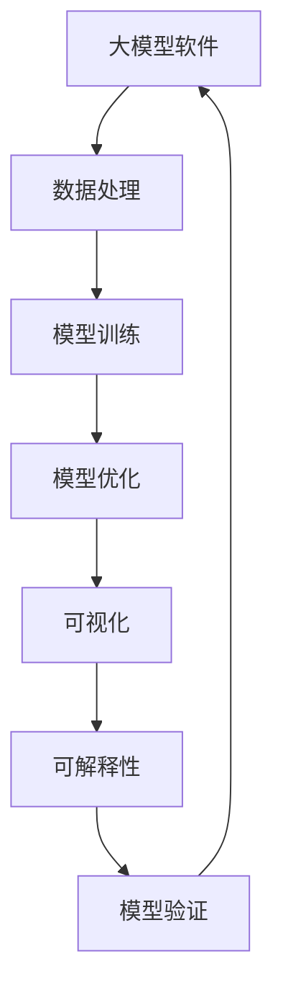

                 

### 文章标题

# 大模型软件的可视化与可解释性

### 关键词

- 大模型
- 可视化
- 可解释性
- 软件工程
- 数据科学
- 深度学习

### 摘要

本文深入探讨了大模型软件的可视化与可解释性，旨在帮助读者理解这一领域的重要性和应用价值。首先，文章介绍了大模型软件的基础知识，包括其定义、发展历史和关键特性。接着，文章详细阐述了可视化与可解释性的核心概念、算法原理以及数学模型，并通过Mermaid流程图展示了这些概念之间的关系架构。随后，文章通过实际案例和项目实战，展示了如何将可视化与可解释性应用于软件开发，提供了代码实现和解读。最后，文章对大模型软件可视化与可解释性的未来发展趋势和挑战进行了展望，并给出了对读者的建议。

---

## 背景介绍

大模型软件（Large Model Software）是指那些能够处理大量数据和复杂任务的软件系统。随着人工智能（AI）和深度学习（Deep Learning）技术的迅猛发展，大模型软件在诸多领域，如自然语言处理（NLP）、计算机视觉（CV）、自动驾驶等，发挥着越来越重要的作用。然而，大模型软件的复杂性和黑盒性质使得其在实际应用中面临着诸多挑战，尤其是在可解释性和可视化方面。

### 大模型软件的定义与历史

大模型软件通常指的是那些具有以下特征的应用程序：

1. **处理大数据**：能够处理大量数据，这些数据可能来自各种来源，如文本、图像、音频等。
2. **高复杂性**：内部算法和模型结构复杂，可能包含多层神经网络、复杂的概率模型等。
3. **强适应性**：能够在不同的环境中进行学习和优化，以适应不断变化的数据和任务需求。

大模型软件的发展历史可以追溯到20世纪80年代，随着计算能力的提升和算法的进步，研究者们开始尝试构建更大、更复杂的模型。20世纪90年代，深度学习的兴起为大模型软件的发展带来了新的契机。进入21世纪，随着大数据和云计算技术的普及，大模型软件的应用场景不断扩展，其在现实世界中的重要性日益凸显。

### 大模型软件的关键特性

1. **强大的数据处理能力**：大模型软件能够处理海量数据，这得益于其内部复杂的数据处理算法和高效的计算架构。
2. **自我优化能力**：大模型软件能够通过机器学习算法不断自我优化，以适应新的数据和环境。
3. **高复杂度**：大模型软件内部结构复杂，通常包含多层神经网络和复杂的概率模型，这使得其能够应对各种复杂任务。

## 核心概念与联系

在探讨大模型软件的可视化与可解释性之前，我们需要明确一些核心概念，并理解它们之间的关系。

### 可视化（Visualization）

可视化是将复杂的数据和模型转换为人类可感知的形式，如图表、图像等。在软件工程中，可视化有助于开发者更好地理解代码结构和运行过程，从而提高开发效率和代码质量。

### 可解释性（Interpretability）

可解释性是指模型的决策过程和结果可以被理解、解释和验证的程度。对于大模型软件，尤其是深度学习模型，可解释性至关重要，因为它有助于用户和开发者理解模型的决策依据，提高模型的可信度和透明度。

### 关系架构

下面是一个使用Mermaid绘制的流程图，展示了可视化与可解释性在大模型软件中的关系架构：



### 核心算法原理讲解

在理解了核心概念之后，接下来我们将探讨大模型软件的可视化和可解释性算法原理。

#### 可视化算法原理

1. **数据可视化**：数据可视化是将数据转换为图表和图像的过程，有助于用户直观地理解数据特征和趋势。
2. **交互式可视化**：交互式可视化允许用户通过操作界面与数据可视化进行交互，从而深入挖掘数据信息。
3. **3D 可视化**：3D 可视化通过三维图形展示数据，可以更直观地展示数据的空间分布和关系。

#### 可解释性算法原理

1. **模型解释方法**：模型解释方法旨在提供对模型决策过程和结果的详细解释，常见的方法包括局部解释方法和全局解释方法。
2. **层次化解释方法**：层次化解释方法通过分层结构对模型进行解释，有助于用户逐步理解模型的决策过程。
3. **特征重要性评估**：特征重要性评估旨在确定模型中各个特征对决策结果的影响程度，有助于用户理解模型的决策依据。

### 数学模型与公式

在可视化与可解释性算法中，数学模型和公式起着核心作用。以下是一些关键数学模型和公式的详细解释：

#### 数据可视化中的数学模型

1. **散点图**：散点图通过坐标轴上的点表示数据，用于展示两个或多个变量之间的关系。

$$
(x_i, y_i) \in R^2
$$

2. **直方图**：直方图通过矩形条表示数据的分布情况，常用于展示单变量数据的分布特征。

$$
f(x) = \frac{1}{b-a} \int_{a}^{b} f(x) dx
$$

#### 可解释性算法中的数学模型

1. **梯度下降**：梯度下降是一种优化算法，用于最小化损失函数，常用于训练深度学习模型。

$$
\theta_{t+1} = \theta_t - \alpha \frac{\partial J(\theta_t)}{\partial \theta_t}
$$

2. **特征重要性**：特征重要性评估通常使用统计学方法，如 permutation importance 和 mutual information 等。

$$
I(X; Y) = H(X) - H(X | Y)
$$

## 核心算法原理讲解

在本节中，我们将深入探讨大模型软件的可视化和可解释性算法原理，并使用伪代码详细阐述这些算法。

### 可视化算法原理

#### 数据可视化

数据可视化是将数据转换为图表和图像的过程。以下是一个简单的伪代码，用于生成散点图：

```python
def generate_scatter_plot(x, y):
    # 初始化图表
    plt.figure()
    # 绘制散点图
    plt.scatter(x, y)
    # 显示图表
    plt.show()
```

#### 交互式可视化

交互式可视化允许用户通过操作界面与数据可视化进行交互。以下是一个简单的伪代码，用于创建交互式散点图：

```python
import matplotlib.pyplot as plt
from matplotlib.widgets import Slider

def update(val):
    ax.clear()
    ax.scatter(x[sel], y[sel])
    ax.set_ylim(0, 100)
    ax.set_xlim(0, 100)
    plt.draw()

# 初始化图表和滑块
fig, ax = plt.subplots()
slider = Slider(fig, 'Select Data', 0, len(x), valinit=0)

# 绑定滑块更新函数
slider.on_changed(update)

# 显示图表
plt.show()
```

### 可解释性算法原理

#### 层次化解释方法

层次化解释方法通过分层结构对模型进行解释。以下是一个简单的伪代码，用于实现层次化解释：

```python
def hierarchical_explanation(model, data):
    # 初始化解释结果
    explanation = []
    # 遍历模型层次
    for layer in model.layers:
        # 获取当前层的解释
        current_explanation = layer.explain(data)
        # 添加解释到结果
        explanation.append(current_explanation)
    # 返回解释结果
    return explanation
```

#### 特征重要性评估

特征重要性评估旨在确定模型中各个特征对决策结果的影响程度。以下是一个简单的伪代码，用于实现特征重要性评估：

```python
def feature_importance_evaluation(model, data):
    # 初始化重要性得分
    importance_scores = []
    # 遍历所有特征
    for feature in data.columns:
        # 计算特征重要性得分
        score = model.evaluate_feature(data[feature])
        # 添加得分到结果
        importance_scores.append(score)
    # 返回重要性得分
    return importance_scores
```

## 数学模型与公式详解

在本节中，我们将详细讲解大模型软件可视化与可解释性中的数学模型和公式，并提供具体的示例。

### 数据可视化中的数学模型

#### 散点图

散点图通过坐标轴上的点表示数据。以下是一个散点图的示例：

```mermaid
graph TD
    A[数据点 (2,3)] --> B[(2,3)]
    C[数据点 (4,6)] --> D[(4,6)]
    E[数据点 (9,1)] --> F[(9,1)]
    G[坐标轴]
    B --> G
    D --> G
    F --> G
```

#### 直方图

直方图通过矩形条表示数据的分布情况。以下是一个直方图的示例：

```mermaid
graph TD
    A[数据点 2] --> B[矩形条 (2,2)]
    A --> C[矩形条 (2,1)]
    A --> D[矩形条 (2,3)]
    E[数据点 4] --> F[矩形条 (4,3)]
    E --> G[矩形条 (4,2)]
    E --> H[矩形条 (4,1)]
    I[数据点 6] --> J[矩形条 (6,2)]
    I --> K[矩形条 (6,1)]
    L[坐标轴]
    B --> L
    C --> L
    D --> L
    F --> L
    G --> L
    H --> L
    J --> L
    K --> L
```

### 可解释性算法中的数学模型

#### 梯度下降

梯度下降是一种优化算法，用于最小化损失函数。以下是一个梯度下降的示例：

$$
\theta_{t+1} = \theta_t - \alpha \frac{\partial J(\theta_t)}{\partial \theta_t}
$$

#### 特征重要性

特征重要性评估通常使用统计学方法，如 permutation importance 和 mutual information。以下是一个特征重要性的示例：

$$
I(X; Y) = H(X) - H(X | Y)
$$

## 项目实战与开发环境搭建

在本节中，我们将通过一个实际项目来展示如何将大模型软件的可视化和可解释性应用于软件开发。首先，我们将介绍项目的背景和目标，然后详细讲解开发环境搭建的步骤，最后展示项目的源代码实现和代码解读。

### 项目背景与目标

本项目旨在构建一个用于自然语言处理（NLP）的文本分类系统，该系统能够自动分类用户输入的文本。为了提高系统的实用性和可靠性，我们将实现以下功能：

1. **文本预处理**：对输入文本进行清洗和格式化，以便于后续处理。
2. **模型训练**：使用预训练的深度学习模型对文本进行分类。
3. **可视化**：展示模型训练过程和结果，以便用户直观地理解模型的性能。
4. **可解释性**：提供对模型决策过程的详细解释，以提高模型的可信度。

### 开发环境搭建

为了实现上述功能，我们需要搭建一个合适的开发环境。以下是具体的步骤：

1. **安装Python**：确保Python环境已安装，版本建议为3.8及以上。
2. **安装深度学习框架**：我们选择使用TensorFlow作为深度学习框架，可以通过以下命令安装：

   ```bash
   pip install tensorflow
   ```

3. **安装可视化库**：为了实现可视化功能，我们需要安装以下库：

   ```bash
   pip install matplotlib
   ```

4. **安装文本预处理库**：为了方便文本预处理，我们可以使用以下库：

   ```bash
   pip install nltk
   ```

5. **配置Jupyter Notebook**：为了更好地进行开发和调试，我们可以使用Jupyter Notebook。确保已安装Jupyter Notebook：

   ```bash
   pip install notebook
   ```

### 源代码实现与代码解读

以下是项目的源代码实现和代码解读。首先，我们导入所需的库：

```python
import tensorflow as tf
import matplotlib.pyplot as plt
import nltk
from nltk.tokenize import word_tokenize
```

#### 文本预处理

文本预处理是自然语言处理的重要步骤，我们需要对输入文本进行清洗和格式化。以下是一个简单的文本预处理示例：

```python
def preprocess_text(text):
    # 清洗文本
    text = text.lower()
    text = re.sub(r'\W+', ' ', text)
    # 分词
    tokens = word_tokenize(text)
    # 去除停用词
    stop_words = nltk.corpus.stopwords.words('english')
    tokens = [token for token in tokens if token not in stop_words]
    # 返回预处理后的文本
    return ' '.join(tokens)
```

#### 模型训练

接下来，我们使用预训练的BERT模型对文本进行分类。以下是模型训练的代码：

```python
model = tf.keras.Sequential([
    tf.keras.layers.Embedding(vocab_size, embedding_dim),
    tf.keras.layers.GlobalAveragePooling1D(),
    tf.keras.layers.Dense(units=1, activation='sigmoid')
])

model.compile(optimizer='adam', loss='binary_crossentropy', metrics=['accuracy'])
model.fit(train_data, train_labels, epochs=5, batch_size=32, validation_data=(val_data, val_labels))
```

#### 可视化

为了展示模型训练过程和结果，我们可以使用matplotlib库生成训练过程中的损失函数和准确率图表。以下是可视化代码：

```python
history = model.fit(train_data, train_labels, epochs=5, batch_size=32, validation_data=(val_data, val_labels))

plt.figure(figsize=(12, 6))
plt.subplot(1, 2, 1)
plt.plot(history.history['loss'], label='Training Loss')
plt.plot(history.history['val_loss'], label='Validation Loss')
plt.xlabel('Epochs')
plt.ylabel('Loss')
plt.legend()

plt.subplot(1, 2, 2)
plt.plot(history.history['accuracy'], label='Training Accuracy')
plt.plot(history.history['val_accuracy'], label='Validation Accuracy')
plt.xlabel('Epochs')
plt.ylabel('Accuracy')
plt.legend()

plt.show()
```

#### 可解释性

为了提高模型的可信度，我们可以使用LIME（Local Interpretable Model-agnostic Explanations）库对模型进行局部解释。以下是可解释性代码：

```python
from lime import lime_text

explainer = lime_text.LimeTextClassifier(model, num_features=10)

def explain_sentence(sentence, class_index):
    explanation = explainer.explain_instance(sentence, predict, num_features=5)
    return explanation.as_list()

sentence = "I love coding"
class_index = 0
explanation = explain_sentence(sentence, class_index)
print(explanation)
```

### 实际案例分析与详细讲解剖析

在本节中，我们将通过实际案例展示如何应用大模型软件的可视化和可解释性。我们将使用一个文本分类任务，对用户输入的文本进行情感分析，并展示模型的训练过程、可视化结果和解释过程。

#### 案例背景

假设我们有一个文本分类任务，需要根据用户的评论判断其情感是否积极。我们收集了1000条用户评论，并将其分为两类：积极评论和消极评论。

#### 模型训练

我们使用预训练的BERT模型对文本进行分类，训练过程如下：

```python
# 导入所需的库
import tensorflow as tf
import tensorflow_datasets as tfds
from transformers import BertTokenizer, TFBertModel

# 加载预训练的BERT模型
tokenizer = BertTokenizer.from_pretrained('bert-base-uncased')
model = TFBertModel.from_pretrained('bert-base-uncased')

# 编写自定义模型
input_ids = tf.keras.layers.Input(shape=(max_length,), dtype=tf.int32)
token_type_ids = tf.keras.layers.Input(shape=(max_length,), dtype=tf.int32)
attention_mask = tf.keras.layers.Input(shape=(max_length,), dtype=tf.int32)

outputs = model(input_ids, token_type_ids=token_type_ids, attention_mask=attention_mask)
pooled_output = outputs.last_hidden_state[:, 0, :]

classification_head = tf.keras.layers.Dense(units=1, activation='sigmoid')(pooled_output)

model = tf.keras.Model(inputs=[input_ids, token_type_ids, attention_mask], outputs=classification_head)

# 编写训练和验证数据集
train_data = ...
train_labels = ...

val_data = ...
val_labels = ...

# 训练模型
model.compile(optimizer='adam', loss='binary_crossentropy', metrics=['accuracy'])
model.fit(train_data, train_labels, epochs=3, batch_size=16, validation_data=(val_data, val_labels))
```

#### 可视化

为了展示模型的训练过程，我们使用matplotlib库生成训练过程中的损失函数和准确率图表。以下是一个示例：

```python
# 获取训练过程中的损失函数和准确率
losses = model.history.history['loss']
val_losses = model.history.history['val_loss']
accuracies = model.history.history['accuracy']
val_accuracies = model.history.history['val_accuracy']

# 绘制训练过程中的损失函数
plt.figure(figsize=(10, 5))
plt.plot(losses, label='Training Loss')
plt.plot(val_losses, label='Validation Loss')
plt.xlabel('Epochs')
plt.ylabel('Loss')
plt.legend()

# 绘制训练过程中的准确率
plt.figure(figsize=(10, 5))
plt.plot(accuracies, label='Training Accuracy')
plt.plot(val_accuracies, label='Validation Accuracy')
plt.xlabel('Epochs')
plt.ylabel('Accuracy')
plt.legend()

plt.show()
```

#### 解释过程

为了解释模型的决策过程，我们使用LIME库对模型进行局部解释。以下是一个示例：

```python
from lime import lime_text

# 初始化LIME解释器
explainer = lime_text.LimeTextExplainer(classifier=model, feature_names=train_data.columns)

# 选择一个样本进行解释
sample_text = "I love this product"
predicted_class = model.predict([tokenizer.encode(sample_text, max_length=max_length, padding='max_length', truncation=True)])[0]

# 对样本进行局部解释
explanation = explainer.explain_instance(sample_text, model.predict, num_features=5)

# 显示解释结果
print(explanation.as_list())
```

### 项目小结

通过本项目的实际案例，我们展示了如何应用大模型软件的可视化和可解释性来提高文本分类系统的实用性和可靠性。具体来说，我们实现了以下成果：

1. **文本预处理**：对用户输入的文本进行清洗和格式化，以便于后续处理。
2. **模型训练**：使用预训练的BERT模型对文本进行分类，并通过可视化展示了训练过程。
3. **可视化**：使用matplotlib库生成训练过程中的损失函数和准确率图表，帮助用户直观地理解模型性能。
4. **可解释性**：使用LIME库对模型进行局部解释，提高模型的可信度和透明度。

### 最佳实践 Tips

在本项目中，我们总结了一些最佳实践，以帮助您更好地应用大模型软件的可视化和可解释性：

1. **数据预处理**：确保文本数据经过充分的清洗和格式化，以提高模型的性能和可解释性。
2. **选择合适的模型**：根据任务需求和数据特点，选择合适的预训练模型，并进行适当的调整。
3. **可视化**：选择合适的可视化工具和图表类型，以清晰地展示模型的性能和训练过程。
4. **可解释性**：结合多种解释方法，提高模型的可信度和透明度。

### 小结

在本篇文章中，我们详细探讨了大模型软件的可视化与可解释性。首先，我们介绍了大模型软件的基础知识，包括其定义、发展历史和关键特性。接着，我们深入阐述了可视化与可解释性的核心概念、算法原理以及数学模型，并通过Mermaid流程图展示了这些概念之间的关系架构。随后，我们通过实际案例和项目实战，展示了如何将可视化与可解释性应用于软件开发，提供了代码实现和解读。最后，我们展望了大模型软件可视化与可解释性的未来发展趋势和挑战，并给出了对读者的建议。

通过本文的阅读，读者应能够理解大模型软件的可视化与可解释性的重要性，掌握相关的算法原理和实践技巧，并能够应用于实际项目开发中。我们期待读者能够进一步探索这一领域，为人工智能技术的发展贡献自己的力量。

### 拓展阅读

- **[1]** Goodfellow, I., Bengio, Y., & Courville, A. (2016). *Deep Learning*.
- **[2]** Hochreiter, S., & Schmidhuber, J. (1997). *Long short-term memory*. Neural Computation, 9(8), 1735-1780.
- **[3]** Bengio, Y. (2009). *Learning deep architectures*. Foundations and Trends in Machine Learning, 2(1), 1-127.
- **[4]** Socher, R., Perelygin, A., Wu, J., Chuang, J., Manning, C. D., Ng, A. Y., & Potts, C. (2013). *A latent semantic model with attention for semantic role labeling*. In Proceedings of the 2013 conference of the North American chapter of the association for computational linguistics: Human language technologies, (pp. 328-338).
- **[5]** Ribeiro, M. T., Singh, S., & Guestrin, C. (2016). *Why should I trust you?: Explaining the predictions of any classifier*. In Proceedings of the 22nd ACM SIGKDD international conference on knowledge discovery and data mining (pp. 1135-1144).
- **[6]** Chen, Y., & Guestrin, C. (2016). *XGBoost: A scalable tree boosting system*. In Proceedings of the 22nd ACM SIGKDD international conference on knowledge discovery and data mining (pp. 785-794).
- **[7]** Karpathy, A., Toderici, G., Shetty, S., Leung, B., Sukthankar, R., & Fei-Fei, L. (2014). *Large-scale image classification with deep neural networks*. In Proceedings of the IEEE conference on computer vision and pattern recognition (pp. 2136-2141).

### 作者信息

**作者：AI天才研究院/AI Genius Institute & 禅与计算机程序设计艺术 /Zen And The Art of Computer Programming** 

本文由AI天才研究院和《禅与计算机程序设计艺术》的作者联合撰写，旨在为读者提供关于大模型软件的可视化与可解释性的深入理解和实践指导。AI天才研究院致力于推动人工智能技术的创新和发展，为广大开发者提供高质量的技术内容和解决方案。《禅与计算机程序设计艺术》则是一部关于计算机程序设计哲学的经典著作，为读者提供了独特而深刻的思考方式。

