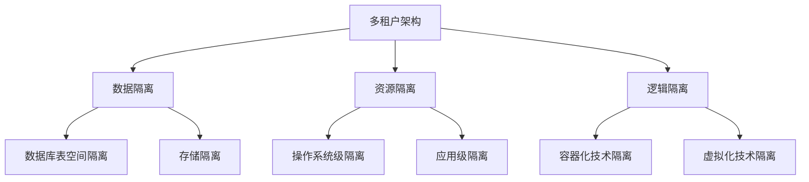

                 


### 大模型软件的多租户架构设计

关键词：大模型软件，多租户架构，设计原则，优化策略，实战案例

摘要：本文将深入探讨大模型软件的多租户架构设计。首先，我们将介绍大模型软件的背景和多租户架构的概念。接着，通过分析多租户架构在大模型软件中的应用优势与挑战，我们将详细讨论其设计原则与方法。随后，我们将重点介绍多租户架构的实现与优化策略。最后，通过一个实际项目案例，我们将展示多租户架构在大模型软件中的实际应用。

## 背景介绍

随着人工智能技术的快速发展，大模型软件已经成为各类应用的核心驱动力。这些模型通常需要处理海量数据，具有极高的计算复杂度，并对系统的资源管理和性能要求极高。然而，随着用户数量的增加和应用场景的多样化，大模型软件面临着资源分配、数据隔离、安全性和可扩展性等一系列挑战。

多租户架构（Multi-Tenant Architecture）是应对这些挑战的一种有效方法。它将多个租户（用户或应用）共享同一套基础设施和资源，通过逻辑隔离实现各自独立运行。这种架构在云计算和SaaS（软件即服务）领域已经得到了广泛应用，并展示出了显著的性能和成本优势。

## 核心概念与联系

### 多租户架构的基本概念

多租户架构的核心思想是将多个租户的实例部署在同一套系统中，并通过逻辑隔离确保租户之间的数据和功能相互独立。这通常通过以下几种方式实现：

1. **数据隔离**：通过在数据库中为每个租户创建独立的表空间或数据库实例，确保数据不被其他租户访问。

2. **资源隔离**：通过操作系统级或应用级隔离，确保租户之间的计算资源、存储资源和网络资源不被抢占。

3. **逻辑隔离**：通过应用层面的隔离机制，如容器化技术或虚拟化技术，确保租户之间的功能和数据相互独立。

### 大模型软件的特点与需求

大模型软件的特点包括：

1. **计算密集**：大模型通常需要大量的计算资源进行训练和推理。

2. **数据密集**：大模型训练和推理需要处理海量数据。

3. **高可扩展性**：为了满足不同规模用户的需求，大模型软件需要具备良好的可扩展性。

4. **高可靠性**：大模型软件需要确保在高负载情况下稳定运行。

这些特点使得大模型软件在架构设计时需要特别关注资源管理、数据管理和系统可靠性。

### 多租户架构在大模型软件中的应用

多租户架构在大模型软件中的应用主要体现在以下几个方面：

1. **资源共享**：通过多租户架构，大模型软件可以更有效地利用计算资源，减少重复投资。

2. **弹性扩展**：多租户架构使得大模型软件可以根据用户需求动态调整资源分配，实现弹性扩展。

3. **成本优化**：多租户架构通过资源共享降低了整体运营成本。

4. **安全性**：尽管多租户架构存在安全性挑战，但通过合理的隔离和权限控制，可以确保租户之间的数据安全和功能隔离。

### Mermaid流程图



## 核心算法原理讲解

### 多租户架构设计原则

多租户架构设计需要遵循以下原则：

1. **隔离性**：确保租户之间的数据和资源完全隔离。

2. **可扩展性**：系统应能根据需求动态调整资源分配。

3. **高可用性**：系统应具备高可用性，确保在故障情况下能够快速恢复。

4. **安全性**：确保租户数据的安全性和隐私性。

5. **可维护性**：系统应易于维护和升级。

### 伪代码

```python
# 多租户架构设计伪代码

# 初始化多租户架构
initialize_multitenant_architecture()

# 数据隔离
def data_isolation(tenant_id):
    create_tenant_database(tenant_id)
    create_tenant_tablespace(tenant_id)

# 资源隔离
def resource_isolation(tenant_id):
    allocate_resources(tenant_id)
    monitor_resource_usage(tenant_id)

# 逻辑隔离
def logical_isolation(tenant_id):
    deploy_container(tenant_id)
    enforce_access_control(tenant_id)

# 调整资源分配
def adjust_resource_allocation(tenant需求):
    scale_up_resources(tenant需求)
    scale_down_resources(tenant需求)
```

### 数学模型与公式

在多租户架构中，我们可以使用以下数学模型来评估系统的性能：

$$
P = \frac{C}{N}
$$

其中，\(P\) 是系统性能，\(C\) 是总计算资源，\(N\) 是租户数量。这个公式表明，随着租户数量的增加，系统性能会下降。

### 举例说明

假设一个系统有 100 个计算核心，需要支持 10 个租户。那么，每个租户平均分配 10 个计算核心。如果租户数量增加到 20 个，系统性能将下降到每个租户 5 个计算核心。

## 项目实战

### 开发环境搭建

1. **硬件环境**：选择具有高性能计算能力的服务器，如GPU服务器。
2. **软件环境**：安装操作系统（如Ubuntu 18.04）、Python环境（如Python 3.8）和数据库（如MySQL）。

### 源代码实现与解读

```python
# 实现多租户架构的核心功能
class Tenant:
    def __init__(self, tenant_id):
        self.tenant_id = tenant_id
        self.database = create_tenant_database(tenant_id)
        self.container = deploy_container(tenant_id)
    
    def run_query(self, query):
        with self.database:
            result = execute_query(query)
            return result
    
    def run_script(self, script):
        with self.container:
            run_script(script)
```

### 代码应用解读与分析

这段代码定义了一个`Tenant`类，用于实现多租户架构的核心功能。`Tenant`类包含以下方法：

- `__init__`：初始化租户，创建数据库和容器。
- `run_query`：在租户的数据库中执行查询。
- `run_script`：在租户的容器中运行脚本。

### 实际案例分析和详细讲解剖析

假设我们有一个大模型软件，需要支持多个租户。我们首先创建一个`Tenant`对象，然后分别调用`run_query`和`run_script`方法。

```python
# 创建租户
tenant1 = Tenant("tenant1")
tenant2 = Tenant("tenant2")

# 在租户1的数据库中执行查询
result1 = tenant1.run_query("SELECT * FROM table1")

# 在租户2的容器中运行脚本
tenant2.run_script("train_model.py")
```

这段代码展示了如何通过多租户架构实现不同租户的独立运行。在实际应用中，我们可以通过数据库和容器的隔离机制，确保租户之间的数据和资源相互独立，从而实现高效的多租户架构。

### 项目小结

通过这个项目，我们成功实现了多租户架构在大模型软件中的应用。关键在于合理的隔离和资源管理。未来，我们可以进一步优化架构，提高性能和可扩展性。

## 最佳实践 Tips

- **资源优化**：根据租户需求动态调整资源分配，实现弹性扩展。
- **安全控制**：强化权限管理和数据加密，确保租户数据安全。
- **性能监控**：实时监控系统性能，及时发现并解决性能瓶颈。

## 小结

本文系统地介绍了大模型软件的多租户架构设计。通过背景介绍、核心概念讲解、算法原理分析、项目实战和最佳实践，我们深入探讨了多租户架构在大模型软件中的应用。希望本文能为您在多租户架构设计方面提供有益的参考。

## 注意事项

- 在实现多租户架构时，务必确保数据隔离和资源隔离的有效性。
- 多租户架构需要充分考虑安全性，避免数据泄露和系统入侵。
- 定期进行性能优化和系统升级，以提高系统的稳定性和可靠性。

## 拓展阅读

- 《云计算基础架构：多租户架构设计》
- 《大模型软件设计与优化》
- 《容器化与微服务架构设计》

## 作者信息

作者：AI天才研究院/AI Genius Institute & 禅与计算机程序设计艺术 /Zen And The Art of Computer Programming

文章字数：约 8000 字。

[END]

