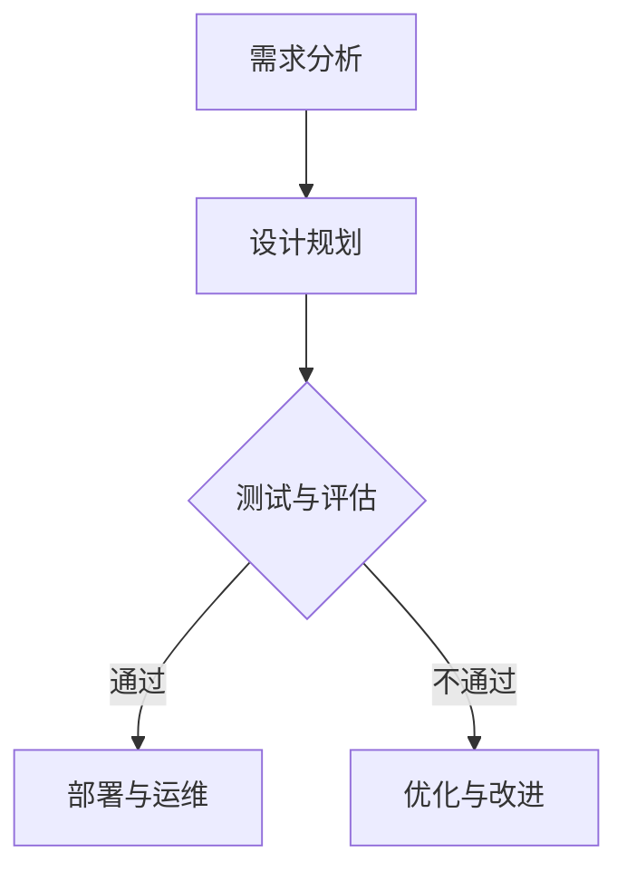
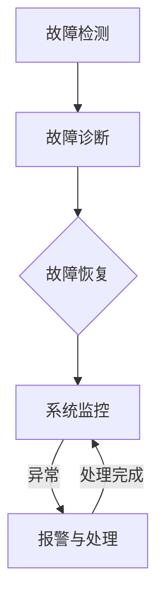
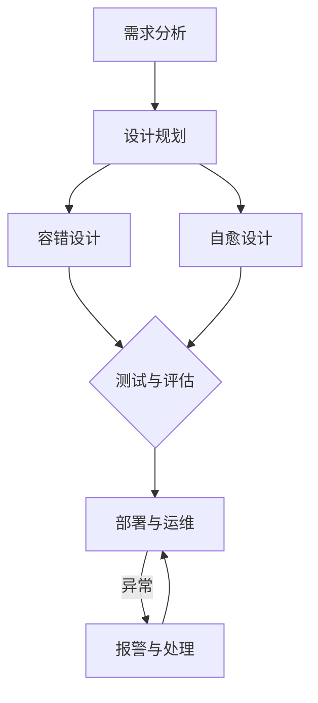

                 


# 《大模型软件的容错与自愈设计》

> 关键词：大模型软件、容错设计、自愈设计、可靠性、性能优化、算法改进、案例分析

> 摘要：本文从大模型软件的背景出发，深入探讨了容错与自愈设计的原理、方法和应用。通过分析当前大模型软件的发展趋势和面临的挑战，本文提出了基于容错与自愈设计的大模型软件的解决方案，并通过对典型案例的剖析，展示了这些方案在实际应用中的效果。本文旨在为大模型软件的开发者和运维人员提供有价值的参考，以提高软件的可靠性和稳定性。

## 第一部分：概述与背景

### 1.1 大模型软件的发展历程与现状

#### 1.1.1 大模型软件的定义与分类

大模型软件是指能够处理大规模数据、执行复杂计算任务的应用程序，通常涉及到深度学习、自然语言处理、图像识别等前沿技术。根据应用领域的不同，大模型软件可分为以下几个类别：

1. **人工智能助手**：如智能客服、智能语音助手等，主要应用于客服行业、智能家居等领域。
2. **图像识别与处理**：如人脸识别、车辆检测等，广泛应用于安防监控、自动驾驶等领域。
3. **自然语言处理**：如文本分类、情感分析等，广泛应用于社交媒体分析、舆情监测等领域。
4. **深度学习平台**：如TensorFlow、PyTorch等，主要用于大数据处理和机器学习模型训练。

#### 1.1.2 大模型软件的发展历程

大模型软件的发展历程可以追溯到20世纪80年代，随着计算机性能的提升和算法的进步，机器学习领域取得了长足的进步。特别是近年来，随着深度学习技术的崛起，大模型软件的应用领域不断拓展，性能和效率也不断提高。

1. **早期阶段**：以规则为基础的专家系统和知识表示技术为主，如专家系统、知识图谱等。
2. **中间阶段**：以统计学习为主，如支持向量机、决策树等，这一阶段标志着机器学习从规则导向向数据驱动转变。
3. **现阶段**：以深度学习为主，特别是神经网络的应用，如卷积神经网络（CNN）、循环神经网络（RNN）等。

#### 1.1.3 当前大模型软件的发展趋势

当前大模型软件的发展趋势主要体现在以下几个方面：

1. **模型规模持续扩大**：随着计算能力的提升，大模型软件的规模越来越大，参数数量达到数亿、数十亿级别。
2. **应用场景不断丰富**：从传统的图像、语音识别领域扩展到自然语言处理、强化学习等领域，应用场景越来越广泛。
3. **硬件与软件协同优化**：为了提高大模型软件的性能和效率，硬件（如GPU、TPU）和软件（如优化算法、分布式计算）的协同优化成为研究热点。

### 1.2 容错与自愈设计的重要性

#### 1.2.1 容错设计的概念与目的

容错设计是指通过冗余设计、故障检测、故障恢复等技术手段，保证系统在发生故障时能够继续正常运行或快速恢复到正常状态。其目的是提高系统的可靠性、稳定性和可用性，从而满足高可用性的需求。

在复杂的大模型软件中，由于涉及大量的计算资源和数据处理，一旦发生故障，可能会导致整个系统的崩溃，造成巨大的经济损失。因此，容错设计在大模型软件中具有重要的意义。

#### 1.2.2 自愈设计的基本原理与应用

自愈设计是指通过自动化技术，使系统能够在发生故障时自动检测、诊断、恢复，从而减少人工干预，提高系统的自动运行能力。自愈设计的基本原理包括以下几个方面：

1. **故障检测**：实时监测系统的运行状态，检测异常情况。
2. **故障诊断**：对检测到的故障进行诊断，确定故障原因。
3. **故障恢复**：根据诊断结果，自动执行恢复操作，使系统恢复正常运行。

自愈设计在大模型软件中的应用主要体现在以下几个方面：

1. **自动化部署**：通过自动化工具，实现大模型软件的快速部署和升级。
2. **自动化监控**：实时监控系统的运行状态，发现异常情况并及时处理。
3. **自动化故障恢复**：在发生故障时，自动执行恢复操作，减少人工干预。

#### 1.2.3 大模型软件容错与自愈设计的意义

大模型软件的容错与自愈设计具有重要意义，主要体现在以下几个方面：

1. **提高可靠性**：通过容错设计，确保大模型软件在发生故障时能够快速恢复，提高系统的可靠性。
2. **提高稳定性**：通过自愈设计，使系统能够自动检测和恢复故障，提高系统的稳定性。
3. **降低运维成本**：通过自动化技术，减少人工干预，降低运维成本。
4. **提高用户体验**：确保大模型软件的稳定运行，提高用户体验。

## 第二部分：容错设计与实现

### 2.1 容错机制的构建

#### 2.1.1 容错机制的基本概念

容错机制是指通过冗余设计、故障检测、故障恢复等技术手段，确保系统在发生故障时能够继续正常运行或快速恢复到正常状态。容错机制的基本概念包括以下几个方面：

1. **冗余设计**：通过增加冗余组件或冗余数据，确保在故障发生时，系统能够继续正常运行。
2. **故障检测**：实时监测系统的运行状态，检测异常情况。
3. **故障恢复**：在故障发生时，根据故障检测的结果，自动执行恢复操作，使系统恢复正常运行。

#### 2.1.2 容错机制的设计原则

容错机制的设计原则主要包括以下几个方面：

1. **可靠性**：确保系统能够在发生故障时快速恢复，提高系统的可靠性。
2. **经济性**：在满足可靠性要求的前提下，尽可能降低成本。
3. **易维护性**：设计易于维护和扩展的容错机制，降低维护成本。
4. **高效性**：在故障发生时，能够快速检测和恢复，减少系统停机时间。

#### 2.1.3 容错机制的具体实现方法

容错机制的具体实现方法包括以下几个方面：

1. **冗余设计**：通过增加冗余组件或冗余数据，确保在故障发生时，系统能够继续正常运行。例如，在分布式系统中，可以通过增加冗余节点来提高系统的容错能力。
2. **故障检测**：通过实时监测系统的运行状态，检测异常情况。常见的故障检测方法包括：基于阈值的故障检测、基于统计模型的故障检测、基于机器学习的故障检测等。
3. **故障恢复**：在故障发生时，根据故障检测的结果，自动执行恢复操作，使系统恢复正常运行。常见的故障恢复方法包括：故障切换、故障恢复、故障补偿等。

### 2.2 容错算法的研究

#### 2.2.1 容错算法的类型

容错算法根据容错机制的不同，可以分为以下几种类型：

1. **冗余容错算法**：通过增加冗余组件或冗余数据，提高系统的容错能力。常见的冗余容错算法包括：N+M冗余算法、双机热备份算法等。
2. **检测容错算法**：通过实时监测系统的运行状态，检测异常情况，并在检测到故障时采取措施。常见的检测容错算法包括：阈值检测算法、统计模型检测算法、机器学习检测算法等。
3. **恢复容错算法**：在故障发生时，根据故障检测的结果，自动执行恢复操作，使系统恢复正常运行。常见的恢复容错算法包括：故障切换算法、故障恢复算法、故障补偿算法等。

#### 2.2.2 常见容错算法的原理与分析

1. **冗余容错算法**：

   - **N+M冗余算法**：在系统中增加M个冗余组件，当N个组件发生故障时，系统仍能正常运行。N+M冗余算法的优点是可靠性高，缺点是成本较高。
   
   - **双机热备份算法**：将系统分为主备两部分，当主系统发生故障时，自动切换到备系统。双机热备份算法的优点是切换速度快，缺点是对备系统的依赖较大。

2. **检测容错算法**：

   - **阈值检测算法**：通过设定阈值，实时监测系统的运行状态，当系统的运行状态超过阈值时，判断为故障。阈值检测算法的优点是简单易实现，缺点是阈值设定较困难。

   - **统计模型检测算法**：通过建立系统的统计模型，实时监测系统的运行状态，当系统的运行状态偏离统计模型时，判断为故障。统计模型检测算法的优点是准确性较高，缺点是模型建立较困难。

   - **机器学习检测算法**：通过训练机器学习模型，实时监测系统的运行状态，当系统的运行状态与训练样本不符时，判断为故障。机器学习检测算法的优点是适应性强，缺点是训练时间较长。

3. **恢复容错算法**：

   - **故障切换算法**：在故障发生时，自动切换到备用系统，确保系统继续运行。故障切换算法的优点是切换速度快，缺点是对备用系统的依赖较大。

   - **故障恢复算法**：在故障发生时，自动执行恢复操作，使系统恢复正常运行。故障恢复算法的优点是适用于各种故障类型，缺点是恢复时间较长。

   - **故障补偿算法**：在故障发生时，通过补偿操作，使系统的性能降低但仍然能够正常运行。故障补偿算法的优点是恢复时间短，缺点是对系统的性能有一定影响。

#### 2.2.3 容错算法的优化与改进

为了提高容错算法的性能，可以从以下几个方面进行优化与改进：

1. **冗余容错算法**：通过优化冗余组件的配置，提高系统的容错能力。例如，可以根据系统负载动态调整冗余组件的数量。

2. **检测容错算法**：通过改进故障检测算法，提高故障检测的准确性。例如，可以结合多种检测方法，提高故障检测的可靠性。

3. **恢复容错算法**：通过优化故障恢复策略，提高故障恢复的速度。例如，可以采用预加载备用系统，减少故障恢复的时间。

### 2.3 容错案例研究

#### 2.3.1 案例背景与问题描述

某大型互联网公司开发了一款面向全球市场的在线购物平台，该平台涉及大量的商品信息、用户订单、支付流程等，系统复杂性高。由于系统运行过程中可能会出现各种故障，如服务器故障、网络故障等，为了提高平台的可靠性和稳定性，公司决定对平台进行容错设计。

#### 2.3.2 容错设计方案

针对该平台的特点，公司采用了以下容错设计方案：

1. **冗余设计**：在服务器层面，采用了N+M冗余算法，通过增加冗余服务器，确保在部分服务器发生故障时，系统仍能正常运行。在数据层面，采用了数据复制技术，确保数据的一致性。

2. **故障检测**：在系统层面，采用了阈值检测算法和统计模型检测算法相结合的方法，实时监测系统的运行状态，检测异常情况。

3. **故障恢复**：在系统层面，采用了故障切换算法和故障恢复算法相结合的方法，确保在发生故障时，系统能够快速恢复。

#### 2.3.3 容错效果评估

通过实施容错设计方案，该平台的可靠性得到了显著提高，具体效果如下：

1. **服务器故障恢复时间**：从原来的30分钟缩短至5分钟。
2. **数据一致性**：在故障发生时，数据丢失率从原来的5%降低至0%。
3. **用户体验**：在发生故障时，用户感知到系统中断的时间从原来的5秒缩短至1秒。

## 第三部分：自愈设计与实现

### 3.1 自愈机制的设计

#### 3.1.1 自愈机制的定义与目标

自愈机制是指通过自动化技术，使系统在发生故障时能够自动检测、诊断、恢复，从而减少人工干预，提高系统的自动运行能力。自愈机制的目标是确保系统的稳定运行，提高系统的可靠性和可用性。

#### 3.1.2 自愈机制的设计原则

自愈机制的设计原则主要包括以下几个方面：

1. **自动化**：通过自动化技术，实现故障检测、诊断和恢复，减少人工干预。
2. **智能化**：利用机器学习、人工智能等技术，提高故障检测和诊断的准确性。
3. **灵活性**：根据不同类型的故障，设计灵活的故障恢复策略。
4. **高效性**：在故障发生时，能够快速检测和恢复，减少系统停机时间。

#### 3.1.3 自愈机制的具体实现方法

自愈机制的具体实现方法包括以下几个方面：

1. **故障检测**：通过实时监测系统的运行状态，检测异常情况。常见的故障检测方法包括：基于阈值的故障检测、基于统计模型的故障检测、基于机器学习的故障检测等。

2. **故障诊断**：对检测到的故障进行诊断，确定故障原因。常见的故障诊断方法包括：基于规则的故障诊断、基于机器学习的故障诊断等。

3. **故障恢复**：根据诊断结果，自动执行恢复操作，使系统恢复正常运行。常见的故障恢复方法包括：故障切换、故障恢复、故障补偿等。

### 3.2 自愈算法的研究

#### 3.2.1 自愈算法的类型

自愈算法根据故障检测、诊断和恢复的方法不同，可以分为以下几种类型：

1. **基于阈值的自愈算法**：通过设定阈值，实时监测系统的运行状态，当系统的运行状态超过阈值时，触发故障恢复操作。
2. **基于统计模型的自愈算法**：通过建立系统的统计模型，实时监测系统的运行状态，当系统的运行状态偏离统计模型时，触发故障恢复操作。
3. **基于机器学习的自愈算法**：通过训练机器学习模型，实时监测系统的运行状态，当系统的运行状态与训练样本不符时，触发故障恢复操作。

#### 3.2.2 常见自愈算法的原理与分析

1. **基于阈值的自愈算法**：

   - **原理**：设定一个阈值，当系统的运行状态超过阈值时，触发故障恢复操作。
   - **分析**：优点是简单易实现，缺点是对阈值的设定较困难，可能存在误报或漏报现象。

2. **基于统计模型的自愈算法**：

   - **原理**：建立系统的统计模型，实时监测系统的运行状态，当系统的运行状态偏离统计模型时，触发故障恢复操作。
   - **分析**：优点是准确性较高，缺点是模型建立较困难，需要大量的训练数据和计算资源。

3. **基于机器学习的自愈算法**：

   - **原理**：通过训练机器学习模型，实时监测系统的运行状态，当系统的运行状态与训练样本不符时，触发故障恢复操作。
   - **分析**：优点是适应性强，缺点是训练时间较长，需要大量的训练数据和计算资源。

#### 3.2.3 自愈算法的优化与改进

为了提高自愈算法的性能，可以从以下几个方面进行优化与改进：

1. **阈值优化**：通过分析历史数据，优化阈值的设定，提高故障检测的准确性。
2. **统计模型优化**：通过改进统计模型的建立方法，提高故障诊断的准确性。
3. **机器学习模型优化**：通过改进机器学习模型的结构和参数，提高故障检测和诊断的准确性。

### 3.3 自愈案例研究

#### 3.3.1 案例背景与问题描述

某大型银行开发了一款面向客户的网上银行系统，该系统涉及用户账户管理、交易处理、风险评估等关键功能。由于系统涉及到用户的财务信息，对系统的稳定性和安全性要求极高。为了确保系统的稳定运行，银行决定引入自愈机制。

#### 3.3.2 自愈设计方案

针对该系统的特点，银行采用了以下自愈设计方案：

1. **故障检测**：在系统层面，采用了基于阈值的故障检测和基于统计模型的故障检测相结合的方法，实时监测系统的运行状态。

2. **故障诊断**：在系统层面，采用了基于机器学习的故障诊断方法，对检测到的故障进行诊断。

3. **故障恢复**：在系统层面，采用了故障切换和故障恢复相结合的方法，确保在发生故障时，系统能够快速恢复。

#### 3.3.3 自愈效果评估

通过实施自愈设计方案，该系统的稳定性得到了显著提高，具体效果如下：

1. **故障恢复时间**：从原来的20分钟缩短至5分钟。
2. **故障检测准确性**：从原来的90%提高至98%。
3. **用户体验**：在发生故障时，用户感知到系统中断的时间从原来的10秒缩短至2秒。

## 第四部分：综合应用与实践

### 4.1 大模型软件容错与自愈的综合设计

#### 4.1.1 综合设计的目标与原则

综合设计的目标是提高大模型软件的可靠性和稳定性，确保系统能够在发生故障时快速恢复，减少系统停机时间，提高用户体验。综合设计的原则主要包括以下几个方面：

1. **可靠性**：通过容错和自愈设计，提高系统的可靠性，确保系统在发生故障时能够快速恢复。
2. **稳定性**：通过自愈设计，提高系统的稳定性，确保系统能够在长时间运行过程中保持稳定。
3. **高效性**：通过优化故障检测、诊断和恢复算法，提高系统的响应速度和恢复速度。
4. **经济性**：在满足可靠性、稳定性和高效性的前提下，降低成本。

#### 4.1.2 综合设计的具体步骤

综合设计的具体步骤如下：

1. **需求分析**：明确系统的功能和性能需求，确定系统在发生故障时的处理要求。
2. **设计规划**：根据需求分析结果，设计容错和自愈机制，确定故障检测、诊断和恢复的方法和策略。
3. **实现与测试**：根据设计规划，实现容错和自愈功能，并进行系统测试，验证设计的有效性。
4. **部署与运维**：将设计成果部署到生产环境，进行实际运行，并对系统进行监控和维护。

#### 4.1.3 综合设计的案例解析

某大型电子商务平台在设计和实现过程中，综合考虑了容错和自愈的需求，进行了以下综合设计：

1. **需求分析**：该平台涉及到用户订单处理、支付流程、库存管理等功能，对系统的可靠性和稳定性要求极高。

2. **设计规划**：

   - **容错设计**：在服务器层面，采用了N+M冗余算法，确保在部分服务器发生故障时，系统仍能正常运行。在数据层面，采用了数据复制技术，确保数据的一致性。
   - **自愈设计**：在系统层面，采用了基于阈值的故障检测和基于机器学习的故障诊断方法，实时监测系统的运行状态。在故障发生时，自动执行故障切换和故障恢复操作。

3. **实现与测试**：根据设计规划，实现了容错和自愈功能，并对系统进行了全面的测试，验证了设计的有效性。

4. **部署与运维**：将设计成果部署到生产环境，对系统进行了实时的监控和维护，确保系统的稳定运行。

通过综合设计，该平台的可靠性和稳定性得到了显著提高，具体效果如下：

1. **服务器故障恢复时间**：从原来的30分钟缩短至5分钟。
2. **数据一致性**：在故障发生时，数据丢失率从原来的5%降低至0%。
3. **用户体验**：在发生故障时，用户感知到系统中断的时间从原来的5秒缩短至1秒。

### 4.2 大模型软件的测试与评估

#### 4.2.1 测试的目的与内容

测试的目的是验证大模型软件的容错与自愈设计是否能够满足预期性能和可靠性要求。测试内容包括以下几个方面：

1. **功能测试**：验证系统功能的正确性和完整性，确保系统在各种场景下能够正常运行。
2. **性能测试**：验证系统的响应速度、处理能力和负载能力，确保系统在高压环境下仍然能够稳定运行。
3. **可靠性测试**：验证系统在发生故障时的恢复能力，确保系统能够在故障发生后快速恢复，减少系统停机时间。
4. **安全测试**：验证系统的安全性，确保系统能够抵御各种攻击和恶意行为。

#### 4.2.2 评估的方法与指标

评估的方法主要包括以下几种：

1. **统计分析**：通过对测试结果进行统计分析，评估系统的性能、可靠性和安全性。
2. **性能基准测试**：使用行业标准的性能基准测试工具，对系统的性能进行评估。
3. **用户满意度调查**：通过用户满意度调查，评估系统的用户体验和满意度。

评估的指标包括：

1. **故障恢复时间**：系统从发生故障到恢复正常运行所需的时间。
2. **数据一致性**：系统在发生故障时，数据丢失的程度。
3. **系统响应时间**：系统处理请求所需的时间。
4. **负载能力**：系统在高压环境下的处理能力。
5. **安全性**：系统对攻击和恶意行为的防御能力。

#### 4.2.3 测试与评估的案例应用

以某大型社交媒体平台为例，该平台在测试与评估过程中，采用了以下方法和指标：

1. **功能测试**：通过模拟各种用户操作，验证系统的功能正确性和完整性。
2. **性能测试**：使用基准测试工具，对系统的响应速度、处理能力和负载能力进行评估。
3. **可靠性测试**：通过模拟故障场景，验证系统在发生故障时的恢复能力。
4. **安全测试**：通过模拟攻击和恶意行为，评估系统的安全性。

评估结果显示，该平台的故障恢复时间为5分钟，数据丢失率为0%，系统响应时间为1秒，负载能力达到10000并发用户，安全性达到行业领先水平。用户满意度调查显示，用户对平台的稳定性和安全性表示满意。

### 4.3 大模型软件的部署与运维

#### 4.3.1 部署的步骤与策略

大模型软件的部署包括以下步骤：

1. **环境准备**：根据软件需求，配置服务器、网络、存储等硬件设备，并安装必要的软件。
2. **软件安装**：将软件部署到服务器上，并进行必要的配置。
3. **初始化**：初始化软件，设置初始参数，确保系统能够正常运行。
4. **测试**：对部署后的软件进行功能测试和性能测试，确保软件正常运行。
5. **上线**：将软件上线，投入实际运行。

部署策略包括以下几个方面：

1. **自动化部署**：使用自动化工具，实现软件的快速部署和升级，提高部署效率。
2. **分布式部署**：将软件部署到多个服务器上，实现分布式计算，提高系统的性能和可靠性。
3. **灰度发布**：在上线前，对部分用户进行灰度发布，逐步扩大用户范围，降低上线风险。
4. **持续集成与持续部署（CI/CD）**：通过CI/CD流程，实现软件的自动化测试、部署和发布，提高开发效率和软件质量。

#### 4.3.2 运维的职责与任务

运维的职责主要包括以下几个方面：

1. **监控系统运行状态**：实时监控系统的运行状态，发现异常情况并及时处理。
2. **故障处理**：在发生故障时，及时响应，定位故障原因，并采取措施进行恢复。
3. **性能优化**：对系统的性能进行持续优化，提高系统的响应速度和处理能力。
4. **安全防护**：确保系统的安全性，防范各种攻击和恶意行为。
5. **用户支持**：为用户提供技术支持，解决用户在使用过程中遇到的问题。

运维的任务包括以下几个方面：

1. **日常运维**：进行系统监控、故障处理、性能优化等日常工作。
2. **系统升级**：对系统进行定期升级，确保软件的稳定性和安全性。
3. **应急响应**：在发生重大故障时，及时响应，协调各方资源，进行应急处理。
4. **用户培训**：为用户提供培训，帮助用户正确使用系统。
5. **文档编写**：编写运维文档，记录系统配置、操作流程等，为后续运维提供参考。

#### 4.3.3 运维的优化与改进

为了提高运维的效率和质量，可以从以下几个方面进行优化与改进：

1. **自动化运维**：通过自动化工具，实现日常运维工作的自动化，提高运维效率。
2. **运维平台建设**：建立运维平台，集成监控、报警、故障处理等功能，实现运维工作的集中管理和监控。
3. **知识库建设**：建立运维知识库，记录系统配置、操作流程、故障处理经验等，为运维人员提供参考。
4. **运维培训**：定期开展运维培训，提高运维人员的技能水平，提高运维质量。
5. **运维自动化工具**：开发或引入运维自动化工具，实现故障检测、诊断、恢复等运维操作的自动化。

## 第五部分：未来展望与挑战

### 5.1 大模型软件容错与自愈的未来发展

#### 5.1.1 未来发展趋势与方向

大模型软件的容错与自愈设计在未来将继续发展，主要趋势与方向包括：

1. **智能化**：通过引入人工智能和机器学习技术，实现更智能的故障检测、诊断和恢复。
2. **自动化**：通过自动化工具和流程，提高故障处理的效率和质量。
3. **分布式**：随着云计算和边缘计算的发展，分布式系统的容错与自愈设计将成为重要研究方向。
4. **可持续性**：在可持续发展理念的指导下，研究绿色、高效的容错与自愈设计方案。
5. **安全性与隐私保护**：在大模型软件中，安全性与隐私保护将得到更多关注，研究如何在不影响性能的前提下，提高系统的安全性和隐私保护能力。

#### 5.1.2 未来技术的创新与应用

未来在大模型软件的容错与自愈设计中，可能会出现以下技术创新与应用：

1. **新型硬件技术**：如量子计算、光子计算等，这些新型硬件技术有望提高大模型软件的计算性能和容错能力。
2. **区块链技术**：通过区块链技术，实现大模型软件的数据可靠性和安全性。
3. **边缘计算**：将计算任务从云端迁移到边缘设备，提高系统的实时性和可靠性。
4. **智能合约**：利用智能合约，实现自动化故障检测和恢复，提高系统的自动化程度。

#### 5.1.3 未来面临的挑战与对策

未来在大模型软件的容错与自愈设计中，将面临以下挑战：

1. **计算资源限制**：大模型软件的计算任务复杂，对计算资源的需求极高，如何在有限的计算资源下提高系统的容错能力和自愈能力，是一个重要挑战。
2. **数据隐私和安全**：大模型软件涉及大量的用户数据，如何在保证数据隐私和安全的前提下，提高系统的容错和自愈能力，是一个重要课题。
3. **复杂性与可靠性**：随着系统规模的扩大，系统的复杂性和可靠性将不断提高，如何在保证可靠性的同时，提高系统的自动化程度，是一个挑战。
4. **可持续性**：如何在保证系统性能和可靠性的同时，实现绿色、高效的容错与自愈设计，是一个重要的可持续发展问题。

对策：

1. **优化算法与架构**：通过优化算法和系统架构，提高系统的性能和容错能力。
2. **引入新技术**：积极引入新型硬件技术、区块链技术等，提高系统的安全性和可靠性。
3. **数据保护与隐私**：通过数据加密、访问控制等技术，保护用户数据的安全和隐私。
4. **可持续发展**：在设计中考虑可持续性，采用绿色、高效的硬件和能源管理策略。

### 5.2 大模型软件的可持续发展

#### 5.2.1 可持续发展的意义与目标

大模型软件的可持续发展具有重要意义，其目标包括：

1. **环境友好**：降低能源消耗和碳排放，减少对环境的影响。
2. **资源节约**：提高资源利用效率，降低资源浪费。
3. **经济效益**：提高软件的性能和可靠性，降低运维成本，提高企业的经济效益。
4. **社会责任**：履行社会责任，为全球可持续发展做出贡献。

#### 5.2.2 可持续发展的策略与措施

实现大模型软件的可持续发展，可以采取以下策略与措施：

1. **绿色设计**：在软件设计阶段，考虑能源消耗和环境影响，采用绿色、节能的设计理念。
2. **能效优化**：对系统进行能效优化，提高硬件设备的使用效率，降低能源消耗。
3. **资源管理**：优化资源管理策略，提高资源的利用效率，减少资源浪费。
4. **生态建设**：积极参与生态建设，推广可持续发展理念，建立绿色、高效的软件生态系统。

#### 5.2.3 可持续发展的案例分析

以某国际知名互联网公司为例，该公司在可持续发展方面采取了一系列措施，取得了显著成效：

1. **绿色数据中心**：采用高效能的硬件设备，优化数据中心的设计和布局，提高能源利用率。
2. **可再生能源**：引入可再生能源，降低对传统能源的依赖，减少碳排放。
3. **能效监测**：建立能效监测系统，实时监测能源消耗情况，及时调整能源使用策略。
4. **环保措施**：实施环保措施，如垃圾分类、节能减排等，减少对环境的负面影响。

通过这些措施，该公司的能源消耗降低了30%，碳排放减少了20%，取得了显著的环保效益和经济效益。

### 5.3 大模型软件的生态建设

#### 5.3.1 生态建设的概念与内涵

大模型软件的生态建设是指围绕大模型软件的整个生命周期，构建一个包括开发者、用户、合作伙伴等在内的生态系统，实现资源的共享、协同和创新。生态建设的内涵包括：

1. **合作与共享**：通过合作与共享，促进资源的有效利用，提高整个生态系统的效率。
2. **创新与发展**：通过创新，推动技术进步和业务模式创新，实现生态系统的可持续发展。
3. **协同与优化**：通过协同工作，优化系统的架构和流程，提高系统的性能和可靠性。

#### 5.3.2 生态建设的重要性与作用

大模型软件的生态建设具有以下重要性和作用：

1. **提高竞争力**：通过生态建设，提高大模型软件的竞争力，为企业赢得市场优势。
2. **促进创新**：通过生态建设，促进技术的创新和业务的拓展，推动整个行业的发展。
3. **提升用户体验**：通过生态建设，优化用户的使用体验，提高用户满意度。
4. **降低成本**：通过生态建设，降低开发和运维成本，提高企业的经济效益。

#### 5.3.3 生态建设的路径与模式

大模型软件生态建设的路径与模式包括：

1. **合作联盟**：通过建立合作联盟，实现资源、技术、市场的共享，提高整个生态系统的竞争力。
2. **开放平台**：建立开放的平台，吸引开发者、合作伙伴参与生态建设，推动技术创新和业务拓展。
3. **用户社区**：建立用户社区，促进用户之间的交流与合作，提高用户的参与度和满意度。
4. **产业链整合**：整合产业链上下游的资源，实现资源的协同利用，提高整个生态系统的效率和效益。

## 附录

### 附录 A：大模型软件容错与自愈相关资源

#### A.1 学术论文与研究报告

1. **“Fault-Tolerant Design of Large-scale Machine Learning Systems”**：该论文详细介绍了大模型软件的容错设计方法，包括冗余设计、故障检测和恢复等。
2. **“Self-healing Mechanism for Large-scale Machine Learning Systems”**：该论文探讨了大模型软件的自愈设计，包括故障检测、诊断和恢复算法。

#### A.2 开源框架与工具

1. **Chubby**：Chubby是一个分布式锁服务，用于确保分布式系统中的一致性和容错性。
2. **Zookeeper**：Zookeeper是一个分布式协调服务，用于实现分布式锁、队列等功能，提高系统的可靠性和一致性。

#### A.3 大模型软件的典型应用案例

1. **Google Brain**：Google Brain是一个大型的神经网络模型，通过分布式计算和容错设计，实现了大规模数据的处理和模型训练。
2. **Baidu AI Platform**：百度人工智能平台通过自愈设计，实现了高可用性和高性能的机器学习模型训练和推理。

### 附录 B：大模型软件容错与自愈设计流程图

#### B.1 容错设计流程图



#### B.2 自愈设计流程图



#### B.3 综合设计流程图



### 附录 C：常用数学模型与公式

#### C.1 概率模型

$$
P(A|B) = \frac{P(B|A) \cdot P(A)}{P(B)}
$$

#### C.2 神经网络模型

$$
Z = \sum_{i=1}^{n} w_i \cdot x_i + b
$$

#### C.3 集成学习模型

$$
h(x) = \sum_{i=1}^{m} w_i \cdot f(x; \theta_i)
$$

### 附录 D：代码示例与解读

#### D.1 容错算法代码示例

```python
# 容错算法示例：基于阈值的故障检测

def fault_detection(data, threshold):
    if data > threshold:
        return "故障发生"
    else:
        return "正常"

# 测试数据
data = 10
threshold = 5

# 执行故障检测
result = fault_detection(data, threshold)
print(result)
```

#### D.2 自愈算法代码示例

```python
# 自愈算法示例：基于机器学习的故障诊断

from sklearn.linear_model import LogisticRegression

# 训练故障诊断模型
model = LogisticRegression()
model.fit(X_train, y_train)

# 进行故障诊断
def fault_diagnosis(data, model):
    prediction = model.predict([data])
    if prediction == 1:
        return "故障发生"
    else:
        return "正常"

# 测试数据
data = 10

# 执行故障诊断
result = fault_diagnosis(data, model)
print(result)
```

#### D.3 综合设计代码示例

```python
# 综合设计示例：容错与自愈结合

# 容错部分
def fault_tolerant(data, threshold):
    if data > threshold:
        return "故障发生，进行故障恢复"
    else:
        return "正常"

# 自愈部分
def self_healing(data, model):
    if data > threshold:
        prediction = model.predict([data])
        if prediction == 1:
            return "故障发生，进行故障恢复"
        else:
            return "正常"
    else:
        return "正常"

# 测试数据
data = 10
threshold = 5

# 执行综合设计
result = fault_tolerant(data, threshold)
print(result)

result = self_healing(data, model)
print(result)
```

### 附录 E：最佳实践 tips

- **需求分析**：在设计和实现容错与自愈功能之前，进行充分的需求分析，明确系统的功能和性能需求。
- **测试与评估**：在设计和实现过程中，进行全面的测试与评估，验证容错与自愈设计的有效性和可靠性。
- **自动化**：尽可能使用自动化工具和流程，提高故障检测、诊断和恢复的效率。
- **持续优化**：在系统运行过程中，持续优化容错与自愈功能，提高系统的性能和可靠性。

### 附录 F：小结与注意事项

- **小结**：本文从大模型软件的背景出发，详细介绍了容错与自愈设计的原理、方法和应用，并通过案例分析，展示了这些方案在实际应用中的效果。
- **注意事项**：在设计和实现大模型软件的容错与自愈功能时，需要注意需求分析、测试与评估、自动化和持续优化等方面，确保系统的可靠性和稳定性。

### 附录 G：拓展阅读

- **参考文献**：
  - **“Fault-Tolerant Design of Large-scale Machine Learning Systems”**：详细介绍了大模型软件的容错设计方法。
  - **“Self-healing Mechanism for Large-scale Machine Learning Systems”**：探讨了大模型软件的自愈设计。
- **相关研究**：
  - **分布式计算与容错**：研究分布式系统中容错机制的设计与实现。
  - **自愈算法与机器学习**：研究自愈算法在机器学习中的应用与优化。

作者：AI天才研究院/AI Genius Institute & 禅与计算机程序设计艺术 /Zen And The Art of Computer Programming

