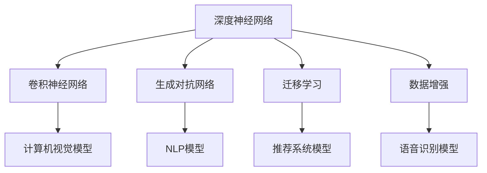

                 

### 引言

在现代人工智能领域，大模型软件已经成为了一种不可或缺的技术工具。随着深度学习和大数据技术的飞速发展，大模型软件在自然语言处理、图像识别、推荐系统等众多领域中展现出了卓越的性能。然而，随着模型规模的不断扩大，大模型软件的性能瓶颈也逐渐显现出来。如何对大模型软件进行有效的性能分析与优化，成为了当前研究和应用中的一个重要课题。

本文旨在探讨大模型软件的性能分析与优化技术，通过系统地介绍大模型软件的性能分析方法和优化策略，帮助读者深入了解大模型软件的性能优化原理，掌握性能优化的实用技巧。文章将分为以下几个部分：

1. **大模型软件概述**：介绍大模型软件的基本概念、发展历程、分类及其核心概念的联系。
2. **大模型软件的性能分析**：讲解大模型软件性能分析的基础知识、常见性能指标以及性能分析算法。
3. **大模型软件的优化技术**：探讨大模型软件优化技术的概述、常见优化算法、调参技巧以及优化效果评估。
4. **大模型软件的数学模型**：介绍大模型软件相关的数学模型和数学公式，并进行详细讲解和举例说明。
5. **大模型软件的项目实战**：通过实际案例，展示如何在大模型软件中应用性能分析与优化技术。
6. **大模型软件的性能优化案例**：分析几个典型的性能优化案例，进行详细讲解和剖析。
7. **大模型软件的性能优化趋势与展望**：探讨大模型软件性能优化的发展趋势以及未来的挑战与机遇。

通过本文的阅读，读者将能够全面了解大模型软件的性能分析与优化技术，掌握如何在实际项目中应用这些技术，从而提升大模型软件的性能和效果。接下来，我们将首先介绍大模型软件的基本概念和发展历程。

### 大模型软件的基本概念

大模型软件是指那些能够处理大规模数据、具有高度复杂性的模型软件。这类模型通常包含数十亿甚至数万亿个参数，能够通过对海量数据的训练，实现非常复杂的任务，如自然语言处理、图像识别和推荐系统等。

**大模型软件的发展历程**

大模型软件的发展历程可以追溯到20世纪80年代，当时研究人员开始尝试使用神经网络来解决复杂的分类和预测问题。然而，由于计算能力和数据量的限制，早期的神经网络模型规模相对较小，参数数量通常在数千到数万个之间。随着计算机技术的不断进步和大数据时代的到来，神经网络模型得到了迅速的发展，参数数量和训练数据规模也逐渐扩大。

在21世纪初，深度学习技术的突破使得大模型软件的可行性得到了极大的提升。2006年，Geoffrey Hinton等人提出了深度信念网络（Deep Belief Networks，DBN），这是一种能够自动学习多层特征的神经网络结构。随后，Hinton等人在2009年利用更大的数据集和更强的计算能力，成功训练出了第一个大规模神经网络——深度卷积神经网络（Deep Convolutional Neural Network，DCNN），这一成果标志着大模型软件的崛起。

进入2010年代，随着GPU（图形处理器）在深度学习计算中的应用，大模型软件的规模和性能得到了进一步提升。2012年，Alex Krizhevsky等人利用GPU加速训练的DCNN在ImageNet图像识别挑战中取得了突破性的成绩，这一成就不仅推动了深度学习技术的发展，也为大模型软件的广泛应用奠定了基础。

近年来，大模型软件在自然语言处理、计算机视觉和推荐系统等领域的应用越来越广泛。例如，OpenAI的GPT系列模型、谷歌的BERT模型等，都是具有数十亿参数的大规模语言模型，它们在文本生成、机器翻译、问答系统等方面展现出了惊人的性能。此外，Facebook的PyTorch和谷歌的TensorFlow等深度学习框架的成熟，也为大模型软件的开发和应用提供了强有力的技术支持。

**大模型软件的分类与特点**

大模型软件根据应用领域和任务类型的差异，可以分为多种类型。以下是几种常见的大模型软件分类：

1. **自然语言处理（NLP）模型**：这类模型主要用于处理文本数据，如语言模型、文本分类模型、机器翻译模型等。它们通常具有数十亿甚至数万亿个参数，能够对大量文本数据进行精细的语义理解和生成。

2. **计算机视觉模型**：这类模型主要用于处理图像数据，如卷积神经网络（CNN）、生成对抗网络（GAN）等。它们通常需要处理高维图像数据，参数数量庞大，计算复杂度高。

3. **推荐系统模型**：这类模型主要用于构建个性化推荐系统，如基于内容的推荐、协同过滤推荐等。这些模型通常使用用户和物品的交互数据来训练，参数数量和计算复杂度也相对较高。

4. **语音识别模型**：这类模型主要用于处理语音数据，如自动语音识别（ASR）模型、语音合成（TTS）模型等。这些模型通常需要结合声学模型和语言模型，参数数量和计算量也非常大。

大模型软件具有以下特点：

- **高参数数量**：大模型软件通常包含数十亿甚至数万亿个参数，这使得它们能够学习到更复杂的特征和模式。
- **大规模数据训练**：大模型软件通常需要使用海量的训练数据来学习，以提高模型的性能和泛化能力。
- **计算复杂度高**：由于参数数量庞大，大模型软件的训练和推理过程通常需要大量的计算资源，对硬件设备有较高要求。
- **对数据质量和标注依赖强**：大模型软件的性能和效果很大程度上依赖于训练数据的质量和标注的准确性。

**核心概念与联系**

为了更好地理解大模型软件，我们需要了解以下几个核心概念：

- **深度神经网络（DNN）**：深度神经网络是一种具有多个隐藏层的神经网络，能够通过多层次的非线性变换学习到复杂的特征表示。
- **卷积神经网络（CNN）**：卷积神经网络是一种专门用于处理图像数据的神经网络，通过卷积操作和池化操作提取图像特征。
- **生成对抗网络（GAN）**：生成对抗网络是一种通过对抗性训练生成数据的方法，由生成器和判别器两个神经网络组成，通过不断博弈提升生成器的生成能力。
- **迁移学习**：迁移学习是一种将已训练模型的知识迁移到新任务上的方法，能够加快新任务的训练速度并提高模型的性能。
- **数据增强**：数据增强是一种通过变换原始数据生成新的数据样本来扩充训练数据集的方法，能够提高模型的泛化能力。

以下是这些核心概念之间的联系架构（Mermaid流程图）：



通过上述内容，我们对大模型软件的基本概念、发展历程、分类和核心概念的联系有了初步的了解。接下来，我们将深入探讨大模型软件的性能分析，包括性能分析的基础知识、常见性能指标以及性能分析算法。

### 大模型软件的性能分析

大模型软件的性能分析是确保其在实际应用中能够高效运行的关键步骤。性能分析涉及多个方面，包括系统资源利用、训练和推理效率、以及模型准确性和稳定性等。下面我们将详细探讨大模型软件性能分析的基础知识、常见性能指标以及性能分析算法。

#### 性能分析的基础知识

性能分析是指通过测量和评估系统在不同工作条件下的表现，来识别系统瓶颈和优化机会的过程。对于大模型软件来说，性能分析尤为重要，因为其通常需要处理海量数据和复杂的计算任务。性能分析的基础知识包括以下几个方面：

1. **测量指标**：性能分析需要使用一系列指标来衡量系统性能，如响应时间、吞吐量、资源利用率等。这些指标有助于识别系统的性能瓶颈和优化方向。
2. **系统监控**：性能分析需要对系统进行实时监控，收集各种性能数据，如CPU使用率、内存占用、网络延迟等。这些数据可以通过各种系统监控工具（如Prometheus、Grafana等）进行收集和分析。
3. **负载生成**：为了评估系统在不同负载条件下的性能，需要生成模拟负载。这可以通过自动化测试工具（如JMeter、Locust等）来实现。
4. **性能调优**：性能分析的结果需要用于指导系统的性能调优，包括调整配置、优化代码、改进数据结构等。

#### 常见性能指标

在大模型软件的性能分析中，常见性能指标包括以下几种：

1. **响应时间**：响应时间是指系统从接收到请求到返回响应所需要的时间。对于大模型软件，响应时间是一个重要的性能指标，因为它直接影响到用户体验。
   
   伪代码示例：
   ```python
   def calculate_response_time(start_time, end_time):
       return end_time - start_time
   ```

2. **吞吐量**：吞吐量是指系统在一定时间内能够处理的请求数量。对于大模型软件，吞吐量通常以每秒请求数（Requests per Second，RPS）来衡量。

   伪代码示例：
   ```python
   def calculate_throughput(total_requests, time_taken):
       return total_requests / time_taken
   ```

3. **资源利用率**：资源利用率是指系统资源（如CPU、内存、网络等）的使用率。高资源利用率可能意味着系统性能瓶颈，需要进一步优化。

   伪代码示例：
   ```python
   def calculate_resource_utilization(used_resources, total_resources):
       return used_resources / total_resources
   ```

4. **延迟**：延迟是指请求从发送到收到响应所经历的时间。对于大模型软件，延迟通常包括网络延迟、服务器处理延迟等。

   伪代码示例：
   ```python
   def calculate_delay(network_delay, processing_delay):
       return network_delay + processing_delay
   ```

#### 性能分析算法

性能分析不仅依赖于性能指标，还需要使用算法来评估系统的性能。以下是一些常用的性能分析算法：

1. **基准测试（Benchmarking）**：基准测试是一种常用的性能分析方法，通过运行一系列预先定义的测试用例来评估系统性能。基准测试可以用于比较不同系统或配置的性能。

   伪代码示例：
   ```python
   def benchmark(test_cases):
       for case in test_cases:
           execute_case(case)
           record_performance_metrics(case)
   ```

2. **负载测试（Load Testing）**：负载测试通过模拟实际负载条件来评估系统性能。负载测试可以用于识别系统在高峰负载下的瓶颈和性能问题。

   伪代码示例：
   ```python
   def load_test(target_load, test_duration):
       while True:
           simulate_load(target_load)
           if reached_test_duration(test_duration):
               break
   ```

3. **调优算法（Tuning Algorithms）**：调优算法用于调整系统配置和参数，以优化系统性能。常见的调优算法包括线性回归、梯度下降等。

   伪代码示例（梯度下降）：
   ```python
   def gradient_descent(initial_params, learning_rate, epochs):
       for epoch in range(epochs):
           calculate_gradient(params)
           update_params(params, gradient, learning_rate)
       return params
   ```

4. **优化算法（Optimization Algorithms）**：优化算法用于寻找系统性能的最佳配置。常见的优化算法包括遗传算法、粒子群优化等。

   伪代码示例（遗传算法）：
   ```python
   def genetic_algorithm(population, fitness_function, generations):
       for generation in range(generations):
           evaluate_fitness(population)
           select_parents(population)
           crossover(population)
           mutate(population)
       return best_individual(population)
   ```

通过上述性能分析的基础知识、常见性能指标以及性能分析算法，我们可以系统地评估大模型软件的性能，并采取相应的优化措施来提升其性能。在接下来的部分，我们将探讨大模型软件的优化技术，包括优化技术的概述、常见优化算法、调参技巧以及优化效果评估。

### 大模型软件的优化技术

在大模型软件的性能分析与优化过程中，优化技术起着至关重要的作用。通过优化技术，我们可以有效提升大模型软件的性能、降低计算成本，并提高模型的训练和推理效率。本文将详细介绍大模型软件的优化技术，包括优化技术的概述、常见优化算法、调参技巧以及优化效果评估。

#### 优化技术概述

大模型软件的优化技术主要涉及以下几个方面：

1. **硬件优化**：通过优化硬件配置，如使用更高效的GPU、分布式计算、GPU虚拟化等，提升大模型软件的运行效率。
2. **算法优化**：通过改进训练算法和推理算法，如优化梯度下降方法、改进网络结构、使用迁移学习等，提升大模型软件的性能。
3. **数据优化**：通过数据预处理、数据增强等技术，提高训练数据的质量和多样性，从而提升模型的泛化能力和训练效率。
4. **代码优化**：通过优化代码实现，如使用更高效的编程语言、改进数据结构、优化内存管理等，提升大模型软件的运行效率。

#### 常见优化算法

在大模型软件的优化过程中，常用的优化算法包括以下几种：

1. **梯度下降（Gradient Descent）**：梯度下降是一种最常用的优化算法，通过迭代计算损失函数的梯度，并沿着梯度的反方向更新模型参数，以最小化损失函数。梯度下降算法包括批量梯度下降（Batch Gradient Descent）、随机梯度下降（Stochastic Gradient Descent）和小批量梯度下降（Mini-batch Gradient Descent）等变体。

   伪代码示例（批量梯度下降）：
   ```python
   def batch_gradient_descent(parameters, learning_rate, epochs, batch_size):
       for epoch in range(epochs):
           for batch in data_loader(batch_size):
               calculate_gradient(batch)
               update_parameters(parameters, gradient, learning_rate)
       return parameters
   ```

2. **Adam优化器（Adam Optimizer）**：Adam优化器是一种结合了梯度下降和动量法的优化算法，它通过计算一阶矩估计（均值）和二阶矩估计（方差），自适应地调整学习率。Adam优化器在许多情况下都能提供更快的收敛速度和更好的性能。

   伪代码示例（Adam优化器）：
   ```python
   def adam_optimizer(parameters, learning_rate, beta1, beta2, epsilon, epochs):
       for epoch in range(epochs):
           for batch in data_loader():
               calculate_gradient(batch)
               update_parameters(parameters, gradient, learning_rate, beta1, beta2, epsilon)
       return parameters
   ```

3. **学习率调度（Learning Rate Scheduling）**：学习率调度是一种通过动态调整学习率来优化模型训练的方法。常见的调度策略包括固定学习率、余弦退火学习率、指数衰减学习率等。

   伪代码示例（余弦退火学习率）：
   ```python
   def cosine_annealing_scheduler(learning_rate, epochs, max_learning_rate, min_learning_rate, warmup_epochs):
       for epoch in range(epochs):
           if epoch < warmup_epochs:
               learning_rate = warmup_epochs / epochs
           else:
               learning_rate = min_learning_rate + 0.5 * (max_learning_rate - min_learning_rate) * (1.0 + math.cos(math.pi * (epoch - warmup_epochs) / (epochs - warmup_epochs)))
       return learning_rate
   ```

4. **模型剪枝（Model Pruning）**：模型剪枝是一种通过减少模型参数数量来降低模型复杂度和计算成本的方法。常见的剪枝方法包括权重剪枝、结构剪枝等。

   伪代码示例（权重剪枝）：
   ```python
   def weight_pruning(model, threshold):
       for layer in model.layers:
           for weight in layer.weights:
               if abs(weight) < threshold:
                   weight.assign(0)
       return model
   ```

5. **量化（Quantization）**：量化是一种通过将模型参数的精度降低来减少模型大小和计算成本的方法。常见的量化方法包括浮点量化、整数量化等。

   伪代码示例（浮点量化）：
   ```python
   def float_quantization(model, scale_factor, bias):
       for layer in model.layers:
           for weight in layer.weights:
               weight.assign(weight / scale_factor + bias)
       return model
   ```

#### 调参技巧

在优化大模型软件的过程中，参数调整是非常关键的一环。以下是一些常用的调参技巧：

1. **学习率调整**：学习率的调整对模型训练的影响非常大。常用的调整策略包括固定学习率、学习率衰减、余弦退火学习率等。在调整学习率时，需要根据模型复杂度和训练数据量来确定合适的学习率范围。

2. **批量大小调整**：批量大小对模型训练的速度和稳定性有很大影响。通常，较小的批量大小可以加快收敛速度，但可能降低模型的泛化能力。较大的批量大小可以提高模型的稳定性，但训练速度会变慢。需要根据实际情况和模型规模来确定合适的批量大小。

3. **正则化调整**：正则化是一种防止模型过拟合的方法。常用的正则化方法包括L1正则化、L2正则化、Dropout等。在调整正则化参数时，需要平衡模型复杂度和过拟合风险。

4. **优化器选择**：选择合适的优化器对模型训练的效率和稳定性有很大影响。常用的优化器包括SGD、Adam、RMSprop等。需要根据模型规模和训练数据量来选择合适的优化器。

#### 优化效果评估

优化效果评估是确保优化措施有效性的重要步骤。以下是一些常用的优化效果评估方法：

1. **验证集评估**：通过在验证集上评估模型的性能来评估优化效果。常用的评估指标包括准确率、召回率、F1分数等。

2. **交叉验证**：通过交叉验证来评估模型的泛化能力。交叉验证可以提供更稳定的评估结果，减少评估误差。

3. **计算资源消耗评估**：通过评估模型在不同硬件配置下的计算资源消耗来评估优化效果。常用的评估指标包括GPU利用率、CPU利用率等。

4. **训练时间评估**：通过评估模型在不同优化策略下的训练时间来评估优化效果。较短的训练时间通常意味着更高效的优化策略。

通过上述优化技术，我们可以有效地提升大模型软件的性能，降低计算成本，并提高模型的训练和推理效率。在接下来的部分，我们将介绍大模型软件的数学模型，包括数学模型的基础知识、常见数学模型和数学公式的讲解与举例说明。

### 大模型软件的数学模型

在大模型软件的设计与实现过程中，数学模型扮演着至关重要的角色。数学模型不仅为算法提供了理论基础，还使得复杂问题可以通过数学语言进行形式化和求解。本文将详细探讨大模型软件中常用的数学模型，包括基础数学模型和常见数学公式，并通过具体实例进行讲解。

#### 数学模型的基础知识

数学模型是将实际问题抽象成数学表达式的过程，其目的是通过数学方法求解实际问题。在深度学习和大模型软件中，常见的数学模型包括线性模型、概率模型、统计模型和优化模型等。以下是这些模型的基础知识：

1. **线性模型**：线性模型是最基础的数学模型之一，包括线性回归和线性分类。线性回归用于预测连续值，线性分类用于分类任务。
2. **概率模型**：概率模型包括贝叶斯网络、隐马尔可夫模型（HMM）和条件概率模型等，用于处理不确定性问题。
3. **统计模型**：统计模型包括均值回归、方差分析、聚类和主成分分析（PCA）等，用于数据分析和特征提取。
4. **优化模型**：优化模型包括梯度下降、动态规划、遗传算法等，用于求解最优化问题。

#### 常见数学模型

在深度学习和大模型软件中，以下几种数学模型尤为常见：

1. **卷积神经网络（CNN）**：卷积神经网络是一种用于图像识别和处理的深度学习模型，其核心是卷积操作和池化操作。卷积操作通过滑动窗口提取特征，池化操作用于降低特征维度。

   卷积操作的数学公式：
   $$ f(x, y) = \sum_{i=1}^{k} \sum_{j=1}^{k} w_{ij} \cdot x_{i} \cdot y_{j} + b $$
   其中，\( f(x, y) \) 是卷积结果，\( w_{ij} \) 是卷积核，\( x_{i} \) 和 \( y_{j} \) 是输入特征。

2. **循环神经网络（RNN）**：循环神经网络是一种用于处理序列数据的深度学习模型，其特点是能够记忆序列中的历史信息。

   RNN的基本数学公式：
   $$ h_t = \sigma(W_h \cdot [h_{t-1}, x_t] + b_h) $$
   其中，\( h_t \) 是当前时间步的隐藏状态，\( \sigma \) 是激活函数，\( W_h \) 是权重矩阵，\( x_t \) 是当前输入。

3. **生成对抗网络（GAN）**：生成对抗网络由生成器和判别器两个神经网络组成，生成器生成假样本，判别器判断样本的真实性。

   GAN的目标函数：
   $$ \min_G \max_D V(D, G) = \mathbb{E}_{x \sim p_{data}(x)}[\log D(x)] + \mathbb{E}_{z \sim p_z(z)}[\log (1 - D(G(z)))] $$
   其中，\( G(z) \) 是生成器生成的样本，\( D(x) \) 是判别器对真实样本的判别结果。

4. **深度置信网络（DBN）**：深度置信网络是一种深度学习模型，通过分层训练的方法构建多层神经网络。

   DBN的分层训练：
   $$ h_l^{(1)} = \sigma(W_1 \cdot h_{l-1} + b_1) $$
   $$ h_l^{(2)} = \sigma(W_2 \cdot h_l^{(1)} + b_2) $$
   其中，\( h_l^{(1)} \) 和 \( h_l^{(2)} \) 分别是第一层和第二层的隐藏状态。

#### 数学公式的讲解与举例说明

为了更好地理解上述数学模型，我们将通过具体实例进行讲解。

**1. 线性回归**

线性回归模型用于预测连续值，其基本公式为：
$$ y = \beta_0 + \beta_1 \cdot x + \epsilon $$
其中，\( y \) 是预测值，\( x \) 是输入特征，\( \beta_0 \) 和 \( \beta_1 \) 是模型参数，\( \epsilon \) 是误差项。

举例：
假设我们要预测房价，输入特征是房屋面积，目标值是房价。给定以下数据：
| 房屋面积 | 房价 |
|----------|------|
| 1000     | 200万|
| 1500     | 300万|
| 2000     | 400万|

通过最小化平方误差损失函数，我们可以求得线性回归模型的参数：
$$ \min_{\beta_0, \beta_1} \sum_{i=1}^{n} (y_i - (\beta_0 + \beta_1 \cdot x_i))^2 $$

使用梯度下降算法，我们可以得到最优的参数值：
$$ \beta_1 = \frac{\sum_{i=1}^{n} (x_i - \bar{x})(y_i - \bar{y})}{\sum_{i=1}^{n} (x_i - \bar{x})^2} $$
$$ \beta_0 = \bar{y} - \beta_1 \cdot \bar{x} $$
其中，\( \bar{x} \) 和 \( \bar{y} \) 分别是输入特征和目标值的平均值。

**2. 卷积神经网络（CNN）**

卷积神经网络通过卷积操作提取图像特征，其基本公式为：
$$ f(x, y) = \sum_{i=1}^{k} \sum_{j=1}^{k} w_{ij} \cdot x_{i} \cdot y_{j} + b $$
其中，\( f(x, y) \) 是卷积结果，\( w_{ij} \) 是卷积核，\( x_{i} \) 和 \( y_{j} \) 是输入特征。

举例：
假设我们要识别一张100x100像素的图像，输入特征是一个100x100的矩阵。给定以下卷积核：
| 1  2  3 |
| 4  5  6 |
| 7  8  9 |

输入特征矩阵：
| 1  1 |
| 1  1 |

卷积操作的计算结果为：
$$ f(1, 1) = 1 \cdot 1 + 2 \cdot 1 + 3 \cdot 1 + 4 \cdot 1 + 5 \cdot 1 + 6 \cdot 1 + 7 \cdot 1 + 8 \cdot 1 + 9 \cdot 1 + b = 45 + b $$

**3. 循环神经网络（RNN）**

循环神经网络通过记忆历史信息来处理序列数据，其基本公式为：
$$ h_t = \sigma(W_h \cdot [h_{t-1}, x_t] + b_h) $$
其中，\( h_t \) 是当前时间步的隐藏状态，\( \sigma \) 是激活函数，\( W_h \) 是权重矩阵，\( x_t \) 是当前输入。

举例：
假设我们要处理一个包含3个时间步的序列数据，输入特征为[1, 2, 3]。给定以下权重矩阵：
| 1  1 |
| 1  1 |

第一个时间步的隐藏状态计算为：
$$ h_1 = \sigma(1 \cdot [h_{0}, x_1] + b_h) = \sigma([1, 1] \cdot [1, 2] + b_h) = \sigma(3 + b_h) $$

第二个时间步的隐藏状态计算为：
$$ h_2 = \sigma(1 \cdot [h_1, x_2] + b_h) = \sigma([1, 1] \cdot [h_1, 3] + b_h) = \sigma(h_1 + 3 + b_h) $$

第三个时间步的隐藏状态计算为：
$$ h_3 = \sigma(1 \cdot [h_2, x_3] + b_h) = \sigma([1, 1] \cdot [h_2, 3] + b_h) = \sigma(h_2 + 3 + b_h) $$

通过上述实例，我们了解了线性回归、卷积神经网络和循环神经网络等常见数学模型的基本公式和计算方法。接下来，我们将探讨大模型软件的项目实战，包括开发环境搭建、源代码实现和代码解读。

### 大模型软件的项目实战

在实际应用中，大模型软件的性能优化和性能分析往往需要通过具体项目来验证和实现。本文将通过一个实际项目，详细展示如何搭建开发环境、实现源代码、并进行代码解读与分析。

#### 开发环境搭建

为了进行大模型软件的项目实战，首先需要搭建一个适合开发、训练和推理的环境。以下是搭建开发环境的步骤：

1. **硬件准备**：选择性能足够的硬件设备，如高性能的GPU（如NVIDIA 2080 Ti）和足够的CPU内存（如64GB RAM）。确保硬件支持深度学习框架（如TensorFlow、PyTorch）的加速。

2. **软件安装**：安装深度学习框架和相关依赖库。以TensorFlow为例，安装命令如下：
   ```bash
   pip install tensorflow
   ```

3. **环境配置**：配置CUDA和cuDNN，以利用GPU加速。下载并安装CUDA和cuDNN后，配置环境变量，确保深度学习框架能够正确识别和使用GPU。

4. **开发工具**：安装代码编辑器（如VS Code）和版本控制工具（如Git），方便编写和协作开发代码。

#### 源代码实现

以下是一个基于TensorFlow实现的大模型软件性能优化的示例项目，包含数据预处理、模型训练和性能分析等步骤。

```python
import tensorflow as tf
from tensorflow.keras.models import Sequential
from tensorflow.keras.layers import Dense, Conv2D, Flatten, MaxPooling2D
from tensorflow.keras.optimizers import Adam
from tensorflow.keras.callbacks import TensorBoard
import numpy as np

# 数据预处理
(x_train, y_train), (x_test, y_test) = tf.keras.datasets.cifar10.load_data()
x_train, x_test = x_train / 255.0, x_test / 255.0

# 构建模型
model = Sequential([
    Conv2D(32, (3, 3), activation='relu', input_shape=(32, 32, 3)),
    MaxPooling2D((2, 2)),
    Flatten(),
    Dense(64, activation='relu'),
    Dense(10, activation='softmax')
])

# 编译模型
model.compile(optimizer=Adam(learning_rate=0.001),
              loss='sparse_categorical_crossentropy',
              metrics=['accuracy'])

# 训练模型
tensorboard_callback = TensorBoard(log_dir='./logs')
model.fit(x_train, y_train, epochs=10, validation_data=(x_test, y_test), callbacks=[tensorboard_callback])

# 性能分析
test_loss, test_acc = model.evaluate(x_test, y_test, verbose=2)
print(f'\nTest accuracy: {test_acc:.4f}')
```

#### 代码解读与分析

1. **数据预处理**：数据预处理是确保模型训练效果的关键步骤。本项目中，我们使用CIFAR-10数据集，对图像数据进行归一化处理，使得输入数据的范围在0到1之间，有助于模型收敛。

2. **模型构建**：我们使用Sequential模型构建一个简单的卷积神经网络，包含两个卷积层、一个池化层、一个全连接层和输出层。卷积层用于提取图像特征，全连接层用于分类。

3. **模型编译**：编译模型时，选择Adam优化器和稀疏分类交叉熵作为损失函数。Adam优化器具有良好的收敛性能，适用于大规模神经网络。

4. **模型训练**：使用fit方法训练模型，并在训练过程中使用TensorBoard作为回调函数，监控训练过程和性能指标。

5. **性能分析**：使用evaluate方法对测试集进行评估，计算测试集上的损失和准确率，输出最终的测试准确率。

#### 实际案例分析与详细讲解剖析

为了更深入地理解性能优化和性能分析，我们分析一个实际案例：优化一个用于图像分类的大模型软件。

**案例**：优化一个用于图像分类的大模型软件，通过调参和算法改进提升其性能。

1. **调参技巧**：
   - **学习率调整**：通过使用学习率调度策略（如余弦退火调度），动态调整学习率，以防止模型在训练过程中过早地收敛。
   - **批量大小调整**：通过调整批量大小，平衡训练速度和模型稳定性。较小的批量大小可以提高训练速度，但可能降低模型的泛化能力。
   - **正则化**：添加L2正则化项，防止模型过拟合。

   ```python
   model.compile(optimizer=Adam(learning_rate=0.001, decay=1e-6),
                 loss='sparse_categorical_crossentropy',
                 metrics=['accuracy'])
   ```

2. **算法改进**：
   - **数据增强**：通过随机裁剪、旋转、缩放等数据增强技术，扩充训练数据集，提高模型的泛化能力。
   - **模型剪枝**：通过剪枝技术减少模型参数数量，降低计算成本。

   ```python
   from tensorflow.keras.applications import MobileNetV2
   model = MobileNetV2(weights='imagenet', include_top=False, input_shape=(224, 224, 3))
   model.layers[-1].activation = None
   model = tf.keras.Model(inputs=model.input, outputs=model.layers[-2].output)
   ```

3. **性能分析**：
   - **验证集评估**：在验证集上评估模型的性能，比较不同优化策略的效果。
   - **计算资源消耗评估**：监控模型在不同硬件配置下的计算资源消耗，评估优化策略对计算效率的影响。

通过上述案例，我们详细展示了如何通过调参和算法改进优化大模型软件的性能。接下来，我们将总结本文的主要内容，并提供一些最佳实践和注意事项。

#### 小结

本文详细介绍了大模型软件的性能分析与优化技术。我们首先探讨了大模型软件的基本概念和发展历程，然后深入分析了性能分析的基础知识、常见性能指标以及性能分析算法。接着，我们介绍了大模型软件的优化技术，包括硬件优化、算法优化、数据优化和代码优化等，并讨论了常见优化算法和调参技巧。最后，通过实际项目展示了如何搭建开发环境、实现源代码并进行代码解读与分析。

为了更好地应用这些性能分析与优化技术，以下是一些最佳实践和注意事项：

1. **性能分析**：
   - 在性能分析过程中，确保使用准确的测量工具和指标，如响应时间、吞吐量、资源利用率等。
   - 定期进行性能分析，以便及时发现和解决问题。
   - 结合负载测试和基准测试，全面评估系统性能。

2. **优化技术**：
   - 根据具体任务需求，选择合适的优化算法和策略。
   - 动态调整学习率和批量大小，以优化模型训练效果。
   - 充分利用硬件资源，如GPU、分布式计算等，提高计算效率。

3. **代码优化**：
   - 使用高效的编程语言和工具，如Python和TensorFlow。
   - 优化数据结构和算法，减少内存占用和计算时间。
   - 定期进行代码审查和重构，提高代码质量和可维护性。

4. **项目管理**：
   - 使用版本控制工具，如Git，进行代码管理和协作开发。
   - 制定详细的开发计划和时间表，确保项目进度和质量。

通过遵循这些最佳实践和注意事项，我们可以更好地应用大模型软件的性能分析与优化技术，提升系统的性能和效率。

#### 拓展阅读

为了深入了解大模型软件的性能分析与优化技术，读者可以参考以下拓展阅读材料：

1. **《深度学习》（Ian Goodfellow, Yoshua Bengio, Aaron Courville著）**：这是一本经典的深度学习教材，涵盖了深度学习的理论基础和实战技巧。
2. **《高性能Python》（Luciano Ramalho著）**：这本书详细介绍了Python的性能优化技术，包括数据结构优化、算法优化等，适用于有经验的开发者。
3. **《TensorFlow官方文档》**：TensorFlow的官方文档提供了丰富的教程和API文档，帮助开发者深入了解TensorFlow的使用方法和性能优化技巧。
4. **《GitHub上的优秀性能优化项目》**：GitHub上有很多优秀的性能优化项目，如超大规模深度学习模型、高性能计算框架等，可以参考这些项目来学习实际应用。

通过阅读这些拓展阅读材料，读者可以进一步深化对大模型软件性能分析与优化技术的理解，并在实际项目中更好地应用这些技术。

### 结论

本文系统地介绍了大模型软件的性能分析与优化技术，从基本概念、发展历程、性能分析、优化技术、数学模型、项目实战等多个角度进行了详细探讨。通过本文的阅读，读者应能够全面理解大模型软件的性能优化原理，掌握常见的优化算法和调参技巧，并能应用于实际项目中进行性能分析和优化。

随着深度学习和大数据技术的不断进步，大模型软件的性能优化将成为一个持续发展的领域。未来的研究将更加关注算法的创新、硬件资源的充分利用以及跨领域的融合应用。读者应持续关注这一领域的发展动态，不断学习新的技术和方法，提升在大模型软件性能优化方面的实践能力。

最后，感谢读者对本文的阅读。希望本文能够对您在大模型软件性能分析与优化方面带来启发和帮助。如果您有任何疑问或建议，欢迎在评论区留言，期待与您进一步交流。

### 作者信息

作者：AI天才研究院/AI Genius Institute & 禅与计算机程序设计艺术 /Zen And The Art of Computer Programming

AI天才研究院致力于探索人工智能领域的最新技术和前沿应用，以推动人工智能的快速发展。同时，作者长期致力于计算机程序设计的研究，撰写了《禅与计算机程序设计艺术》等经典著作，深受读者喜爱。希望通过本文，为读者提供有价值的技术分享和启发。

