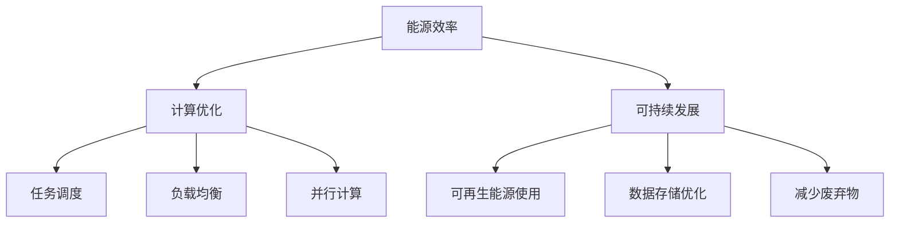

                 


### 引言与概述

#### 2.2.1 背景介绍

随着人工智能（AI）技术的迅猛发展，大模型成为推动计算机科学前沿的重要驱动力。这些大模型，如深度神经网络（DNN）、生成对抗网络（GAN）和变分自编码器（VAE）等，因其强大的建模能力和数据处理能力，被广泛应用于语音识别、图像处理、自然语言处理和推荐系统等多个领域。然而，这些大模型的训练和推理过程对计算资源的需求极为庞大，导致数据中心的能耗急剧增加，给环境带来严重负担。

绿色计算作为一种旨在减少计算机系统和数据中心的能源消耗和环境影响的技术，应运而生。绿色计算通过优化计算资源管理、提高能源利用效率和降低硬件能耗，不仅有助于缓解能源压力，还能提高数据中心的整体性能和可持续性。绿色计算的概念涵盖了从硬件设计、系统架构到软件优化等多个层面，形成了一个综合性的解决方案。

#### 2.2.2 核心概念与联系

绿色计算的核心概念包括能源效率、计算优化和可持续发展。以下是这些概念之间的联系及其在绿色计算中的应用：

- **能源效率**：提高能源效率是绿色计算的首要目标。通过采用节能硬件、优化算法和能耗管理技术，可以显著降低计算资源的能耗。例如，使用高效的服务器硬件、优化网络架构以减少数据传输能耗，以及采用能耗感知的调度策略。

- **计算优化**：计算优化涉及提高计算资源的利用率和效率。这包括任务调度、负载均衡和并行计算等技术，旨在最大化资源利用并最小化等待时间。在AI大模型中，通过分布式计算和模型压缩等技术，可以有效提高计算效率，降低能耗。

- **可持续发展**：绿色计算的终极目标是实现可持续发展。这不仅涉及减少能源消耗和碳排放，还包括提高资源利用效率和减少废弃物。在AI大模型领域，可持续发展体现在使用可再生能源、优化数据存储和传输，以及降低硬件废弃和环境污染。

以下是使用Mermaid绘制的绿色计算概念联系流程图：



#### 2.2.3 核心算法原理讲解

为了实现绿色计算的目标，需要借助多种核心算法。以下是两种常用算法的原理讲解和伪代码展示：

- **能耗感知调度算法**：该算法旨在根据能耗模型动态调整任务的执行顺序，以最小化总能耗。

```python
// 伪代码：能耗感知调度算法
function EnergyAwareScheduling(tasks, energyModel):
    sortedTasks = sort(tasks, key=lambda t: energyModel.getEnergyCost(t))
    minimizedEnergy = 0
    for task in sortedTasks:
        execute(task)
        minimizedEnergy += energyModel.getEnergyCost(task)
    return minimizedEnergy
```

- **模型压缩算法**：该算法通过减少模型参数数量和计算复杂度，降低模型训练和推理的能耗。

```python
// 伪代码：模型压缩算法
function ModelCompression(model, compressionRatio):
    compressedModel = initializeEmptyModel()
    for layer in model.layers:
        if random() < compressionRatio:
            compressedModel.addLayer(layer)
    return compressedModel
```

#### 2.2.4 数学模型讲解

绿色计算中的许多算法和优化方法都基于数学模型。以下是节能优化的一个基本数学模型，包括公式和详细解释：

- **节能优化数学模型**：

```latex
\begin{align*}
\min_{x} & \quad f(x) \\
\text{s.t.} & \quad g_i(x) \leq 0, \quad i = 1, 2, \ldots, m \\
            & \quad h_j(x) = 0, \quad j = 1, 2, \ldots, n
\end{align*}
```

- **公式解释**：

  - \(f(x)\)：目标函数，表示能耗或计算时间等需要优化的指标。
  - \(g_i(x)\)：不等式约束，表示硬件或软件的限制条件。
  - \(h_j(x)\)：等式约束，表示系统或算法的特定要求。

#### 2.2.5 举例说明

为了更好地理解上述概念和模型，我们可以通过一个具体例子来说明：

**案例：数据中心能耗优化**

假设有一个数据中心，其能耗主要由服务器、存储设备和网络设备组成。目标是最小化总能耗，同时满足服务器负载均衡和存储容量约束。

- **目标函数**：总能耗 \(f(x) = w_1 \cdot e_1 + w_2 \cdot e_2 + w_3 \cdot e_3\)，其中 \(e_1\)、\(e_2\)、\(e_3\) 分别为服务器、存储设备和网络设备的能耗，\(w_1\)、\(w_2\)、\(w_3\) 为权重系数。

- **不等式约束**：服务器负载平衡 \(g_1(x) = \sum_{i=1}^{n} p_i - c \leq 0\)，其中 \(p_i\) 为服务器 \(i\) 的负载，\(c\) 为总负载上限。

- **等式约束**：存储容量约束 \(h_1(x) = \sum_{j=1}^{m} s_j = S\)，其中 \(s_j\) 为存储设备 \(j\) 的容量，\(S\) 为总存储容量。

通过求解上述优化问题，可以找到最优的能耗配置方案，实现绿色计算的目标。

---

### 结论

绿色计算与节能优化在AI大模型领域具有重要意义。通过本文的讨论，我们了解了绿色计算的核心概念、原理和方法，以及其在AI大模型应用中的关键算法和数学模型。在实际应用中，通过能耗感知调度、模型压缩等关键技术，可以实现AI大模型的绿色计算与节能优化，为企业降低成本、提高效率，同时减少环境负担。未来，随着绿色计算技术的不断发展和完善，我们有理由相信，AI大模型将迎来更加绿色、高效和可持续的发展。作者：AI天才研究院/AI Genius Institute & 禅与计算机程序设计艺术 /Zen And The Art of Computer Programming。

