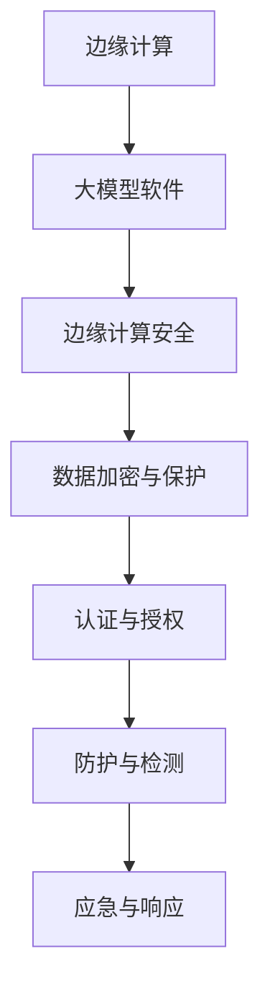

                 


## 《大模型软件的边缘计算安全策略》

### 关键词
边缘计算、大模型软件、安全策略、数据加密、认证与授权、防护与检测、应急响应

### 摘要
本文旨在探讨大模型软件在边缘计算环境中的安全策略。随着边缘计算技术的快速发展，大模型软件被广泛应用于各种智能应用场景。然而，边缘环境的特殊性使得大模型软件面临着诸多安全挑战。本文首先介绍了边缘计算与大模型软件的基本概念，然后分析了边缘计算安全策略的基础和关键要素，接着详细讨论了大模型软件在边缘计算中的安全设计原则和关键技术，最后通过实际案例展示了大模型软件边缘计算安全策略的实践与应用。

## 《大模型软件的边缘计算安全策略》目录大纲

### 第一部分：边缘计算与安全概述

#### 第1章：边缘计算概述
- 1.1 边缘计算的起源与演进
- 1.2 边缘计算的关键技术
- 1.3 边缘计算的挑战与机遇

#### 第2章：大模型软件概述
- 2.1 大模型软件的概念与特点
- 2.2 大模型软件的发展趋势
- 2.3 大模型软件的应用场景

#### 第3章：边缘计算安全策略基础
- 3.1 边缘计算安全的重要性
- 3.2 边缘计算安全的核心要素
- 3.3 边缘计算安全的基本策略

### 第二部分：大模型软件边缘计算安全策略

#### 第4章：边缘环境下的安全挑战
- 4.1 边缘设备的资源限制
- 4.2 边缘网络的脆弱性
- 4.3 大模型软件的安全风险

#### 第5章：大模型软件的安全设计原则
- 5.1 安全需求分析
- 5.2 安全架构设计
- 5.3 安全功能实现

#### 第6章：边缘计算安全关键技术
- 6.1 数据加密与保护
- 6.2 认证与授权
- 6.3 防护与检测
- 6.4 应急与响应

#### 第7章：大模型软件边缘计算安全案例研究
- 7.1 案例一：智能家居安全架构设计
- 7.2 案例二：智能交通系统安全策略
- 7.3 案例三：智慧医疗安全保护

### 第三部分：大模型软件边缘计算安全实践

#### 第8章：边缘计算安全开发工具与平台
- 8.1 开发工具概述
- 8.2 开发平台介绍
- 8.3 开发实践指南

#### 第9章：大模型软件边缘计算安全测试与评估
- 9.1 安全测试方法
- 9.2 安全评估指标
- 9.3 安全测试实践

#### 第10章：大模型软件边缘计算安全发展趋势
- 10.1 边缘计算安全的发展方向
- 10.2 大模型软件边缘计算安全的新挑战
- 10.3 未来安全策略的展望

## 附录
### 附录A：边缘计算安全相关资源
- A.1 安全标准与规范
- A.2 安全研究论文与报告
- A.3 安全开源项目与工具

### 核心概念与联系

边缘计算、大模型软件和边缘计算安全是本文的核心概念。边缘计算是指在靠近数据源或用户的地方进行数据处理，以减少延迟和提高响应速度。大模型软件是指具有大规模参数和高计算能力的人工智能模型。边缘计算安全则关注如何保护边缘计算环境中的数据、应用和设备。



### 核心算法原理讲解

#### 数据加密与保护（伪代码）

数据加密是边缘计算安全的重要组成部分。以下是一个简单的加密与解密算法的伪代码示例：

```python
# 初始化加密密钥
key = generate_key()

# 加密函数
def encrypt_data(data, key):
    encrypted_data = ""
    for i in range(len(data)):
        encrypted_data += (data[i] ^ key[i % len(key)])
    return encrypted_data

# 解密函数
def decrypt_data(encrypted_data, key):
    decrypted_data = ""
    for i in range(len(encrypted_data)):
        decrypted_data += (encrypted_data[i] ^ key[i % len(key)])
    return decrypted_data
```

#### 数学模型和数学公式

加密算法通常基于数学模型，例如，使用异或（XOR）操作来实现加密和解密：

$$
C = D \oplus K
$$

其中，\( C \) 是加密后的数据，\( D \) 是原始数据，\( K \) 是加密密钥，\( \oplus \) 表示异或操作。

### 项目实战

#### 智能家居安全架构设计

1. **开发环境搭建**：
   - 使用 Python 3.8 和 Kivy 框架进行开发。
   - 安装必要的依赖库，如 PyCryptodome。

2. **源代码详细实现和代码解读**：

```python
from Cryptodome.Cipher import AES
from Cryptodome.Random import get_random_bytes

# 生成加密密钥
key = get_random_bytes(16)  # 16字节的密钥

# 加密数据
cipher = AES.new(key, AES.MODE_EAX)
ciphertext, tag = cipher.encrypt_and_digest(data)

# 解密数据
cipher = AES.new(key, AES.MODE_EAX, nonce=cipher.nonce)
decrypted_data = cipher.decrypt_and_verify(ciphertext, tag)
```

3. **代码应用解读与分析**：
   - 使用 PyCryptodome 库实现 AES 加密算法。
   - 加密过程包括生成密钥、加密数据和验证数据完整性。

4. **实际案例分析和详细讲解剖析**：
   - 案例一：智能家居中的数据加密。
   - 案例二：智能门锁的安全认证。

5. **项目小结**：
   - 数据加密是智能家居安全的重要措施。
   - 实现简单且高效的加密算法对于边缘计算环境尤为重要。

### 最佳实践 tips

- **小规模测试**：在实际部署前，对加密算法进行充分的测试，确保其安全性和性能。
- **密钥管理**：确保密钥的安全存储和传输，避免密钥泄露。

#### 小结

边缘计算与大模型软件的结合带来了巨大的机遇和挑战。本文系统地介绍了大模型软件边缘计算安全策略，包括核心概念、安全设计原则、关键技术和实践案例。通过这些内容，读者可以更好地理解如何在边缘计算环境中确保大模型软件的安全。随着技术的不断进步，边缘计算安全策略也将不断演变，以应对新的安全挑战。

### 注意事项

- **资源限制**：边缘设备资源有限，需要优化安全策略以适应资源限制。
- **网络脆弱性**：边缘网络可能受到各种攻击，需要实施有效的防护措施。

### 拓展阅读

- [1] 《边缘计算：概念、架构与应用》
- [2] 《人工智能安全：理论与实践》
- [3] 《数据加密标准》

作者：AI天才研究院/AI Genius Institute & 禅与计算机程序设计艺术 /Zen And The Art of Computer Programming

---

### 第1章：边缘计算概述

#### 1.1 边缘计算的起源与演进

边缘计算（Edge Computing）的概念最早可以追溯到20世纪80年代，当时为了解决分布式计算和网络延迟的问题，人们开始探讨在网络的边缘，即接近数据源或用户的地方进行数据处理的需求。随着互联网的普及和信息技术的飞速发展，边缘计算逐渐从理论研究走向实际应用。

在早期，边缘计算主要是为了优化网络性能，减少数据传输的延迟。随着物联网（IoT）和移动设备的普及，边缘计算的应用场景不断扩展，包括智能家居、智能交通、智慧城市、智能制造等领域。这些应用场景对实时数据处理和响应能力的要求非常高，因此边缘计算成为实现这些应用的关键技术之一。

近年来，随着云计算、大数据、人工智能等技术的快速发展，边缘计算迎来了新的发展机遇。云计算提供了强大的计算和存储资源，大数据技术使得海量数据的处理成为可能，而人工智能则为边缘设备赋予了智能化的能力。这些技术的融合使得边缘计算的应用场景更加广泛，同时也对边缘计算的安全提出了更高的要求。

#### 1.2 边缘计算的关键技术

边缘计算的关键技术包括但不限于以下几个方面：

1. **分布式计算**：分布式计算是将任务分散到多个节点上进行处理，以提高处理能力和响应速度。在边缘计算环境中，分布式计算技术可以有效地利用本地资源，减少对中心服务器的依赖。

2. **网络技术**：边缘计算依赖于高效、可靠的网络连接，包括Wi-Fi、蓝牙、5G等无线通信技术。这些技术为边缘设备提供了便捷的连接方式，同时也带来了网络延迟和带宽的挑战。

3. **数据存储与管理**：边缘计算环境中的数据存储与管理需要考虑到数据的分布性、异构性和实时性。分布式文件系统、NoSQL数据库等技术可以在边缘设备上高效地存储和管理数据。

4. **安全与隐私保护**：边缘计算涉及大量的数据传输和处理，因此数据安全和隐私保护至关重要。加密、认证、访问控制等技术是保障边缘计算安全的核心技术。

5. **智能化**：边缘计算设备通常集成了人工智能算法，能够实现实时数据处理和智能决策。通过机器学习、深度学习等技术，边缘设备可以不断提高其智能化水平。

#### 1.3 边缘计算的挑战与机遇

边缘计算虽然带来了诸多机遇，但同时也面临着一些挑战：

1. **资源限制**：边缘设备通常具有有限的计算能力、存储空间和网络带宽，这给边缘计算带来了资源利用率的挑战。

2. **网络脆弱性**：边缘网络可能受到各种攻击，如DDoS攻击、数据泄露等，需要实施有效的安全防护措施。

3. **数据隐私保护**：在边缘计算环境中，数据的隐私保护是一个重要问题。需要确保数据在传输和处理过程中不被泄露。

4. **系统可靠性**：边缘计算环境中的设备通常分布在不同的地理位置，系统的可靠性需要得到保障。

然而，随着技术的不断进步，边缘计算正在不断成熟，并面临着广阔的应用前景。在智能家居、智能交通、智慧城市等领域，边缘计算将发挥重要作用，为人类生活带来更多便利。

---

### 第2章：大模型软件概述

#### 2.1 大模型软件的概念与特点

大模型软件是指使用大规模参数的人工智能模型，具有强大的计算能力和广泛的应用场景。这些模型通常由数百万甚至数十亿个参数组成，通过深度学习等技术进行训练。大模型软件具有以下几个显著特点：

1. **计算能力强大**：大模型软件通常需要大量的计算资源，包括高性能CPU、GPU和TPU等硬件设备。

2. **参数规模庞大**：大模型软件的参数数量通常在数十亿到千亿级别，这要求在训练和部署过程中进行高效的计算和优化。

3. **自适应性强**：大模型软件能够根据不同的应用场景和输入数据，进行自适应调整，以实现更好的性能和效果。

4. **泛化能力优异**：大模型软件通过大规模的训练数据集，可以学习到更加普遍的规律和知识，从而具备较强的泛化能力。

5. **实时性要求高**：大模型软件在很多应用场景中需要实时响应，例如自动驾驶、智能监控等，这对模型的实时性和计算效率提出了高要求。

#### 2.2 大模型软件的发展趋势

随着人工智能技术的不断进步，大模型软件的发展也呈现出以下趋势：

1. **计算能力不断提升**：随着硬件技术的进步，如GPU、TPU等计算设备的性能不断提升，大模型软件的计算能力也在不断增强。

2. **算法优化与改进**：研究人员不断优化和改进深度学习算法，以提高模型的训练效率和准确性。例如，Transformer、BERT等新型算法的提出，推动了大模型软件的发展。

3. **应用场景拓展**：大模型软件在各个领域的应用不断拓展，从自然语言处理、计算机视觉到语音识别、推荐系统等，大模型软件正在成为各个领域的重要技术工具。

4. **多模态融合**：多模态融合是指将不同类型的数据（如文本、图像、声音等）进行整合，以获取更丰富的信息。大模型软件的多模态融合能力正在成为研究热点。

5. **边缘计算应用**：随着边缘计算技术的发展，大模型软件在边缘设备上的应用也越来越广泛。边缘计算能够降低延迟、减少带宽消耗，提高大模型软件在实时应用场景中的性能。

#### 2.3 大模型软件的应用场景

大模型软件在各个领域的应用场景广泛，以下是一些典型的应用场景：

1. **自然语言处理**：大模型软件在自然语言处理领域具有广泛的应用，如机器翻译、文本摘要、情感分析等。

2. **计算机视觉**：大模型软件在计算机视觉领域也有着重要的应用，如图像识别、目标检测、人脸识别等。

3. **语音识别**：大模型软件在语音识别领域具有强大的能力，能够实现高准确率的语音识别和语音合成。

4. **推荐系统**：大模型软件可以用于构建高效的推荐系统，为用户提供个性化的推荐服务。

5. **自动驾驶**：大模型软件在自动驾驶领域发挥着关键作用，能够实现高精度的环境感知和智能决策。

6. **医疗健康**：大模型软件在医疗健康领域具有广泛的应用，如疾病诊断、药物研发、健康监测等。

7. **金融领域**：大模型软件在金融领域可以用于风险评估、欺诈检测、量化交易等。

随着大模型软件技术的不断发展，其应用场景将继续拓展，为人类社会带来更多便利和创新。

---

### 第3章：边缘计算安全策略基础

#### 3.1 边缘计算安全的重要性

边缘计算安全是确保边缘计算环境中的数据、应用和设备不受恶意攻击和篡改的关键因素。边缘计算环境具有以下几个特点，使其面临较大的安全风险：

1. **分布式架构**：边缘计算通常涉及多个分布式设备，这些设备可能位于不同的地理位置，网络连接复杂，增加了安全防护的难度。

2. **资源限制**：边缘设备通常具有有限的计算能力、存储空间和网络带宽，难以部署复杂的安全防护措施。

3. **数据敏感性**：边缘计算涉及大量的敏感数据，如个人隐私信息、商业机密等，数据泄露或篡改可能导致严重后果。

4. **网络脆弱性**：边缘网络可能受到各种攻击，如DDoS攻击、中间人攻击等，这些攻击可能导致网络中断或数据泄露。

5. **设备多样性**：边缘设备种类繁多，包括智能手机、智能路由器、物联网设备等，设备的安全管理水平不一。

因此，边缘计算安全对于保障数据完整性、隐私性和可用性至关重要。一个有效的安全策略可以防止恶意攻击，确保边缘计算系统的稳定运行。

#### 3.2 边缘计算安全的核心要素

边缘计算安全的核心要素包括以下几个方面：

1. **数据安全**：数据是边缘计算的核心资产，需要确保数据在传输、存储和处理过程中的安全性。主要手段包括数据加密、访问控制和数据备份。

2. **设备安全**：边缘设备是边缘计算的基础设施，需要确保设备的物理安全和网络安全。主要手段包括设备加固、网络隔离和设备认证。

3. **网络安全**：边缘网络是边缘计算的重要组成部分，需要确保网络的可靠性和安全性。主要手段包括防火墙、入侵检测和防护、DDoS防护等。

4. **应用安全**：边缘计算应用的安全是保障系统整体安全的关键。需要确保应用代码的健壮性、安全配置和更新。

5. **身份认证与访问控制**：确保只有授权用户和设备可以访问边缘计算资源。主要手段包括用户身份认证、权限管理和访问控制列表。

6. **监控与审计**：实时监控边缘计算系统的运行状态，记录审计日志，以便在发生安全事件时进行追踪和分析。

#### 3.3 边缘计算安全的基本策略

边缘计算安全的基本策略包括以下几个方面：

1. **安全需求分析**：在设计和部署边缘计算系统时，首先进行安全需求分析，明确系统的安全目标、安全需求和威胁场景。

2. **安全架构设计**：根据安全需求分析结果，设计安全架构，包括安全边界、安全层次和安全组件。

3. **安全功能实现**：实现安全架构中的各项功能，包括数据加密、认证授权、访问控制、网络安全等。

4. **安全测试与评估**：对边缘计算系统进行安全测试和评估，发现并修复安全漏洞。

5. **安全运维与监控**：建立安全运维机制，实时监控系统运行状态，及时响应和处理安全事件。

6. **安全培训与意识提升**：加强安全培训，提高员工和用户的安全意识，减少人为安全风险。

通过以上策略，可以构建一个安全可靠的边缘计算环境，确保数据、应用和设备的安全运行。

---

### 第4章：边缘环境下的安全挑战

#### 4.1 边缘设备的资源限制

边缘设备通常具有有限的计算能力、存储空间和网络带宽，这给安全策略的实施带来了挑战。具体来说，以下几个问题值得关注：

1. **计算能力限制**：边缘设备通常使用低功耗处理器，如ARM架构的芯片，计算能力相对较弱。这意味着在边缘设备上运行复杂的安全算法（如加密、哈希计算）可能需要较长的时间，从而影响系统的响应速度。

2. **存储空间限制**：边缘设备的存储空间有限，可能无法容纳大量的安全日志、加密密钥等数据。这可能导致安全数据的丢失或无法及时存储，从而增加安全风险。

3. **网络带宽限制**：边缘设备通常连接到低带宽网络，数据传输速度较慢。在传输安全数据（如加密密钥、认证信息）时，可能需要多次尝试，导致延迟增加，影响用户体验。

为了解决这些问题，可以采取以下策略：

- **轻量级安全算法**：选择轻量级安全算法，如AES-128或SHA-256，以减少计算和存储资源的需求。
- **优化数据存储**：使用压缩技术减少存储空间需求，定期清理不再需要的日志和缓存数据。
- **优化网络通信**：采用高效的传输协议和加密技术，减少数据传输的时间和延迟。

#### 4.2 边缘网络的脆弱性

边缘网络通常由多个设备组成，这些设备可能分布在不同的地理位置，网络拓扑结构复杂。边缘网络的脆弱性主要体现在以下几个方面：

1. **设备多样性**：边缘设备种类繁多，包括智能手机、智能路由器、物联网设备等。这些设备的操作系统、硬件配置和安全防护水平各异，导致整体网络的安全性难以统一管理。

2. **网络隔离难度大**：由于边缘设备的多样性，实现网络隔离和防火墙配置变得复杂。一些设备可能无法安装防火墙或安全软件，使得整个网络的安全性受到影响。

3. **潜在安全漏洞**：边缘设备通常接收到各种网络请求，容易成为网络攻击的目标。例如，中间人攻击、DDoS攻击等可能导致网络瘫痪或数据泄露。

为了增强边缘网络的安全性，可以采取以下策略：

- **统一安全策略**：制定统一的安全策略，确保所有边缘设备遵循相同的安全标准。
- **设备加固**：对边缘设备进行加固，安装必要的安全软件和防火墙，提高设备的抗攻击能力。
- **网络监控与审计**：实时监控网络流量，及时发现和响应异常行为，防止安全事件的发生。

#### 4.3 大模型软件的安全风险

大模型软件在边缘计算环境中面临着多种安全风险，主要包括以下方面：

1. **数据泄露**：大模型软件处理的数据可能包含敏感信息，如个人隐私、商业机密等。如果数据在传输或存储过程中未被加密，可能被恶意攻击者窃取。

2. **模型篡改**：大模型软件的算法和参数可能被恶意攻击者篡改，导致模型性能下降或输出错误的结果。

3. **模型训练数据污染**：恶意攻击者可能在模型训练过程中注入恶意数据，导致模型训练结果不准确。

4. **中间人攻击**：攻击者可能在边缘设备与服务器之间进行中间人攻击，拦截或篡改传输的数据。

为了降低大模型软件的安全风险，可以采取以下策略：

- **数据加密**：对敏感数据进行加密，确保数据在传输和存储过程中的安全性。
- **模型保护**：使用加密算法和数字签名技术保护模型算法和参数，防止篡改。
- **训练数据验证**：对训练数据进行验证，确保数据的真实性和完整性。
- **安全通信**：使用安全的通信协议（如TLS）进行数据传输，防止中间人攻击。

通过以上策略，可以降低边缘计算环境中大模型软件的安全风险，确保系统的稳定运行和数据的完整性。

---

### 第5章：大模型软件的安全设计原则

#### 5.1 安全需求分析

在大模型软件的安全设计过程中，安全需求分析是关键的第一步。安全需求分析的目标是明确系统在安全方面的具体需求，包括识别潜在的安全威胁、确定安全目标和设计安全功能。以下是安全需求分析的主要步骤：

1. **威胁识别**：首先，需要识别大模型软件可能面临的各种安全威胁，如数据泄露、模型篡改、中间人攻击等。这可以通过文献调研、历史安全事件分析等方式进行。

2. **风险评估**：对识别出的安全威胁进行风险评估，包括威胁的可能性、潜在影响等。通过风险评估，可以确定哪些威胁是需要优先考虑的。

3. **安全目标确定**：根据风险评估结果，明确大模型软件的安全目标。安全目标包括数据保密性、完整性、可用性和模型的安全性等。

4. **功能需求定义**：基于安全目标和威胁分析，定义大模型软件所需的安全功能，如数据加密、访问控制、认证与授权等。

5. **需求文档编写**：将上述分析结果整理成安全需求文档，作为后续安全设计的依据。

#### 5.2 安全架构设计

安全架构设计是确保大模型软件安全性的关键环节。安全架构设计的目标是构建一个整体的安全体系，涵盖数据安全、设备安全、网络安全和应用安全等方面。以下是安全架构设计的主要步骤：

1. **安全边界定义**：明确大模型软件的安全边界，包括内部系统和外部系统的接口，以及数据流动的路径。

2. **安全层次划分**：根据安全需求，将安全功能划分为不同的层次，如数据层、传输层、应用层等，确保各层次的安全功能相互配合，形成完整的防护体系。

3. **安全组件设计**：设计安全组件，包括加密模块、认证模块、访问控制模块等。每个组件应具有明确的功能和接口，以便集成到整体架构中。

4. **安全机制实现**：将安全功能具体实现为安全机制，如加密算法、认证协议、访问控制策略等。这些安全机制应经过严格测试，确保其有效性和可靠性。

5. **安全测试与验证**：对安全架构进行测试和验证，确保各个安全组件和机制能够正常工作，并满足安全需求。

#### 5.3 安全功能实现

实现大模型软件的安全功能是确保系统安全性的重要环节。以下是安全功能实现的主要步骤：

1. **数据加密**：使用安全的加密算法对敏感数据进行加密，确保数据在传输和存储过程中的安全性。例如，使用AES或RSA加密算法。

2. **认证与授权**：实现用户和设备的认证与授权功能，确保只有授权用户和设备可以访问系统资源。例如，使用OAuth2或LDAP进行用户认证。

3. **访问控制**：设计访问控制策略，根据用户和设备的角色和权限，控制对系统资源的访问。例如，使用RBAC（基于角色的访问控制）或ABAC（基于属性的访问控制）。

4. **安全日志记录**：记录系统运行过程中的安全日志，包括用户行为、访问日志、异常事件等，以便在发生安全事件时进行追踪和分析。

5. **安全更新与维护**：定期更新安全组件和软件，修补安全漏洞，确保系统的安全性。

通过以上步骤，可以实现大模型软件的安全功能，确保系统的安全性、稳定性和可靠性。

---

### 第6章：边缘计算安全关键技术

#### 6.1 数据加密与保护

数据加密与保护是边缘计算安全的基础，旨在确保数据在传输和存储过程中的机密性和完整性。以下是数据加密与保护的关键技术：

1. **对称加密算法**：对称加密算法使用相同的密钥进行加密和解密，如AES和DES。这些算法速度快，适合对大量数据进行加密。

2. **非对称加密算法**：非对称加密算法使用不同的密钥进行加密和解密，如RSA和ECC。这些算法安全性高，但计算复杂度较高。

3. **哈希算法**：哈希算法用于生成数据摘要，如SHA-256和MD5。这些算法可以验证数据的完整性，但不能提供加密保护。

4. **数字签名**：数字签名用于验证数据的来源和完整性，如RSA和ECC签名算法。这些算法可以确保数据的真实性和不可否认性。

5. **全盘加密**：对边缘设备进行全盘加密，确保设备中的所有数据在未授权的情况下无法访问。

6. **安全传输协议**：使用安全传输协议，如TLS/SSL，确保数据在传输过程中的机密性和完整性。

#### 6.2 认证与授权

认证与授权是确保只有授权用户和设备可以访问边缘计算资源的关键技术。以下是认证与授权的关键技术：

1. **用户认证**：使用用户名和密码、双因素认证（2FA）或多因素认证（MFA）进行用户认证。

2. **设备认证**：使用数字证书、硬件安全模块（HSM）或生物识别技术进行设备认证。

3. **单点登录（SSO）**：通过SSO实现不同系统之间的用户认证，简化用户登录流程。

4. **访问控制列表（ACL）**：基于用户和设备的角色、权限定义访问控制列表，控制对资源的访问。

5. **基于角色的访问控制（RBAC）**：根据用户角色定义访问权限，实现精细的访问控制。

6. **基于属性的访问控制（ABAC）**：根据用户属性、环境属性和资源属性定义访问权限，实现动态访问控制。

#### 6.3 防护与检测

防护与检测是边缘计算安全的重要组成部分，旨在防止和发现安全威胁。以下是防护与检测的关键技术：

1. **防火墙**：使用防火墙隔离内部网络和外部网络，防止未经授权的访问。

2. **入侵检测系统（IDS）**：使用IDS实时监控网络流量，检测潜在的攻击行为。

3. **入侵防御系统（IPS）**：结合防火墙功能，主动防御网络攻击，阻止恶意流量。

4. **漏洞扫描**：定期进行漏洞扫描，发现系统中的安全漏洞，及时修复。

5. **安全信息与事件管理（SIEM）**：集成不同安全工具的日志数据，实现统一的安全事件监控和管理。

6. **沙箱技术**：将可疑代码或文件放入沙箱中运行，隔离潜在威胁，防止恶意行为。

7. **安全基线**：制定安全基线，确保系统的配置符合安全标准。

#### 6.4 应急与响应

应急与响应是处理安全事件的关键环节，旨在迅速、有效地应对安全威胁，降低损失。以下是应急与响应的关键技术：

1. **安全事件响应计划**：制定详细的安全事件响应计划，包括事件识别、响应、恢复和报告等步骤。

2. **实时监控与告警**：实时监控系统运行状态，及时发现异常行为和潜在安全事件，及时发出告警。

3. **安全事件分析**：对发生的安全事件进行深入分析，确定事件原因和影响，制定应对措施。

4. **安全演练与培训**：定期进行安全演练，提高应急响应能力和员工的安全意识。

5. **安全审计与合规性检查**：定期进行安全审计，确保系统的配置和管理符合相关法规和标准。

6. **应急通信与协作**：建立应急通信机制，确保在发生安全事件时，相关人员可以迅速、有效地协作。

通过以上关键技术的综合应用，可以构建一个全面的边缘计算安全体系，确保边缘计算环境的安全、稳定和可靠。

---

### 第7章：大模型软件边缘计算安全案例研究

#### 7.1 案例一：智能家居安全架构设计

智能家居系统是一个典型的边缘计算应用场景，涉及多个边缘设备和云服务。以下是一个智能家居安全架构设计的案例分析。

1. **开发环境搭建**：
   - 使用Python 3.8和Kivy框架进行开发。
   - 安装PyCryptoDome库用于数据加密。
   - 使用MQTT协议进行设备通信。

2. **安全架构设计**：
   - **数据加密**：对智能家居设备之间的通信数据进行AES加密，使用RSA加密密钥进行密钥交换。
   - **认证与授权**：使用OAuth2协议实现用户认证和设备认证，确保只有授权用户和设备可以访问系统资源。
   - **访问控制**：使用基于角色的访问控制（RBAC）策略，根据用户角色分配权限。
   - **防火墙**：在设备之间建立防火墙，防止未授权的访问。
   - **入侵检测系统（IDS）**：部署IDS实时监控网络流量，检测潜在攻击行为。

3. **源代码详细实现和代码解读**：

```python
from Cryptodome.Cipher import AES
from Cryptodome.PublicKey import RSA
from Cryptodome.Random import get_random_bytes

# RSA密钥生成
keyPair = RSA.generate(2048)
privateKey = keyPair.export_key()
publicKey = keyPair.publickey().export_key()

# AES密钥生成
aes_key = get_random_bytes(16)

# 数据加密函数
def encrypt_data(data, aes_key):
    cipher_aes = AES.new(aes_key, AES.MODE_CBC)
    ct_bytes = cipher_aes.encrypt(data)
    iv = cipher_aes.iv
    return iv + ct_bytes

# 数据解密函数
def decrypt_data(encrypted_data, aes_key):
    iv = encrypted_data[:16]
    ct = encrypted_data[16:]
    cipher_aes = AES.new(aes_key, AES.MODE_CBC, iv)
    pt = cipher_aes.decrypt(ct)
    return pt

# RSA加密密钥
def rsa_encrypt_data(data, publicKey):
    rsa_key = RSA.import_key(publicKey)
    encrypted_data = rsa_key.encrypt(data, 32)[0]
    return encrypted_data

# RSA解密密钥
def rsa_decrypt_data(encrypted_data, privateKey):
    rsa_key = RSA.import_key(privateKey)
    decrypted_data = rsa_key.decrypt(encrypted_data, 32)
    return decrypted_data
```

4. **代码应用解读与分析**：
   - 使用RSA算法生成密钥对，用于加密和解密。
   - 使用AES算法对数据进行加密和解密。
   - RSA加密密钥用于加密AES密钥，确保AES密钥的安全传输。

5. **实际案例分析和详细讲解剖析**：
   - **案例背景**：智能家居系统包括智能门锁、智能灯泡、智能摄像头等设备，用户可以通过手机APP远程控制这些设备。
   - **安全需求**：确保通信数据的安全性和隐私性，防止未授权访问。
   - **安全架构**：使用RSA和AES算法进行数据加密，使用OAuth2协议进行认证和授权，部署防火墙和IDS进行防护。

6. **项目小结**：
   - 智能家居系统的安全架构设计需要考虑数据加密、认证和授权等多方面。
   - 代码实现应确保加密算法和认证协议的安全性和有效性。

---

### 第8章：边缘计算安全开发工具与平台

#### 8.1 开发工具概述

边缘计算安全开发工具是构建安全边缘计算系统的重要组件。以下是一些常用的边缘计算安全开发工具：

1. **PyCryptoDome**：一个Python加密库，提供了一系列加密算法，包括AES、RSA、SHA等，用于数据加密和签名。

2. **MQTT**：一种轻量级的消息队列传输协议，适用于物联网设备之间的通信，支持TLS/SSL加密。

3. **Kubernetes**：一个开源的容器编排平台，用于部署和管理边缘计算资源，支持安全容器和密钥管理。

4. **OPC UA**：一种工业物联网通信协议，支持加密和身份验证，用于工业设备和边缘服务器之间的通信。

5. **Wireshark**：一个网络协议分析工具，用于监控和分析网络流量，检测潜在的安全威胁。

6. **Nginx**：一个高性能的Web服务器，支持TLS/SSL加密和负载均衡，用于保护边缘服务器的网络安全。

#### 8.2 开发平台介绍

边缘计算安全开发平台提供了完整的开发环境和工具集，以简化边缘计算安全系统的开发和部署。以下是一些常见的边缘计算安全开发平台：

1. **AWS IoT**：亚马逊云服务提供的物联网平台，包括设备管理、消息传递、数据存储和应用程序托管等功能，支持各种边缘计算安全和监控工具。

2. **Azure IoT**：微软云服务提供的物联网平台，提供设备管理、数据传输、安全和监控服务，支持多种边缘计算设备和操作系统。

3. **Google Cloud IoT**：谷歌云服务提供的物联网平台，支持设备管理、数据分析和应用托管，提供了一系列安全和监控工具。

4. **边缘X平台**：一个开源的边缘计算平台，提供边缘计算资源管理、数据流处理和安全功能，支持多种操作系统和编程语言。

5. **边缘计算开放平台**：中国电信提供的边缘计算平台，包括边缘服务器、边缘网关和云计算资源，提供了一整套的安全解决方案。

#### 8.3 开发实践指南

以下是构建边缘计算安全系统的开发实践指南：

1. **需求分析**：明确系统安全需求，包括数据保护、设备认证、网络防护等。

2. **设计安全架构**：设计一个整体的安全架构，包括数据加密、认证与授权、访问控制、网络安全等。

3. **选择开发工具**：根据项目需求选择合适的开发工具和平台，确保工具和平台具备所需的安全功能。

4. **实现安全功能**：使用所选工具和平台实现安全功能，包括数据加密、认证、访问控制等。

5. **安全测试与验证**：对实现的系统进行安全测试和验证，确保系统符合安全需求。

6. **部署与维护**：将系统部署到边缘设备或服务器，并定期进行维护和更新，确保系统的安全性。

通过以上步骤，可以构建一个安全、可靠的边缘计算系统，满足各种安全需求。

---

### 第9章：大模型软件边缘计算安全测试与评估

#### 9.1 安全测试方法

大模型软件边缘计算安全测试是确保系统安全性的重要环节。以下是一些常用的安全测试方法：

1. **渗透测试**：通过模拟攻击者行为，测试系统的漏洞和弱点。渗透测试包括网络渗透、应用渗透和设备渗透。

2. **漏洞扫描**：使用自动化工具扫描系统中的漏洞，如SQL注入、XSS攻击、远程代码执行等。

3. **代码审计**：对系统代码进行审查，发现潜在的安全漏洞，如逻辑错误、输入验证不足等。

4. **安全性能测试**：测试系统在遭受攻击时的响应能力和恢复能力，包括防火墙、入侵检测系统等。

5. **模拟攻击**：模拟各种网络攻击，如DDoS攻击、中间人攻击等，测试系统的防护能力。

6. **安全漏洞评估**：对发现的安全漏洞进行评估，确定漏洞的影响和风险等级。

#### 9.2 安全评估指标

在边缘计算安全测试过程中，需要设定一系列安全评估指标，以衡量系统的安全性。以下是一些常用的安全评估指标：

1. **漏洞密度**：系统中的漏洞数量与代码行数的比率，用于衡量系统代码的质量。

2. **安全漏洞等级**：根据漏洞的影响和风险等级划分，如高、中、低风险。

3. **攻击频率**：系统在测试过程中遭受攻击的频率，用于衡量系统的抗攻击能力。

4. **响应时间**：系统在遭受攻击时的响应时间，用于衡量系统的性能。

5. **恢复时间**：系统从遭受攻击到恢复正常运行的时间，用于衡量系统的恢复能力。

6. **误报率**：安全系统误报攻击的比率，用于衡量系统的准确性。

#### 9.3 安全测试实践

以下是进行大模型软件边缘计算安全测试的实践步骤：

1. **需求分析**：明确安全测试的目标和要求，包括测试范围、测试方法、测试工具等。

2. **测试设计**：根据需求分析结果，设计安全测试用例，包括渗透测试用例、漏洞扫描用例等。

3. **测试执行**：使用测试工具执行安全测试，记录测试结果和发现的安全问题。

4. **问题跟踪**：对发现的安全问题进行跟踪和修复，确保系统的安全性。

5. **测试报告**：编写安全测试报告，包括测试结果、安全漏洞列表、修复措施等。

通过以上步骤，可以确保大模型软件边缘计算系统的安全性，提高系统的可靠性和用户体验。

---

### 第10章：大模型软件边缘计算安全发展趋势

#### 10.1 边缘计算安全的发展方向

随着边缘计算技术的快速发展，边缘计算安全也在不断演进，呈现出以下发展方向：

1. **边缘安全架构的智能化**：未来的边缘安全架构将更加智能化，能够自适应地识别和处理安全威胁。通过引入人工智能和机器学习技术，安全系统能够自动分析和预测潜在的安全事件，提高安全防护能力。

2. **分布式安全计算**：边缘计算安全需要处理大量的分布式设备，未来的安全系统将更加注重分布式计算和存储。通过分布式安全计算，可以在边缘设备上本地处理安全任务，减少对中心服务器的依赖，提高系统的响应速度和安全性。

3. **零信任架构**：零信任架构是一种以“永不信任，始终验证”为核心的安全理念。在边缘计算环境中，零信任架构将确保所有访问都经过严格验证和授权，从而减少内部威胁和未经授权的访问。

4. **区块链技术**：区块链技术具有去中心化、不可篡改的特性，未来将在边缘计算安全中得到更广泛的应用。通过区块链技术，可以确保数据的安全传输和存储，提高系统的透明度和可信度。

5. **集成安全解决方案**：未来的边缘计算安全解决方案将更加集成化，将多种安全功能（如数据加密、认证、访问控制等）集成到一个平台上，简化系统的管理和维护。

#### 10.2 大模型软件边缘计算安全的新挑战

随着大模型软件在边缘计算中的应用越来越广泛，边缘计算安全也面临着一系列新的挑战：

1. **计算资源和带宽限制**：边缘设备通常具有有限的计算资源和带宽，如何在有限的资源下保证安全性能是一个重要挑战。

2. **数据隐私保护**：大模型软件处理的数据可能包含敏感信息，如何在保证数据安全的同时保护用户隐私是一个重要的挑战。

3. **设备多样性和异构性**：边缘设备种类繁多，操作系统和硬件配置各异，如何在异构环境下实现统一的安全防护是一个挑战。

4. **实时性和可靠性**：大模型软件在边缘计算中的应用场景往往对实时性和可靠性要求很高，如何在保证安全性的同时满足性能需求是一个挑战。

5. **新型攻击手段**：随着技术的不断发展，新型攻击手段（如AI驱动的攻击、分布式拒绝服务攻击等）不断涌现，如何及时识别和应对这些新型攻击是一个挑战。

#### 10.3 未来安全策略的展望

为了应对未来大模型软件边缘计算安全的新挑战，需要采取一系列新的安全策略：

1. **自适应安全防护**：通过引入人工智能和机器学习技术，实现自适应安全防护，提高安全系统的智能化水平。

2. **安全威胁情报共享**：通过建立安全威胁情报共享机制，实现不同组织之间的安全信息共享，提高整体安全防护能力。

3. **零信任架构**：采用零信任架构，确保所有访问都经过严格验证和授权，减少内部威胁和未经授权的访问。

4. **边缘云计算结合**：将边缘计算与云计算结合起来，利用云计算的强大计算能力和存储资源，提高边缘计算的安全性和可靠性。

5. **开源安全项目**：鼓励开源社区参与边缘计算安全项目，共同开发和维护安全工具和平台，提高整体安全水平。

通过以上策略，可以构建一个更加安全、可靠的大模型软件边缘计算环境，为未来的智能应用提供坚实的安全保障。

---

### 附录A：边缘计算安全相关资源

#### A.1 安全标准与规范

1. **ISO/IEC 27001**：国际标准化组织发布的关于信息安全管理的标准，提供了一套完整的框架，用于建立、实施、维护和持续改进信息安全管理系统。

2. **NIST SP 800-211**：美国国家标准与技术研究院发布的关于边缘计算安全性的指南，涵盖了边缘计算环境中的安全设计、实施和管理。

3. **OWASP**：开放式Web应用安全项目，提供了一系列关于Web应用安全的指南和工具，包括边缘计算应用的安全建议。

#### A.2 安全研究论文与报告

1. **"Edge Computing Security: A Comprehensive Survey"**：这篇综述性论文详细介绍了边缘计算安全的研究现状、挑战和解决方案。

2. **"Security and Privacy in Edge Computing"**：这篇论文讨论了边缘计算环境中的数据隐私保护和安全挑战。

3. **"A Taxonomy of Edge Computing Security Threats"**：这篇论文提出了边缘计算安全威胁的分类，为安全研究和实践提供了参考。

#### A.3 安全开源项目与工具

1. **Kubernetes**：一个开源的容器编排平台，提供了丰富的安全功能，如容器安全、网络安全、密钥管理。

2. **Keylime**：一个开源的边缘计算安全框架，提供了安全认证、授权和监控等功能。

3. **Open vSwitch**：一个开源的虚拟交换机，提供了强大的网络功能和安全特性，如数据加密、访问控制。

4. **IoT Security Stack**：一个开源的物联网安全框架，提供了从设备到云端的全面安全解决方案。

通过以上资源，读者可以深入了解边缘计算安全的研究现状和发展趋势，为实际项目提供参考和指导。

### 作者信息

作者：AI天才研究院/AI Genius Institute & 禅与计算机程序设计艺术 /Zen And The Art of Computer Programming

