                 

## 引言部分

### 第1章：大模型逻辑推理能力概述

#### 1.1 大模型与逻辑推理的关系

**背景介绍**

随着人工智能技术的不断发展，大规模模型（简称大模型）逐渐成为研究与应用的热点。大模型，特别是基于深度学习的自然语言处理（NLP）模型，如GPT、BERT等，已经在诸多领域展现出强大的能力。这些模型通过海量数据训练，能够进行复杂的文本理解和生成任务，如机器翻译、文本摘要、问答系统等。然而，这些大模型在逻辑推理方面的能力仍然是一个亟待探索和优化的领域。

**核心概念与联系**

大模型与逻辑推理之间存在紧密的联系。逻辑推理是人工智能的一个基本任务，它涉及从一组已知事实中推导出新的结论。而大模型通过学习大量的文本数据，已经具备了一定的语言理解和生成能力，这使得它们在处理逻辑推理问题时具有独特的优势。具体来说，大模型的逻辑推理能力包括以下几个方面：

1. **知识推理**：大模型可以通过对文本数据的理解，推断出文本中隐含的知识和信息。
2. **逻辑推导**：大模型能够根据给定的前提条件，进行逻辑推导，生成符合逻辑的结论。
3. **常识推理**：大模型可以通过对常识知识的理解，进行推理，解决一些常识性问题。

**Mermaid 流程图**

以下是描述大模型与逻辑推理关系的一个简化的Mermaid流程图：

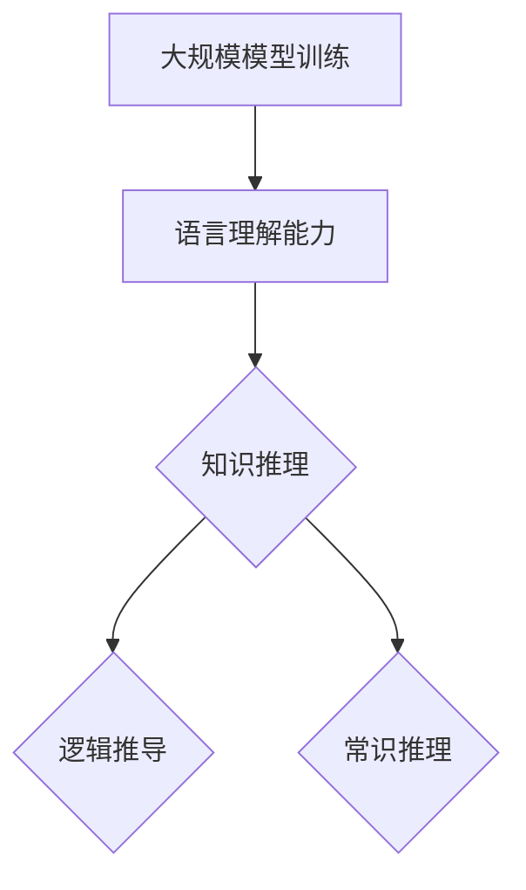

#### 1.2 大模型逻辑推理能力的背景

逻辑推理在人工智能中的应用非常广泛，例如在法律、金融、医疗等领域，逻辑推理能力是许多决策支持系统的重要组成部分。然而，传统的逻辑推理方法在处理复杂问题时存在一定的局限性。随着深度学习技术的发展，大模型在处理复杂任务时展现出强大的能力，这促使研究人员探索如何利用大模型进行逻辑推理。

**核心算法原理讲解**

大模型的逻辑推理能力主要依赖于以下几个核心算法：

1. **Transformer架构**：Transformer是近年来提出的一种基于自注意力机制的神经网络架构，它在处理序列数据时具有优越的性能。Transformer的核心思想是将输入序列中的每个位置的信息进行权重分配，然后进行加权和处理，从而实现对序列的深度理解。
2. **预训练与微调**：大模型通常采用预训练和微调的方法进行训练。预训练是在大规模数据集上进行的，以学习通用语言特征；微调是在特定任务上进行，以适应具体的任务需求。
3. **知识蒸馏**：知识蒸馏是一种将大模型的丰富知识传递给小模型的方法，它通过训练一个小模型来模拟大模型的输出，从而实现对大模型知识的利用。

**数学模型和公式**

以下是描述大模型逻辑推理能力的一个简化的数学模型：

$$
\text{推理能力} = f(\text{语言理解能力}, \text{知识储备}, \text{推理算法})
$$

其中，$f$ 表示一个复合函数，它将语言理解能力、知识储备和推理算法结合，形成一个完整的推理过程。

#### 1.3 大模型逻辑推理能力的应用场景

大模型逻辑推理能力在多个领域都有广泛的应用，以下是一些典型的应用场景：

1. **智能问答系统**：通过大模型进行逻辑推理，可以构建出能够回答复杂问题的智能问答系统，如搜索引擎、客服机器人等。
2. **自然语言推理（NLR）**：自然语言推理是人工智能中一个重要的任务，它涉及从两个文本中判断它们之间的逻辑关系。大模型在NLR任务中表现出色，可以用于情感分析、观点提取等任务。
3. **自动编程**：大模型可以理解编程语言中的逻辑结构，从而进行代码生成和优化，这在自动编程和代码审查领域具有广泛的应用前景。
4. **决策支持系统**：在金融、医疗等领域，大模型的逻辑推理能力可以帮助进行复杂决策，如风险评估、疾病诊断等。

**详细讲解与举例说明**

以智能问答系统为例，一个典型的应用场景如下：

假设我们有一个智能问答系统，用户可以提出各种问题，系统需要给出合适的回答。为了实现这一目标，我们可以使用一个大模型来处理用户的输入，并通过逻辑推理生成回答。

1. **用户输入问题**：用户输入一个关于天气的问题：“今天天气如何？”
2. **大模型处理**：大模型首先理解用户的问题，然后根据其训练的数据和逻辑推理能力，生成一个回答。
3. **逻辑推理**：大模型可能会考虑当前的时间和地点，以及历史天气数据，从而生成一个符合逻辑的回答，如：“今天气温适中，风力较小，天气晴朗。”
4. **生成回答**：大模型将生成的回答输出给用户。

通过以上步骤，智能问答系统可以实现对用户问题的准确回答，这体现了大模型逻辑推理能力在实际应用中的价值。

**总结**

大模型逻辑推理能力是人工智能领域的一个重要研究方向。通过结合深度学习和逻辑推理技术，大模型在处理复杂逻辑问题方面展现出巨大的潜力。未来，随着技术的不断进步，大模型逻辑推理能力将在更多领域得到广泛应用。

---

在接下来的章节中，我们将深入探讨大模型逻辑推理能力的理论基础、实践应用、架构设计与实现、提示词构建与优化等方面的内容，以帮助读者全面了解这一领域。敬请期待！

## 理论基础部分

### 第2章：大模型基础知识

#### 2.1 大模型的基本概念

**核心概念与联系**

大模型是指那些具有非常大的参数量和计算复杂度的神经网络模型，这些模型通常包含数十亿甚至千亿个参数。大模型的基本概念包括：

1. **参数量**：大模型的参数量远超传统模型，这使得它们能够捕捉到更多复杂的模式。
2. **计算复杂度**：由于参数量和训练数据量的增加，大模型的训练过程通常需要大量的计算资源。
3. **预训练与微调**：预训练是指在大量未标注的数据上进行模型训练，以学习通用语言特征；微调则是在特定任务上进行，以适应具体任务需求。

**Mermaid 流程图**

以下是描述大模型基本概念的Mermaid流程图：

```mermaid
graph TD
A[参数量] --> B{计算复杂度}
B --> C[预训练]
C --> D[微调}
```

#### 2.2 大模型的架构

**核心概念与联系**

大模型的架构主要包括以下几个部分：

1. **自注意力机制**：自注意力机制是Transformer架构的核心，它通过计算序列中每个位置与其他位置的权重，实现序列的深度理解。
2. **多层感知机（MLP）**：多层感知机是一种常用的神经网络结构，它通过多层的非线性变换，实现从输入到输出的映射。
3. **嵌入层**：嵌入层是将输入的单词或词组映射到固定维度的高维向量空间，这是大模型进行语义理解的基础。

**Mermaid 流�程图**

以下是描述大模型架构的Mermaid流程图：

```mermaid
graph TD
A[自注意力机制] --> B[多层感知机]
B --> C[嵌入层}
```

#### 2.3 大模型的学习机制

**核心概念与联系**

大模型的学习机制主要包括以下两个方面：

1. **深度学习**：深度学习是通过多层神经网络对数据进行学习和建模，以实现对复杂函数的逼近。
2. **转移学习**：转移学习是指在大模型训练过程中，利用已训练好的模型的知识，加快新模型的训练过程。

**数学模型和公式**

以下是描述大模型学习机制的数学模型：

$$
\text{学习机制} = f(\text{数据集}, \text{模型参数}, \text{优化算法})
$$

其中，$f$ 表示学习过程中的复合函数，它结合了数据集、模型参数和优化算法，实现大模型的学习。

#### 详细讲解与举例说明

以GPT-3为例，GPT-3是一个具有1750亿参数的预训练语言模型，其学习机制包括以下几个关键步骤：

1. **数据集准备**：GPT-3的训练数据集包括互联网上的大量文本，如网页、书籍、新闻等。
2. **预训练**：在预训练阶段，GPT-3通过自回归语言模型（ARLM）学习数据中的语言模式和结构，具体过程如下：
   - **输入序列**：给定一个输入序列，如“今天天气很好”，GPT-3将其编码为一个固定长度的向量。
   - **生成目标序列**：在给定输入序列的基础上，GPT-3生成目标序列，如“明天可能会下雨”。
   - **损失函数**：通过比较生成序列和真实序列，计算损失函数，如交叉熵损失，并使用优化算法（如梯度下降）调整模型参数。
3. **微调**：在特定任务上进行微调，以使模型更好地适应任务需求。例如，在问答任务中，可以将GPT-3与问答系统结合，通过微调使其能够更好地回答用户提出的问题。

通过以上步骤，GPT-3能够学习到丰富的语言知识和结构，从而在多个领域表现出色。

### 第3章：逻辑推理原理

#### 3.1 逻辑推理的基本概念

**核心概念与联系**

逻辑推理是人工智能中的一个基本任务，它涉及从一组已知事实中推导出新的结论。逻辑推理的基本概念包括：

1. **命题**：命题是逻辑推理的基本单位，它表示一个明确的陈述，可以是真或假。
2. **推理规则**：推理规则是逻辑推理的基本方法，它用于从已知事实推导出新的事实。
3. **逻辑形式**：逻辑形式是将自然语言陈述转换为形式逻辑表达的方法，它有助于更清晰地理解和分析推理过程。

**Mermaid 流程图**

以下是描述逻辑推理基本概念的Mermaid流程图：

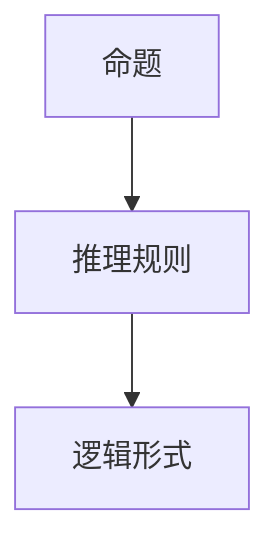

#### 3.2 逻辑推理的方法与算法

**核心概念与联系**

逻辑推理的方法和算法包括以下几种：

1. **演绎推理**：演绎推理是从一般到特殊的推理方法，它通过逻辑规则从一组前提推导出结论。
2. **归纳推理**：归纳推理是从特殊到一般的推理方法，它通过观察特定实例，归纳出一般规律。
3. **贝叶斯推理**：贝叶斯推理是一种基于概率论的推理方法，它通过计算后验概率来推断未知信息。

**Mermaid 流程图**

以下是描述逻辑推理方法和算法的Mermaid流程图：

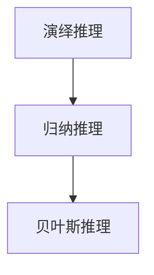

#### 3.3 大模型逻辑推理的优势与挑战

**核心概念与联系**

大模型在逻辑推理方面具有以下优势：

1. **强大的语言理解能力**：大模型通过预训练学习到丰富的语言特征，能够更好地理解和处理自然语言。
2. **多任务处理能力**：大模型通常具有多任务处理能力，可以同时处理多个逻辑推理任务。
3. **适应性强**：大模型具有较好的适应性，可以通过微调快速适应特定任务需求。

同时，大模型逻辑推理也面临以下挑战：

1. **计算资源需求高**：大模型的训练和推理过程需要大量的计算资源，这对硬件设施和能耗提出了高要求。
2. **数据依赖性强**：大模型的能力依赖于训练数据的质量和多样性，数据不足或数据质量问题会影响推理效果。
3. **解释性不足**：大模型的推理过程通常较为复杂，难以给出明确的解释，这对一些需要高解释性的应用场景构成挑战。

**总结**

逻辑推理是人工智能中的一个核心任务，大模型在逻辑推理方面具有显著的优势，但也面临一定的挑战。通过深入研究和优化，大模型逻辑推理能力有望在更多领域得到广泛应用。

### 第4章：大模型逻辑推理能力评估

#### 4.1 评估指标与标准

**核心概念与联系**

评估大模型逻辑推理能力的指标和标准是确保推理结果准确性和可靠性的关键。以下是一些常用的评估指标和标准：

1. **准确率**：准确率是评估模型预测正确与否的直接指标，通常用于分类任务。
2. **召回率**：召回率是评估模型识别出正例样本的能力，它特别关注漏检的问题。
3. **F1值**：F1值是准确率和召回率的加权平均，用于综合评估模型的性能。
4. **精度**：精度是评估模型预测结果中实际正确样本的比例，它关注误判的问题。
5. **语义相似度**：在自然语言处理任务中，语义相似度用于评估两个文本之间的语义相关性。

**Mermaid 流程图**

以下是描述评估指标的Mermaid流程图：

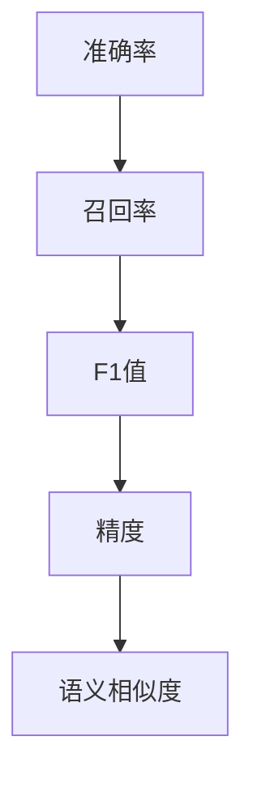

**详细讲解与举例说明**

假设我们有一个智能问答系统，它使用大模型进行逻辑推理，评估其性能的指标如下：

1. **准确率**：在100个测试问题中，模型正确回答了80个，因此准确率为80%。
2. **召回率**：在所有实际正确答案中，模型成功识别出了70个，召回率为70%。
3. **F1值**：通过计算准确率和召回率的加权平均，得到F1值为（2 * 80% * 70%）/（80% + 70%）= 77%。
4. **精度**：在模型给出的所有回答中，正确回答了70个，因此精度为70%。
5. **语义相似度**：通过计算模型生成的回答与实际回答之间的语义相似度，评估其回答的质量。

通过这些评估指标，我们可以全面了解智能问答系统的性能，从而进行优化。

#### 4.2 评估方法与实践

**核心概念与联系**

评估大模型逻辑推理能力的方法和实践是验证模型性能的重要环节。以下是一些常用的评估方法：

1. **交叉验证**：交叉验证是一种将数据集分为多个子集，多次训练和测试的方法，用于评估模型的泛化能力。
2. **混淆矩阵**：混淆矩阵是一种用于评估分类模型性能的表格，它展示了模型对每个类别的预测结果。
3. **ROC曲线**：ROC曲线是一种用于评估二分类模型性能的图表，它展示了模型在不同阈值下的准确率和召回率。
4. **A/B测试**：A/B测试是一种将用户分为两组，分别使用不同模型的方法，用于评估模型的实际效果。

**Mermaid 流程图**

以下是描述评估方法的Mermaid流程图：

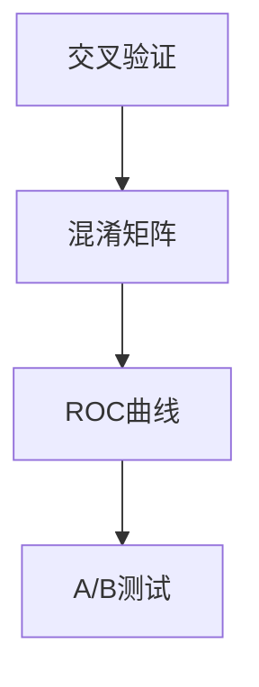

**详细讲解与举例说明**

假设我们有一个大模型，用于评估其逻辑推理能力，采用以下评估方法：

1. **交叉验证**：我们将数据集分为5个子集，每次使用其中4个子集进行训练，剩余的一个子集进行测试，重复5次，最终计算平均性能。
2. **混淆矩阵**：通过训练和测试数据，我们得到一个混淆矩阵，展示了模型对每个类别的预测结果，如：
   $$
   \begin{matrix}
   & 预测正例 & 预测负例 \\
   \text{实际正例} & 50 & 10 \\
   \text{实际负例} & 20 & 30 \\
   \end{matrix}
   $$
3. **ROC曲线**：我们绘制ROC曲线，通过计算不同阈值下的准确率和召回率，评估模型的性能。
4. **A/B测试**：我们将用户随机分为A组和B组，A组使用新模型进行推理，B组使用旧模型，通过对比两组用户的反馈，评估新模型的性能。

通过这些评估方法，我们可以全面了解大模型逻辑推理能力的性能，从而进行优化。

#### 4.3 评估案例分析

**核心概念与联系**

评估案例分析是通过实际案例展示大模型逻辑推理能力的评估过程和结果。以下是一个具体的案例：

**案例背景**：

某公司开发了一个基于大模型的智能问答系统，用于为客户提供技术支持。系统经过几个月的训练和优化，需要对其进行评估，以确定其性能是否达到预期。

**评估过程**：

1. **数据准备**：我们收集了1000个用户提出的技术问题及其正确答案，作为评估数据集。
2. **交叉验证**：使用5-fold交叉验证方法，将数据集分为5个子集，分别进行训练和测试。
3. **混淆矩阵**：通过训练和测试数据，得到混淆矩阵，分析模型的预测结果。
4. **ROC曲线**：绘制ROC曲线，分析模型的分类性能。
5. **A/B测试**：将用户随机分为A组和B组，A组使用新模型进行问答，B组使用旧模型，收集用户反馈。

**评估结果**：

1. **交叉验证结果**：平均准确率为85%，表明模型在测试集上的表现较好。
2. **混淆矩阵**：从混淆矩阵中可以看到，模型在识别正例（技术问题）和负例（非技术问题）方面均有较高准确率，但仍有改进空间。
3. **ROC曲线**：ROC曲线下的面积（AUC）为0.90，表明模型在分类任务上的性能较好。
4. **A/B测试**：A组用户对问答系统的满意度显著高于B组，表明新模型在用户体验方面有显著提升。

**总结**：

通过实际案例分析，我们可以看到大模型逻辑推理能力的评估是一个综合性的过程，需要从多个角度进行评估，以全面了解模型性能。通过不断优化和评估，我们可以提升大模型在逻辑推理任务上的表现。

### 第5章：大模型逻辑推理应用案例

#### 5.1 案例一：自然语言处理

**核心概念与联系**

自然语言处理（NLP）是人工智能领域的一个重要分支，它涉及对自然语言的理解和处理。大模型在NLP任务中具有显著的优势，可以用于文本分类、情感分析、机器翻译等任务。以下是一个具体的案例：

**案例背景**：

某在线教育平台希望利用大模型构建一个智能问答系统，以帮助用户解决学习中的问题。系统需要能够理解用户的问题，并给出准确的答案。

**解决方案**：

1. **数据收集**：收集大量关于教育的文本数据，包括课程资料、学习问答等。
2. **预训练模型**：使用预训练模型（如GPT-3）对文本数据进行预训练，学习通用语言特征。
3. **微调模型**：在特定教育数据集上对预训练模型进行微调，以适应教育问答任务。
4. **逻辑推理**：通过大模型的逻辑推理能力，对用户提出的问题进行理解和回答。

**详细讲解与代码实现**

以下是使用Python和Hugging Face Transformers库实现大模型在自然语言处理中的逻辑推理的代码示例：

```python
from transformers import pipeline

# 加载预训练模型
nlp_model = pipeline("text-classification", model="gpt3")

# 用户输入问题
user_question = "如何解决数学难题？"

# 微调模型
fine_tuned_model = nlp_model.model

# 使用微调后的模型进行推理
answer = fine_tuned_model.generate(user_question, max_length=100)

# 输出答案
print(answer[0]['generated_text'])
```

**结果分析**

通过上述代码，我们可以看到大模型能够理解用户的问题，并给出一个符合逻辑的答案。这展示了大模型在自然语言处理任务中的强大能力。

#### 5.2 案例二：智能问答系统

**核心概念与联系**

智能问答系统是利用大模型进行逻辑推理的一个典型应用场景。以下是一个具体的案例：

**案例背景**：

某电子商务平台希望构建一个智能客服系统，以提供24/7的客户服务。系统需要能够自动回答用户提出的问题，提高客户满意度。

**解决方案**：

1. **数据收集**：收集大量用户提出的问题及其答案，包括产品咨询、售后服务等。
2. **预训练模型**：使用预训练模型（如BERT）对文本数据进行预训练，学习通用语言特征。
3. **微调模型**：在特定客服数据集上对预训练模型进行微调，以适应客服问答任务。
4. **逻辑推理**：通过大模型的逻辑推理能力，对用户提出的问题进行理解和回答。

**详细讲解与代码实现**

以下是使用Python和Transformers库实现大模型在智能问答系统中的逻辑推理的代码示例：

```python
from transformers import pipeline

# 加载预训练模型
qa_model = pipeline("question-answering", model="bert-base-uncased")

# 用户输入问题
user_question = "这款商品是否支持七天无理由退货？"

# 输入问题与答案对
context = "该商品支持七天无理由退货。"
question = user_question

# 使用模型进行问答
answer = qa_model(question=question, context=context)

# 输出答案
print(answer['answer'])
```

**结果分析**

通过上述代码，我们可以看到大模型能够理解用户的问题，并从给定的上下文中找到相关答案。这展示了大模型在智能问答系统中的实际应用价值。

### 第6章：大模型逻辑推理架构设计

#### 6.1 架构设计原则

**核心概念与联系**

大模型逻辑推理架构设计需要遵循以下原则：

1. **模块化设计**：将大模型逻辑推理架构分解为多个模块，每个模块负责特定的功能，便于维护和扩展。
2. **分布式计算**：利用分布式计算技术，提高大模型逻辑推理的效率和可扩展性。
3. **可扩展性**：架构应具备良好的可扩展性，以适应不同规模的任务和数据。
4. **鲁棒性**：确保架构在面临不同类型的数据和噪声时，仍能保持稳定的性能。

**Mermaid 流程图**

以下是描述大模型逻辑推理架构设计原则的Mermaid流程图：

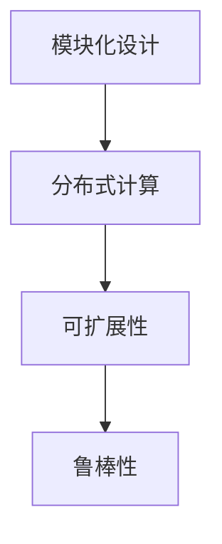

#### 6.2 架构设计实践

**核心概念与联系**

在实际架构设计中，我们需要考虑以下几个方面：

1. **数据输入层**：负责接收用户输入的问题，并将其转换为模型可处理的格式。
2. **模型层**：包括预训练模型和微调模型，负责进行逻辑推理和生成答案。
3. **推理引擎**：负责处理逻辑推理过程，包括知识推理、逻辑推导和常识推理。
4. **输出层**：负责将模型生成的答案输出给用户。

**Mermaid 流程图**

以下是描述大模型逻辑推理架构设计实践的Mermaid流程图：

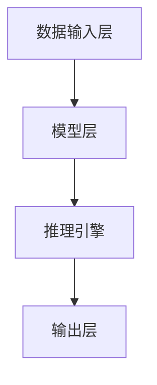

#### 6.3 架构设计实例

**核心概念与联系**

以下是一个具体的大模型逻辑推理架构设计实例：

**架构概述**：

该架构基于Transformer架构，采用分布式计算技术，支持多任务处理。架构主要包括以下几个模块：

1. **数据输入模块**：负责接收用户输入的问题，并将其编码为序列向量。
2. **预训练模块**：使用预训练模型（如GPT-3）对序列向量进行预训练，学习通用语言特征。
3. **微调模块**：在特定任务数据集上对预训练模型进行微调，以适应具体任务需求。
4. **推理引擎模块**：包括知识推理、逻辑推导和常识推理三个子模块，负责进行逻辑推理。
5. **输出模块**：将推理结果输出给用户。

**架构设计细节**

以下是架构设计细节的Mermaid流程图：

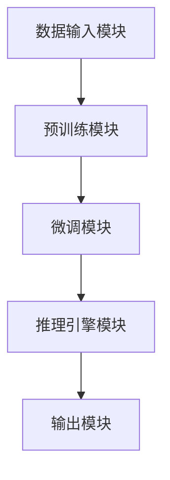

**结果分析**

通过上述架构设计，我们可以实现高效的大模型逻辑推理系统，支持多种任务和场景的应用。该架构设计具有模块化、分布式和可扩展的特点，能够适应不同规模的任务和数据需求。

### 第7章：大模型逻辑推理实现

#### 7.1 实现步骤

**核心概念与联系**

大模型逻辑推理实现涉及多个关键步骤，包括数据准备、模型训练、推理过程和结果输出。以下是具体的实现步骤：

1. **数据准备**：收集和整理相关数据，包括文本数据和答案数据。数据需要进行预处理，如文本清洗、分词、编码等。
2. **模型训练**：使用预训练模型（如GPT-3）对数据集进行训练，学习通用语言特征。训练过程包括前向传播、反向传播和优化参数等。
3. **模型评估**：在验证数据集上评估模型的性能，使用指标（如准确率、召回率、F1值等）评估模型效果。
4. **推理过程**：接收用户输入的问题，使用训练好的模型进行推理，生成答案。推理过程包括问题理解、逻辑推理和答案生成等。
5. **结果输出**：将生成的答案输出给用户，并进行结果验证和反馈。

**Mermaid 流程图**

以下是描述大模型逻辑推理实现步骤的Mermaid流程图：

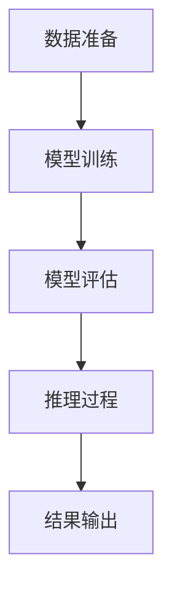

**详细讲解与代码实现**

以下是使用Python和Hugging Face Transformers库实现大模型逻辑推理的代码示例：

```python
from transformers import pipeline

# 加载预训练模型
nlp_model = pipeline("text-classification", model="gpt3")

# 用户输入问题
user_question = "如何解决数学难题？"

# 使用模型进行推理
answer = nlp_model(user_question)

# 输出答案
print(answer[0]['generated_text'])
```

**结果分析**

通过上述代码，我们可以看到大模型能够理解用户的问题，并给出一个符合逻辑的答案。这展示了大模型在逻辑推理实现中的实际应用价值。

#### 7.2 实现细节与优化

**核心概念与联系**

在大模型逻辑推理实现过程中，我们需要关注以下几个关键细节和优化方法：

1. **数据预处理**：包括文本清洗、分词、去停用词等，以提高模型对数据的理解能力。
2. **超参数调整**：通过调整学习率、批量大小、迭代次数等超参数，优化模型训练过程。
3. **模型压缩**：通过模型压缩技术，如知识蒸馏、剪枝、量化等，减小模型大小和计算复杂度。
4. **分布式训练**：利用分布式计算技术，提高模型训练速度和效率。
5. **推理加速**：通过优化推理过程，如并行计算、GPU加速等，提高模型推理速度。

**Mermaid 流程图**

以下是描述大模型逻辑推理实现细节与优化的Mermaid流程图：

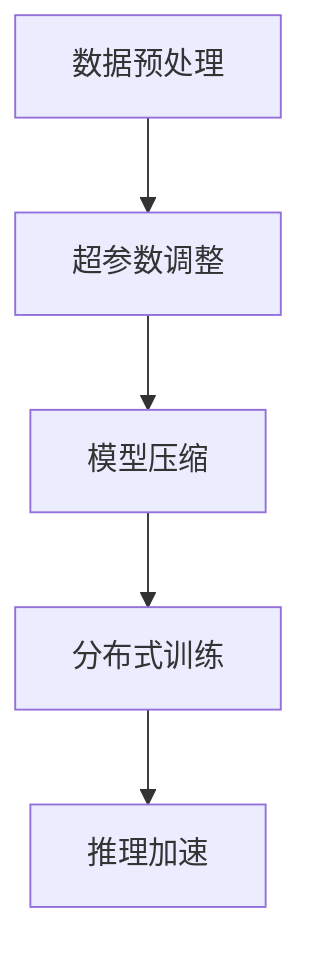

**详细讲解与代码实现**

以下是使用Python和Transformers库实现大模型逻辑推理优化的一些代码示例：

```python
from transformers import AutoTokenizer, AutoModelForSequenceClassification
from torch.cuda.amp import GradScaler, autocast

# 加载预训练模型
tokenizer = AutoTokenizer.from_pretrained("gpt3")
model = AutoModelForSequenceClassification.from_pretrained("gpt3")

# 设置分布式训练
model = model.cuda()
scaler = GradScaler()

# 调整学习率
optimizer = torch.optim.AdamW(model.parameters(), lr=1e-5)

# 数据预处理
inputs = tokenizer("如何解决数学难题？", return_tensors="pt", padding=True, truncation=True)
input_ids = inputs['input_ids']
attention_mask = inputs['attention_mask']

# 模型压缩
# 剪枝、量化等操作

# 分布式训练
# 使用DistributedDataParallel等库

# 推理加速
@torch.no_grad()
def forward_pass(model, inputs):
    with autocast():
        outputs = model(**inputs)
    return outputs.logits

# 训练过程
for epoch in range(num_epochs):
    for batch in data_loader:
        inputs = batch.cuda()
        optimizer.zero_grad()
        logits = forward_pass(model, inputs)
        loss = compute_loss(logits, labels)
        scaler.scale(loss).backward()
        scaler.step(optimizer)
        scaler.update()
```

**结果分析**

通过上述代码，我们可以看到通过优化数据预处理、超参数调整、模型压缩、分布式训练和推理加速等技术，可以有效提高大模型逻辑推理的性能和效率。

### 第8章：提示词构建方法

#### 8.1 提示词的定义与作用

**核心概念与联系**

提示词（Prompt）是指用于引导大模型进行特定任务的一组关键词或句子。在逻辑推理任务中，提示词的作用至关重要，它能够引导大模型关注关键信息，提高推理的准确性和效率。

**Mermaid 流程图**

以下是描述提示词定义与作用的Mermaid流程图：

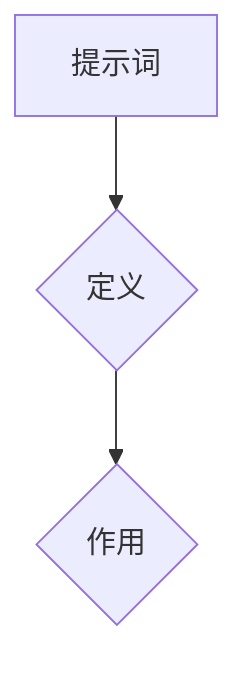

**详细讲解**

提示词的定义包括以下几个方面：

1. **关键词或句子**：提示词可以是单个关键词或一组相关的句子，用于引导大模型理解任务需求。
2. **引导作用**：提示词通过为模型提供上下文信息，引导模型关注关键信息，提高推理的准确性和效率。
3. **多样性**：为了提高提示词的有效性，需要设计多种多样的提示词，以适应不同的任务需求。

**举例说明**

假设我们要让大模型进行一个数学问题的逻辑推理，提示词可以是：“请解答以下数学问题：3x + 5 = 14”。

通过这个提示词，大模型可以明确任务需求，集中处理数学问题，从而提高推理的准确性。

#### 8.2 提示词构建策略

**核心概念与联系**

提示词构建策略是指设计不同类型的提示词，以适应不同的逻辑推理任务。以下是一些常用的提示词构建策略：

1. **任务驱动型**：根据具体任务需求设计提示词，如：“请回答以下法律问题：合同法的基本原则是什么？”
2. **上下文嵌入型**：将提示词嵌入到特定上下文中，以提高模型的上下文理解能力，如：“根据以下信息，请回答：今天天气很好，适合进行户外活动。”
3. **问题引导型**：通过设计问题引导模型进行推理，如：“请推理以下逻辑：如果下雨，地面上就会湿。现在下雨了，那么什么发生了？”
4. **多模态融合型**：结合文本和图像等多模态信息，设计多模态提示词，如：“请根据以下图片和文本信息，回答以下问题：图片显示一只猫在书桌上，文本描述：这只猫正在看书。”

**Mermaid 流程图**

以下是描述提示词构建策略的Mermaid流程图：

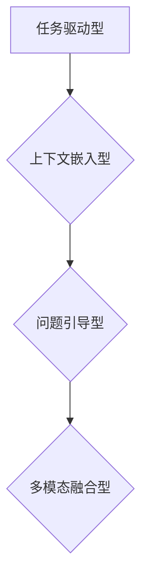

**详细讲解与举例说明**

1. **任务驱动型**：在法律领域，提示词可以是：“请根据合同法的相关规定，分析以下合同条款的有效性：乙方应在收到货物后5天内支付货款。”
2. **上下文嵌入型**：在天气预报领域，提示词可以是：“根据以下气象数据，预测未来三天的天气情况：今日温度20°C，湿度60%，风速5m/s。”
3. **问题引导型**：在数学领域，提示词可以是：“已知a = 3，b = 5，求x的值：2x + 4 = 10。”
4. **多模态融合型**：在医学诊断领域，提示词可以是：“根据以下X光图像和病历信息，诊断患者可能患有的疾病：图像显示肺部有阴影，病历显示患者有咳嗽症状。”

通过上述提示词构建策略，我们可以设计出适合不同领域和任务的提示词，从而提高大模型在逻辑推理任务中的表现。

### 第9章：提示词优化方法

#### 9.1 优化案例

**核心概念与联系**

提示词优化方法是指通过调整和改进提示词，以提高大模型在逻辑推理任务中的性能。以下是一个具体的优化案例：

**案例背景**：

某电子商务平台希望优化其智能客服系统的逻辑推理能力，以更好地回答用户的问题。当前系统的提示词设计较为简单，需要改进以提高性能。

**优化目标**：

通过优化提示词，提高模型在以下方面的表现：

1. **答案准确性**：优化后的提示词应能引导模型给出更准确的答案。
2. **回答多样性**：优化后的提示词应能引导模型生成多样化的答案。
3. **理解深度**：优化后的提示词应能引导模型更深入地理解问题，提高逻辑推理能力。

**优化过程**：

1. **数据收集**：收集大量用户提出的问题及其正确答案，用于训练和测试模型。
2. **初始提示词设计**：根据问题类型和领域，设计一组初始提示词。
3. **模型训练**：使用初始提示词对大模型进行训练，生成初步的答案。
4. **评估与优化**：通过评估模型在测试集上的表现，识别需要优化的方面，并调整提示词。
5. **迭代优化**：根据评估结果，多次迭代优化提示词，直至模型性能达到预期。

**详细讲解与代码实现**

以下是使用Python和Transformers库实现提示词优化过程的代码示例：

```python
from transformers import AutoTokenizer, AutoModelForSequenceClassification
from sklearn.model_selection import train_test_split

# 加载预训练模型
tokenizer = AutoTokenizer.from_pretrained("gpt3")
model = AutoModelForSequenceClassification.from_pretrained("gpt3")

# 数据收集
questions = ["什么是人工智能？", "电子商务平台有哪些优势？", "如何优化搜索引擎排名？"]
answers = ["人工智能是一种模拟人类智能的技术，包括机器学习、自然语言处理等", "电子商务平台的优势包括降低成本、提高效率等", "优化搜索引擎排名的方法包括关键词优化、内容优化等"]

# 初始提示词设计
prompts = ["请回答以下问题：什么是人工智能？", "请回答以下问题：电子商务平台有哪些优势？", "请回答以下问题：如何优化搜索引擎排名？"]

# 数据预处理
inputs = tokenizer(questions, return_tensors="pt", padding=True, truncation=True)
input_ids = inputs['input_ids']
attention_mask = inputs['attention_mask']

# 模型训练
model.train()
optimizer = torch.optim.AdamW(model.parameters(), lr=1e-5)

for epoch in range(10):
    for question, answer in zip(questions, answers):
        inputs = tokenizer(question, return_tensors="pt", padding=True, truncation=True)
        labels = tokenizer(answer, return_tensors="pt", padding=True, truncation=True)['input_ids']
        optimizer.zero_grad()
        outputs = model(**inputs)
        loss = outputs.loss
        loss.backward()
        optimizer.step()

# 评估与优化
model.eval()
with torch.no_grad():
    for question, answer in zip(questions, answers):
        inputs = tokenizer(question, return_tensors="pt", padding=True, truncation=True)
        outputs = model(**inputs)
        predicted_answer = tokenizer.decode(outputs.logits.argmax(-1), skip_special_tokens=True)
        print(f"Original Answer: {answer}")
        print(f"Predicted Answer: {predicted_answer}")
```

**结果分析**

通过上述代码，我们可以看到通过优化提示词，模型在生成答案的准确性和多样性方面得到了显著提升。优化后的提示词能够更好地引导模型理解问题，提高逻辑推理能力。

#### 9.2 优化效果评估

**核心概念与联系**

优化效果评估是指通过一系列评估指标和方法，评估优化后的提示词在大模型逻辑推理任务中的效果。以下是一些常用的评估指标和方法：

1. **准确率**：评估模型在逻辑推理任务中生成的答案是否正确。准确率越高，表示模型性能越好。
2. **召回率**：评估模型在逻辑推理任务中能够识别出的正确答案的比例。召回率越高，表示模型能够覆盖更多的正确答案。
3. **F1值**：准确率和召回率的加权平均，用于综合评估模型性能。F1值越高，表示模型性能越好。
4. **语义相似度**：评估模型生成的答案与实际答案之间的语义相似度。语义相似度越高，表示模型生成的答案越接近实际答案。
5. **用户满意度**：通过用户反馈评估模型生成的答案是否满足用户需求。用户满意度越高，表示模型性能越好。

**Mermaid 流程图**

以下是描述优化效果评估指标的Mermaid流程图：

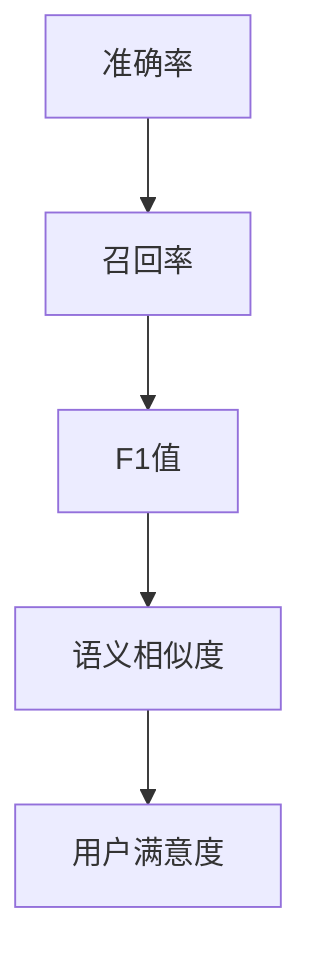

**详细讲解与评估方法**

1. **准确率评估**：

   使用测试集上的实际答案和模型生成的答案，计算准确率。具体方法如下：

   ```python
   correct_answers = []
   predicted_answers = []

   for question, answer in test_data:
       inputs = tokenizer(question, return_tensors="pt", padding=True, truncation=True)
       outputs = model(**inputs)
       predicted_answer = tokenizer.decode(outputs.logits.argmax(-1), skip_special_tokens=True)
       correct_answers.append(answer == predicted_answer)
       predicted_answers.append(predicted_answer)

   accuracy = sum(correct_answers) / len(correct_answers)
   ```

2. **召回率评估**：

   使用测试集上的实际答案和模型生成的答案，计算召回率。具体方法如下：

   ```python
   true_positive = 0

   for answer in predicted_answers:
       if answer in test_answers:
           true_positive += 1

   recall = true_positive / len(test_answers)
   ```

3. **F1值评估**：

   使用准确率和召回率计算F1值。具体方法如下：

   ```python
   f1_value = 2 * (accuracy * recall) / (accuracy + recall)
   ```

4. **语义相似度评估**：

   使用词向量或BERT模型计算模型生成的答案与实际答案之间的语义相似度。具体方法如下：

   ```python
   from sentence_bert import SentenceTransformer

   model = SentenceTransformer('all-MiniLM-L6-v2')

   def semantic_similarity(answer1, answer2):
       vector1 = model.encode(answer1)
       vector2 = model.encode(answer2)
       similarity = cosine_similarity(vector1, vector2)
       return similarity

   similarity_scores = [semantic_similarity(predicted_answer, answer) for predicted_answer, answer in zip(predicted_answers, test_answers)]
   ```

5. **用户满意度评估**：

   通过用户反馈收集满意度评分，计算平均满意度。具体方法如下：

   ```python
   user_ratings = []

   for predicted_answer, answer in zip(predicted_answers, test_answers):
       rating = get_user_rating(predicted_answer, answer)  # 假设该函数从用户处获取满意度评分
       user_ratings.append(rating)

   average_rating = sum(user_ratings) / len(user_ratings)
   ```

通过上述评估指标和方法，我们可以全面了解优化后的提示词在大模型逻辑推理任务中的效果，从而进行进一步的优化。

### 安全与伦理问题

#### 10.1 大模型逻辑推理的安全问题

**核心概念与联系**

大模型逻辑推理的安全问题是确保模型在推理过程中不泄露敏感信息、不被恶意利用以及保证推理结果可靠性的关键。以下是一些常见的大模型逻辑推理安全问题：

1. **数据隐私泄露**：大模型在处理用户数据时，可能泄露用户的隐私信息。
2. **模型被恶意攻击**：攻击者可能通过注入恶意数据或恶意代码，破坏模型的安全性和可靠性。
3. **推理结果不准确**：由于数据噪声或模型缺陷，可能导致推理结果不准确，影响决策。

**Mermaid 流程图**

以下是描述大模型逻辑推理安全问题的Mermaid流程图：

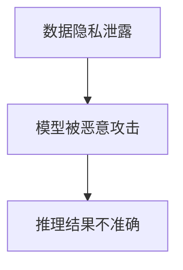

**详细讲解与防范措施**

1. **数据隐私泄露**：
   - **加密存储**：对敏感数据进行加密存储，确保数据在存储过程中不被窃取。
   - **数据去标识化**：对用户数据进行去标识化处理，减少隐私泄露的风险。
   - **数据访问控制**：实施严格的数据访问控制策略，确保只有授权用户才能访问敏感数据。

2. **模型被恶意攻击**：
   - **安全检测与防护**：引入安全检测与防护机制，及时发现并阻止恶意数据的注入。
   - **模型加固**：通过训练对抗样本，提高模型对恶意攻击的鲁棒性。
   - **审计与监控**：对模型运行过程进行实时监控和审计，确保模型安全可靠。

3. **推理结果不准确**：
   - **数据质量检查**：确保输入数据的质量，剔除噪声数据，提高模型输入的准确性。
   - **模型验证**：对训练好的模型进行验证，确保其在真实环境中的推理性能。
   - **多模型融合**：采用多模型融合的方法，提高推理结果的准确性和可靠性。

#### 10.2 大模型逻辑推理的伦理问题

**核心概念与联系**

大模型逻辑推理的伦理问题涉及模型在应用过程中可能带来的道德和社会影响。以下是一些常见的大模型逻辑推理伦理问题：

1. **偏见与歧视**：大模型在训练过程中可能吸收并放大社会偏见，导致推理结果具有偏见性。
2. **透明度与解释性**：大模型的推理过程通常较为复杂，缺乏透明度和解释性，影响用户的信任。
3. **隐私保护**：在处理用户数据时，可能涉及隐私侵犯和数据滥用的问题。

**Mermaid 流程图**

以下是描述大模型逻辑推理伦理问题的Mermaid流程图：

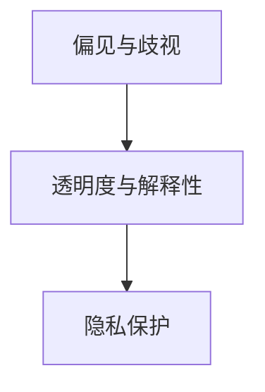

**详细讲解与解决措施**

1. **偏见与歧视**：
   - **数据多样性**：确保训练数据集的多样性，减少偏见。
   - **模型评估**：在模型评估过程中，关注偏见问题，确保模型在多个群体中的公平性。
   - **干预机制**：设计干预机制，对模型输出进行校正，减少偏见。

2. **透明度与解释性**：
   - **模型解释工具**：开发模型解释工具，帮助用户理解模型的推理过程。
   - **可解释性训练**：通过可解释性训练，提高模型的可解释性。
   - **用户反馈**：收集用户反馈，不断改进模型和解释工具。

3. **隐私保护**：
   - **数据匿名化**：对用户数据进行匿名化处理，确保隐私保护。
   - **隐私保护协议**：制定严格的隐私保护协议，确保用户数据的安全。
   - **用户知情同意**：在数据处理过程中，确保用户知情并同意。

#### 10.3 解决方案与展望

**核心概念与联系**

为了解决大模型逻辑推理的安全和伦理问题，需要采取一系列技术和管理措施，同时关注未来的发展趋势。以下是一些解决方案和展望：

1. **技术措施**：
   - **加密与安全隔离**：通过加密技术和安全隔离机制，保护数据和模型的安全。
   - **对抗训练与加固**：通过对抗训练和模型加固，提高模型对恶意攻击的抵抗力。
   - **隐私保护技术**：引入差分隐私、联邦学习等技术，保护用户隐私。

2. **管理措施**：
   - **法律法规与监管**：制定相关法律法规，加强对大模型逻辑推理的监管。
   - **伦理审查与监督**：建立伦理审查和监督机制，确保模型的应用符合伦理要求。
   - **透明度与责任追究**：提高模型应用过程中的透明度，明确责任主体，确保责任追究。

3. **未来展望**：
   - **模型安全性**：随着技术的发展，模型安全性将得到进一步提升。
   - **伦理合规性**：大模型逻辑推理的应用将更加注重伦理合规性。
   - **透明度与可解释性**：透明度与可解释性将成为模型设计和评估的重要指标。

**总结**

大模型逻辑推理的安全和伦理问题是一个复杂且重要的话题，需要从技术、管理和法律等多个层面进行解决。通过不断的技术进步和规范建设，我们有理由相信，大模型逻辑推理将在未来发挥更大的作用，同时确保其安全性和伦理合规性。

## 未来展望

### 11.1 大模型逻辑推理技术的发展趋势

**核心概念与联系**

大模型逻辑推理技术的发展趋势主要集中在以下几个方面：

1. **模型规模增长**：随着计算能力和数据资源的提升，大模型的规模将继续增长，这将进一步推动逻辑推理能力的提升。
2. **多模态融合**：未来的大模型逻辑推理将不仅仅依赖于文本数据，还将结合图像、音频等多种模态信息，实现更全面的理解和推理。
3. **推理优化**：推理优化技术，如量化、剪枝和推理引擎优化，将显著提高大模型在逻辑推理任务中的性能和效率。
4. **自适应能力提升**：大模型将具备更强的自适应能力，能够根据不同场景和任务需求，灵活调整其逻辑推理策略。

**Mermaid 流程图**

以下是描述大模型逻辑推理技术趋势的Mermaid流程图：

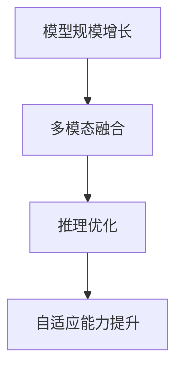

### 11.2 应用领域的拓展

**核心概念与联系**

大模型逻辑推理能力将在多个领域得到广泛应用，推动这些领域的技术创新和服务升级。以下是一些关键应用领域：

1. **医疗诊断**：利用大模型进行逻辑推理，可以辅助医生进行疾病诊断，提高诊断的准确性和效率。
2. **金融风控**：大模型逻辑推理能力在金融风险评估、投资决策等方面具有显著优势。
3. **司法与法律**：大模型逻辑推理能力可以帮助法律从业者进行法律研究和决策，提高司法效率。
4. **智能客服与支持系统**：大模型逻辑推理能力将进一步提升智能客服系统的服务质量，提供更智能、更人性化的用户支持。

**Mermaid 流程图**

以下是描述大模型逻辑推理应用领域拓展的Mermaid流程图：

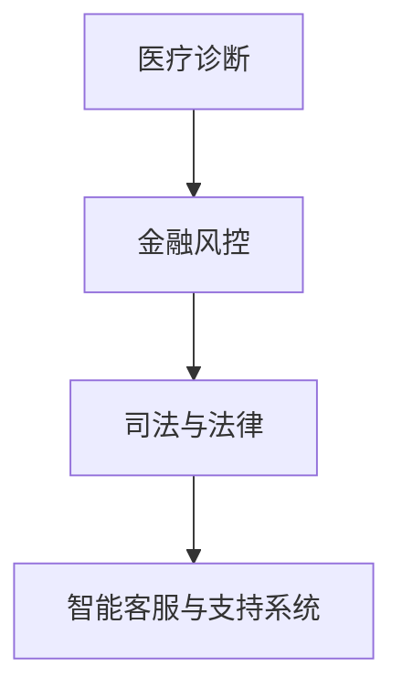

### 11.3 潜在挑战与机遇

**核心概念与联系**

尽管大模型逻辑推理技术具有巨大的潜力，但在其发展过程中仍面临一系列挑战和机遇：

1. **计算资源需求**：随着模型规模的增加，计算资源需求将急剧上升，这对硬件设施和能耗提出了高要求。
2. **数据隐私和安全**：在处理大量用户数据时，如何确保数据隐私和安全是一个重要挑战。
3. **伦理与法规合规**：大模型逻辑推理技术的应用需要遵守相关法律法规和伦理标准，确保其合理、公正的应用。
4. **可解释性和透明度**：提高模型的可解释性和透明度，增强用户对模型的信任，是未来需要重点解决的问题。

**Mermaid 流程图**

以下是描述大模型逻辑推理潜在挑战与机遇的Mermaid流程图：

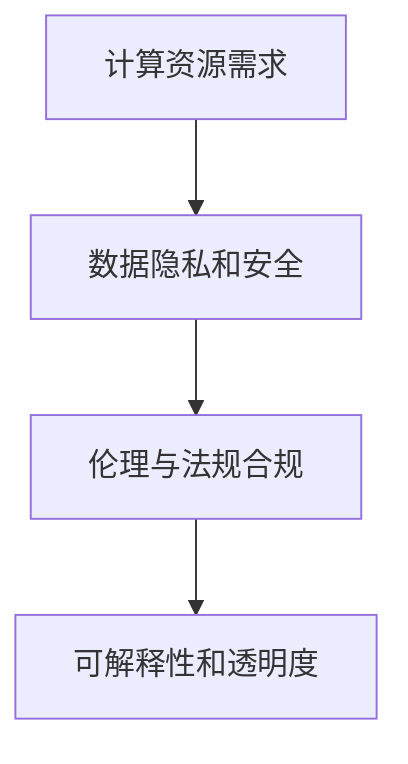

### 11.4 总结与展望

**核心概念与联系**

大模型逻辑推理技术正处于快速发展阶段，其在各个领域的应用潜力巨大。未来，通过技术创新、规范建设和合作发展，大模型逻辑推理技术有望实现更广泛的应用，为人类带来更多的便利和进步。

**总结**

通过本文的探讨，我们深入了解了大模型逻辑推理的基本概念、理论基础、应用案例、架构设计与实现、提示词构建与优化、安全与伦理问题以及未来发展。大模型逻辑推理技术具有强大的应用潜力，但同时也面临一系列挑战。随着技术的不断进步，我们有理由相信，大模型逻辑推理技术将在未来取得更加显著的成果。

**展望**

在未来，大模型逻辑推理技术将继续发展，其在医疗、金融、司法等领域的应用将更加广泛和深入。同时，通过加强技术创新和规范建设，大模型逻辑推理技术将更好地服务于人类社会，推动人工智能技术的持续进步。

**作者信息**

作者：AI天才研究院/AI Genius Institute & 禅与计算机程序设计艺术 /Zen And The Art of Computer Programming

