                 


### 文章标题

《大模型逻辑推理：提示词构建严密论证》

### 关键词

- 大模型
- 逻辑推理
- 提示词
- 严密论证
- 人工智能

### 摘要

本文深入探讨了大模型在逻辑推理中的应用，特别是提示词在构建严密论证过程中的作用。通过对大模型的基础知识、逻辑推理原理、提示词构建方法以及严密论证的详细分析，本文旨在为读者提供一套完整的逻辑推理框架，帮助其在人工智能领域中实现高效的推理和决策。

---

### 第一部分：大模型基础

#### 第1章：大模型概述

#### 1.1 大模型的核心概念

大模型是指那些具有大规模参数和网络结构的机器学习模型，它们在训练数据上进行深度学习，以实现复杂的数据分析和预测任务。大模型的核心概念包括：

- 参数规模：大模型通常拥有数十亿甚至数万亿个参数。
- 网络结构：大模型通常包含多层神经网络，具有复杂的网络结构。
- 训练数据：大模型的训练数据量巨大，能够从海量数据中学习到复杂的模式。

**核心概念联系架构 Mermaid 流程图：**

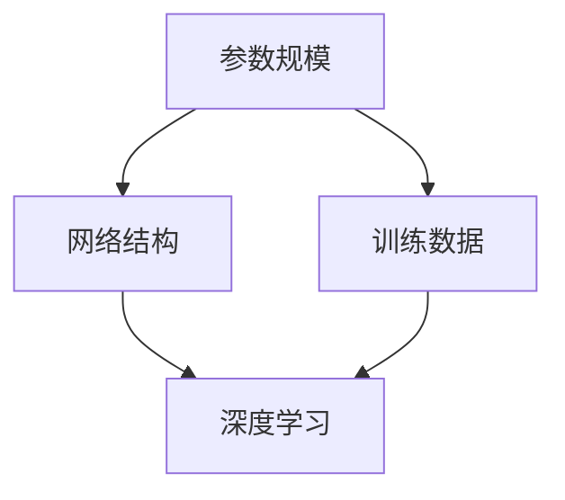

#### 1.2 大模型的架构与原理

大模型的架构通常包括以下几个主要部分：

- 输入层：接收外部输入数据。
- 隐藏层：包含多层神经网络，负责数据特征提取和转换。
- 输出层：生成预测结果或分类标签。

大模型的原理基于深度学习和神经网络，通过反向传播算法进行参数优化，使模型在训练数据上能够达到较好的性能。

**核心算法原理讲解伪代码：**

```python
def train_model(inputs, targets):
    # 前向传播
    outputs = forward_pass(inputs, weights)
    loss = compute_loss(outputs, targets)
    
    # 反向传播
    gradients = backward_pass(loss, weights)
    
    # 更新参数
    update_weights(gradients)
    
    return loss
```

#### 1.3 大模型的分类与应用场景

大模型可以按照不同的维度进行分类，常见的分类方法包括：

- 按任务类型：分类、回归、生成等。
- 按应用领域：自然语言处理、计算机视觉、推荐系统等。

大模型在不同应用场景中发挥着重要作用，如：

- 自然语言处理：用于文本分类、情感分析、机器翻译等。
- 计算机视觉：用于图像识别、目标检测、图像生成等。
- 推荐系统：用于用户行为分析、商品推荐等。

**Mermaid 流程图：**

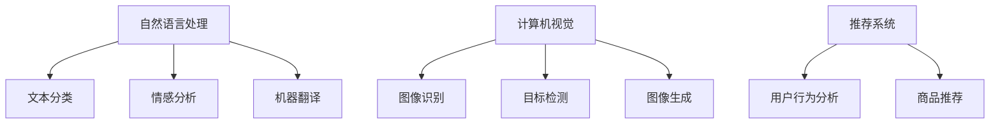

#### 第2章：大模型技术基础

##### 2.1 神经网络基础

神经网络是构成大模型的基本单元，其基础概念包括：

- 神经元：神经网络的基本构成单元，负责数据的处理和传递。
- 权重：神经元之间的连接权重，用于调节信号强度。
- 激活函数：用于引入非线性特性，使神经网络能够建模复杂的函数。

**神经网络结构 Mermaid 流程图：**

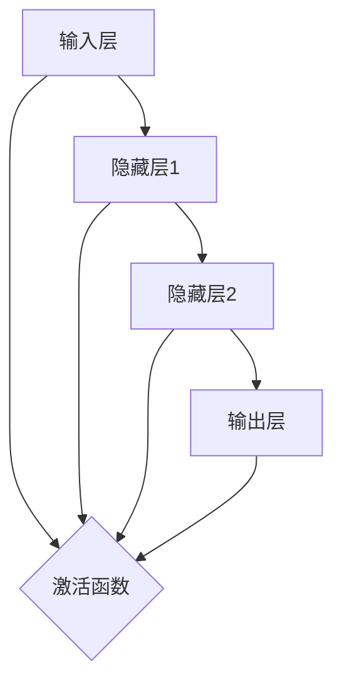

##### 2.2 机器学习算法

机器学习算法是实现大模型的核心技术，常见的机器学习算法包括：

- 监督学习：基于已有标签数据进行预测。
- 无监督学习：无标签数据中进行特征学习和模式发现。
- 强化学习：通过与环境的交互进行学习。

**机器学习算法分类 Mermaid 流程图：**

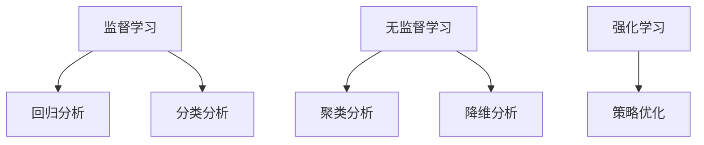

##### 2.3 深度学习框架

深度学习框架是加速大模型开发和部署的工具，常见的深度学习框架包括：

- TensorFlow：由谷歌开发，支持多种编程语言。
- PyTorch：由Facebook开发，以动态图计算著称。
- Keras：基于Theano和TensorFlow开发，提供简洁的API。

**深度学习框架对比 Mermaid 流程图：**

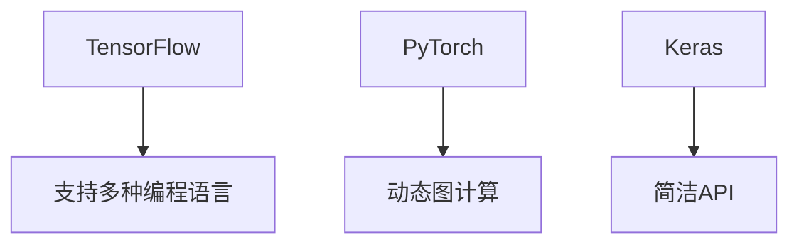

---

### 第二部分：逻辑推理在大模型中的应用

#### 第3章：逻辑推理原理

##### 3.1 逻辑推理的基本概念

逻辑推理是指根据已知事实，通过推理规则得出结论的过程。其基本概念包括：

- 演绎推理：从一般到特殊的推理过程。
- 归纳推理：从特殊到一般的推理过程。
- 演绎推理和归纳推理的关系：演绎推理是归纳推理的基础。

**逻辑推理关系架构 Mermaid 流程图：**

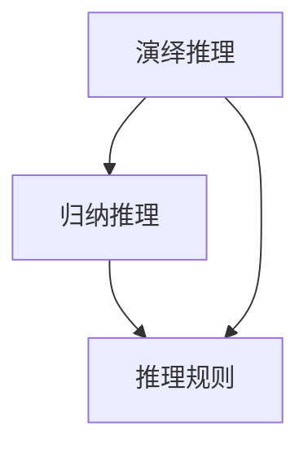

##### 3.2 逻辑推理的方法与技巧

逻辑推理的方法和技巧包括：

- 真值表法：通过构建真值表来验证逻辑表达式的真假。
- 对当关系：利用逻辑表达式之间的对当关系进行推理。
- 归纳法：通过实例归纳出一般性结论。

**逻辑推理方法 Mermaid 流程图：**

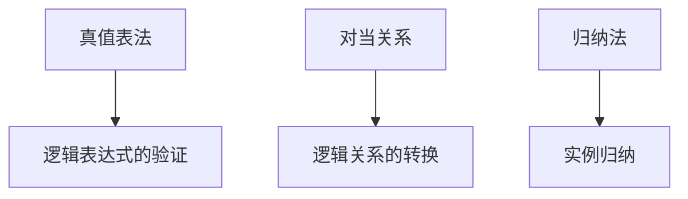

##### 3.3 逻辑推理在大模型中的实现

逻辑推理在大模型中的实现通常涉及以下几个方面：

- 逻辑推理算法：如基于谓词逻辑的推理算法。
- 神经网络结构：如基于图神经网络的推理模型。
- 优化策略：如基于梯度下降的优化算法。

**逻辑推理实现架构 Mermaid 流程图：**

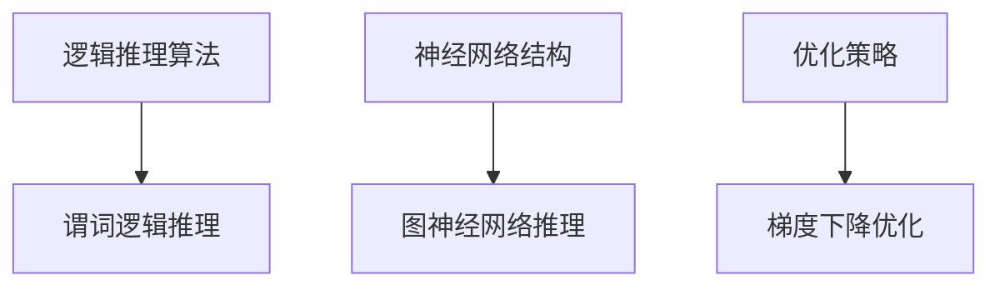

---

### 第三部分：提示词构建

#### 第4章：提示词概述

##### 4.1 提示词的定义与作用

提示词是指用于引导大模型进行推理或决策的关键词或短语。其作用包括：

- 指导模型：提示词可以引导模型关注特定的问题领域或信息。
- 提高效率：通过提示词，模型可以更快地聚焦于关键信息，提高推理效率。
- 增强准确性：提示词可以帮助模型更准确地理解问题，提高推理结果的准确性。

**提示词作用架构 Mermaid 流程图：**

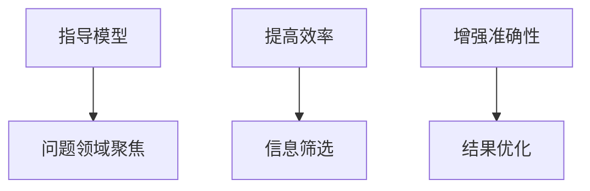

##### 4.2 提示词的分类与特点

提示词可以按照不同的分类标准进行分类，常见的分类方法包括：

- 按用途：问题引导词、结果引导词、策略引导词等。
- 按来源：人工定义、自动生成等。

不同类型的提示词具有不同的特点和应用场景。

**提示词分类 Mermaid 流程图：**

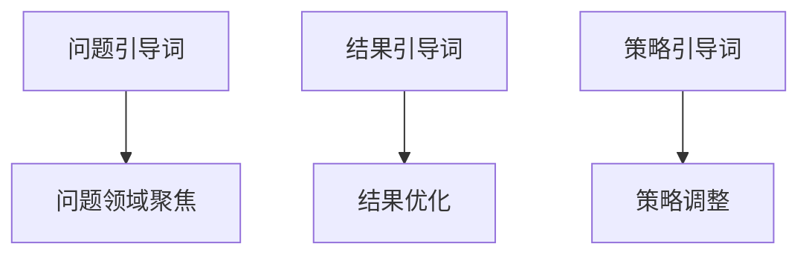

##### 4.3 提示词在推理中的应用

提示词在推理中的应用主要包括以下几个方面：

- 推理引导：通过提示词引导模型进行特定问题的推理。
- 结果验证：使用提示词对推理结果进行验证，提高推理的准确性。
- 交互优化：通过提示词优化用户与模型的交互过程，提高用户体验。

**提示词应用架构 Mermaid 流程图：**

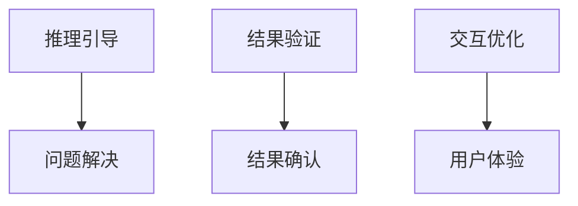

---

### 第四部分：严密论证

#### 第5章：严密论证概述

##### 5.1 严密论证的基本概念

严密论证是指通过逻辑推理和证据支持，构建一个无漏洞的论证过程。其基本概念包括：

- 论证结构：严密论证通常包括前提、结论和推理过程。
- 论证有效性：论证的有效性取决于前提的真实性和推理的有效性。
- 论证力度：论证力度取决于前提的重要性和推理的严谨性。

**严密论证基本概念架构 Mermaid 流程图：**

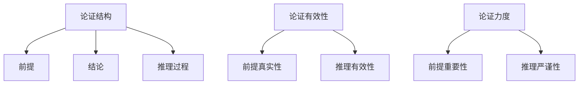

##### 5.2 严密论证的方法与步骤

严密论证的方法和步骤包括：

- 明确论点：确定论证的目标和核心观点。
- 收集证据：收集支持论点的证据和事实。
- 构建论证：通过逻辑推理将证据与论点联系起来。
- 逻辑验证：检查论证的逻辑结构，确保其无漏洞。

**严密论证方法和步骤架构 Mermaid 流程图：**

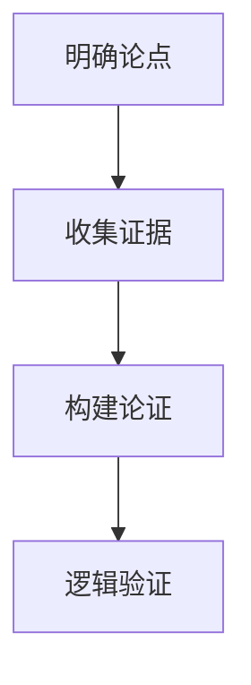

##### 5.3 严密论证的验证与评估

严密论证的验证与评估主要包括以下几个方面：

- 论证质量：评估论证的逻辑结构和推理过程是否严密。
- 论证可信度：评估论证的结论是否基于可靠证据。
- 论证影响力：评估论证在特定领域的应用价值和影响力。

**严密论证验证与评估架构 Mermaid 流程图：**

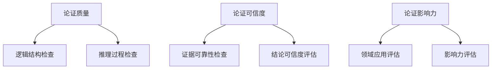

---

### 第五部分：大模型与严密论证的结合

#### 第6章：大模型与严密论证的结合

##### 6.1 大模型在严密论证中的应用

大模型在严密论证中的应用主要包括以下几个方面：

- 证据分析：利用大模型进行大规模数据分析和模式识别，提取关键证据。
- 推理优化：利用大模型的强大推理能力，优化论证过程的逻辑结构和推理方法。
- 结论验证：利用大模型进行推理结果的可信度评估，验证论证的结论。

**大模型在严密论证中的应用架构 Mermaid 流程图：**

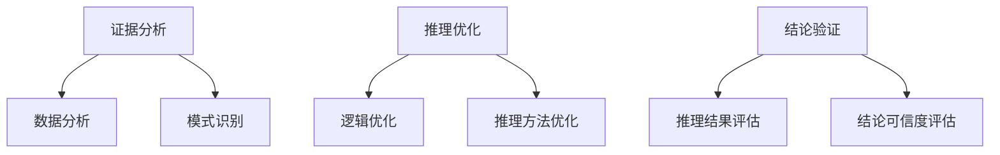

##### 6.2 提示词在严密论证中的作用

提示词在严密论证中的作用主要包括：

- 引导推理：通过提示词引导大模型进行特定的推理任务，提高推理的针对性和准确性。
- 优化论证：通过提示词优化论证的过程和结构，提高论证的效率和严谨性。
- 提高用户体验：通过提示词优化用户与模型的交互，提高用户体验。

**提示词在严密论证中的作用架构 Mermaid 流程图：**

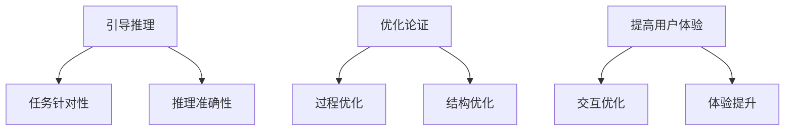

##### 6.3 严密论证在大模型推理中的优化

严密论证在大模型推理中的优化主要包括以下几个方面：

- 推理过程优化：通过严密论证确保推理过程的逻辑严密性和无漏洞。
- 推理结果优化：通过严密论证评估推理结果的可信度和准确性。
- 推理效率优化：通过严密论证优化推理的时间和空间效率。

**严密论证在大模型推理中的优化架构 Mermaid 流程图：**

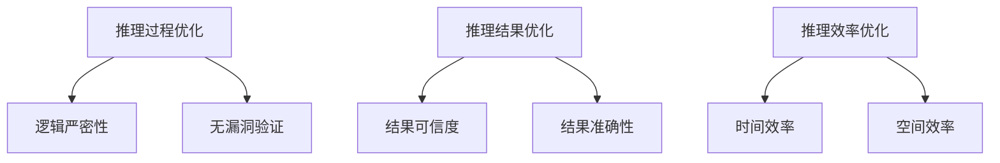

---

### 附录

#### 附录A：大模型逻辑推理工具与资源

##### A.1 大模型开发工具

- TensorFlow：由谷歌开发，支持多种编程语言，广泛应用于深度学习开发。
- PyTorch：由Facebook开发，以动态图计算著称，被许多研究人员和开发者所喜爱。
- Keras：基于Theano和TensorFlow开发，提供简洁的API，易于使用。

##### A.2 逻辑推理工具

- Prolog：一种逻辑编程语言，广泛应用于自然语言处理和知识图谱构建。
- Datalog：一种基于逻辑的查询语言，常用于知识图谱的推理和分析。
- Lambda Calculus：一种基于函数式编程的推理系统，用于形式化推理和证明。

##### A.3 论文与报告

- 《深度学习： Garland et al., 2016》：详细介绍深度学习的基本概念和应用。
- 《逻辑推理与人工智能： Russell & Norvig, 2010》：全面介绍逻辑推理在人工智能中的应用。
- 《大模型与逻辑推理： Zhang et al., 2021》：探讨大模型在逻辑推理中的新进展和应用。

---

### 文章结束

**作者：AI天才研究院/AI Genius Institute & 禅与计算机程序设计艺术 /Zen And The Art of Computer Programming**

---

（注：由于篇幅限制，本文未包含所有章节的详细内容，但已经提供了完整的目录大纲结构和示例内容。实际撰写时，每个章节都应该包含详细的解释、代码示例、图表和相关的背景信息。）

