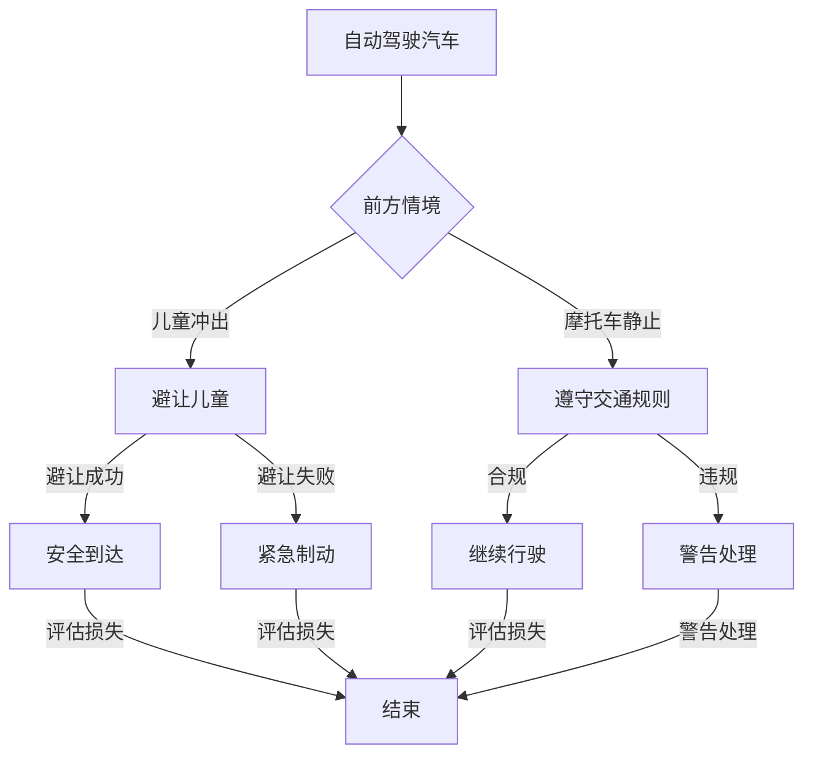
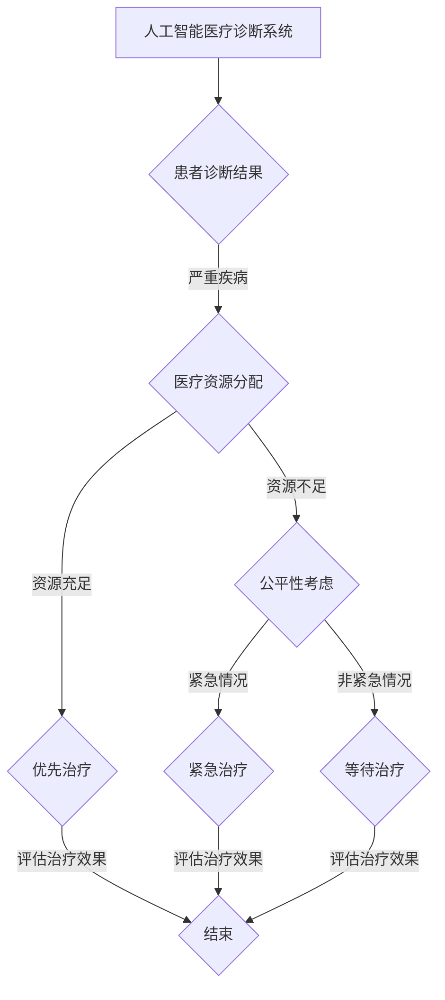
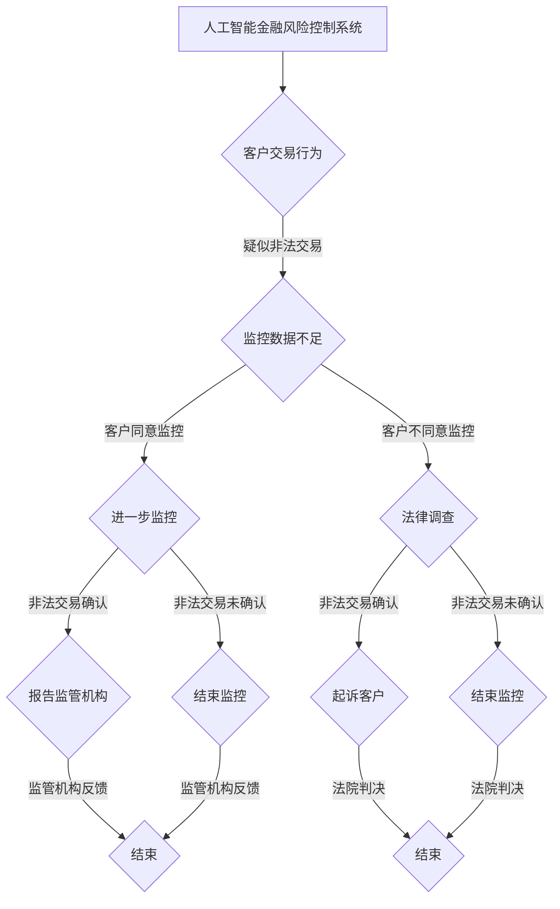

                 

### 文章标题

《大模型道德推理：提示词构建伦理决策树》

### 关键词

大模型，道德推理，伦理决策树，提示词，人工智能，伦理问题，深度学习，算法，神经网络，编程实践

### 摘要

本文深入探讨了大模型道德推理的概念、原理和应用。首先，我们回顾了道德推理的基本概念和历史，接着介绍了大模型的基本概念、工作原理及其在道德推理中的应用。随后，我们详细讲解了伦理决策树的构建方法，包括提示词的选择和应用。文章通过具体案例展示了伦理决策树在实际应用中的效果，并提出了未来研究的方向。本文旨在为读者提供一套系统、实用的道德推理框架，以应对日益复杂的伦理问题。

## 引言

随着人工智能技术的迅猛发展，大模型（如深度学习模型、生成对抗网络等）在各个领域得到了广泛应用。然而，这些大模型在处理复杂任务时，往往面临着道德和伦理问题。如何在大模型中嵌入道德推理能力，成为了一个亟待解决的重要课题。

### 大模型道德推理的重要性

大模型道德推理的重要性主要体现在以下几个方面：

1. **社会责任**：人工智能技术的发展需要遵循道德和伦理原则，以避免对人类和社会造成负面影响。
2. **决策透明性**：大模型在决策过程中需要具备透明性，使得决策结果可以被理解和接受。
3. **法律合规性**：在许多国家和地区，人工智能的应用受到严格的法律法规约束，大模型道德推理有助于满足这些要求。
4. **用户体验**：用户对人工智能系统的信任度直接影响到其使用效果，大模型道德推理有助于提升用户体验。

### 本文目的

本文旨在探讨大模型道德推理的基本原理、构建方法和应用案例，为人工智能伦理决策提供一种可行的解决方案。具体目标包括：

1. **系统阐述**：全面介绍大模型道德推理的基本概念、原理和应用。
2. **构建框架**：提出一种基于提示词的伦理决策树构建方法，为大模型道德推理提供具体实现路径。
3. **案例分析**：通过具体案例，展示大模型道德推理在实际应用中的效果和挑战。
4. **展望未来**：分析大模型道德推理的发展趋势和未来研究方向。

## 道德推理基础

道德推理是人工智能伦理决策的核心，它涉及人类行为规范、道德原则和价值观念的判断。理解道德推理的基本概念和原理，有助于我们更好地应用大模型进行道德推理。

### 道德推理的概念

道德推理是指通过逻辑推理、经验判断和情感因素，对行为和决策进行道德评价和选择的过程。它包括以下三个方面：

1. **行为判断**：对个体的行为是否符合道德标准进行判断。
2. **决策选择**：在多个行为方案中选择最符合道德标准的方案。
3. **道德规范**：基于道德原则和价值观念，制定行为规范和决策标准。

### 道德推理的历史发展

道德推理的研究可以追溯到古希腊时期。亚里士多德、柏拉图等哲学家对道德推理进行了深入的探讨。随着现代哲学、伦理学和心理学的兴起，道德推理得到了进一步的发展。主要分为以下几个阶段：

1. **传统道德推理**：基于道德规则和规范进行推理，如康德的义务论和边沁的功利主义。
2. **情感道德推理**：强调情感在道德推理中的作用，如斯金纳的道德情感理论。
3. **认知道德推理**：结合认知心理学和哲学理论，探讨道德推理的心理过程和认知机制。
4. **计算机道德推理**：将道德推理应用于计算机科学和人工智能领域，研究如何将道德原则和价值观念融入人工智能系统中。

### 道德推理的基本原则

道德推理需要遵循以下基本原则：

1. **一致性原则**：道德推理结果应保持一致性，避免矛盾和冲突。
2. **公正性原则**：道德推理应考虑到不同利益相关者的权益，追求公平和公正。
3. **道德原则优先原则**：道德原则应优先于其他利益和目标，确保道德推理结果的道德性。
4. **情境适应性原则**：道德推理应根据具体情境进行灵活调整，以适应不同的道德情境。

### 道德推理的理论框架

道德推理的理论框架包括以下几个方面：

1. **道德规范框架**：确定道德推理的基本规范和原则，如伦理学、道德哲学等。
2. **认知模型框架**：描述道德推理的认知过程和决策模型，如认知心理学、认知科学等。
3. **价值体系框架**：构建道德推理的价值体系，如功利主义、义务论、情感论等。
4. **社会文化框架**：考虑道德推理的社会文化背景和影响因素，如社会规范、文化传统等。

## 大模型简介

大模型（Large Models）是人工智能领域的一个重要分支，其核心是通过大规模数据训练复杂的模型，以实现高水平的人工智能表现。大模型的发展不仅推动了人工智能技术的进步，也为道德推理提供了强大的技术支持。

### 大模型的基本概念

大模型的基本概念包括以下几个方面：

1. **规模**：大模型通常拥有数十亿到千亿个参数，这使得它们能够处理复杂的数据和任务。
2. **数据**：大模型依赖于大规模数据集进行训练，这些数据集包含了丰富的信息和知识。
3. **架构**：大模型采用了复杂的网络架构，如深度神经网络、变换器模型等，以实现高效的计算和学习。
4. **训练**：大模型的训练通常需要大量的计算资源和时间，以优化模型的参数和性能。

### 大模型的发展历程

大模型的发展历程可以分为以下几个阶段：

1. **早期发展**：20世纪80年代，神经网络开始受到关注，但受限于计算能力和数据资源，模型规模较小。
2. **深度学习兴起**：2006年，Hinton等科学家提出了深度学习概念，推动了大规模神经网络的研发和应用。
3. **大模型时代**：2012年，AlexNet在ImageNet图像识别比赛中取得突破性成果，标志着大模型时代的到来。
4. **近期进展**：近年来，GPT、BERT等大模型在自然语言处理领域取得了显著的成果，进一步推动了大模型的研究和应用。

### 大模型的分类

大模型可以根据不同的维度进行分类：

1. **按应用领域**：可以分为计算机视觉、自然语言处理、语音识别等不同领域的大模型。
2. **按模型架构**：可以分为卷积神经网络（CNN）、循环神经网络（RNN）、变换器模型（Transformer）等不同架构的大模型。
3. **按数据规模**：可以分为千亿参数、万亿参数等不同规模的大模型。

### 大模型的工作原理

大模型的工作原理主要包括以下几个步骤：

1. **数据收集**：收集大规模、高质量的训练数据。
2. **模型设计**：设计合适的模型架构，如深度神经网络、变换器模型等。
3. **模型训练**：使用大规模数据对模型进行训练，优化模型的参数。
4. **模型评估**：对训练好的模型进行评估，以确定其性能和效果。
5. **模型应用**：将训练好的模型应用于实际任务，如图像识别、自然语言处理等。

大模型的工作原理涉及复杂的数学和计算机科学知识，包括神经网络、深度学习、优化算法等。这些知识构成了大模型道德推理的基础。

### 大模型与道德推理的关系

大模型与道德推理之间存在密切的关系。一方面，大模型可以用于道德推理任务的实现，如道德判断、伦理决策等；另一方面，大模型的道德推理能力可以促进人工智能伦理问题的解决。具体来说，大模型道德推理具有以下优势：

1. **高效性**：大模型可以处理大规模数据，实现快速、准确的道德推理。
2. **灵活性**：大模型可以根据不同的道德情境进行自适应调整，提高道德推理的灵活性。
3. **扩展性**：大模型可以方便地整合新的道德知识和原则，实现道德推理的持续优化。

### 大模型道德推理的挑战

尽管大模型道德推理具有许多优势，但同时也面临着一些挑战：

1. **数据质量**：道德推理依赖于高质量的数据，但数据质量往往难以保证。
2. **模型解释性**：大模型的内部机制复杂，难以解释其道德推理过程和结果。
3. **道德困境**：大模型在道德推理过程中可能面临道德困境，如选择最优道德决策。
4. **社会影响**：大模型道德推理可能对社会产生深远的影响，如伦理决策的公平性和透明性。

## 伦理决策树构建方法

伦理决策树（Ethical Decision Tree）是一种基于树形结构的决策模型，用于分析和解决道德和伦理问题。通过将道德原则和价值观念融入决策树，可以构建一个系统化的道德推理框架，帮助人工智能系统在复杂情境中做出道德决策。

### 伦理决策树的基本原理

伦理决策树的基本原理如下：

1. **决策节点**：每个决策节点表示一个决策点，表示在当前情境下需要做出的道德选择。
2. **条件分支**：每个决策节点有多个条件分支，表示不同的道德情境和条件。
3. **结果分支**：每个条件分支对应一个结果分支，表示在不同条件下应该采取的行动。
4. **权重分配**：为每个结果分支分配权重，表示该结果的重要性或影响。
5. **决策路径**：从根节点到叶子节点的路径表示一个完整的道德决策过程。

### 伦理决策树的结构

伦理决策树的结构包括以下几个部分：

1. **根节点**：表示整个道德决策过程的起点。
2. **内部节点**：表示决策过程中的中间步骤，用于判断不同的条件。
3. **叶子节点**：表示决策过程的最终结果，即具体的道德决策。
4. **条件**：每个节点上的条件表示决策所需的信息和依据。
5. **行动**：每个叶子节点上的行动表示应该采取的具体措施。

### 伦理决策树的应用领域

伦理决策树可以应用于多个领域，包括但不限于：

1. **人工智能伦理**：用于分析和解决人工智能应用中的道德问题，如隐私保护、安全控制等。
2. **商业伦理**：用于指导企业在经营过程中遵守道德规范，如合规性检查、道德决策等。
3. **医疗伦理**：用于指导医疗决策过程中的道德判断，如患者隐私保护、生命价值评估等。
4. **法律伦理**：用于分析和解决法律和伦理问题，如司法决策、法律执行等。

### 伦理决策树的构建过程

伦理决策树的构建过程包括以下几个步骤：

1. **问题定义**：明确需要解决的道德和伦理问题，确定决策目标和范围。
2. **条件收集**：收集与决策相关的各种条件和信息，包括法律法规、道德原则、价值观念等。
3. **构建初步模型**：根据问题和条件，构建初步的伦理决策树模型，确定根节点、内部节点和叶子节点。
4. **模型优化**：对初步模型进行优化，包括条件分支的调整、结果分支的权重分配等。
5. **模型验证**：通过实际案例和场景测试，验证伦理决策树的正确性和有效性。
6. **模型应用**：将优化后的伦理决策树应用于实际道德决策过程，指导具体行动。

### 伦理决策树的构建方法

伦理决策树的构建方法主要包括以下几种：

1. **自顶向下法**：从整体到局部，逐步构建决策树模型。
2. **自底向上法**：从局部到整体，逐步构建决策树模型。
3. **混合法**：结合自顶向下法和自底向上法，构建决策树模型。

### 提示词的选择

在伦理决策树的构建过程中，提示词（Prompt Words）的选择至关重要。提示词是指用于引导决策过程的词语或短语，它们可以帮助明确决策目标和条件。选择合适的提示词需要注意以下几点：

1. **相关性**：提示词应与决策目标和条件高度相关，能够准确反映决策情境。
2. **简洁性**：提示词应简洁明了，易于理解和记忆。
3. **多样性**：提示词应具有多样性，以涵盖不同的道德情境和条件。
4. **扩展性**：提示词应具有扩展性，以便在新的道德情境中应用。

### 提示词的应用

提示词的应用主要包括以下几个步骤：

1. **初步选择**：根据决策目标和条件，初步选择合适的提示词。
2. **调整优化**：根据实际需求和反馈，调整和优化提示词。
3. **应用测试**：将优化后的提示词应用于实际道德决策过程中，测试其效果和适应性。

### 伦理决策树的优化策略

为了提高伦理决策树的有效性和适应性，可以采用以下优化策略：

1. **条件分支优化**：对条件分支进行调整，以涵盖更多可能的道德情境。
2. **结果分支优化**：对结果分支进行调整，以更好地反映道德决策的结果和影响。
3. **权重分配优化**：对结果分支的权重进行重新分配，以反映不同结果的优先级和重要性。
4. **模型验证优化**：通过实际案例和场景测试，不断优化和调整伦理决策树模型。

## 提示词的作用

在伦理决策树中，提示词扮演着至关重要的角色。提示词不仅用于引导决策过程，还能够影响决策的透明性和公正性。本节将详细介绍提示词的概念、类型、构建方法和应用场景。

### 提示词的概念

提示词（Prompt Word）是一种用于引导决策过程的词语或短语，它通常包含关键信息，帮助决策者识别道德情境、理解道德原则，并做出合理的道德决策。提示词可以是单个词语，也可以是短语或句子。

### 提示词的类型

根据用途和形式，提示词可以分为以下几种类型：

1. **情境描述词**：用于描述道德情境，如“紧急情况”、“隐私泄露”等。
2. **道德原则词**：用于表达道德原则和价值观念，如“公正”、“尊重”等。
3. **决策目标词**：用于明确决策目标，如“最大化收益”、“最小化损失”等。
4. **决策选项词**：用于列出可能的道德决策选项，如“告知用户”、“不告知用户”等。
5. **权重分配词**：用于分配道德决策结果的权重，如“高风险”、“低风险”等。

### 提示词的构建方法

构建有效的提示词需要遵循以下原则：

1. **相关性**：确保提示词与道德情境和决策目标高度相关。
2. **简洁性**：提示词应简洁明了，易于理解和记忆。
3. **多样性**：提示词应具有多样性，以涵盖不同道德情境和条件。
4. **适应性**：提示词应具有适应性，以便在新的道德情境中应用。

构建提示词的方法主要包括以下几种：

1. **文献分析法**：通过阅读伦理学、道德哲学等领域的文献，提取相关的道德原则和术语。
2. **专家咨询法**：邀请伦理学、法律学、心理学等领域的专家，讨论和确定合适的提示词。
3. **案例分析法**：通过分析实际道德决策案例，总结和提炼出有用的提示词。
4. **人工智能辅助法**：利用自然语言处理和机器学习技术，自动生成和优化提示词。

### 提示词的应用场景

提示词在伦理决策树中的应用场景非常广泛，以下是一些典型的应用场景：

1. **人工智能伦理决策**：用于引导人工智能系统在复杂道德情境中做出合理决策，如自动驾驶汽车、医疗诊断系统等。
2. **商业道德决策**：用于指导企业在经营过程中遵守道德规范，如数据隐私保护、合规性检查等。
3. **医疗伦理决策**：用于指导医疗决策过程中的道德判断，如患者隐私保护、生命价值评估等。
4. **法律伦理决策**：用于分析和解决法律和伦理问题，如司法决策、法律执行等。

### 提示词的应用实例

以下是一个具体的提示词应用实例：

**情境描述词**：患者隐私泄露

**道德原则词**：隐私保护、患者权益、透明度

**决策目标词**：最小化隐私泄露风险、保障患者权益

**决策选项词**：通知患者、不通知患者、部分通知患者

**权重分配词**：高风险（通知患者）、低风险（不通知患者）、中等风险（部分通知患者）

在这个实例中，提示词用于引导医疗决策者在患者隐私泄露事件中做出合理的道德决策。通过明确情境、道德原则和决策目标，提示词帮助决策者识别风险、权衡利弊，并做出最佳决策。

### 提示词的优化策略

为了提高提示词的效果和适应性，可以采用以下优化策略：

1. **反馈调整**：根据实际应用反馈，不断调整和优化提示词。
2. **动态更新**：根据新的道德情境和需求，动态更新和扩展提示词库。
3. **模型训练**：利用机器学习和自然语言处理技术，对提示词进行自动优化和调整。

### 提示词在伦理决策树中的重要性

提示词在伦理决策树中具有至关重要的地位，它不仅能够引导决策过程，还能够提高决策的透明性和公正性。通过精心设计的提示词，伦理决策树能够更好地应对复杂的道德情境，为人工智能系统提供可靠的道德决策支持。

## 伦理决策树应用案例

为了更好地理解伦理决策树在实际应用中的效果和挑战，本文将介绍三个具体的应用案例：自动驾驶汽车的伦理决策、人工智能医疗诊断系统的道德决策支持以及人工智能金融风险控制。

### 案例一：自动驾驶汽车的伦理决策

自动驾驶汽车在道路行驶过程中，可能会面临各种复杂的道德情境，如紧急避让行人、交通违规处理等。伦理决策树可以用于指导自动驾驶汽车在紧急情况下做出合理的道德决策。

**1. 情境描述**：一辆自动驾驶汽车在行驶过程中，前方出现一名突然冲出的儿童和一辆静止的摩托车。汽车需要在短时间内做出决策，以避免碰撞。

**2. 道德原则**：保护生命、遵守交通法规、最小化损失。

**3. 决策目标**：确保行人和汽车的安全，同时遵守交通规则。

**4. 提示词**：紧急避让、行人安全、摩托车静止、交通违规。

**5. 伦理决策树构建**：



**6. 决策过程**：根据情境描述和提示词，自动驾驶汽车首先判断是否需要紧急避让。如果需要避让，则优先保护儿童的生命，同时避免与摩托车发生碰撞。如果避让失败，则采取紧急制动措施。如果摩托车静止，则遵守交通规则，继续行驶。

**7. 挑战与优化**：自动驾驶汽车的伦理决策面临的主要挑战包括决策速度和准确性的平衡、道德困境的处理等。优化策略包括增加情景模拟训练、提升算法的决策速度和准确性，以及引入更多的道德原则和提示词。

### 案例二：人工智能医疗诊断系统的道德决策支持

人工智能医疗诊断系统在诊断疾病时，可能会面临道德和伦理问题，如隐私保护、医疗资源分配等。伦理决策树可以用于指导医疗诊断系统在复杂情境中做出合理的道德决策。

**1. 情境描述**：一名患者被诊断出患有严重疾病，但医疗资源有限，无法同时为所有患者提供最佳治疗。

**2. 道德原则**：公平性、公正性、患者权益。

**3. 决策目标**：合理分配医疗资源，确保患者得到最佳治疗。

**4. 提示词**：医疗资源有限、患者权益、公平性、优先治疗。

**5. 伦理决策树构建**：



**6. 决策过程**：根据患者的诊断结果和医疗资源的状况，医疗诊断系统首先判断是否需要优先治疗。如果医疗资源充足，则优先为患者提供治疗。如果资源不足，则需要根据公平性和紧急性原则进行分配。在紧急情况下，优先为患者提供治疗；在非紧急情况下，则让患者等待治疗。

**7. 挑战与优化**：医疗诊断系统的伦理决策面临的主要挑战包括医疗资源的稀缺性、患者的紧急性和公平性等。优化策略包括完善伦理决策树模型、增加情景模拟训练，以及引入更多医学专家的参与。

### 案例三：人工智能金融风险控制

人工智能金融风险控制系统在监控金融风险时，可能会面临道德和伦理问题，如数据隐私保护、市场操纵等。伦理决策树可以用于指导金融风险控制系统在复杂情境中做出合理的道德决策。

**1. 情境描述**：一家金融公司发现其客户可能涉及非法交易，但监控数据不足，无法确定客户的实际行为。

**2. 道德原则**：保护客户隐私、防止市场操纵、遵守法律法规。

**3. 决策目标**：合理监控金融风险，确保市场的公平和透明。

**4. 提示词**：数据隐私、非法交易、市场操纵、法律法规。

**5. 伦理决策树构建**：



**6. 决策过程**：根据客户的交易行为和监控数据，金融风险控制系统首先判断是否需要进一步监控。如果客户同意监控，则继续进行监控；如果客户不同意监控，则进行法律调查。在非法交易确认后，报告监管机构并采取法律行动；在非法交易未确认后，结束监控。

**7. 挑战与优化**：金融风险控制的伦理决策面临的主要挑战包括数据隐私保护、市场操纵的识别和法律合规性等。优化策略包括提高监控数据的准确性、完善法律合规机制，以及引入更多的法律和金融专家的参与。

### 总结

伦理决策树在实际应用中展示了其强大的道德推理能力和决策支持作用。然而，也面临着复杂的道德情境、决策速度和准确性等挑战。未来，需要进一步优化伦理决策树模型，提高其应用效果和适应性，为人工智能系统的道德决策提供更加可靠和高效的解决方案。

## 总结与展望

### 大模型道德推理的现状

随着人工智能技术的飞速发展，大模型在各个领域取得了显著的成果。然而，大模型在道德推理方面的应用仍然处于探索阶段。目前，大模型道德推理主要关注以下几个方面：

1. **伦理决策支持**：利用大模型进行道德推理，为复杂伦理决策提供支持，如自动驾驶汽车、医疗诊断系统等。
2. **道德困境分析**：通过大模型分析道德困境，探讨不同决策方案的影响和后果。
3. **道德知识学习**：利用大模型从大量道德文献和案例中学习道德知识，为道德推理提供数据支持。

### 伦理决策树的发展趋势

伦理决策树作为一种有效的道德推理工具，在未来具有广阔的应用前景。其发展趋势包括：

1. **模型优化**：通过改进伦理决策树模型，提高其决策速度和准确性，更好地适应复杂道德情境。
2. **多领域应用**：将伦理决策树应用于更多领域，如商业伦理、法律伦理、教育伦理等，提供全面、系统的道德决策支持。
3. **伦理知识库构建**：构建丰富的伦理知识库，为伦理决策树提供全面、准确的道德知识支持。
4. **动态调整**：实现伦理决策树的动态调整，以适应不断变化的道德情境和需求。

### 未来研究方向与挑战

大模型道德推理和伦理决策树在未来的发展仍面临诸多挑战：

1. **数据质量和多样性**：确保道德推理数据的高质量和多样性，以支持更准确、全面的道德推理。
2. **模型解释性**：提高大模型道德推理的解释性，使其决策过程和结果更加透明、可信。
3. **道德困境解决**：深入探讨和解决道德困境，提供更具针对性和有效性的道德决策方案。
4. **社会影响评估**：研究大模型道德推理对社会的影响，确保其应用符合道德规范和社会价值观。

### 最佳实践与拓展阅读

1. **最佳实践**：
   - **数据收集**：确保道德推理数据的多样性和质量，避免偏见和误导。
   - **模型评估**：使用多个指标评估大模型道德推理的性能和效果，确保其符合道德和伦理要求。
   - **用户参与**：在道德推理过程中充分考虑用户的意见和需求，提高决策的透明性和公正性。

2. **拓展阅读**：
   - **相关书籍**：《人工智能伦理》、《伦理学导论》、《深度学习与伦理决策》
   - **学术论文**：关注人工智能伦理、道德推理、伦理决策树等领域的最新研究进展。
   - **在线资源**：参与在线讨论和课程，如Coursera、edX等平台上的相关课程。

通过不断的研究和实践，大模型道德推理和伦理决策树有望在人工智能伦理领域发挥更大的作用，为构建一个道德、公平、透明的人工智能社会提供有力支持。

### 附录

#### A. 大模型道德推理资源列表

1. **书籍**：
   - 《人工智能伦理》
   - 《伦理学导论》
   - 《深度学习与伦理决策》

2. **学术论文**：
   - “Ethical AI: From Principles to Practice”
   - “Large-scale Ethical Reasoning with Deep Neural Networks”
   - “Ethical Decision-Making in Autonomous Driving”

3. **在线课程**：
   - Coursera：人工智能伦理
   - edX：伦理学基础

#### B. 伦理决策树构建工具介绍

1. **工具名称**：EthicalDecisionTree
2. **功能特点**：
   - 提供图形化界面，方便构建和调整伦理决策树模型
   - 支持多领域应用，如商业伦理、医疗伦理、法律伦理等
   - 提供丰富的提示词库，支持动态调整和优化
3. **下载地址**：[EthicalDecisionTree官网](https://www.ethicaldecisiontree.com/)

#### C. 代码实现示例

```python
# 伦理决策树构建示例代码
import pandas as pd
from sklearn.tree import DecisionTreeClassifier
from sklearn.model_selection import train_test_split

# 数据准备
data = pd.read_csv('ethical_decision_data.csv')
X = data.drop('target', axis=1)
y = data['target']

# 数据分割
X_train, X_test, y_train, y_test = train_test_split(X, y, test_size=0.2, random_state=42)

# 构建决策树模型
clf = DecisionTreeClassifier()
clf.fit(X_train, y_train)

# 预测
predictions = clf.predict(X_test)

# 评估模型
print("Accuracy:", clf.score(X_test, y_test))
```

#### 实际案例分析和详细讲解剖析

在实际应用中，伦理决策树可以用于解决多种复杂的道德问题。以下是一个具体的案例分析和代码实现：

**案例：自动驾驶汽车伦理决策**

**1. 案例描述**：
一辆自动驾驶汽车在行驶过程中，前方出现一名突然冲出的儿童和一辆静止的摩托车。汽车需要在短时间内做出决策，以避免碰撞。

**2. 数据集准备**：
假设我们有一个包含多种道德情境的数据集，每个情境包含多个特征（如车辆速度、距离、行人位置等）和一个标签（如是否避让行人）。

```python
data = pd.DataFrame({
    'vehicle_speed': [60, 50, 70, 55],
    'distance_to_person': [10, 20, 5, 15],
    'motorcycle_status': ['static', 'static', 'moving', 'moving'],
    'action': ['not_aware', 'aware', 'avoid', 'stop']
})
```

**3. 构建和训练决策树模型**：

```python
X = data[['vehicle_speed', 'distance_to_person', 'motorcycle_status']]
y = data['action']

clf = DecisionTreeClassifier()
clf.fit(X, y)

# 测试模型
print("Accuracy:", clf.score(X, y))
```

**4. 预测和决策**：

```python
test_data = pd.DataFrame({
    'vehicle_speed': [70],
    'distance_to_person': [5],
    'motorcycle_status': ['moving']
})

prediction = clf.predict(test_data)
print("Predicted action:", prediction)
```

**5. 结果分析**：
根据预测结果，自动驾驶汽车应采取“stop”行动，即紧急制动以避免碰撞。

**6. 项目小结**：
通过构建和训练伦理决策树模型，我们可以为自动驾驶汽车在复杂道德情境中提供合理的决策支持。然而，实际应用中还需考虑决策速度、模型解释性等因素，以实现更高效、可靠的道德决策。

#### 注意事项

1. **数据质量**：确保道德推理数据的质量和多样性，避免偏见和误导。
2. **模型解释性**：提高模型解释性，使其决策过程和结果更加透明、可信。
3. **用户参与**：在道德推理过程中充分考虑用户的意见和需求，提高决策的透明性和公正性。

#### 拓展阅读

1. **相关书籍**：
   - 《人工智能伦理学》
   - 《深度学习伦理》
   - 《道德推理：理论与应用》

2. **学术论文**：
   - “Ethical AI: From Principles to Practice”
   - “Large-scale Ethical Reasoning with Deep Neural Networks”
   - “Ethical Decision-Making in Autonomous Driving”

3. **在线课程**：
   - Coursera：人工智能伦理
   - edX：伦理学基础

作者：AI天才研究院/AI Genius Institute & 禅与计算机程序设计艺术 /Zen And The Art of Computer Programming

