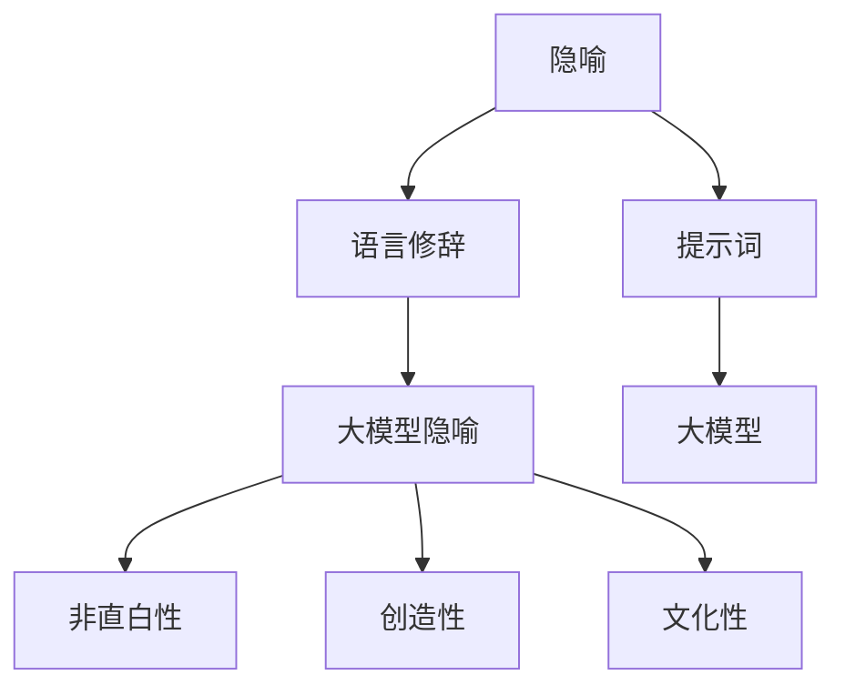

                 


### 第1章: 引言

#### 1.1 大模型隐喻的概念

**隐喻的定义**：
隐喻（Metaphor）是语言修辞中的一种手法，它通过将一个事物或概念比拟成另一个不同的事物或概念，以此来增强表达的效果和形象性。在语言学中，隐喻被视为一种修辞手段，它不仅用于日常交流，也在文学、艺术和科学等领域广泛应用。

**语言修辞中的隐喻**：
语言修辞是指通过特定的语言技巧来美化语言，使其更加生动、有力。隐喻是语言修辞的重要组成部分，它通过抽象概念的具象化，使语言表达更加丰富和生动。

#### 1.1.2 大模型隐喻的产生

大模型隐喻的产生源于深度学习和自然语言处理技术的发展。随着神经网络模型的复杂度不断增加，尤其是Transformer模型的兴起，大模型（如GPT系列）在处理自然语言时，逐渐展现出对隐喻理解的能力。大模型隐喻的产生主要有以下几个原因：

1. **数据丰富性**：现代大模型训练的数据规模巨大，涵盖了丰富的隐喻实例，使得模型能够通过大量的数据学习到隐喻的规律和模式。
2. **模型架构**：Transformer模型的结构使得大模型能够捕捉到文本中的长距离依赖关系，这对于理解隐喻中的隐含意义至关重要。
3. **参数数量**：大模型拥有数亿乃至数千亿个参数，这些参数使得模型在理解隐喻时具有更高的灵活性和准确性。

#### 1.1.3 大模型隐喻的特点

**非直白性**：隐喻通常不是直接陈述事实，而是通过比喻来传达更深层次的含义，这使得隐喻具有非直白性。
**创造性**：隐喻通过将不同概念联系起来，创造新的认知体验，体现了语言的创造性。
**文化性**：隐喻往往承载着特定的文化内涵，不同文化背景的人对同一隐喻的理解可能有所不同。

#### 1.2 提示词解析

**提示词的基本概念**：
提示词（Prompt）是自然语言处理领域中用于引导模型生成输出的一段文本或指令。在对话系统、问答系统和文本生成任务中，提示词起着关键的作用，它能够引导模型理解问题的意图并生成合适的回答。

**提示词的作用**：
1. **引导意图**：提示词可以帮助模型明确用户的查询意图，从而生成更为精准的输出。
2. **增强上下文**：通过提供更多的上下文信息，提示词可以增强模型对文本的理解能力。
3. **优化生成质量**：合适的提示词可以引导模型生成更加丰富、多样化的输出。

**提示词的分类**：
1. **开放性提示词**：这类提示词提供较少的信息，鼓励模型进行创造性的回答。
2. **封闭性提示词**：这类提示词提供具体的信息，限制模型的回答范围，通常用于多选问答等场景。
3. **半开放性提示词**：介于开放性和封闭性之间，既提供一些信息，又允许模型进行一定的拓展。

#### 1.3 语言修辞的基本原理

**语言修辞的定义**：
语言修辞（Rhetoric）是指通过特定的语言技巧和策略来增强表达效果和说服力的过程。修辞学起源于古希腊，它是文学、哲学和语言学的重要组成部分。

**语言修辞的目的**：
1. **增强表达效果**：通过修辞手法，使语言表达更加生动、有力，增强说服力和感染力。
2. **传达深层次意义**：修辞手法能够挖掘语言的深层含义，使表达更加丰富和深刻。
3. **促进有效沟通**：修辞学技巧有助于提高沟通的效率和质量，使信息传达更加准确和清晰。

**语言修辞的常见手法**：
1. **隐喻**：通过将一个事物比拟成另一个事物来传达深层次的含义。
2. **拟人**：将非人类事物赋予人的特质，使其更具生命力和形象性。
3. **比喻**：通过比较来传达相似性，使抽象概念更加具体。
4. **对比**：通过对比来突出事物的差异和相似性。
5. **夸张**：对事物进行过度的描述，以增强表达的效果。

### 核心概念与联系

**核心概念之间的关系架构**：



**核心算法原理讲解**：

```python
# 大模型隐喻理解的基本原理伪代码

# 数据预处理
def preprocess_data(data):
    # 对文本数据进行清洗、分词、标记等预处理操作
    pass

# 隐喻识别算法
def recognize_metaphor(text):
    # 利用深度学习模型对文本进行隐喻识别
    # 输出隐喻检测结果
    pass

# 提示词优化算法
def optimize_prompt(prompt, target):
    # 根据目标文本对提示词进行优化
    # 输出优化后的提示词
    pass

# 语言修辞分析算法
def analyze_rhetoric(text):
    # 分析文本中的修辞手法
    # 输出修辞分析结果
    pass
```

**数学模型和公式**：

- 隐喻识别的准确率公式：

  $$ Acc = \frac{TP + TN}{TP + FN + FP + TN} $$

  其中，TP表示正确识别的隐喻，TN表示正确识别的非隐喻，FN表示错误识别的隐喻，FP表示错误识别的非隐喻。

- 提示词优化效果评估：

  $$ Score = \frac{NDCG}{|D|} $$

  其中，NDCG表示优化后的查询结果的相关度，|D|表示查询结果的文档数量。

**详细讲解与举例说明**：

**隐喻识别实例**：

假设我们有一段文本：“时间就像一条流逝的河流，我们无法抓住它的每一滴。”通过深度学习模型，我们可以识别出这段文本中包含了隐喻，即“时间”被比喻成“河流”。

**提示词优化实例**：

原始提示词：“请解释下面这句话的含义：时间就像一条流逝的河流。”

优化后的提示词：“请详细分析这句话中的隐喻及其表达的时间观念。”

**语言修辞分析实例**：

假设我们分析一段诗：“月色被打翻，夜空溅满了银色的花朵。”通过修辞分析，我们可以识别出这段诗使用了“拟人”和“比喻”两种修辞手法，分别将“月色”和“夜空”赋予了生命力和形象性。

### 数学公式：

$$ \text{隐喻识别准确率} = \frac{\text{正确识别的隐喻数} + \text{正确识别的非隐喻数}}{\text{正确识别的隐喻数} + \text{错误识别的隐喻数} + \text{错误识别的非隐喻数} + \text{正确识别的非隐喻数}} $$

$$ \text{提示词优化效果评分} = \frac{\text{优化后的查询结果的相关度}}{\text{查询结果的文档数量}} $$

通过以上章节的介绍，我们对大模型隐喻理解、提示词解析和语言修辞的基本概念有了初步的了解。接下来，我们将深入探讨大模型隐喻理解的工作原理，揭示其背后的数学模型和算法原理，并通过具体的实验和案例分析，展示大模型隐喻理解的实践应用和挑战。让我们一起探索这个充满创造力和潜力的领域吧！

