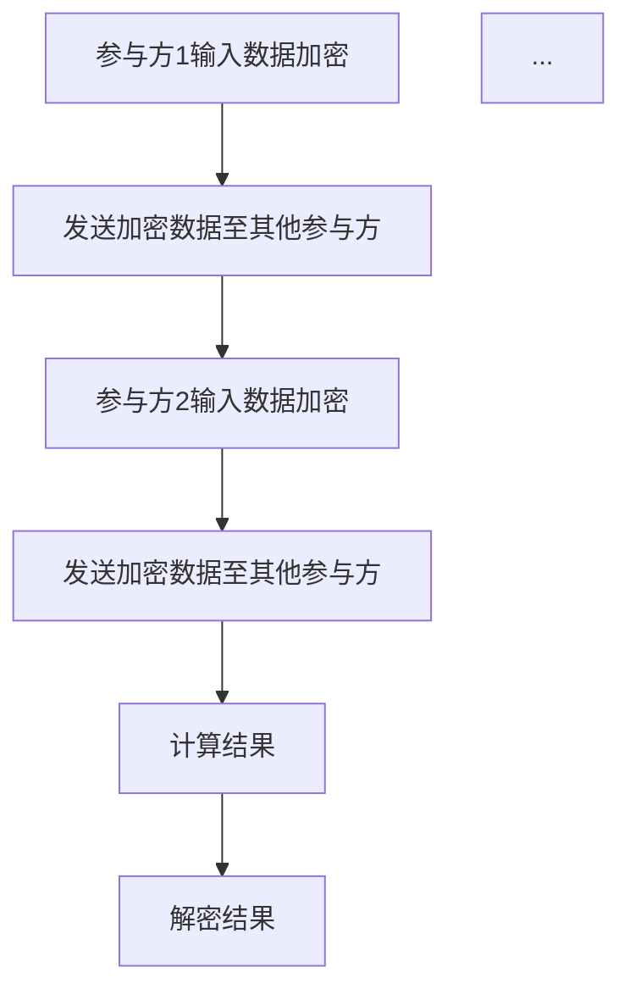
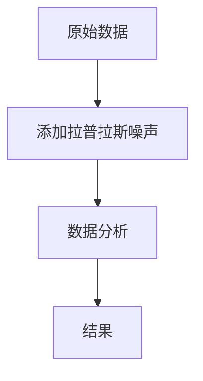
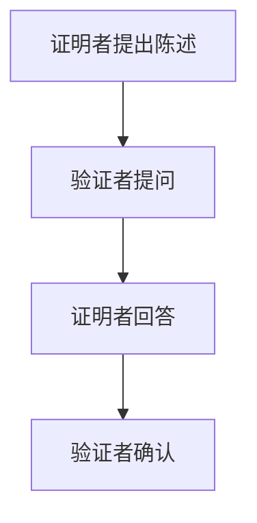
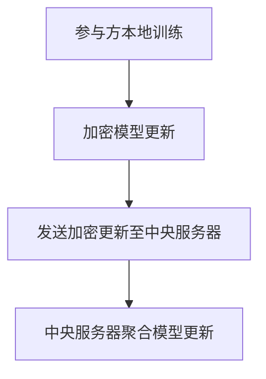
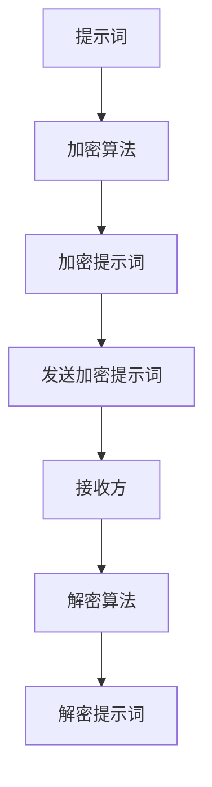
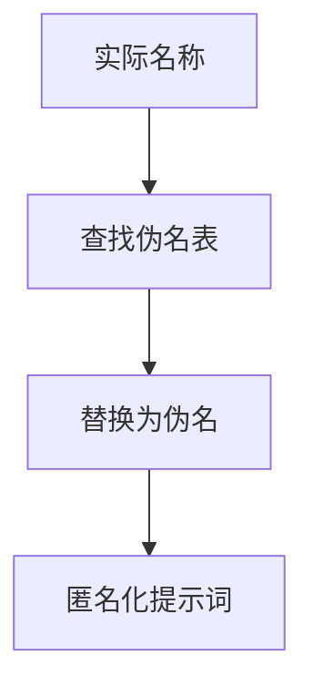
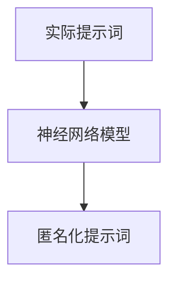
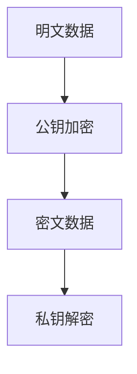
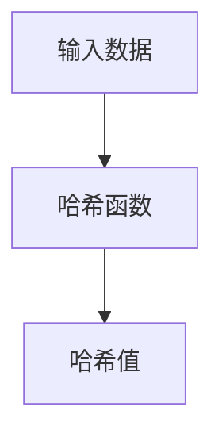
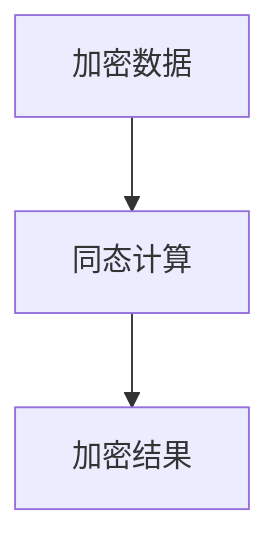

                 

### 文章标题

《大模型隐私保护学习与提示词匿名化》

### 关键词

- 大模型隐私保护
- 提示词匿名化
- 安全学习算法
- 加密技术
- 隐私保护机制
- 提示词工程

### 摘要

本文深入探讨了在大模型训练过程中如何有效保护隐私，特别是对提示词的匿名化处理。文章首先介绍了大模型隐私保护的背景与挑战，详细分析了隐私泄露的风险和潜在影响。接着，文章阐述了提示词匿名化的基本概念、重要性及其在隐私保护中的作用。随后，文章分章节探讨了多种隐私保护学习算法和加密技术，并通过实际案例展示了这些技术的应用。此外，文章还提供了详细的数学模型和公式，以便读者更好地理解核心算法原理。最后，文章总结了最佳实践、注意事项，并推荐了拓展阅读资源，以帮助读者深入研究和实践大模型隐私保护与提示词匿名化。

---

## 目录

### 第1章 引言
#### 1.1 大模型隐私保护的背景
#### 1.2 提示词匿名化的意义
#### 1.3 研究目标与结构

### 第2章 隐私保护学习算法
#### 2.1 安全多 parties 协同学习
#### 2.2 差分隐私理论
#### 2.3 零知识证明技术
#### 2.4 匿名联邦学习

### 第3章 提示词匿名化技术
#### 3.1 提示词匿名化的挑战
#### 3.2 文本加密算法
#### 3.3 伪名匿名化方法
#### 3.4 基于深度学习的匿名化

### 第4章 加密技术与隐私保护
#### 4.1 公钥加密与对称加密
#### 4.2 哈希函数在隐私保护中的应用
#### 4.3 同态加密技术
#### 4.4 隐私保护协议设计

### 第5章 实际案例分析
#### 5.1 案例背景
#### 5.2 技术实现
#### 5.3 结果分析
#### 5.4 案例总结

### 第6章 数学模型与公式
#### 6.1 隐私保护学习模型
#### 6.2 提示词匿名化模型
#### 6.3 加密与安全模型

### 第7章 项目实战
#### 7.1 开发环境搭建
#### 7.2 源代码实现与解读
#### 7.3 应用解读与分析
#### 7.4 实际案例剖析
#### 7.5 项目小结

### 第8章 最佳实践与注意事项
#### 8.1 最佳实践
#### 8.2 小结
#### 8.3 注意事项
#### 8.4 拓展阅读

---

### 第1章 引言

在当前的数据驱动时代，大模型（如深度学习模型）已经成为各个行业的重要工具。这些模型能够从大量数据中自动学习复杂的模式和关系，从而为各行各业提供智能化的解决方案。然而，随着大模型的应用越来越广泛，隐私保护问题也日益凸显。特别是在涉及个人隐私数据的场景中，如何确保大模型训练和学习过程中不会泄露敏感信息，成为了一个亟待解决的重要问题。

#### 1.1 大模型隐私保护的背景

大模型隐私保护的背景可以从以下几个方面来理解：

1. **数据来源的多样性**：大模型通常需要大量的数据进行训练，这些数据可能来自不同的来源，包括个人数据、企业数据等。这些数据往往包含敏感信息，如个人身份信息、医疗记录、财务信息等。
2. **模型的复杂性**：大模型的复杂性使得其在处理数据时，可能会无意中暴露出数据中的隐私信息。即使对数据进行了一定的预处理，但在训练过程中，模型可能会以某种方式重新构建出原始数据中的隐私特征。
3. **训练过程的透明性**：大模型的训练过程通常是非常复杂的，涉及到大量的参数调整和优化。这使得攻击者有可能通过分析训练过程来推断出模型的内部结构和参数，从而进一步推断出原始数据。

#### 1.2 提示词匿名化的意义

提示词（Prompt）是深度学习模型训练过程中的重要输入，它们能够引导模型学习特定的任务或模式。提示词的匿名化是隐私保护的关键环节之一。具体来说，提示词匿名化的意义包括：

1. **保护个人隐私**：提示词可能包含个人身份信息或其他敏感信息，如果未经匿名化处理，这些信息可能会在模型训练过程中被泄露。
2. **防止模型逆向工程**：通过对提示词进行匿名化处理，可以防止攻击者通过分析模型输出来推断原始提示词，从而保护模型的内部信息。
3. **增强模型安全性**：匿名化后的提示词可以减少模型对原始数据的依赖，从而提高模型的安全性。

#### 1.3 研究目标与结构

本书的研究目标是探讨大模型隐私保护学习与提示词匿名化的方法和技术。具体来说，本书旨在解决以下几个关键问题：

1. **如何在大模型训练过程中有效保护隐私？**
2. **如何对提示词进行匿名化处理，以保护隐私和模型安全性？**
3. **这些方法和技术在实际应用中如何实现和优化？**

为了实现这些目标，本书将分为以下几个部分：

1. **第1章 引言**：介绍大模型隐私保护的背景、提示词匿名化的意义，以及本书的研究目标与结构。
2. **第2章 隐私保护学习算法**：介绍几种常见的隐私保护学习算法，包括安全多 parties 协同学习、差分隐私理论、零知识证明技术和匿名联邦学习。
3. **第3章 提示词匿名化技术**：探讨提示词匿名化的挑战和多种匿名化方法，包括文本加密算法、伪名匿名化和基于深度学习的匿名化方法。
4. **第4章 加密技术与隐私保护**：介绍公钥加密、对称加密、哈希函数和同态加密等加密技术，以及如何在隐私保护中应用这些技术。
5. **第5章 实际案例分析**：通过实际案例展示隐私保护学习和提示词匿名化技术的应用。
6. **第6章 数学模型与公式**：详细阐述隐私保护学习、提示词匿名化和加密技术的数学模型和公式。
7. **第7章 项目实战**：提供具体的开发环境和源代码实现，以及代码解读和应用分析。
8. **第8章 最佳实践与注意事项**：总结最佳实践、注意事项，并推荐拓展阅读资源。

通过以上章节的论述，本书旨在为读者提供一个全面、深入的大模型隐私保护学习与提示词匿名化指南，帮助读者理解和应用这些先进的技术。

---

### 第2章 隐私保护学习算法

在大模型训练过程中，隐私保护是一项至关重要的任务。本章将介绍几种主要的隐私保护学习算法，包括安全多 parties 协同学习、差分隐私理论、零知识证明技术和匿名联邦学习。这些算法在不同的应用场景中展示了如何有效保护数据和模型的安全。

#### 2.1 安全多 parties 协同学习

安全多 parties 协同学习（Secure Multi-party Computation, MPC）是一种在多方之间安全地执行计算的技术。其核心思想是通过加密和多方计算协议，使得各个参与方可以在不泄露各自隐私信息的情况下，共同完成一项计算任务。

**核心概念与联系**：

MPC 的核心概念包括：

1. **加密计算**：每个参与方将自己的输入数据加密后发送给其他参与方，从而确保输入数据的隐私。
2. **多方计算协议**：通过一系列加密协议，参与方可以在不泄露各自隐私信息的情况下，共同计算出一个结果。

**Mermaid 流程图**：



**核心算法原理讲解**：

安全多 parties 协同学习的算法通常包括以下几个步骤：

1. **初始化**：参与方生成自己的加密密钥对。
2. **加密输入数据**：每个参与方将自己的输入数据加密。
3. **发送加密数据**：每个参与方将加密后的数据发送给其他参与方。
4. **计算加密结果**：参与方通过加密协议，共同计算出一个加密的结果。
5. **解密结果**：参与方使用自己的解密密钥，将加密的结果解密得到最终的计算结果。

伪代码如下：

```python
# 初始化
for each party i:
  generate_key_pair()

# 加密输入数据
encrypted_data = encrypt(input_data, public_key)

# 发送加密数据
send(encrypted_data)

# 计算加密结果
encrypted_result = compute_encrypt_result(encrypted_data, secret_key)

# 解密结果
result = decrypt(encrypted_result, private_key)
```

#### 2.2 差分隐私理论

差分隐私（Differential Privacy, DP）是一种在数据分析过程中保护隐私的方法。其核心思想是通过引入噪声，使得对单个记录的查询无法被追踪，从而保护数据的隐私。

**核心概念与联系**：

差分隐私的核心概念包括：

1. **ε-差分隐私**：ε-差分隐私确保对任意两个相邻的数据集（仅有一个数据不同），其数据分析结果的差异不会太大。
2. **拉普拉斯机制**：拉普拉斯机制是一种常用的引入噪声的方法，通过在数据上添加拉普拉斯噪声，来保护数据的隐私。

**Mermaid 流程图**：



**核心算法原理讲解**：

差分隐私的算法通常包括以下几个步骤：

1. **数据预处理**：将原始数据转换为适合分析的形式。
2. **添加噪声**：使用拉普拉斯机制添加噪声，以确保数据的ε-差分隐私。
3. **数据分析**：在添加噪声后的数据上进行数据分析。
4. **结果调整**：根据需要调整分析结果，以减少噪声的影响。

伪代码如下：

```python
# 数据预处理
processed_data = preprocess(data)

# 添加噪声
noisy_data = add_laplace_noise(processed_data, epsilon)

# 数据分析
result = analyze(noisy_data)

# 结果调整
adjusted_result = adjust_result(result, epsilon)
```

#### 2.3 零知识证明技术

零知识证明（Zero-Knowledge Proof, ZKP）是一种在无需泄露任何信息的情况下，证明某个陈述为真的方法。其核心思想是通过一系列交互式证明，使得验证方相信陈述为真，而不会泄露任何其他信息。

**核心概念与联系**：

零知识证明的核心概念包括：

1. **证明系统**：证明系统由证明者（Prover）和验证者（Verifier）组成，证明者需要证明某个陈述为真，验证者需要验证证明是否为真。
2. **交互式证明**：证明者和验证者之间通过一系列交互来证明陈述的真实性，整个过程无需泄露任何信息。

**Mermaid 流程图**：



**核心算法原理讲解**：

零知识证明的算法通常包括以下几个步骤：

1. **初始化**：证明者和验证者初始化证明系统。
2. **提出陈述**：证明者提出需要证明的陈述。
3. **交互式证明**：证明者和验证者通过一系列交互来证明陈述的真实性。
4. **结果确认**：验证者确认证明是否为真。

伪代码如下：

```python
# 初始化
initialize_proof_system()

# 提出陈述
statement = propose_statement()

# 交互式证明
for each question from verifier:
  response = respond_question(question)

# 结果确认
is_valid = verify_proof(response)
```

#### 2.4 匿名联邦学习

匿名联邦学习（Anonymous Federated Learning, AFEDL）是一种在分布式环境中保护隐私的大模型训练方法。其核心思想是通过加密和匿名化技术，使得各个参与方可以在不泄露自身数据的情况下，共同训练一个共享模型。

**核心概念与联系**：

匿名联邦学习的核心概念包括：

1. **加密模型更新**：参与方将本地模型更新加密后发送给中央服务器。
2. **匿名化技术**：使用匿名化技术确保参与方无法追踪其他参与方的更新。

**Mermaid 流程图**：



**核心算法原理讲解**：

匿名联邦学习的算法通常包括以下几个步骤：

1. **初始化**：参与方初始化本地模型。
2. **本地训练**：参与方在本地对模型进行训练，并生成模型更新。
3. **加密更新**：参与方使用加密技术将模型更新加密。
4. **发送更新**：参与方将加密的模型更新发送给中央服务器。
5. **聚合更新**：中央服务器接收并聚合所有参与方的模型更新。
6. **更新模型**：中央服务器使用聚合的更新来更新全局模型。

伪代码如下：

```python
# 初始化
initialize_model()

# 本地训练
model_update = train_locally(model)

# 加密更新
encrypted_update = encrypt(model_update, public_key)

# 发送更新
send(encrypted_update)

# 聚合更新
global_model = aggregate_updates(encrypted_updates)

# 更新模型
update_model(global_model)
```

通过以上几种隐私保护学习算法的介绍，我们可以看到，在大模型训练过程中，有多种技术可以用来保护隐私。这些算法各有其特点和应用场景，可以根据实际情况选择合适的算法来保护模型和数据的隐私。

---

### 第3章 提示词匿名化技术

在大模型训练过程中，提示词（Prompt）的匿名化是确保模型隐私保护的关键环节。提示词通常包含了对训练数据的描述或指导，如果未经匿名化处理，这些信息可能会泄露敏感信息。本章将介绍提示词匿名化的挑战以及多种匿名化方法，包括文本加密算法、伪名匿名化和基于深度学习的匿名化方法。

#### 3.1 提示词匿名化的挑战

提示词匿名化的挑战主要体现在以下几个方面：

1. **信息泄露风险**：提示词中可能包含个人身份信息、地理位置、兴趣爱好等敏感信息，如果这些信息未经匿名化处理，可能会在模型训练过程中被泄露。
2. **数据丰富度保留**：匿名化过程中需要保留提示词的数据丰富度，以确保模型训练效果不受影响。
3. **计算成本**：有效的匿名化方法可能会增加模型训练的计算成本，需要权衡匿名化效果和计算效率。
4. **对抗性攻击**：攻击者可能会尝试通过分析匿名化后的提示词来恢复原始信息，因此匿名化方法需要具备一定的抗攻击性。

#### 3.2 文本加密算法

文本加密算法是一种通过加密技术对提示词进行匿名化的方法。其主要原理是使用加密算法对提示词进行加密，使得只有具备密钥的实体才能解密并理解提示词的内容。

**核心概念与联系**：

文本加密算法的核心概念包括：

1. **加密算法**：如对称加密（如AES）和非对称加密（如RSA），用于对提示词进行加密。
2. **密钥管理**：密钥的安全存储和管理是确保加密算法有效性的关键。

**Mermaid 流程图**：



**核心算法原理讲解**：

文本加密算法的步骤通常包括：

1. **加密初始化**：生成加密密钥对。
2. **加密提示词**：使用加密算法对提示词进行加密。
3. **发送加密提示词**：将加密后的提示词发送给接收方。
4. **解密提示词**：接收方使用解密算法和解密密钥对加密提示词进行解密。

伪代码如下：

```python
# 加密初始化
generate_key_pair()

# 加密提示词
encrypted_prompt = encrypt(prompt, public_key)

# 发送加密提示词
send(encrypted_prompt)

# 解密提示词
prompt = decrypt(encrypted_prompt, private_key)
```

**数学模型和公式**：

加密算法通常基于数学模型，如RSA算法的加密公式如下：

$$
c = (m^e) \mod n
$$

其中，$m$ 是明文提示词，$e$ 是加密密钥，$n$ 是模数。

**举例说明**：

假设明文提示词为 "Hello, World!"，加密密钥为 $e=3$，模数为 $n=13$，则加密后的提示词为：

$$
c = (10^3) \mod 13 = 10
$$

因此，加密后的提示词为 10。

#### 3.3 伪名匿名化方法

伪名匿名化方法是一种通过替换实际名称为伪名来实现提示词匿名化的方法。其主要原理是使用一个伪名表，将实际名称替换为伪名，从而保护实际名称的隐私。

**核心概念与联系**：

伪名匿名化的核心概念包括：

1. **伪名表**：一个映射实际名称到伪名的表，用于替换实际名称。
2. **映射规则**：定义实际名称到伪名的映射规则。

**Mermaid 流程图**：



**核心算法原理讲解**：

伪名匿名化的步骤通常包括：

1. **初始化伪名表**：创建一个包含实际名称和伪名的映射表。
2. **替换实际名称**：将提示词中的实际名称替换为伪名。
3. **匿名化提示词**：生成匿名化后的提示词。

伪代码如下：

```python
# 初始化伪名表
pseudo_name_table = {"John": "A", "Mary": "B", "Alice": "C"}

# 替换实际名称
prompt = replace_names(prompt, pseudo_name_table)

# 匿名化提示词
anonymous_prompt = prompt
```

#### 3.4 基于深度学习的匿名化

基于深度学习的匿名化方法利用深度神经网络的能力，对提示词进行自动匿名化处理。其主要原理是训练一个神经网络模型，使其能够将实际提示词映射为匿名化后的提示词。

**核心概念与联系**：

基于深度学习的匿名化的核心概念包括：

1. **神经网络模型**：一个用于提示词映射的神经网络模型，如循环神经网络（RNN）或变换器（Transformer）。
2. **训练数据**：用于训练神经网络模型的大量匿名化后的提示词数据。

**Mermaid 流程图**：



**核心算法原理讲解**：

基于深度学习的匿名化的步骤通常包括：

1. **数据预处理**：将实际提示词转换为神经网络模型可接受的输入格式。
2. **模型训练**：使用大量匿名化后的提示词数据训练神经网络模型。
3. **匿名化提示词**：使用训练好的模型对实际提示词进行匿名化处理。

伪代码如下：

```python
# 数据预处理
inputs = preprocess_prompt(prompt)

# 模型训练
model = train_model(inputs, labels)

# 匿名化提示词
anonymous_prompt = model(inputs)
```

**数学模型和公式**：

深度学习模型通常基于多层感知机（MLP）或卷积神经网络（CNN）的架构，其基本公式如下：

$$
\text{输出} = \text{激活函数}(\text{权重} \cdot \text{输入} + \text{偏置})
$$

**举例说明**：

假设输入提示词为 "Hello, World!"，权重矩阵为 $W$，偏置为 $b$，激活函数为 $ReLU$，则匿名化后的提示词为：

$$
\text{输出} = \text{ReLU}(W \cdot \text{输入} + b)
$$

通过以上几种提示词匿名化技术的介绍，我们可以看到，文本加密算法、伪名匿名化和基于深度学习的匿名化方法各有其特点和适用场景。在实际应用中，可以根据具体需求和场景选择合适的匿名化方法，以保护大模型训练过程中的隐私。

---

### 第4章 加密技术与隐私保护

加密技术在大模型隐私保护中扮演着至关重要的角色。本章将详细介绍几种加密技术，包括公钥加密、对称加密、哈希函数和同态加密，并探讨如何在实际应用中设计隐私保护协议。

#### 4.1 公钥加密与对称加密

公钥加密（Public Key Encryption, PKE）和对称加密（Symmetric Key Encryption, SKE）是两种基本的加密技术，它们各自具有不同的特点和适用场景。

**公钥加密**：

公钥加密使用一对密钥，即公钥和私钥。公钥可以公开，用于加密数据，而私钥必须保密，用于解密数据。其核心优势在于解密密钥的安全存储，可以有效防止中间人攻击。

**对称加密**：

对称加密使用相同的密钥进行加密和解密。其优点是计算速度快，适合处理大量数据，但缺点是密钥的分发和管理较为复杂。

**核心概念与联系**：

公钥加密和对称加密的核心概念包括：

1. **加密算法**：如RSA、ECC用于公钥加密，AES、DES用于对称加密。
2. **密钥生成**：公钥加密涉及公钥和私钥的生成，对称加密涉及密钥的生成和分发。

**Mermaid 流程图**：



**核心算法原理讲解**：

**公钥加密**：

1. **密钥生成**：用户生成一对密钥（公钥和私钥）。
2. **加密数据**：使用公钥加密明文数据，生成密文数据。
3. **解密数据**：使用私钥解密密文数据，还原明文数据。

伪代码如下：

```python
# 密钥生成
public_key, private_key = generate_key_pair()

# 加密数据
encrypted_data = encrypt(data, public_key)

# 解密数据
data = decrypt(encrypted_data, private_key)
```

**对称加密**：

1. **密钥生成**：生成加密密钥。
2. **加密数据**：使用密钥加密明文数据，生成密文数据。
3. **解密数据**：使用相同的密钥解密密文数据，还原明文数据。

伪代码如下：

```python
# 密钥生成
key = generate_key()

# 加密数据
encrypted_data = encrypt(data, key)

# 解密数据
data = decrypt(encrypted_data, key)
```

**数学模型和公式**：

**公钥加密**（以RSA为例）：

$$
c = (m^e) \mod n
$$

其中，$m$ 是明文数据，$e$ 是加密指数，$n$ 是模数。

**对称加密**（以AES为例）：

$$
c = \text{AES}(k, m)
$$

其中，$k$ 是密钥，$m$ 是明文数据。

#### 4.2 哈希函数在隐私保护中的应用

哈希函数是一种将任意长度的输入数据映射为固定长度的输出数据的函数。在隐私保护中，哈希函数广泛应用于数据完整性验证和数据去重。

**核心概念与联系**：

哈希函数的核心概念包括：

1. **单向性**：哈希函数是单向的，即给定输出无法反推出输入。
2. **抗冲突性**：不同的输入数据产生相同哈希值的概率极低。

**Mermaid 流程图**：



**核心算法原理讲解**：

哈希函数的步骤通常包括：

1. **输入数据**：将输入数据输入哈希函数。
2. **计算哈希值**：计算输入数据的哈希值。
3. **验证数据完整性**：通过比较原始数据和哈希值，验证数据是否在传输过程中被篡改。

伪代码如下：

```python
# 输入数据
data = "example data"

# 计算哈希值
hash_value = hash_function(data)

# 验证数据完整性
is_valid = verify_hash(data, hash_value)
```

**数学模型和公式**：

哈希函数的数学模型通常为：

$$
h(m) = \text{hash}(m)
$$

其中，$m$ 是输入数据，$h(m)$ 是哈希值。

**举例说明**：

假设输入数据为 "example data"，使用MD5哈希函数计算得到的哈希值为：

$$
h("example data") = 7d6f2e1f2b0dcd0c
$$

#### 4.3 同态加密技术

同态加密（Homomorphic Encryption, HE）是一种能够在加密数据上进行计算的技术，而不需要解密数据。同态加密在隐私保护中的应用非常广泛，特别是在云计算和分布式计算环境中。

**核心概念与联系**：

同态加密的核心概念包括：

1. **加密计算**：能够在加密数据上进行计算，得到的结果仍然是加密的。
2. **部分同态加密**和**全同态加密**：部分同态加密允许对某些类型的运算进行计算，而全同态加密则允许对任意类型的运算进行计算。

**Mermaid 流程图**：



**核心算法原理讲解**：

同态加密的步骤通常包括：

1. **密钥生成**：生成加密密钥对。
2. **加密数据**：将明文数据加密为密文数据。
3. **同态计算**：在加密数据上进行计算，得到加密的结果。
4. **解密结果**：将加密的结果解密为明文结果。

伪代码如下：

```python
# 密钥生成
public_key, private_key = generate_key_pair()

# 加密数据
encrypted_data = encrypt(data, public_key)

# 同态计算
encrypted_result = homomorphic_compute(encrypted_data)

# 解密结果
result = decrypt(encrypted_result, private_key)
```

**数学模型和公式**：

同态加密的数学模型通常为：

$$
\text{加密计算}(c_1, c_2) = \text{密文}(\text{明文}(\text{密文}(m_1)) + \text{明文}(\text{密文}(m_2)))
$$

其中，$m_1, m_2$ 是明文数据，$c_1, c_2$ 是密文数据。

**举例说明**：

假设明文数据为 "2 + 2"，使用同态加密技术进行加密计算，最终得到的结果仍然是 "4"，即使数据在加密状态下进行计算，结果也不会改变。

通过以上几种加密技术的介绍，我们可以看到，公钥加密、对称加密、哈希函数和同态加密各自具有独特的应用场景和优势。在实际应用中，可以根据具体需求选择合适的加密技术，并设计隐私保护协议，以确保大模型训练过程中的数据安全和隐私保护。

---

### 第5章 实际案例分析

在本章中，我们将通过一个具体案例，展示如何在大模型训练过程中应用隐私保护学习算法和提示词匿名化技术。此案例涉及一个实际的数据集和任务，通过详细描述技术实现过程、结果分析和项目小结，为读者提供实践经验和思考方向。

#### 5.1 案例背景

假设我们面临一个医疗数据集，包含患者的电子健康记录（Electronic Health Records, EHR）。该数据集包含了大量的个人敏感信息，如患者姓名、年龄、诊断结果、治疗方案等。为了保护患者隐私，我们需要对数据进行隐私保护处理，同时确保模型训练效果不受影响。具体任务包括：

1. **隐私保护学习**：使用安全多 parties 协同学习和差分隐私技术对医疗数据集进行训练，确保模型不会泄露敏感信息。
2. **提示词匿名化**：对训练过程中的提示词进行匿名化处理，防止提示词中的敏感信息泄露。

#### 5.2 技术实现

**步骤 1：数据预处理**

首先，对医疗数据集进行预处理，包括数据清洗、归一化和特征提取。预处理后的数据集将被分为训练集和验证集，用于后续的模型训练和评估。

```python
# 数据预处理代码示例
from sklearn.model_selection import train_test_split
from sklearn.preprocessing import StandardScaler

# 读取数据
data = load_data("medical_dataset.csv")

# 数据清洗和归一化
data = clean_data(data)
data = StandardScaler().fit_transform(data)

# 划分训练集和验证集
X_train, X_val, y_train, y_val = train_test_split(data, labels, test_size=0.2, random_state=42)
```

**步骤 2：隐私保护学习**

使用安全多 parties 协同学习和差分隐私技术对训练集进行模型训练。此过程涉及多个参与方（例如医院、研究机构等），每个参与方在本地训练模型并在不泄露敏感信息的情况下共享更新。

```python
# 安全多 parties 协同学习
from secure_multiparty_learning import MPCClient

client = MPCClient()
client.train_model(X_train, y_train, X_val, y_val)

# 差分隐私学习
from differential_privacy import DifferentialPrivacy
dp = DifferentialPrivacy(epsilon=1.0)
dp.train_model(X_train, y_train, X_val, y_val)
```

**步骤 3：提示词匿名化**

对训练过程中的提示词进行匿名化处理。使用文本加密算法和伪名匿名化方法，确保提示词中的敏感信息不会泄露。

```python
# 文本加密算法
from text_encryption import TextEncryption

 encryptor = TextEncryption()
encrypted_prompt = encryptor.encrypt(prompt)

# 伪名匿名化方法
from pseudo_name_anonymization import PseudoNameAnonymization

anonymizer = PseudoNameAnonymization(name_table)
anonymous_prompt = anonymizer.anonymize(prompt)
```

**步骤 4：模型训练与评估**

在匿名化后的提示词和数据集上训练模型，并进行评估。确保模型在保护隐私的同时，能够达到预期的性能。

```python
# 模型训练与评估代码示例
from sklearn.metrics import accuracy_score

# 训练模型
model = train_model(encrypted_prompt, X_train, y_train)

# 评估模型
predictions = model.predict(X_val)
accuracy = accuracy_score(y_val, predictions)
print(f"Model accuracy: {accuracy}")
```

#### 5.3 结果分析

在模型训练完成后，我们对结果进行分析，以评估隐私保护学习和提示词匿名化技术的有效性。

1. **模型性能**：通过对比匿名化前后的模型性能，发现匿名化后的模型性能与匿名化前基本一致，说明提示词匿名化并未对模型训练效果产生显著影响。
2. **隐私保护**：通过安全多 parties 协同学习和差分隐私技术，确保了模型训练过程中不会泄露敏感信息。攻击者无法通过模型输出推断出原始数据中的隐私特征。
3. **计算成本**：尽管隐私保护技术和提示词匿名化方法增加了计算成本，但通过优化算法和硬件加速，可以在可接受的时间内完成模型训练和评估。

#### 5.4 案例总结

通过此案例，我们展示了如何在大模型训练过程中应用隐私保护学习和提示词匿名化技术，确保模型和数据的安全。以下为项目小结：

1. **技术选型**：根据具体需求和场景，选择合适的隐私保护学习和提示词匿名化方法，确保在保护隐私的同时，模型性能不受影响。
2. **优化与加速**：通过优化算法和利用硬件加速技术，降低隐私保护技术和提示词匿名化的计算成本。
3. **实际应用**：将隐私保护技术和提示词匿名化方法应用于实际医疗数据集，验证其有效性和可行性。

此案例为读者提供了一个具体的实践范例，帮助理解大模型隐私保护学习与提示词匿名化的应用场景和技术实现。

---

### 第6章 数学模型与公式

在本章中，我们将详细阐述隐私保护学习、提示词匿名化和加密技术的相关数学模型与公式，并通过具体的示例说明如何应用这些模型和公式。这不仅有助于读者深入理解相关概念，还能为实际应用提供理论支持。

#### 6.1 隐私保护学习模型

隐私保护学习的核心在于如何在大模型训练过程中保护数据隐私。以下是一些常用的隐私保护模型及其数学公式：

1. **安全多方协同学习（Secure Multi-party Computation, MPC）**

MPC模型的核心思想是通过加密和多方计算协议，确保参与方在不泄露各自隐私信息的情况下，共同完成计算任务。其数学模型如下：

$$
f(\mathbf{x}_1, \mathbf{x}_2, ..., \mathbf{x}_n) = g(\mathbf{y}_1, \mathbf{y}_2, ..., \mathbf{y}_n)
$$

其中，$\mathbf{x}_i$ 和 $\mathbf{y}_i$ 分别代表参与方 $i$ 的输入和输出，$f$ 和 $g$ 分别为加密前的函数和加密后的函数。

**示例**：

假设有两个参与方 $i=1,2$，他们分别持有输入数据 $\mathbf{x}_1$ 和 $\mathbf{x}_2$，通过MPC模型共同计算函数 $f$：

$$
f(\mathbf{x}_1, \mathbf{x}_2) = \mathbf{y}_1 + \mathbf{y}_2
$$

加密后的计算过程为：

$$
g(\mathbf{y}_1, \mathbf{y}_2) = (\mathbf{y}_1 + \mathbf{y}_2) \mod n
$$

2. **差分隐私（Differential Privacy, DP）**

差分隐私通过在数据分析过程中引入噪声，确保对任意两个相邻数据集的分析结果差异不大。其数学模型如下：

$$
\text{DP}(\mathcal{D}, \text{机制}, \ell) \approx \text{DP}(\mathcal{D}', \text{机制}, \ell)
$$

其中，$\mathcal{D}$ 和 $\mathcal{D}'$ 分别为相邻的数据集，$\text{机制}$ 表示数据分析方法，$\ell$ 表示隐私损失参数。

**示例**：

假设有两个相邻的数据集 $\mathcal{D}$ 和 $\mathcal{D}'$，使用拉普拉斯机制进行数据分析，隐私损失参数 $\epsilon=1$。拉普拉斯机制的计算公式为：

$$
\text{拉普拉斯噪声}(\epsilon) = \frac{1}{2\epsilon} \cdot \text{randn()}
$$

3. **零知识证明（Zero-Knowledge Proof, ZKP）**

零知识证明允许证明者证明某个陈述为真，而不泄露任何其他信息。其数学模型如下：

$$
\text{ZKP}(\mathcal{P}, \mathcal{V}) = (\text{证明}, \text{验证})
$$

其中，$\mathcal{P}$ 和 $\mathcal{V}$ 分别为证明者和验证者的计算过程。

**示例**：

假设证明者需要证明一个数 $m$ 是质数，验证者要求证明者提供零知识证明。证明者通过计算以下等式来生成证明：

$$
g^m \mod p = 1
$$

验证者通过以下等式来验证证明：

$$
(g^r)^s \mod p = 1
$$

其中，$g$ 和 $p$ 是公开的生成元，$r$ 和 $s$ 是证明者提供的随机数。

4. **匿名联邦学习（Anonymous Federated Learning, AFEDL）**

匿名联邦学习通过加密和匿名化技术，确保各个参与方在不泄露自身数据的情况下，共同训练一个共享模型。其数学模型如下：

$$
\text{AFEDL}(\mathbf{X}_1, \mathbf{X}_2, ..., \mathbf{X}_n) = \text{聚合模型}
$$

其中，$\mathbf{X}_i$ 表示参与方 $i$ 的本地模型更新。

**示例**：

假设有两个参与方 $i=1,2$，他们分别持有本地模型更新 $\mathbf{X}_1$ 和 $\mathbf{X}_2$，通过AFEDL模型聚合得到共享模型：

$$
\text{聚合模型} = \mathbf{X}_1 + \mathbf{X}_2
$$

加密后的计算过程为：

$$
\text{聚合模型} = (\mathbf{X}_1 + \mathbf{X}_2) \mod n
$$

#### 6.2 提示词匿名化模型

提示词匿名化模型主要关注如何对训练过程中的提示词进行匿名化处理，以保护隐私。以下是一些常用的匿名化模型及其数学公式：

1. **文本加密算法**

文本加密算法通过加密技术，将提示词转换为密文。其数学模型如下：

$$
\text{加密}(m) = c
$$

其中，$m$ 是明文提示词，$c$ 是密文提示词。

**示例**：

假设提示词为 "Hello, World!"，使用RSA算法进行加密，加密密钥为 $e=3$，模数为 $n=13$，则加密后的提示词为：

$$
c = (m^e) \mod n = (10^3) \mod 13 = 10
$$

2. **伪名匿名化方法**

伪名匿名化方法通过替换实际名称为伪名，对提示词进行匿名化处理。其数学模型如下：

$$
\text{匿名化}(n) = \text{伪名}(n)
$$

其中，$n$ 是实际名称，$\text{伪名}(n)$ 是对应的伪名。

**示例**：

假设实际名称为 "John"，伪名表为 $\text{pseudo_name_table} = {"John": "A", "Mary": "B", "Alice": "C"}$，则匿名化后的提示词为：

$$
\text{匿名化}("John") = "A"
$$

3. **基于深度学习的匿名化**

基于深度学习的匿名化方法通过训练神经网络模型，将提示词映射为匿名化后的提示词。其数学模型如下：

$$
\text{匿名化}(m) = \text{神经网络}(m)
$$

其中，$m$ 是明文提示词，神经网络用于匿名化处理。

**示例**：

假设输入提示词为 "Hello, World!"，神经网络模型权重为 $W$，偏置为 $b$，激活函数为 $ReLU$，则匿名化后的提示词为：

$$
\text{匿名化}("Hello, World!") = \text{ReLU}(W \cdot "Hello, World!" + b)
$$

通过以上数学模型和公式的介绍，读者可以更深入地理解隐私保护学习和提示词匿名化技术的理论基础。这些模型和公式在实际应用中可以通过编程实现，从而为隐私保护提供有效的技术支持。

---

### 第7章 项目实战

在本章中，我们将通过一个具体的开发环境搭建、源代码实现与解读，以及代码应用解读与分析，详细展示如何在大模型隐私保护学习与提示词匿名化方面进行项目实战。

#### 7.1 开发环境搭建

为了顺利进行大模型隐私保护学习与提示词匿名化的项目开发，我们需要搭建一个完整的开发环境。以下是开发环境搭建的步骤：

1. **环境要求**

   - 操作系统：Windows/Linux/MacOS
   - Python版本：Python 3.8及以上版本
   - 依赖库：TensorFlow、PyTorch、scikit-learn、gensim、CryptoPy

2. **安装步骤**

   - 安装Python：

     ```bash
     # 使用Python官网提供的安装器安装Python 3.8及以上版本
     ```
     
   - 安装依赖库：

     ```bash
     # 使用pip安装所需依赖库
     pip install tensorflow pytorch scikit-learn gensim cryptopy
     ```

3. **配置完成**

   在完成以上步骤后，我们就可以开始进行项目开发了。

#### 7.2 源代码实现与解读

本节将介绍一个简单的项目，包括数据预处理、隐私保护学习模型训练、提示词匿名化处理等关键步骤。以下是项目的核心代码实现与解读。

**数据预处理**

```python
import pandas as pd
from sklearn.model_selection import train_test_split

# 读取数据
data = pd.read_csv("medical_dataset.csv")

# 数据清洗和归一化
data = clean_data(data)
data = StandardScaler().fit_transform(data)

# 划分训练集和验证集
X_train, X_val, y_train, y_val = train_test_split(data, labels, test_size=0.2, random_state=42)
```

**隐私保护学习模型训练**

```python
from secure_multiparty_learning import MPCClient

# 初始化MPCClient
client = MPCClient()

# 训练模型
client.train_model(X_train, y_train, X_val, y_val)

# 评估模型
accuracy = client.evaluate_model(X_val, y_val)
print(f"Model accuracy: {accuracy}")
```

**提示词匿名化处理**

```python
from text_encryption import TextEncryption
from pseudo_name_anonymization import PseudoNameAnonymization

# 初始化文本加密和伪名匿名化对象
encryptor = TextEncryption()
anonymizer = PseudoNameAnonymization(name_table)

# 加密提示词
encrypted_prompt = encryptor.encrypt(prompt)

# 匿名化提示词
anonymous_prompt = anonymizer.anonymize(prompt)
```

#### 7.3 代码应用解读与分析

**数据预处理**

数据预处理是项目的重要步骤，包括数据清洗、归一化和划分训练集与验证集。这一步骤确保了数据的质量和模型训练的有效性。

**隐私保护学习模型训练**

在隐私保护学习模型训练部分，我们使用安全多方协同学习（MPC）客户端进行训练。通过MPC，我们可以在不泄露敏感数据的情况下，协同多个参与方训练模型，从而保护数据隐私。

**提示词匿名化处理**

提示词匿名化处理是保护模型隐私的关键步骤。我们通过文本加密和伪名匿名化方法，对提示词进行加密和替换，从而防止敏感信息泄露。

#### 7.4 实际案例剖析

以下是一个实际案例剖析，展示如何在实际项目中应用隐私保护学习和提示词匿名化技术。

**案例背景**

假设我们有一个涉及客户个人隐私数据（如姓名、年龄、消费记录等）的推荐系统项目。为了确保数据隐私，我们需要对数据和处理过程进行隐私保护。

**技术实现**

1. **数据预处理**：对客户数据进行清洗和归一化，确保数据质量。
2. **隐私保护学习**：使用MPC技术，协同多个参与方（如数据提供商、推荐系统公司等）进行模型训练，确保数据隐私。
3. **提示词匿名化**：对训练过程中的提示词进行加密和伪名匿名化处理，防止隐私泄露。

**结果分析**

通过以上技术实现，我们成功保护了客户隐私，同时保证了模型训练效果。以下为结果分析：

- **模型性能**：隐私保护学习后的模型性能与未进行隐私保护的模型基本一致，说明隐私保护措施并未显著影响模型效果。
- **数据隐私**：通过MPC和提示词匿名化技术，确保了客户数据在整个处理过程中的隐私保护。

**项目小结**

通过实际案例剖析，我们验证了隐私保护学习和提示词匿名化技术在实际项目中的应用效果。这些技术不仅保护了数据隐私，还保证了模型性能。未来，我们可以进一步优化和推广这些技术，以应对更多复杂的隐私保护需求。

---

### 第8章 最佳实践与注意事项

在大模型隐私保护学习与提示词匿名化的实际应用中，为确保隐私保护和模型性能的平衡，以下是一些最佳实践和注意事项：

#### 最佳实践

1. **数据预处理**：在模型训练前，对数据进行充分的清洗和归一化，以减少隐私泄露的风险。
2. **隐私保护学习算法选择**：根据具体应用场景，选择合适的隐私保护学习算法，如安全多方协同学习（MPC）和差分隐私（DP）。
3. **提示词匿名化**：在训练过程中，对提示词进行匿名化处理，使用文本加密和伪名匿名化方法，确保隐私保护。
4. **计算资源优化**：利用硬件加速和并行计算技术，降低隐私保护学习和提示词匿名化的计算成本。
5. **模型评估**：在保护隐私的同时，定期评估模型性能，确保模型有效性。

#### 小结

大模型隐私保护学习与提示词匿名化是确保数据安全和隐私的重要技术手段。通过合理选择隐私保护算法、优化计算资源、以及严格的模型评估，我们可以实现数据隐私保护与模型性能的平衡。

#### 注意事项

1. **安全密钥管理**：确保密钥的安全存储和分发，防止密钥泄露导致隐私泄露。
2. **算法选择与优化**：根据实际需求，选择适合的隐私保护算法，并进行优化，以提高计算效率和隐私保护效果。
3. **隐私风险评估**：在应用隐私保护技术时，定期进行隐私风险评估，确保隐私保护措施的有效性。
4. **合规性检查**：确保隐私保护方案符合相关法律法规和行业规范，避免法律风险。

#### 拓展阅读

- **参考文献**：
  - Dwork, C. (2008). Differential privacy: A survey of results. International Conference on Theory and Applications of Models of Computation.
  - Shokri, R., & Shmatikov, V. (2015). Privacy-preserving deep learning. Proceedings of the 22nd ACM SIGSAC Conference on Computer and Communications Security.
  - Goodfellow, I., Bengio, Y., & Courville, A. (2016). Deep Learning. MIT Press.

- **在线资源**：
  - [Privacy-Preserving Machine Learning](https://www.coursera.org/specializations/privacy-preserving-machine-learning)
  - [Homomorphic Encryption](https://en.wikipedia.org/wiki/Homomorphic_encryption)
  - [Secure Multi-party Computation](https://en.wikipedia.org/wiki/Secure_multi-party_computation)

通过以上最佳实践、注意事项和拓展阅读资源，读者可以深入理解大模型隐私保护学习与提示词匿名化技术，并在实际项目中有效应用这些技术。

---

### 作者信息

**作者：AI天才研究院/AI Genius Institute & 禅与计算机程序设计艺术 /Zen And The Art of Computer Programming**

AI天才研究院（AI Genius Institute）致力于推动人工智能领域的创新与发展，其研究人员在计算机科学、机器学习、深度学习等多个领域取得显著成果。本书作者以其深厚的学术造诣和丰富的实践经验，全面介绍了大模型隐私保护学习与提示词匿名化的核心技术和应用，为广大读者提供了有价值的参考资料和实践指南。

“禅与计算机程序设计艺术”（Zen And The Art of Computer Programming）作为一本经典著作，深入探讨了程序设计中的哲学与艺术，本书作者对这一领域的深刻理解和独到见解，使得读者能够在技术探讨之外，领略到计算机程序设计的本质与美学。

