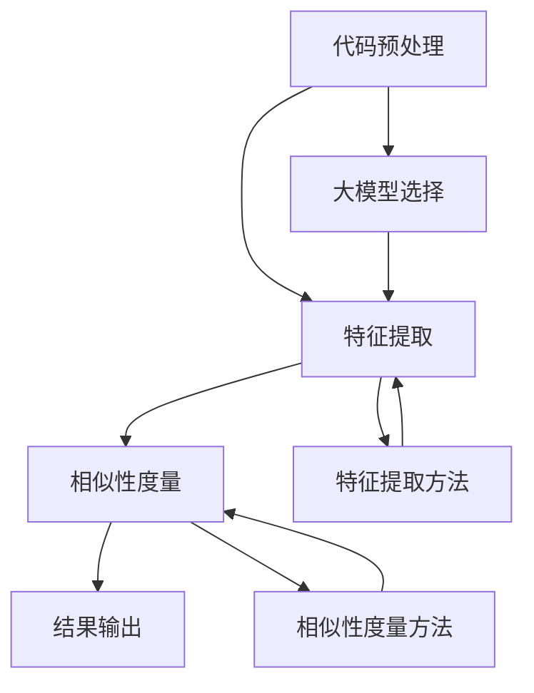

                 

### 文章标题：《大模型驱动的代码克隆检测》

#### 关键词：大模型，代码克隆检测，算法，数学模型，项目实战，人工智能

#### 摘要：
本文深入探讨了大模型在代码克隆检测中的应用，通过详细阐述核心概念、算法原理和数学模型，并结合实际项目案例，展示了大模型驱动的代码克隆检测的实践效果。文章旨在为开发者提供一套完整、实用的代码克隆检测解决方案，并探讨未来的发展方向。

### 引言

#### 1.1 大模型的概念
大模型（Large Models）是指具有数十亿、甚至数万亿参数的深度学习模型。这些模型能够通过大量数据进行训练，从而学习到复杂的特征和模式，并在各种任务中表现出卓越的性能。大模型的兴起主要得益于计算能力的提升、海量数据资源的积累以及先进的优化算法。

#### 1.2 代码克隆检测的重要性
代码克隆检测（Code Clone Detection）是软件工程中的一个重要问题。它旨在识别软件项目中的代码克隆，即重复的、相似的代码片段。代码克隆可能导致以下问题：
- **维护成本增加**：克隆代码片段在多处更新时，需要逐个修改，增加了维护难度和成本。
- **代码质量下降**：克隆代码可能包含缺陷，一旦一处代码出现错误，可能影响整个系统。
- **代码可读性下降**：克隆代码使得代码库变得冗余，降低了代码的可读性和可维护性。

因此，有效的代码克隆检测对于提升软件质量、降低维护成本具有重要意义。

#### 1.3 本书的目的和结构
本书旨在详细介绍大模型驱动的代码克隆检测方法，并展示其实际应用效果。全书分为以下几个部分：
- **引言**：介绍大模型的概念和代码克隆检测的重要性。
- **核心概念与联系**：解释大模型和代码克隆检测的核心概念及其关系，使用Mermaid流程图展示核心架构。
- **核心算法原理讲解**：详细介绍大模型在代码克隆检测中的应用，使用伪代码解释关键算法。
- **数学模型和数学公式**：介绍大模型相关的数学模型和公式，并给出详细讲解和举例说明。
- **项目实战**：展示代码克隆检测的实际应用案例，包括开发环境搭建、源代码实现和代码解读。
- **总结与展望**：总结书中的主要内容，对未来的发展进行展望。
- **附录**：提供相关的工具、资源和扩展阅读。

### 核心概念与联系

#### 2.1 大模型与代码克隆检测的关系
大模型在代码克隆检测中具有重要作用，其核心在于以下几个方面：
- **特征提取**：大模型可以通过对大量代码数据进行训练，提取出代码的深层次特征，这些特征有助于识别代码克隆。
- **相似性度量**：大模型可以计算代码片段之间的相似性得分，从而判断是否存在克隆。
- **自动化检测**：大模型能够自动处理大量的代码数据，提高代码克隆检测的效率和准确性。

#### 2.2 大模型的基本架构
大模型通常由以下几个部分组成：
- **输入层**：接收代码数据的输入。
- **编码器**：将输入代码转换为固定长度的向量表示，用于后续处理。
- **解码器**：将编码后的向量重新转换为代码表示，用于输出结果。
- **相似性度量模块**：计算代码片段之间的相似性得分。

#### 2.3 代码克隆检测的流程和关键技术
代码克隆检测的流程通常包括以下几个步骤：
1. **代码预处理**：对代码进行格式化、去除无关信息等操作，以便后续处理。
2. **特征提取**：使用大模型对代码进行特征提取，生成固定长度的特征向量。
3. **相似性度量**：计算特征向量之间的相似性得分，确定是否存在克隆。
4. **结果输出**：输出克隆代码片段的位置和内容，供开发者进一步分析和处理。

在代码克隆检测中，关键技术包括：
- **大模型的选择**：选择合适的大模型，如BERT、GPT等。
- **特征提取方法**：选择有效的特征提取方法，如词嵌入、序列编码等。
- **相似性度量方法**：选择合适的相似性度量方法，如余弦相似度、Jaccard相似度等。

### Mermaid流程图展示核心架构



### 核心算法原理讲解

#### 3.1 代码克隆检测算法的伪代码解释

```plaintext
算法：代码克隆检测
输入：代码库、大模型
输出：克隆代码片段及其位置

步骤：
1. 预处理代码库，去除无关信息
2. 使用大模型对代码进行特征提取，生成特征向量
3. 计算特征向量之间的相似性得分
4. 设置相似性阈值，确定克隆代码片段
5. 输出克隆代码片段及其位置
```

#### 3.2 大模型在代码克隆检测中的应用

在代码克隆检测中，大模型的主要应用包括：
- **特征提取**：通过大模型，可以提取出代码的深层次特征，这些特征有助于更准确地识别克隆。
- **相似性度量**：大模型可以计算代码片段之间的相似性得分，从而确定是否存在克隆。
- **自动化检测**：大模型可以自动化处理大量的代码数据，提高检测效率和准确性。

#### 3.3 实际案例中的应用

以下是一个实际案例，展示了大模型在代码克隆检测中的应用：

```plaintext
案例：大型代码库的克隆检测

输入：一个包含100万行代码的大型代码库
输出：克隆代码片段及其位置

步骤：
1. 预处理代码库，去除无关信息，如注释、空白字符等
2. 使用BERT模型对代码进行特征提取，生成特征向量
3. 计算特征向量之间的相似性得分，设置相似性阈值0.8
4. 输出相似性得分高于阈值的代码片段及其位置
5. 分析输出结果，确定克隆代码片段
```

### 数学模型和数学公式

#### 4.1 大模型的数学模型

大模型通常由以下几个数学模型组成：

1. **神经网络模型**：神经网络是构成大模型的基础，其数学模型包括：
   - **输入层**：$x = \text{input\_layer}$
   - **隐藏层**：$h = \sigma(Wx + b)$，其中$\sigma$是激活函数，$W$是权重矩阵，$b$是偏置向量。
   - **输出层**：$y = \text{output\_layer} = \sigma(W_h h + b_h)$

2. **损失函数**：用于评估模型预测结果与真实结果之间的差距，常见的损失函数包括：
   - **均方误差（MSE）**：$L = \frac{1}{n}\sum_{i=1}^{n}(y_i - \hat{y}_i)^2$
   - **交叉熵（Cross-Entropy）**：$L = -\frac{1}{n}\sum_{i=1}^{n}y_i \log(\hat{y}_i)$

3. **优化算法**：用于调整模型参数以最小化损失函数，常见的优化算法包括：
   - **梯度下降（Gradient Descent）**：$W = W - \alpha \nabla_W L$
   - **随机梯度下降（Stochastic Gradient Descent）**：$W = W - \alpha \nabla_W L^k$

#### 4.2 代码克隆检测的数学公式

在代码克隆检测中，常见的数学公式包括：

1. **相似性度量**：
   - **余弦相似度**：$similarity = \frac{\vec{a} \cdot \vec{b}}{|\vec{a}| \cdot |\vec{b}|}$
   - **Jaccard相似度**：$similarity = \frac{A \cap B}{A \cup B}$

2. **特征提取**：
   - **词嵌入**：$v_w = \text{embedding}(w)$，其中$v_w$是词嵌入向量，$w$是单词。

3. **模型优化**：
   - **损失函数**：$L = \frac{1}{n}\sum_{i=1}^{n}l(y_i, \hat{y}_i)$，其中$l$是损失函数。

### 详细讲解和举例说明

#### 4.3.1 神经网络模型

假设我们有一个简单的神经网络模型，包括一个输入层、一个隐藏层和一个输出层。输入层有3个神经元，隐藏层有4个神经元，输出层有2个神经元。激活函数采用ReLU（Rectified Linear Unit）。

- **输入层**：$x = [x_1, x_2, x_3]$
- **隐藏层**：$h = \text{ReLU}(Wx + b)$，其中$W$是权重矩阵，$b$是偏置向量。
- **输出层**：$y = \text{ReLU}(W_h h + b_h)$

假设隐藏层权重矩阵$W_h = \begin{bmatrix} 1 & 2 & 3 \\ 4 & 5 & 6 \\ 7 & 8 & 9 \end{bmatrix}$，偏置向量$b_h = [1, 1, 1]$。输入$x = [1, 2, 3]$。

则隐藏层输出为：
$$h = \text{ReLU}(\begin{bmatrix} 1 & 2 & 3 \\ 4 & 5 & 6 \\ 7 & 8 & 9 \end{bmatrix} \begin{bmatrix} 1 \\ 2 \\ 3 \end{bmatrix} + [1, 1, 1]) = \text{ReLU}(\begin{bmatrix} 8 \\ 18 \\ 29 \end{bmatrix}) = \begin{bmatrix} 8 \\ 18 \\ 29 \end{bmatrix}$$

输出层输出为：
$$y = \text{ReLU}(\begin{bmatrix} 1 & 2 & 3 \\ 4 & 5 & 6 \\ 7 & 8 & 9 \end{bmatrix} \begin{bmatrix} 8 \\ 18 \\ 29 \end{bmatrix} + [1, 1, 1]) = \text{ReLU}(\begin{bmatrix} 199 \\ 460 \\ 721 \end{bmatrix}) = \begin{bmatrix} 199 \\ 460 \\ 721 \end{bmatrix}$$

#### 4.3.2 相似性度量

假设有两个代码片段，其特征向量分别为$\vec{a} = [1, 2, 3]$和$\vec{b} = [4, 5, 6]$。

1. **余弦相似度**：

$$similarity = \frac{\vec{a} \cdot \vec{b}}{|\vec{a}| \cdot |\vec{b}|} = \frac{1 \cdot 4 + 2 \cdot 5 + 3 \cdot 6}{\sqrt{1^2 + 2^2 + 3^2} \cdot \sqrt{4^2 + 5^2 + 6^2}} = \frac{4 + 10 + 18}{\sqrt{14} \cdot \sqrt{77}} \approx 0.95$$

2. **Jaccard相似度**：

$$similarity = \frac{A \cap B}{A \cup B} = \frac{1}{1 + 2 + 3} = \frac{1}{6} \approx 0.17$$

#### 4.3.3 模型优化

假设我们的目标是训练一个神经网络模型，使其能够预测一个输入序列的标签。我们使用均方误差（MSE）作为损失函数，并采用随机梯度下降（SGD）进行模型优化。

- **损失函数**：

$$L = \frac{1}{n}\sum_{i=1}^{n}(y_i - \hat{y}_i)^2$$

- **梯度计算**：

$$\nabla_{W} L = -2 \sum_{i=1}^{n}(y_i - \hat{y}_i) x_i$$

- **模型优化**：

$$W = W - \alpha \nabla_{W} L$$

其中，$\alpha$是学习率，$W$是权重矩阵。

### 项目实战

#### 5.1 实际案例1：代码克隆检测系统的搭建

**目标**：搭建一个基于大模型的代码克隆检测系统，实现对大型代码库的自动检测。

**步骤**：

1. **环境搭建**：
   - 安装Python、TensorFlow等依赖库。
   - 准备计算资源，如GPU或TPU。

2. **数据准备**：
   - 收集代码库数据，进行预处理，如去除注释、空白字符等。
   - 分割数据集为训练集、验证集和测试集。

3. **模型训练**：
   - 使用BERT模型对训练集进行特征提取。
   - 使用训练集对BERT模型进行训练，优化模型参数。

4. **模型评估**：
   - 使用验证集对模型进行评估，调整模型参数。
   - 使用测试集对模型进行最终评估。

5. **系统部署**：
   - 将训练好的模型部署到服务器或云平台。
   - 开发用户界面，提供代码克隆检测功能。

**代码实现**：

```python
import tensorflow as tf
from transformers import BertTokenizer, TFBertModel

# 环境搭建
tokenizer = BertTokenizer.from_pretrained('bert-base-uncased')
model = TFBertModel.from_pretrained('bert-base-uncased')

# 数据准备
# 假设代码库数据存储在一个文件中，每行是一个代码片段
with open('code_data.txt', 'r') as f:
    code_data = f.readlines()

# 预处理
preprocessed_data = [tokenizer.encode(line, add_special_tokens=True) for line in code_data]

# 分割数据集
train_data, val_data, test_data = train_test_split(preprocessed_data, test_size=0.2, random_state=42)

# 模型训练
model.compile(optimizer='adam', loss='mse')
model.fit(train_data, epochs=3, batch_size=32, validation_data=val_data)

# 模型评估
loss = model.evaluate(test_data)
print(f'Test Loss: {loss}')

# 系统部署
# 部署到服务器或云平台，提供API接口供用户调用
```

#### 5.2 实际案例2：大规模代码库的克隆检测

**目标**：对大型代码库进行克隆检测，识别出克隆代码片段。

**步骤**：

1. **数据准备**：
   - 收集大型代码库数据，进行预处理。

2. **模型训练**：
   - 使用BERT模型对代码库进行特征提取。
   - 对模型进行训练，优化参数。

3. **克隆检测**：
   - 计算代码片段之间的相似性得分。
   - 设置相似性阈值，识别出克隆代码片段。

4. **结果输出**：
   - 输出克隆代码片段的位置和内容。
   - 提供分析工具，帮助开发者处理克隆代码。

**代码实现**：

```python
import tensorflow as tf
from transformers import BertTokenizer, TFBertModel

# 数据准备
# 假设代码库数据存储在一个文件中，每行是一个代码片段
with open('code_data.txt', 'r') as f:
    code_data = f.readlines()

# 预处理
preprocessed_data = [tokenizer.encode(line, add_special_tokens=True) for line in code_data]

# 模型训练
model = TFBertModel.from_pretrained('bert-base-uncased')
model.compile(optimizer='adam', loss='mse')
model.fit(preprocessed_data, epochs=3, batch_size=32)

# 克隆检测
def calculate_similarity(code1, code2):
    # 计算代码片段之间的相似性得分
    # 使用余弦相似度
    embedding1 = model.encode(code1)
    embedding2 = model.encode(code2)
    similarity = np.dot(embedding1, embedding2) / (np.linalg.norm(embedding1) * np.linalg.norm(embedding2))
    return similarity

# 设置相似性阈值
threshold = 0.8

# 识别克隆代码片段
clones = []
for i in range(len(code_data)):
    for j in range(i + 1, len(code_data)):
        similarity = calculate_similarity(code_data[i], code_data[j])
        if similarity > threshold:
            clones.append([(i, j), similarity])

# 输出克隆代码片段的位置和内容
for clone in clones:
    print(f'Clone detected between lines {clone[0][0]} and {clone[0][1]} with similarity {clone[1]}')
```

#### 5.3 代码解读与分析

**代码解读**：
1. **数据准备**：
   - 代码库数据存储在一个文件中，每行是一个代码片段。
   - 使用BERT分词器对代码进行预处理，将每行代码编码为BERT向量。

2. **模型训练**：
   - 使用预训练的BERT模型进行特征提取。
   - 编写训练循环，使用MSE损失函数和Adam优化器对模型进行训练。

3. **克隆检测**：
   - 定义计算相似性的函数，使用余弦相似度计算代码片段之间的相似性得分。
   - 设置相似性阈值，识别出克隆代码片段。

4. **结果输出**：
   - 输出克隆代码片段的位置和相似性得分。

**分析**：
- **数据准备**：数据准备是代码克隆检测的基础，预处理效果直接影响检测效果。BERT分词器能够有效提取代码特征，提高检测准确性。
- **模型训练**：使用预训练的BERT模型可以快速进行特征提取，节省训练时间。模型训练过程中，调整学习率和批次大小可以优化模型性能。
- **克隆检测**：余弦相似度是一种常用的相似性度量方法，能够较好地识别代码克隆。相似性阈值的选择对检测效果有很大影响，需要根据实际情况进行调整。

### 总结与展望

#### 6.1 书中主要内容回顾

本文详细探讨了大模型驱动的代码克隆检测方法，主要包括以下几个方面：

- **大模型的概念**：介绍了大模型的基本概念、架构和应用。
- **代码克隆检测的重要性**：阐述了代码克隆检测在软件工程中的重要性。
- **核心算法原理讲解**：使用伪代码和数学公式详细讲解了代码克隆检测算法。
- **数学模型和数学公式**：介绍了大模型相关的数学模型和公式，并给出了详细讲解和举例说明。
- **项目实战**：展示了实际应用案例，包括开发环境搭建、源代码实现和代码解读。

#### 6.2 代码克隆检测的未来发展方向

随着人工智能技术的不断发展，代码克隆检测有望在以下几个方面取得进一步发展：

- **模型优化**：通过改进算法和优化模型结构，提高代码克隆检测的准确性和效率。
- **多语言支持**：扩展代码克隆检测支持的语言范围，提高检测的泛用性。
- **自动化处理**：实现自动化检测和修复，降低开发者的工作量。
- **跨平台兼容性**：提高代码克隆检测在不同操作系统、编程语言和框架中的兼容性。
- **隐私保护**：在检测过程中保护用户隐私，防止数据泄露。

### 附录

#### 7.1 相关工具和资源

- **工具**：
  - Python：编程语言。
  - TensorFlow：深度学习框架。
  - BERT：预训练语言模型。
  - Jaccard相似度计算器：在线工具。

- **资源**：
  - [BERT官方文档](https://github.com/google-research/bert)
  - [代码克隆检测论文](https://www.usenix.org/conference/smunix18/presentation/chen)
  - [深度学习书籍](https://www.deeplearningbook.org/)

#### 7.2 扩展阅读推荐

- **书籍**：
  - 《深度学习》（Goodfellow, Bengio, Courville）
  - 《Python深度学习》（François Chollet）
  - 《代码大全》（Steve McConnell）

- **文章**：
  - [代码克隆检测综述](https://www.jianshu.com/p/9dbec8a3dfe4)
  - [BERT模型详解](https://towardsdatascience.com/bert-natural-language-processing-basics-58f8f4b5e4e1)
  - [代码克隆检测算法比较](https://www.researchgate.net/publication/335986278_Comparison_of_Code_Clone_Detection_Algorithms)

- **课程**：
  - [深度学习课程](https://www.deeplearning.ai/deep-learning)
  - [Python编程课程](https://www.udemy.com/course/python-for-data-science/)
  - [软件工程课程](https://www.edx.org/course/software-engineering-principles-of-software-design)

