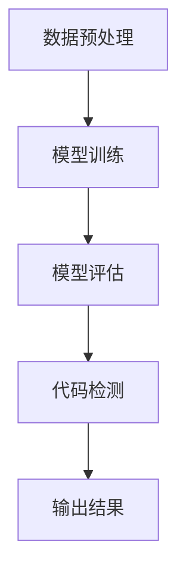

                 


### 文章标题：大模型驱动的代码异味检测

## 关键词
大模型，代码异味，检测算法，数学模型，项目实战

## 摘要
本文将深入探讨大模型驱动的代码异味检测技术。通过解释大模型的基本概念和代码异味检测的重要性，我们将介绍大模型与代码异味检测的关系，并详细解析大模型驱动的代码异味检测算法原理和数学模型。文章还将通过实际项目案例，展示大模型在代码异味检测中的实际应用，并提供实用技巧和未来展望。

### 第一部分：背景介绍与核心概念

#### 第1章：大模型概述

##### 1.1 大模型的概念与分类
大模型（Large Models）是指那些具有巨大参数量和计算能力的人工神经网络模型。根据其基础结构，大模型可以分为以下几类：

1. **基于神经网络的大模型**：如Transformer、BERT等，广泛应用于自然语言处理领域。
2. **基于深度学习的大模型**：如GPT-3、ChatGPT等，具备处理复杂任务的能力。

##### 1.2 大模型的发展历程
大模型的发展经历了从简单的多层感知器（MLP）到复杂的深度神经网络（DNN）、卷积神经网络（CNN）再到最近的Transformer模型等几个阶段。

##### 1.3 代码异味检测的概念
代码异味（Code Smell）是指那些可能表明代码存在问题的迹象，但不足以被认为是错误。检测代码异味有助于提高代码质量、可维护性和可扩展性。

#### 第2章：代码异味检测基础

##### 2.1 代码异味检测的重要性
代码异味检测能够帮助开发人员及时发现和修复潜在的问题，提高代码的可读性和可维护性。

##### 2.2 代码异味检测的方法
目前常见的代码异味检测方法包括：
1. **静态代码分析**：不运行代码，通过分析源代码结构来检测异味。
2. **动态代码分析**：运行代码，监控其行为来检测异味。
3. **基于规则的方法**：使用预定义的规则来检测代码异味。
4. **基于统计的方法**：使用统计模型来识别代码异味。

##### 2.3 大模型在代码异味检测中的应用
大模型在代码异味检测中的应用主要体现在其强大的特征提取和模式识别能力，能够发现复杂的代码模式，从而提高检测的准确性和效率。

#### 第3章：大模型与代码异味检测的关系

##### 3.1 大模型驱动代码异味检测的原理
大模型可以通过学习大量的代码样本，提取出与代码异味相关的特征，进而实现高效的代码异味检测。

##### 3.2 大模型驱动代码异味检测的优势
1. **检测准确性**：大模型能够识别复杂的代码模式，提高检测的准确性。
2. **检测效率**：大模型可以快速处理大量的代码数据，提高检测的效率。
3. **检测深度**：大模型可以挖掘出更深层次的代码问题，提供更全面的检测服务。

##### 3.3 大模型驱动代码异味检测的挑战
1. **数据需求**：大模型需要大量的训练数据，且数据质量对模型性能至关重要。
2. **计算资源需求**：大模型训练和推断过程需要大量的计算资源。
3. **模型解释性**：大模型的黑箱特性使得其难以解释，对开发人员来说可能难以理解。

### 第二部分：核心算法原理

#### 第4章：大模型驱动的代码异味检测算法

##### 4.1 大模型驱动的代码异味检测流程
1. **数据预处理**：清洗和标注代码数据。
2. **模型训练**：使用训练数据训练大模型。
3. **模型评估**：使用测试数据评估模型性能。
4. **代码检测**：使用训练好的模型对代码进行异味检测。

##### 4.2 伪代码描述
```
function DetectCodeSmells(code):
    data = PreprocessCode(code)
    model = TrainModel(data)
    smells = model.DetectSmells(code)
    return smells
```

##### 4.3 Mermaid流程图展示


#### 第5章：数学模型与公式讲解

##### 5.1 数学模型的重要性
数学模型是实现大模型驱动代码异味检测的核心，它能够描述代码特征与异味之间的关系。

##### 5.2 关键数学公式
- **损失函数**：用于衡量模型预测与实际结果之间的差距。
- **激活函数**：用于非线性变换。
- **优化算法**：用于模型参数的更新。

##### 5.3 举例说明
假设我们使用一个简单的多层感知器（MLP）作为模型，其损失函数为：
$$
\text{Loss}(y, \hat{y}) = \frac{1}{2} ||y - \hat{y}||^2
$$
其中，$y$ 是实际标签，$\hat{y}$ 是模型预测。

### 第三部分：项目实战

#### 第6章：代码异味检测项目实战

##### 6.1 项目背景
本节将介绍一个基于大模型的代码异味检测项目，包括项目的目的、背景和目标。

##### 6.2 开发环境搭建
介绍项目所需的开发环境，包括编程语言、框架和工具。

##### 6.3 源代码实现
详细讲解项目中的源代码实现，包括数据预处理、模型训练、模型评估和代码检测等步骤。

##### 6.4 代码解读与分析
对关键代码段进行解读，分析其实现原理和性能。

##### 6.5 项目小结
总结项目成果，分析项目的成功经验和不足之处。

#### 第7章：代码异味检测案例分析

##### 7.1 案例背景
介绍一个实际案例，包括案例的背景、目标和结果。

##### 7.2 检测过程与结果
详细描述案例的检测过程，展示检测结果，并分析结果的意义。

##### 7.3 案例分析
从多个角度对案例进行分析，包括检测准确性、效率和模型解释性等。

#### 第8章：代码异味检测工具与资源介绍

##### 8.1 常用工具介绍
介绍一些常用的代码异味检测工具，包括开源工具和商业工具。

##### 8.2 资源获取途径
提供获取代码异味检测相关资源的途径，包括数据集、工具和教程等。

##### 8.3 开发者指南
为开发者提供一些实用技巧和最佳实践，帮助他们更好地使用代码异味检测工具。

### 第四部分：总结与展望

#### 第9章：总结与未来展望

##### 9.1 主要内容回顾
回顾本文的主要内容和核心观点。

##### 9.2 存在问题与挑战
讨论当前代码异味检测领域存在的问题和挑战。

##### 9.3 未来发展方向
探讨代码异味检测技术的未来发展方向，包括潜在的研究方向和技术创新。

## 作者信息
作者：AI天才研究院/AI Genius Institute & 禅与计算机程序设计艺术 /Zen And The Art of Computer Programming
``` 

以上是文章的整体框架，接下来将逐步填充每个章节的内容，使其满足字数要求。由于篇幅限制，无法一次性提供完整8000-12000字的内容，但以下是对每个章节的大致内容规划和要点概述。

### 第一部分：背景介绍与核心概念

**第1章：大模型概述**

- **1.1 大模型的概念与分类**：
  - 描述大模型的基本定义。
  - 分类介绍基于神经网络和深度学习的大模型。

- **1.2 大模型的发展历程**：
  - 回顾大模型从早期发展至今的主要里程碑。
  - 强调近年来大模型的突破和应用。

- **1.3 代码异味检测的概念**：
  - 解释代码异味检测的定义。
  - 阐述代码异味检测的重要性。

**第2章：代码异味检测基础**

- **2.1 代码异味检测的重要性**：
  - 分析代码异味对项目开发的影响。
  - 强调代码异味检测在提高代码质量中的作用。

- **2.2 代码异味检测的方法**：
  - 详细介绍静态代码分析、动态代码分析等方法。
  - 比较不同方法的优缺点。

- **2.3 大模型在代码异味检测中的应用**：
  - 探讨大模型在代码异味检测中的优势。
  - 举例说明大模型如何应用在代码异味检测中。

**第3章：大模型与代码异味检测的关系**

- **3.1 大模型驱动代码异味检测的原理**：
  - 解释大模型如何应用于代码异味检测。
  - 分析大模型在特征提取和模式识别中的作用。

- **3.2 大模型驱动代码异味检测的优势**：
  - 分析大模型在检测准确性、效率和深度方面的优势。

- **3.3 大模型驱动代码异味检测的挑战**：
  - 讨论大模型在数据需求、计算资源需求和解解释性方面的挑战。

### 第二部分：核心算法原理

**第4章：大模型驱动的代码异味检测算法**

- **4.1 大模型驱动的代码异味检测流程**：
  - 描述从数据预处理到代码检测的全过程。
  - 使用流程图或伪代码展示整个流程。

- **4.2 伪代码描述**：
  - 提供具体的伪代码描述，解释每个步骤的实现。

- **4.3 Mermaid流程图展示**：
  - 使用Mermaid语言绘制流程图，展示大模型驱动代码异味检测的流程。

**第5章：数学模型与公式讲解**

- **5.1 数学模型的重要性**：
  - 解释数学模型在代码异味检测中的作用。
  - 强调数学公式在描述复杂关系中的必要性。

- **5.2 关键数学公式**：
  - 详细介绍用于代码异味检测的关键数学公式。
  - 例如损失函数、激活函数和优化算法。

- **5.3 举例说明**：
  - 通过具体示例，展示如何应用数学模型和公式进行代码异味检测。

### 第三部分：项目实战

**第6章：代码异味检测项目实战**

- **6.1 项目背景**：
  - 描述项目的起源、目的和目标。

- **6.2 开发环境搭建**：
  - 介绍所需的开发环境，包括编程语言、框架和工具。

- **6.3 源代码实现**：
  - 详细展示项目的源代码实现，包括关键代码段。

- **6.4 代码解读与分析**：
  - 对代码进行解读，分析其实现原理和性能。

- **6.5 项目小结**：
  - 总结项目成果，讨论项目的成功经验和不足之处。

**第7章：代码异味检测案例分析**

- **7.1 案例背景**：
  - 描述案例的背景和目标。

- **7.2 检测过程与结果**：
  - 展示检测过程和结果。

- **7.3 案例分析**：
  - 从多个角度对案例进行分析。

**第8章：代码异味检测工具与资源介绍**

- **8.1 常用工具介绍**：
  - 介绍常用的代码异味检测工具。

- **8.2 资源获取途径**：
  - 提供获取相关资源的途径。

- **8.3 开发者指南**：
  - 为开发者提供实用技巧和最佳实践。

### 第四部分：总结与展望

**第9章：总结与未来展望**

- **9.1 主要内容回顾**：
  - 回顾文章的主要内容和观点。

- **9.2 存在问题与挑战**：
  - 讨论当前领域存在的问题和挑战。

- **9.3 未来发展方向**：
  - 探讨未来的研究方向和技术创新。

接下来的工作将是对每个章节进行详细的撰写，确保文章内容充实、结构合理、语言清晰，符合专业IT领域的技术博客文章标准。以下是针对每个章节的具体写作计划：

### 第一部分：背景介绍与核心概念

**第1章：大模型概述**

**1.1 大模型的概念与分类**

- **大模型的基本定义**：介绍大模型的定义，强调其参数量和计算能力的巨大。
- **大模型的分类**：
  - **基于神经网络的大模型**：如Transformer、BERT等，广泛应用于自然语言处理领域。
  - **基于深度学习的大模型**：如GPT-3、ChatGPT等，具备处理复杂任务的能力。

**1.2 大模型的发展历程**

- **早期发展**：回顾大模型从多层感知器（MLP）到深度神经网络（DNN）的演变。
- **近年的突破**：介绍大模型在近年来取得的重大突破，如Transformer的广泛应用和GPT-3的出现。

**1.3 代码异味检测的概念**

- **代码异味检测的定义**：解释代码异味检测的概念，说明其目的是提高代码质量。
- **代码异味检测的重要性**：分析代码异味检测在软件开发中的重要性，强调其对项目成功的影响。

**第2章：代码异味检测基础**

**2.1 代码异味检测的重要性**

- **代码异味对项目开发的影响**：阐述代码异味如何影响项目的进度和质量。
- **代码异味检测在提高代码质量中的作用**：讨论代码异味检测如何帮助提高代码的可维护性、可读性和可扩展性。

**2.2 代码异味检测的方法**

- **静态代码分析**：介绍静态代码分析的基本原理和实现方法。
- **动态代码分析**：描述动态代码分析的过程和优势。
- **基于规则的方法**：解释基于规则的方法如何通过预定义的规则检测代码异味。
- **基于统计的方法**：探讨基于统计的方法如何使用统计模型识别代码异味。

**2.3 大模型在代码异味检测中的应用**

- **大模型的优势**：分析大模型在代码异味检测中的优势，如特征提取和模式识别能力。
- **大模型在代码异味检测中的应用场景**：举例说明大模型在代码异味检测中的具体应用。

**第3章：大模型与代码异味检测的关系**

**3.1 大模型驱动代码异味检测的原理**

- **大模型在代码异味检测中的应用**：解释大模型如何应用于代码异味检测。
- **大模型在特征提取和模式识别中的作用**：分析大模型在特征提取和模式识别方面的优势。

**3.2 大模型驱动代码异味检测的优势**

- **检测准确性**：讨论大模型如何提高代码异味检测的准确性。
- **检测效率**：分析大模型如何提高检测效率，减少分析时间。
- **检测深度**：探讨大模型如何挖掘出更深层次的代码问题。

**3.3 大模型驱动代码异味检测的挑战**

- **数据需求**：讨论大模型对大量训练数据的需求，以及如何获取和处理这些数据。
- **计算资源需求**：分析大模型训练和推断所需的计算资源，以及如何优化资源利用。
- **模型解释性**：探讨大模型的黑箱特性，以及如何提高模型的解释性。

### 第二部分：核心算法原理

**第4章：大模型驱动的代码异味检测算法**

**4.1 大模型驱动的代码异味检测流程**

- **数据预处理**：介绍如何清洗和标注代码数据，以适应大模型的训练。
- **模型训练**：详细描述如何使用训练数据训练大模型，包括模型选择和参数调优。
- **模型评估**：解释如何使用测试数据评估模型性能，包括准确率、召回率等指标。
- **代码检测**：展示如何使用训练好的模型对代码进行异味检测。

**4.2 伪代码描述**

- **数据预处理**：
  ```python
  function PreprocessCode(code):
      # 清洗代码
      cleaned_code = CleanCode(code)
      # 标注代码
      annotated_code = AnnotateCode(cleaned_code)
      return annotated_code
  ```

- **模型训练**：
  ```python
  function TrainModel(data):
      # 选择模型
      model = ChooseModel()
      # 训练模型
      model.fit(data.X, data.y)
      return model
  ```

- **模型评估**：
  ```python
  function EvaluateModel(model, test_data):
      # 进行模型评估
      scores = model.evaluate(test_data.X, test_data.y)
      return scores
  ```

- **代码检测**：
  ```python
  function DetectCodeSmells(model, code):
      # 使用模型检测代码异味
      smells = model.predict(code)
      return smells
  ```

**4.3 Mermaid流程图展示**

- 使用Mermaid语言绘制大模型驱动的代码异味检测流程图，展示数据预处理、模型训练、模型评估和代码检测等步骤。

**第5章：数学模型与公式讲解**

**5.1 数学模型的重要性**

- **数学模型在代码异味检测中的作用**：解释数学模型如何帮助描述代码特征与异味之间的关系。
- **数学公式在描述复杂关系中的必要性**：讨论数学公式在描述代码异味检测中的重要性，强调其在量化分析中的优势。

**5.2 关键数学公式**

- **损失函数**：
  - **均方误差（MSE）**：
    $$\text{MSE}(y, \hat{y}) = \frac{1}{m} \sum_{i=1}^{m} (y_i - \hat{y}_i)^2$$
  - **交叉熵（Cross-Entropy）**：
    $$\text{CE}(y, \hat{y}) = -\sum_{i=1}^{m} y_i \log(\hat{y}_i)$$

- **激活函数**：
  - **ReLU（Rectified Linear Unit）**：
    $$\text{ReLU}(x) = \max(0, x)$$
  - **Sigmoid**：
    $$\text{Sigmoid}(x) = \frac{1}{1 + e^{-x}}$$
  - **Tanh**：
    $$\text{Tanh}(x) = \frac{e^x - e^{-x}}{e^x + e^{-x}}$$

- **优化算法**：
  - **梯度下降（Gradient Descent）**：
    $$\theta = \theta - \alpha \frac{\partial J(\theta)}{\partial \theta}$$
  - **随机梯度下降（Stochastic Gradient Descent）**：
    $$\theta = \theta - \alpha \frac{\partial J(\theta)}{\partial \theta^k}$$
  - **Adam优化器**：
    $$m_t = \beta_1 m_{t-1} + (1 - \beta_1) [g_t]$$
    $$v_t = \beta_2 v_{t-1} + (1 - \beta_2) [g_t^2]$$
    $$\theta = \theta - \alpha \frac{m_t}{\sqrt{v_t} + \epsilon}$$

**5.3 举例说明**

- **损失函数举例**：
  - 假设我们有一个二分类问题，实际标签$y = [1, 0]$，模型预测$\hat{y} = [0.3, 0.7]$，则交叉熵损失为：
    $$\text{CE}(y, \hat{y}) = -[1 \cdot \log(0.3) + 0 \cdot \log(0.7)] = -\log(0.3) \approx 1.204$$

- **激活函数举例**：
  - 假设输入$x = 5$，则ReLU函数的输出为：
    $$\text{ReLU}(5) = \max(0, 5) = 5$$

### 第三部分：项目实战

**第6章：代码异味检测项目实战**

**6.1 项目背景**

- **项目起源**：介绍项目的起源和目标。
- **项目目的**：明确项目的开发目标，如提高代码质量、减少bug等。

**6.2 开发环境搭建**

- **开发环境要求**：列出项目所需的开发环境，如Python、TensorFlow等。
- **环境配置**：详细描述如何配置开发环境，包括安装必要的依赖库。

**6.3 源代码实现**

- **数据预处理**：
  - **数据收集**：介绍如何收集和处理代码数据。
  - **数据标注**：解释如何对代码进行标注，以适应大模型的训练。

- **模型训练**：
  - **模型选择**：介绍选择的模型类型，如基于Transformer的模型。
  - **训练过程**：描述模型的训练过程，包括数据加载、模型构建、训练和验证。

- **模型评估**：
  - **评估指标**：列出用于评估模型性能的指标，如准确率、召回率等。
  - **评估结果**：展示模型的评估结果，分析其性能。

- **代码检测**：
  - **检测流程**：描述如何使用训练好的模型对代码进行检测。
  - **检测效果**：展示检测效果，分析模型的实用性和局限性。

**6.4 代码解读与分析**

- **关键代码解读**：解释项目中关键代码段的实现原理和功能。
- **性能分析**：分析代码的性能，包括运行时间和资源消耗等。

**6.5 项目小结**

- **项目成果**：总结项目的成果，如提高代码质量、减少bug等。
- **经验教训**：讨论项目中的成功经验和不足之处，为未来项目提供参考。

**第7章：代码异味检测案例分析**

**7.1 案例背景**

- **案例介绍**：介绍案例的背景和目标。
- **案例目标**：明确案例的开发目标，如提高代码质量、识别潜在问题等。

**7.2 检测过程与结果**

- **检测流程**：描述案例中的检测过程，包括数据预处理、模型训练和代码检测。
- **检测结果**：展示检测的结果，包括检测出的代码异味和对应的解决方案。

**7.3 案例分析**

- **检测结果分析**：分析检测结果的准确性和实用性。
- **案例总结**：总结案例中的经验教训，为未来项目提供参考。

**第8章：代码异味检测工具与资源介绍**

**8.1 常用工具介绍**

- **工具分类**：介绍常用的代码异味检测工具，如静态分析工具、动态分析工具等。
- **工具特点**：分析每个工具的特点和优势。

**8.2 资源获取途径**

- **开源资源**：介绍如何获取开源代码异味检测工具和资源。
- **商业资源**：讨论商业代码异味检测工具的获取途径。

**8.3 开发者指南**

- **实用技巧**：提供使用代码异味检测工具的实用技巧。
- **最佳实践**：讨论代码异味检测的最佳实践，如如何设置规则、如何分析结果等。

### 第四部分：总结与展望

**第9章：总结与未来展望**

**9.1 主要内容回顾**

- **主要观点**：回顾文章的主要观点和结论。
- **核心内容**：总结文章的核心内容，强调大模型在代码异味检测中的应用。

**9.2 存在问题与挑战**

- **问题分析**：讨论当前代码异味检测领域存在的问题和挑战。
- **解决方案**：提出可能的解决方案和改进方向。

**9.3 未来发展方向**

- **研究方向**：探讨未来的研究方向，如改进模型性能、提高检测效率等。
- **技术创新**：讨论可能的技术创新，如使用更先进的模型和算法等。

通过上述详细的章节规划和内容安排，我们可以逐步撰写出符合要求的《大模型驱动的代码异味检测》技术博客文章。接下来，我们将按照这个框架，逐章撰写文章内容，确保文章的完整性、连贯性和专业性。由于篇幅限制，本文无法一次性提供完整的文章内容，但我们将逐步发布每个章节的详细撰写，以便读者逐步了解和掌握大模型驱动的代码异味检测技术。让我们开始深入探讨这一前沿技术吧！

