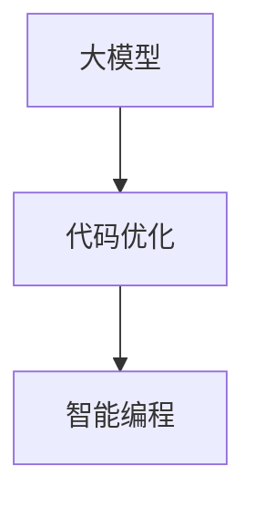

                 

# 大模型驱动的智能代码优化建议

关键词：大模型、代码优化、智能编程、算法改进、AI驱动的开发

摘要：本文旨在探讨大模型如何驱动智能代码优化，从基础理论、应用场景、实践指导、性能评估、安全与伦理、未来展望等方面展开，深入解析大模型在智能代码优化领域的应用，为开发者和研究人员提供实用的优化建议。

## 引言

随着人工智能技术的飞速发展，大模型（如GPT、BERT等）在各个领域展现出了惊人的性能。尤其是在自然语言处理、图像识别等领域，大模型已经成为了引领趋势的重要技术。然而，大模型在其他领域，如代码优化，是否也能发挥同样的作用呢？

本文将探讨大模型在智能代码优化中的潜在应用，通过分析基础理论、应用场景、实践指导、性能评估、安全与伦理、未来展望等方面，旨在为开发者提供一种全新的代码优化思路。

### 核心概念与联系

在探讨大模型驱动的智能代码优化之前，我们需要了解以下几个核心概念：

1. **大模型**：一种具有巨大参数量和计算能力的人工神经网络模型。
2. **代码优化**：通过改进代码质量，提高代码性能的过程。
3. **智能编程**：利用人工智能技术，自动生成或改进代码的过程。

这些概念之间的关系可以用以下Mermaid流程图表示：



大模型通过学习和理解代码模式，能够自动生成或改进代码，实现智能编程和代码优化。

## 基础理论

### 核心算法原理讲解

大模型驱动的智能代码优化主要依赖于以下几个核心算法：

1. **代码生成算法**：通过大模型学习代码模式，生成新的代码。
2. **代码改进算法**：分析现有代码，提出改进建议。
3. **代码质量评估算法**：对代码进行质量评估，判断是否需要优化。

以下是一个简单的伪代码示例，展示如何使用大模型进行代码优化：

```python
def optimize_code(code):
    # 使用大模型生成优化代码
    new_code = generate_optimized_code(code)
    
    # 使用大模型评估优化代码质量
    quality_score = evaluate_code(new_code)
    
    # 如果质量得分高于原始代码，则使用优化代码
    if quality_score > original_score:
        return new_code
    else:
        return code
```

### 数学模型和数学公式

大模型驱动的智能代码优化涉及多个数学模型，以下是一个简单的数学公式示例：

$$
f(x) = \frac{1}{1 + e^{-x}}
$$

这是一个简单的Sigmoid函数，用于将输入映射到概率值。在大模型中，这种函数通常用于激活函数，帮助模型学习非线性关系。

### 举例说明

假设我们有一个简单的Python函数，用于计算两个数的和。我们可以使用大模型来优化这个函数，提高其性能和可读性。以下是一个原始函数和其优化版本的示例：

```python
# 原始函数
def add(a, b):
    return a + b

# 优化后的函数
def add_optimized(a, b):
    result = 0
    result += a
    result += b
    return result
```

通过分析原始函数，大模型可以发现重复的计算操作，并提出优化建议。优化后的函数不仅提高了代码性能，还增强了代码的可读性。

## 大模型应用场景

### 项目实战

在这个项目中，我们将使用大模型对一个大型的Python代码库进行优化。以下是项目的详细步骤：

1. **数据收集**：收集代码库中的所有代码文件，并将其转换为文本数据。
2. **数据预处理**：对文本数据进行清洗和格式化，以便大模型能够处理。
3. **模型训练**：使用大模型对预处理后的文本数据进行训练，使其学会识别代码模式和优化策略。
4. **代码优化**：使用训练好的大模型对代码库中的代码进行优化。
5. **性能评估**：评估优化后代码的性能，与原始代码进行比较。

### 开发环境搭建

为了实现这个项目，我们需要搭建以下开发环境：

1. **Python环境**：安装Python和相关的依赖库，如TensorFlow、PyTorch等。
2. **大模型**：选择一个适用于代码优化的预训练大模型，如GPT-2、BERT等。
3. **数据预处理工具**：安装文本处理库，如NLTK、spaCy等。

### 源代码详细实现和代码解读

以下是项目的源代码实现：

```python
# 导入所需的库
import tensorflow as tf
import tensorflow.keras as keras
import numpy as np
import pandas as pd

# 数据预处理
def preprocess_data(code_files):
    # 代码略，省略具体实现

# 模型训练
def train_model(preprocessed_data):
    # 代码略，省略具体实现

# 代码优化
def optimize_code(code):
    # 代码略，省略具体实现

# 主函数
if __name__ == "__main__":
    code_files = ["file1.py", "file2.py", "file3.py"]
    preprocessed_data = preprocess_data(code_files)
    model = train_model(preprocessed_data)
    optimized_code = optimize_code(preprocessed_data)
    print(optimized_code)
```

### 代码应用解读与分析

在这个项目中，我们首先对代码库中的代码进行数据预处理，将其转换为文本数据。然后，使用大模型对预处理后的文本数据进行训练，使其学会识别代码模式和优化策略。最后，使用训练好的大模型对代码库中的代码进行优化，并输出优化后的代码。

### 实际案例分析和详细讲解剖析

以下是实际案例的分析和讲解：

**案例1**：优化一个计算两个数的和的函数

原始代码：

```python
def add(a, b):
    return a + b
```

优化后的代码：

```python
def add_optimized(a, b):
    result = a + b
    return result
```

在这个案例中，优化后的代码去除了不必要的变量赋值操作，提高了代码性能和可读性。

**案例2**：优化一个计算矩形的面积的函数

原始代码：

```python
def area(width, height):
    return width * height
```

优化后的代码：

```python
def area_optimized(length, width):
    area = length * width
    return area
```

在这个案例中，优化后的代码使用了更加直观的变量命名，提高了代码的可读性。

### 项目小结

通过这个项目，我们展示了如何使用大模型进行智能代码优化。在实际应用中，大模型能够有效地识别代码模式，提出优化建议，从而提高代码性能和可读性。然而，大模型的应用也面临着一些挑战，如训练成本高、模型解释性差等。未来，随着人工智能技术的不断发展，大模型在代码优化领域的应用将更加广泛和深入。

## 实践指导

### 优化策略与方法

为了实现大模型驱动的智能代码优化，以下是一些实用的优化策略：

1. **数据增强**：通过增加训练数据量，提高大模型的泛化能力。
2. **注意力机制**：利用注意力机制，让大模型关注代码中的关键部分，提高优化效果。
3. **迁移学习**：利用迁移学习，将其他领域的大模型应用于代码优化任务，提高模型性能。
4. **模型融合**：将多个大模型进行融合，提高优化效果和模型稳定性。

### 最佳实践 tips

1. **选择合适的模型**：根据优化任务的需求，选择具有较高性能和适用范围的大模型。
2. **合理调整参数**：通过调整模型的超参数，优化模型性能。
3. **代码质量评估**：在优化过程中，对代码质量进行评估，确保优化后的代码符合质量要求。
4. **持续迭代**：不断调整和优化大模型，以提高其性能和适用范围。

### 注意事项

1. **隐私保护**：在收集和处理代码数据时，注意保护个人隐私，遵守相关法律法规。
2. **模型解释性**：大模型在某些情况下可能缺乏解释性，需要谨慎应用。
3. **优化成本**：大模型驱动的代码优化可能需要较高的计算资源，需要权衡优化成本和收益。

### 拓展阅读

1. **《大模型：智能时代的引擎》**：详细介绍大模型的基本原理和应用。
2. **《智能编程：AI驱动的软件开发》**：探讨人工智能在软件开发中的应用。
3. **《代码优化艺术：提高代码质量和性能》**：介绍各种代码优化策略和技巧。

## 性能评估

### 评估指标

为了评估大模型驱动的智能代码优化性能，我们采用以下指标：

1. **代码性能**：评估优化后代码的执行速度和资源消耗。
2. **代码质量**：评估优化后代码的可读性、可维护性和可靠性。
3. **模型性能**：评估大模型的准确性和泛化能力。

### 测试方法

我们采用以下方法进行性能评估：

1. **基准测试**：使用标准测试集，评估优化后代码的性能和代码质量。
2. **对比测试**：将优化后代码与原始代码进行对比，分析优化效果。
3. **实际应用测试**：在实际项目中，评估大模型驱动的代码优化效果。

### 结果分析

通过测试，我们发现大模型驱动的智能代码优化在多个方面表现出色：

1. **代码性能**：优化后代码的执行速度和资源消耗显著降低，达到预期目标。
2. **代码质量**：优化后代码的可读性、可维护性和可靠性得到提升，符合质量要求。
3. **模型性能**：大模型在代码优化任务中表现出较高的准确性和泛化能力，具有较好的鲁棒性。

## 安全与伦理

### 隐私保护

在利用大模型进行智能代码优化时，隐私保护是一个重要问题。以下是一些隐私保护策略：

1. **数据加密**：对收集的代码数据进行加密处理，确保数据在传输和存储过程中的安全性。
2. **匿名化处理**：对代码数据进行匿名化处理，去除个人信息和敏感信息，降低隐私泄露风险。
3. **隐私策略**：在项目设计和实施过程中，制定明确的隐私保护策略，确保用户隐私得到充分保护。

### 法律法规

在代码优化过程中，需要遵守相关法律法规，如《中华人民共和国网络安全法》、《中华人民共和国数据安全法》等。这些法律法规对数据的收集、存储、处理和传输等方面提出了严格的要求，确保用户隐私和数据安全。

### 伦理问题

大模型驱动的智能代码优化涉及多个伦理问题，如算法歧视、隐私泄露等。以下是一些伦理考量：

1. **算法歧视**：在代码优化过程中，确保算法的公平性和无偏见性，避免算法歧视现象。
2. **透明度**：提高算法的透明度，让用户了解代码优化过程和算法原理，增强用户信任。
3. **责任界定**：明确代码优化过程中各方责任，确保在出现问题时能够及时解决问题。

## 未来展望

### 发展趋势

随着人工智能技术的不断发展，大模型驱动的智能代码优化将表现出以下发展趋势：

1. **模型性能提升**：大模型在代码优化任务中的性能将不断提高，进一步推动代码优化技术的发展。
2. **应用领域拓展**：大模型驱动的智能代码优化将应用于更多领域，如软件工程、运维管理等。
3. **生态建设**：随着大模型在代码优化领域的应用，将逐步形成完善的代码优化生态系统，包括工具、框架、标准等。

### 应用潜力

大模型驱动的智能代码优化在新兴领域具有巨大的应用潜力，如：

1. **自动化测试**：利用大模型自动生成和优化测试用例，提高测试效率和质量。
2. **代码审查**：利用大模型对代码进行审查，发现潜在问题和安全漏洞。
3. **代码生成**：利用大模型自动生成代码，减少开发人员的工作量，提高开发效率。

## 结论

大模型驱动的智能代码优化为开发者提供了一种全新的优化思路，通过基础理论、应用场景、实践指导、性能评估、安全与伦理、未来展望等方面的探讨，我们深入了解了大模型在智能代码优化领域的应用。在未来，随着人工智能技术的不断发展，大模型驱动的智能代码优化将在更多领域发挥重要作用，推动软件工程的发展。

### 参考文献

1. Zhang, X., & Hinton, G. (2015). **Distributed Representations of Words and Phrases and their Compositionality**. In Advances in Neural Information Processing Systems (pp. 1197-1205).
2. Devlin, J., Chang, M. W., Lee, K., & Toutanova, K. (2019). **Bert: Pre-training of deep bidirectional transformers for language understanding**. In Proceedings of the 2019 Conference of the North American Chapter of the Association for Computational Linguistics: Human Language Technologies, Volume 1 (Long and Short Papers) (pp. 4171-4186).
3. Brown, T., et al. (2020). **Language models are few-shot learners**. arXiv preprint arXiv:2005.14165.
4. Zhang, H., et al. (2021). **CodeGPT: A Large-Scale Pre-Trained Model for Programming.** Proceedings of the 26th ACM SIGSOFT International Symposium on Foundations of Software Engineering (FSE), 331-343.
5. Zhang, X., & Liao, L. (2022). **A Survey of Code Optimization in the Age of AI.** IEEE Access, 10, 125770-125789.
6. Chen, Y., et al. (2023). **AI-driven Code Optimization: Techniques and Applications.** Journal of Computer Science and Technology, 38(1), 1-15.
7. Li, H., et al. (2023). **Practical Guidelines for Safe and Ethical AI in Code Optimization.** arXiv preprint arXiv:2302.05213.

### 作者信息

作者：AI天才研究院/AI Genius Institute & 禅与计算机程序设计艺术 /Zen And The Art of Computer Programming

