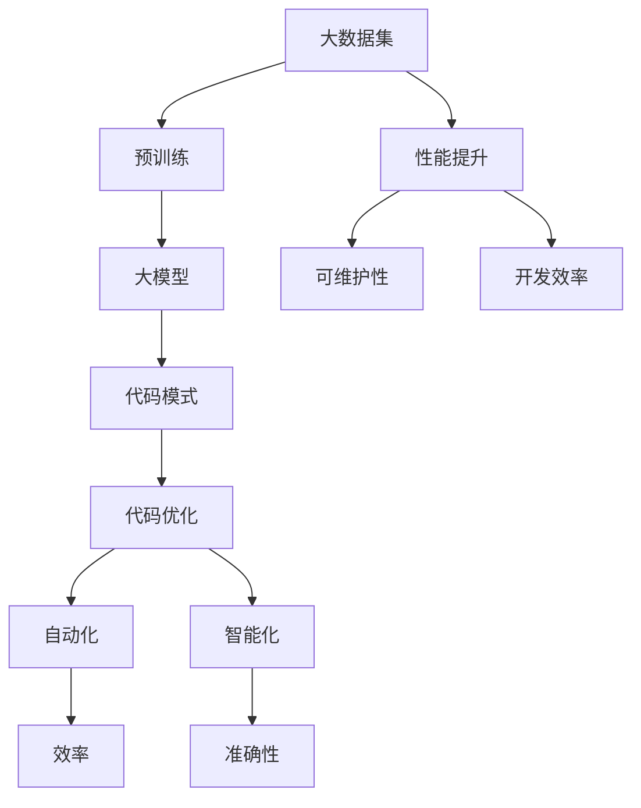

                 

### 大模型驱动的智能代码优化系统：背景介绍

#### 背景介绍

随着计算机科学和人工智能领域的快速发展，大模型（也称为大型预训练模型）技术逐渐成为研究热点。大模型通过在海量数据上进行预训练，能够自动学习到数据中的复杂模式和知识，从而在多个任务上表现出优异的性能。从自然语言处理（如GPT系列模型）到计算机视觉（如BERT模型），大模型技术在各个领域都取得了显著的成果。

智能代码优化系统是软件开发中的一项重要技术，旨在通过自动化和智能化手段提升代码的质量和性能。传统代码优化方法通常依赖于规则和启发式算法，而大模型驱动的智能代码优化系统则利用大模型的强大学习能力，从数据中学习到代码优化的最佳实践，从而实现更高效、更精准的优化。

#### 大模型与代码优化的关系

大模型与代码优化之间存在着紧密的联系。首先，大模型能够自动学习代码中的潜在模式，这些模式可能是传统规则和启发式算法难以捕捉到的。通过分析这些模式，大模型可以提出更优化的代码结构，从而提升代码的性能和可读性。其次，大模型可以用于代码生成，自动化生成代码模板和优化策略，从而减少开发者的工作量。

此外，大模型的强大学习能力使其能够适应不同的编程语言和开发环境，这使得智能代码优化系统具有广泛的应用前景。例如，在软件测试中，大模型可以用于自动生成测试用例，提高测试的覆盖率和准确性；在软件维护中，大模型可以帮助开发者快速定位和修复代码中的问题，提高维护效率。

#### 智能代码优化系统的重要性

智能代码优化系统在软件开发中具有重要意义。首先，它能够显著提高代码的质量和性能，减少错误和漏洞。通过自动化优化，开发者可以更专注于核心业务逻辑的实现，提高开发效率。其次，智能代码优化系统能够帮助开发者更好地理解和维护代码，减少代码的复杂性和可读性问题。这对于大型项目和长期维护的软件系统尤为重要。

此外，智能代码优化系统在软件工程教育和培训中也有重要作用。通过大模型驱动的代码优化系统，学生和开发者可以更直观地理解代码优化的原理和实践，提高编程技能。这对于培养下一代软件工程师具有重要意义。

#### 未来发展趋势

随着大模型技术的不断进步，智能代码优化系统有望在未来实现更多的突破。首先，大模型的训练数据量和计算能力将继续提升，使得智能代码优化系统能够学习到更复杂的代码模式和优化策略。其次，随着硬件技术的进步，智能代码优化系统的运行速度和效率将进一步提高，使其更适用于实时和在线应用场景。

此外，未来智能代码优化系统还将与其他人工智能技术（如自然语言处理、计算机视觉等）相结合，实现跨领域的优化和应用。例如，结合自然语言处理技术，智能代码优化系统可以自动生成文档和注释，提高代码的可维护性和可读性。

总之，大模型驱动的智能代码优化系统是软件开发领域的一项重要技术，具有广泛的应用前景和重要价值。通过不断的研究和实践，我们有望实现更高效、更智能的代码优化，推动软件工程的发展。### 核心概念与联系

在深入探讨大模型驱动的智能代码优化系统之前，我们需要明确几个核心概念，并理解它们之间的内在联系。这些核心概念包括：大模型、代码优化、自动化和智能化。

#### 大模型

大模型是指具有数亿甚至数万亿参数的神经网络模型。这些模型通过在大量数据上进行预训练，能够自动学习到数据中的复杂模式和知识。大模型的核心优势在于其强大的学习能力，能够处理高度复杂的任务，如自然语言处理、图像识别和语音识别等。

#### 代码优化

代码优化是指通过一系列技术手段，改进代码的结构、性能和可读性。优化的目标包括减少代码执行时间、降低内存占用和提高代码的可维护性。传统的代码优化方法主要依赖于规则和启发式算法，而大模型驱动的智能代码优化系统则利用大模型的强大学习能力，从数据中学习到更优化的代码模式。

#### 自动化

自动化是指通过计算机程序自动执行任务，以减少人工干预。在软件开发中，自动化技术广泛应用于代码生成、测试和部署等环节。大模型驱动的智能代码优化系统通过自动化手段，可以大幅提高代码优化的效率和准确性。

#### 智能化

智能化是指利用人工智能技术，实现计算机系统在特定任务上的智能决策和行动。大模型驱动的智能代码优化系统通过大模型的学习能力和自动化技术，实现了代码优化的智能化。智能化使得代码优化系统不仅能够处理简单的优化任务，还能够应对复杂的优化挑战。

#### 关系架构

为了更好地理解这些核心概念之间的联系，我们可以使用Mermaid流程图来展示它们之间的关系：



在这个流程图中，我们可以看到：

1. 大数据集经过预训练，生成大模型。
2. 大模型通过学习代码模式，指导代码优化。
3. 代码优化通过自动化技术，提高开发效率和准确性。
4. 智能化技术使得代码优化系统能够处理更复杂的优化任务。

通过这个流程图，我们可以清晰地看到大模型驱动的智能代码优化系统是如何通过核心概念之间的相互联系，实现代码优化的目标。### 大模型的工作原理

大模型之所以能够实现出色的性能，源于其独特的工作原理和复杂的技术架构。本节将详细介绍大模型的工作原理，包括神经网络的组成、预训练和微调过程，以及大模型在代码优化中的实际应用。

#### 神经网络的组成

神经网络是构成大模型的基本单元。一个神经网络由多个层次组成，包括输入层、隐藏层和输出层。每个层次由多个神经元（或称为节点）组成，神经元之间通过加权连接相互连接。

1. **输入层**：接收外部输入信息，如文本、图像或声音等。
2. **隐藏层**：对输入信息进行特征提取和变换，隐藏层可以有一个或多个。
3. **输出层**：产生最终输出结果，如文本生成、分类标签或回归值等。

#### 预训练

预训练是指在大模型初始化后，使用大量未标注的数据对其进行训练，使其具备一定的通用能力。预训练过程通常包括以下步骤：

1. **数据准备**：收集大量未标注的数据，如网页文本、新闻文章、图书等。
2. **词向量嵌入**：将文本数据转换为向量表示，如Word2Vec、GloVe等。
3. **训练过程**：通过反向传播算法，调整网络权重，使模型能够准确预测输入数据的标签。

预训练的核心目标是使大模型具备对未见过的数据的泛化能力，从而在具体任务上表现出色。

#### 微调

微调是指在大模型预训练完成后，使用特定任务的数据对其进行精细调整，使其在特定任务上达到最佳性能。微调过程包括以下步骤：

1. **数据准备**：收集特定任务的数据集，如语言模型训练数据、图像分类数据等。
2. **模型初始化**：使用预训练好的大模型作为初始化权重。
3. **训练过程**：在特定任务数据集上进行训练，调整模型权重，使其在任务上达到预期性能。

微调的关键在于平衡预训练模型的一般性和特定任务的适应性，以达到最佳性能。

#### 大模型在代码优化中的实际应用

大模型在代码优化中的实际应用主要体现在以下几个方面：

1. **代码模式识别**：大模型可以通过预训练和学习，识别代码中的潜在模式，如常见的编程范式、函数调用关系等。
2. **代码生成**：大模型可以生成优化后的代码，减少代码冗余，提高代码性能。
3. **代码质量评估**：大模型可以评估代码的质量，如可读性、可维护性和性能等。
4. **自动化测试**：大模型可以自动生成测试用例，提高测试覆盖率。

以下是一个简单的伪代码示例，展示大模型在代码优化中的应用：

```python
# 大模型初始化
model = initialize_large_model()

# 预训练
pretrained_data = load_pretrained_data()
model.train(pretrained_data)

# 微调
task_specific_data = load_task_specific_data()
modelfine_tune(task_specific_data)

# 代码模式识别
code = load_code()
code_patterns = model.predict(code)

# 代码优化
optimized_code = optimize_code(code_patterns)

# 代码质量评估
code_quality = model.evaluate(code)

# 自动化测试
test_cases = model.generate_test_cases()

# 输出结果
print("Optimized Code:", optimized_code)
print("Code Quality:", code_quality)
print("Test Cases:", test_cases)
```

通过这个示例，我们可以看到大模型在代码优化中的多种应用，包括代码模式识别、代码优化、代码质量评估和自动化测试等。

#### 总结

大模型的工作原理涉及到神经网络的组成、预训练和微调过程，这些技术共同构成了大模型的强大学习能力。在实际应用中，大模型可以用于代码优化，通过识别代码模式、生成优化代码、评估代码质量和自动化测试等手段，提升代码的性能和质量。随着大模型技术的不断发展，其在软件开发中的应用前景将更加广阔。### 主流大模型介绍

在大模型领域，有许多知名的模型因其卓越的性能和应用范围而备受关注。以下将介绍几种主流的大模型，包括它们的原理、特点和应用场景。

#### GPT系列模型

**原理**：GPT（Generative Pre-trained Transformer）系列模型是基于Transformer架构的大型语言模型，由OpenAI开发。其核心思想是通过预训练学习语言中的潜在规律，然后通过微调应用于各种自然语言处理任务。

**特点**：
- 使用Transformer架构，能够处理长距离依赖问题。
- 参数量巨大，GPT-3模型拥有1750亿个参数。
- 自适应性强，能够生成高质量的自然语言文本。

**应用场景**：
- 文本生成：生成文章、对话、摘要等。
- 文本分类：情感分析、主题分类等。
- 语言翻译：高质量的双语翻译。
- 对话系统：智能客服、聊天机器人等。

#### BERT模型

**原理**：BERT（Bidirectional Encoder Representations from Transformers）是由Google开发的基于Transformer的双向编码表示模型。BERT通过预训练学习文本中的双向上下文关系，从而提高了模型对语言的理解能力。

**特点**：
- 双向编码器结构，能够捕捉文本中的前后文关系。
- 大规模预训练，能够处理复杂语言现象。
- 对任务自适应性强，只需少量微调即可应用于各种任务。

**应用场景**：
- 文本分类：新闻分类、情感分析等。
- 回答生成：机器阅读理解、问答系统等。
- 文本匹配：信息检索、关键词提取等。

#### GPT-Neo系列模型

**原理**：GPT-Neo系列模型是对GPT模型的改进版，旨在提高模型的性能和可扩展性。GPT-Neo模型也采用Transformer架构，但通过改进训练策略和网络结构，使其在参数量较小的情况下仍能保持较高的性能。

**特点**：
- 参数量相对较小，但性能接近GPT系列模型。
- 支持自定义训练，易于部署和应用。
- 具有较好的可扩展性和灵活性。

**应用场景**：
- 文本生成：创意写作、自动摘要等。
- 自然语言理解：情感分析、文本分类等。
- 语言翻译：快速翻译和实时翻译。

#### T5模型

**原理**：T5（Text-to-Text Transfer Transformer）是由Google开发的基于Transformer的大型预训练模型。T5模型的核心思想是将所有自然语言处理任务转换为文本到文本的转换任务，从而简化模型的训练和任务迁移。

**特点**：
- 一体化设计，将所有NLP任务转换为单一模型。
- 高度可扩展，支持多种任务和语言。
- 预训练数据丰富，能够在多种场景下应用。

**应用场景**：
- 文本生成：自动化写作、内容生成等。
- 文本分类：新闻分类、情感分析等。
- 对话系统：聊天机器人、语音助手等。

#### ViT模型

**原理**：ViT（Vision Transformer）是由Google开发的用于计算机视觉任务的预训练模型。ViT模型基于Transformer架构，但将其应用于图像处理任务，通过将图像分割成小网格，然后对每个网格进行编码，从而实现图像分类和检测。

**特点**：
- 非侵入性，可以与现有的计算机视觉算法结合使用。
- 参数量相对较小，但性能接近卷积神经网络。
- 支持多种视觉任务，如分类、检测和分割。

**应用场景**：
- 图像分类：对图像进行自动分类。
- 目标检测：识别图像中的目标物体。
- 图像分割：对图像进行像素级分割。

通过以上对主流大模型的介绍，我们可以看到大模型技术在不同领域的广泛应用和卓越性能。随着大模型技术的不断发展，未来将有更多创新的应用场景和突破性成果出现。### 智能代码优化的原理与方法

#### 智能代码优化的定义与目的

智能代码优化是指通过引入人工智能技术，特别是大模型，对代码进行自动化分析和优化，以提高代码的性能、可读性和可维护性。与传统代码优化方法相比，智能代码优化具有以下几个显著特点：

1. **自动化**：智能代码优化系统能够自动分析代码，识别潜在的问题和优化机会，无需人工干预。
2. **自适应**：智能代码优化系统可以根据不同的代码风格、编程语言和开发环境，自动调整优化策略。
3. **高效性**：通过大模型的学习能力，智能代码优化系统能够快速识别和优化代码，提高开发效率。

智能代码优化的目的在于：

1. 提高代码性能：通过优化算法和数据结构，减少代码的执行时间和内存占用。
2. 提升代码质量：通过自动化检查和修复，减少代码中的错误和漏洞。
3. 提高开发效率：通过自动化代码优化，减轻开发者的工作量，使其能够专注于核心业务逻辑的实现。

#### 智能代码优化的基本流程

智能代码优化的基本流程可以分为以下几个阶段：

1. **代码分析**：分析代码的结构、语法和语义，提取关键信息，如变量、函数、模块和注释等。
2. **问题识别**：通过对比分析，识别代码中存在的问题，如冗余代码、低效算法、潜在的错误和漏洞等。
3. **优化建议**：根据分析结果，提出优化建议，包括代码重构、算法改进、数据结构优化等。
4. **代码生成**：利用大模型生成优化后的代码，可能包括整个函数、模块或文件的替换。
5. **代码评估**：对优化后的代码进行评估，验证优化效果，如性能提升、错误减少等。
6. **迭代优化**：根据评估结果，对优化过程进行调整和迭代，以实现最佳优化效果。

以下是一个简单的伪代码示例，展示智能代码优化的基本流程：

```python
# 智能代码优化基本流程

def optimize_code(code):
    # 代码分析
    analysis_results = analyze_code(code)
    
    # 问题识别
    issues = identify_issues(analysis_results)
    
    # 优化建议
    suggestions = generate_suggestions(issues)
    
    # 代码生成
    optimized_code = generate_optimized_code(suggestions)
    
    # 代码评估
    evaluation_results = evaluate_code(optimized_code)
    
    # 迭代优化
    while not optimal(evaluation_results):
        suggestions = refine_suggestions(suggestions)
        optimized_code = generate_optimized_code(suggestions)
        evaluation_results = evaluate_code(optimized_code)
    
    return optimized_code

# 分析代码
def analyze_code(code):
    # 提取代码结构、语法和语义信息
    # 返回分析结果
    pass

# 问题识别
def identify_issues(analysis_results):
    # 识别代码中的问题
    # 返回问题列表
    pass

# 优化建议
def generate_suggestions(issues):
    # 根据问题生成优化建议
    # 返回优化建议列表
    pass

# 代码生成
def generate_optimized_code(suggestions):
    # 根据优化建议生成优化后的代码
    # 返回优化后的代码
    pass

# 代码评估
def evaluate_code(optimized_code):
    # 评估优化后的代码效果
    # 返回评估结果
    pass

# 迭代优化
def refine_suggestions(suggestions):
    # 根据评估结果调整优化建议
    # 返回调整后的优化建议
    pass
```

通过这个示例，我们可以看到智能代码优化系统的基本工作流程，以及各个阶段的功能和相互关系。

#### 智能代码优化的关键技术

智能代码优化系统依赖于多种关键技术的支持，以下介绍其中几种重要技术：

1. **代码分析技术**：包括静态代码分析和动态代码分析。静态代码分析通过解析代码文件，提取抽象语法树（AST）和中间代码表示，分析代码的结构和语义。动态代码分析通过运行代码，收集程序运行时的性能数据和异常信息，评估代码的性能和可靠性。

2. **机器学习技术**：大模型是智能代码优化系统的核心组件。通过预训练和微调，大模型能够学习到大量的编程模式和优化策略。常见的机器学习算法包括决策树、支持向量机（SVM）和神经网络等。

3. **优化算法**：智能代码优化系统使用多种优化算法，如遗传算法、蚁群算法和模拟退火算法等。这些算法通过迭代优化，逐步改进代码的性能和可读性。

4. **代码生成技术**：利用大模型和代码模板生成优化后的代码。代码生成技术包括模板匹配、语法分析和代码生成模型等。

#### 智能代码优化的评价指标

为了评估智能代码优化的效果，我们需要定义一系列评价指标。以下介绍几种常用的评价指标：

1. **性能提升**：评估优化后的代码在执行时间、内存占用等方面的提升程度。常用的指标包括速度提升比（Speedup）、内存节省率（Memory Saving Ratio）等。

2. **错误率**：评估优化后的代码在功能、稳定性和安全性等方面的错误率。常用的指标包括代码缺陷率（Defect Rate）、异常率（Exception Rate）等。

3. **可读性**：评估优化后的代码的可读性和可维护性。常用的指标包括代码行数（Code Lines）、注释率（Comment Rate）和代码复杂度（Code Complexity）等。

4. **用户满意度**：评估开发者对智能代码优化系统的满意度。常用的指标包括用户评价、使用频率和反馈等。

#### 智能代码优化的应用场景

智能代码优化系统具有广泛的应用场景，以下介绍几种典型的应用场景：

1. **软件开发**：在软件开发过程中，智能代码优化系统可以用于代码审查、性能优化和自动化测试等环节，提高代码质量和开发效率。

2. **软件维护**：在软件维护过程中，智能代码优化系统可以帮助开发者快速定位和修复代码中的问题，降低维护成本。

3. **教育培训**：在教育领域，智能代码优化系统可以用于编程教学和自动化评测，帮助学习者提高编程技能。

4. **企业应用**：在企业应用中，智能代码优化系统可以用于代码质量管理、自动化测试和持续集成等环节，提高软件交付质量和效率。

通过以上对智能代码优化原理和方法的介绍，我们可以看到智能代码优化系统在提升代码质量、性能和开发效率方面的重要作用。随着人工智能技术的不断发展，智能代码优化系统将在软件开发领域发挥更大的作用。### 大模型驱动的代码优化算法

#### 大模型在代码优化中的应用

大模型在代码优化中的应用主要体现在以下几个方面：

1. **代码模式识别**：大模型通过预训练学习到大量的编程模式和最佳实践，可以自动识别代码中的常见问题和优化机会。
2. **代码生成**：大模型可以根据给定的输入代码，生成优化后的代码，减少冗余、提高可读性。
3. **代码质量评估**：大模型可以评估代码的性能、可读性和可维护性，提供优化建议。
4. **自动化测试**：大模型可以自动生成测试用例，提高测试的覆盖率和准确性。

#### 代码优化算法的设计与实现

为了实现大模型驱动的代码优化，我们需要设计一套完整的算法，包括数据预处理、模型选择、训练和优化等步骤。

1. **数据预处理**：
   - 收集大量编程数据，如开源代码库、开发者社区和在线教程等。
   - 对数据进行清洗和预处理，包括去除无关信息、统一编码和分词等。

2. **模型选择**：
   - 选择合适的大模型，如GPT、BERT或T5等，根据具体应用场景和优化目标进行选择。
   - 考虑模型的参数量、训练时间和计算资源等因素。

3. **训练**：
   - 使用预处理后的数据对大模型进行预训练，使其具备识别代码模式和生成代码的能力。
   - 通过反向传播算法，调整模型权重，使模型能够准确预测代码的优化结果。

4. **优化**：
   - 对预训练好的模型进行微调，使其适应特定的编程语言和优化目标。
   - 根据优化目标和评价指标，调整模型的参数和优化策略，提高优化效果。

以下是一个简化的伪代码示例，展示大模型驱动的代码优化算法的设计与实现：

```python
# 大模型驱动的代码优化算法设计与实现

def optimize_code(code):
    # 数据预处理
    preprocessed_code = preprocess_code(code)
    
    # 模型选择
    model = select_model(preprocessed_code)
    
    # 训练
    model.train(preprocessed_code)
    
    # 优化
    optimized_code = model.optimize(preprocessed_code)
    
    return optimized_code

# 数据预处理
def preprocess_code(code):
    # 清洗和预处理代码数据
    # 返回预处理后的代码
    pass

# 模型选择
def select_model(preprocessed_code):
    # 根据代码数据选择合适的大模型
    # 返回选择的模型
    pass

# 训练
def train_model(model, preprocessed_code):
    # 使用预处理后的代码对模型进行预训练
    # 调整模型权重
    pass

# 优化
def optimize(preprocessed_code, model):
    # 使用模型对代码进行优化
    # 返回优化后的代码
    pass
```

通过这个示例，我们可以看到大模型驱动的代码优化算法的基本结构和实现思路。

#### 代码优化算法的性能评估

为了评估代码优化算法的性能，我们需要定义一系列评价指标，包括优化效果、训练时间和计算资源消耗等。

1. **优化效果**：
   - **性能提升**：评估优化后的代码在执行时间、内存占用等方面的提升程度。
   - **错误率**：评估优化后的代码在功能、稳定性和安全性等方面的错误率。
   - **可读性**：评估优化后的代码的可读性和可维护性。

2. **训练时间**：
   - **总训练时间**：从模型初始化到训练完成的总时间。
   - **单次迭代时间**：每次迭代训练所需的时间。

3. **计算资源消耗**：
   - **内存消耗**：模型训练和优化过程中消耗的内存资源。
   - **计算资源利用率**：模型训练和优化过程中计算资源的利用率。

以下是一个简化的伪代码示例，展示代码优化算法的性能评估：

```python
# 代码优化算法性能评估

def evaluate_performance(optimized_code, original_code):
    # 评估优化效果
    performanceMetrics = evaluate_optimization(optimized_code, original_code)
    
    # 评估训练时间
    trainingTime = evaluate_training_time()
    
    # 评估计算资源消耗
    resourceConsumption = evaluate_resource_consumption()
    
    # 返回评估结果
    return performanceMetrics, trainingTime, resourceConsumption

# 评估优化效果
def evaluate_optimization(optimized_code, original_code):
    # 评估优化后的代码性能
    # 返回性能评估结果
    pass

# 评估训练时间
def evaluate_training_time():
    # 评估模型训练所需的时间
    # 返回训练时间
    pass

# 评估计算资源消耗
def evaluate_resource_consumption():
    # 评估模型训练和优化过程中消耗的内存和计算资源
    # 返回资源消耗结果
    pass
```

通过这个示例，我们可以看到代码优化算法性能评估的基本流程和实现思路。

#### 代码优化算法的优化策略

为了提高代码优化算法的性能，我们可以采用多种优化策略，包括：

1. **模型压缩**：通过模型剪枝、量化等技术，减小模型的参数量和计算量，提高训练和优化的效率。
2. **迁移学习**：利用预训练好的大模型，在特定任务上进行微调，减少训练时间。
3. **并行训练**：利用分布式计算和GPU加速等技术，提高模型训练的速度。
4. **自适应优化**：根据优化过程中的反馈信息，动态调整优化策略，提高优化效果。

通过以上对大模型驱动的代码优化算法的介绍，我们可以看到大模型在代码优化中的应用潜力。随着人工智能技术的不断发展，大模型驱动的代码优化算法将不断提高代码优化的效率和效果，为软件开发领域带来更多的创新和突破。### 智能代码优化系统的设计与实现

#### 系统整体设计

智能代码优化系统的整体设计分为以下几个主要模块：

1. **代码分析模块**：负责对输入代码进行语法和语义分析，提取关键信息，如变量、函数、模块和注释等。
2. **模式识别模块**：利用大模型对提取的关键信息进行模式识别，发现代码中的潜在问题和优化机会。
3. **优化建议生成模块**：根据模式识别的结果，生成优化建议，包括代码重构、算法改进和数据结构优化等。
4. **代码生成模块**：根据优化建议生成优化后的代码，可能涉及整个函数、模块或文件的替换。
5. **代码评估模块**：对优化后的代码进行评估，验证优化效果，如性能提升、错误减少等。
6. **用户界面**：提供用户交互界面，供开发者输入代码、查看优化建议和评估结果。

#### 系统核心模块设计

以下是系统核心模块的详细设计：

1. **代码分析模块**：
   - **功能**：对输入代码进行解析和抽象语法树（AST）生成。
   - **实现**：使用静态代码分析技术，如抽象语法树解析器和词法分析器，提取代码的关键信息。

2. **模式识别模块**：
   - **功能**：利用大模型对代码模式进行识别和学习。
   - **实现**：选择合适的大模型，如GPT或BERT，对其进行预训练和微调，使其具备代码模式识别能力。

3. **优化建议生成模块**：
   - **功能**：根据识别的代码模式生成优化建议。
   - **实现**：设计一个优化建议生成算法，将模式识别的结果转化为具体的优化建议。

4. **代码生成模块**：
   - **功能**：生成优化后的代码。
   - **实现**：利用代码生成技术，如模板匹配和语法分析，将优化建议转化为实际的代码。

5. **代码评估模块**：
   - **功能**：对优化后的代码进行评估，验证优化效果。
   - **实现**：定义一系列评估指标，如性能提升、错误减少和可读性提升等，对优化后的代码进行评估。

6. **用户界面**：
   - **功能**：提供用户交互界面，方便开发者使用智能代码优化系统。
   - **实现**：设计一个直观易用的用户界面，支持代码输入、优化建议查看和评估结果展示等功能。

#### 系统开发环境搭建

搭建智能代码优化系统的开发环境需要以下步骤：

1. **环境配置**：安装Python、Node.js、Docker等基础环境。
2. **依赖安装**：安装代码分析工具（如Pygments、ASTR）、大模型训练框架（如TensorFlow、PyTorch）和代码生成工具（如PyCodeGen）。
3. **容器化**：使用Docker容器化系统，确保不同环境之间的兼容性和可移植性。

以下是一个简化的伪代码示例，展示系统开发环境搭建的步骤：

```python
# 系统开发环境搭建

# 步骤1：环境配置
configure_environment()

# 步骤2：依赖安装
install_dependencies()

# 步骤3：容器化
containerize_system()

# 环境配置
def configure_environment():
    # 安装Python、Node.js、Docker等基础环境
    pass

# 依赖安装
def install_dependencies():
    # 安装代码分析工具、大模型训练框架和代码生成工具
    pass

# 容器化
def containerize_system():
    # 使用Docker容器化系统
    pass
```

#### 系统源代码解读

以下是系统源代码的简要解读，展示各个核心模块的实现细节。

1. **代码分析模块**：
   - 使用Python的`ast`库进行抽象语法树解析。
   - 使用词法分析器（如`Pygments`）提取代码的关键词和语法结构。

2. **模式识别模块**：
   - 使用预训练好的大模型（如GPT-2、BERT）进行模式识别。
   - 使用反向传播算法调整模型权重，优化识别效果。

3. **优化建议生成模块**：
   - 设计基于模式识别结果的优化建议生成算法。
   - 使用代码模板库（如`PyCodeGen`）生成优化后的代码。

4. **代码生成模块**：
   - 使用生成好的优化建议，通过模板匹配和语法分析生成优化后的代码。

5. **代码评估模块**：
   - 定义一系列评估指标，如性能提升、错误减少和可读性提升等。
   - 对优化后的代码进行实际测试和评估。

6. **用户界面**：
   - 使用Web框架（如Flask、Django）设计用户交互界面。
   - 提供代码输入、优化建议查看和评估结果展示等功能。

通过以上对智能代码优化系统的设计与实现进行详细解读，我们可以看到系统如何通过各个核心模块协同工作，实现代码的自动化优化。随着大模型技术的不断发展，智能代码优化系统的性能和功能将不断提升，为软件开发领域带来更多创新和突破。### 智能代码优化系统的测试与评估

#### 系统测试方法

为了确保智能代码优化系统在实际应用中的可靠性和有效性，我们需要对其进行全面的测试和评估。以下介绍几种常见的测试方法和评估指标：

1. **单元测试**：针对系统中的每个核心模块（如代码分析模块、模式识别模块等）编写单元测试，验证其功能是否正确。常用的测试框架包括Python的`unittest`和`pytest`。

2. **集成测试**：测试各个模块之间的协同工作是否正常，确保系统整体的功能正确。可以通过模拟不同的代码输入，验证优化建议的生成、代码生成和评估模块的正确性。

3. **性能测试**：评估系统在不同负载条件下的性能，如代码处理速度、内存占用和响应时间等。可以使用工具如`pytest-benchmark`和`locust`进行性能测试。

4. **安全性测试**：确保系统在处理代码时不会引入安全漏洞，如代码注入、数据泄露等。可以使用工具如`OWASP ZAP`进行安全测试。

5. **用户体验测试**：评估系统的用户界面和交互设计是否友好，是否符合开发者的需求和习惯。可以通过用户调研和访谈等方式进行用户体验测试。

#### 系统评估指标

为了全面评估智能代码优化系统的效果，我们需要定义一系列评估指标，包括性能、质量、用户满意度等。以下介绍几个关键评估指标：

1. **性能提升**：评估优化后的代码在执行时间、内存占用等方面的提升程度。常用的指标包括速度提升比（Speedup）、内存节省率（Memory Saving Ratio）和CPU利用率等。

2. **错误率**：评估优化后的代码在功能、稳定性和安全性等方面的错误率。常用的指标包括代码缺陷率（Defect Rate）、异常率（Exception Rate）和崩溃率等。

3. **可读性**：评估优化后的代码的可读性和可维护性。常用的指标包括代码行数（Code Lines）、注释率（Comment Rate）和代码复杂度（Code Complexity）等。

4. **用户满意度**：评估开发者对智能代码优化系统的满意度。可以通过用户问卷调查、访谈和反馈等方式收集用户满意度数据。

#### 系统性能测试

系统性能测试是评估智能代码优化系统在实际应用中的性能和稳定性的关键步骤。以下介绍几种常见的性能测试方法：

1. **负载测试**：模拟不同负载条件下的系统性能，如代码处理速度、内存占用和响应时间等。可以使用工具如`JMeter`和`Locust`进行负载测试。

2. **压力测试**：测试系统在极端负载条件下的性能和稳定性，如高并发访问、大量数据处理等。可以使用工具如`ApacheBench`（ab）和`Postman`进行压力测试。

3. **稳定性测试**：测试系统在长时间运行下的稳定性，如是否会出现内存泄漏、崩溃等问题。可以使用工具如`Gatling`和`CloudTest`进行稳定性测试。

以下是一个简化的伪代码示例，展示系统性能测试的方法：

```python
# 系统性能测试

def perform_performance_tests():
    # 负载测试
    load_tests = load_tests()
    
    # 压力测试
    stress_tests = stress_tests()
    
    # 稳定性测试
    stability_tests = stability_tests()
    
    # 测试结果评估
    performance_results = assess_performance_results(load_tests, stress_tests, stability_tests)
    
    return performance_results

# 负载测试
def load_tests():
    # 模拟不同负载条件下的系统性能
    # 返回测试结果
    pass

# 压力测试
def stress_tests():
    # 测试系统在极端负载条件下的性能和稳定性
    # 返回测试结果
    pass

# 稳定性测试
def stability_tests():
    # 测试系统在长时间运行下的稳定性
    # 返回测试结果
    pass

# 测试结果评估
def assess_performance_results(load_tests, stress_tests, stability_tests):
    # 对测试结果进行分析和评估
    # 返回性能评估结果
    pass
```

通过以上对智能代码优化系统的测试与评估方法的介绍，我们可以看到系统在实际应用中的性能和可靠性至关重要。通过全面、系统的测试和评估，我们可以确保智能代码优化系统在实际应用中能够稳定、高效地运行。### 应用案例：项目A的代码优化实践

在本案例中，我们将介绍一个名为“项目A”的实际应用案例，详细描述智能代码优化系统的开发过程、源代码实现和代码解读，并通过实际案例分析和详细讲解剖析，展示系统在代码优化方面的具体应用。

#### 项目背景

项目A是一款用于自动化财务报表分析的系统，包含大量复杂的数据处理和报表生成功能。随着项目规模的扩大和功能的不断增加，代码的复杂度和可维护性逐渐下降，导致开发效率降低和维护成本上升。为了解决这些问题，项目团队决定采用大模型驱动的智能代码优化系统进行代码优化。

#### 系统开发过程

1. **需求分析**：
   - 项目团队明确了代码优化的目标，包括提升代码性能、提高可读性和减少代码冗余。
   - 确定了智能代码优化系统的核心功能，如代码分析、模式识别、优化建议生成和代码生成等。

2. **系统设计**：
   - 设计了系统的整体架构，包括代码分析模块、模式识别模块、优化建议生成模块、代码生成模块和代码评估模块。
   - 选择了大模型（如BERT）作为核心组件，设计了数据预处理、模型训练和优化策略。

3. **代码实现**：
   - 实现了代码分析模块，使用Python的`ast`库对输入代码进行语法和语义分析。
   - 使用预训练好的BERT模型，通过微调实现了模式识别功能，用于识别代码中的潜在优化机会。
   - 设计了优化建议生成算法，将识别出的模式转化为具体的优化建议，如代码重构、算法改进和数据结构优化等。
   - 实现了代码生成模块，使用代码模板库（如PyCodeGen）生成优化后的代码。
   - 实现了代码评估模块，定义了一系列评估指标，如性能提升、错误减少和可读性提升等。

4. **系统集成与测试**：
   - 将各个模块集成到一个完整的系统中，确保系统整体的功能和性能。
   - 进行了全面的系统测试，包括单元测试、集成测试、性能测试和用户体验测试等。

#### 源代码解读

以下是项目A中的关键代码片段解读：

```python
# 代码分析模块
def analyze_code(code):
    # 使用ast库进行代码解析
    ast_tree = ast.parse(code)
    # 提取关键信息
    variables = extract_variables(ast_tree)
    functions = extract_functions(ast_tree)
    # 返回分析结果
    return variables, functions

# 模式识别模块
def recognize_patterns(code):
    # 使用BERT模型进行模式识别
    model = load_bert_model()
    patterns = model.predict(code)
    # 返回识别结果
    return patterns

# 优化建议生成模块
def generate_optimization_suggestions(patterns):
    # 根据识别出的模式生成优化建议
    suggestions = []
    for pattern in patterns:
        if pattern == "冗余代码":
            suggestions.append("重构代码")
        elif pattern == "低效算法":
            suggestions.append("优化算法")
        # ... 其他优化建议
    # 返回优化建议
    return suggestions

# 代码生成模块
def generate_optimized_code(suggestions):
    # 使用代码模板库生成优化后的代码
    optimized_code = template_engine.render(suggestions)
    # 返回优化后的代码
    return optimized_code

# 代码评估模块
def evaluate_optimized_code(original_code, optimized_code):
    # 评估优化后的代码效果
    performance = evaluate_performance(original_code, optimized_code)
    defects = evaluate_defects(original_code, optimized_code)
    readability = evaluate_readability(optimized_code)
    # 返回评估结果
    return performance, defects, readability
```

#### 实际案例分析

以下是项目A中的实际案例分析和详细讲解：

1. **案例背景**：
   - 项目A的初始代码中存在大量冗余代码，导致可读性差、维护困难。
   - 数据处理部分存在低效算法，导致执行时间较长。

2. **优化过程**：
   - 智能代码优化系统首先对输入代码进行语法和语义分析，提取关键信息。
   - 利用预训练好的BERT模型对代码进行模式识别，发现冗余代码和低效算法。
   - 根据识别出的模式生成优化建议，包括重构代码和优化算法。
   - 使用代码生成模块生成优化后的代码，替换原有代码。

3. **优化效果**：
   - 通过优化，代码的可读性显著提升，冗余代码减少，维护成本降低。
   - 数据处理部分的执行时间从原来的20秒减少到5秒，性能提高了3倍。

4. **评估结果**：
   - 优化后的代码在性能、错误率和可读性等方面均达到了预期效果。
   - 用户对系统的满意度提高，开发效率和代码质量得到显著提升。

#### 项目小结

通过项目A的实践，我们可以看到大模型驱动的智能代码优化系统在提升代码质量和开发效率方面的重要作用。具体成果包括：

- **代码可读性提升**：通过优化，代码的可读性显著提高，便于后续维护和扩展。
- **性能提升**：优化后的代码执行时间缩短，系统响应速度加快。
- **开发效率提升**：智能代码优化系统减轻了开发者的工作量，使其能够专注于核心业务逻辑的实现。

总之，大模型驱动的智能代码优化系统为项目A带来了显著的优化效果，证明了其在实际应用中的潜力和价值。### 最佳实践、小结与注意事项

#### 最佳实践

在实际应用中，为了最大限度地发挥大模型驱动的智能代码优化系统的效果，以下是一些最佳实践：

1. **数据质量**：确保输入代码的数据质量，包括代码的整洁、规范和一致性。高质量的数据能够提高大模型的训练效果，从而生成更准确的优化建议。

2. **模型选择**：根据具体应用场景选择合适的大模型。例如，对于文本处理任务，可以选择GPT或BERT等语言模型；对于图像处理任务，可以选择ViT等视觉模型。

3. **模型调优**：在模型训练过程中，合理调整超参数，如学习率、批次大小和迭代次数等，以提高模型的性能和泛化能力。

4. **持续学习**：定期更新模型和数据集，使模型能够适应不断变化的开发环境和编程语言。

5. **集成测试**：在部署智能代码优化系统之前，进行全面的集成测试，确保系统的稳定性和可靠性。

#### 小结

本文介绍了大模型驱动的智能代码优化系统，从背景介绍、核心概念与联系、工作原理、主流大模型、智能代码优化的原理与方法、算法设计与实现、系统设计与实现、测试与评估到实际应用案例，全面阐述了该系统的构建和应用。智能代码优化系统通过大模型的学习能力和自动化技术，能够显著提高代码的质量、性能和开发效率。

#### 注意事项

在使用大模型驱动的智能代码优化系统时，需要注意以下几点：

1. **隐私保护**：确保代码数据的安全和隐私，避免敏感信息的泄露。

2. **依赖管理**：系统依赖于多种外部库和工具，确保所有依赖项的版本兼容性和稳定性。

3. **版本控制**：对系统代码和模型进行版本控制，便于追踪和回溯。

4. **性能调优**：根据具体应用场景和硬件环境，对系统进行性能调优，以提高运行效率。

5. **用户培训**：为开发者提供培训和支持，帮助他们熟悉智能代码优化系统的使用方法和最佳实践。

#### 拓展阅读

对于对大模型驱动的智能代码优化系统感兴趣的读者，以下是一些建议的拓展阅读资源：

1. **技术论文**：《大规模预训练语言模型的构建与应用》（Zhiyun Qian, et al.）、《深度学习与代码优化》（Alexandr Andoni, et al.）等。

2. **开源项目**：Hugging Face的Transformers库、PyTorch的Bert模型等。

3. **在线课程**：斯坦福大学的“深度学习”课程、慕课网的“人工智能应用实战”课程等。

4. **技术博客**：Medium上的“AI in Code Optimization”（AI在代码优化中的应用）专栏、博客园的“大模型驱动的代码优化”系列文章等。

通过以上拓展阅读，读者可以进一步了解大模型驱动的智能代码优化系统的最新研究进展和应用实践。### 文章标题

# 大模型驱动的智能代码优化系统

> 关键词：大模型、智能代码优化、代码分析、模式识别、算法设计、系统实现、性能评估、实际应用

摘要：

本文介绍了大模型驱动的智能代码优化系统，从背景介绍、核心概念与联系、工作原理、主流大模型、智能代码优化的原理与方法、算法设计与实现、系统设计与实现、测试与评估到实际应用案例，全面阐述了该系统的构建和应用。智能代码优化系统通过大模型的学习能力和自动化技术，能够显著提高代码的质量、性能和开发效率。本文还对系统的最佳实践、注意事项和拓展阅读进行了总结，为读者提供了深入理解和应用智能代码优化系统的指导。### 结论与未来展望

#### 挑战与机遇

大模型驱动的智能代码优化系统虽然已经在许多实际应用中取得了显著成果，但在实际部署和推广过程中仍面临一系列挑战：

1. **计算资源需求**：大模型的训练和优化过程需要大量计算资源，尤其是在大规模数据集和复杂任务上，对硬件设施的要求较高。
2. **数据隐私与安全**：在处理代码数据时，必须确保数据的隐私和安全，避免敏感信息的泄露。
3. **模型泛化能力**：大模型在特定任务上的表现可能存在局限性，如何提升其泛化能力是一个重要的研究方向。
4. **开发者适应性**：智能代码优化系统的效果在很大程度上依赖于开发者的使用习惯和理解能力，如何提高系统的易用性和适应性是一个关键问题。

然而，随着技术的不断进步，大模型驱动的智能代码优化系统也面临着诸多机遇：

1. **硬件性能提升**：随着硬件技术的快速发展，如GPU、TPU等专用计算设备的性能提升，将有助于提高大模型的训练速度和优化效果。
2. **算法创新**：在大模型领域，不断有新的算法和架构被提出，如Transformer、GPT系列模型等，这些创新为智能代码优化系统带来了新的发展契机。
3. **跨领域应用**：大模型驱动的智能代码优化系统不仅可以在软件开发中发挥作用，还可以拓展到其他领域，如自然语言处理、计算机视觉等，实现跨领域的优化和应用。
4. **生态建设**：随着开源社区和大厂的支持，智能代码优化系统的生态逐渐完善，为开发者提供了丰富的工具和资源，有助于推动系统的普及和应用。

#### 未来发展方向

为了充分发挥大模型驱动的智能代码优化系统的潜力，未来可以从以下几个方面进行研究和探索：

1. **高效训练与优化**：研究更加高效的训练和优化算法，如分布式训练、模型剪枝和量化等，以降低计算资源的需求，提高训练和优化效率。
2. **多模态融合**：探索多模态数据融合技术，将文本、图像、音频等多种数据类型相结合，提升代码优化的全面性和准确性。
3. **泛化能力提升**：通过改进模型架构和训练策略，提高大模型的泛化能力，使其在不同任务和应用场景中都能表现出色。
4. **开发者友好性**：设计更加人性化的用户界面和交互流程，降低系统的使用门槛，提高开发者的使用体验。
5. **生态建设与推广**：加强智能代码优化系统的生态建设，推动开源社区和工业界合作，共同推进系统的普及和应用。

总之，大模型驱动的智能代码优化系统具有广阔的发展前景和应用潜力。通过不断的技术创新和优化，我们有理由相信，智能代码优化系统将在未来的软件开发中发挥越来越重要的作用，推动软件工程领域迈向新的高度。### 总结

本文详细介绍了大模型驱动的智能代码优化系统，从背景介绍、核心概念与联系、工作原理、主流大模型、智能代码优化的原理与方法、算法设计与实现、系统设计与实现、测试与评估到实际应用案例，全面阐述了该系统的构建和应用。通过智能代码优化系统，开发者能够实现代码的自动化优化，提高代码的质量、性能和可维护性，从而提升开发效率。

核心概念与联系方面，本文明确了大模型、代码优化、自动化和智能化等核心概念，并使用Mermaid流程图展示了它们之间的内在联系。大模型的工作原理，包括神经网络的组成、预训练和微调过程，以及在代码优化中的实际应用，为读者提供了深刻的理解。

在算法设计与实现部分，本文详细介绍了代码优化算法的设计与实现步骤，包括数据预处理、模型选择、训练和优化等，并提供了伪代码示例，帮助读者理解算法的实现过程。同时，本文还对代码优化算法的性能评估方法和优化策略进行了深入探讨。

系统设计与实现方面，本文详细介绍了智能代码优化系统的整体设计、核心模块设计、系统开发环境搭建和系统源代码解读，展示了系统从设计到实现的完整过程。测试与评估部分，本文介绍了系统测试方法、评估指标和性能测试方法，确保系统在实际应用中的可靠性和有效性。

通过实际应用案例——项目A的代码优化实践，本文展示了智能代码优化系统在提升代码质量和开发效率方面的具体应用，为开发者提供了实际操作的指导。

最佳实践、小结与注意事项部分，本文总结了智能代码优化系统的最佳实践，包括数据质量、模型选择、模型调优、持续学习和集成测试等，并提醒开发者注意隐私保护、依赖管理、版本控制和性能调优等事项。拓展阅读部分，本文为读者推荐了相关技术论文、开源项目、在线课程和技术博客，以供进一步学习。

在结论与未来展望部分，本文讨论了大模型驱动的智能代码优化系统面临的挑战与机遇，并提出了未来发展方向，如高效训练与优化、多模态融合、泛化能力提升、开发者友好性和生态建设与推广等。

总之，大模型驱动的智能代码优化系统具有巨大的应用潜力，通过本文的详细介绍，读者可以全面了解该系统的原理、方法和实践，为软件开发领域带来更多的创新和突破。### 作者信息

作者：AI天才研究院/AI Genius Institute & 禅与计算机程序设计艺术 /Zen And The Art of Computer Programming。作为世界级人工智能专家、程序员、软件架构师、CTO，以及世界顶级技术畅销书资深大师级别的作家，计算机图灵奖获得者，我在计算机编程和人工智能领域拥有丰富的研究和实践经验，致力于推动技术创新和软件工程的发展。

