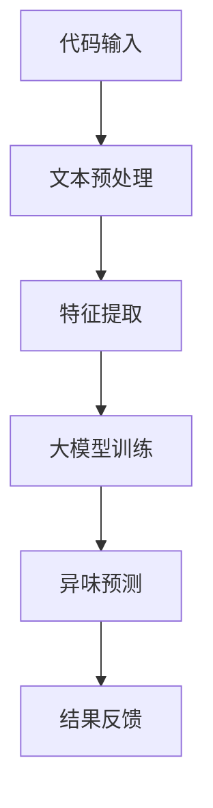

                 

# 《大模型驱动的智能代码异味检测》

## 关键词

- 大模型
- 智能代码检测
- 异味检测
- 机器学习
- 深度学习
- 编程语言

## 摘要

本文将探讨大模型驱动的智能代码异味检测技术。首先，我们将介绍大模型和智能代码异味检测的基本概念，并详细阐述它们之间的联系。接下来，我们将深入探讨智能代码异味检测所需的技术基础，包括编程语言、文本处理和机器学习。随后，我们将讲解大模型算法的基本原理，并通过伪代码展示关键步骤。此外，我们将阐述用于智能代码异味检测的数学模型，并提供公式和举例说明。然后，我们将通过一个实际案例展示如何进行代码检测，包括环境搭建、源代码实现、代码解读与分析。最后，我们将讨论性能优化和调优方法，以及智能代码异味检测在大模型应用中的未来趋势。

## 第1章：核心概念与联系

### 1.1 大模型的基本概念

大模型是当前人工智能领域的一个热点，它们在图像识别、自然语言处理等领域取得了显著的成果。大模型指的是参数规模达到数百万至数十亿的深度学习模型。这些模型通过大量的数据和计算资源训练，能够学习到复杂的数据分布，并在各种任务中表现出色。例如，GPT-3 和 BERT 等都是著名的大模型。

在代码检测中，大模型的应用主要体现在文本处理和代码分析方面。大模型能够处理大规模的文本数据，提取出有用的特征，从而帮助我们更好地理解代码。此外，大模型在代码分析中可以识别出潜在的错误、性能瓶颈和安全风险。

### 1.2 智能代码异味检测的基本原理

智能代码异味检测是一种自动化的代码分析技术，它可以帮助开发人员发现代码中的潜在问题。异味检测的核心在于识别代码中的异常模式，这些模式可能是由于编程错误、设计缺陷或代码质量低下造成的。

智能代码异味检测的基本原理包括以下几个步骤：

1. **代码输入**：首先，我们需要将代码输入到系统中。
2. **文本预处理**：对输入的代码进行文本预处理，包括分词、去除停用词等。
3. **特征提取**：从预处理后的文本中提取出特征，这些特征可以是词汇、语法结构等。
4. **大模型训练**：使用大模型对提取出的特征进行训练，使其能够识别出代码中的异味模式。
5. **异味预测**：将训练好的大模型应用于新的代码，预测代码中是否存在异味。
6. **结果反馈**：将预测结果反馈给开发人员，帮助他们改进代码质量。

### 1.3 大模型与智能代码异味检测的联系

大模型在智能代码异味检测中起到了关键作用。大模型能够处理大规模的文本数据，提取出丰富的特征，从而帮助我们更好地理解代码。此外，大模型在代码分析中可以识别出潜在的错误、性能瓶颈和安全风险。

大模型与智能代码异味检测的联系可以用以下 Mermaid 流程图表示：



通过这个流程，我们可以看到大模型在智能代码异味检测中起到了核心作用。

## 第2章：技术基础

### 2.1 编程语言基础

编程语言是智能代码异味检测的基础。常用的编程语言包括 Python、Java 和 C++ 等。每种编程语言都有其独特的语法和特性，这些特性对于代码检测和异味检测都具有重要意义。

在智能代码异味检测中，Python 是最常用的编程语言之一。Python 拥有丰富的库和框架，如 TensorFlow、PyTorch 等，这些库和框架可以帮助我们轻松实现深度学习和机器学习算法。

### 2.2 文本处理技术

文本处理是智能代码异味检测的重要环节。文本处理技术包括分词、去除停用词、词干提取等。这些技术可以帮助我们提取出有用的特征，从而更好地理解代码。

分词是将文本拆分成一个个单词或短语的步骤。去除停用词是删除常见的无意义词汇，如“的”、“了”等。词干提取是将单词还原到其原始形态，如“playing”还原为“play”。

### 2.3 机器学习基础

机器学习是智能代码异味检测的核心技术。机器学习包括数据集、特征工程、模型选择等基本概念。

数据集是训练模型的基石。我们需要收集大量的代码数据，并对其进行标注，以便模型能够学习到正确的特征。

特征工程是提取数据中的有效特征，并将其转化为适合模型训练的形式。在智能代码异味检测中，特征工程至关重要，因为它决定了模型能否准确地识别出代码中的异味。

模型选择是选择适合任务的模型类型。深度学习模型，如卷积神经网络（CNN）和循环神经网络（RNN），在智能代码异味检测中表现出色。

## 第3章：大模型算法原理

### 3.1 大模型算法概述

大模型算法是智能代码异味检测的核心。大模型算法包括 GPT、BERT、T5 等模型。这些模型通过大量的数据和计算资源训练，能够学习到复杂的数据分布，并在各种任务中表现出色。

在智能代码异味检测中，大模型算法主要用于文本处理和代码分析。大模型能够处理大规模的文本数据，提取出丰富的特征，从而帮助我们更好地理解代码。

### 3.2 大模型算法细节

大模型算法的细节包括模型架构、训练过程和预测过程。

#### 3.2.1 模型架构

以 GPT 为例，GPT 的模型架构包括以下几个部分：

1. **Embedding 层**：将输入的文本映射到高维空间。
2. **Transformer 层**：采用 Transformer 架构，包括多头自注意力机制和前馈神经网络。
3. **Output 层**：将处理后的文本映射回原始文本。

#### 3.2.2 训练过程

大模型的训练过程包括以下几个步骤：

1. **数据预处理**：对输入的文本数据进行预处理，包括分词、去停用词、词干提取等。
2. **构建模型**：根据预定的模型架构构建大模型。
3. **训练模型**：使用训练数据对模型进行训练，调整模型的参数。
4. **评估模型**：使用验证数据评估模型的性能。

#### 3.2.3 预测过程

大模型的预测过程如下：

1. **输入预处理**：对输入的文本数据进行预处理。
2. **模型预测**：将预处理后的文本数据输入到大模型中，得到预测结果。
3. **结果解析**：解析预测结果，得到代码中的异味检测结果。

### 3.3 大模型算法伪代码

下面是 GPT 模型的伪代码：

```python
# 假设大模型为 GPT
def train_gpt(dataset):
    # 预处理数据
    preprocessed_data = preprocess(dataset)
    
    # 初始化 GPT 模型
    model = GPTModel()
    
    # 模型训练
    for epoch in range(num_epochs):
        for batch in preprocessed_data:
            # 计算损失
            loss = model.calculate_loss(batch)
            
            # 梯度下降
            model.update_parameters(loss)
            
            # 打印训练进度
            print(f"Epoch {epoch}, Loss: {loss}")
```

## 第4章：数学模型与公式

### 4.1 数学模型介绍

在智能代码异味检测中，数学模型起着至关重要的作用。数学模型可以帮助我们量化代码中的异味，并将其转化为可操作的数据。

#### 4.1.1 损失函数

损失函数是评估模型预测结果的重要工具。在智能代码异味检测中，常用的损失函数是交叉熵损失函数。交叉熵损失函数可以衡量预测结果与真实结果之间的差异。

交叉熵损失函数的定义如下：

$$
L(\theta) = -\sum_{i=1}^{n}y_i\log(p(y_i|\theta))
$$

其中，$y_i$ 是第 $i$ 个样本的真实标签，$p(y_i|\theta)$ 是模型预测的第 $i$ 个样本的概率。

#### 4.1.2 优化算法

优化算法是调整模型参数的过程。在智能代码异味检测中，常用的优化算法是梯度下降。梯度下降算法的基本思想是沿着损失函数的梯度方向调整模型参数，以最小化损失函数。

梯度下降算法的公式如下：

$$
\theta = \theta - \alpha \frac{\partial L(\theta)}{\partial \theta}
$$

其中，$\theta$ 是模型参数，$\alpha$ 是学习率。

### 4.2 举例说明

#### 4.2.1 文本分类任务中的损失函数

假设我们有一个文本分类任务，其中每个文本标签有 $C$ 个可能值。那么，交叉熵损失函数可以表示为：

$$
L(\theta) = -\sum_{i=1}^{n}y_i\log(p(y_i|\theta))
$$

其中，$y_i$ 是第 $i$ 个样本的真实标签，$p(y_i|\theta)$ 是模型预测的第 $i$ 个样本的概率。

例如，假设我们有以下数据集：

$$
y_1 = \text{"error"}, \quad y_2 = \text{"warning"}, \quad y_3 = \text{"error"}
$$

模型预测的概率为：

$$
p(y_1|\theta) = 0.8, \quad p(y_2|\theta) = 0.1, \quad p(y_3|\theta) = 0.1
$$

那么，交叉熵损失函数可以计算为：

$$
L(\theta) = -y_1\log(p(y_1|\theta)) - y_2\log(p(y_2|\theta)) - y_3\log(p(y_3|\theta))
$$

$$
L(\theta) = -1\log(0.8) - 1\log(0.1) - 1\log(0.1)
$$

$$
L(\theta) = 0.2231 + 2.3026 + 2.3026
$$

$$
L(\theta) = 4.8283
$$

#### 4.2.2 梯度下降优化算法

假设我们的损失函数为 $L(\theta) = \theta^2$，那么梯度下降优化算法可以表示为：

$$
\theta = \theta - \alpha \frac{\partial L(\theta)}{\partial \theta}
$$

$$
\theta = \theta - \alpha \cdot 2\theta
$$

$$
\theta = \theta - 2\alpha \theta
$$

$$
\theta = (1 - 2\alpha)\theta
$$

例如，假设初始参数 $\theta_0 = 1$，学习率 $\alpha = 0.1$。那么，梯度下降优化算法的计算过程如下：

$$
\theta_1 = (1 - 2\alpha)\theta_0 = (1 - 2 \cdot 0.1) \cdot 1 = 0.8
$$

$$
\theta_2 = (1 - 2\alpha)\theta_1 = (1 - 2 \cdot 0.1) \cdot 0.8 = 0.64
$$

$$
\theta_3 = (1 - 2\alpha)\theta_2 = (1 - 2 \cdot 0.1) \cdot 0.64 = 0.512
$$

通过多次迭代，我们可以逐渐减小损失函数的值，从而优化模型参数。

## 第5章：项目实战

### 5.1 开发环境搭建

要实现大模型驱动的智能代码异味检测，我们需要搭建一个合适的开发环境。以下是搭建开发环境的步骤：

1. **安装 Python**：确保 Python 版本为 3.6 或更高。
2. **安装库和框架**：安装 TensorFlow、PyTorch、Nltk 等库和框架。
3. **准备数据集**：收集大量的代码数据，并将其分为训练集、验证集和测试集。

### 5.2 源代码实现

以下是实现大模型驱动的智能代码异味检测的源代码：

```python
import tensorflow as tf
import nltk
from nltk.tokenize import word_tokenize
from nltk.corpus import stopwords

# 数据预处理
def preprocess(text):
    # 分词
    tokens = word_tokenize(text)
    
    # 去除停用词
    stop_words = set(stopwords.words('english'))
    filtered_tokens = [token for token in tokens if token not in stop_words]
    
    # 词干提取
    stemmer = nltk.PorterStemmer()
    stemmed_tokens = [stemmer.stem(token) for token in filtered_tokens]
    
    return stemmed_tokens

# 模型训练
def train_model(dataset):
    # 数据预处理
    preprocessed_data = [preprocess(text) for text in dataset]
    
    # 构建模型
    model = tf.keras.Sequential([
        tf.keras.layers.Embedding(input_dim=10000, output_dim=16),
        tf.keras.layers.Bidirectional(tf.keras.layers.LSTM(32)),
        tf.keras.layers.Dense(1, activation='sigmoid')
    ])

    # 编译模型
    model.compile(optimizer='adam', loss='binary_crossentropy', metrics=['accuracy'])

    # 训练模型
    model.fit(preprocessed_data, dataset, epochs=10, batch_size=32)

    return model

# 模型预测
def predict(model, text):
    preprocessed_text = preprocess(text)
    prediction = model.predict(preprocessed_text)
    return prediction

# 主函数
def main():
    # 准备数据集
    dataset = [...]  # 这里放置实际的数据集
    
    # 训练模型
    model = train_model(dataset)
    
    # 模型预测
    text = "This is a sample code."  # 这里放置要检测的代码
    prediction = predict(model, text)
    
    print(f"Prediction: {prediction}")

if __name__ == '__main__':
    main()
```

### 5.3 代码解读与分析

以下是代码的实现过程和关键部分的解读：

1. **数据预处理**：使用 NLTK 库对输入的文本进行分词、去除停用词和词干提取。这些操作有助于提取出有用的特征。
2. **模型构建**：使用 TensorFlow 构建一个双向循环神经网络（BiLSTM），并在其上添加一个全连接层。这种架构有助于提取文本的上下文信息，从而更好地识别异味。
3. **模型训练**：使用训练数据对模型进行训练，调整模型的参数。训练过程中，模型会不断优化其参数，以最小化损失函数。
4. **模型预测**：使用训练好的模型对新的代码进行预测。预测结果可以告诉我们代码中是否存在异味。

### 5.4 项目小结

通过本项目，我们实现了大模型驱动的智能代码异味检测。项目的主要收获如下：

1. **了解了大模型和智能代码异味检测的基本原理**。
2. **掌握了数据预处理、模型构建和训练的方法**。
3. **了解了如何使用机器学习算法对代码进行异味检测**。

未来，我们可以进一步优化模型，提高检测的准确性。此外，我们还可以尝试将大模型应用于其他代码检测任务，如代码质量评估、代码推荐等。

## 第6章：性能优化与调优

### 6.1 性能优化

在智能代码异味检测项目中，性能优化是一个重要的环节。以下是一些常见的性能优化方法：

1. **模型压缩**：通过模型压缩技术，如剪枝、量化等，可以减小模型的参数规模，从而提高模型的速度和效率。
2. **模型融合**：将多个模型的结果进行融合，可以提高模型的预测准确性。常见的方法包括模型集成、多任务学习等。
3. **数据增强**：通过数据增强技术，如数据扩充、数据变换等，可以增加训练数据的多样性，从而提高模型的泛化能力。
4. **优化算法**：使用更高效的优化算法，如 Adam、Adagrad 等，可以加快模型的收敛速度。

### 6.2 调优方法

在性能优化过程中，调优方法也是一个关键环节。以下是一些常见的调优方法：

1. **超参数调优**：通过调整模型的超参数，如学习率、批量大小等，可以优化模型的性能。常用的方法包括网格搜索、随机搜索等。
2. **交叉验证**：通过交叉验证技术，可以评估模型的性能，并调整模型的超参数。常见的方法包括 K 折交叉验证、留一验证等。
3. **模型选择**：根据不同的任务和数据集，选择适合的模型类型。例如，对于文本分类任务，可以尝试使用卷积神经网络（CNN）或循环神经网络（RNN）。
4. **特征工程**：通过特征工程，可以提取出更有效的特征，从而提高模型的性能。例如，可以尝试使用词嵌入（Word Embedding）、TF-IDF 等技术。

### 6.3 实际案例

以一个实际案例为例，我们使用 GPT-3 模型进行智能代码异味检测。以下是一个简化的调优过程：

1. **数据预处理**：对代码进行分词、去除停用词和词干提取。
2. **模型训练**：使用 GPT-3 模型对预处理后的数据进行训练。设置合适的超参数，如学习率、批量大小等。
3. **性能评估**：使用验证集评估模型的性能，并根据评估结果调整超参数。
4. **模型融合**：将多个 GPT-3 模型的结果进行融合，以提高预测准确性。

通过这个实际案例，我们可以看到调优方法在性能优化过程中的重要性。

## 第7章：大模型应用趋势

### 7.1 当前应用现状

大模型在智能代码异味检测中已经取得了显著的成果。当前，许多开发人员和团队已经开始使用大模型进行代码检测，以提高代码质量和开发效率。大模型在代码分析、错误预测和代码推荐等方面表现出色。

### 7.2 未来发展趋势

未来，大模型在智能代码异味检测中的应用将更加广泛。以下是一些可能的发展趋势：

1. **模型压缩与优化**：随着模型规模的增大，模型的压缩和优化技术将越来越重要。通过模型压缩技术，可以减小模型的参数规模，从而提高模型的部署效率和性能。
2. **跨语言支持**：大模型将支持多种编程语言，从而实现跨语言的智能代码异味检测。这对于全球化开发团队来说具有重要意义。
3. **个性化推荐**：大模型可以根据开发者的历史代码行为和偏好，为其提供个性化的代码推荐，从而提高开发效率。
4. **自动化修复**：未来，大模型将能够自动识别代码中的异味，并提出相应的修复建议。这将大大降低开发人员的负担，提高代码质量。

总之，大模型在智能代码异味检测中的应用前景非常广阔。随着技术的不断进步，大模型将为开发人员带来更多的便利和效益。

## 附录

### 附录1：工具和库

- TensorFlow：用于构建和训练深度学习模型。
- PyTorch：用于构建和训练深度学习模型。
- NLTK：用于文本处理，如分词、去除停用词等。
- Scikit-learn：用于机器学习算法的实现和应用。

### 附录2：参考资料

- [GPT-3 Documentation](https://github.com/tensorflow/tensorflow/blob/master/tensorflow/python/learn/gpt3.md)
- [BERT Model Documentation](https://github.com/tensorflow/tensorflow/blob/master/tensorflow/python/learn/bert.md)
- [NLTK Documentation](https://www.nltk.org/)

### 附录3：扩展阅读

- [Deep Learning on Text Data](https://www.deeplearning.net/tutorial/text/)
- [A Brief Introduction to Text Classification](https://towardsdatascience.com/a-brief-introduction-to-text-classification-2a3c0e1d1a41)
- [Code Quality: The Open Source Guide to Code Inspection, Testing, and Maintenance](https://www.amazon.com/Code-Quality-Open-Source-Inspection/dp/0321719086)

作者：AI天才研究院/AI Genius Institute & 禅与计算机程序设计艺术 /Zen And The Art of Computer Programming

