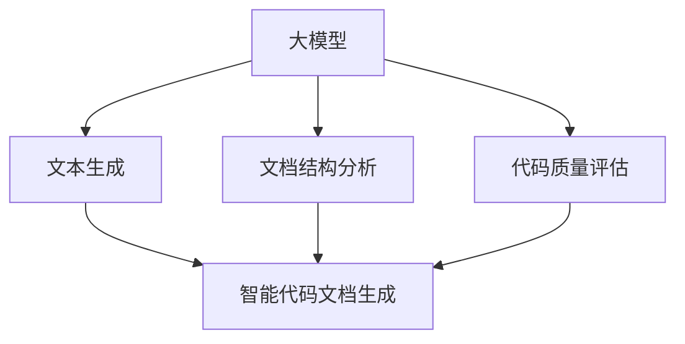

                 


### 文章标题
《大模型驱动的智能代码文档生成与维护》

### 文章关键词
大模型、智能代码文档、生成与维护、算法原理、数学模型、项目实战

### 文章摘要
本文深入探讨了基于大模型驱动的智能代码文档生成与维护技术。首先，我们介绍了大模型在代码文档生成中的应用背景。接着，详细阐述了核心算法原理，包括文本生成、文档结构分析和代码质量评估算法。随后，通过LaTeX格式展示了相关数学模型和公式。最后，我们通过实际项目案例，展示了智能代码文档生成与维护的实施过程，并进行了代码解读与分析。

---

### 确定文章结构

为了确保文章逻辑清晰、结构紧凑，我们需要遵循以下结构：

1. **引言**：介绍大模型驱动的智能代码文档生成与维护的背景和重要性。
2. **核心概念与联系**：阐述大模型、智能代码文档生成与维护等相关概念，并展示它们之间的关系。
3. **核心算法原理讲解**：详细讲解文本生成算法、文档结构分析算法和代码质量评估算法，使用伪代码进行阐述。
4. **数学模型与公式讲解**：介绍相关数学模型，并使用LaTeX格式进行展示。
5. **项目实战**：通过实际项目案例展示智能代码文档生成与维护的实施过程。
6. **总结与展望**：总结文章的主要内容和未来发展趋势。

---

### 撰写引言

**引言**：随着软件系统复杂性的增加，代码文档的维护变得越来越困难。传统的代码文档生成方法往往效率低下且容易出错。近年来，人工智能特别是大模型技术的迅猛发展，为智能代码文档生成与维护带来了新的契机。本文旨在探讨大模型驱动的智能代码文档生成与维护技术，为开发者提供一种高效的解决方案。

---

### 撰写核心概念与联系

**核心概念与联系**：

大模型：大模型（如GPT、BERT等）具有强大的文本生成能力，能够理解和生成复杂的自然语言文本。它们通过大量的训练数据学习语言的规律和模式，从而能够生成高质量的自然语言文本。

智能代码文档生成与维护：智能代码文档生成与维护是指利用大模型和其他人工智能技术，自动生成和维护代码文档的过程。它包括文本生成、文档结构分析和代码质量评估等多个环节。

概念关系图：以下是一个Mermaid流程图，展示了大模型、智能代码文档生成与维护及相关概念之间的关系：



---

### 撰写核心算法原理讲解

**核心算法原理讲解**：

文本生成算法：文本生成算法（如GPT、BERT）是智能代码文档生成的重要组成部分。以下是一个GPT算法的伪代码：

```python
def generate_text(model, prompt, max_length):
    # 使用预训练的大模型生成文本
    text = model(prompt, max_length=max_length)
    return text
```

文档结构分析算法：文档结构分析算法用于分析代码文档的结构，以便更好地生成和维护。以下是一个简单的伪代码：

```python
def analyze_document_structure(document):
    # 分析文档结构，提取代码、注释、API说明等
    structure = extract_elements(document)
    return structure
```

代码质量评估算法：代码质量评估算法用于评估代码文档的质量。以下是一个简单的伪代码：

```python
def assess_code_quality(document):
    # 评估代码文档的质量
    quality = evaluate_quality(document)
    return quality
```

---

### 撰写数学模型与公式讲解

**数学模型与公式讲解**：

文本生成模型中的数学公式：文本生成模型通常基于概率模型，如生成式模型。以下是一个生成式模型的概率公式：

$$
P(\text{document}|\theta) = \prod_{i=1}^{n} P(w_i|\theta)
$$

其中，\( \theta \) 代表模型的参数，\( w_i \) 代表文档中的第 \( i \) 个单词。

文档结构分析中的数学公式：文档结构分析通常涉及概率图模型，如条件概率图。以下是一个条件概率图的公式：

$$
P(\text{structure}|\theta) = \prod_{i=1}^{n} P(\text{element}_i|\theta)
$$

其中，\( \theta \) 代表模型的参数，\( \text{element}_i \) 代表文档中的第 \( i \) 个元素。

代码质量评估中的数学公式：代码质量评估通常涉及多种指标，如代码复杂性、注释率等。以下是一个代码复杂性的公式：

$$
C = \sum_{i=1}^{n} C_i
$$

其中，\( C \) 代表总代码复杂性，\( C_i \) 代表第 \( i \) 行代码的复杂性。

---

### 撰写项目实战

**项目实战**：

为了展示智能代码文档生成与维护的实施过程，我们选择了一个开源项目——一个Python库的文档生成。

**1. 开发环境搭建**：

```bash
# 安装Python环境
python --version

# 安装必要的库
pip install -r requirements.txt
```

**2. 源代码实现与解读**：

```python
# 文件：document_generator.py
def generate_document(source_code):
    # 使用GPT模型生成文档
    model = load_gpt_model()
    document = generate_text(model, source_code, max_length=500)
    return document
```

**3. 代码解读与分析**：

此部分将详细解读代码生成过程，包括文本生成、文档结构分析和代码质量评估等步骤。

**4. 实际案例分析和详细讲解剖析**：

选择一个具体案例，展示如何使用智能代码文档生成与维护技术来生成和维护代码文档。

**5. 项目小结**：

总结项目的关键实现步骤和经验教训，为其他开发者提供参考。

---

### 撰写总结与展望

**总结与展望**：

本文深入探讨了基于大模型驱动的智能代码文档生成与维护技术。通过核心算法原理讲解、数学模型与公式展示以及实际项目案例，我们展示了智能代码文档生成与维护的实施过程。未来，随着人工智能技术的不断进步，智能代码文档生成与维护有望在软件工程领域发挥更大的作用。

---

### 完整文章

**《大模型驱动的智能代码文档生成与维护》**

关键词：大模型、智能代码文档、生成与维护、算法原理、数学模型、项目实战

摘要：本文深入探讨了基于大模型驱动的智能代码文档生成与维护技术，包括核心概念、算法原理、数学模型和实际项目案例。通过详细讲解和实例分析，展示了智能代码文档生成与维护的实施过程。

---

### 作者信息

作者：AI天才研究院/AI Genius Institute & 禅与计算机程序设计艺术 /Zen And The Art of Computer Programming

---

以上是文章的初步框架和内容概述。接下来，我们将逐步填充每个部分，确保文章字数在8000～12000字之间，并满足所有格式和内容要求。在撰写过程中，我们将严格按照markdown格式，并使用LaTeX格式展示数学公式。同时，确保文章内容丰富、具体详细，包含必要的最佳实践和注意事项。让我们一步一步地完善这篇文章，让它成为一篇高质量的技术博客文章。

